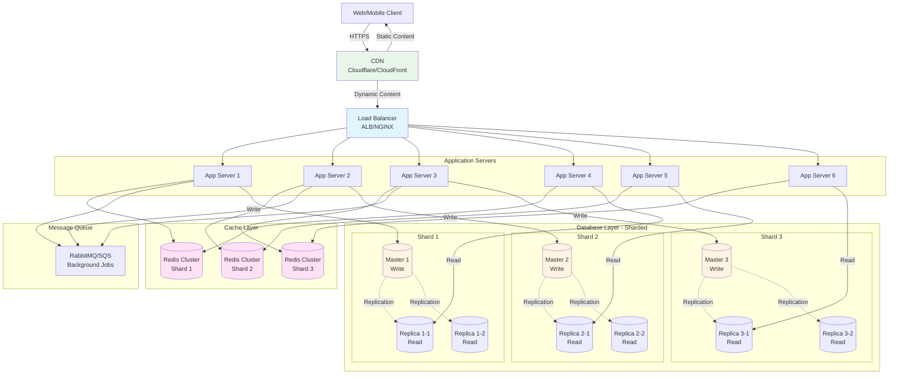

# 段階4: 100,000-1,000,000ユーザー - 中規模

## 1. この段階の特徴

### ユーザー数範囲
- **100,000-1,000,000ユーザー**
- 日間アクティブユーザー（DAU）: 約50,000-500,000人
- 1日のリクエスト数: 約1,000,000-10,000,000リクエスト
- ピーク時の同時接続数: 約5,000-50,000接続

### 典型的な課題
- **データベースのボトルネック**: 単一データベースでは処理しきれない
- **データの分散**: 大量のデータを効率的に管理
- **クエリパフォーマンス**: 複雑なクエリの最適化
- **キャッシュ戦略**: より高度なキャッシュ戦略が必要

### 実例サービス
- **成長期のFacebook（2006-2007年）**: データベースシャーディングの導入
- **成長期のTwitter（2009-2010年）**: 読み取りレプリカの拡張とシャーディングの検討

## 2. 追加すべき技術・設計

### 2.1 インフラ

**アプリケーションサーバーの拡張**
- 8-12台のアプリケーションサーバー
- 自動スケーリングの設定（CPU使用率60%を超えた場合）
- 複数の可用性ゾーンに分散

**ロードバランサーの最適化**
- 複数のロードバランサー（リージョンごと）
- ヘルスチェックの最適化（5秒間隔）
- 接続の再利用とKeep-Alive

### 2.2 データベース

**データベースシャーディングの導入**
- データを複数のシャードに分割
- シャーディングキーの選択（ユーザーID、地理的位置など）
- シャード間のクエリの処理

**シャーディング戦略**
- **水平シャーディング**: データを行単位で分割
- **垂直シャーディング**: データを列単位で分割
- **ハッシュベース**: ハッシュ関数でシャードを決定
- **範囲ベース**: 範囲でシャードを決定

**読み取り専用レプリカの拡張**
- 読み取りレプリカを4-8台に増やす
- シャードごとに読み取りレプリカを配置
- 読み取りクエリをレプリカに分散

**データベース接続プールの最適化**
- 接続プールのサイズを調整（max connections: 100-200）
- シャードごとの接続プール
- 接続の再利用とタイムアウト設定

### 2.3 キャッシュ

**キャッシュ戦略の高度化**
- **Write-Through**: 書き込み時にキャッシュとデータベースの両方に書き込み
- **Write-Behind**: 非同期でデータベースに書き込み
- **Cache-Aside**: アプリケーションがキャッシュを管理
- **Read-Through**: キャッシュがデータベースから読み取り

**キャッシュの階層化**
- **L1 Cache**: アプリケーション内キャッシュ（メモリ）
- **L2 Cache**: Redis（分散キャッシュ）
- **L3 Cache**: CDN（静的コンテンツ）

**キャッシュの分散**
- Redisクラスターの構築
- シャードごとのキャッシュ
- キャッシュの無効化戦略

### 2.4 負荷分散

**CDNの最適化**
- 動的コンテンツのキャッシュ（APIレスポンス）
- キャッシュポリシーの最適化
- エッジロケーションの拡張

**ロードバランサーの最適化**
- 複数のロードバランサー（リージョンごと）
- ヘルスチェックの最適化
- SSL/TLS終端処理の最適化

### 2.5 モニタリング

**詳細なメトリクスの収集**
- **アプリケーションメトリクス**: レスポンス時間、エラー率、スループット
- **インフラメトリクス**: CPU、メモリ、ディスク、ネットワーク
- **データベースメトリクス**: 接続数、クエリ時間、レプリケーションラグ、シャードごとのメトリクス
- **キャッシュメトリクス**: ヒット率、ミス率、レイテンシ、シャードごとのメトリクス

**アラートの設定**
- エラー率が2%を超えた場合
- レスポンス時間が300msを超えた場合
- データベース接続数が上限の70%を超えた場合
- キャッシュヒット率が75%を下回った場合
- シャード間の負荷の不均衡

**ダッシュボードの作成**
- リアルタイムダッシュボード（Grafana、Datadog）
- シャードごとのメトリクス
- トレンド分析と予測

### 2.6 セキュリティ

**APIレート制限**
- APIエンドポイントごとのレート制限
- ユーザーごとのレート制限
- IPアドレスベースのレート制限
- より細かいレート制限（1分、1時間、1日）

**データベースセキュリティ**
- シャードごとのアクセス制御
- データの暗号化（保存時と転送時）
- 監査ログの記録

**DDoS対策**
- CDNによるDDoS対策（Cloudflare、AWS Shield）
- レート制限による保護
- IPホワイトリスト/ブラックリスト
- 異常なトラフィックパターンの検出

### 2.7 アーキテクチャ

**シャーディングの実装**
- シャーディングキーの選択と管理
- シャード間のクエリの処理
- シャードの追加と再バランス

**データの一貫性**
- シャード間のトランザクションの処理
- 最終的な一貫性の保証
- データの整合性チェック

## 3. アーキテクチャ図



**説明**:
- データベースが3つのシャードに分割され、各シャードにマスターと読み取りレプリカが配置
- Redisクラスターがシャードごとに分散
- アプリケーションサーバーが6台に増加し、シャードごとにルーティング

## 4. 実例ケーススタディ

### 4.1 Facebookの成長期（2006-2007年）

**背景**:
- 2006年にユーザー数が急増（1,000,000ユーザーを突破）
- 単一データベースでは処理しきれなくなり、パフォーマンスが低下
- データベースのボトルネックが深刻化

**導入した技術**:
- **データベースシャーディング**: MySQLの水平シャーディングを導入
- **シャーディングキー**: ユーザーIDをベースにシャードを決定
- **読み取りレプリカ**: 各シャードに2-3台の読み取りレプリカを配置
- **Memcached**: キャッシュ層を拡張し、データベースの負荷を軽減

**シャーディング戦略**:
- **ユーザーIDベース**: ユーザーIDをハッシュしてシャードを決定
- **地理的シャーディング**: ユーザーの地理的位置に基づいてシャードを決定（後期）

**効果**:
- データベースのパフォーマンスが大幅に改善
- スケーラビリティが向上し、より多くのユーザーに対応可能
- データベースの負荷が分散され、可用性が向上

**学び**:
- シャーディングキーの選択が重要
- シャード間のクエリを避ける設計が重要
- シャードの追加と再バランスの計画が必要

### 4.2 Twitterの成長期（2009-2010年）

**背景**:
- 2009年にユーザー数が急増（1,000,000ユーザーを突破）
- タイムラインの読み込みが遅延
- データベースの読み取り負荷が高い

**導入した技術**:
- **読み取りレプリカの拡張**: MySQLの読み取りレプリカを4-8台に増加
- **キャッシュ戦略の高度化**: Memcachedのクラスターを構築
- **クエリの最適化**: スロークエリログの分析とインデックスの追加
- **シャーディングの検討**: 将来的なシャーディングの準備

**効果**:
- タイムラインの読み込み時間が50%短縮
- データベースの読み取り負荷が分散
- スケーラビリティが向上

**学び**:
- 読み取りレプリカの拡張は効果的だが、限界がある
- シャーディングの準備を早期に開始することが重要

## 5. 実装のヒント

### 5.1 設定例

**シャーディングの実装（Node.js）**

```javascript
const crypto = require('crypto');

// シャーディングキーからシャードを決定
function getShard(userId, totalShards) {
  const hash = crypto.createHash('md5').update(userId.toString()).digest('hex');
  const shardIndex = parseInt(hash.substring(0, 8), 16) % totalShards;
  return shardIndex;
}

// シャードごとのデータベース接続プール
const shardPools = {
  0: new Pool({ connectionString: process.env.DATABASE_SHARD_0_URL }),
  1: new Pool({ connectionString: process.env.DATABASE_SHARD_1_URL }),
  2: new Pool({ connectionString: process.env.DATABASE_SHARD_2_URL }),
};

// ユーザーデータの取得
async function getUser(userId) {
  const shard = getShard(userId, 3);
  const pool = shardPools[shard];
  const result = await pool.query('SELECT * FROM users WHERE id = $1', [userId]);
  return result.rows[0];
}

// ユーザーデータの作成
async function createUser(userData) {
  const userId = generateUserId();
  const shard = getShard(userId, 3);
  const pool = shardPools[shard];
  const result = await pool.query(
    'INSERT INTO users (id, name, email) VALUES ($1, $2, $3) RETURNING *',
    [userId, userData.name, userData.email]
  );
  return result.rows[0];
}
```

**シャード間のクエリの処理**

```javascript
// 複数のシャードにまたがるクエリ（非推奨だが必要な場合）
async function getAllUsers() {
  const promises = Object.values(shardPools).map(pool =>
    pool.query('SELECT * FROM users')
  );
  const results = await Promise.all(promises);
  return results.flatMap(result => result.rows);
}

// より効率的な方法: キャッシュを使用
async function getAllUsers() {
  const cacheKey = 'all_users';
  const cached = await client.get(cacheKey);
  if (cached) {
    return JSON.parse(cached);
  }
  
  const promises = Object.values(shardPools).map(pool =>
    pool.query('SELECT * FROM users')
  );
  const results = await Promise.all(promises);
  const users = results.flatMap(result => result.rows);
  
  await client.setex(cacheKey, 3600, JSON.stringify(users));
  return users;
}
```

**Redisクラスターの設定**

```javascript
const Redis = require('ioredis');

// Redisクラスターの接続
const cluster = new Redis.Cluster([
  { host: 'redis-1.example.com', port: 6379 },
  { host: 'redis-2.example.com', port: 6379 },
  { host: 'redis-3.example.com', port: 6379 },
], {
  redisOptions: {
    password: process.env.REDIS_PASSWORD,
  },
  clusterRetryStrategy: (times) => {
    const delay = Math.min(times * 50, 2000);
    return delay;
  },
});

// キャッシュの使用
async function getUser(userId) {
  const cacheKey = `user:${userId}`;
  const cached = await cluster.get(cacheKey);
  if (cached) {
    return JSON.parse(cached);
  }
  
  const user = await getUserFromDatabase(userId);
  await cluster.setex(cacheKey, 3600, JSON.stringify(user));
  return user;
}
```

### 5.2 コード例（簡略）

**シャードの追加と再バランス**

```javascript
// シャードの追加（将来的な拡張）
async function addShard(newShardIndex, newShardUrl) {
  // 新しいシャードの接続プールを追加
  shardPools[newShardIndex] = new Pool({ connectionString: newShardUrl });
  
  // 既存のデータを新しいシャードに移行（バックグラウンドジョブ）
  await migrateDataToNewShard(newShardIndex);
}

// データの移行（バックグラウンドジョブ）
async function migrateDataToNewShard(newShardIndex) {
  // すべてのシャードからデータを取得
  const allUsers = await getAllUsers();
  
  // 新しいシャードに属するデータを移行
  for (const user of allUsers) {
    const targetShard = getShard(user.id, Object.keys(shardPools).length);
    if (targetShard === newShardIndex) {
      // データを新しいシャードにコピー
      await copyUserToShard(user, newShardIndex);
    }
  }
}
```

**キャッシュの無効化（シャード対応）**

```javascript
async function updateUser(userId, updates) {
  const shard = getShard(userId, 3);
  
  // データベースを更新
  await shardPools[shard].query(
    'UPDATE users SET name = $1, email = $2 WHERE id = $3',
    [updates.name, updates.email, userId]
  );
  
  // キャッシュを無効化
  await cluster.del(`user:${userId}`);
  await cluster.del('all_users'); // グローバルキャッシュも無効化
}
```

## 6. コスト見積もり

### 6.1 典型的なコスト

**AWSの場合**
- **CloudFront（CDN）**: $100-200/月
- **Application Load Balancer**: $30-50/月
- **EC2インスタンス（t3.large × 8）**: $400-600/月
- **RDS（db.t3.large × 3シャード + 読み取りレプリカ × 6）**: $1,200-1,800/月
- **ElastiCache（cache.t3.medium × 3）**: $150-200/月
- **SQS（メッセージキュー）**: $5-10/月
- **S3（ストレージ）**: $50-100/月
- **合計**: 約$1,935-2,960/月

**GCPの場合**
- **Cloud CDN**: $100-200/月
- **Cloud Load Balancing**: $30-50/月
- **Compute Engine（n1-standard-4 × 8）**: $800-1,200/月
- **Cloud SQL（db-n1-standard-4 × 3シャード + 読み取りレプリカ × 6）**: $1,500-2,000/月
- **Memorystore（Redis Standard × 3）**: $300-400/月
- **Cloud Pub/Sub**: $10-20/月
- **Cloud Storage**: $50-100/月
- **合計**: 約$2,790-3,970/月

### 6.2 コスト最適化

1. **シャードの最適化**: シャード数を適切に設定し、リソースを効率的に使用
2. **読み取りレプリカの最適化**: 必要な数の読み取りレプリカを配置
3. **キャッシュの最適化**: キャッシュヒット率を向上させ、データベース負荷を軽減
4. **自動スケーリング**: トラフィックに応じてサーバー数を調整

## 7. 次の段階への準備

次の段階（100万-1,000万ユーザー）では、以下の技術が必要になります：

1. **マイクロサービス化**: サービスを複数のマイクロサービスに分割
2. **API Gatewayの導入**: マイクロサービス間の通信を管理
3. **イベント駆動アーキテクチャ**: サービス間の非同期通信
4. **複数リージョン展開**: グローバルな展開

**準備すべきこと**:
- サービス境界の定義（ドメイン駆動設計）
- API Gatewayの設計
- イベントストリーミングの準備
- マルチリージョン展開の計画

---

**次のステップ**: [段階5: 100万-1,000万ユーザー](./stage_05_1m_to_10m_users.md)でマイクロサービス化を学ぶ

