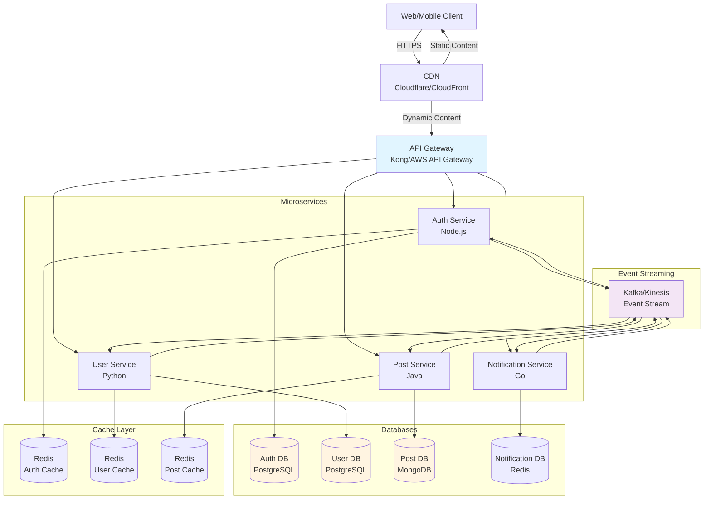

# 段階5: 100万-1,000万ユーザー - 大規模

## 1. この段階の特徴

### ユーザー数範囲
- **100万-1,000万ユーザー**
- 日間アクティブユーザー（DAU）: 約500,000-5,000,000人
- 1日のリクエスト数: 約10,000,000-100,000,000リクエスト
- ピーク時の同時接続数: 約50,000-500,000接続

### 典型的な課題
- **モノリシックアプリケーションの限界**: 単一アプリケーションでは対応しきれない
- **チーム間の協調**: 複数のチームが同じコードベースで作業する困難
- **デプロイメントのリスク**: 1つの変更が全体に影響
- **スケーリングの非効率**: すべての機能を同じようにスケールできない

### 実例サービス
- **Netflix（2010-2012年）**: モノリシックからマイクロサービスへの移行
- **Amazon（2000年代後半）**: サービス指向アーキテクチャ（SOA）の導入

## 2. 追加すべき技術・設計

### 2.1 インフラ

**マイクロサービスアーキテクチャ**
- サービスを複数のマイクロサービスに分割
- 各サービスが独立してデプロイ可能
- サービスごとにスケーリング

**コンテナオーケストレーション**
- KubernetesまたはDocker Swarmの導入
- コンテナの自動スケーリング
- サービスの自動復旧

**推奨プラットフォーム**
- **Kubernetes**: 最も一般的なオーケストレーションプラットフォーム
- **AWS ECS/EKS**: AWS環境でのコンテナ管理
- **GCP GKE**: GCP環境でのコンテナ管理
- **Azure AKS**: Azure環境でのコンテナ管理

### 2.2 データベース

**サービスごとのデータベース**
- 各マイクロサービスが独自のデータベースを持つ
- データベースの種類を選択（RDBMS、NoSQL、時系列DBなど）
- サービス間のデータ共有はAPI経由

**データベースの種類**
- **RDBMS**: PostgreSQL、MySQL（トランザクションが必要な場合）
- **NoSQL**: MongoDB、Cassandra（スケーラビリティが必要な場合）
- **時系列DB**: InfluxDB、TimescaleDB（時系列データの場合）
- **キャッシュ**: Redis、Memcached（高速アクセスが必要な場合）

**データの一貫性**
- サービス間のトランザクションはSagaパターンを使用
- 最終的な一貫性を保証
- イベントソーシングの検討

### 2.3 キャッシュ

**分散キャッシュ**
- 各サービスが独自のキャッシュを持つ
- サービス間のキャッシュ共有はAPI経由
- キャッシュの無効化戦略

**キャッシュの階層化**
- **L1 Cache**: アプリケーション内キャッシュ
- **L2 Cache**: Redis（サービスごと）
- **L3 Cache**: CDN（静的コンテンツ）

### 2.4 負荷分散

**API Gatewayの導入**
- すべてのリクエストがAPI Gatewayを経由
- ルーティング、認証、レート制限を一元管理
- サービス間の通信を管理

**推奨サービス**
- **AWS API Gateway**: AWS環境でのAPI管理
- **Kong**: オープンソースのAPI Gateway
- **NGINX**: リバースプロキシとして使用
- **Envoy**: サービスメッシュプロキシ

### 2.5 モニタリング

**分散トレーシング**
- リクエストが複数のサービスを通過する際の追跡
- OpenTracing、Jaeger、Zipkinなどの使用
- パフォーマンスボトルネックの特定

**サービスメッシュ**
- サービス間の通信を管理
- ロードバランシング、リトライ、サーキットブレーカー
- Istio、Linkerd、Consul Connectなどの使用

**メトリクスの収集**
- サービスごとのメトリクス
- 分散トレーシングのメトリクス
- サービス間の通信メトリクス

### 2.6 セキュリティ

**サービス間の認証**
- mTLS（相互TLS）の使用
- APIキーまたはJWTトークンの使用
- サービスメッシュによる認証

**認可**
- サービスごとの認可ポリシー
- OAuth 2.0、OpenID Connectの使用
- ロールベースアクセス制御（RBAC）

### 2.7 アーキテクチャ

**イベント駆動アーキテクチャ**
- サービス間の非同期通信
- イベントストリーミング（Kafka、AWS Kinesis）
- イベントソーシングの検討

**CQRS（Command Query Responsibility Segregation）**
- 読み取りと書き込みの分離
- 読み取り専用のデータストア
- 書き込み専用のデータストア

**Sagaパターン**
- 分散トランザクションの管理
- 補償トランザクションの実装
- 最終的な一貫性の保証

## 3. アーキテクチャ図



**説明**:
- API Gatewayがすべてのリクエストを管理し、適切なマイクロサービスにルーティング
- 各サービスが独自のデータベースとキャッシュを持つ
- Kafkaなどのイベントストリーミングでサービス間の非同期通信を実現

## 4. 実例ケーススタディ

### 4.1 Netflixのマイクロサービス移行（2010-2012年）

**背景**:
- 2010年頃、モノリシックアプリケーションでは対応しきれなくなった
- 複数のチームが同じコードベースで作業する困難
- デプロイメントのリスクが高かった

**導入した技術**:
- **マイクロサービスアーキテクチャ**: サービスを100以上のマイクロサービスに分割
- **API Gateway**: Zuulを導入し、すべてのリクエストを管理
- **イベントストリーミング**: Kafkaを導入し、サービス間の非同期通信を実現
- **コンテナオーケストレーション**: 独自のTitusプラットフォームを構築

**サービス分割の例**:
- **ユーザーサービス**: ユーザー情報の管理
- **レコメンデーションサービス**: コンテンツの推薦
- **ストリーミングサービス**: 動画のストリーミング
- **支払いサービス**: 決済処理

**効果**:
- デプロイメントの頻度が大幅に増加（1日数千回）
- チーム間の独立性が向上
- スケーラビリティが向上
- 障害の影響範囲が限定

**学び**:
- マイクロサービス化は複雑だが、長期的には価値がある
- サービス境界の定義が重要
- モニタリングと分散トレーシングが不可欠

### 4.2 Amazonのサービス指向アーキテクチャ（2000年代後半）

**背景**:
- 2000年代後半、モノリシックアプリケーションでは対応しきれなくなった
- 複数のチームが同じコードベースで作業する困難
- スケーリングの非効率

**導入した技術**:
- **サービス指向アーキテクチャ（SOA）**: サービスを複数のサービスに分割
- **API Gateway**: サービス間の通信を管理
- **メッセージキュー**: SQSを導入し、サービス間の非同期通信を実現
- **データベースの分離**: サービスごとにデータベースを分離

**サービス分割の例**:
- **商品カタログサービス**: 商品情報の管理
- **在庫サービス**: 在庫の管理
- **注文サービス**: 注文の処理
- **支払いサービス**: 決済処理

**効果**:
- チーム間の独立性が向上
- スケーラビリティが向上
- 障害の影響範囲が限定
- 開発速度が向上

**学び**:
- サービス境界の定義が重要
- サービス間の通信を最小限に抑える
- データの一貫性を保証する仕組みが必要

## 5. 実装のヒント

### 5.1 設定例

**API Gateway設定（Kong）**

```yaml
# kong.yml
_format_version: "3.0"

services:
  - name: user-service
    url: http://user-service:3000
    routes:
      - name: user-routes
        paths:
          - /api/users
        methods:
          - GET
          - POST
          - PUT
          - DELETE
    plugins:
      - name: rate-limiting
        config:
          minute: 100
          hour: 1000
      - name: jwt
        config:
          secret_is_base64: false

  - name: post-service
    url: http://post-service:3000
    routes:
      - name: post-routes
        paths:
          - /api/posts
        methods:
          - GET
          - POST
          - PUT
          - DELETE
```

**Kubernetes設定（Deployment）**

```yaml
apiVersion: apps/v1
kind: Deployment
metadata:
  name: user-service
spec:
  replicas: 3
  selector:
    matchLabels:
      app: user-service
  template:
    metadata:
      labels:
        app: user-service
    spec:
      containers:
      - name: user-service
        image: user-service:latest
        ports:
        - containerPort: 3000
        env:
        - name: DATABASE_URL
          valueFrom:
            secretKeyRef:
              name: user-db-secret
              key: url
        resources:
          requests:
            memory: "256Mi"
            cpu: "250m"
          limits:
            memory: "512Mi"
            cpu: "500m"
---
apiVersion: v1
kind: Service
metadata:
  name: user-service
spec:
  selector:
    app: user-service
  ports:
  - protocol: TCP
    port: 80
    targetPort: 3000
```

**イベントストリーミング（Kafka）**

```javascript
const kafka = require('kafkajs');

const client = kafka({
  clientId: 'user-service',
  brokers: ['kafka1:9092', 'kafka2:9092', 'kafka3:9092']
});

const producer = client.producer();
const consumer = client.consumer({ groupId: 'user-service-group' });

// イベントを送信
async function publishEvent(topic, event) {
  await producer.connect();
  await producer.send({
    topic: topic,
    messages: [
      { value: JSON.stringify(event) }
    ]
  });
}

// イベントを受信
async function consumeEvents() {
  await consumer.connect();
  await consumer.subscribe({ topic: 'user-events' });
  
  await consumer.run({
    eachMessage: async ({ topic, partition, message }) => {
      const event = JSON.parse(message.value.toString());
      await handleEvent(event);
    }
  });
}
```

### 5.2 コード例（簡略）

**マイクロサービス間の通信**

```javascript
// User Service
const axios = require('axios');

async function getUserWithPosts(userId) {
  // ユーザー情報を取得
  const user = await getUser(userId);
  
  // Post Serviceから投稿を取得
  const posts = await axios.get(`http://post-service/api/users/${userId}/posts`);
  
  return {
    ...user,
    posts: posts.data
  };
}
```

**Sagaパターンの実装**

```javascript
// Order Service
async function createOrder(orderData) {
  const saga = new Saga();
  
  try {
    // ステップ1: 在庫を確保
    await saga.step('reserve-inventory', async () => {
      await axios.post('http://inventory-service/api/reserve', {
        productId: orderData.productId,
        quantity: orderData.quantity
      });
    });
    
    // ステップ2: 支払いを処理
    await saga.step('process-payment', async () => {
      await axios.post('http://payment-service/api/charge', {
        userId: orderData.userId,
        amount: orderData.amount
      });
    });
    
    // ステップ3: 注文を作成
    await saga.step('create-order', async () => {
      await createOrderInDB(orderData);
    });
    
    await saga.execute();
  } catch (error) {
    // 補償トランザクションを実行
    await saga.compensate();
    throw error;
  }
}
```

## 6. コスト見積もり

### 6.1 典型的なコスト

**AWSの場合**
- **API Gateway**: $3.50/100万リクエスト + $0.09/GB転送
- **ECS/EKS**: EC2インスタンスのコスト + 管理コスト
- **EC2インスタンス（t3.large × 20）**: $1,000-1,500/月
- **RDS（複数のデータベース）**: $2,000-3,000/月
- **ElastiCache（複数のキャッシュ）**: $300-500/月
- **MSK（Kafka）**: $500-1,000/月
- **合計**: 約$3,800-6,000/月

**GCPの場合**
- **Cloud Endpoints**: $3.00/100万リクエスト
- **GKE**: Compute Engineのコスト + 管理コスト
- **Compute Engine（n1-standard-4 × 20）**: $2,000-3,000/月
- **Cloud SQL（複数のデータベース）**: $2,500-3,500/月
- **Memorystore（複数のキャッシュ）**: $400-600/月
- **Pub/Sub**: $50-100/月
- **合計**: 約$4,950-7,200/月

### 6.2 コスト最適化

1. **サービスの統合**: 小さすぎるサービスを統合
2. **リソースの最適化**: 各サービスのリソース使用量を監視
3. **自動スケーリング**: トラフィックに応じてスケール
4. **リザーブドインスタンス**: 長期契約で20-30%の割引

## 7. 次の段階への準備

次の段階（1,000万-5,000万ユーザー）では、以下の技術が必要になります：

1. **マルチリージョン展開**: 複数のリージョンにサービスを展開
2. **グローバルCDN**: グローバルなコンテンツ配信
3. **データレプリケーション戦略**: 複数リージョン間でのデータ同期
4. **サービスメッシュ**: サービス間の通信を管理

**準備すべきこと**:
- マルチリージョン展開の計画
- データレプリケーション戦略の検討
- グローバルなロードバランシングの準備
- サービスメッシュの導入計画

---

**次のステップ**: [段階6: 1,000万-5,000万ユーザー](./stage_06_10m_to_50m_users.md)でグローバル展開を学ぶ

