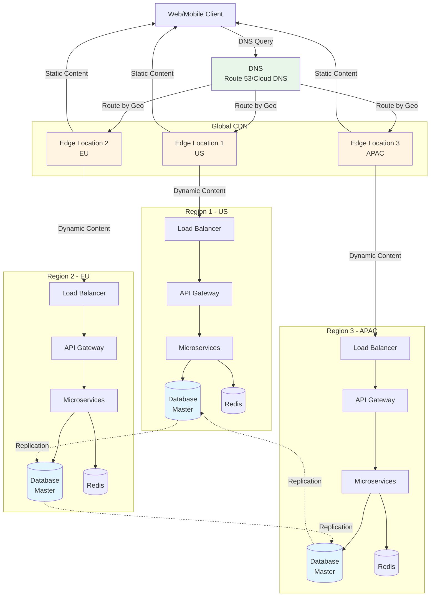

# 段階6: 1,000万-5,000万ユーザー - 超大型

## 1. この段階の特徴

### ユーザー数範囲
- **1,000万-5,000万ユーザー**
- 日間アクティブユーザー（DAU）: 約5,000,000-25,000,000人
- 1日のリクエスト数: 約100,000,000-500,000,000リクエスト
- ピーク時の同時接続数: 約500,000-2,500,000接続

### 典型的な課題
- **グローバルなレイテンシ**: 地理的に離れたユーザーへの対応
- **データの地理的分散**: 複数リージョン間でのデータ同期
- **コンプライアンス**: データ主権とプライバシー規制への対応
- **グローバルな可用性**: リージョン障害への対応

### 実例サービス
- **YouTube（2010-2012年）**: マルチリージョン展開とグローバルCDNの構築
- **Spotify（2012-2014年）**: グローバルな音楽ストリーミングインフラの構築

## 2. 追加すべき技術・設計

### 2.1 インフラ

**マルチリージョン展開**
- 複数のリージョン（US、EU、APACなど）にサービスを展開
- 各リージョンに独立したインフラを構築
- リージョン間のトラフィックルーティング

**グローバルCDN**
- エッジロケーションを世界中に配置
- 動的コンテンツのキャッシュ（APIレスポンス）
- エッジコンピューティングの検討

**推奨構成**
- **AWS**: 複数のリージョン（us-east-1、eu-west-1、ap-southeast-1など）
- **GCP**: 複数のリージョン（us-central1、europe-west1、asia-east1など）
- **Azure**: 複数のリージョン（eastus、westeurope、japaneastなど）

### 2.2 データベース

**マルチリージョンデータベース**
- 各リージョンにデータベースを配置
- マスター-マスターまたはマスター-スレーブレプリケーション
- レプリケーションラグの管理

**データレプリケーション戦略**
- **同期レプリケーション**: 強い一貫性が必要な場合
- **非同期レプリケーション**: 最終的な一貫性で十分な場合
- **マルチマスター**: 複数のリージョンで書き込み可能

**データの地理的分割**
- ユーザーの地理的位置に基づいてデータを分割
- データ主権の遵守（GDPR、CCPAなど）
- クロスリージョンクエリの最小化

### 2.3 キャッシュ

**グローバルキャッシュ**
- 各リージョンにキャッシュを配置
- キャッシュの無効化戦略（グローバル）
- エッジキャッシュの活用

**キャッシュの階層化**
- **L1 Cache**: アプリケーション内キャッシュ
- **L2 Cache**: Redis（リージョンごと）
- **L3 Cache**: CDN（エッジロケーション）

### 2.4 負荷分散

**グローバルロードバランシング**
- DNSベースのロードバランシング（Route 53、Cloud DNS）
- 地理的位置に基づくルーティング
- ヘルスチェックとフェイルオーバー

**エッジロケーション**
- Cloudflare Workers、AWS Lambda@Edge
- エッジでのリクエスト処理
- レイテンシの削減

### 2.5 モニタリング

**グローバルモニタリング**
- リージョンごとのメトリクス
- グローバルなダッシュボード
- レイテンシの監視（リージョン間）

**分散トレーシング**
- リージョン間のリクエスト追跡
- レイテンシの分析
- ボトルネックの特定

### 2.6 セキュリティ

**グローバルセキュリティ**
- DDoS対策（グローバル）
- WAF（Web Application Firewall）の配置
- データの暗号化（保存時と転送時）

**コンプライアンス**
- GDPR、CCPAへの対応
- データ主権の遵守
- 監査ログの記録

### 2.7 アーキテクチャ

**サービスメッシュ**
- Istio、Linkerd、Consul Connectの導入
- サービス間の通信を管理
- mTLSによるセキュアな通信

**イベント駆動アーキテクチャ**
- グローバルなイベントストリーミング
- リージョン間のイベント同期
- イベントの順序保証

## 3. アーキテクチャ図



**説明**:
- DNSが地理的位置に基づいてユーザーを適切なエッジロケーションにルーティング
- 各リージョンに独立したインフラが配置され、データベースがレプリケーションで同期
- エッジロケーションが静的コンテンツを配信し、動的コンテンツはリージョン内で処理

## 4. 実例ケーススタディ

### 4.1 YouTubeのグローバル展開（2010-2012年）

**背景**:
- 2010年頃、ユーザー数が急増（1,000万ユーザーを突破）
- グローバルなユーザーへの対応が必要
- レイテンシの問題が深刻化

**導入した技術**:
- **マルチリージョン展開**: 複数のリージョン（US、EU、APAC）にインフラを展開
- **グローバルCDN**: Google Cloud CDNと独自のCDNを構築
- **データレプリケーション**: 動画メタデータを複数リージョンにレプリケーション
- **エッジコンピューティング**: エッジロケーションでの動画エンコーディング

**効果**:
- レイテンシが50%削減
- 可用性が向上（リージョン障害への対応）
- グローバルなユーザー体験が向上

**学び**:
- マルチリージョン展開は複雑だが、グローバルなサービスには必須
- データレプリケーション戦略が重要
- エッジコンピューティングにより、レイテンシを大幅に削減

### 4.2 Spotifyのグローバル展開（2012-2014年）

**背景**:
- 2012年頃、ユーザー数が急増（1,000万ユーザーを突破）
- グローバルな音楽ストリーミングサービスへの対応が必要
- 音楽ライセンスの地理的制約への対応

**導入した技術**:
- **マルチリージョン展開**: 複数のリージョン（US、EU、APAC）にインフラを展開
- **グローバルCDN**: 音楽ファイルをグローバルに配信
- **データレプリケーション**: ユーザーデータとプレイリストを複数リージョンにレプリケーション
- **地理的ルーティング**: ユーザーの地理的位置に基づいてコンテンツをルーティング

**効果**:
- ストリーミングのレイテンシが削減
- 可用性が向上
- グローバルなユーザー体験が向上

**学び**:
- 地理的ルーティングにより、レイテンシとコストを最適化
- データレプリケーション戦略が重要
- コンプライアンスへの対応が必要

## 5. 実装のヒント

### 5.1 設定例

**DNS設定（Route 53）**

```yaml
# route53-config.yml
resources:
  - type: AWS::Route53::RecordSet
    properties:
      HostedZoneName: example.com.
      Name: api.example.com
      Type: A
      SetIdentifier: us-east-1
      Region: us-east-1
      TTL: 60
      ResourceRecords:
        - 1.2.3.4
      HealthCheckId: us-east-1-health-check
      Failover: PRIMARY

  - type: AWS::Route53::RecordSet
    properties:
      HostedZoneName: example.com.
      Name: api.example.com
      Type: A
      SetIdentifier: eu-west-1
      Region: eu-west-1
      TTL: 60
      ResourceRecords:
        - 5.6.7.8
      HealthCheckId: eu-west-1-health-check
      Failover: SECONDARY
```

**マルチリージョンデータベース設定**

```javascript
// Database configuration
const dbConfig = {
  usEast1: {
    master: {
      host: 'db-us-east-1-master.example.com',
      port: 5432,
      database: 'mydb'
    },
    replicas: [
      { host: 'db-us-east-1-replica-1.example.com', port: 5432 },
      { host: 'db-us-east-1-replica-2.example.com', port: 5432 }
    ]
  },
  euWest1: {
    master: {
      host: 'db-eu-west-1-master.example.com',
      port: 5432,
      database: 'mydb'
    },
    replicas: [
      { host: 'db-eu-west-1-replica-1.example.com', port: 5432 },
      { host: 'db-eu-west-1-replica-2.example.com', port: 5432 }
    ]
  }
};

// ユーザーのリージョンを決定
function getUserRegion(userId) {
  // ユーザーの地理的位置に基づいてリージョンを決定
  // または、ユーザーデータから取得
  return 'us-east-1'; // 例
}

// データベース接続
async function getDatabaseConnection(userId) {
  const region = getUserRegion(userId);
  const config = dbConfig[region];
  return new Pool(config.master);
}
```

**サービスメッシュ設定（Istio）**

```yaml
# istio-config.yml
apiVersion: networking.istio.io/v1alpha3
kind: VirtualService
metadata:
  name: user-service
spec:
  hosts:
  - user-service
  http:
  - match:
    - headers:
        region:
          exact: us-east-1
    route:
    - destination:
        host: user-service
        subset: us-east-1
      weight: 100
  - match:
    - headers:
        region:
          exact: eu-west-1
    route:
    - destination:
        host: user-service
        subset: eu-west-1
      weight: 100
---
apiVersion: networking.istio.io/v1alpha3
kind: DestinationRule
metadata:
  name: user-service
spec:
  host: user-service
  trafficPolicy:
    tls:
      mode: ISTIO_MUTUAL
  subsets:
  - name: us-east-1
    labels:
      region: us-east-1
  - name: eu-west-1
    labels:
      region: eu-west-1
```

### 5.2 コード例（簡略）

**リージョン間のデータレプリケーション**

```javascript
// データの書き込み（マスターリージョン）
async function createUser(userData) {
  const region = getUserRegion(userData.userId);
  const db = getDatabaseConnection(region);
  
  // マスターリージョンに書き込み
  const user = await db.query(
    'INSERT INTO users (id, name, email) VALUES ($1, $2, $3) RETURNING *',
    [userData.userId, userData.name, userData.email]
  );
  
  // 他のリージョンにレプリケーション（非同期）
  await replicateToOtherRegions(user.rows[0], region);
  
  return user.rows[0];
}

// 他のリージョンへのレプリケーション
async function replicateToOtherRegions(user, sourceRegion) {
  const regions = ['us-east-1', 'eu-west-1', 'ap-southeast-1'];
  const otherRegions = regions.filter(r => r !== sourceRegion);
  
  for (const region of otherRegions) {
    // メッセージキューにレプリケーションイベントを送信
    await publishEvent('user-replication', {
      region: region,
      user: user,
      operation: 'create'
    });
  }
}
```

**エッジコンピューティング（Cloudflare Workers）**

```javascript
// Cloudflare Worker
addEventListener('fetch', event => {
  event.respondWith(handleRequest(event.request));
});

async function handleRequest(request) {
  // ユーザーの地理的位置を取得
  const country = request.cf.country;
  
  // 地理的位置に基づいてAPIエンドポイントを選択
  let apiEndpoint;
  if (country === 'US' || country === 'CA') {
    apiEndpoint = 'https://api-us.example.com';
  } else if (country === 'GB' || country === 'DE' || country === 'FR') {
    apiEndpoint = 'https://api-eu.example.com';
  } else {
    apiEndpoint = 'https://api-apac.example.com';
  }
  
  // リクエストをプロキシ
  const response = await fetch(apiEndpoint + request.url, request);
  return response;
}
```

## 6. コスト見積もり

### 6.1 典型的なコスト

**AWSの場合（3リージョン）**
- **Route 53**: $0.50/100万クエリ + $0.50/ヘルスチェック
- **CloudFront（CDN）**: $100-300/月（転送量による）
- **Application Load Balancer（× 3）**: $90-150/月
- **EC2インスタンス（× 3リージョン）**: $3,000-4,500/月
- **RDS（× 3リージョン）**: $6,000-9,000/月
- **ElastiCache（× 3リージョン）**: $900-1,500/月
- **データ転送（リージョン間）**: $100-500/月
- **合計**: 約$10,190-15,450/月

**GCPの場合（3リージョン）**
- **Cloud DNS**: $0.20/100万クエリ
- **Cloud CDN**: $100-300/月
- **Cloud Load Balancing（× 3）**: $90-150/月
- **Compute Engine（× 3リージョン）**: $4,500-6,000/月
- **Cloud SQL（× 3リージョン）**: $7,500-10,000/月
- **Memorystore（× 3リージョン）**: $1,200-1,800/月
- **データ転送（リージョン間）**: $100-500/月
- **合計**: 約$13,490-18,750/月

### 6.2 コスト最適化

1. **データの地理的分割**: ユーザーの地理的位置に基づいてデータを分割し、転送コストを削減
2. **CDNの最適化**: キャッシュヒット率を向上させ、転送コストを削減
3. **リージョンの選択**: コスト効率の良いリージョンを選択
4. **データ転送の最適化**: リージョン間のデータ転送を最小限に抑える

## 7. 次の段階への準備

次の段階（5,000万-1億ユーザー）では、以下の技術が必要になります：

1. **アクティブ-アクティブ構成**: 複数のリージョンで同時にアクティブ
2. **自動フェイルオーバー**: リージョン障害時の自動切り替え
3. **災害復旧計画**: 大規模障害への対応
4. **高度なセキュリティ対策**: より高度なセキュリティ対策

**準備すべきこと**:
- アクティブ-アクティブ構成の設計
- 自動フェイルオーバーの実装
- 災害復旧計画の策定
- セキュリティ対策の強化

---

**次のステップ**: [段階7: 5,000万-1億ユーザー](./stage_07_50m_to_100m_users.md)で高可用性と災害復旧を学ぶ

