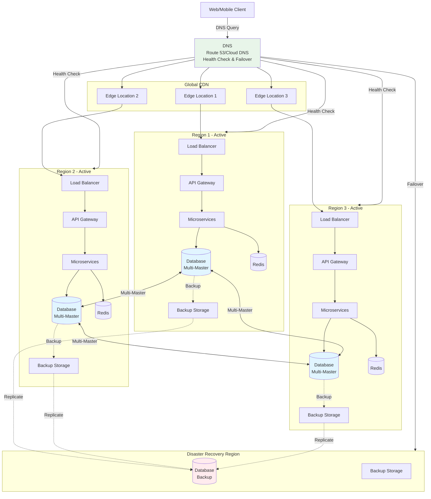

# 段階7: 5,000万-1億ユーザー - グローバル

## 1. この段階の特徴

### ユーザー数範囲
- **5,000万-1億ユーザー**
- 日間アクティブユーザー（DAU）: 約25,000,000-50,000,000人
- 1日のリクエスト数: 約500,000,000-1,000,000,000リクエスト
- ピーク時の同時接続数: 約2,500,000-5,000,000接続

### 典型的な課題
- **高可用性の確保**: 99.99%以上の可用性が必要
- **災害復旧**: 大規模障害への対応
- **データの整合性**: 複数リージョン間でのデータ整合性
- **セキュリティ**: より高度なセキュリティ対策が必要

### 実例サービス
- **WhatsApp（2014-2016年）**: アクティブ-アクティブ構成と災害復旧計画の実装
- **WeChat（2013-2015年）**: 高可用性インフラの構築

## 2. 追加すべき技術・設計

### 2.1 インフラ

**アクティブ-アクティブ構成**
- 複数のリージョンで同時にアクティブ
- すべてのリージョンで読み取りと書き込みが可能
- リージョン間の負荷分散

**自動フェイルオーバー**
- リージョン障害時の自動切り替え
- ヘルスチェックによる障害検出
- DNSまたはロードバランサーによる自動ルーティング

**災害復旧計画**
- RTO（Recovery Time Objective）: 1時間以内
- RPO（Recovery Point Objective）: 15分以内
- 定期的な災害復旧訓練

### 2.2 データベース

**マルチマスターレプリケーション**
- 複数のリージョンで書き込み可能
- コンフリクト解決の仕組み
- 最終的な一貫性の保証

**データの整合性**
- ベクタークロックまたはタイムスタンプによる順序付け
- コンフリクト解決アルゴリズム（Last Write Wins、CRDTなど）
- データの整合性チェック

**バックアップとリストア**
- 自動バックアップ（1時間ごと）
- 複数のリージョンにバックアップを保存
- 迅速なリストア手順

### 2.3 キャッシュ

**グローバルキャッシュの無効化**
- リージョン間でのキャッシュ無効化
- イベントベースの無効化
- キャッシュの整合性保証

### 2.4 負荷分散

**グローバルロードバランシング**
- 地理的位置、レイテンシ、負荷に基づくルーティング
- 自動フェイルオーバー
- ヘルスチェックの強化

### 2.5 モニタリング

**包括的なモニタリング**
- リージョンごとのメトリクス
- グローバルなダッシュボード
- リアルタイムアラート

**障害検出と通知**
- 自動障害検出
- エスカレーションポリシー
- オン�コールローテーション

### 2.6 セキュリティ

**高度なセキュリティ対策**
- DDoS対策（グローバル）
- WAF（Web Application Firewall）の強化
- 侵入検知システム（IDS）
- セキュリティ監査

**データの暗号化**
- 保存時の暗号化（AES-256）
- 転送時の暗号化（TLS 1.3）
- キー管理（AWS KMS、GCP KMS）

### 2.7 アーキテクチャ

**イベントソーシング**
- すべてのイベントを記録
- イベントストリームからの状態再構築
- 監査ログとしても機能

**CQRS（Command Query Responsibility Segregation）**
- 読み取りと書き込みの完全な分離
- 読み取り専用の最適化されたデータストア
- 書き込み専用のイベントストア

## 3. アーキテクチャ図



**説明**:
- 3つのリージョンがすべてアクティブで、マルチマスターレプリケーションで同期
- DNSがヘルスチェックを行い、障害時には自動的にフェイルオーバー
- 災害復旧リージョンにバックアップを保存し、大規模障害に備える

## 4. 実例ケーススタディ

### 4.1 WhatsAppの高可用性構築（2014-2016年）

**背景**:
- 2014年にユーザー数が急増（5,000万ユーザーを突破）
- 高可用性の確保が必須
- メッセージの確実な配信が必要

**導入した技術**:
- **アクティブ-アクティブ構成**: 複数のリージョンで同時にアクティブ
- **マルチマスターレプリケーション**: メッセージデータを複数リージョンにレプリケーション
- **自動フェイルオーバー**: リージョン障害時の自動切り替え
- **災害復旧計画**: 定期的な災害復旧訓練を実施

**可用性の目標**:
- **可用性**: 99.99%以上（年間ダウンタイム < 52.56分）
- **RTO**: 30分以内
- **RPO**: 5分以内

**効果**:
- 可用性が99.99%を達成
- リージョン障害時の影響を最小限に抑制
- メッセージの確実な配信を実現

**学び**:
- アクティブ-アクティブ構成により、可用性が大幅に向上
- 自動フェイルオーバーにより、障害時の対応が迅速化
- 災害復旧計画の定期的な訓練が重要

### 4.2 WeChatの高可用性構築（2013-2015年）

**背景**:
- 2013年頃、ユーザー数が急増（5,000万ユーザーを突破）
- 中国国内での高可用性の確保が必要
- 大規模なトラフィックへの対応が必要

**導入した技術**:
- **アクティブ-アクティブ構成**: 複数のデータセンターで同時にアクティブ
- **マルチマスターレプリケーション**: ユーザーデータを複数データセンターにレプリケーション
- **自動フェイルオーバー**: データセンター障害時の自動切り替え
- **災害復旧計画**: 定期的な災害復旧訓練を実施

**効果**:
- 可用性が99.99%を達成
- データセンター障害時の影響を最小限に抑制
- 大規模なトラフィックに対応可能

**学び**:
- アクティブ-アクティブ構成により、可用性が大幅に向上
- 自動フェイルオーバーにより、障害時の対応が迅速化
- 災害復旧計画の定期的な訓練が重要

## 5. 実装のヒント

### 5.1 設定例

**マルチマスターレプリケーション設定（PostgreSQL）**

```sql
-- リージョン1（マスター1）
ALTER SYSTEM SET wal_level = 'logical';
ALTER SYSTEM SET max_replication_slots = 10;
ALTER SYSTEM SET max_wal_senders = 10;

-- リージョン2（マスター2）
CREATE PUBLICATION pub_region2 FOR ALL TABLES;
CREATE SUBSCRIPTION sub_region1 
  CONNECTION 'host=region1.example.com port=5432 dbname=mydb user=replicator'
  PUBLICATION pub_region1;

-- コンフリクト解決（Last Write Wins）
CREATE OR REPLACE FUNCTION resolve_conflict()
RETURNS TRIGGER AS $$
BEGIN
  IF NEW.updated_at > OLD.updated_at THEN
    RETURN NEW;
  ELSE
    RETURN OLD;
  END IF;
END;
$$ LANGUAGE plpgsql;

CREATE TRIGGER conflict_resolution
  BEFORE UPDATE ON users
  FOR EACH ROW
  EXECUTE FUNCTION resolve_conflict();
```

**自動フェイルオーバー設定（Route 53）**

```yaml
# route53-failover.yml
resources:
  - type: AWS::Route53::HealthCheck
    name: region1-health-check
    properties:
      ResourcePath: /health
      Port: 443
      Type: HTTPS
      FullyQualifiedDomainName: api-region1.example.com
      RequestInterval: 30
      FailureThreshold: 3

  - type: AWS::Route53::RecordSet
    properties:
      HostedZoneName: example.com.
      Name: api.example.com
      Type: A
      SetIdentifier: region1-primary
      TTL: 60
      ResourceRecords:
        - 1.2.3.4
      HealthCheckId: region1-health-check
      Failover: PRIMARY

  - type: AWS::Route53::RecordSet
    properties:
      HostedZoneName: example.com.
      Name: api.example.com
      Type: A
      SetIdentifier: region2-secondary
      TTL: 60
      ResourceRecords:
        - 5.6.7.8
      Failover: SECONDARY
```

**イベントソーシングの実装**

```javascript
// Event Store
class EventStore {
  async appendEvent(streamId, event) {
    const eventData = {
      streamId: streamId,
      eventType: event.type,
      eventData: event.data,
      timestamp: new Date(),
      version: await this.getNextVersion(streamId)
    };
    
    await db.query(
      'INSERT INTO events (stream_id, event_type, event_data, timestamp, version) VALUES ($1, $2, $3, $4, $5)',
      [streamId, event.type, JSON.stringify(event.data), eventData.timestamp, eventData.version]
    );
    
    // イベントを公開
    await publishEvent('event-stream', eventData);
  }
  
  async getEvents(streamId) {
    const result = await db.query(
      'SELECT * FROM events WHERE stream_id = $1 ORDER BY version',
      [streamId]
    );
    return result.rows;
  }
  
  async replayEvents(streamId, handler) {
    const events = await this.getEvents(streamId);
    let state = {};
    
    for (const event of events) {
      state = handler(state, event);
    }
    
    return state;
  }
}
```

### 5.2 コード例（簡略）

**コンフリクト解決（CRDT）**

```javascript
// CRDTベースのコンフリクト解決
class CRDTUser {
  constructor(userId) {
    this.userId = userId;
    this.name = new LWWRegister(); // Last Write Wins Register
    this.email = new LWWRegister();
    this.followers = new GSet(); // Grow-only Set
  }
  
  setName(name, timestamp) {
    this.name.set(name, timestamp);
  }
  
  addFollower(followerId) {
    this.followers.add(followerId);
  }
  
  merge(other) {
    this.name.merge(other.name);
    this.email.merge(other.email);
    this.followers.merge(other.followers);
  }
}

// Last Write Wins Register
class LWWRegister {
  constructor() {
    this.value = null;
    this.timestamp = 0;
  }
  
  set(value, timestamp) {
    if (timestamp > this.timestamp) {
      this.value = value;
      this.timestamp = timestamp;
    }
  }
  
  merge(other) {
    if (other.timestamp > this.timestamp) {
      this.value = other.value;
      this.timestamp = other.timestamp;
    }
  }
}
```

**災害復旧の自動化**

```javascript
// 災害復旧の自動化
class DisasterRecovery {
  async detectFailure(region) {
    const healthCheck = await this.checkHealth(region);
    if (!healthCheck.healthy) {
      await this.triggerFailover(region);
    }
  }
  
  async triggerFailover(failedRegion) {
    // 1. 障害リージョンを特定
    const activeRegions = await this.getActiveRegions();
    const backupRegion = activeRegions.find(r => r !== failedRegion);
    
    // 2. DNSを更新
    await this.updateDNS(backupRegion);
    
    // 3. トラフィックを切り替え
    await this.switchTraffic(backupRegion);
    
    // 4. 通知を送信
    await this.sendAlert({
      type: 'FAILOVER',
      failedRegion: failedRegion,
      backupRegion: backupRegion,
      timestamp: new Date()
    });
  }
  
  async restoreRegion(failedRegion) {
    // 1. リージョンを復旧
    await this.restoreInfrastructure(failedRegion);
    
    // 2. データを復元
    await this.restoreData(failedRegion);
    
    // 3. ヘルスチェックを開始
    await this.startHealthCheck(failedRegion);
    
    // 4. トラフィックを段階的に戻す
    await this.graduallyRestoreTraffic(failedRegion);
  }
}
```

## 6. コスト見積もり

### 6.1 典型的なコスト

**AWSの場合（3リージョン + DR）**
- **Route 53**: $1-2/月
- **CloudFront（CDN）**: $200-500/月
- **Application Load Balancer（× 3）**: $90-150/月
- **EC2インスタンス（× 3リージョン）**: $4,500-6,000/月
- **RDS（マルチマスター × 3リージョン）**: $9,000-12,000/月
- **ElastiCache（× 3リージョン）**: $1,500-2,000/月
- **S3（バックアップ）**: $500-1,000/月
- **データ転送（リージョン間）**: $200-500/月
- **災害復旧リージョン**: $2,000-3,000/月
- **合計**: 約$17,491-25,152/月

### 6.2 コスト最適化

1. **災害復旧リージョンの最適化**: コスト効率の良い構成を使用
2. **バックアップの最適化**: 必要なデータのみをバックアップ
3. **データ転送の最適化**: リージョン間のデータ転送を最小限に抑える
4. **リザーブドインスタンス**: 長期契約で20-30%の割引

## 7. 次の段階への準備

次の段階（1億-5億ユーザー）では、以下の技術が必要になります：

1. **プラットフォーム化**: マルチテナントアーキテクチャの導入
2. **高度な分析とML推論**: リアルタイム分析と機械学習
3. **エッジコンピューティング**: エッジでの処理の拡張
4. **カスタムインフラの構築**: 専用ハードウェアの検討

**準備すべきこと**:
- プラットフォーム化の設計
- 機械学習インフラの準備
- エッジコンピューティングの拡張計画
- カスタムインフラの検討

---

**次のステップ**: [段階8: 1億-5億ユーザー](./stage_08_100m_to_500m_users.md)でプラットフォーム化を学ぶ

