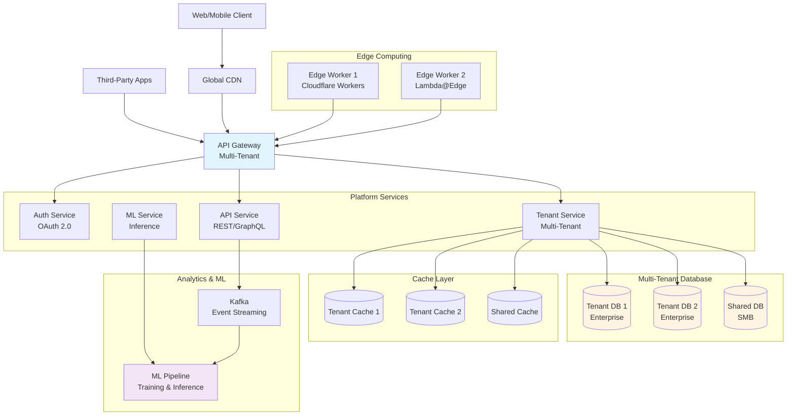

# 段階8: 1億-5億ユーザー - プラットフォーム

## 1. この段階の特徴

### ユーザー数範囲
- **1億-5億ユーザー**
- 日間アクティブユーザー（DAU）: 約50,000,000-250,000,000人
- 1日のリクエスト数: 約1,000,000,000-5,000,000,000リクエスト
- ピーク時の同時接続数: 約5,000,000-25,000,000接続

### 典型的な課題
- **プラットフォーム化**: 複数のサービスやアプリケーションをサポート
- **マルチテナント**: 複数の組織や企業をサポート
- **高度な分析**: リアルタイム分析と機械学習推論
- **エッジコンピューティング**: エッジでの処理の拡張

### 実例サービス
- **Google（2000年代後半-2010年代前半）**: プラットフォーム化とマルチテナントアーキテクチャの構築
- **Facebook（2010-2012年）**: プラットフォームAPIとマルチテナントインフラの構築

## 2. 追加すべき技術・設計

### 2.1 インフラ

**プラットフォーム化**
- 複数のサービスやアプリケーションをサポート
- APIプラットフォームの構築
- サードパーティ開発者向けのAPI提供

**マルチテナントアーキテクチャ**
- 複数の組織や企業をサポート
- テナントごとのデータ分離
- テナントごとのリソース制限

**エッジコンピューティング**
- Cloudflare Workers、AWS Lambda@Edge
- エッジでの処理の拡張
- レイテンシの削減

### 2.2 データベース

**マルチテナントデータベース**
- テナントごとのデータ分離
- 共有データベース + テナントID
- テナントごとのデータベース

**データの分離戦略**
- **共有データベース + テナントID**: すべてのテナントが同じデータベースを使用
- **テナントごとのデータベース**: 各テナントが独自のデータベースを持つ
- **ハイブリッド**: 重要なテナントは専用データベース、その他は共有

### 2.3 キャッシュ

**マルチテナントキャッシュ**
- テナントごとのキャッシュ分離
- キャッシュの無効化戦略（テナントごと）
- キャッシュの階層化

### 2.4 負荷分散

**テナントベースのルーティング**
- テナントIDに基づくルーティング
- テナントごとのリソース割り当て
- テナントごとのレート制限

### 2.5 モニタリング

**テナントごとのメトリクス**
- テナントごとの使用量追跡
- テナントごとのパフォーマンス監視
- テナントごとのコスト追跡

**高度な分析**
- リアルタイム分析（Apache Kafka、AWS Kinesis）
- 機械学習推論（TensorFlow Serving、AWS SageMaker）
- 予測分析と異常検知

### 2.6 セキュリティ

**マルチテナントセキュリティ**
- テナント間のデータ分離
- テナントごとのアクセス制御
- テナントごとの暗号化キー

**APIセキュリティ**
- OAuth 2.0、OpenID Connect
- APIキー管理
- レート制限とクォータ管理

### 2.7 アーキテクチャ

**プラットフォームAPI**
- RESTful API、GraphQL
- APIバージョニング
- APIドキュメント（OpenAPI、GraphQL Schema）

**機械学習インフラ**
- モデルのトレーニングとデプロイ
- リアルタイム推論
- バッチ推論

## 3. アーキテクチャ図



**説明**:
- API Gatewayがマルチテナントをサポートし、テナントごとにルーティング
- エンタープライズテナントは専用データベース、SMBテナントは共有データベース
- エッジコンピューティングでレイテンシを削減
- 機械学習パイプラインでリアルタイム分析と推論を実行

## 4. 実例ケーススタディ

### 4.1 Googleのプラットフォーム化（2000年代後半-2010年代前半）

**背景**:
- 2000年代後半、複数のサービス（Gmail、Google Maps、YouTubeなど）を統合
- サードパーティ開発者向けのAPI提供が必要
- マルチテナントインフラの構築が必要

**導入した技術**:
- **プラットフォームAPI**: Google Cloud Platform API、Google Maps API
- **マルチテナントアーキテクチャ**: 複数の組織や企業をサポート
- **エッジコンピューティング**: Google Cloud CDNとエッジコンピューティング
- **機械学習インフラ**: TensorFlow、Google Cloud ML Engine

**プラットフォームの特徴**:
- **APIファースト**: すべての機能がAPI経由でアクセス可能
- **マルチテナント**: 複数の組織や企業をサポート
- **スケーラビリティ**: 自動スケーリングと負荷分散

**効果**:
- サードパーティ開発者がプラットフォームを活用
- エコシステムの拡大
- 収益の多様化

**学び**:
- プラットフォーム化により、エコシステムが拡大
- APIファーストの設計が重要
- マルチテナントアーキテクチャにより、効率的なリソース利用が可能

### 4.2 Facebookのプラットフォーム化（2010-2012年）

**背景**:
- 2010年頃、プラットフォームAPIの提供を開始
- サードパーティ開発者向けのAPI提供が必要
- マルチテナントインフラの構築が必要

**導入した技術**:
- **プラットフォームAPI**: Facebook Graph API
- **マルチテナントアーキテクチャ**: 複数のアプリケーションをサポート
- **OAuth 2.0**: 認証と認可
- **レート制限とクォータ**: APIの使用量を制限

**プラットフォームの特徴**:
- **Graph API**: ソーシャルグラフへのアクセス
- **OAuth 2.0**: セキュアな認証と認可
- **レート制限**: APIの使用量を制限し、公平性を確保

**効果**:
- サードパーティ開発者がプラットフォームを活用
- エコシステムの拡大
- 収益の多様化

**学び**:
- プラットフォーム化により、エコシステムが拡大
- OAuth 2.0によるセキュアな認証と認可が重要
- レート制限とクォータにより、公平性を確保

## 5. 実装のヒント

### 5.1 設定例

**マルチテナントデータベース設定**

```sql
-- 共有データベース + テナントID
CREATE TABLE users (
    id BIGSERIAL PRIMARY KEY,
    tenant_id BIGINT NOT NULL,
    name VARCHAR(255) NOT NULL,
    email VARCHAR(255) NOT NULL,
    created_at TIMESTAMP DEFAULT CURRENT_TIMESTAMP,
    INDEX idx_tenant_id (tenant_id),
    INDEX idx_tenant_email (tenant_id, email),
    UNIQUE KEY uk_tenant_email (tenant_id, email)
);

-- テナントごとのデータアクセス
CREATE FUNCTION get_tenant_id()
RETURNS BIGINT AS $$
BEGIN
  RETURN current_setting('app.tenant_id')::BIGINT;
END;
$$ LANGUAGE plpgsql;

-- Row Level Security (PostgreSQL)
ALTER TABLE users ENABLE ROW LEVEL SECURITY;

CREATE POLICY tenant_isolation ON users
  FOR ALL
  USING (tenant_id = get_tenant_id());
```

**マルチテナントAPI Gateway設定**

```yaml
# kong-multi-tenant.yml
services:
  - name: api-service
    url: http://api-service:3000
    routes:
      - name: api-routes
        paths:
          - /api/v1
        methods:
          - GET
          - POST
          - PUT
          - DELETE
    plugins:
      - name: oauth2
        config:
          scopes:
            - read
            - write
          mandatory_scope: true
      - name: rate-limiting
        config:
          minute: 100
          hour: 1000
          policy: local
        consumer: ${consumer}
      - name: request-transformer
        config:
          add:
            headers:
              - X-Tenant-ID:${consumer.custom_id}
```

**機械学習推論サービス**

```python
# ML Inference Service
import tensorflow as tf
from flask import Flask, request, jsonify

app = Flask(__name__)

# モデルの読み込み
model = tf.keras.models.load_model('model.h5')

@app.route('/api/v1/predict', methods=['POST'])
def predict():
    # テナントIDを取得
    tenant_id = request.headers.get('X-Tenant-ID')
    
    # リクエストデータを取得
    data = request.json
    
    # 推論を実行
    prediction = model.predict(data['features'])
    
    # 結果を返す
    return jsonify({
        'tenant_id': tenant_id,
        'prediction': prediction.tolist()
    })
```

### 5.2 コード例（簡略）

**マルチテナントミドルウェア**

```javascript
// Multi-tenant middleware
function multiTenantMiddleware(req, res, next) {
  // テナントIDを取得（JWTトークン、APIキー、サブドメインなど）
  const tenantId = getTenantId(req);
  
  if (!tenantId) {
    return res.status(401).json({ error: 'Tenant ID required' });
  }
  
  // テナントの存在確認
  const tenant = await getTenant(tenantId);
  if (!tenant) {
    return res.status(404).json({ error: 'Tenant not found' });
  }
  
  // テナントのステータス確認
  if (tenant.status !== 'active') {
    return res.status(403).json({ error: 'Tenant is not active' });
  }
  
  // リクエストにテナント情報を追加
  req.tenant = tenant;
  req.tenantId = tenantId;
  
  next();
}

// テナントごとのデータアクセス
async function getUsers(req, res) {
  const tenantId = req.tenantId;
  
  // テナントIDでフィルタリング
  const users = await db.query(
    'SELECT * FROM users WHERE tenant_id = $1',
    [tenantId]
  );
  
  res.json(users.rows);
}
```

**エッジコンピューティング（Cloudflare Workers）**

```javascript
// Cloudflare Worker - Multi-tenant routing
addEventListener('fetch', event => {
  event.respondWith(handleRequest(event.request));
});

async function handleRequest(request) {
  // テナントIDを取得（サブドメイン、パス、ヘッダーなど）
  const url = new URL(request.url);
  const tenantId = url.hostname.split('.')[0];
  
  // テナントの設定を取得
  const tenantConfig = await getTenantConfig(tenantId);
  
  if (!tenantConfig) {
    return new Response('Tenant not found', { status: 404 });
  }
  
  // テナントごとのAPIエンドポイントを選択
  const apiEndpoint = tenantConfig.apiEndpoint;
  
  // リクエストをプロキシ
  const response = await fetch(apiEndpoint + url.pathname, {
    method: request.method,
    headers: {
      ...request.headers,
      'X-Tenant-ID': tenantId
    },
    body: request.body
  });
  
  return response;
}
```

## 6. コスト見積もり

### 6.1 典型的なコスト

**AWSの場合（マルチテナント）**
- **API Gateway**: $3.50/100万リクエスト + テナントごとの追加コスト
- **EC2インスタンス（× 3リージョン）**: $6,000-9,000/月
- **RDS（マルチテナント）**: $12,000-18,000/月
- **ElastiCache（× 3リージョン）**: $2,000-3,000/月
- **SageMaker（ML推論）**: $1,000-2,000/月
- **Kinesis（イベントストリーミング）**: $500-1,000/月
- **Lambda@Edge**: $200-500/月
- **合計**: 約$21,700-33,500/月

**GCPの場合（マルチテナント）**
- **Cloud Endpoints**: $3.00/100万リクエスト + テナントごとの追加コスト
- **Compute Engine（× 3リージョン）**: $9,000-12,000/月
- **Cloud SQL（マルチテナント）**: $15,000-20,000/月
- **Memorystore（× 3リージョン）**: $2,500-3,500/月
- **Cloud ML Engine（ML推論）**: $1,500-2,500/月
- **Pub/Sub**: $200-500/月
- **Cloud Functions（エッジ）**: $300-600/月
- **合計**: 約$28,500-39,100/月

### 6.2 コスト最適化

1. **テナントごとのリソース最適化**: テナントの使用量に応じてリソースを割り当て
2. **共有リソースの活用**: SMBテナントは共有リソースを使用
3. **エッジコンピューティング**: エッジでの処理により、コストを削減
4. **機械学習の最適化**: モデルの最適化により、推論コストを削減

## 7. 次の段階への準備

次の段階（5億-10億ユーザー）では、以下の技術が必要になります：

1. **エコシステムの構築**: より大規模なエコシステムの構築
2. **分散システムの最適化**: より効率的な分散システム
3. **カスタムデータベース**: 専用のデータベースシステム
4. **専用ハードウェア**: カスタムハードウェアの検討

**準備すべきこと**:
- エコシステムの拡大計画
- 分散システムの最適化
- カスタムデータベースの検討
- 専用ハードウェアの検討

---

**次のステップ**: [段階9: 5億-10億ユーザー](./stage_09_500m_to_1b_users.md)でエコシステムの構築を学ぶ

