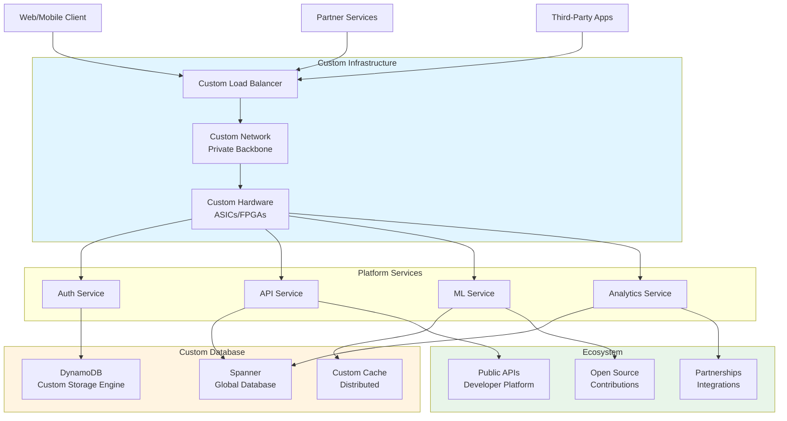

# 段階9: 5億-10億ユーザー - エコシステム

## 1. この段階の特徴

### ユーザー数範囲
- **5億-10億ユーザー**
- 日間アクティブユーザー（DAU）: 約250,000,000-500,000,000人
- 1日のリクエスト数: 約5,000,000,000-10,000,000,000リクエスト
- ピーク時の同時接続数: 約25,000,000-50,000,000接続

### 典型的な課題
- **エコシステムの構築**: より大規模なエコシステムの構築
- **分散システムの最適化**: より効率的な分散システム
- **カスタムデータベース**: 専用のデータベースシステム
- **専用ハードウェア**: カスタムハードウェアの検討

### 実例サービス
- **Amazon（2010年代）**: カスタムデータベースと専用ハードウェアの構築
- **Google（2010年代）**: 分散システムの最適化とカスタムインフラの構築

## 2. 追加すべき技術・設計

### 2.1 インフラ

**カスタムインフラの構築**
- 専用ハードウェアの設計と製造
- カスタムネットワークの構築
- 専用データセンターの運営

**分散システムの最適化**
- より効率的な分散システム
- カスタムプロトコルの開発
- 専用ネットワークプロトコル

### 2.2 データベース

**カスタムデータベース**
- 専用のデータベースシステム（DynamoDB、Spannerなど）
- 分散データベースの最適化
- カスタムストレージエンジン

**データのグローバル同期**
- グローバルなデータ同期
- 低レイテンシのデータアクセス
- 強い一貫性の保証

### 2.3 キャッシュ

**分散キャッシュの最適化**
- より効率的なキャッシュ戦略
- カスタムキャッシュシステム
- グローバルなキャッシュ同期

### 2.4 負荷分散

**グローバルロードバランシングの最適化**
- より効率的なルーティングアルゴリズム
- カスタムロードバランサー
- 専用ネットワークの活用

### 2.5 モニタリング

**包括的なモニタリング**
- グローバルなメトリクス収集
- リアルタイム分析
- 予測分析と異常検知

### 2.6 セキュリティ

**高度なセキュリティ対策**
- カスタムセキュリティシステム
- 専用セキュリティハードウェア
- グローバルなセキュリティ監視

### 2.7 アーキテクチャ

**エコシステムの構築**
- より大規模なエコシステム
- パートナーシップと統合
- オープンソースの貢献

**分散システムの最適化**
- より効率的な分散システム
- カスタムプロトコル
- 専用ネットワーク

## 3. アーキテクチャ図



**説明**:
- カスタムインフラ（専用ハードウェア、カスタムネットワーク）が構築され、パフォーマンスと効率が最適化
- カスタムデータベース（DynamoDB、Spanner）がグローバルなデータアクセスを提供
- エコシステム（オープンソース、パートナーシップ、API）が拡大

## 4. 実例ケーススタディ

### 4.1 Amazonのカスタムインフラ構築（2010年代）

**背景**:
- 2010年代、大規模なトラフィックに対応するため、カスタムインフラが必要
- コスト効率とパフォーマンスの最適化が必要
- 専用ハードウェアの検討が必要

**導入した技術**:
- **カスタムデータベース**: DynamoDBの開発と運用
- **専用ハードウェア**: ネットワークスイッチ、ストレージシステム
- **カスタムネットワーク**: プライベートバックボーンネットワーク
- **分散システムの最適化**: より効率的な分散システム

**カスタムインフラの特徴**:
- **DynamoDB**: NoSQLデータベース、自動スケーリング、低レイテンシ
- **専用ハードウェア**: ネットワークスイッチ、ストレージシステム
- **プライベートネットワーク**: 低レイテンシ、高帯域幅

**効果**:
- コスト効率が向上
- パフォーマンスが最適化
- スケーラビリティが向上

**学び**:
- カスタムインフラにより、コスト効率とパフォーマンスが最適化
- 専用ハードウェアにより、特定のワークロードが最適化
- プライベートネットワークにより、レイテンシと帯域幅が最適化

### 4.2 Googleの分散システム最適化（2010年代）

**背景**:
- 2010年代、大規模なトラフィックに対応するため、分散システムの最適化が必要
- グローバルなデータアクセスが必要
- 強い一貫性の保証が必要

**導入した技術**:
- **カスタムデータベース**: Spannerの開発と運用
- **分散システムの最適化**: より効率的な分散システム
- **カスタムプロトコル**: 専用ネットワークプロトコル
- **専用ハードウェア**: ネットワークスイッチ、ストレージシステム

**カスタムインフラの特徴**:
- **Spanner**: グローバル分散データベース、強い一貫性、低レイテンシ
- **カスタムプロトコル**: 専用ネットワークプロトコル
- **専用ハードウェア**: ネットワークスイッチ、ストレージシステム

**効果**:
- グローバルなデータアクセスが実現
- 強い一貫性が保証
- 低レイテンシが実現

**学び**:
- カスタムデータベースにより、グローバルなデータアクセスが実現
- 分散システムの最適化により、効率が向上
- カスタムプロトコルにより、パフォーマンスが最適化

## 5. 実装のヒント

### 5.1 設定例

**カスタムデータベース設計（DynamoDB風）**

```javascript
// Custom Database Client
class CustomDatabase {
  constructor(config) {
    this.partitions = config.partitions;
    this.replicas = config.replicas;
    this.consistency = config.consistency;
  }
  
  async get(key, options = {}) {
    const partition = this.getPartition(key);
    const replica = this.selectReplica(partition, options.consistency);
    
    const result = await replica.get(key);
    
    if (options.consistentRead) {
      // 強い一貫性の読み取り
      return await this.consistentRead(key, partition);
    }
    
    return result;
  }
  
  async put(key, value, options = {}) {
    const partition = this.getPartition(key);
    const replicas = this.getReplicas(partition);
    
    // 書き込みをすべてのレプリカに送信
    const promises = replicas.map(replica => replica.put(key, value));
    
    if (options.consistentWrite) {
      // 強い一貫性の書き込み
      await Promise.all(promises);
    } else {
      // 最終的な一貫性の書き込み
      await Promise.allSettled(promises);
    }
  }
  
  getPartition(key) {
    const hash = this.hash(key);
    return hash % this.partitions.length;
  }
  
  selectReplica(partition, consistency) {
    if (consistency === 'strong') {
      // マスターレプリカを選択
      return this.partitions[partition].master;
    } else {
      // ランダムにレプリカを選択
      const replicas = this.partitions[partition].replicas;
      return replicas[Math.floor(Math.random() * replicas.length)];
    }
  }
}
```

**グローバルデータベース（Spanner風）**

```javascript
// Global Database Client
class GlobalDatabase {
  constructor(config) {
    this.regions = config.regions;
    this.replication = config.replication;
    this.consistency = config.consistency;
  }
  
  async read(key, options = {}) {
    const region = options.region || this.getClosestRegion();
    const replica = this.selectReplica(region, options.consistency);
    
    if (options.consistency === 'strong') {
      // 強い一貫性の読み取り（最新のデータを保証）
      return await this.strongConsistentRead(key, region);
    } else {
      // 最終的な一貫性の読み取り（低レイテンシ）
      return await replica.read(key);
    }
  }
  
  async write(key, value, options = {}) {
    const region = options.region || this.getClosestRegion();
    
    if (options.consistency === 'strong') {
      // 強い一貫性の書き込み（すべてのリージョンに同期）
      await this.strongConsistentWrite(key, value, region);
    } else {
      // 最終的な一貫性の書き込み（低レイテンシ）
      await this.eventuallyConsistentWrite(key, value, region);
    }
  }
  
  async strongConsistentRead(key, region) {
    // タイムスタンプベースの読み取り
    const timestamp = await this.getLatestTimestamp(key);
    const replicas = this.getAllReplicas(key);
    
    const promises = replicas.map(replica => 
      replica.readAtTimestamp(key, timestamp)
    );
    
    const results = await Promise.all(promises);
    return this.resolveConflicts(results);
  }
  
  async strongConsistentWrite(key, value, region) {
    // 2フェーズコミット
    const timestamp = await this.getTimestamp();
    const replicas = this.getAllReplicas(key);
    
    // フェーズ1: 準備
    const preparePromises = replicas.map(replica =>
      replica.prepare(key, value, timestamp)
    );
    const prepareResults = await Promise.all(preparePromises);
    
    if (prepareResults.every(r => r.success)) {
      // フェーズ2: コミット
      await Promise.all(replicas.map(replica =>
        replica.commit(key, timestamp)
      ));
    } else {
      // ロールバック
      await Promise.all(replicas.map(replica =>
        replica.abort(key, timestamp)
      ));
      throw new Error('Transaction failed');
    }
  }
}
```

### 5.2 コード例（簡略）

**カスタムネットワークプロトコル**

```javascript
// Custom Network Protocol
class CustomProtocol {
  constructor(config) {
    this.compression = config.compression;
    this.encryption = config.encryption;
    this.routing = config.routing;
  }
  
  async send(message, destination) {
    // メッセージの圧縮
    const compressed = await this.compress(message);
    
    // メッセージの暗号化
    const encrypted = await this.encrypt(compressed);
    
    // ルーティング
    const route = await this.route(destination);
    
    // 送信
    await this.transmit(encrypted, route);
  }
  
  async receive() {
    // 受信
    const encrypted = await this.receiveData();
    
    // 復号化
    const compressed = await this.decrypt(encrypted);
    
    // 展開
    const message = await this.decompress(compressed);
    
    return message;
  }
  
  async route(destination) {
    // カスタムルーティングアルゴリズム
    const routes = await this.getRoutes(destination);
    return this.selectOptimalRoute(routes);
  }
}
```

**エコシステムの統合**

```javascript
// Ecosystem Integration
class EcosystemManager {
  constructor(config) {
    this.partners = config.partners;
    this.apis = config.apis;
    this.openSource = config.openSource;
  }
  
  async integratePartner(partnerId, integration) {
    // パートナーとの統合
    const partner = await this.getPartner(partnerId);
    await partner.authenticate(integration.credentials);
    await partner.setupWebhook(integration.webhook);
    
    // イベントの購読
    await this.subscribeToEvents(partnerId, integration.events);
  }
  
  async publishAPI(apiDefinition) {
    // APIの公開
    await this.registerAPI(apiDefinition);
    await this.generateDocumentation(apiDefinition);
    await this.setupRateLimiting(apiDefinition);
    
    // 開発者への通知
    await this.notifyDevelopers(apiDefinition);
  }
  
  async contributeToOpenSource(contribution) {
    // オープンソースへの貢献
    await this.forkRepository(contribution.repository);
    await this.createPullRequest(contribution.changes);
    await this.maintainProject(contribution.project);
  }
}
```

## 6. コスト見積もり

### 6.1 典型的なコスト

**カスタムインフラの場合**
- **専用ハードウェア**: $10,000,000-50,000,000（初期投資）
- **カスタムデータベース開発**: $5,000,000-20,000,000（初期投資）
- **カスタムネットワーク**: $2,000,000-10,000,000（初期投資）
- **運用コスト**: $1,000,000-5,000,000/月

**クラウドサービスの場合**
- **AWS/GCP/Azure**: $50,000-200,000/月（大規模な使用量）
- **カスタム開発**: $5,000,000-20,000,000（初期投資）
- **運用コスト**: $500,000-2,000,000/月

### 6.2 コスト最適化

1. **カスタムインフラの段階的導入**: 必要な部分から段階的に導入
2. **オープンソースの活用**: オープンソースを活用し、開発コストを削減
3. **パートナーシップ**: パートナーとの協力により、コストを分担
4. **効率的な運用**: 自動化と最適化により、運用コストを削減

## 7. 次の段階への準備

次の段階（10億ユーザー以上）では、以下の技術が必要になります：

1. **インフラの最適化とイノベーション**: より革新的な技術の導入
2. **カスタムプロトコル**: 専用プロトコルの開発
3. **専用ネットワーク**: 専用ネットワークの構築
4. **機械学習による自動最適化**: AIによる自動最適化
5. **グリーンコンピューティング**: 環境に優しいコンピューティング

**準備すべきこと**:
- インフラの最適化計画
- カスタムプロトコルの開発計画
- 専用ネットワークの構築計画
- 機械学習による自動最適化の検討
- グリーンコンピューティングの検討

---

**次のステップ**: [段階10: 10億ユーザー以上](./stage_10_1b_plus_users.md)でインフラの最適化とイノベーションを学ぶ

