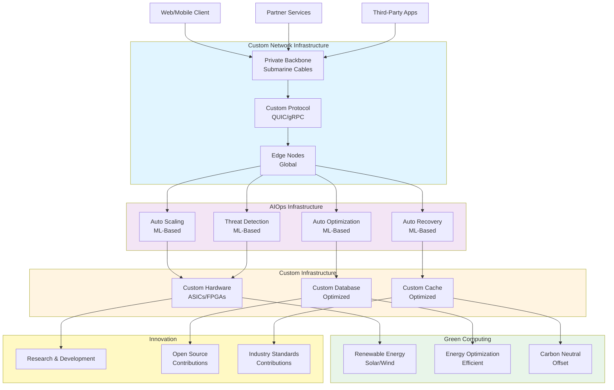

# 段階10: 10億ユーザー以上 - インフラ

## 1. この段階の特徴

### ユーザー数範囲
- **10億ユーザー以上**
- 日間アクティブユーザー（DAU）: 約500,000,000人以上
- 1日のリクエスト数: 約10,000,000,000リクエスト以上
- ピーク時の同時接続数: 約50,000,000接続以上

### 典型的な課題
- **インフラの最適化**: より革新的な技術の導入
- **カスタムプロトコル**: 専用プロトコルの開発
- **専用ネットワーク**: 専用ネットワークの構築
- **機械学習による自動最適化**: AIによる自動最適化
- **グリーンコンピューティング**: 環境に優しいコンピューティング

### 実例サービス
- **AWS（2010年代-現在）**: クラウドインフラの最適化とイノベーション
- **Google Cloud（2010年代-現在）**: 分散システムの最適化とカスタムインフラ
- **Microsoft Azure（2010年代-現在）**: エンタープライズ向けインフラの最適化

## 2. 追加すべき技術・設計

### 2.1 インフラ

**カスタムプロトコル**
- 専用プロトコルの開発（QUIC、gRPCなど）
- より効率的な通信プロトコル
- 低レイテンシ、高スループット

**専用ネットワーク**
- プライベートバックボーンネットワーク
- 海底ケーブルの所有
- 専用のネットワークインフラ

**機械学習による自動最適化**
- AIによるリソースの自動最適化
- 予測的なスケーリング
- 自動的な障害検出と復旧

### 2.2 データベース

**カスタムデータベースの最適化**
- より効率的なストレージエンジン
- カスタムインデックス構造
- 専用ハードウェアの活用

**グローバルなデータ同期**
- より効率的なレプリケーション
- 低レイテンシのデータアクセス
- 強い一貫性の保証

### 2.3 キャッシュ

**分散キャッシュの最適化**
- より効率的なキャッシュ戦略
- カスタムキャッシュシステム
- グローバルなキャッシュ同期

### 2.4 負荷分散

**グローバルロードバランシングの最適化**
- AIによる最適なルーティング
- 予測的な負荷分散
- 自動的なフェイルオーバー

### 2.5 モニタリング

**包括的なモニタリング**
- AIによる異常検知
- 予測分析
- 自動的な最適化

### 2.6 セキュリティ

**高度なセキュリティ対策**
- AIによる脅威検知
- 自動的なセキュリティ対策
- ゼロトラストアーキテクチャ

### 2.7 アーキテクチャ

**グリーンコンピューティング**
- 再生可能エネルギーの使用
- エネルギー効率の最適化
- カーボンニュートラル

**イノベーション**
- 新しい技術の研究と開発
- オープンソースへの貢献
- 業界標準の策定

## 3. アーキテクチャ図



**説明**:
- カスタムネットワークインフラ（プライベートバックボーン、カスタムプロトコル）が構築され、レイテンシと帯域幅が最適化
- AIOps（AIによる運用）により、自動スケーリング、最適化、復旧、脅威検知が実現
- グリーンコンピューティングにより、環境に優しいコンピューティングが実現
- イノベーション（研究開発、オープンソース、業界標準）により、技術の進歩が促進

## 4. 実例ケーススタディ

### 4.1 AWSのインフラ最適化（2010年代-現在）

**背景**:
- 2010年代、大規模なクラウドインフラの最適化が必要
- コスト効率とパフォーマンスの最適化が必要
- イノベーションの推進が必要

**導入した技術**:
- **カスタムプロトコル**: QUIC、gRPCのサポート
- **専用ネットワーク**: AWS Global Accelerator、プライベートバックボーン
- **機械学習による自動最適化**: AWS Auto Scaling、AWS Cost Explorer
- **グリーンコンピューティング**: 再生可能エネルギーの使用、カーボンニュートラル

**インフラの特徴**:
- **AWS Global Accelerator**: グローバルなロードバランシング、低レイテンシ
- **AWS Auto Scaling**: 機械学習による自動スケーリング
- **AWS Cost Explorer**: コストの最適化と予測
- **再生可能エネルギー**: 100%再生可能エネルギーの使用を目指す

**効果**:
- コスト効率が向上
- パフォーマンスが最適化
- 環境への影響が削減

**学び**:
- カスタムプロトコルにより、レイテンシと帯域幅が最適化
- 機械学習による自動最適化により、効率が向上
- グリーンコンピューティングにより、環境への影響が削減

### 4.2 Google Cloudの分散システム最適化（2010年代-現在）

**背景**:
- 2010年代、大規模な分散システムの最適化が必要
- グローバルなデータアクセスが必要
- イノベーションの推進が必要

**導入した技術**:
- **カスタムプロトコル**: QUIC、gRPCの開発と標準化
- **専用ネットワーク**: Google Cloud CDN、プライベートバックボーン
- **機械学習による自動最適化**: Google Cloud AutoML、予測分析
- **グリーンコンピューティング**: 再生可能エネルギーの使用、カーボンニュートラル

**インフラの特徴**:
- **QUIC**: 低レイテンシ、高スループットのプロトコル
- **gRPC**: 効率的なRPCフレームワーク
- **Google Cloud AutoML**: 機械学習の自動化
- **再生可能エネルギー**: 100%再生可能エネルギーの使用を達成

**効果**:
- レイテンシが削減
- スループットが向上
- 環境への影響が削減

**学び**:
- カスタムプロトコルにより、レイテンシとスループットが最適化
- 機械学習による自動最適化により、効率が向上
- グリーンコンピューティングにより、環境への影響が削減

## 5. 実装のヒント

### 5.1 設定例

**カスタムプロトコル（QUIC）**

```javascript
// QUIC Client
const quic = require('quic');

const client = quic.createSocket({
  client: {
    key: fs.readFileSync('client-key.pem'),
    cert: fs.readFileSync('client-cert.pem'),
    alpn: 'h3'
  }
});

client.on('session', async (session) => {
  const stream = await session.openStream({ halfOpen: false });
  
  stream.write(JSON.stringify({ type: 'request', data: 'Hello' }));
  
  stream.on('data', (data) => {
    console.log('Response:', JSON.parse(data.toString()));
  });
});

client.connect({
  address: 'example.com',
  port: 443
});
```

**機械学習による自動最適化**

```python
# ML-Based Auto Scaling
import tensorflow as tf
from sklearn.ensemble import RandomForestRegressor
import numpy as np

class AutoScaler:
    def __init__(self):
        self.model = RandomForestRegressor()
        self.historical_data = []
    
    def collect_metrics(self, metrics):
        # メトリクスを収集
        self.historical_data.append({
            'cpu': metrics['cpu'],
            'memory': metrics['memory'],
            'requests': metrics['requests'],
            'latency': metrics['latency'],
            'timestamp': metrics['timestamp']
        })
    
    def train_model(self):
        # モデルをトレーニング
        X = []
        y = []
        
        for i in range(len(self.historical_data) - 1):
            current = self.historical_data[i]
            next_data = self.historical_data[i + 1]
            
            X.append([
                current['cpu'],
                current['memory'],
                current['requests'],
                current['latency']
            ])
            y.append(next_data['requests'])
        
        self.model.fit(X, y)
    
    def predict_scale(self, current_metrics):
        # スケールを予測
        features = np.array([[
            current_metrics['cpu'],
            current_metrics['memory'],
            current_metrics['requests'],
            current_metrics['latency']
        ]])
        
        predicted_requests = self.model.predict(features)[0]
        
        # 必要なインスタンス数を計算
        instances_per_request = 1000
        required_instances = int(predicted_requests / instances_per_request)
        
        return max(required_instances, 1)
    
    def auto_scale(self, current_metrics):
        # 自動スケーリング
        required_instances = self.predict_scale(current_metrics)
        current_instances = self.get_current_instances()
        
        if required_instances > current_instances:
            self.scale_up(required_instances - current_instances)
        elif required_instances < current_instances:
            self.scale_down(current_instances - required_instances)
```

**グリーンコンピューティング**

```javascript
// Green Computing Manager
class GreenComputingManager {
  constructor(config) {
    this.renewableEnergy = config.renewableEnergy;
    this.energyOptimization = config.energyOptimization;
    this.carbonOffset = config.carbonOffset;
  }
  
  async optimizeEnergyUsage() {
    // エネルギー使用量を最適化
    const currentUsage = await this.getCurrentEnergyUsage();
    const renewableAvailability = await this.getRenewableEnergyAvailability();
    
    if (renewableAvailability > currentUsage) {
      // 再生可能エネルギーを使用
      await this.switchToRenewableEnergy();
    } else {
      // エネルギー使用量を削減
      await this.reduceEnergyUsage();
    }
  }
  
  async calculateCarbonFootprint() {
    // カーボンフットプリントを計算
    const energyUsage = await this.getTotalEnergyUsage();
    const renewablePercentage = await this.getRenewableEnergyPercentage();
    
    const carbonFootprint = energyUsage * (1 - renewablePercentage) * 0.5; // kg CO2
    
    return carbonFootprint;
  }
  
  async offsetCarbon() {
    // カーボンオフセット
    const carbonFootprint = await this.calculateCarbonFootprint();
    await this.purchaseCarbonCredits(carbonFootprint);
  }
}
```

### 5.2 コード例（簡略）

**AIによる異常検知**

```python
# AI-Based Anomaly Detection
import tensorflow as tf
from sklearn.preprocessing import StandardScaler
import numpy as np

class AnomalyDetector:
    def __init__(self):
        self.model = tf.keras.Sequential([
            tf.keras.layers.Dense(64, activation='relu', input_shape=(10,)),
            tf.keras.layers.Dense(32, activation='relu'),
            tf.keras.layers.Dense(16, activation='relu'),
            tf.keras.layers.Dense(10, activation='linear')
        ])
        self.scaler = StandardScaler()
        self.threshold = 0.1
    
    def train(self, normal_data):
        # 正常データでトレーニング
        X = self.scaler.fit_transform(normal_data)
        
        self.model.compile(optimizer='adam', loss='mse')
        self.model.fit(X, X, epochs=50, batch_size=32)
    
    def detect_anomaly(self, data):
        # 異常を検知
        X = self.scaler.transform([data])
        reconstructed = self.model.predict(X)
        
        mse = np.mean(np.square(X - reconstructed))
        
        if mse > self.threshold:
            return True, mse
        else:
            return False, mse
    
    def auto_recover(self, anomaly_data):
        # 自動復旧
        if self.detect_anomaly(anomaly_data)[0]:
            # 異常を検知した場合、自動的に復旧を試みる
            await self.trigger_recovery(anomaly_data)
```

**イノベーション管理**

```javascript
// Innovation Management
class InnovationManager {
  constructor(config) {
    this.research = config.research;
    this.openSource = config.openSource;
    this.standards = config.standards;
  }
  
  async conductResearch(topic) {
    // 研究を実施
    const research = await this.initiateResearch(topic);
    const results = await this.analyzeResults(research);
    
    if (results.promising) {
      await this.publishResearch(results);
      await this.contributeToOpenSource(results);
    }
    
    return results;
  }
  
  async contributeToOpenSource(contribution) {
    // オープンソースに貢献
    await this.forkRepository(contribution.repository);
    await this.implementFeature(contribution.feature);
    await this.createPullRequest(contribution);
    await this.maintainProject(contribution.project);
  }
  
  async contributeToStandards(proposal) {
    // 業界標準に貢献
    await this.submitProposal(proposal);
    await this.participateInWorkingGroup(proposal.workingGroup);
    await this.reviewFeedback(proposal);
    await this.finalizeStandard(proposal);
  }
}
```

## 6. コスト見積もり

### 6.1 典型的なコスト

**カスタムインフラの場合**
- **専用ネットワーク**: $50,000,000-200,000,000（初期投資）
- **カスタムプロトコル開発**: $10,000,000-50,000,000（初期投資）
- **機械学習インフラ**: $5,000,000-20,000,000（初期投資）
- **グリーンコンピューティング**: $20,000,000-100,000,000（初期投資）
- **運用コスト**: $5,000,000-20,000,000/月

**クラウドサービスの場合**
- **AWS/GCP/Azure**: $200,000-1,000,000/月（大規模な使用量）
- **カスタム開発**: $10,000,000-50,000,000（初期投資）
- **運用コスト**: $2,000,000-10,000,000/月

### 6.2 コスト最適化

1. **段階的な導入**: 必要な部分から段階的に導入
2. **オープンソースの活用**: オープンソースを活用し、開発コストを削減
3. **パートナーシップ**: パートナーとの協力により、コストを分担
4. **効率的な運用**: 自動化と最適化により、運用コストを削減
5. **グリーンコンピューティング**: 長期的なコスト削減と環境への配慮

## 7. まとめ

この段階では、以下の技術と設計が重要です：

1. **カスタムプロトコル**: 専用プロトコルの開発により、レイテンシと帯域幅が最適化
2. **専用ネットワーク**: プライベートバックボーンネットワークにより、レイテンシと帯域幅が最適化
3. **機械学習による自動最適化**: AIによる自動スケーリング、最適化、復旧、脅威検知が実現
4. **グリーンコンピューティング**: 再生可能エネルギーの使用により、環境への影響が削減
5. **イノベーション**: 研究開発、オープンソース、業界標準への貢献により、技術の進歩が促進

これらの技術と設計により、10億ユーザー以上の大規模なサービスを効率的に運用し、継続的に改善することが可能になります。

---

**完了**: 10段階のスケーリングガイドが完成しました。各段階で必要な技術と設計を理解し、段階的にシステムを成長させることができます。

