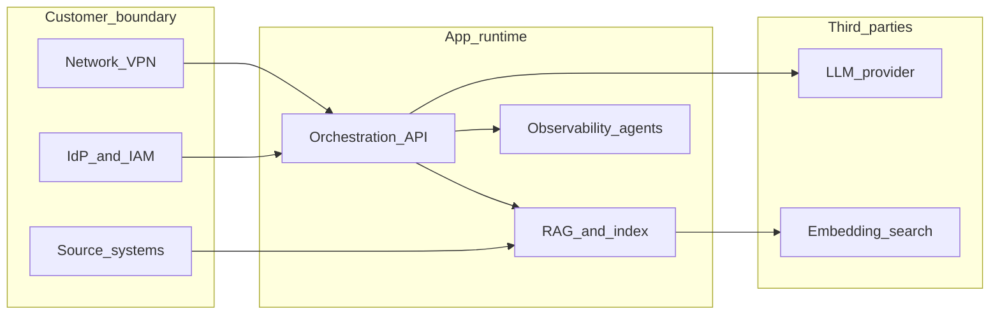

# 03 — 運用に効くアーキテクチャ

カスタムAIは **アプリ＋データパイプライン＋外部知能API** の合体です。開発時の「きれいな構成図」と本番で揉めるのは **境界・秘密・変更・ブラスト半径** です。

---

## 1. 環境分離の最低ライン

| 環境 | 目的 | 原則 |
|------|------|------|
| **dev** | 開発者の試行 | 本番データ禁止（サニタイズまたは合成） |
| **staging** | 受入れ・結合試験 | 本番に **近い** 設定。PIIはマスクまたはサブセット |
| **prod** | 事業利用 | 変更は **パイプライン経由のみ** |

**素人が誤解しやすい点**: staging があれば十分。  
**現場**: staging で **外部APIのレート・クォータ・権限** が本番と違うと、本番だけ壊れる。差分をテーブルで管理する。

---

## 2. 設定・シークレット

- **12-factor** 的に設定を **環境注入**。コードに埋めない。
- **短命クレデンシャル**（ワークロードID、Vault 等）を優先。
- **ローテーション手順**を Runbook 化（誰が・何分で・検証は何を見るか）。

AI 固有:

- LLM・検索・埋め込みの **キーは別々**。1つ漏洩で全部という構成は避ける。
- **プロンプトにシークレットを埋め込まない**（テンプレは設定ストアから注入）。

---

## 3. デプロイとロールバック

- **バージョンの単位**: アプリ `v` と ナレッジ世代 `g` と プロンプト版 `p` を **組み合わせ** で追跡できるようにする。
- **ロールバック**が「前リビジョンへ」だけだと足りないケース:
  - インデックス再構築済みで **旧世代に戻す**必要がある。
  - モデルAPIの **デフォルト版が変わった**（プロバイダ側）。→ **モデルIDをピン留め**。

---

## 4. マルチテナントとブラスト半径

企業内でも **事業部・部門・取引先** で分離要件が出ます。

- **論理分離**（テナントID）だけでは **クエリ漏れ**が一番怖い。
- DB・キュー・ストレージの **ネームスペース**、KMS キー、ネットワークポリシーで **物理的に狭める**選択肢を検討。

---

## 5. DR（障害復旧）の現実度

**素人が誤解しやすい点**: 別リージョンにコピーしておけば安心。  
**現場**:

- **RPO/RTO** は「欲しい値」ではなく **復旧手順の訓練** とセット。
- LLM API 全体障害は **あなたのDRでは復旧不能**。 **フェイルオーバー戦略**（別プロバイダ／縮退運用／キューイング）を **ビジネスが許容する形** で設計。

---

## 6. 責務分界図（概略）

**読み取りポイント**

- **顧客境界**: IdP・ネットワーク・マスタデータの正は多くの場合ここ。
- **アプリ runtime**: 変更リードタイムはここで制御。
- **第三者**: SLA・障害コミュニケーションは **別チャネル**。合成監視で **合成の限界**を理解する。

---

## 7. スケーラビリティとバックプレッシャ

- 同期的に LLM を呼ぶと **連鎖タイムアウト**しやすい。キュー＋ワーカーで **ピーク吸収**。
- **レート制限**はクライアント側・ゲートウェイ側・ワーカー側の **多層**で。
- **ストリーミング**応答時は、クライアント切断の **キャンセル伝播**を設計する。

---

## 8. 「運用で効く」設計レビューのチェックリスト

1. 本番変更は **誰の承認**か（二人承認、緊急時例外）。
2. **ロールバック**は15分以内に可能か（演習したか）。
3. **秘密**の棚卸しは四半期で回るか。
4. **データ分類**がコンポーネント横断で一貫しているか。
5. **第三者へのデータ出口**は一覧化されているか。

次: [04 — 観測性・SRE・障害](./04_observability_sre_and_incidents.md)
