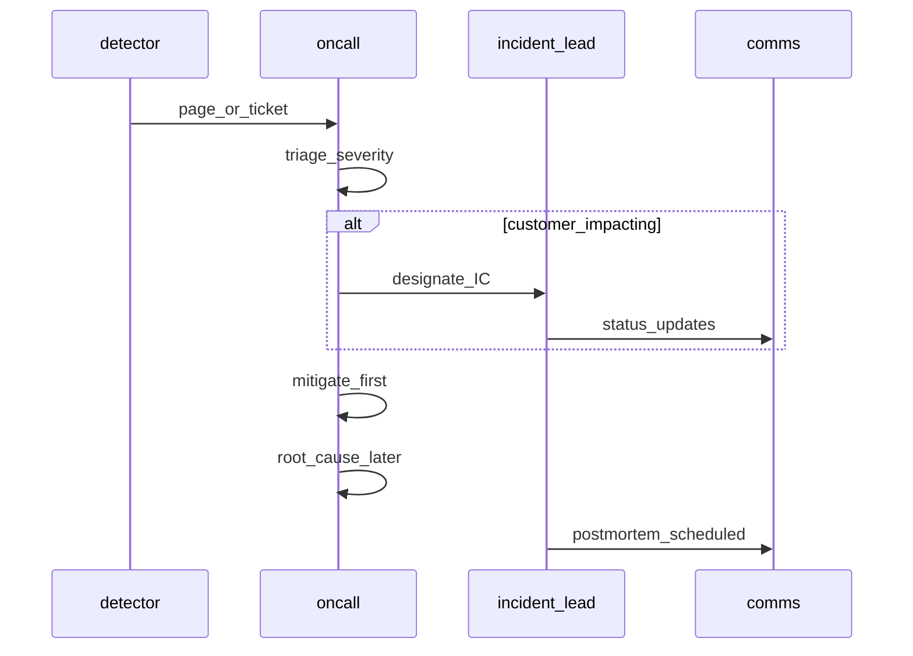

# 04 — 観測性・SRE・インシデント対応

**観測できないものは運用できない** は、カスタムAIでも同様です。加えて AI は **「静かに劣化する」** ので、可用性だけ見ていても足りません。

---

## 1. 観測性の三本柱（現場の使い分け）

| 柱 | 何がわかるか | AI での注意 |
|----|----------------|-------------|
| **ログ** | 個々の事象、因果追跡の足がかり | プロンプト全文は **マスキング**／サンプリング。相関ID必須。 |
| **メトリクス** | 率・分布・トレンド | トークン数、遅延p95、空応答率、ツール失敗率、RAGゼロヒット率。 |
| **トレース** | 分散処理のボトルネック | LLM・ベクタ検索・ツール呼び出しを **1リクエストで繋ぐ**。 |

---

## 2. SLI / SLO の考え方（AI向けに足す指標）

従来型に加え、次を **検討対象** に入れると現場が楽です。

- **latency p95/p99**（初token・完結まで別々に取るとよい）
- **error_rate**（HTTP 5xx、タイムアウト、アプリ例外）
- **empty_or_refusal_rate**（ポリシー拒否と混同しないよう分解）
- **tool_failure_rate**（外部API・権限エラー）
- **rag_zero_hit_rate**（検索が空＝品質・インデックス・ACLのどこかが怪しい）
- **user_downvote_or_rewrite_rate**（取得できるなら最強の品質信号）

**素人が誤解しやすい点**: 平均応答時間だけ見ればいい。  
**現場**: **尾**がサービス体験を支配する。p99 と **タイムアウト設計**をセットで。

---

## 3. アラート設計 — ノイズを減らす

良いアラートの条件:

- **ユーザーインパクト**または **SLI悪化**に直結。
- **実行するRunbook**が存在する（「調査して」だけはNG）。
- **誤検知率**をオーナーが把握している。

**アンチパターン**

- 「CPU高い」単体（AIワークロードは変動が大きい）。
- 「全ログキーワードマッチ」（Pager Fatigue）。

---

## 4. 障害の分類（トリアージ）

現場で使いやすい **親切度の高い分類**:

| 区分 | 説明 | 典型対応 |
|------|------|----------|
| **プラットフォーム** | 自社稼働基盤（K8s, DB） | スケール、再起動、フェイルオーバー |
| **依存サービス** | LLM API、検索、IdP | ステータス確認、縮退、キャッシュ |
| **リリース起因** | 直近デプロイと相関 | ロールバック、フィーチャーフラグオフ |
| **データ・ナレッジ** | インデックス空、ACL変更 | 再インデックス、権限ロールバック |
| **悪意・異常利用** | スパイク、インジェクション | レート制限、WAF、キー失効 |

AI では **「依存サービスは落ちてないが品質が死んでる」** が頻発。 **合成クエリ**（canary prompt）で **健全性** を別系統で監視するとよい。

---

## 5. 障害対応フロー（概要）

**プロのメンタルモデル**: まず **影響軽減**（縮退、止める、古い版に戻す）。原因究明は並行でよい。

---

## 6. ポストモーテム（事後検討）

良いポストモーテムは **犯人探し**ではなく **システムの改善**。

含めるべき要素:

- **タイムライン**（事実のみ）
- **影響**（ユーザー・データ・SLI）
- **根本原因**（5 whys 過信に注意。複合原因が普通）
- **学びと対策**（チケットに分解、オーナーと期限）
- **再発防止**が **プロセスだけ**で終わっていないか（自動化・テスト・監視）

**Blameless** を掲げる現場ほど、 **経営・契約上の説明責任** は別途必要、という緊張も理解しておく（→ [07](./07_professional_tensions.md)）。

---

## 7. オンコールと人の持続可能性

- **ローテーション**と **二次エスカレーション**。
- **Runbook** が無い番人オンコールは **数ヶ月で壊れる**。
- AI 案件は **ビジネス側の説明**が必要なことが多い → **インシデントコミュニケーションテンプレ**（顧客向け文章の骨子）を事前合意。

---

## 8. RTO / RPO の使い方

- **RTO**: 「何分で何を **必ず** 戻すか」— 縮退モードも含めて定義（フル機能復旧でない場合も）。
- **RPO**: バックアップ以外に **キュー滞留・再処理**で埋め合わせできるか。

年次で **復旧訓練**（game day）をしない RPO/RTO は **願望**。

重大度の **ひな形**・初動シナリオ・定例アジェンダは → [10 — 運用Playbook](./10_operational_playbooks_and_governance_hooks.md)。

次: [05 — AI固有の運用](./05_ai_specific_ops.md)
