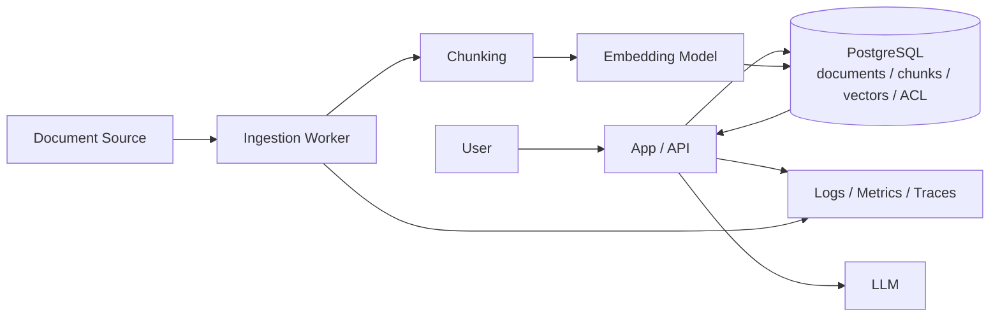
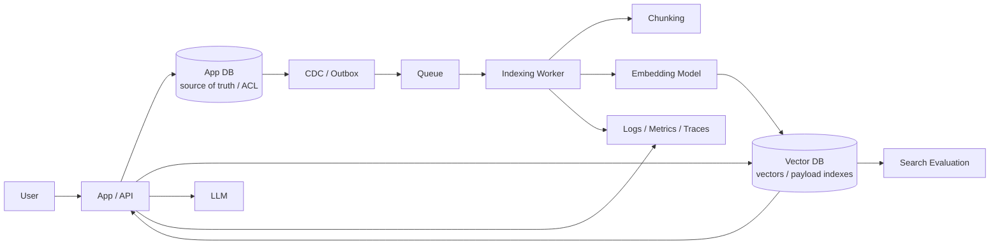
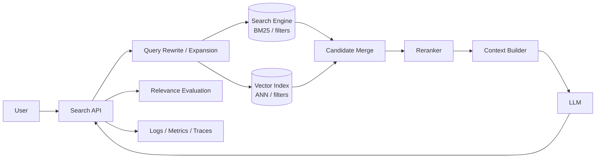
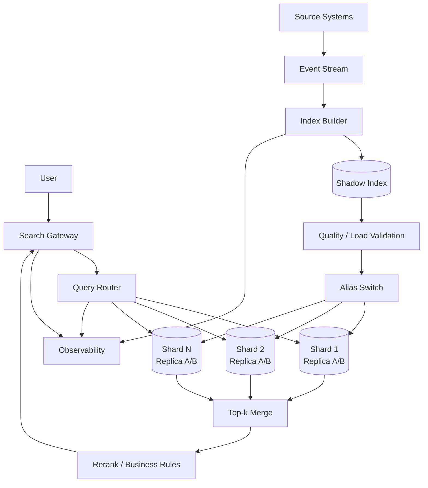
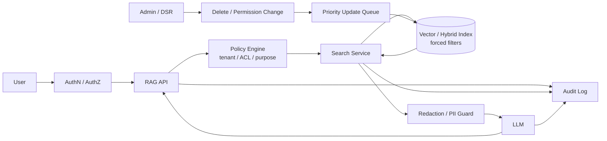
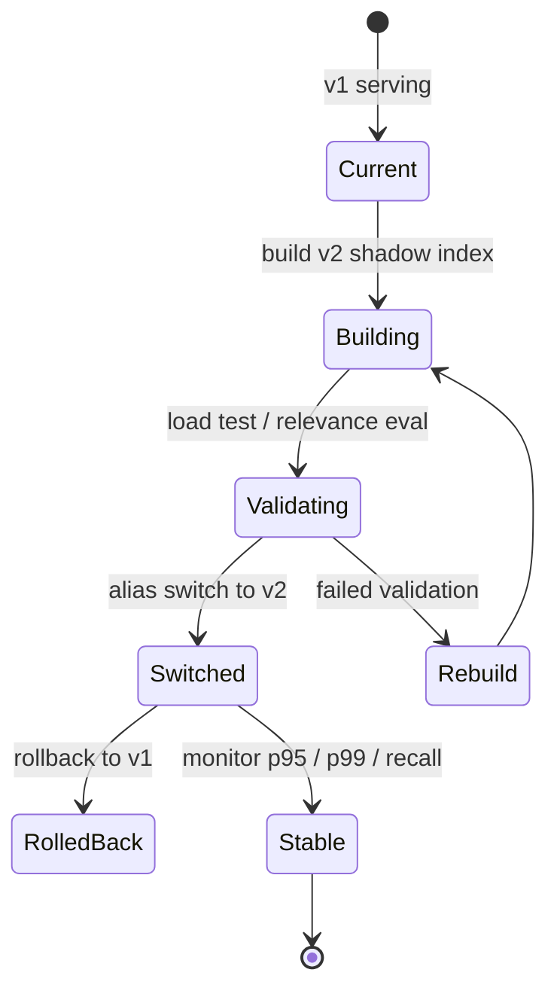
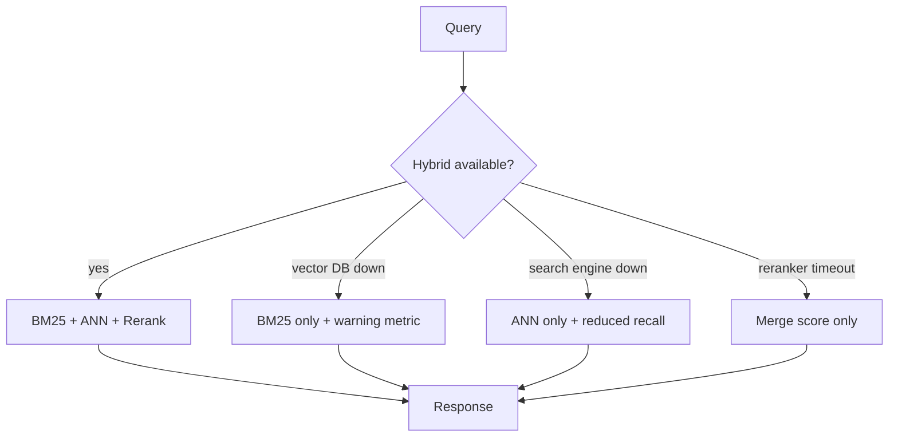

# 08. 具体的な構成図レビュー素材

この章は、RAG、ベクトル検索、検索基盤の設計レビューで使う「構成図の候補」と確認観点です。

目的は、特定製品の推奨ではなく、システム境界、データの正本、検索API、インデックス更新、評価、障害時の挙動を図にして議論できるようにすることです。

## 構成図で必ず表すもの

- ユーザーリクエストの同期経路
- 文書投入、chunking、embedding生成、index反映の非同期経路
- 正本DBと検索インデックスの関係
- ACL、tenant_id、metadata filterの適用位置
- embedding modelとindex version
- reranker、LLM、citation生成の位置
- 評価、監視、ログ、フィードバックの経路
- バックアップ、再構築、rollbackの単位

## 参照アーキテクチャ案

### 1. PostgreSQL + pgvector 一体型RAG

既存のPostgreSQLに文書メタデータ、チャンク、embeddingを持たせ、アプリケーションから直接検索する構成です。

向いているケース:

- 既存データ、権限、メタデータの正本がPostgreSQLにある
- 小中規模RAG、社内検索、業務アプリの補助検索
- チームが検索専用DBを増やしたくない
- JOIN、トランザクション、バックアップをDB側に寄せたい

向いていないケース:

- 高QPS、低p99、巨大データを検索DBとして独立にスケールさせたい
- embedding更新やreindexが頻繁で、アプリDB負荷と分離したい
- 複雑な全文検索、ランキング、集計を検索エンジンに寄せたい

障害・運用上の注意:

- 検索負荷が業務DBのCPU、メモリ、I/Oを圧迫する
- HNSW index構築やVACUUM、autovacuum、バックアップがp99に影響する
- 削除、権限変更、論理削除が検索結果に残らないことをテストする
- 将来分離できるように、検索APIとembedding生成をDB実装から切り離す

### 2. アプリDB + 専用ベクトルDB分離型

正本DBはアプリ側に残し、検索用のチャンク、embedding、payloadをQdrant、Weaviate、Milvusなどの専用DBに同期する構成です。

向いているケース:

- 検索負荷をアプリDBから分離したい
- payload filter、tenant filter、HNSWなどを専用DBに任せたい
- RAG検索を独立サービスとして育てたい
- index再構築、replica、snapshotを検索基盤側で扱いたい

向いていないケース:

- データ量が小さく、運用コンポーネント増加の方が重い
- 強い整合性が必要で、検索インデックスの遅延反映を許容できない
- チームが専用DBの障害対応、バックアップ、容量設計を持てない

障害・運用上の注意:

- App DBとVector DBの二重書き込みを避け、outboxやCDCで再実行可能にする
- index反映遅延のSLOを決め、遅延を監視する
- 正本削除やACL変更は通常更新より優先して反映する
- embedding model変更時は新旧indexを並行稼働し、alias切替とrollbackを設計する

### 3. ハイブリッド検索型

BM25などのキーワード検索とベクトル検索を組み合わせ、mergeまたはrerankで最終順位を作る構成です。

向いているケース:

- 固有名詞、型番、エラーコード、日付、完全一致語句が重要
- ベクトルだけではrecallや説明性が安定しない
- RAGだけでなく検索UIやフィルタ、集計も必要
- 検索品質をrerankerや評価セットで継続改善したい

向いていないケース:

- 構成を単純に保ちたい初期PoC
- 低レイテンシが最優先で、BM25、ANN、rerankの多段処理が許容できない
- 評価セットやランキング調整を運用する余力がない

障害・運用上の注意:

- BM25とANNの片方が落ちたときの劣化動作を決める
- merge比率、score正規化、rerank候補数を固定値で放置しない
- フィルタ条件をBM25側とベクトル側で同じ意味に保つ
- rerankerの遅延、コスト、タイムアウト時のfallbackを設計する

### 4. 大規模分散検索基盤型

検索サービスを独立させ、複数シャード、レプリカ、index version、再構築パイプラインを持つ構成です。

向いているケース:

- 数千万から億件規模、または高QPS
- tenant、時系列、IDなどでシャーディング戦略が必要
- 検索基盤を複数プロダクトで共用する
- index再構築、A/B、shadow index、rollbackが必須

向いていないケース:

- 小中規模RAG
- 検索基盤専門チームがない
- まだ検索品質やデータモデルが固まっていない

障害・運用上の注意:

- scatter-gatherでは最遅シャードが全体p99を決める
- shard skew、大口テナント、hot partitionを監視する
- replica間のindex version差で検索結果が揺れる
- alias切替、partial failure、再配置、バックフィルをリハーサルする

### 5. セキュアRAG / マルチテナント型

検索経路に認可、tenant分離、監査ログ、削除反映を明示する構成です。

向いているケース:

- 企業内文書、顧客別データ、医療、金融、法務、個人情報を扱う
- document-level ACLやtenant isolationが検索品質より重要
- 削除、権限変更、監査証跡のSLOがある

向いていないケース:

- 公開情報だけを扱う単純なFAQ
- ACLモデルが未整理で、検索側に責任を押し付けている状態

障害・運用上の注意:

- 検索後フィルタだけに依存すると漏洩リスクがある
- LLMに渡したcontext、query log、traceも保護対象にする
- 削除と権限変更は通常の再indexバッチより優先する
- backup、snapshot、評価データにも削除対象が残ることを忘れない

## Mermaidで表すべき構成

設計レビューでは、最低でも次の図を分けて書きます。1枚の巨大図にすると、同期経路、非同期経路、障害境界が曖昧になります。

| 図 | 目的 | Mermaid種別 |
|---|---|---|
| Query path | ユーザー要求から検索、rerank、LLM応答まで | `flowchart LR` |
| Ingestion path | 文書投入からindex反映まで | `flowchart LR` |
| Data ownership | 正本DB、検索index、ログ、評価データの責任境界 | `flowchart TB` |
| Version switch | shadow index、検証、alias切替、rollback | `stateDiagram-v2` または `flowchart LR` |
| Failure mode | 一部コンポーネント停止時のfallback | `flowchart TB` |
| Multi-tenant boundary | tenant分離、ACL、監査、削除反映 | `flowchart LR` |

### Index version切替の図

### 障害時fallbackの図

## レビュー時のチェックリスト

- 検索結果に使う文書、チャンク、embedding、metadataの正本はどこか
- index反映は同期か非同期か、遅延SLOは何分か
- 削除、権限変更、tenant移動は通常更新より優先されるか
- フィルタは検索前、検索中、検索後のどこで効くか
- exact baseline、recall@k、MRR、nDCG、p95/p99を測る場所があるか
- embedding model変更時に旧indexへ戻せるか
- partial failure時に検索不能、劣化応答、キャッシュ応答のどれにするか
- query log、context、prompt、回答、評価データの保存方針はあるか
- バックアップ、snapshot、再構築、restoreを本番相当データで試しているか

## よくある危険な図

- AppからLLMだけが描かれ、検索index更新経路がない
- Vector DBだけが正本のように描かれ、元文書、ACL、削除元がない
- 「metadata filter」と書いてあるが、検索前か検索後か不明
- embedding model名とindex versionが図にない
- rerankerやquery rewriteが追加されているのに、遅延とfallbackがない
- 評価、監視、ログ、監査が図の外にある
- 再構築時にどのindexがservingされるか分からない

## まとめ

構成図レビューでは、製品名よりも、同期経路、非同期経路、正本、認可、index version、障害時の劣化動作を確認します。

RAGの構成図は「LLMにcontextを渡す図」では不十分です。検索基盤として、データ更新、削除、評価、監視、再構築、rollbackまで描けているかが本番設計の分かれ目です。
