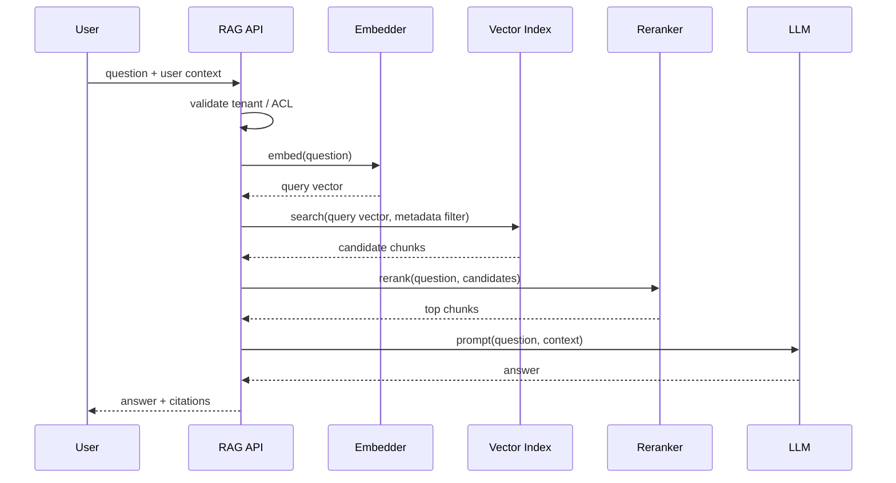

# 11. RAG実装サンプル

この章は、RAGシステムの最小構成を実装に落とすためのサンプルです。実プロダクトでは、ここにDB、ベクトルDB、認可、監視、評価基盤、LLM APIを差し替えます。

## 最小RAGの処理フロー



## 実装で分けるべき責務

### Ingestion

文書を読み込み、chunkに分割し、embeddingを作り、metadataとACLを保存します。失敗時に再実行できるよう、content_hashやchunk_idを使って冪等にします。

### Retrieval

質問をembeddingにし、tenant_idやACLなどのフィルタを必ず適用して検索します。検索後フィルタだけに頼らない設計が重要です。

### Reranking

ANNで広めに取った候補を、より高精度なスコアで並べ直します。最初からtop-kを小さくしすぎると、正しい文書を取り逃がします。

### Generation

検索結果をコンテキストとしてLLMに渡し、回答と引用を返します。根拠がない場合に無理に答えない方針を入れます。

### Evaluation

評価クエリセットを用意し、retrieval単体のrecall@kやhit rateを測ります。回答品質の評価とは分けて考えます。

## 最小Pythonサンプル

動作確認用の依存なしサンプルを [examples/minimal_rag_pipeline.py](examples/minimal_rag_pipeline.py) に置いています。

このサンプルは本番用ではありません。目的は、次の流れを1ファイルで確認することです。

- documentをchunkに分割する
- 疑似embeddingを作る
- cosine similarityで検索する
- tenant_idとACLでフィルタする
- token overlapでrerankする
- 引用付き回答を作る
- recall@kを測る

実システムでは、各部品を次のように差し替えます。

| サンプル内の部品 | 本番での置き換え |
|---|---|
| `HashEmbedder` | OpenAI / local embedding model / 社内モデル |
| `InMemoryVectorStore` | pgvector / Qdrant / Milvus / Weaviate / OpenSearch |
| `token_overlap_rerank` | cross-encoder reranker / LLM reranker |
| `generate_answer` | LLM API + safety policy |
| `evaluate_recall_at_k` | golden query set + CI評価 |

## 本番化するときに追加するもの

- 永続DB
- indexing queue
- retry / dead letter queue
- document-level ACL
- audit log
- OpenTelemetry trace
- indexing lag metric
- blue-green index
- offline evaluation
- prompt injection対策
- PII redaction

## API境界の例

```text
POST /documents
  文書を登録し、非同期でchunking/embedding/indexingする

DELETE /documents/{document_id}
  原本とchunkを削除し、検索indexからも削除する

POST /search
  query, tenant_id, user_id, filtersを受け取り、検索結果を返す

POST /rag/answer
  queryを受け取り、検索、rerank、生成、引用をまとめて返す

GET /indexing/status
  indexing lagや失敗件数を返す

POST /eval/retrieval
  評価クエリセットでrecall@kを測る
```

## 実装レビューで見ること

- 検索前または検索時にACLを適用しているか
- chunk_id、document_id、tenant_idが常に追跡できるか
- embedding_model_versionを保存しているか
- 削除済みchunkが検索結果に出ないか
- top-kとrerank候補数を分けているか
- 引用が元chunkに戻れるか
- 評価クエリで回帰テストできるか
