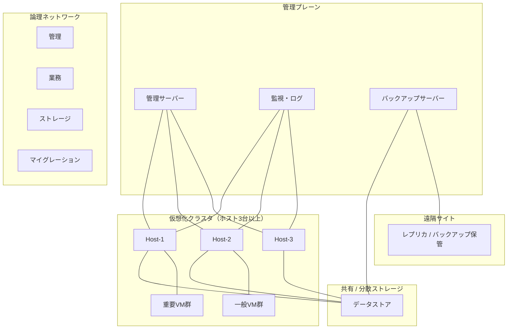

# 仮想化技術の基礎から実務設計まで

**執筆状態：完了**（第1章〜第15章、[用語集と確定設計サマリ](99_glossary_and_design_summary.md) を含む）

エントリは [README.md](README.md) からも辿れる。

## 本書の目的

読者が仮想化の仕組みを理解し、仮想マシン、ハイパーバイザー、仮想ネットワーク、仮想ストレージ、クラスタ、ライブマイグレーション、バックアップ、コンテナを体系的に説明できる状態になることを目指す。

さらに、小規模な仮想化基盤について、要件整理、サイジング、冗長化、構築、テスト、運用、障害対応を行える実務能力を身につける。

製品の操作手順ではなく、仮想化に共通する原理を軸に説明する。
VMware、Hyper-V、KVM の実装差は、共通概念を補強する比較として扱う。

## 想定読者

- 仮想化を初めて学ぶインフラエンジニア
- 仮想マシンの操作経験はあるが、内部構造を理解していない人
- VMware、Hyper-V、KVM の違いを整理したい人
- オンプレミス仮想化とクラウド（IaaS）の関係を整理したい人

## 解説方針

- 製品操作ではなく、仮想化に共通する原理を中心に説明する
- VMware、Hyper-V、KVM の実装例を必要に応じて比較する
- 利点だけでなく、制約と障害の波及範囲も説明する
- CPU、メモリ、ストレージ、ネットワークをレイヤー別に扱う
- 仮想マシンとコンテナを混同しない
- オンプレミス仮想化と IaaS の共通点と相違点を明示する
- 各章に構成図、実務例、障害例、演習を含める
- 製品固有機能と一般概念を区別する
- 理論値と実測値を区別する
- スナップショットとバックアップなど、混同されやすい概念を明示的に区別する

## 通貫シナリオ（実務設計課題）

本書では、次の小規模企業の仮想化基盤を一貫して用いる。
第13章から第15章で設計案を確定し、それ以前の各章では同じ前提を部分的に参照する。

### 業務要件

| 項目 | 内容 |
|------|------|
| 業務用仮想マシン | 30台（初期） |
| 重要システム | うち8台（ファイル、認証、業務AP、DB など） |
| 可用性 | 物理ホスト1台障害時も重要システムを継続 |
| 成長 | 2年間で VM 台数が約1.5倍（45台想定） |
| バックアップ | 定期バックアップ（日次）、遠隔地へ週次レプリケーション |
| 運用 | 監視、ログ収集、権限管理を必須とする |

### インフラ前提（設計時の初期値）

| 項目 | 前提値 | 備考 |
|------|--------|------|
| ハイパーバイザー | Type 1（ESXi / Hyper-V / KVM のいずれか） | 製品選定は第14章 |
| 物理ホスト | 3台以上（**推奨は4台**） | N+1。台数の確定は第13・14章 |
| ホストCPU | 2ソケット × 16コア（論理32スレッド） | 実測で再評価 |
| ホストメモリ | 512 GB | 管理オーバーヘッド込みでサイジング |
| 共有ストレージ | SAN（iSCSI）を第一候補 | NFS、分散ストレージは代替。第14章 |
| データストア容量 | 実効 20 TB 起算 | 成長余裕を別途。スナップショット長期保持はしない |
| ネットワーク分離 | 管理 / 業務 / ストレージ / マイグレーション | VLAN 分離を基本 |
| DR | 遠隔サイトへレプリケーション | RPO 24時間、RTO 8時間（仮） |

### 仮想マシン構成の仮置き

| 区分 | 台数 | vCPU | メモリ | ディスク | 備考 |
|------|------|------|--------|----------|------|
| 重要システム | 8 | 4 | 16 GB | 200 GB | HA 対象、バックアップ優先 |
| 一般業務 | 16 | 2 | 8 GB | 100 GB | 平日日中ピーク |
| 開発・検証 | 6 | 2 | 4 GB | 80 GB | 停止許容あり |

これらの数値は「設計の出発点」であり、確定値ではない。
第13章で計算式と余裕率を明示し、第14章で構成案を確定する。

### 通貫シナリオの全体構成（概略）

### 設計で明示する判断軸

各設計判断には、次を必ず書く。

1. 採用案とその理由
2. 不採用とした代替案
3. トレードオフ（コスト、複雑さ、性能、可用性）
4. 単一障害点（SPOF）
5. 障害時の挙動（停止する／しない、復旧手順の概要）

---

## ハンズオン環境

製品非依存の原理理解を優先するため、学習環境は次の二系統を用意する。
読者は少なくとも一方を用意すれば、各章の演習を実施できる。

### 推奨構成 A：ネスト仮想化（ノートPC上）

| 項目 | 内容 |
|------|------|
| ホストOS | Windows 11 Pro / macOS / Linux |
| 外側ハイパーバイザー | VirtualBox、VMware Workstation/Fusion、Hyper-V、UTM など |
| 内側ゲスト | Linux（Ubuntu Server など）に KVM、または評価版 ESXi / Hyper-V |
| CPU | 4コア以上、仮想化支援（Intel VT-x / AMD-V）有効 |
| メモリ | 16 GB 以上（32 GB 推奨） |
| ディスク | 100 GB 以上の空き |
| 目的 | ハイパーバイザー、VM 作成、仮想スイッチ、スナップショットの体験 |

ネスト仮想化では性能が実環境と大きく異なる。
CPU Ready やストレージ遅延の「絶対値」は学習指標に使わず、相対比較と切り分け手順の練習に使う。

### 推奨構成 B：3ノード相当の検証クラスタ（ラボ）

| 項目 | 内容 |
|------|------|
| 物理またはネスト | ホスト3台（または3 VM） |
| 共有ストレージ | NFS、iSCSI（TrueNAS 等）、または Ceph / Gluster の簡易構成 |
| ネットワーク | 最低2系統（管理と業務）。可能なら4系統 |
| 管理 | vCenter / SCVMM / oVirt / Proxmox VE など |
| 目的 | HA、ライブマイグレーション、ネットワーク分離、バックアップ連携 |

### 演習で扱う共通成果物

各章のハンズオンは、次のいずれかまたは複数を成果物とする。

- 構成図（Mermaid またはテキスト）
- リソース配分表（vCPU、メモリ、ディスク、ネットワーク）
- 障害切り分けメモ（症状、層、確認コマンド、仮説、結果）
- 設計判断メモ（採用理由、不採用案、トレードオフ）

### 用語と表記の約束

- **ホスト**：ハイパーバイザーが動作する物理サーバー（またはネスト時の外側ゲスト）
- **ゲスト**：仮想マシン上で動作する OS とアプリケーション
- **仮想マシン（VM）**：ハイパーバイザーが提供する仮想ハードウェア上の実行単位
- **コンテナ**：ホスト OS のカーネルを共有する OS レベル仮想化の実行単位
- 製品固有の機能名は初出で製品名を添え、一般概念と区別する

---

## 詳細目次と各章の到達目標

### 第1章 仮想化の全体像

**到達目標**

1. 仮想化を「物理資源の抽象化と多重化」として説明できる
2. サーバー統合、利用率、分離性、可搬性の関係を説明できる
3. ホストとゲスト、物理環境と仮想環境の対応を図示できる
4. 仮想化で増える管理対象を列挙し、運用負荷の変化を説明できる
5. メリットとデメリットを、性能・障害波及・コストの観点で対比できる

**主要トピック**

仮想化とは何か / 背景 / サーバー統合 / ハードウェア利用率 / 分離性 / 可搬性 / 物理と仮想 / ホストとゲスト / 管理対象の増加 / メリットとデメリット

---

### 第2章 ハイパーバイザー

**到達目標**

1. Type 1 と Type 2 の違いを、特権レベルと用途で説明できる
2. ハイパーバイザーの役割（CPU・メモリ・I/O の調停）を説明できる
3. ESXi、Hyper-V、KVM、Xen の位置づけを比較できる
4. ハードウェア支援仮想化、特権命令、VM Exit の関係を説明できる
5. エミュレーションと準仮想化、ゲストツールの役割を区別できる

**主要トピック**

Type 1/2 / 役割 / ESXi / Hyper-V / KVM / Xen / ハードウェア支援 / 特権命令 / VM Exit / 仮想デバイス / エミュレーションと準仮想化 / ゲストツール

---

### 第3章 CPU仮想化

**到達目標**

1. vCPU と物理コア、スレッドの関係を説明できる
2. CPU スケジューリングとオーバーコミットの意味を説明できる
3. CPU Ready と Co-Stop の兆候を説明できる
4. NUMA / vNUMA、アフィニティ、予約・制限・共有を設計判断に使える
5. 過剰な vCPU 割り当てが性能を下げる理由を説明できる

**主要トピック**

vCPU / 物理CPU・コア・スレッド / スケジューリング / オーバーコミット / CPU Ready / Co-Stop / NUMA / vNUMA / アフィニティ / 予約・制限・共有 / サイジング / 過剰割当

---

### 第4章 メモリ仮想化

**到達目標**

1. ゲストメモリとハイパーバイザーのメモリ管理の二層構造を説明できる
2. オーバーコミット、バルーニング、共有、圧縮、スワップの発動順の考え方を説明できる
3. メモリ予約と NUMA の関係を設計に反映できる
4. メモリ不足時の性能劣化の症状を列挙できる
5. 実務シナリオ向けのメモリサイジングの出発点を計算できる

**主要トピック**

仮想メモリ / ゲストOSメモリ / ハイパーバイザー管理 / オーバーコミット / バルーニング / 共有 / 圧縮 / スワップ / 予約 / NUMA / 性能劣化 / サイジング

---

### 第5章 ストレージ仮想化

**到達目標**

1. 仮想ディスクとデータストアの関係を説明できる
2. DAS / SAN / NAS、FC / iSCSI / NFS を用途で選べる
3. シン / シック、スナップショット、クローンの違いを説明できる
4. IOPS、レイテンシ、キュー、マルチパスを性能切り分けに使える
5. スナップショットを長期間保持すべきでない理由を説明できる

**主要トピック**

仮想ディスク / データストア / ブロックとファイル / DAS・SAN・NAS / FC・iSCSI・NFS / シン・シック / スナップショット / クローン / IOPS / レイテンシ / キュー / マルチパス / 障害影響

---

### 第6章 ネットワーク仮想化

**到達目標**

1. 仮想NIC、仮想スイッチ、ポートグループ、VLAN、アップリンクの関係を図示できる
2. ホスト内通信と外部通信の経路差を説明できる
3. 管理・ストレージ・マイグレーション・業務ネットワークの分離理由を説明できる
4. オーバーレイ（VXLAN 概要）と SR-IOV の位置づけを説明できる
5. 仮想ネットワーク障害の切り分け手順を層別に説明できる

**主要トピック**

vNIC / vSwitch / ポートグループ / VLAN / アップリンク / チーミング / ホスト内・外部通信 / 用途別ネットワーク / オーバーレイ / VXLAN / SR-IOV / 切り分け

---

### 第7章 仮想マシンのライフサイクル

**到達目標**

1. 作成、テンプレート、クローンの使い分けを説明できる
2. 仮想ハードウェア変更（ホットアド含む）の制約を説明できる
3. 起動・停止・コンソール・ディスク拡張の運用手順の要点を説明できる
4. 廃棄時のデータ消去と構成ドリフトの問題を説明できる
5. ライフサイクル管理のチェックリストを作れる

**主要トピック**

作成 / テンプレート / クローン / ゲストOS / 仮想ハードウェア / 起動停止 / コンソール / ディスク拡張 / vCPU・メモリ変更 / ホットアド / 削除 / データ消去 / 構成ドリフト

---

### 第8章 可用性とクラスタ

**到達目標**

1. 単一ホスト障害とクラスタによる緩和を説明できる
2. HA、ライブマイグレーション、ストレージマイグレーションの違いを説明できる
3. ハートビート、クォーラム、スプリットブレインの関係を説明できる
4. Admission Control、N+1、アンチアフィニティを設計に使える
5. 「VM が停止するケース」と「停止しないケース」を区別できる

**主要トピック**

単一ホスト障害 / クラスタ / HA / ライブマイグレーション / ストレージマイグレーション / フェイルオーバー / ハートビート / クォーラム / スプリットブレイン / アンチアフィニティ / Admission Control / N+1

---

### 第9章 バックアップと災害対策

**到達目標**

1. ゲスト内バックアップとハイパーバイザーレベルバックアップを比較できる
2. クラッシュ整合性とアプリケーション整合性を区別できる
3. スナップショットとバックアップの違いを明確に説明できる
4. RPO / RTO、レプリケーション、DR、復旧テストの関係を説明できる
5. ランサムウェア対策とイミュータブルバックアップの要点を説明できる

**主要トピック**

ゲスト内 / ハイパーバイザーレベル / イメージ / CBT / 整合性 / スナップショットとの違い / レプリケーション / DR / RPO / RTO / 復旧テスト / ランサムウェア / イミュータブル

---

### 第10章 仮想化基盤のセキュリティ

**到達目標**

1. 管理プレーンとデータプレーンの分離を説明できる
2. ハイパーバイザー脆弱性と管理ネットワーク分離の重要性を説明できる
3. 最小権限、多要素認証、ログ監査の運用要件を列挙できる
4. セキュアブート、仮想TPM、テンプレート安全性の要点を説明できる
5. パッチ管理を可用性制約と両立させる考え方を説明できる

**主要トピック**

管理・データプレーン / 脆弱性 / 管理網分離 / 最小権限 / MFA / ログ監査 / セキュアブート / vTPM / テンプレート / VM間分離 / パッチ

---

### 第11章 コンテナとの比較

**到達目標**

1. OSレベル仮想化としてのコンテナの仕組みを説明できる
2. Namespace、cgroups、イメージ、ランタイムの役割を説明できる
3. VM とコンテナを、分離性・起動速度・可搬性・永続ストレージで比較できる
4. Kubernetes の位置づけを概要レベルで説明できる
5. 「VM 上でコンテナを動かす」構成の適用領域を判断できる

**主要トピック**

OSレベル仮想化 / コンテナ / イメージ / ランタイム / Namespace / cgroups / VMとの違い / 起動速度 / 分離性 / 可搬性 / 永続ストレージ / Kubernetes / 適用判断

---

### 第12章 クラウドとの関係

**到達目標**

1. IaaS / PaaS / SaaS の責任範囲を説明できる
2. クラウドVM、インスタンスタイプ、仮想ネット、仮想ストレージの対応関係を説明できる
3. 可用性ゾーンとオンプレミスのクラスタ概念を対応づけられる
4. 責任分界、オートスケール、従量課金の設計への影響を説明できる
5. オンプレミス仮想基盤との共通点と相違点を対比できる

**主要トピック**

IaaS・PaaS・SaaS / クラウドVM / インスタンスタイプ / 仮想ネット・ストレージ / AZ / 責任分界 / オートスケール / 従量課金 / 比較

---

### 第13章 サイジングとキャパシティ管理

**到達目標**

1. 現状分析から CPU / メモリ / ストレージ / ネットワークの必要量を見積もれる
2. オーバーコミット率、成長率、HA予備、管理オーバーヘッドを計算に含められる
3. ピークと平均を混同しないサイジングができる
4. 前提条件、計算式、余裕率、障害時容量を明示した計算例を示せる
5. スケールアップとスケールアウトの選択基準を説明できる

**主要トピック**

現状分析 / CPU・メモリ・容量・IOPS・帯域 / オーバーコミット / 成長率 / HA予備 / 管理オーバーヘッド / ピークと平均 / 監視 / スケール

---

### 第14章 仮想化基盤の設計

**到達目標**

1. 機能要件と非機能要件を分離して整理できる
2. ホスト台数、クラスタ、ネットワーク分離、ストレージ、管理サーバーを一貫設計できる
3. バックアップ、監視、ログ、セキュリティ、ライセンス、保守を設計に含められる
4. 拡張計画と移行計画を段階的に示せる
5. 通貫シナリオについて、採用理由・代替案・トレードオフ・SPOF・障害時挙動を文書化できる

**主要トピック**

要件定義 / 機能・非機能 / ホスト台数 / クラスタ / ネットワーク / ストレージ / 管理 / バックアップ / 監視・ログ / セキュリティ / ライセンス・保守 / 拡張・移行

---

### 第15章 運用とトラブルシューティング

**到達目標**

1. 代表的な障害症状を、物理層・仮想層・ゲストOS層に切り分けられる
2. CPU Ready、メモリスワップ、データストア逼迫、スナップショット肥大の対処方針を説明できる
3. 仮想NIC不通、ホスト管理不能、HA不動作、マイグレーション失敗、バックアップ失敗の確認点を列挙できる
4. 切り分けメモの型（症状→仮説→確認→結果→次アクション）を使える
5. 通貫シナリオの運用チェックリストを作成できる

**主要トピック**

起動しない / 遅い / CPU Ready / スワップ / 容量不足 / スナップショット肥大 / ストレージ遅延 / NIC不通 / ホスト管理不能 / HA / マイグレーション / バックアップ / 三層切り分け

---

## 章ファイル一覧

| 章 | ファイル | 状態 |
|----|----------|------|
| README | `README.md` | 完了 |
| 目次・前提 | `00_mokuji.md` | 完了 |
| 第1章 | `01_virtualization_overview.md` | 完了 |
| 第2章 | `02_hypervisor.md` | 完了 |
| 第3章 | `03_cpu_virtualization.md` | 完了 |
| 第4章 | `04_memory_virtualization.md` | 完了 |
| 第5章 | `05_storage_virtualization.md` | 完了 |
| 第6章 | `06_network_virtualization.md` | 完了 |
| 第7章 | `07_vm_lifecycle.md` | 完了 |
| 第8章 | `08_availability_cluster.md` | 完了 |
| 第9章 | `09_backup_dr.md` | 完了 |
| 第10章 | `10_security.md` | 完了 |
| 第11章 | `11_containers.md` | 完了 |
| 第12章 | `12_cloud.md` | 完了 |
| 第13章 | `13_sizing_capacity.md` | 完了 |
| 第14章 | `14_design.md` | 完了 |
| 第15章 | `15_operations_troubleshooting.md` | 完了 |
| 付録 | `99_glossary_and_design_summary.md` | 完了 |

## 読み方

1. まず本ファイルで全体像、ハンズオン環境、通貫シナリオを把握する
2. 第1章から順に読み、各章末の問題とハンズオンを実施する
3. 第13章で通貫シナリオの数値を確定し、第14章で構成案を固める
4. 第15章で運用と障害対応の型を身につける
5. 復習や設計レビューでは [付録](99_glossary_and_design_summary.md) の用語集と確定設計サマリを使う

## 通貫シナリオの設計結論（要約）

詳細は第13章、第14章、付録を正本とする。

| 判断 | 結論 |
|------|------|
| ホスト台数 | **4台推奨**（3台は厳格なAdmission Control前提の代替） |
| ストレージ | iSCSI共有を第一候補 |
| ネットワーク | 管理 / 業務 / ストレージ / マイグレーションを分離 |
| バックアップ | 日次イメージ、遠隔週次。スナップショット長期保持で代用しない |
| 各判断の記録 | 採用理由、不採用案、トレードオフ、SPOF、障害時挙動を文書化 |

理論値（カタログ値、計算上の上限）と実測値（モニタリングで得た値）を混同しないこと。
設計判断は「正しい唯一解」ではなく、制約下の選択として記録すること。
