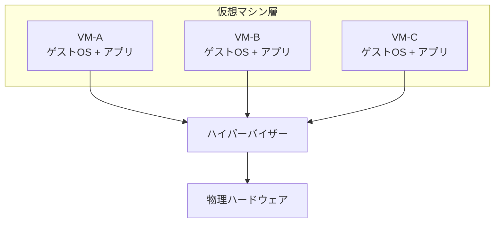
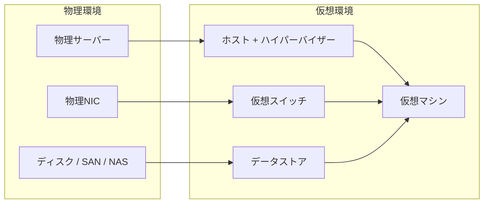

# 第1章 仮想化の全体像

## 学習目標

1. 仮想化を「物理資源の抽象化と多重化」として説明できる
2. サーバー統合、利用率、分離性、可搬性の関係を説明できる
3. ホストとゲスト、物理環境と仮想環境の対応を図示できる
4. 仮想化で増える管理対象を列挙し、運用負荷の変化を説明できる
5. メリットとデメリットを、性能・障害波及・コストの観点で対比できる

---

## 1.1 仮想化とは何か

1台の物理サーバーに、OSを1つだけ載せる運用はわかりやすい。
わかりやすいが、そのサーバーのCPU使用率が常に5%前後なら、残りの95%は待機していることになる。

ここで問われるのは、「余っている資源を、別の仕事に使えないか」である。
答えの一つが仮想化である。

**仮想化（virtualization）**とは、物理的な計算資源（CPU、メモリ、ディスク、ネットワーク）を抽象化し、複数の実行環境がそれらを共有・分割できるようにする技術である。
本書が主に扱うのは、1台の物理サーバー上に複数の**仮想マシン（VM: Virtual Machine）**を動作させるサーバー仮想化である。

仮想マシンから見ると、あたかも専用の物理サーバーがあるように見える。
実際には、その下で**ハイパーバイザー（hypervisor）**が物理資源を調停している。

```text
+-----------------------------------------------+
| 仮想マシンA        仮想マシンB      仮想マシンC |
| (ゲストOS+アプリ)  (ゲストOS+アプリ) (ゲストOS+アプリ) |
+-----------------------------------------------+
|              ハイパーバイザー                   |
+-----------------------------------------------+
|     物理サーバー（CPU / メモリ / ディスク / NIC） |
+-----------------------------------------------+
```



仮想化は「魔法でサーバーを増やす技術」ではない。
物理資源の上限は変わらない。
変わるのは、その上限の見せ方と割り当て方である。

---

## 1.2 仮想化が必要になった背景

2000年代前後の企業データセンターでは、業務システムごとに物理サーバーを用意する構成が一般的だった。
理由は単純で、アプリケーション同士の干渉を避け、障害範囲を閉じたかったからである。

その結果、次の問題が積み上がった。

- サーバー台数が増え、設置スペース、電力、冷却コストが増える
- 各サーバーの平均CPU使用率、メモリ使用率が低い
- 調達から稼働までのリードタイムが長い
- ハード障害時の切り替えが、物理入れ替えに依存しやすい

サーバー統合の圧力は、コスト削減だけから来たわけではない。
変更速度への要求も同時に上がっていた。
新しい検証環境を「来月の調達」では間に合わない場面が増えた。

仮想化は、この二つの圧力（利用率の低さと変更速度の遅さ）に対する実務的な応答だった。

---

## 1.3 サーバー統合

**サーバー統合（server consolidation）**とは、複数の物理サーバー上で動いていたワークロードを、少数の物理ホスト上の仮想マシンへ集約することである。

統合の単位は「サーバー台数」ではなく、「ワークロード」である。
ファイルサーバー、認証サーバー、業務アプリ、開発用Webサーバーは、それぞれ別の仮想マシンとして残しつつ、物理ホストは共有する。

実務例（通貫シナリオの縮図）を考える。

| 統合前 | 統合後（概念） |
|--------|----------------|
| 物理サーバー30台 | 物理ホスト3〜4台 + VM30台 |
| 各サーバーに電源・保守契約 | ホスト単位の保守 + VM単位の運用 |
| 空きラックが逼迫 | ラック占有が減少 |

統合比（consolidation ratio）は「物理1台あたり何VMか」で語られることが多い。
ただし、これは結果指標であって設計目標ではない。
CPU Ready やメモリ逼迫を無視して統合比だけ上げると、統合は成功に見えて業務は遅くなる。

---

## 1.4 ハードウェア利用率

仮想化の第一の経済合理性は、利用率の改善にある。

物理1台・業務1システムの構成では、ピークに合わせて調達するため、平均利用率が低くなる。
仮想化では、ピーク時間帯がずれるワークロードを同居させ、物理資源の平均利用率を上げられる。

ここで区別すべきは次の二つである。

- **理論上の利用率**：カタログ上のCPUコア数やメモリ容量に対する割当比率
- **実測の利用率**：実際に観測された使用率、待ち時間、スワップ発生など

設計会議で「CPUは40%しか使っていないからまだ載せられる」と言いたくなる。
しかし、その40%が特定の時間帯に集中し、同居VMのピークが重なれば、平均は低くても体感は遅い。

利用率の議論は、必ず時間軸（平均、ピーク、95パーセンタイル）を添える。

---

## 1.5 分離性

仮想化が受け入れられたもう一つの理由は、分離性である。

**分離性（isolation）**とは、ある仮想マシンの障害や負荷、セキュリティ侵害が、他の仮想マシンへ波及しにくい性質を指す。
理想的には、各VMは独自のOS、独自の障害領域、独自の権限境界を持つ。

ただし、分離は完全ではない。

| 分離されるもの | 共有されるもの |
|----------------|----------------|
| ゲストOSのプロセス空間 | 物理CPU、物理メモリ、物理NIC、ストレージパス |
| 多くの設定と障害 | ハイパーバイザー、ホスト障害、共有ストレージ障害 |

「仮想化すれば完全に独立」と考えると設計を誤る。
分離性はゲスト間では強いが、ホストと共有基盤では弱い。
この非対称が、後章のHA設計とストレージ設計の出発点になる。

---

## 1.6 可搬性

**可搬性（portability）**とは、仮想マシンを、ある物理ホストから別の物理ホストへ移しやすい性質である。

仮想マシンは、仮想ハードウェア定義と仮想ディスクというまとまりとして扱える。
そのため、次が可能になる。

- ホスト保守前にVMを別ホストへ移す
- 負荷分散のために配置を変える
- テンプレートから同型環境を複製する

可搬性は「どこへでも無条件に移せる」意味ではない。
CPU互換性、仮想ハードウェアバージョン、ストレージ接続、ネットワーク接続が前提になる。
ライブマイグレーション（第8章）は、この可搬性を稼働中に使う機能である。

---

## 1.7 物理環境と仮想環境

物理環境と仮想環境は、対応関係で理解すると混乱が減る。

| 物理環境 | 仮想環境での対応 |
|----------|------------------|
| 物理サーバー | ホスト（ハイパーバイザーが動作） |
| 物理NIC | アップリンクNIC + 仮想スイッチ |
| 物理ディスク / LUN / 共有フォルダ | データストア |
| サーバー上のOS | ゲストOS |
| サーバーの電源操作 | VMの電源操作（ただしホスト電源とは別） |



混同しやすい点がある。
仮想マシンの「再起動」はゲストOSの再起動であり、ホストの再起動ではない。
ホストの再起動は、その上の全VMに影響する。
操作対象の層を間違えると、影響範囲の見積もりが狂う。

---

## 1.8 ホストとゲスト

**ホスト（host）**は、ハイパーバイザーが動作し、物理資源を持つ側である。
**ゲスト（guest）**は、仮想マシン上で動作するOSと、その上のアプリケーションである。

用語の揺れに注意する。

- 「ホストOS」：Type 2 ハイパーバイザーでは、ハイパーバイザーを載せる一般OSを指すことがある
- Type 1 では、ハイパーバイザー自体が薄い基盤としてハードウェア上で動作する（第2章）

本書では特に断らない限り、次の用法で統一する。

- ホスト：物理サーバー側（ハイパーバイザー動作環境）
- ゲスト：仮想マシン内のOS
- VM：仮想マシン全体（仮想ハードウェア + ゲスト）

通貫シナリオでは、ホスト3台以上の上にゲスト（業務VM）30台が載る。
障害対応では、「遅いのはゲストか、ホストか、共有ストレージか」を最初に切り分ける。

---

## 1.9 仮想化によって増える管理対象

仮想化は管理対象を減らすように見えて、実は増やす。
減るのは主に物理筐体の数であり、増えるのは論理オブジェクトである。

増える管理対象の例は次のとおりである。

- ハイパーバイザーとパッチレベル
- クラスタ設定、HA、DRS/負荷分散相当の方針
- データストア、仮想ディスク、スナップショット
- 仮想スイッチ、ポートグループ、VLAN対応
- テンプレート、クローン、仮想ハードウェアバージョン
- 権限（誰がどのVMを操作できるか）
- バックアップジョブと整合性レベル
- 監視メトリクス（CPU Ready、スワップ、データストア遅延など）

```text
物理だけの世界:
  サーバー / OS / アプリ / スイッチ / ストレージ

仮想化後:
  上記に加えて
  ハイパーバイザー / クラスタ / VM定義 / 仮想ディスク /
  仮想NIC / スナップショット / テンプレート / 配置ルール
```

運用負荷は「台数」ではなく「状態の組み合わせ」で増える。
スナップショットを残したままテンプレートを更新し、古い仮想ハードウェアのままクローンを量産する、といったドリフトが典型である（第7章）。

設計上の判断ポイントは明確である。
仮想化を入れるなら、管理プレーン（監視、構成管理、権限、バックアップ）への投資を同時に見積もる。
ハイパーバイザーだけ導入して管理を後回しにすると、統合の利益より運用事故のコストが先に来る。

---

## 1.10 仮想化のメリットとデメリット

### メリット

- **利用率向上**：ピークがずれるワークロードを同居させ、物理資源を有効利用できる
- **分離性**：OS単位の境界を維持したまま集約できる
- **可搬性**：保守、負荷分散、複製がしやすい
- **迅速なプロビジョニング**：テンプレートから短時間で環境を作れる
- **可用性機能の土台**：HAやライブマイグレーションの前提になる
- **ハードウェア抽象化**：ゲストを特定筐体に固定しにくい

### デメリットと制約

- **障害の影響範囲が広がる**：ホスト障害や共有ストレージ障害が多VMに波及する
- **性能の見え方が複雑になる**：ゲスト内CPU使用率が低くても、CPU Ready で待っていることがある
- **管理対象が増える**：論理構成の複雑さが増す
- **ライセンスとスキル**：ハイパーバイザー、管理ソフト、バックアップ連携のコストと習熟が必要
- **過度な統合のリスク**：オーバーコミットの設計ミスが静かに性能を削る
- **ネストした障害解析**：物理層、仮想層、ゲスト層の切り分けが必要になる

### 製品比較ではなく原理としての対比

| 観点 | 物理1システム1サーバー | 仮想化集約 |
|------|------------------------|------------|
| 平均利用率 | 低くなりやすい | 上げやすい |
| 障害の単位 | 筐体単位で閉じやすい | ホスト/ストレージ単位で広がりやすい |
| 構築速度 | 調達依存 | テンプレート次第で速い |
| 性能解析 | 比較的単純 | 待ち時間指標が必要 |
| 初期コスト | 台数に比例 | 集約基盤への投資が必要 |

### セキュリティ上の注意点（概要）

仮想化は境界を増やすと同時に、突破時の価値も高める。
ハイパーバイザーや管理ネットワークが侵害されると、多数のVMが同時に危険に晒される。
詳細は第10章で扱うが、第1章の段階では次だけ押さえる。

- 管理界面は業務ネットワークから分離する
- 「VM間は分離されている」を過信しない
- テンプレートに秘密情報を埋め込まない

### 性能上の注意点（概要）

仮想化のオーバーヘッド自体は、現代のハードウェア支援仮想化では多くの業務で許容範囲になる。
問題になりやすいのはオーバーヘッドそのものより、資源の奪い合いである。

- CPUオーバーコミット過多
- メモリ逼迫によるスワップ
- データストアのIOPS不足
- バックアップやスキャンがピークと重なる

---

## 1.11 障害例と切り分け

### 障害例1：仮想化したのに「全体が同時に止まった」

**症状**：業務VMの半数以上が同時に応答停止した。

**よくある誤解**：仮想化が不安定だから元の物理構成に戻すべきだ。

**切り分けの視点**：

1. 特定ホスト上のVMだけか、全ホストか
2. 共有データストアの遅延やパス断がないか
3. 管理ネットワーク障害で「止まって見える」だけではないか

**典型原因**：共有ストレージのコントローラ障害、データストア満杯、ホストのカーネルパニック相当。
仮想化が原因というより、共有点に単一障害点が残っていた可能性が高い。

### 障害例2：新しいVMを追加したら既存VMが遅くなった

**症状**：追加直後から既存業務が遅い。ゲスト内CPU使用率は高くない。

**確認点**：

- ホストのCPU Ready（または同等指標）
- メモリのバルーン、スワップ
- データストアレイテンシ

**典型原因**：統合比だけを見て資源余裕を確認しなかった。
第3章から第5章の指標がここで効く。

### 障害例3：開発VMのスナップショットが本番を圧迫した

**症状**：データストア使用率が急増し、本番VMのディスクI/Oが遅延。

**典型原因**：検証目的のスナップショットを長期間保持し、差分が肥大化した。
スナップショットはバックアップではない（第5章、第9章）。

---

## 1.12 設計上の判断ポイント（通貫シナリオへの接続）

通貫シナリオ（VM30台、ホスト3台以上、ホスト1台障害耐性）を前提に、第1章で決めておく判断は次である。

| 判断 | 採用の方向 | 不採用案 | 理由とトレードオフ |
|------|------------|----------|--------------------|
| 集約方針 | 少数ホストへ統合 | 重要システムだけ物理残留 | 統合で運用を揃える。物理残留は障害モデルが二重管理になる |
| 分離の単位 | OS/アプリはVM単位 | 1VMに多業務を詰め込む | 分離性を維持。詰め込みすぎると障害影響と変更影響が拡大 |
| 管理投資 | 監視・権限・バックアップを初期要件へ | まずハイパーバイザーだけ | 管理対象増を前提にしないと運用事故が先行する |

単一障害点の意識も、この章から始める。
物理サーバーを減らすと、残ったホストと共有ストレージの重要度が上がる。
統合はコスト最適化であると同時に、影響範囲の再設計でもある。

---

## 章末問題

### 問題1

仮想化を「物理サーバーをソフトウェアで増やす技術」と説明した同僚がいる。
この説明のどこが不正確か。より正確な定義を述べよ。

### 問題2

サーバー統合によって平均CPU使用率が上がった。
それでもピーク時に業務が遅くなる可能性がある理由を、時間軸の観点から説明せよ。

### 問題3

次の事象が起きたとき、影響が「1VMに閉じやすい」ものと「多VMに波及しやすい」ものに分類せよ。

1. ゲストOS上のアプリケーションクラッシュ
2. 共有データストアのパス断
3. 特定VMのvCPU過剰割当によるCPU Ready上昇（同居VMへの影響を含む）
4. ゲスト内の誤ったファイアウォール設定

### 問題4

仮想化によって減る管理対象と増える管理対象を、それぞれ3つ以上挙げよ。

### 問題5

通貫シナリオでホストを3台にする目的を、「台数が多いほど良い」以外の言葉で説明せよ。

---

## 解答と解説

### 問題1

不正確な点は、物理資源の上限が増えるかのような含意である。
より正確には、仮想化は物理資源を抽象化し、複数の実行環境がそれを分割・共有できるようにする技術である。
見えるサーバー数は増えても、物理CPUや物理メモリの総量は増えない。

### 問題2

平均使用率は時間平均であり、ピークの重なりを表さない。
同居VMのピークが同時刻に重なると、平均が低くてもCPU待ちやI/O待ちが発生する。
利用率改善とピーク耐性は別問題である。

### 問題3

1. 1VMに閉じやすい
2. 多VMに波及しやすい
3. 多VMに波及しやすい（ホストCPUの奪い合い）
4. 1VMに閉じやすい（通信先への影響はあるが、仮想化基盤全体の共有障害ではない）

### 問題4

減る例：物理筐体数、物理電源口、個別サーバーのキッティング台数。
増える例：VM定義、仮想ディスク、スナップショット、仮想スイッチ、クラスタ設定、テンプレート、配置ルール、仮想化固有メトリクス。

### 問題5

ホスト1台障害時に、残るホストで重要システムを継続するためである。
N+1（または同等）の予備容量を持つことが目的であり、単なる台数増加ではない。
詳細な計算は第8章、第13章で扱う。

---

## ハンズオン演習

### 演習1：対応表を作る

自分の学習環境（ネスト仮想化またはラボ）について、次の対応表を埋めよ。

| 物理 / 外側 | 仮想 / 内側 | 備考 |
|-------------|-------------|------|
| 物理CPU | | |
| 物理メモリ | | |
| 物理NIC | | |
| ディスク | | |
| ホスト | | |
| ゲスト | | |

### 演習2：統合前後の差分を書く

架空でもよいので、物理6台を仮想化でホスト2台へ統合する前後を比較し、次を記述せよ。

1. 減るもの
2. 増えるもの
3. 新たに監視すべき指標候補

### 演習3：通貫シナリオの影響範囲メモ

ホスト1台が停止したとき、次がどうなるかを現時点の知識で仮説として書け。

1. そのホスト上のVM
2. 他ホスト上のVM
3. 共有ストレージ上のデータ
4. 管理界面

第8章以降で仮説を検証し、修正する。

### 成果物

- 対応表
- 統合差分メモ
- 影響範囲の仮説メモ

---

## 本章のまとめ

仮想化は、物理資源を増やさずに、抽象化と多重化によって使い方を変える技術である。
サーバー統合は利用率を上げるが、共有点への依存も強める。
分離性と可搬性は仮想化の強みだが、ホストと共有ストレージの障害モデルを同時に設計しない限り、強みは弱点に転ぶ。

次に必要になるのは、この多重化を実際に調停している存在、ハイパーバイザーの理解である。
