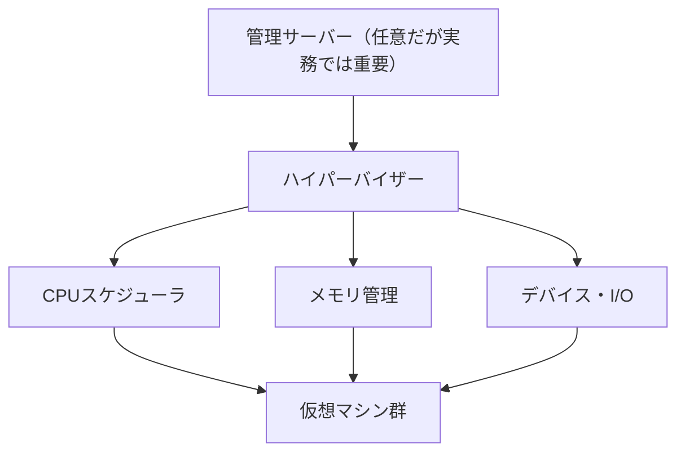
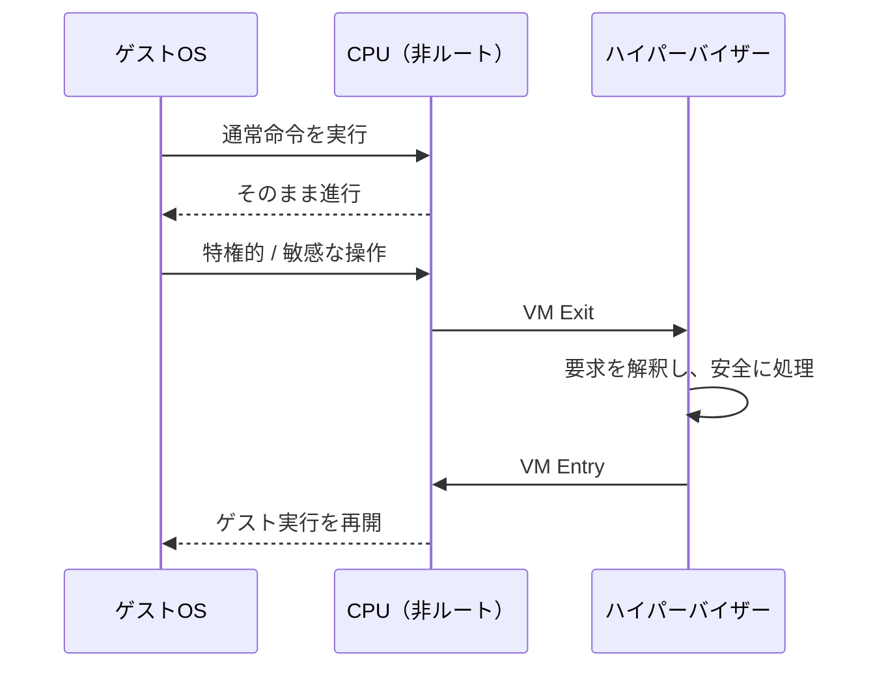

# 第2章 ハイパーバイザー

## 学習目標

1. Type 1 と Type 2 の違いを、特権レベルと用途で説明できる
2. ハイパーバイザーの役割（CPU・メモリ・I/O の調停）を説明できる
3. ESXi、Hyper-V、KVM、Xen の位置づけを比較できる
4. ハードウェア支援仮想化、特権命令、VM Exit の関係を説明できる
5. エミュレーションと準仮想化、ゲストツールの役割を区別できる

---

## 2.1 なぜハイパーバイザーが必要か

第1章で見た仮想マシンは、勝手には動かない。
複数のゲストが同じ物理CPU、同じ物理メモリ、同じ物理NICを使おうとするため、調停役が必要になる。

その調停役が**ハイパーバイザー**である。
別名を VMM（Virtual Machine Monitor）と呼ぶこともある。

ハイパーバイザーの仕事は、次の三つに要約できる。

1. 仮想マシンに仮想ハードウェアを見せる
2. ゲストの特権的な操作を捕捉し、安全に処理する
3. 物理資源の割り当てとスケジューリングを行う

ゲストOSは、自分が仮想化されていることを必ずしも知らなくてよい。
知らなくても動くように見せるのが、古典的なハイパーバイザーの目標だった。
現代では、知っているほうが速い場面も多い。その差が、エミュレーションと準仮想化の差になる。

---

## 2.2 Type 1 と Type 2

ハイパーバイザーは、動作位置によって大きく二つに分類される。

### Type 1（ベアメタル型）

ハードウェア上で直接動作する。
その上に仮想マシンを載せる。

```text
+--------+  +--------+  +--------+
|  VM-A  |  |  VM-B  |  |  VM-C  |
+--------+  +--------+  +--------+
|         Type 1 ハイパーバイザー  |
+--------------------------------+
|           物理ハードウェア       |
+--------------------------------+
```

用途の中心は、データセンターや企業の本番仮想化基盤である。
通貫シナリオの本番基盤は、原則として Type 1 を選ぶ。

### Type 2（ホスト型）

一般的なOS（ホストOS）の上に、アプリケーションとして載る。

```text
+--------+  +--------+
|  VM-A  |  |  VM-B  |
+--------+  +--------+
|   Type 2 ハイパーバイザー       |
+--------------------------------+
|           ホストOS              |
+--------------------------------+
|           物理ハードウェア       |
+--------------------------------+
```

用途の中心は、開発者のノートPC、検証、ネスト実験である。
VirtualBox や VMware Workstation/Fusion が典型である。

### 比較

| 観点 | Type 1 | Type 2 |
|------|--------|--------|
| 配置 | ハードウェア直上 | ホストOS上 |
| 典型用途 | 本番サーバ仮想化 | PC上の検証・開発 |
| 管理モデル | 集中管理前提が多い | 単機利用が多い |
| オーバーヘッド | 相対的に小さい設計 | ホストOS分が乗る |
| 本書の通貫シナリオ | 採用側 | 学習用に併用 |

境界は教科書ほど綺麗ではない。
Hyper-V は Windows 上に見えるが、実際の制御は特権的なハイパーバイザー層が担う。
分類名より、「誰がハードウェアを最終制御するか」を見るほうが実務的である。

---

## 2.3 ハイパーバイザーの役割

ハイパーバイザーは、次を調停する。

### CPU

どのVMのどのvCPUを、どの物理論理CPUで、いつ実行するかを決める。
詳細は第3章。

### メモリ

ゲストが使う物理メモリの見え方（ゲスト物理アドレス）と、実ホストのマシン物理アドレスを対応づける。
詳細は第4章。

### ストレージI/O

仮想ディスクへの読み書きを、データストア上のファイルやLUN上の領域へ変換する。
詳細は第5章。

### ネットワークI/O

仮想NICの送受信を、仮想スイッチ経由で物理NICや他VMへ転送する。
詳細は第6章。

### ライフサイクルと装置モデル

VMの作成、起動、停止、仮想デバイスの追加・削除、コンソール提供なども担う。
製品によっては管理サーバー（vCenter、SCVMM、oVirt Engine など）が上位で制御し、ハイパーバイザーは実行側に徹する。



---

## 2.4 代表製品の位置づけ

製品固有機能と一般概念を混同しないため、まずは位置づけだけ比較する。

| 製品 | 系統 | 備考 |
|------|------|------|
| VMware ESXi | Type 1 | 専用の薄いハイパーバイザー。管理は vCenter と連携することが多い |
| Microsoft Hyper-V | Type 1（実体） | Windows Server / Hyper-V Server 上で提供。親パーティションがある |
| KVM | Type 1 に近い（Linuxカーネル内） | Linux をハイパーバイザー化する。QEMU と組み合わせて使う |
| Xen | Type 1 | Dom0（特権ドメイン）が管理とデバイスを担う古典的モデル |

### VMware ESXi

ハードウェア上で動作する専用ハイパーバイザーである。
VMFS などのデータストア概念、vSphere クラスタ、HA、vMotion などとセットで語られることが多い。
「ESXi」はホスト側、「vSphere」は製品スイート全体を指す使い分けに注意する。

### Microsoft Hyper-V

Windows の仮想化基盤である。
親パーティション（管理OS）と子パーティション（ゲスト）というモデルを持つ。
Windows 管理ツールや Active Directory との親和性が高い。
Linux ゲストもサポート対象だが、設計文化は Microsoft エコシステム寄りである。

### KVM

Kernel-based Virtual Machine の略である。
Linux カーネルの機能として仮想化を提供し、ユーザー空間の QEMU がデバイスエミュレーションなどを担う。
OpenStack、Proxmox VE、oVirt、クラウド事業者の基盤など、広い生態系の部品になっている。

### Xen の概要

Xen は Dom0 と呼ばれる特権ドメインが、デバイスアクセスや管理を担う。
準仮想化（PV）を早くから重視した歴史がある。
今日の新規オンプレ設計では KVM や ESXi、Hyper-V のほうが登場頻度が高いが、「特権ドメインがI/Oを担う」モデルを理解する教材としては今も有用である。

設計判断では、製品機能の多さより次を見る。

- 自組織の運用スキルと既存契約
- 管理サーバーの運用体制
- バックアップ、監視、セキュリティ製品との接続
- ライセンスモデル

通貫シナリオでは、いずれも Type 1 系で要件を満たし得る。
差は主に運用とエコシステムにある。

---

## 2.5 ハードウェア支援仮想化

昔の仮想化は、ソフトウェアだけで特権命令を捕捉する必要があり、コストが高かった。
現代のサーバーCPUは、仮想化を助ける機構を持つ。

代表例は次である。

- Intel VT-x
- AMD-V

これに加え、メモリ管理の支援（Intel EPT、AMD RVI/NPT）、I/O の支援（VT-d / AMD-Vi）などがある。

**ハードウェア支援仮想化**がある前提では、ゲストの動作をCPUが「非ルートモード」のような形態で実行し、必要なときだけハイパーバイザーへ制御を戻す。
この制御の戻りが、次に見る VM Exit である。

BIOS/UEFI で仮想化支援が無効だと、ネスト実験どころか Type 1 のインストール要件を満たさないことがある。
学習環境では、まずここを確認する。

---

## 2.6 特権命令と VM Exit

ゲストOSは、自分を「本物のOS」だと思っている。
そのため、特権が必要な操作（例：特定のレジスタ操作、敏感なハードウェア制御）を実行しようとする。

ハイパーバイザーは、それを無制限には実行させない。
CPUの支援により、問題になる操作で実行が中断され、ハイパーバイザーが intervening する。

この「ゲスト実行が中断され、ハイパーバイザー側へ制御が移ること」を、Intel 系の用語では **VM Exit** と呼ぶことが多い。
対応する再開が VM Entry である。



VM Exit 自体は正常動作である。
問題になるのは、Exit が過剰な場合である。
デバイスの扱いが非効率だと Exit が増え、性能が落ちる。
だから、仮想デバイスの実装方式が重要になる。

---

## 2.7 仮想デバイス

仮想マシンに見えるディスクコントローラ、NIC、グラフィック、タイマーなどは、多くが仮想デバイスである。
実物のPCIデバイスをそのまま渡す場合（パススルー）もあるが、通常のサーバ仮想化では仮想デバイスが基本である。

仮想デバイスの実現方式は、大きく次に分かれる。

1. **エミュレーション**：実在デバイスに似せた動きをソフトウェアで再現する
2. **準仮想化**：ゲストが「仮想化されている」前提の効率的なデバイスを使う
3. **パススルー / SR-IOV**：物理機能の一部または全部をゲストへ直接寄せる

通貫シナリオの一般業務VMは、通常は準仮想化デバイスを使う。
特別な低遅延要件やGPU利用などで、パススルーや SR-IOV を検討する。

---

## 2.8 エミュレーションと準仮想化

### エミュレーション

古いNICやディスクコントローラをソフトウェアで真似る。
ゲストに特別なドライバがなくても動きやすい。
その代わり、VM Exit や変換コストが増えやすい。

互換性重視、初期インストール時、レガシーOS entourage で残る。

### 準仮想化（Paravirtualization）

ゲスト側に、仮想化向けドライバを入れる。
「本物の古いNICのふり」をやめて、「ハイパーバイザーと効率よく話すNIC」を使う。

例（製品固有名を含む）：

- VMware：VMXNET3（NIC）、PVSCSI など
- Hyper-V：Synthetic devices、Integration Services
- KVM：virtio-net、virtio-blk / virtio-scsi

準仮想化は性能面で有利なことが多い。
条件は、ゲストツールやドライバが正しく入っていることである。

| 方式 | 利点 | 欠点 |
|------|------|------|
| エミュレーション | ドライバなしで動きやすい | オーバーヘッドが大きい |
| 準仮想化 | 効率が良い | ゲスト側対応が必要 |
| パススルー系 | 低遅延・高スループットを狙いやすい | 可搬性、ライブマイグレーション制約が増える |

---

## 2.9 ゲストツール

**ゲストツール**（ゲストエージェント、Integration Services、VMware Tools、qemu-guest-agent など）は、ゲストOSに入れる補助コンポーネントである。

主な役割は次である。

- 準仮想化ドライバの提供
- ハートビートや稼働状態の通知
- 時刻同期の補助
- クリーンなシャットダウン連携
- 一部の性能情報やIP情報の収集
- ファイルのコピーやカスタマイズ連携（製品による）

ゲストツール未導入のVMでも起動自体はできることが多い。
しかし、次の不具合が出やすい。

- ネットワークやディスクが遅い（エミュレーションデバイスのまま）
- 正常停止ができない
- 時刻がずれる
- 管理画面上の情報が欠ける

設計上の判断として、テンプレート段階でゲストツール導入を必須化する。
後追いインストールは漏れやすい。

セキュリティ上の注意もある。
ゲストツールはホストとゲストの連携面を増やす。
不要な機能を消し、バージョンを管理し、古いツールを放置しない。

---

## 2.10 設計上の判断ポイント

| 判断 | 採用案 | 不採用案 | 理由とトレードオフ |
|------|--------|----------|--------------------|
| 本番ハイパーバイザー種別 | Type 1 | Type 2 を本番利用 | 本番は制御面と性能面で Type 1。Type 2 は学習・検証 |
| 仮想デバイス | 準仮想化を標準 | 全VMをレガシーエミュレーション | 性能のため。レガシーは例外扱い |
| ゲストツール | テンプレートで必須 | 任意導入 | 運用品質のばらつきを減らす |
| パススルー | 原則使わない | 安易な全NICパススルー | 可搬性・HA・移行を優先。低遅延要件のみ例外 |

通貫シナリオでは、まず「標準は準仮想化 + ゲストツール必須」と決める。
特別要件は個別審査にする。

---

## 2.11 性能上の注意点

- VM Exit 過多は、デバイス選択やタイマー割り込み設計の見直し対象になる
- ネスト仮想化では Exit コストが見えやすく、絶対性能評価には不向き
- 同じ「1Gbps NIC」でも、エミュレーションと virtio/VMXNET3 では実効が違う
- 理論値（リンク速度）と実測値（iperf や業務指標）を混同しない

---

## 2.12 セキュリティ上の注意点

- ハイパーバイザーは最高権限に近い。パッチ適用計画が必要
- 管理界面への到達経路を最小化する
- ゲストツール連携面を攻撃面として認識する
- パススルーは分離モデルを変えるため、承認プロセスを別にする

---

## 2.13 障害例と切り分け

### 障害例1：VMは動くが極端に遅い

確認順：

1. ゲストツール / 準仮想化ドライバの有無
2. 仮想NIC・仮想ディスクの種類（レガシーか準仮想化か）
3. ホスト全体の資源逼迫がないか

よくある原因：テンプレートがレガシーNICのまま量産されている。

### 障害例2：クリーンシャットダウンできない

確認順：

1. ゲストツールサービスが動いているか
2. ツール版数とハイパーバイザー版数の組み合わせ
3. ゲストOS側の電源管理設定

### 障害例3：あるホストだけネストVMが起動しない

確認順：

1. BIOS/UEFI の VT-x/AMD-V
2. 外側ハイパーバイザーのネスト設定
3. CPU互換性の露出設定

---

## 章末問題

### 問題1

Type 1 と Type 2 を、配置位置と典型用途で比較せよ。

### 問題2

VM Exit は障害なのか。そうでないなら、性能問題になる条件は何か。

### 問題3

エミュレーションNICと準仮想化NICのどちらを標準採用すべきか。例外は何か。

### 問題4

KVM を「Linux上のアプリ」とだけ説明するのは何が不十分か。

### 問題5

通貫シナリオでゲストツールを必須にする理由を、性能以外の観点も含めて述べよ。

---

## 解答と解説

### 問題1

Type 1 はハードウェア直上で動作し、本番サーバ仮想化の中心である。
Type 2 はホストOS上で動作し、PC上の検証や開発用途が中心である。

### 問題2

VM Exit は正常な制御移譲である。
性能問題になるのは、Exit が過剰で有用な仕事より調停コストが目立つときである。

### 問題3

標準は準仮想化NICである。
例外は、ドライバがないレガシーOSの初期導入や、互換性確認が最優先の場面である。

### 問題4

KVM は Linux カーネルの仮想化機能であり、単なる一般アプリではない。
デバイス周りで QEMU などユーザー空間部品と組み合わさる点まで含めて説明する必要がある。

### 問題5

準仮想化ドライバ提供に加え、正常停止、時刻同期、管理情報の精度、自動化連携が安定するためである。
運用品質の標準化手段でもある。

---

## ハンズオン演習

### 演習1：自分の環境の種別判定

学習環境が Type 1 / Type 2 / ネストのどれかを判定し、根拠を書け。

### 演習2：仮想デバイスの確認

作成したVMについて、NICとディスクコントローラの種類を調べ、エミュレーションか準仮想化かを分類せよ。

### 演習3：ゲストツールの有無比較

同一条件に近いVMを2つ用意し、ゲストツールあり/なしで次を比較せよ。

1. シャットダウン連携
2. ネットワークの種類とリンク情報
3. 管理画面に見える追加情報

ネスト環境では絶対値比較は参考にとどめ、差分の有無を観察する。

### 成果物

- 種別判定メモ
- 仮想デバイス分類表
- ゲストツール比較メモ

---

## 本章のまとめ

ハイパーバイザーは、仮想マシンにハードウェアを見せつつ、特権操作と資源競争を調停する基盤である。
本番は Type 1 を基本とし、デバイスは準仮想化を標準化する。
VM Exit は正常動作だが、過剰になると性能を削る。
ゲストツールはオプション扱いにせず、テンプレート品質の一部として管理する。
