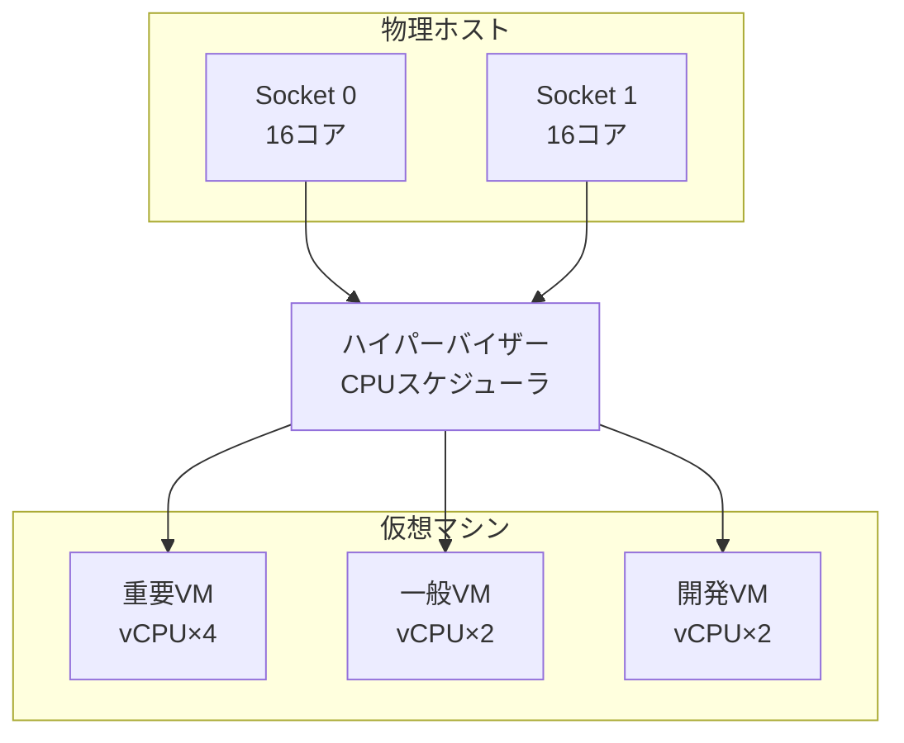
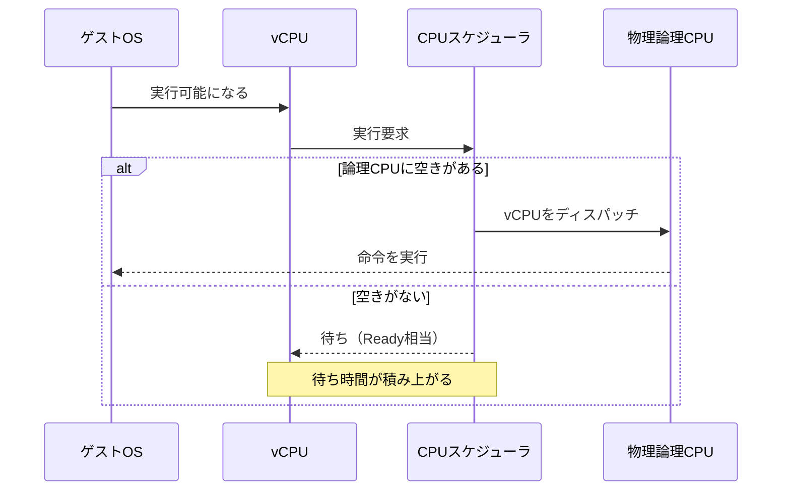

# 第3章 CPU仮想化

## 学習目標

1. vCPU と物理コア、スレッドの関係を説明できる
2. CPU スケジューリングとオーバーコミットの意味を説明できる
3. CPU Ready と Co-Stop の兆候を説明できる
4. NUMA / vNUMA、アフィニティ、予約、制限、共有を設計判断に使える
5. 過剰な vCPU 割り当てが性能を下げる理由を説明できる

---

## 3.1 CPU仮想化が必要になった背景

物理サーバー1台に業務システム1つを載せる構成では、CPUの話は比較的単純だった。
OSが物理コアを直接スケジューリングし、待ち時間の多くはプロセス同士の競合か、I/O待ちだった。

仮想化で複数のゲストOSが同居すると、事情が変わる。
各ゲストは「自分専用のCPUがある」前提でスケジューリングする。
その下でハイパーバイザーが、限られた物理CPU時間を複数の仮想マシンへ配分する。

ここで起きる問題は、次のようなものだ。

- 各VMに割り当てた vCPU の合計が、物理論理CPU数を超える
- ゲスト内のCPU使用率が低く見えるのに、業務が遅い
- あるVMのピークが、同居VMの応答時間を押し上げる
- ソケットをまたぐメモリアクセスが、予想外の遅延を生む

通貫シナリオでは、ホスト1台が 2ソケット × 16コア（論理32スレッド）を持つ。
その上に、重要システム、一般業務、開発検証のVMが同居する。
「コアが余っているから vCPU を多めに渡す」判断が、かえって待ち時間を増やすことがある。
その仕組みと設計判断が、以降の節の主題になる。

---

## 3.2 vCPU と物理CPU、コア、スレッド

### 用語の対応

まず、層を分けて用語を固定する。

- **物理CPU（ソケット）**：マザーボード上のCPUパッケージ。通貫シナリオではホストあたり2ソケット
- **物理コア**：ソケット内の実行コア。通貫シナリオではソケットあたり16コア、ホスト合計32コア
- **論理CPU / スレッド**：SMT（Intel Hyper-Threading など）有効時に見える実行単位。通貫シナリオではホストあたり論理32スレッド（2ソケット × 16コア、SMT前提の記載）
- **vCPU（virtual CPU）**：仮想マシンに見せる仮想プロセッサ。ゲストOSはこれを物理CPUとして扱う

カタログ上の「論理32スレッド」は理論上の並行実行の上限に近い指標である。
実測のスループットは、ワークロードの並列性、キャッシュ、メモリ帯域、SMTの効き方で変わる。
理論値と実測値を同じものとして扱わない。

```text
物理ホスト（例: 2ソケット × 16コア = 論理32スレッド）
+--------------------------------------------------+
| Socket 0          | Socket 1                     |
| Core0..Core15     | Core0..Core15                |
| (各コアにスレッド) | (各コアにスレッド)            |
+--------------------------------------------------+
          ^ ハイパーバイザーがスケジューリング
+--------------------------------------------------+
| VM-A: vCPU×4  | VM-B: vCPU×2  | VM-C: vCPU×4 ... |
+--------------------------------------------------+
```



### vCPU は専用コアではない

vCPU を4つ割り当てたからといって、物理コアが4つ専有されるわけではない。
デフォルトでは、ハイパーバイザーがその時点で空いている論理CPUへ、時間を分けて載せる。

ゲストから見ると、常に4つのCPUがあるように見える。
ホストから見ると、その4つのvCPUは「同時に実行したい4本の実行文脈」であり、物理側に空きがなければ待たされる。

---

## 3.3 CPUスケジューリングの動作原理

ハイパーバイザーの**CPUスケジューラ**は、どのVMのどのvCPUを、どの物理論理CPUで、いつ実行するかを決める。

基本動作は次の流れである。

1. ゲストが実行可能になると、対応する vCPU が実行待ちキューに入る
2. スケジューラが空き論理CPUを選び、vCPU を載せる（ディスパッチ）
3. タイムスライスや割り込み、I/O待ちなどで実行が切り替わる
4. 物理資源が足りなければ、実行可能なのにCPUを得られない時間が溜まる



ゲスト内のスケジューラと、ハイパーバイザーのスケジューラは別物である。
ゲストは「自分のvCPUが常に動いている」前提でスレッドを配置する。
実際には、そのvCPU自体がホスト側で待っていることがある。
ここが、ゲスト内CPU使用率だけでは遅さを説明しきれない理由である。

---

## 3.4 CPUオーバーコミット

**CPUオーバーコミット**とは、ホスト上の全VMに割り当てた vCPU の合計が、ホストの物理論理CPU数を超える状態を指す。

例（通貫シナリオの1ホスト）：

- 物理論理CPU：32
- そのホストに載っているVMの vCPU 合計：48
- このとき、割り当て比率は 48 / 32 = 1.5 倍

オーバーコミット自体は、仮想化の常套手段である。
ピークがずれるワークロードでは、割り当て合計が物理を超えても、実使用が同時にピークに達しなければ成立する。

問題になるのは、次の場合である。

- ピークが重なる時間帯がある
- 多数のvCPUを持つVMが多く、同時実行要求が常に高い
- 「余っているから多めに渡す」文化で、未使用vCPUが増える

割り当て比率（理論値）と、CPU Ready（実測の待ち）は別指標である。
設計会議では両方を見る。

---

## 3.5 CPU Ready

**CPU Ready**（製品によっては Ready Time、%RDY、steal time に近い概念で語られる）は、仮想マシンが実行可能なのに、物理CPUを割り当ててもらえず待っている時間の指標である。

ゲスト内のタスクマネージャや `top` でCPU使用率が低くても、CPU Ready が高ければ業務は遅くなる。
ゲストは「自分が使っていない」と錯覚し、ホストは「そのVMはCPUを欲しがっているが渡せない」と見ている。

```text
ゲスト視点:
  CPU使用率 20% → 「余裕がある」

ホスト視点:
  CPU Ready が高い → 「実行したいのに待たされている」
```

観測の注意点は次である。

- ネスト仮想化では絶対値が実環境と大きく異なる。相対比較と切り分け手順の練習に使う
- しきい値は製品、集計間隔、ワークロードで変わる。カタログの目安と、自環境のベースライン実測を分けて扱う
- 1つのVMだけでなく、ホスト全体と同居VMも同時に見る

通貫シナリオで新しい一般業務VMを追加した直後に既存VMが遅くなった場合、まずCPU Ready（または同等指標）を疑う。

---

## 3.6 Co-Stop

**Co-Stop**（製品によって表記や公開度が異なる）は、複数vCPUを持つVMにおいて、必要なvCPU群を同時に走らせられないことで生じる待ちに関係する概念である。

ゲストOSやアプリケーションが、複数のvCPU上の実行を同期的に進める必要がある局面がある。
そのとき、ハイパーバイザー側で一部のvCPUだけが走れて、残りが揃わないと、実質的な前進が止まる。

直感的なイメージは次である。

```text
vCPU×4 のVMが、ある瞬間に4本そろって進みたい

物理側の空きが2本しかない
  → 2本は実行、2本は待ち
  → 同期が必要な処理は、そろわない時間だけ停滞する
```

Co-Stop が問題になりやすい条件は、次である。

- vCPU数が多いVM
- ホストのCPU競合が強い
- オーバーコミットが大きい

CPU Ready が「1本のvCPUがCPUを待つ」側面を表すのに対し、Co-Stop は「複数vCPUの同時実行の難しさ」に焦点がある。
製品によってメトリクス名や見え方は違うが、「多vCPUほどスケジューリング制約が増える」という一般原理は共通する。

---

## 3.7 NUMA と vNUMA

### NUMA

**NUMA（Non-Uniform Memory Access）**は、メモリへのアクセス遅延が、どのCPUからどのメモリ領域へ行くかで一様でないアーキテクチャである。

2ソケット構成では、各ソケットに近いメモリ（ローカル）と、相手ソケット側のメモリ（リモート）がある。
ローカルアクセスのほうが速い。

```text
+------------------+          +------------------+
| Socket 0         |          | Socket 1         |
| Cores            |  相互接続 | Cores            |
| Local Memory     | <------> | Local Memory     |
+------------------+          +------------------+
```

通貫シナリオのホスト（2ソケット × 16コア、メモリ512 GB）は、典型的な NUMA 構成として扱う。
メモリがソケット間でどう分かれているかは機種依存だが、「遠いメモリは遅い」前提で設計する。

### vNUMA

**vNUMA**は、仮想マシンに対して NUMA トポロジを見せる仕組みである。
ゲストOSが、自分のvCPUとメモリの近接関係を意識してスケジューリングできるようにする。

小さなVM（例：vCPU 2、メモリ 8 GB）では、1つのNUMAノード内に収めるほうが単純で速いことが多い。
大きなVM（多数のvCPU、大きなメモリ）では、ゲストにも NUMA を見せたほうが、ゲスト側の最適化が効く場合がある。

製品固有の自動設定や、vNUMA を有効にする条件は実装差がある。
一般概念として押さえるのは次である。

- 可能ならVMを1つの物理NUMAノードに収める
- 収まらない大型VMは、トポロジをゲストへ適切に見せるかを検討する
- 「大きいほど速い」ではなく、「収まり方」を先に見る

---

## 3.8 CPUアフィニティ

**CPUアフィニティ**とは、特定のvCPUやVMを、特定の物理論理CPU（またはその集合）に結びつける設定である。

利点として期待されるのは、キャッシュ局所性の向上や、ノイジーネイバーの回避である。
代償として、スケジューラの自由度が下がる。
空きがあっても、縛られた範囲外のCPUを使えなくなる。


設計上の原則は、「標準では使わない」である。
例外は、厳密な分離検証、特定のライセンス拘束、低遅延要件の限定用途などである。
通貫シナリオの一般業務VMにアフィニティを量産適用すると、保守時の再配置や負荷分散が難しくなる。

製品によっては、アフィニティに似た配置ルール（ホストアフィニティ、NUMAノード親和など）がある。
物理CPUピンニングと、ホスト選択ルールは別概念として扱う。

---

## 3.9 CPU予約、制限、共有

資源配分の古典的な三要素がある。
製品名は違っても、考え方は近い。

| 一般概念 | 意味 |
|----------|------|
| **予約（Reservation）** | 最低限確保するCPU資源。他VMに奪われにくい |
| **制限（Limit）** | 上限。どれだけ空いていても、これ以上は使わせない |
| **共有 / シェア（Shares）** | 競合時の相対優先度。絶対量ではなく比率 |

```text
競合が弱いとき:
  シェアの差は見えにくい。制限だけが効くことが多い

競合が強いとき:
  予約を持つVMが優先的に守られる
  残りをシェア比率で分ける
```

通貫シナリオでの使い方の例は次である。

- 重要システム8台：必要なら予約を検討する。ただし予約の合計は、ホスト障害時の収容計算（Admission Control 相当）と衝突しやすい
- 一般業務：デフォルトシェアでよいことが多い
- 開発と検証：必要なら制限をかけ、本番を食いすぎないようにする

予約を安易に増やさない。
予約は「守る」代わりに、クラスタ全体の収容可能数を減らすことがある。
詳細な収容計算は第8章、第13章へ続く。

---

## 3.10 製品での実装例と用語対応

一般概念と製品用語を対応づける。
操作手順ではなく、呼び名の地図として使う。

| 一般概念 | VMware（例） | Hyper-V（例） | KVM / libvirt（例） |
|----------|--------------|---------------|---------------------|
| vCPU | 仮想CPU数 | 論理プロセッサ数 | vCPU（`vcpu`） |
| CPU Ready 相当 | Ready / %RDY | CPU Wait Time 等の監視観点 | steal（ゲスト側）、ホストのrunキュー |
| 予約 | CPU Reservation | CPU Reserve | cgroups / quota や予約的制御（構成による） |
| 制限 | CPU Limit | CPU Limit | `cputune`、quota/period |
| 共有 | CPU Shares | Relative Weight | `cpu.shares` 相当 |
| アフィニティ | CPU Affinity | Processor Affinity | `cpuset`、vcpupin |
| NUMA / vNUMA | NUMA / vNUMA 関連設定 | NUMA spanning 等 | numatune、ゲストNUMA |

VMware の %RDY、Linux ゲストの `steal`、Hyper-V のカウンタは、定義と単位が完全一致しない。
「同じ名前の万能指標」ではなく、「実行したいのにCPUを得られない時間」を見る族として扱う。

---

## 3.11 CPUサイジング

サイジングの出発点は、「ピークに必要な実行力」と「同時に載せるVM数」と「ホスト障害時の逃げしろ」である。

通貫シナリオの仮置きを再掲する。

| 区分 | 台数 | vCPU（仮） |
|------|------|------------|
| 重要システム | 8 | 4 |
| 一般業務 | 16 | 2 |
| 開発と検証 | 6 | 2 |

割り当てvCPUの合計は、`8×4 + 16×2 + 6×2 = 32 + 32 + 12 = 76` である。
ホスト3台、各論理32スレッドなら、クラスタ全体の論理CPUは96である。
単純な割り当て比は 76 / 96 ≈ 0.79 で、一見余裕がある。

しかし、これは理論上の割り当て比較にすぎない。

実際の設計では、少なくとも次を見る。

1. 1ホスト障害時に、残2ホスト（論理64）へ重要VMと必要VMが載るか
2. ピーク時の実測CPU使用と、CPU Ready
3. 成長後（約1.5倍）の再見積もり
4. ハイパーバイザーと管理コンポーネント自身の消費

「割り当て合計が物理以下なら安全」ではない。
逆に、「割り当て合計が物理を超えても、実測Readyが低ければ成立し得る」。
判断材料は実測である。

第13章で計算式と余裕率を確定する。
ここでは、vCPU数を決めるときに次の順序を守る、と決める。

1. 実測または負荷試験で必要な並行度を把握する
2. 必要最小のvCPUから始める
3. 監視で足りなければ増やす
4. 「将来用に多め」は原則しない

---

## 3.12 過剰なvCPU割り当てが性能を低下させる理由

直感に反するが、vCPUを増やしすぎると遅くなることがある。

理由は複数ある。

### 理由1：同時実行要求が増える

vCPUが4本あるVMは、忙しいときに最大4本分の物理実行資源を同時に欲しがる。
空きが足りないと、Ready や Co-Stop 相当の待ちが増える。

### 理由2：スケジューリング制約が増える

多vCPUのVMは、「そろえて走らせる」必要が出やすい。
物理側の断片的な空きでは進めず、待ちが長くなる。

### 理由3：ゲスト側のオーバーヘッド

ゲストOSは、管理するプロセッサ数に応じてスケジューラ、割り込み、同期のコストを払う。
仕事量が同じなら、vCPU過多は純粋な得にはならない。

### 理由4：NUMAをまたぎやすい

大きなVMは複数ソケットにまたがり、リモートメモリアクセスが増える。

### 理由5：ノイジーネイバーになる

自分は少ししか使わなくても、ピーク時に大きく食い、同居VMのReadyを押し上げる。

```text
悪い例:
  「DBだからとりあえず vCPU 16」
  → 実ピークは 3 コア相当
  → 競合時に 16 本分の同時実行要求が散発
  → 自分も同居も遅くなる

良い例:
  実測で 3〜4 コア相当
  → vCPU 4 から開始
  → Ready とアプリ応答を監視して調整
```

通貫シナリオの重要システムを「念のため vCPU 8」へ上げる前に、実測ピークとReadyを確認する。
念のための増設が、障害時の再配置余地を削ることもある。

---

## 3.13 設計上の判断ポイント

| 判断 | 採用案 | 不採用案 | 理由とトレードオフ |
|------|--------|----------|--------------------|
| vCPU初期値 | 必要最小から開始 | 将来余裕で多めに配布 | 待ち時間と再配置余地を守る。不足は監視で増やす |
| オーバーコミット | ピークずれを前提に許容し、Readyで制御 | 割り当て合計を常に物理以下に固定 | 固定は安全に見えるが統合効率が落ちる。実測制御のほうが実務的 |
| アフィニティ | 原則使わない | 全VMを固定ピンニング | 可搬性と保守性を優先。例外のみ |
| 予約 | 重要VMに限定して最小限 | 全VMに厚い予約 | 収容計算と衝突しやすい |
| 開発VM | 制限または低優先 | 本番と同等の無制限競合 | 本番応答を守る |
| 大型VM | NUMA収まりを先に設計 | ソケット無視で巨大化 | リモートメモリ遅延を避ける |

単一障害点との関係も見る。
CPUそのものより、「特定ホストにCPUヘビーなVMが偏在する」配置が実質的な弱点になる。
負荷分散方針は第8章で扱う。

---

## 3.14 性能上の注意点

- ゲスト内CPU使用率だけで遅さを判断しない。Ready / steal 相当を見る
- SMTの論理スレッドを「物理コア2倍の実力」とみなさない
- ネスト環境のReady絶対値を本番しきい値に使わない
- バックアップ、ウイルススキャン、パッチ配布がピークと重なると、CPU競合が一気に見える
- 理論上の割り当て比が低くても、少数の巨大VMが同時に走ればReadyは上がる
- ホットアドでvCPUを増やす前に、ゲストOSの対応とライセンス条件を確認する（第7章）

---

## 3.15 セキュリティ上の注意点

- サイドチャネル（キャッシュやSMTを介した情報漏洩の議論）は、多テナントで重要度が上がる。社内基盤でも、機密度の高いVMの同居方針を決める
- CPUアフィニティや専用コア分離は、性能目的だけでなく、テナント分離の一手段として使われることがある。採用するなら運用コストを見積もる
- 管理権限を持つユーザーが、任意VMの予約や制限を変更できると、他VMへのDoS的影響を起こせる。権限設計が必要（第10章）
- パフォーマンスカウンタの採取範囲と、管理ネットワークの露出を見直す

---

## 3.16 障害例と切り分け

### 障害例1：ゲストCPUは低いのに業務が遅い

**症状**：アプリ応答が悪い。ゲストのCPU使用率は10〜20%。

**切り分け**：

1. ホストまたはVMの CPU Ready / steal 相当を確認する
2. 同時刻の同居VMのCPUピークを確認する
3. ストレージ遅延とメモリ逼迫も除外する（偽のCPU症状を避ける）

**典型原因**：CPUオーバーコミット下での競合。ゲスト指標だけ見ていた。

### 障害例2：vCPUを増やしたらさらに遅くなった

**症状**：DB VM の vCPU を4から8にした直後、ピーク時の応答が悪化。

**切り分け**：

1. Ready と Co-Stop 相当の変化を比較する
2. NUMAノードをまたいだ配置になっていないか確認する
3. 実スレッド並列度が8を必要としているか、アプリ側で確認する

**典型原因**：過剰vCPUによるスケジューリング制約の増加。

### 障害例3：特定ホストだけ遅い

**症状**：同じ役割のVMでも、Host-2 上だけ遅い。

**切り分け**：

1. そのホストの vCPU 合計と実使用を他ホストと比較する
2. アフィニティや配置ルールで偏っていないか確認する
3. BIOSの電源管理、ターボ、Cステート差がないか確認する

**典型原因**：配置偏り、ホスト固有の電力設定、一部コアの障害隔離。

### 障害例4：重要VMがピーク時にだけ遅延する

**症状**：日次バッチ開始時刻に認証や業務APが遅延する。

**切り分け**：

1. その時間帯のホストCPU Readyを時系列で見る
2. 開発VMやバックアップの同時走行を確認する
3. 共有と制限の設定差を確認する

**典型原因**：優先度設計なしの同居。制限や時間帯分離で緩和できることが多い。

---

## 章末問題

### 問題1

vCPU を4つ持つVMは、常に物理コアを4つ専有するか。理由とともに答えよ。

### 問題2

ゲスト内CPU使用率が低いのに業務が遅いとき、CPU観点で最初に疑う指標は何か。その指標が示す状態を一言で述べよ。

### 問題3

通貫シナリオで、全VMの割り当てvCPU合計が76、クラスタ論理CPUが96だとする。
このとき「CPUに余裕がある」と言い切れるか。言えない理由を述べよ。

### 問題4

CPU予約を重要VMすべてに厚く設定する案の利点と、不採用にし得る理由を述べよ。

### 問題5

過剰なvCPU割り当てが性能を下げる理由を、スケジューリングの観点から説明せよ。

---

## 解答と解説

### 問題1

専有しない（デフォルト設定の一般論）。
vCPUは実行文脈であり、ハイパーバイザーが空いている論理CPUへ時間分割で載せる。
予約やアフィニティで拘束しない限り、専用コア固定にはならない。

### 問題2

CPU Ready（または steal など同等指標）。
実行可能なのに物理CPUを得られず待っている状態を示す。

### 問題3

言い切れない。
割り当て比は理論値であり、ピークの重なり、巨大VMの同時実行、1ホスト障害時の再配置、実測Readyを見ないと余裕は判定できない。

### 問題4

利点は、競合時に重要VMの最低CPUを守りやすいこと。
不採用にし得る理由は、予約合計がクラスタの収容能力を下げ、HA時の起動可否や配置柔軟性を損なうことである。

### 問題5

多vCPUは同時に必要となる物理実行資源と、そろえて走らせる制約を増やす。
物理側に断片的な空きしかないとき、Ready や Co-Stop 相当の待ちが増え、仕事量が増えていなくても遅延する。

---

## ハンズオン演習

### 演習1：資源対応表を作る

学習環境について、次を埋めよ。

| 項目 | 値 | 備考 |
|------|----|------|
| ソケット数 | | |
| コア数 | | |
| 論理CPU数 | | SMTの有無 |
| 作成したVMのvCPU | | |
| 割り当て合計 / 論理CPU | | 理論比 |

### 演習2：競合を観察する

可能なら次を行う。

1. 小さなVMを複数作り、それぞれでCPU負荷ツールを同時に走らせる
2. ゲスト内CPU使用率と、ホスト側の待ち指標（Ready / steal など）を記録する
3. 片方のVMのvCPUを増やして、再度同じ負荷をかけ、応答や待ちの変化を書く

ネスト環境では絶対値評価をせず、「待ちが増えたかどうか」を観察する。

### 演習3：通貫シナリオのCPU判断メモ

次を設計判断メモとして書け。

1. 重要VMのvCPUを4から8へ増やす案の採用可否
2. 不採用または保留にする条件
3. 監視すべき指標
4. ホスト1台障害時に効くリスク

### 成果物

- 資源対応表
- 競合観察メモ（指標の前後比較）
- CPU設計判断メモ

---

## 本章のまとめ

vCPUは専用コアではなく、ハイパーバイザーが物理CPU時間へ載せる実行単位である。
オーバーコミットはピークのずれを前提に成立し、成否は割り当て比より Ready のような実測待ちで見る。
多vCPUは並列性能を上げる一方、スケジューリング制約とNUMAまたぎを増やし、過剰だと遅くなる。
予約、制限、共有、アフィニティは競合時の配分手段であり、標準設定を増やすほど配置の自由度と収容計算が削られる。
通貫シナリオでは、必要最小のvCPUから始め、実測で調整する方針を起点にする。
