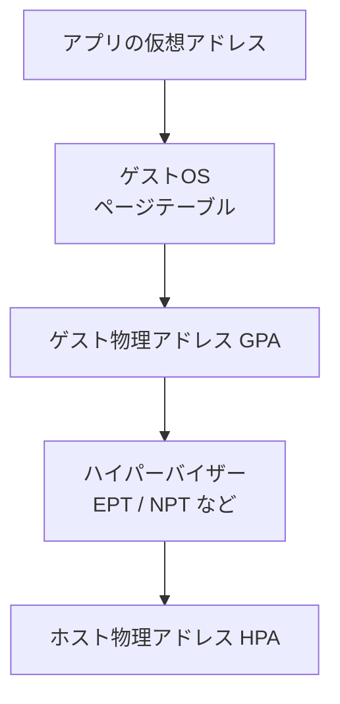
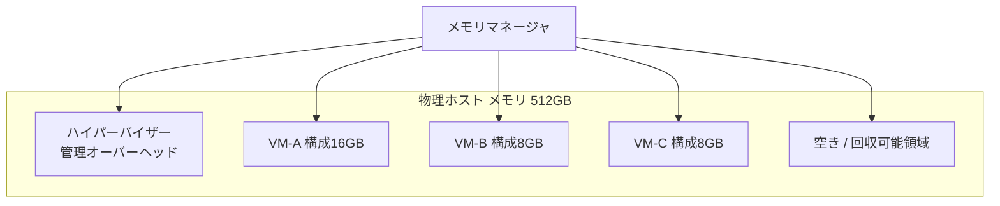
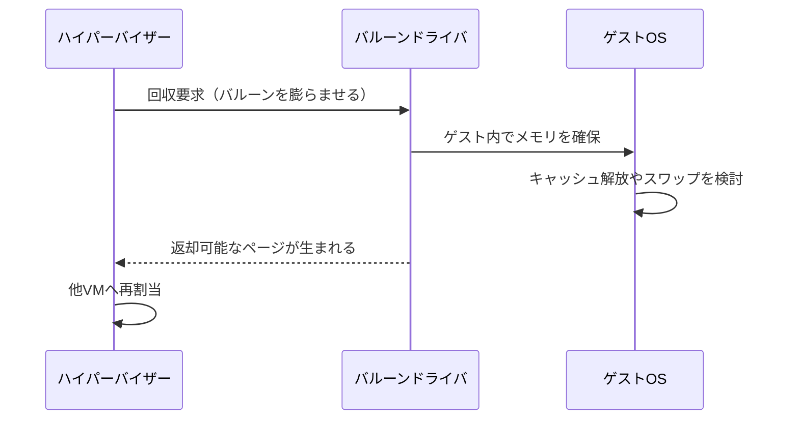
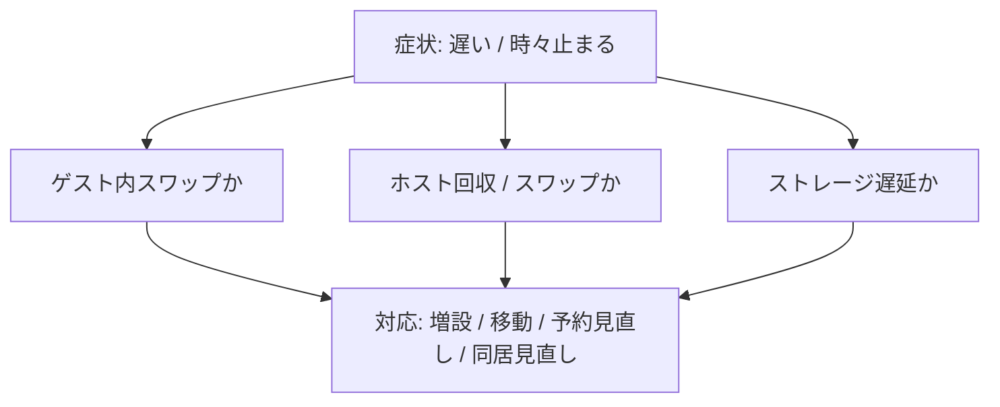

# 第4章 メモリ仮想化

## 学習目標

1. ゲストメモリとハイパーバイザーのメモリ管理の二層構造を説明できる
2. オーバーコミット、バルーニング、共有、圧縮、スワップの発動順の考え方を説明できる
3. メモリ予約と NUMA の関係を設計に反映できる
4. メモリ不足時の性能劣化の症状を列挙できる
5. 実務シナリオ向けのメモリサイジングの出発点を計算できる

---

## 4.1 メモリ仮想化が必要になった背景

物理1システム1サーバーの時代、メモリ不足の主戦場はゲストOSの中だった。
アプリケーションが物理RAMを使い切り、OSがスワップし、ディスク待ちで遅くなる。
診断は比較的一直線だった。

仮想化で複数ゲストが同居すると、メモリ問題は二層になる。

1. ゲストOSが、自分に見えているメモリをどう使うか
2. ハイパーバイザーが、限られたホスト物理メモリを複数VMへどう割り当てるか

さらに、設計者は「割り当てたメモリ」と「実際に触っているメモリ」を混同しやすい。
通貫シナリオではホスト1台あたり512 GBを前提に、VM30台規模を支える。
重要VMは16 GB、一般業務は8 GB、開発は4 GBという仮置きがある。
ここで「割り当て合計が物理以下なら安全」と思い込むと、次の章でつまずく。

メモリ仮想化の目的は、単なる分割ではない。
ゲストに連続したメモリ空間を見せつつ、ホスト上では効率よく多重利用することである。
その過程で、オーバーコミットや回収技術が登場する。

---

## 4.2 仮想メモリとアドレスの層

まず、アドレスの層を区別する。

- **仮想アドレス（ゲストプロセス視点）**：アプリケーションが使うアドレス。ゲストOSのページテーブルで変換される
- **ゲスト物理アドレス（GPA）**：ゲストOSが「物理メモリ」だと思っているアドレス
- **ホスト物理アドレス（HPA / マシン物理アドレス）**：実ホスト上の本当のメモリ位置

古典的な物理サーバーでは、OSが見る物理アドレスがそのまま機械の物理アドレスだった。
仮想化では、その間にもう一段の対応が入る。

```text
アプリの仮想アドレス
        |
        v  ゲストOSのページテーブル
ゲスト物理アドレス（GPA）
        |
        v  ハイパーバイザーの対応づけ（EPT/NPT など）
ホスト物理アドレス（HPA）
```



現代のCPUは、この二段変換をハードウェア支援する。
Intel EPT、AMD RVI/NPT などである（第2章）。
支援がある前提でも、ページフォルトや回収処理のコストは残る。
「ハードウェア支援があるからメモリ逼迫は無害」にはならない。

---

## 4.3 ゲストOSのメモリ

ゲストOSは、割り当てられたメモリを自分の物理RAMだと思っている。
そのため、通常のOSと同じことをする。

- プロセスへ仮想メモリを割り当てる
- ファイルキャッシュに空きメモリを使う
- 逼迫するとゲスト内スワップ（ページファイル）を使う

ここで重要な錯覚がある。
ゲストが「メモリ使用率 90%」と報告しても、その中身の多くが再利用可能なファイルキャッシュであることがある。
逆に、ゲストが「空きが多い」ように見えても、ホスト側がすでに回収動作に入っていることがある。

ゲストツールやバルーンドライバが入っていると、ハイパーバイザーからの回収要求にゲストが協力できる。
未導入だと、回収手段が粗くなり、性能劣化が早く見える。

通貫シナリオでは、テンプレート段階でゲストツールを必須化する方針（第2章）が、メモリ管理の品質にも効く。

---

## 4.4 ハイパーバイザーのメモリ管理

ハイパーバイザーは、各VMに「見えるメモリ量」（構成メモリ）を約束しつつ、実ホスト上では必要に応じて実ページを裏づけする。

管理の要点は次である。

1. **構成メモリ**：VM設定上のメモリサイズ（例：16 GB）
2. **アクティブメモリ / 使用中ページ**：実際に触られている量（実測）
3. **ホスト空きメモリ**：回収技術を使わずに残っている余裕
4. **回収状態**：バルーン、共有、圧縮、スワップなどが動いているか



構成メモリの合計がホスト容量を超えても、全VMが同時に満額を触らなければ一時的には成立する。
これがメモリオーバーコミットの出発点である。

ただし、成立条件はCPUより厳しいことが多い。
メモリ不足の救済は、最終的にディスクへ逃げる経路を含み、遅延が一桁以上悪化し得る。

---

## 4.5 メモリオーバーコミット

**メモリオーバーコミット**とは、ホスト上のVMに構成したメモリ合計が、ホストの物理メモリ（管理オーバーヘッド控除後）を超える状態を指す。

例（単純化）：

- ホスト物理メモリ：512 GB
- 管理オーバーヘッドと系統サービス：仮に 32 GB
- VMへ使える目安：480 GB
- そのホスト上の構成メモリ合計：600 GB
- このとき、割り当て比は 600 / 480 = 1.25 倍

オーバーコミットは「常に悪」ではない。
開発VMのように常時フル使用しないワークロードでは、意図的に使うことがある。

本番の重要システムでは、方針を明示する。
通貫シナリオでは、次のような段階が実務的である。

1. 重要VMは、ピーク実測を賄う構成メモリを確保し、過剰なオーバーコミットを避ける
2. 一般業務は、実測アクティブメモリを見て、控えめなオーバーコミットを許容し得る
3. 開発と検証は、停止許容を前提に、より積極的な多重化を検討し得る

理論上の割り当て比と、バルーンやスワップの実測発生は別物である。
比が1.0未満でも、偏在や急なワーキングセット増加で逼迫は起きる。

---

## 4.6 ホストがメモリを賄う主な技術

ホストメモリが足りなくなると、ハイパーバイザーはいくつかの手段でしのぐ。
製品によって名称、実装、既定の優先順位は異なる。
ここでは製品非依存の共通概念として整理する。

### メモリ共有（ページ共有）

同一内容のメモリページを、ホスト上で1つにまとめて参照する考え方である。
同じOSテンプレートから作ったVMが多いと、ゼロページや共通ページの共有が効くことがある。

効果はワークロード依存が大きい。
大きな固有データを持つDBでは、期待ほど効かないことが多い。
セキュリティ上の懸念（共有面）や、スキャンコストもある。
理論上の最大共有率を、サイジングの前提に据えない。

### バルーニング

**バルーニング**は、ゲスト内のバルーンドライバがメモリを「占有」し、その分をホストへ返す協力型の回収である。

流れのイメージは次である。

1. ホストが逼迫を検知する
2. 対象VMのバルーンを膨らませるよう要求する
3. ゲストOSは、バルーンに取られたメモリを自分の使用量増として扱う
4. ゲストはキャッシュ整理や、必要ならゲスト内スワップで対応する
5. ホストはその裏の物理ページを他VMへ回せる



バルーニングの利点は、ゲストOSの判断を活かせることである。
欠点は、ゲストツールが必要なことと、ゲスト内スワップを誘発し得ることである。

### 圧縮

回収した、または回収対象のページを、ホストメモリ上で圧縮して保持する方式である。
ディスクへ出すよりは速いことが多いが、CPUコストが乗る。
「圧縮があるから逼迫してよい」ではなく、一時しのぎの層として理解する。

### スワップ（ハイパーバイザーレベル）

最終手段に近いのが、VMのメモリページをディスクへ退避することである。
製品によってスワップファイルの置き場や名前は異なる。

ディスク待ちが入るため、性能劣化が明確になる。
ゲスト内スワップとホストスワップは別物である。
両方同時に起きると、原因追跡が難しくなる。

```text
ゲスト内スワップ:
  ゲストOSが、自分のページファイル / スワップ領域へ退避

ホストスワップ:
  ハイパーバイザーが、VMのページをデータストア等へ退避
```

---

## 4.7 発動順の考え方

正確な順序は製品と版、設定で変わる。
学習用の一般モデルとしては、次の階段で捉えるとよい。

```text
1. 透明な効率化（共有など、効く場合）
2. ゲスト協力の回収（バルーニング）
3. ホスト内の高速しのぎ（圧縮など）
4. ディスク退避（スワップ）
```

設計で使うときの要点は、順序の暗記そのものではない。
「どの段まで日常的に許容するか」を決めることである。

通貫シナリオの推奨スタンス例：

- 共有：効果は観察対象。サイジングの前提にしない
- バルーン：短時間のピーク吸収はあり得るが、常時膨張は再設計信号
- 圧縮：過渡状態の指標として監視
- ホストスワップ：本番重要VMでは原則ゼロを目標にする

---

## 4.8 メモリ予約

**メモリ予約**は、そのVMのためにホスト上で最低限確保するメモリ量である。
予約分は、他VMの回収競争で奪われにくい。

利点は、重要VMのワーキングセットを守りやすいことである。
代償は、クラスタの収容能力が下がることである。
予約の合計が大きいと、HA時に「起動できない」「再配置できない」が起きやすくなる。

```text
予約なし:
  構成16GBでも、実際の裏づけは需要に応じて変動し得る

予約16GB:
  少なくとも16GB分のホストメモリを確保対象にする
  （実装差はあるが、思想はこの方向）
```

通貫シナリオでは、重要システム8台に満額予約を機械的に付ける前に、次を計算する。

1. ホスト1台障害時、残ホストのメモリで予約合計を支えられるか
2. 一般業務と開発のバースト余地が残るか
3. 管理オーバーヘッドを控除したか

CPU予約と同じく、「守るほど、詰め込み余地が減る」。
詳細なAdmission Control相当の話は第8章、第13章へ続く。

---

## 4.9 NUMAとの関係

第3章のNUMAは、CPUとメモリの近接性の話でもある。
メモリ仮想化では、次が重要になる。

- VMのメモリが、vCPUと同じNUMAノード近傍にあるか
- 大型VMが複数ノードにまたがるとき、ゲストにトポロジを見せるか
- バルーンや再配置で、局所性が崩れていないか

```text
良い配置のイメージ:
  Socket 0 のコアで走る vCPU
  + 同じ側のローカルメモリ

悪い配置のイメージ:
  Socket 0 のコアで走る
  + 実体ページが Socket 1 側
  = リモートアクセス増
```

通貫シナリオのホスト（2ソケット、512 GB）では、一般業務VM（8 GB）や開発VM（4 GB）は、1ノード内に収まりやすい。
重要VM（16 GB）も多くの場合収まるが、将来の増設で32 GB、64 GBへ伸ばすなら、ノード容量とvNUMAを再評価する。

メモリ予約や巨大な構成メモリは、「載るかどうか」だけでなく、「どこに載るか」を決める。
サイジング表にNUMA列を足すと、後工程が楽になる。

---

## 4.10 製品での実装例と用語対応

| 一般概念 | VMware（例） | Hyper-V（例） | KVM / libvirt（例） |
|----------|--------------|---------------|---------------------|
| 構成メモリ | Configured Memory | Startup / Maximum RAM | `memory` / `currentMemory` |
| バルーニング | Memory Balloon（VMware Tools連携） | Dynamic Memory の考え方（完全同一ではない） | virtio-balloon |
| メモリ共有 | TPS（Transparent Page Sharing）など | 実装と既定は世代で異なる | KSM（Kernel Samepage Merging） |
| 圧縮 | Memory Compression | 製品機能差あり | 環境と拡張に依存 |
| ホストスワップ | Swap to disk | Runtime memoryの逼迫時挙動を監視 | host swap / ディスク退避の運用面 |
| 予約 | Memory Reservation | Memory Reserve | ロックや cgroups、Huge Pages 運用など |
| ゲスト連携 | VMware Tools | Integration Services | qemu-guest-agent、balloonドライバ |

Dynamic Memory（Hyper-V）やメモリホットプラグは、「固定構成メモリ」とは別の運用モデルである。
一般概念のバルーニングと、製品の動的メモリ機能を同一視しすぎない。
共通して見るべきは、「ゲストに見えている量」「ホストが実際に与えている量」「回収や動的変更が起きているか」の三点である。

---

## 4.11 メモリ不足時の性能劣化

メモリ逼迫の症状は、CPU不足と似て「遅い」だが、観測点は異なる。

典型症状：

- アプリ応答が不定期に落ちる（ディスク退避の瞬間）
- ゲスト内でスワップ発生、ページアウト増加
- ホスト側でバルーン常時膨張、圧縮発生、スワップ発生
- 同じ処理でも、ある時間帯だけレイテンシが跳ねる
- ライブマイグレーションやHA再配置が、メモリ不足で失敗する

切り分けの型：

1. ゲスト内メモリとスワップを見る
2. ホストの空き、バルーン、圧縮、スワップを見る
3. データストア遅延を見る（ホストスワップの置き場が遅いと二重苦）
4. 特定VMのワーキングセット急増か、ホスト全体の詰め込み過多かを分ける



CPU Ready が高く、同時にホストスワップもある場合は、どちらか一方だけを直しても体感が戻らないことがある。
層を分けて記録する。

---

## 4.12 メモリサイジング

通貫シナリオの仮置きを使う。

| 区分 | 台数 | メモリ（仮） | 合計 |
|------|------|--------------|------|
| 重要システム | 8 | 16 GB | 128 GB |
| 一般業務 | 16 | 8 GB | 128 GB |
| 開発と検証 | 6 | 4 GB | 24 GB |
| VM合計 | 30 | | 280 GB |

ホスト3台、各512 GBなら、単純合計だけ見ると余裕に見える。
しかし設計の出発点としては、少なくとも次を控除する。

1. ハイパーバイザーと系統サービスのオーバーヘッド
2. ホスト1台障害時の再配置余地（N+1）
3. 成長（約1.5倍）後の増加分
4. バックアップや管理VMのメモリ
5. ピーク時のワーキングセット（構成値ではなく実測）

粗い思考実験（概念計算）：

- VM構成合計：280 GB
- 成長後1.5倍：420 GB
- 管理とオーバーヘッドの仮置き：ホストあたり数十GB規模を見込む
- 1ホスト障害時、残2台へ寄せる必要がある

この段階で「512 GB × 3 あれば十分」と確定しない。
確定は第13章で、計算式と余裕率を明示して行う。
本章で固定するのは方針である。

サイジング方針の例：

1. 重要VMは、実測ピークのワーキングセット + 余裕で構成する
2. ホストスワップ常態化を前提にしない
3. 開発VMの多重化で稼いだ余裕を、本番の必須容量に流用しない
4. 平均値ではなく、時間帯別のピークと95パーセンタイルを見る

```text
悪いサイジング:
  構成メモリ合計 <= 物理メモリ合計 ならOK

良いサイジングの起点:
  実測アクティブ + HA予備 + 成長 + 管理OH
  を満たし、逼迫時の救済が常態化しないこと
```

---

## 4.13 設計上の判断ポイント

| 判断 | 採用案 | 不採用案 | 理由とトレードオフ |
|------|--------|----------|--------------------|
| 本番のオーバーコミット | 重要VMは控えめ。実測で管理 | 全VMを大きくオーバーコミット | スワップ常態化を避ける。統合効率は開発側で稼ぐ |
| メモリ予約 | 重要VMに必要最小 | 全VM満額予約 | HA収容と両立させる |
| バルーン常時発生 | 再設計トリガ | 正常運用として放置 | 協力回収は過渡なら有用。常時は容量不足のサイン |
| ページ共有を前提にした減設 | しない | 共有率を容量計算に組み込む | 効果は不確実。セキュリティと版差もある |
| Dynamic Memory / 動的拡張 | 用途を分けて採用判断 | 全本番に無検証で適用 | 運用モデルが変わる。監視とアプリ適合が必要 |
| NUMA | 小型VMはノード内収まりを優先 | 巨大化を先に進める | リモートアクセス遅延を避ける |

不採用案が常に間違いなのではない。
検証環境やVDIなど、オーバーコミット前提の領域もある。
通貫シナリオの「重要8台を守る業務基盤」としては、上記の採用側が無難な起点になる。

---

## 4.14 性能上の注意点

- 構成メモリとアクティブメモリを混同しない
- ゲストの「空き少」だけで増設せず、キャッシュとワーキングセットを見分ける
- ホストスワップ発生時は、スワップ置き場のディスク遅延も同時に見る
- ネスト環境のメモリ挙動は実環境より悪化しやすい。絶対値評価に使わない
- メモリ不足は、CPU不足より体感悪化が急であることが多い
- スナップショットやバックアップが、一時的にメモリとI/Oを同時に押すことがある

---

## 4.15 セキュリティ上の注意点

- ページ共有は、理論上サイドチャネル議論の対象になり得る。機密度の高い同居方針と製品既定を確認する
- バルーンやゲストエージェントは、ホストとゲストの連携面である。版管理と不要機能の無効化が必要
- メモリダンプ、スワップファイル、ハイバネーション相当の退避領域には、機密が残る。保管先の権限と消去手順を決める
- 管理者が他VMのメモリ設定を自由に下げられる権限モデルは、実質的なサービス妨害手段になり得る
- 暗号化（機密VMのメモリ保護機能など）は製品固有機能として、一般のメモリ管理とは分けて評価する

---

## 4.16 障害例と切り分け

### 障害例1：特定時間帯だけ全VMが遅い

**症状**：毎朝のバッチ開始後、複数VMの応答が落ちる。CPU Readyは中程度。

**切り分け**：

1. ホストのバルーン、圧縮、スワップカウンタを時系列で見る
2. その時間帯に起動するVMやバックアップの有無を確認する
3. データストア遅延を確認する

**典型原因**：ピーク重なりによるメモリ逼迫と、スワップ置き場へのI/O競合。

### 障害例2：ゲストは空きがあるのにホストが逼迫と出る

**症状**：ゲスト内では空きメモリが多い。ホスト警報だけが上がる。

**切り分け**：

1. 構成合計とホスト実容量を比較する
2. 他VMのワーキングセットを確認する
3. バルーンが自VMに来ていないか確認する

**典型原因**：自分は空いていても、同居VMが実ページを食い、ホスト全体が不足している。

### 障害例3：重要VMだけが断続的に遅延する

**症状**：重要DBが数分おきに遅延。ゲスト内スワップも見える。

**切り分け**：

1. そのVMのバルーンサイズ推移を見る
2. メモリ予約の有無を確認する
3. 同一ホスト上の開発VM負荷を確認する

**典型原因**：予約なしの重要VMが、回収対象になっている。配置分離か予約の検討対象。

### 障害例4：HAや移行がメモリ理由で失敗する

**症状**：ホスト保守のための移行が失敗する。空きCPUはある。

**切り分け**：

1. 移行先ホストの実空きメモリを見る（構成空きではなく）
2. 予約合計とAdmission相当の制約を確認する
3. 巨大VMのNUMA/収まり制約がないか確認する

**典型原因**：表面上の空きと、予約込みの実質空きの不一致。

---

## 章末問題

### 問題1

ゲスト物理アドレス（GPA）とホスト物理アドレス（HPA）の違いを説明せよ。

### 問題2

メモリオーバーコミットが成立し得る条件と、本番重要VMで危険になりやすい理由を述べよ。

### 問題3

バルーニングとホストスワップの違いを、誰がページを手放すかの観点から説明せよ。

### 問題4

通貫シナリオでVMメモリ合計が280 GB、ホストが512 GB × 3台でも、即座に「十分」と言えない理由を3つ挙げよ。

### 問題5

メモリ予約を重要VMに付ける利点と、付けすぎたときの副作用を述べよ。

---

## 解答と解説

### 問題1

GPAはゲストOSが物理メモリだと思っているアドレスである。
HPAは実ホスト上の機械の物理アドレスである。
ハイパーバイザー（とハードウェア支援）が両者を対応づける。

### 問題2

成立し得る条件は、全VMが同時に構成メモリ上限まで触らないこと、すなわちワーキングセットのピークがずれることである。
危険な理由は、ピークが重なると回収やスワップが走り、遅延が急増し、重要業務のSLAを破りやすいからである。

### 問題3

バルーニングはゲスト内ドライバがゲストOSの管理下でメモリを占有し、ホストへ返す協力型回収である。
ホストスワップは、ハイパーバイザーがVMのページをディスクへ退避する側の動作である。
後者はゲストの協力なしにも起こり得て、性能悪化が大きい。

### 問題4

例：管理オーバーヘッド、ホスト1台障害時の再配置余地、成長後の増加、実測ワーキングセットと構成値の差、バックアップや管理VMの未計上。
いずれか3つ以上を挙げられればよい。

### 問題5

利点は、競合時に重要VMのメモリを守りやすいこと。
副作用は、クラスタ収容能力の低下、HAや移行の失敗、他VMの多重化余地の減少である。

---

## ハンズオン演習

### 演習1：二層の観測点を書く

学習環境のVMについて、次を記録せよ。

| 観点 | どこで見るか | 実際の値 / 観察 |
|------|--------------|-----------------|
| 構成メモリ | | |
| ゲスト内使用率 | | |
| ホスト側の割当 / アクティブ | | |
| バルーンの有無 | | |
| スワップの有無 | | |

取れない項目は「未取得」と書き、代わりにどの画面やコマンドが候補かを書く。

### 演習2：逼迫の模擬と切り分け

可能なら次を行う。

1. 複数VMでメモリを消費する処理を同時に走らせる
2. ゲスト内スワップとホスト側回収の兆候を観察する
3. 症状、層（ゲスト / ホスト / ストレージ）、確認結果を切り分けメモに残す

ネスト環境では、発生しやすさや絶対値は参考にとどめる。

### 演習3：通貫シナリオのメモリ計算メモ

次を計算し、前提を明示して書け。

1. VM構成メモリ合計（仮置き）
2. 成長1.5倍後の合計
3. ホスト1台停止を想定したとき、残ホストで支えるために必要な観点
4. 重要8台に満額予約した場合の利点と懸念

数値は出発点であり、確定値にしない。

### 成果物

- 二層観測表
- 切り分けメモ
- メモリ計算と設計判断メモ

---

## 本章のまとめ

メモリ仮想化は、ゲストに物理メモリを見せつつ、ホスト上で実ページを多重利用する二層の仕組みである。
オーバーコミットはピークのずれを前提に成立するが、不足時の救済はバルーン、圧縮、スワップへと進み、ディスクが絡むと性能が急落する。
予約は重要VMを守る一方で収容能力を削る。
NUMAはCPUだけでなくメモリ局所性の制約でもある。
通貫シナリオでは、構成合計の楽観視を避け、実測ワーキングセット、HA予備、成長、管理オーバーヘッドをサイジングの起点に置く。
