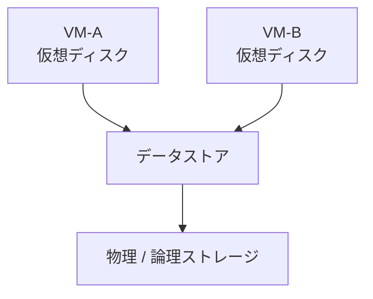

# 第5章 ストレージ仮想化

## 学習目標

1. 仮想ディスクとデータストアの関係を説明できる
2. DAS / SAN / NAS、FC / iSCSI / NFS を用途で選べる
3. シンプロビジョニングとシックプロビジョニング、スナップショット、クローンの違いを説明できる
4. IOPS、レイテンシ、キュー、マルチパスを性能切り分けに使える
5. スナップショットを長期間保持すべきでない理由を説明でき、スナップショットとバックアップを区別できる

---

## 5.1 ストレージ仮想化が必要になった背景

仮想マシンは、起動イメージとデータをどこかに置かなければ動かない。
物理サーバー時代は、その「どこか」がサーバー内蔵ディスクであることが多かった。
仮想化でホスト上に多数のVMを載せると、内蔵ディスクだけでは足りなくなる。

問題は容量だけではない。
通貫シナリオでは、ホスト1台障害時も重要システムを継続する。
そのためには、障害ホスト上のVMを別ホストで起動できる必要がある。
別ホストが同じディスク内容を読めなければ、HAもライブマイグレーションも成立しない。

ここに、仮想化基盤におけるストレージの役割が現れる。

1. 各VMに「自分専用のディスク」を見せる
2. 実際のデータは、複数ホストから参照できる領域に置く
3. 容量、性能、冗長性をホスト横断で管理する

**ストレージ仮想化**とは、物理ディスクやストレージ装置の実体を抽象化し、仮想マシンやハイパーバイザーが論理的なディスク資源として使えるようにする仕組みである。
製品によってはストレージ側の機能を指す場合もある。
本書の主眼は、仮想化ホストから見たストレージの見せ方と使い方である。

通貫シナリオの初期前提は、共有ストレージ（SAN の iSCSI、または分散ストレージ）と、実効 20 TB 起算のデータストアである。
この章では、その前提がなぜ必要か、どこで破綻するかを具体化する。

---

## 5.2 仮想ディスクとデータストア

### 仮想ディスク

**仮想ディスク**とは、仮想マシンに見せるブロックデバイス（またはそれに相当するディスク）である。
ゲストOSからは、物理HDDやSSDと同じように見える。
実体は、多くの場合、データストア上のファイル、またはLUN上の領域である。

仮想ディスクには、少なくとも次の属性がある。

- 容量（ゲストに見えるサイズ）
- フォーマット（製品固有のファイル形式）
- プロビジョニング方式（シンかシックか）
- コントローラ種別（準仮想化 SCSI など）

ゲストが「C: ドライブ 100 GB」と認識していても、ホスト側では 1 個以上の仮想ディスクファイルとして存在する。
この対応を見失うと、容量逼迫やスナップショット肥大の原因追跡ができなくなる。

### データストア

**データストア**とは、ハイパーバイザーが仮想マシンのファイル（仮想ディスク、構成ファイル、スナップショット差分など）を置く論理的な保管領域である。
製品用語では datastore（VMware）、CSV / 共有ボリューム（Hyper-V）、ストレージドメイン（oVirt）などと呼ぶ。
一般概念としては、「ホスト群がマウントして使う VM 用保管庫」と捉える。

```text
+------------------+  +------------------+
| VM-A             |  | VM-B             |
| 仮想ディスクA.vmdk|  | 仮想ディスクB.vhd |
+--------+---------+  +--------+---------+
         |                     |
         v                     v
+----------------------------------------+
|              データストア               |
|  (ファイル群 / LUN上の領域)              |
+------------------+---------------------+
                   |
                   v
+----------------------------------------+
|     物理ストレージ（SAN / NAS / 分散）   |
+----------------------------------------+
```



仮想ディスクは「VMから見たディスク」であり、データストアは「ホストから見た保管場所」である。
設計議事録では、両者を混同しない。

通貫シナリオでは、重要VM 8台 × 200 GB、一般 16台 × 100 GB、開発 6台 × 80 GB が仮置きである。
単純合計は約 3.7 TB だが、これはゲストに見せる容量の合計にすぎない。
スナップショット余裕、ログ、スワップファイル、テンプレート、バックアップ作業領域、成長率を別途積む。
実効 20 TB 起算は、その余裕を見込んだ出発点である。

---

## 5.3 ブロックストレージとファイルストレージ

ストレージの提供形態は、大きく二つに分かれる。

### ブロックストレージ

**ブロックストレージ**は、固定長のブロック列として領域を提供する。
ホストは、その領域をローカルディスクのように扱い、ファイルシステムを載せる。
仮想化では、LUN をデータストア用にフォーマットする構成が典型である。

特徴は次である。

- ホストがファイルシステムを制御する
- 低レイテンシを狙いやすい
- 複数ホストで同時に読む場合、クラスタ対応のファイルシステムや専用ロック機構が必要

### ファイルストレージ

**ファイルストレージ**は、ファイルとディレクトリを提供する。
ホストは NFS などで共有をマウントし、その上に仮想ディスクファイルを置く。

特徴は次である。

- 共有の見せ方が直感的
- ストレージ側のファイルシステムを利用する
- プロトコルとネットワーク品質が性能を左右する

| 観点 | ブロック | ファイル |
|------|----------|----------|
| 提供単位 | LUN / ボリューム | 共有エクスポート |
| 典型プロトコル | FC、iSCSI | NFS、SMB |
| ホスト側の役割 | ファイルシステムを載せる | 共有をマウントする |
| 仮想化での使い方 | データストア用LUN | NFSデータストア |

どちらが常に優れているわけではない。
通貫シナリオでは、共有ストレージ前提で HA を成立させることが先であり、ブロックかファイルかは第14章の選定対象になる。

---

## 5.4 DAS、SAN、NAS

接続トポロジの分類である。

### DAS

**DAS（Direct Attached Storage）**は、ホストに直接接続されたストレージである。
内蔵ディスクや、ホスト専用の外部 JBOD が該当する。

利点は単純さと低遅延である。
欠点は、他ホストから直接共有しにくいことである。
単一ホスト構成や、ローカルディスクを使う分散ストレージの部品としては使える。
ただし、古典的な「ホスト内蔵だけ」の構成では、通貫シナリオのホスト障害時継続が難しくなる。

### SAN

**SAN（Storage Area Network）**は、ブロックストレージをネットワーク経由で複数ホストに提供する構成である。
FC SAN や iSCSI SAN が代表である。

仮想化クラスタでは、複数ホストが同じLUN（または同等の領域）をデータストアとして共有する。
HA とライブマイグレーションの土台になることが多い。

### NAS

**NAS（Network Attached Storage）**は、ファイルストレージをネットワーク経由で提供する構成である。
NFS をデータストアにする構成が、仮想化ではよく使われる。

```text
DAS:
  Host ---- Disk

SAN:
  Host-1 --+
  Host-2 --+-- Storage Network -- Storage Array (LUN)
  Host-3 --+

NAS:
  Host-1 --+
  Host-2 --+-- IP Network -- NAS (NFS export)
  Host-3 --+
```

通貫シナリオの「共有ストレージ」は、SAN または NAS（あるいは分散ストレージ）のいずれかである。
分散ストレージは、複数ホストのローカルディスクを束ねて共有プールを作る方式であり、DAS を部品にしつつ共有性を得る。
分類名より、「複数ホストが同じVMディスクを読めるか」が設計上の分岐点である。

---

## 5.5 FC、iSCSI、NFS

プロトコルの選択は、帯域、遅延、運用スキル、既存設備に依存する。

### FC

**FC（Fibre Channel）**は、ストレージ専用のブロック転送プロトコルとファブリックである。
専用HBAとスイッチを用いることが多い。

特徴：

- 業務IPネットワークと物理的に分離しやすい
- 成熟したSAN運用がある環境で強い
- 導入コストと専用技能が必要

### iSCSI

**iSCSI**は、SCSI コマンドを TCP/IP 上で運ぶブロックプロトコルである。
既存の Ethernet を使える。

特徴：

- IPネットワーク上でSAN相当を組める
- 10GbE 以上とジャンボフレーム、専用VLANがあると安定しやすい
- 業務トラフィックとの混在は避ける

通貫シナリオの初期前提に iSCSI が入っているのは、専用FCがなくても共有ブロックを組み立てやすいからである。
採用確定ではない。

### NFS

**NFS（Network File System）**は、ファイル共有プロトコルである。
仮想化では NFS データストアとして使う。

特徴：

- 構成が比較的わかりやすい
- ストレージ側のスナップショット機能と組み合わせやすい場合がある
- ネットワーク品質と NFS の版、マウントオプションが性能に効く

| プロトコル | 種別 | 向く場面 | 注意点 |
|------------|------|----------|--------|
| FC | ブロック | 専用SANがある本番 | コスト、技能 |
| iSCSI | ブロック | IPベースでSANを組む | ストレージVLAN必須 |
| NFS | ファイル | 簡易共有、運用簡素化 | 網の品質依存 |

製品固有の最適化（VMware の VAAI、Hyper-V の Offloaded Data Transfer など）は、一般概念ではなく実装加速である。
原理理解の後に、対応可否を確認する。

---

## 5.6 シンプロビジョニングとシックプロビジョニング

仮想ディスクの容量の「見せ方」と「実確保」の差である。

### シックプロビジョニング

**シックプロビジョニング**は、作成時に指定容量ぶんの領域を確保する方式である。
ゲストに 200 GB を見せるなら、データストア上でも概ね 200 GB を先に取る。

利点：

- 実行時の領域不足が起きにくい
- 性能が安定しやすい場合がある（ゼロ初期化の有無で差がある）

欠点：

- 未使用領域も占有する
- 初期の空き容量を圧迫する

### シンプロビジョニング

**シンプロビジョニング**は、実際に書き込まれた分だけ領域を使う方式である。
ゲストには 200 GB を見せても、実使用が 40 GB ならデータストア消費はそれに近い。

利点：

- 見かけ上の過割当で、短期の収容効率が上がる
- 開発用と検証用のVMに向く

欠点：

- 実使用が増えると、突然データストアが逼迫する
- 監視とアラートが必須
- 書き込み時の領域確保コストが乗ることがある

```text
ゲストに見える容量: 200 GB

シック:
  データストア消費 ≈ 200 GB（作成直後から）

シン:
  データストア消費 ≈ 実使用分（例: 40 GB）
  実使用が増えると消費も増える
```

通貫シナリオでは、重要システムはシック、開発と検証はシン、という使い分けが候補になる。
「全部シンにして 20 TB に 45台分を無理に載せる」は、逼迫事故の典型である。
理論上の合計割当と、実測の使用量と、データストア空きを別指標で見る。

---

## 5.7 スナップショットとクローン

### スナップショット

**スナップショット**とは、ある時点の仮想マシン状態（通常は仮想ディスクの状態、製品によってはメモリも含む）を記録し、そこへ戻せるようにする機能である。
実装の多くは、元ディスクへの書き込みを止め、以降の差分を別ファイルへ書く。

```text
時刻T0: スナップショット取得
  base.vmdk  (読み取り主体)
  snap1.delta (以降の書き込み)

時刻T1: さらにスナップショット
  base.vmdk
  snap1.delta
  snap2.delta
```

用途の中心は、変更前の短い退避である。

- パッチ適用前
- 設定変更前
- 検証作業の分岐

### スナップショットはバックアップではない

ここを混同すると、基盤障害になる。

| 観点 | スナップショット | バックアップ |
|------|------------------|--------------|
| 目的 | 短期間の巻き戻し | 障害、災害、誤削除からの復旧 |
| 保管場所 | 同一データストア上であることが多い | 別媒体、別サイトが原則 |
| データストア障害時 | 一緒に失われる | 残る設計にする |
| 保持期間 | 短い（時間〜数日） | 方針に従い長期 |
| 本番保護の主役か | 否 | はい |

スナップショットは、同一ストレージ上の差分管理である。
データストアが壊れれば、本番ディスクもスナップショットも同時に失われる。
通貫シナリオの「日次バックアップ、遠隔地へ週次レプリケーション」は、スナップショットでは代替できない。
詳細は第9章だが、第5章の時点で運用ルールに書いておく。

### スナップショットを長期間保持すべきでない理由

1. 差分ファイルが肥大し、データストアを圧迫する
2. 読み書きが base + 差分の連鎖になり、レイテンシが悪化する
3. 削除（統合）時に大きなI/O負荷が発生し、本番を揺らす
4. スナップショット連鎖が長いと、バックアップや移行が失敗しやすくなる
5. 「取ってあるから安全」という誤った安心感が、本当のバックアップ設計を止める

通貫シナリオで、開発VMのスナップショットを数週間放置すると、20 TB 起算でも実効空きが急減しうる。
第1章の障害例（開発スナップショットが本番を圧迫）は、この章の典型事故である。

運用ルールの例：

- 保持は原則 72 時間以内
- 本番重要VMは変更作業以外で取らない
- 取得者と削除期限を記録する
- 監視でスナップショット有無を検知する

### クローン

**クローン**とは、仮想マシンを複製して、別の仮想マシンを作ることである。
フルクローンは独立したディスクを持ち、リンククローン（または類似機能）は親と差分を共有する。

| 方式 | 独立性 | 用途 |
|------|--------|------|
| フルクローン | 高い | 本番近い複製、長期利用 |
| リンククローン系 | 親に依存 | 大量の短期検証 |

クローンは「別VMを作る」操作であり、スナップショットは「同一VMの時点保存」である。
テンプレートからの展開は第7章で扱う。

---

## 5.8 IOPS、レイテンシ、キュー、マルチパス

### IOPS

**IOPS（Input/Output Operations Per Second）**は、1秒あたりのI/O発行数である。
ランダムな小さなI/Oが多いワークロード（DBなど）で重要になる。

注意点：

- カタログIOPSは理論値に近い上限である
- 実測IOPSは、I/Oサイズ、読書き比、キャッシュ、混在負荷で変わる
- 「データストア全体のIOPS」と「1VMのIOPS」を混同しない

### レイテンシ

**レイテンシ**は、I/Oが完了するまでの時間である。
仮想化では、ゲストから見える遅延と、データストア側の遅延を分けて見る。

目安の感覚（絶対値ではなく切り分けの手がかり）：

- 普段より桁が変わる上昇は異常合図
- CPU使用率が低いのに業務が遅いとき、ストレージ遅延を疑う

ネスト環境の絶対値は実環境と異なる。
相対比較と手順練習に使う。

### キュー

**キュー**は、処理待ちのI/Oのたまりである。
デバイスやHBA、ストレージ側に待ち行列ができると、レイテンシが伸びる。

見るべき関係は次である。

```text
発行IOPSが増える
  → 処理能力を超える
    → キューが伸びる
      → レイテンシが悪化する
        → ゲストがI/O待ちで遅くなる
```

CPU Ready が高くないのに遅い場合、ストレージキューを疑う。

### マルチパス

**マルチパス**とは、ホストとストレージの間に複数の物理経路を持ち、冗長化と負荷分散を行う仕組みである。
片方のケーブル、HBA、スイッチが落ちても、残経路でI/Oを継続する。

```text
Host
  |-- Path A --> Switch A --> Controller A --+
  |                                         +--> LUN
  |-- Path B --> Switch B --> Controller B --+
```

通貫シナリオで共有ストレージを使うなら、マルチパスは「あると良い」ではなく、単一障害点を消す必須設計に近い。
パスポリシー（固定、ラウンドロビンなど）は製品とアレイ推奨に従う。

### ストレージ障害の影響

仮想化では、ストレージ障害の影響範囲が物理1台障害より広くなりやすい。
共有データストア上の多数のVMが、同じ障害を同時に受けるからである。

| 障害 | 影響範囲 | 典型症状 | 緩和 |
|------|----------|----------|------|
| パス1本断 | マルチパスなら狭い | 一瞬の遅延、パスフェイルオーバーログ | マルチパス、二重スイッチ |
| コントローラ1台障害 | アレイ冗長に依存 | 遅延上昇、フェイルオーバー中のI/O待ち | 二重コントローラ、推奨パス設定 |
| データストア満杯 | そのデータストア上の全VM | 書き込み失敗、スナップショット肥大、ハング | 容量監視、シン上限、スナップショット禁止運用 |
| ストレージ全体停止 | 該当LUN/シェアを使う全ホスト・全VM | I/Oハング、VM停止、HAでも起動不能 | アレイ冗長、バックアップ、遠隔レプリカ |
| バックアップ窓の過負荷 | ピークと重なったVM群 | レイテンシ上昇、CPU待ちとの複合遅延 | 窓の分離、並列度制限 |

**ストレージ障害の影響**を見積もるときは、「どのVMがどのデータストアに載っているか」を先に表にする。
重要8台を1つのデータストアに詰めすぎると、そのデータストア障害が要件の可用性を一気に壊す。

通貫シナリオでは、次を設計の前提にする。

1. 重要VMと一般VMでデータストアを分ける、または少なくとも復旧優先度を付ける
2. マルチパスを必須にする
3. ストレージ全体停止を「起きない」ではなく「起きたらバックアップと遠隔で戻す」対象にする
4. HAはホスト障害向けであり、共有ストレージ全損の代替にはならない

---

## 5.9 製品に依存しない共通概念と実装例

### 共通概念の整理

| 共通概念 | 意味 |
|----------|------|
| 仮想ディスク | VMに見えるディスク |
| データストア | VMファイルの保管庫 |
| 共有ストレージ | 複数ホストが同じ領域を使えること |
| プロビジョニング | 容量の確保タイミング |
| スナップショット | 短期間の差分時点 |
| マルチパス | 経路冗長 |

### 代表製品での実装例

| 共通概念 | VMware | Hyper-V | KVM系 |
|----------|--------|---------|-------|
| 仮想ディスク | VMDK | VHDX | qcow2 / raw |
| データストア | datastore | CSV、共有ディスク、SMB | ストレージプール、NFS、LVM など |
| シン | Thin | 動的展開 | qcow2 の疎割り当てなど |
| シック | Thick（Lazy/Eager） | 固定サイズ | raw 事前確保など |
| スナップショット | Snapshot | Checkpoint | 外部/内部スナップショット |
| マルチパス | NMP / PSA | MPIO | DM-Multipath |

名前は製品固有である。
設計書には、まず共通概念で書き、括弧で製品用語を添える。

---

## 5.10 設計上の判断ポイント

通貫シナリオへの接続として、ストレージ判断を表にする。

| 判断 | 採用案（候補） | 不採用案 | 理由とトレードオフ |
|------|----------------|----------|--------------------|
| 配置 | 共有ストレージ（iSCSI SAN または分散） | 全VMをホスト内蔵のみ | HAと移行のため共有が必要。共有はSPOFになりうるので冗長化必須 |
| プロトコル | iSCSI または NFS を比較選定 | 技能も予算もないのに FC 前提 | 既存網と技能に合わせる。FCは性能と分離に強いがコスト高 |
| 重要VMのディスク | シック | 重要VMまで全面シン | 逼迫リスクを下げる。効率は落ちる |
| 開発VM | シン + スナップショット期限付き | 無期限スナップショット | 収容効率と事故防止の両立 |
| パス | マルチパス必須 | 単一パス | ケーブル1本障害でクラスタ全域影響を避ける |
| 保護 | バックアップとレプリケーション | スナップショットをバックアップ扱い | 保管場所と目的が異なる |

単一障害点の確認項目：

- ストレージコントローラが単一でないか
- ネットワークスイッチがストレージで単一でないか
- データストアが1つに集中しすぎていないか（性能と障害の両面）

障害時の挙動：

- パス1本断：マルチパスなら継続
- ストレージ全体停止：全ホスト上の該当データストアVMが停止またはI/Oハング
- データストア満杯：新規書き込み失敗、スナップショット肥大時は広範囲遅延

---

## 5.11 性能上の注意点

- 理論IOPS（カタログ）と実測IOPS（監視）を混同しない
- バックアップ、フルスキャン、スナップショット統合は、本番ピークと重ねない
- シンプロビジョニングの「まだ空いている」は、急激に埋まる前提で監視する
- NFS / iSCSI を業務VLANに混ぜると、帯域競合でレイテンシが壊れる
- ネスト環境のストレージ遅延は学習用であり、サイジング根拠にしない
- キューが伸びているのにディスクを増やす前に、混在ワークロードとパス状態を見る

通貫シナリオの成長（30台→45台）では、容量だけでなくIOPSとレイテンシの頭打ちを再測定する。
容量に余裕があっても、IOPSが足りなければ業務は遅い。

---

## 5.12 セキュリティ上の注意点

- ストレージネットワークは業務ネットワークから分離する
- iSCSI の認証（CHAPなど）と、管理インターフェースの到達制限を行う
- NFS エクスポートは必要ホストに限定する（広く export しない）
- データストア削除権限は最小人数に絞る
- スナップショットやクローンに機密データが残ることを前提に、廃棄手順を決める
- バックアップ保管先の権限と暗号化は第9章、第10章で扱うが、ストレージ設計時点で要件に含める

ストレージ網が平文で業務網と同じ放送域にある構成は、盗聴と誤接続の両面で危険である。

---

## 5.13 障害例と切り分け

### 障害例1：全VMが同時に遅い

**症状**：特定ホストに限らず、データストア上の多数VMがI/O待ち。

**確認順**：

1. データストアのレイテンシと空き容量
2. ストレージ側のコントローラ負荷、ディスク障害灯
3. バックアップジョブやスナップショット統合の同時実行
4. マルチパスの片系断による縮退

**典型原因**：共有点の飽和。仮想化固有というより、共有ストレージの容量か性能の問題。

### 障害例2：あるVMだけディスクエラー

**確認順**：

1. そのVMの仮想ディスク肥大、スナップショット有無
2. ゲスト内ファイルシステム
3. 同一データストアの他VMは健全か

**典型原因**：当該VMのスナップショット連鎖、ゲスト内満杯、仮想ディスク破損。

### 障害例3：HAは動くが、フェイルオーバー後に起動失敗

**確認順**：

1. 移行先ホストからデータストアが見えるか
2. パス状態、マウント状態
3. ロックや権限

**典型原因**：共有に見えていたが、実際はホストローカルだった。または片系パスしかなく、別ホストから到達不能。

### 障害例4：スナップショット削除後にさらに遅くなった

**確認順**：

1. 統合（consolidate）処理が走行中か
2. データストアレイテンシ
3. 差分サイズの事前見積もりがあったか

**典型原因**：長期保持した差分の統合負荷。だからこそ長期保持しない。

切り分けメモの型：

```text
症状 → 影響範囲（1VM / 1ホスト / データストア全体）
 → 層（ゲスト / 仮想ディスク / データストア / 物理ストレージ / パス）
 → 仮説 → 確認コマンドまたは画面 → 結果 → 次アクション
```

---

## 章末問題

### 問題1

仮想ディスクとデータストアの違いを、VM視点とホスト視点で説明せよ。

### 問題2

通貫シナリオで、全VMをホスト内蔵DASのみに置いた場合、どの要件が満たせなくなるか。

### 問題3

シンプロビジョニングの利点と、本番重要VMへの全面適用が危険な理由を述べよ。

### 問題4

スナップショットをバックアップの代わりにしてはならない理由を、保管場所の観点を含めて説明せよ。

### 問題5

次の指標の役割を一文ずつ述べよ。IOPS、レイテンシ、キュー、マルチパス。

### 問題6

スナップショットを長期間保持すべきでない理由を3つ挙げよ。

---

## 解答と解説

### 問題1

仮想ディスクは、VM（ゲスト）に見せるディスク装置である。
データストアは、ホストが仮想ディスクファイルなどを置く保管領域である。

### 問題2

ホスト1台障害時に、別ホストで同じディスク内容を読んでVMを継続起動する要件が満たせなくなる。
HAとライブマイグレーションの前提が崩れる。

### 問題3

利点は、実使用分だけ消費し収容効率が上がることである。
危険な理由は、実使用の急増でデータストアが突如満杯になり、多数VMの書き込みが失敗または遅延するからである。

### 問題4

スナップショットは同一データストア上の差分であることが多く、データストア障害で本番データと同時に失われる。
バックアップは別媒体や別サイトへ独立して保管し、災害やランサムウェアに備える役割である。
目的も障害モデルも異なる。

### 問題5

IOPSは単位時間あたりのI/O回数の指標である。
レイテンシはI/O完了までの時間である。
キューは処理待ちI/Oのたまりである。
マルチパスはホストとストレージ間の経路冗長（と負荷分散）である。

### 問題6

例：差分肥大による容量逼迫、I/O経路の複雑化による性能劣化、削除統合時の高負荷。
加えて、バックアップ代替という誤解を生む点も重大である。

---

## ハンズオン演習

### 演習1：対応図を描く

学習環境について、次を図示せよ（Mermaid またはテキスト）。

1. VM
2. 仮想ディスク
3. データストア（または相当）
4. 実体ストレージ（ローカル、NFS、iSCSIなど）

### 演習2：シンとシックの差を観察する

可能なら、同容量の仮想ディスクをシンとシックで作り、作成直後のデータストア消費を比較せよ。
ネスト環境では絶対値より差分の有無を記録する。

### 演習3：スナップショット実験（短時間で削除）

1. 検証用VMのスナップショットを取る
2. ファイルを追加して差分を作る
3. レイテンシまたはディスク関連指標を記録する
4. スナップショットを削除し、統合完了まで見る
5. 「バックアップではない」ことを設計判断メモに明記する

本番相当のVMでは実施しない。

### 演習4：通貫シナリオの容量メモ

仮置きVM構成から、次を計算せよ。

1. ゲスト提示容量の合計
2. スナップショット余裕を 20% と置いた場合の加算
3. 実効 20 TB に対する初期使用率（理論値）

これは出発点であり、実測で置き換える前提を一文添える。

### 成果物

- ストレージ対応図
- シン/シック比較メモ
- スナップショット実験ログ（取得〜削除）
- 通貫シナリオ容量メモ（採用理由と不採用案を短く）

---

## 本章のまとめ

仮想化のストレージは、VMに仮想ディスクを見せつつ、実体をデータストアへ集約する。
クラスタでHAや移行を行うなら、複数ホストが読める共有が前提になる。
シンとシック、FCとiSCSIとNFS、DASとSANとNASは、効率、性能、コスト、技能のトレードオフである。

スナップショットは短期の巻き戻し手段であり、バックアップではない。
長期間の保持は、容量、性能、運用判断をまとめて悪化させる。
IOPS、レイテンシ、キュー、マルチパスを見れば、遅い原因がCPUなのかストレージなのかを切り分けやすい。

続いて必要になるのは、仮想NICと仮想スイッチを軸にしたネットワーク仮想化である。
管理、業務、ストレージ、マイグレーションを分けて運ぶ理由を、そこで具体化する。
