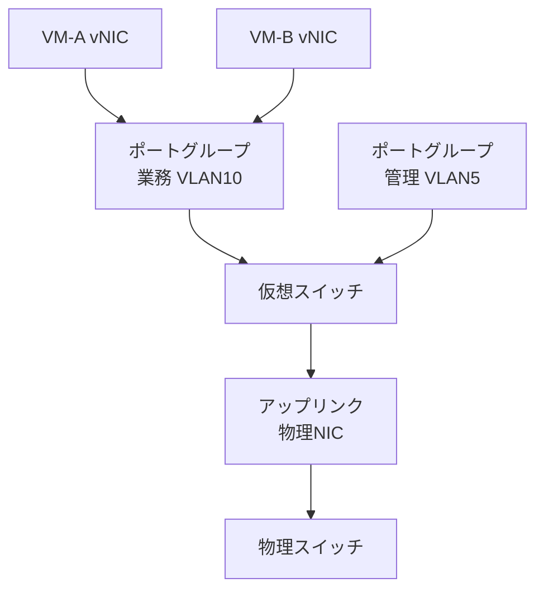
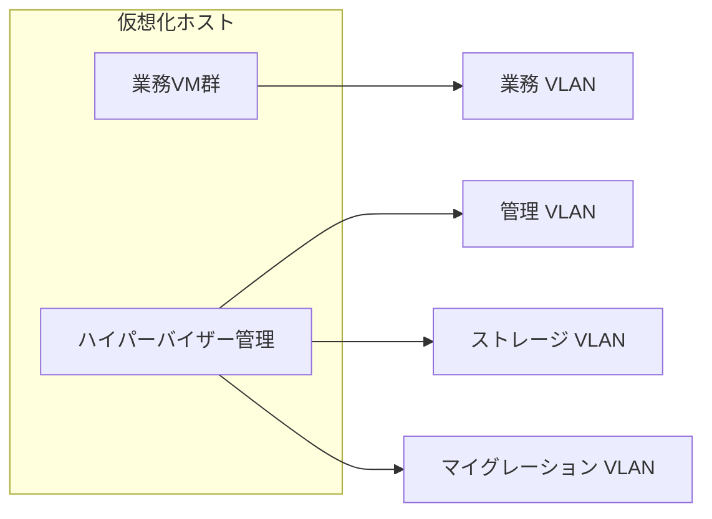

# 第6章 ネットワーク仮想化

## 学習目標

1. 仮想NIC、仮想スイッチ、ポートグループ、VLAN、アップリンクの関係を図示できる
2. ホスト内通信と外部通信の経路差を説明できる
3. 管理、ストレージ、マイグレーション、業務ネットワークの分離理由を説明できる
4. オーバーレイ（VXLAN の概要）と SR-IOV の位置づけを説明できる
5. 仮想ネットワーク障害の切り分け手順を層別に説明できる

---

## 6.1 ネットワーク仮想化が必要になった背景

仮想マシンが増えると、物理NICの本数だけでは足りない。
通貫シナリオの初期だけでも VM は 30 台あり、各VMに1つ以上のネットワーク接続が必要になる。
物理ケーブルを30本挿すわけにはいかない。

同時に、用途の異なる通信が同じ線に混ざると事故る。

- 管理画面への到達
- 業務アプリケーションの通信
- iSCSI や NFS のストレージI/O
- ライブマイグレーションのメモリ転送

これらを無分離のまま同一セグメントに流すと、帯域競合、障害の波及、権限境界の崩壊が起きる。
通貫シナリオが「管理 / 業務 / ストレージ / マイグレーション」の分離を前提にする理由は、ここにある。

**ネットワーク仮想化**とは、物理NICと物理スイッチの上に、仮想NICや仮想スイッチなどの論理ネットワークを構成し、複数VMの通信を分離して同じ物理資源上で多重化する技術である。
本書がここで扱う範囲は、ハイパーバイザー上の仮想ネットワークである。
SDN 全体やクラウドの VPC は、比較に必要な範囲に限定する。

---

## 6.2 仮想NIC、仮想スイッチ、ポートグループ、VLAN、アップリンク

### 仮想NIC

**仮想NIC（vNIC）**とは、仮想マシンに装着される仮想的なネットワークインターフェースである。
ゲストOSからは、普通のNICに見える。
ドライバが準仮想化（VMXNET3、virtio-net など）かエミュレーションかで、性能が大きく変わる（第2章）。

1つのVMに複数のvNICを付け、用途別に接続先を変えることができる。
例：業務用vNICと、バックアップ用vNIC。

### 仮想スイッチ

**仮想スイッチ（vSwitch）**とは、ハイパーバイザー内で動作するソフトウェアスイッチである。
vNIC同士、および vNIC と物理NICのあいだでフレームを転送する。

物理スイッチと似た役割を持つが、配置場所がホスト内である点が異なる。
同一ホスト上のVM同士なら、物理スイッチを経由せずに通信できる場合がある。

### ポートグループ

**ポートグループ**とは、仮想スイッチ上のポートに対する設定の束である。
VLAN ID、セキュリティポリシー、チーミング方針などを、まとめてVMの接続先に適用する。

製品用語は Port Group（VMware）、仮想スイッチのネットワーク（Hyper-V）、論理ネットワーク（oVirt）などと揺れる。
一般概念としては、「同じ通信ポリシーを共有する仮想ポートの集合」である。

### VLAN

**VLAN（Virtual LAN）**とは、L2 ネットワークを論理的に分割する仕組みである。
同一の物理スイッチや仮想スイッチ上でも、VLAN ID が違えば放送域を分けられる。

仮想化では、ポートグループに VLAN ID を割り当て、アップリンク側でタグ付き（trunk）にする構成が基本になる。

### アップリンク

**アップリンク**とは、仮想スイッチを物理NICへつなぐ出口である。
仮想スイッチ上の通信を、外部の物理スイッチやルータへ出すときに使う。

```text
+--------+   +--------+
| VM-A   |   | VM-B   |
| vNIC   |   | vNIC   |
+---+----+   +---+----+
    |            |
    v            v
+------------------------+
| 仮想スイッチ            |
|  port group: App (VLAN10)|
|  port group: Mgmt(VLAN5)|
+-----------+------------+
            | アップリンク
            v
      物理NIC (vmnic0)
            |
            v
      物理スイッチ
```



関係を一文で言うと次になる。
VMのvNICがポートグループに接続し、ポートグループが仮想スイッチに属し、仮想スイッチがアップリンク経由で物理網へ出る。

---

## 6.3 NICチーミング

**NICチーミング**とは、複数の物理NICを束ね、冗長化や帯域集約に使うことである。
仮想スイッチのアップリンクを複数本にし、片方のNICやケーブル障害でも通信を継続する。

主な目的は次の二つである。

1. 可用性：片系断でも残系で継続
2. 負荷分散：フローを複数NICへ分散（方式依存）

注意点：

- 「2本あれば帯域が常に2倍」ではない。負荷分散アルゴリズムと対向設定に依存する
- 理論リンク速度の合計と、実測スループットを混同しない
- 物理スイッチ側の設定（LACP の要否など）とセットで設計する

通貫シナリオでは、少なくとも管理と業務のアップリンクに冗長を付ける。
ストレージとマイグレーションも、可能なら専用NICを冗長化する。

---

## 6.4 仮想マシン間通信、ホスト内通信、外部通信

### 同一ホスト内のVM間通信

同じ仮想スイッチ（および到達可能なポートグループ/VLAN）上のVM同士は、ホスト内で転送されることが多い。
経路は概ね次である。

```text
VM-A vNIC → 仮想スイッチ → VM-B vNIC
```

物理NICを出ないため、物理スイッチの障害影響を受けにくい。
その代わり、ホストのCPUとメモリ帯域を消費する。

### 異なるホスト上のVM間通信

```text
VM-A → 仮想スイッチ → アップリンク → 物理スイッチ → 対向ホスト → 仮想スイッチ → VM-B
```

物理網のVLAN設計、配線、スイッチ冗長がそのまま効く。

### 外部通信（インターネット、他セグメント、ユーザー端末）

ルータやファイアウォール、ロードバランサを経由する。
仮想化固有というより、通常のネットワーク設計の延長である。
ただし、デフォルトゲートウェイやDNSを間違えると、「仮想NICはリンクアップなのに業務不通」になる。

| 通信の種類 | 主な経路 | 障害時の見え方 |
|------------|----------|----------------|
| 同一ホスト内VM間 | 仮想スイッチ内 | そのホスト上だけ不通、または遅い |
| 異ホストVM間 | アップリンク + 物理網 | VLANや物理障害の影響が出やすい |
| 外部 | 物理網 + L3装置 | 仮想化以外の層も疑う |

切り分けでは、まず「同一ホスト内では通るか」を確認する。
内通して外不通なら、アップリンク、VLANタグ、物理スイッチ、ルーティングを疑う。

---

## 6.5 用途別ネットワーク分離

通貫シナリオの4系統を、役割と分離理由で固定する。

### 管理ネットワーク

**管理ネットワーク**は、ハイパーバイザー、管理サーバー、監視、ログ収集などが使う網である。
管理者がSSHや管理GUIで到達する経路でもある。

分離理由：

- 業務ユーザーや一般VMから管理面を隠す
- 管理面の障害と業務障害を切り分けやすくする
- 攻撃面を縮小する（第10章へ接続）

### 業務ネットワーク

**業務ネットワーク**は、アプリケーションがユーザーや他システムと通信する網である。
VMの主vNICが接続する先である。

分離理由：

- 業務トラフィックの品質を、ストレージや移行トラフィックから守る
- ファイアウォールやセグメント設計を業務要件に合わせる

### ストレージネットワーク

**ストレージネットワーク**は、iSCSI や NFS などのストレージI/Oを運ぶ網である。

分離理由：

- ストレージは遅延に敏感である。帯域を奪われると多数VMが同時に遅くなる
- ストレージ障害と業務通信障害を混同しない
- 誤って業務VLANにストレージを流すと、切り分けが困難になる

第5章の共有ストレージ前提は、この網の品質とセットである。

### マイグレーションネットワーク

**マイグレーションネットワーク**は、ライブマイグレーション時のメモリ転送などを運ぶ網である。

分離理由：

- 移行中は大量の連続転送が発生し、他用途を圧迫しやすい
- 移行失敗と業務不通を分離して観測したい
- セキュアな転送経路を別にしやすい



### 分離しない場合に起きること

| 混在 | 典型症状 |
|------|----------|
| 業務 + ストレージ | 業務ピークでデータストア遅延が悪化 |
| 業務 + マイグレーション | 移行中にアプリ遅延、移行時間も伸びる |
| 管理 + 業務 | 管理面がスキャンや攻撃に晒される。権限境界が曖昧 |
| すべて同一 | 障害1つで「全部遅い」「全部届かない」になり、層の特定が遅れる |

物理NICが足りない小規模ラボでは、VLAN分離だけ先に行い、NICの物理分離は段階的でもよい。
本番の通貫シナリオでは、論理分離（VLAN）を必須とし、可能なら物理NICまたはSR-IOV/専用ポートで補強する。

不採用案としての「フラットな1セグメント」は、構築が速い。
その代わり、性能事故とセキュリティ事故の切り分けコストが後で跳ねる。

---

## 6.6 オーバーレイネットワークとVXLANの概要

VLANは4096個程度までという制約や、物理L2の延伸限界がある。
大規模やマルチテナント、データセンター間の柔軟なL2延伸では、オーバーレイが使われる。

**オーバーレイネットワーク**とは、既存のIP（アンダーレイ）の上に、論理的なL2/L3網を重ねる方式である。
VMのフレームをカプセル化して運ぶ。

### VXLANの概要

**VXLAN（Virtual Extensible LAN）**は、代表的なオーバーレイ技術である。
VMのEthernetフレームを UDP で包み、VNI（VXLAN Network Identifier）で論理網を識別する。

```text
元のEthernetフレーム
  → VXLANヘッダ + UDP/IP でカプセル化
    → アンダーレイIP網を転送
      → 対向 VTEP でデカプセル化
```

要点だけ押さえる。

- 目的：大規模な論理L2、拠点間の柔軟な接続、テナント分離
- 必要条件：アンダーレイのIP到達性、MTU余裕（カプセル化オーバーヘッド）
- 通貫シナリオ規模（ホスト数台、VLAN数系統）では、まずVLAN分離で足りることが多い

VXLANを採用する判断は、テナント数、L2延伸要件、運用チームの技能が揃ってからでよい。
小規模にいきなり重ねると、障害点が増える。

製品例としては、VMware NSX、Hyper-V の SDN スタック、Open vSwitch + VXLAN、クラウドの VPC 実装などがある。
これらは製品固有の管理面を伴う。
一般概念としてのオーバーレイと、製品のコントローラ機能を区別する。

---

## 6.7 SR-IOV

**SR-IOV（Single Root I/O Virtualization）**は、物理NICを複数の仮想機能（VF）に分割し、VMへ直接割り当てる仕組みである。
ハイパーバイザーの仮想スイッチをバイパスし、低遅延と高スループットを狙う。

向く場面：

- NFV、高頻度取引、低遅延が必須の特定ワークロード

向かない場面（通貫シナリオの標準にはしない理由）：

- ライブマイグレーションやHAの制約が増えることがある
- 運用がデバイス依存になり、標準化が崩れる
- 可搬性より性能を優先する例外扱いになりやすい

| 方式 | 経路 | 標準採用か |
|------|------|------------|
| 仮想スイッチ経由 | vNIC → vSwitch → 物理NIC | はい（通貫シナリオの標準） |
| SR-IOV | vNIC(VF) → 物理NIC | 例外のみ |

第2章のパススルー判断と同じく、「速いから全部SR-IOV」は不採用である。

---

## 6.8 製品に依存しない共通概念と実装例

### 共通概念

| 共通概念 | 意味 |
|----------|------|
| vNIC | VMの仮想NIC |
| 仮想スイッチ | ホスト内の転送点 |
| ポートグループ相当 | 接続ポリシーの束 |
| アップリンク | 物理NICへの出口 |
| VLAN分離 | 放送域と用途の分離 |
| チーミング | アップリンク冗長 |
| オーバーレイ | IP上の論理網 |
| SR-IOV | NICの直接割当 |

### 代表製品での実装例

| 共通概念 | VMware | Hyper-V | KVM系 |
|----------|--------|---------|-------|
| 仮想スイッチ | vSphere Standard/Distributed Switch | 仮想スイッチ（外部/内部/プライベート） | Linux bridge、OVS |
| ポートグループ相当 | Port Group | 仮想スイッチ上のネットワーク | ブリッジ接続やポート定義 |
| 分散仮想スイッチ | VDS | 論理スイッチ（SDN時） | OVS + コントローラなど |
| オーバーレイ | NSX（VXLAN/Geneve等） | SDN Overlay | OVS VXLAN など |
| SR-IOV | SR-IOV対応NICでVF割当 | SR-IOV対応 | vfio / SR-IOV |

分散仮想スイッチは、複数ホストで同じ仮想スイッチ定義を共有する実装である。
一般概念としては「ホスト横断で一貫した仮想網の定義」であり、製品名そのものではない。

---

## 6.9 設計上の判断ポイント

| 判断 | 採用案 | 不採用案 | 理由とトレードオフ |
|------|--------|----------|--------------------|
| 分離 | 管理/業務/ストレージ/マイグレーションをVLAN分離 | 全用途1セグメント | 性能とセキュリティと切り分けのため。NIC台数と配線コストは増える |
| 標準パス | 仮想スイッチ + 準仮想化NIC | 全面SR-IOV | 可搬性と運用標準を優先 |
| アップリンク | チーミングで冗長 | 単一NIC依存 | ケーブル抜去1回で管理不能や業務断を避ける |
| オーバーレイ | 当面VLAN。要件増で再評価 | 小規模からVXLAN必須化 | 複雑さの先行投資を避ける |
| 管理到達 | 管理VLANのみから管理面へ | 業務網から管理SSH開放 | 攻撃面縮小 |

通貫シナリオでのSPOF確認：

- 物理スイッチが1台しかない
- アップリンクが1本
- 管理サーバーが管理VLAN上の単一障害点（冗長やバックアップ到達経路）

障害時の挙動の例：

- 業務アップリンク片系断：チーミングなら継続、単一なら業務断
- ストレージVLAN障害：VMは起動して見えるがI/Oハング、業務アプリがタイムアウト
- 管理VLAN障害：VMは動いていても「基盤が落ちた」ように見える

「動いている」と「管理できる」は別である。

---

## 6.10 性能上の注意点

- リンク速度（1/10/25GbE）は理論値である。実効はCPU、ドライバ、フロー数、対向で変わる
- ストレージとマイグレーションを業務と同じNICに載せると、平均帯域に余裕があっても瞬間的に遅延が跳ねる
- 同一ホスト内通信は物理帯域を使わないが、ホストCPUを使う
- ジャンボフレームは、経路上の全装置でMTUを揃えないと逆に壊れる
- VXLAN利用時は、アンダーレイMTUにカプセル化分の余裕が必要
- ネスト環境の iperf 結果は、本番サイジングの根拠にしない

監視では、少なくとも次を分ける。

1. 物理NICのエラー、ドロップ、使用率
2. 仮想スイッチやポートのドロップ
3. ゲスト内のリンク状態とエラー

---

## 6.11 セキュリティ上の注意点

- 管理ネットワークへの到達を最小権限と最小経路にする
- ポートグループの無差別モードや偽造MAC許可は、必要な解析時以外オフにする
- VLAN間のルーティング点（ファイアウォール）を明示し、暗黙の全通しにしない
- ストレージVLANに不要なホストやVMを繋がない
- オーバーレイ導入時は、アンダーレイとコントローラの保護も設計に含める
- 「VLANで分けた」だけで暗号化や認証が完了したと思わない

通貫シナリオでは、管理面の分離が第10章の前提になる。
ネットワーク設計の段階で穴を開けると、後からパッチでは塞ぎきれない。

---

## 6.12 障害例と切り分け

仮想ネットワーク障害は、層を分けて疑う。

```text
1. ゲストOS（IP、ルート、FW、ドライバ）
2. vNIC / ポートグループ（接続先、VLAN ID）
3. 仮想スイッチ / アップリンク（チーミング、リンクダウン）
4. 物理NIC / ケーブル / 物理スイッチ
5. L3（ゲートウェイ、ACL、DNS）
```

### 障害例1：特定VMだけ不通

**確認順**：

1. ゲスト内の IP / マスク / GW
2. vNICが正しいポートグループか
3. 同一ポートグループの他VMは通るか
4. ゲストFW

**典型原因**：VLANの付け間違い、旧テンプレートの固定IP衝突、ゲストドライバ未導入。

### 障害例2：同一ホスト内は通るが、外部だけ不通

**確認順**：

1. アップリンク物理NICのリンク
2. トランク許容VLAN
3. 物理スイッチのVLAN設定
4. チーミングの片系異常

**典型原因**：タグ付き設定の不一致。仮想側はVLAN10、物理側は許可していない。

### 障害例3：業務は生きているが、管理画面に入れない

**確認順**：

1. 管理VLANのアップリンク
2. 管理サーバー到達経路
3. ホストの管理エージェント状態

**典型原因**：管理網だけ障害。業務網と共有していない構成なら、症状が分かれるのは正常である。
分離していたおかげで、業務継続と管理復旧を並行できる。

### 障害例4：移行するとネットワークが切れる

**確認順**：

1. 移行先ホストに同じポートグループ/VLANがあるか
2. 分散仮想スイッチ相当の一貫性
3. SR-IOVやパススルーを使っていないか

**典型原因**：ホストごとに仮想スイッチ名やVLANがずれている。またはSR-IOVで可搬性が落ちている。

### 障害例5：業務ピークでストレージまで遅い

**確認順**：

1. ストレージトラフィックが業務NICに乗っていないか
2. 物理NIC使用率とドロップ
3. データストアレイテンシ（第5章）

**典型原因**：ネットワーク未分離。分離設計の不採用が性能障害として顕在化した例である。

切り分けの実践順（短縮版）：

1. 影響範囲（1VM、1ホスト、クラスタ全体）
2. 同一ホスト内 ping
3. 異ホスト ping
4. アップリンクとVLAN
5. 用途別網の混在有無

---

## 章末問題

### 問題1

vNIC、仮想スイッチ、ポートグループ、アップリンクの関係を、通信の流れに沿って説明せよ。

### 問題2

同一ホスト内のVM間通信と、異ホスト間のVM間通信の経路差を述べよ。

### 問題3

通貫シナリオでネットワークを4系統に分ける理由を、性能面とセキュリティ面から説明せよ。

### 問題4

VXLAN（オーバーレイ）を、ホスト数台の小規模基盤で直ちに必須としない理由は何か。

### 問題5

SR-IOVを標準採用しない理由を、可搬性の観点から述べよ。

### 問題6

「業務VMは動いているが管理できない」状態が示す、設計上の含意は何か。

---

## 解答と解説

### 問題1

VMのvNICがポートグループに接続し、ポートグループのポリシー（VLANなど）が仮想スイッチ上で適用され、外部へ出る通信はアップリンク経由で物理NICへ渡る。

### 問題2

同一ホスト内は仮想スイッチ内で転送され、物理NICを出ないことが多い。
異ホスト間はアップリンクと物理ネットワークを経由する。

### 問題3

性能面では、ストレージやマイグレーションのバーストが業務を圧迫しないようにする。
セキュリティ面では、管理面への到達を業務から分離し、攻撃面と権限境界をはっきりさせる。
切り分け容易性も分離の効果である。

### 問題4

小規模ではVLAN分離で要件を満たせることが多く、オーバーレイはMTU、アンダーレイ、コントローラ運用の複雑さを増やす。
必要性が明確になるまで必須化しない。

### 問題5

SR-IOVは仮想スイッチをバイパスするため、ライブマイグレーションや標準的なHA前提が制約されやすい。
通貫シナリオは可搬性と運用標準を優先するため、例外用途に限る。

### 問題6

管理ネットワークと業務ネットワークが分離されている（または分離すべき）ことの表れである。
「基盤全体停止」と「管理到達障害」を同一視すると、誤った復旧判断になる。

---

## ハンズオン演習

### 演習1：論理構成図を描く

学習環境について、次を含めだ図を作れ。

1. VMとvNIC
2. 仮想スイッチ
3. VLANまたはセグメント
4. 物理NIC（アップリンク）

通貫シナリオの4系統のうち、実装できているものと未実装のものを色分けする。

### 演習2：ホスト内と外部の疎通比較

可能なら同一ホスト上に検証VMを2台置き、次を記録せよ。

1. 同一セグメントの疎通
2. 外部ゲートウェイへの疎通
3. 失敗時に疑った層

### 演習3：分離不足の影響メモ（机上可）

業務とストレージを同一NICと同一VLANにした場合に起きる障害シナリオを1つ書き、採用案（分離）とのトレードオフを設計判断メモにまとめよ。

### 演習4：切り分けチェックリスト作成

上記の層別確認順を、自分の環境の画面名やコマンド名に置き換えたチェックリストを作れ。
成果物は第15章でも再利用する。

### 成果物

- 論理ネットワーク図
- 疎通比較メモ
- 分離の設計判断メモ（採用理由、不採用案、トレードオフ）
- 切り分けチェックリスト

---

## 本章のまとめ

仮想ネットワークは、vNICと仮想スイッチとポートグループとアップリンクで、物理NICを多重利用する。
同一ホスト内通信と外部通信では経路が違い、切り分けの出発点になる。

通貫シナリオの4系統分離は、帯域保護、セキュリティ、障害観測の分離のためである。
フラットな1セグメントは構築が速いが、後の性能事故と権限事故のコストが高い。
VXLANなどのオーバーレイは大規模要件向けの選択肢であり、SR-IOVは低遅延の例外である。

ストレージとネットワークの両方が揃うと、ようやくクラスタの可用性機能を現実の経路で支えられる。
次は、仮想マシン自体の作成から廃棄までのライフサイクルを整理する。
