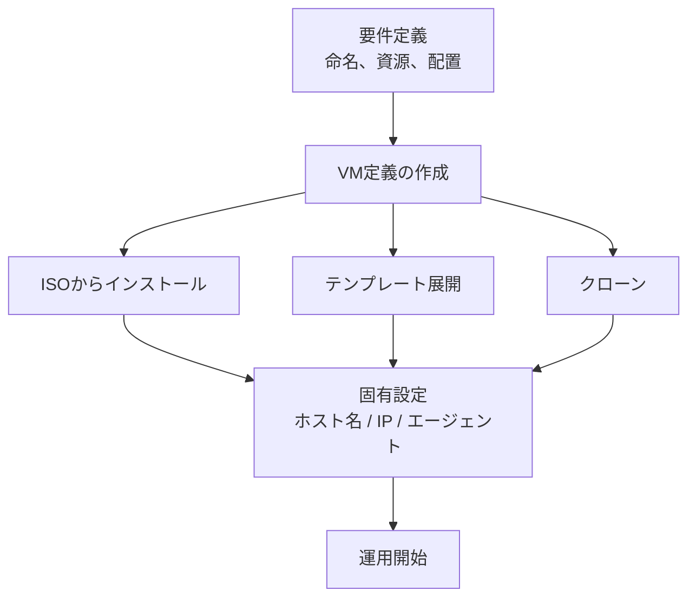
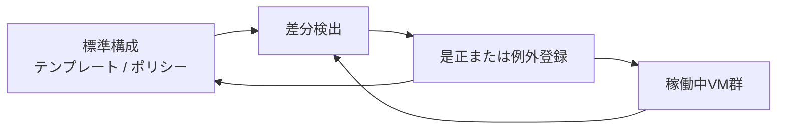

# 第7章 仮想マシンのライフサイクル

## 学習目標

1. 作成、テンプレート、クローンの使い分けを説明できる
2. 仮想ハードウェア変更（ホットアドを含む）の制約を説明できる
3. 起動、停止、コンソール、ディスク拡張の運用手順の要点を説明できる
4. 廃棄時のデータ消去と構成ドリフトの問題を説明できる
5. ライフサイクル管理のチェックリストを作れる

---

## 7.1 仮想マシン管理が必要になった背景

通貫シナリオでは、業務用VMが初期30台、うち重要システムが8台ある。
2年後には約45台へ増える想定である。
この台数を「必要なときに手作業で作り、不要になったら忘れる」では破綻する。

物理サーバー時代は、調達と設置そのものがブレーキだった。
仮想化では、ブレーキが消える代わりに、増殖と放置が起きる。

典型的な事故は次である。

- 検証用に作ったVMが本番データストアを食い続ける
- テンプレートが古く、展開直後からパッチ未適用のまま本番に乗る
- クローンしたVMが同じホスト名や同じSIDのまま衝突する
- 削除したつもりで、仮想ディスクだけが残る
- 「誰が作ったか」「いつ止めてよいか」が記録にない

**仮想マシンのライフサイクル**とは、作成から廃棄までの一連の管理対象を指す。
作成、変更、運用、保護、削除、消去は、別々の部門の作業に見えがちだが、基盤の健全性は一連の流れとして決まる。

この章では、ハイパーバイザーと管理サーバーが提供する操作を、通貫シナリオの運用ルールへ落とす。

---

## 7.2 仮想マシン作成の流れ

仮想マシンの作成は、「空の箱を定義する」ことと「中身を入れる」ことに分かれる。

### 定義で決めるもの

作成時に最低限決める項目は次である。

| 項目 | 意味 | 通貫シナリオでの仮置き例 |
|------|------|--------------------------|
| 名前 | 管理上の識別子 | `prod-file-01` など命名規約に従う |
| 配置先ホストまたはクラスタ | 実行場所 | クラスタへ配置し、初期ホストは自動でも可 |
| データストア | 仮想ディスクの置き場 | 共有データストア |
| vCPU | 仮想CPU数 | 重要8台は4、一般は2 |
| メモリ | ゲストに見せるメモリ量 | 重要16 GB、一般8 GB |
| 仮想ディスク容量と形式 | ゲストディスク | 重要200 GB、一般100 GB |
| 仮想NICと接続先 | ネットワーク接続 | 業務VLAN、必要なら管理用を分離 |
| ゲストOS種別 | 仮想ハードウェア互換とドライバ選定 | Windows Server / Linux など |
| ファームウェア | BIOS か UEFI か | OS要件に合わせる |

これらは「ゲストOSのインストール前」に決める。
後から変えられる項目もあるが、変更コストは一様ではない。
ディスク形式やファームウェア種別は、後変更が重い場合がある。

### 中身の入れ方

空のVMを作ったあとの主な経路は次の三つである。

1. ISOからゲストOSを新規インストールする
2. テンプレートから展開する
3. 既存VMをクローンする

新規インストールは、最初のゴールデンイメージを作るときに必要になる。
日常の量産では、テンプレート展開が中心になる。
クローンは、特定の状態を複製したいときに使う。

```text
[要件] 命名、サイズ、配置、ネットワーク
          |
          v
[VM定義の作成] ----+---- ISOインストール ----> 初期設定 ----> テンプレート化
                   |
                   +---- テンプレート展開 ----> 固有設定（ホスト名、IP、エージェント）
                   |
                   +---- クローン ------------> 固有設定 / 衝突回避
```



通貫シナリオでは、重要8台と一般16台、開発6台で構成が異なる。
テンプレートは用途別に分ける。
「全部入り1枚」は便利に見えて、不要サービスと過剰権限を量産する。

---

## 7.3 テンプレート

**テンプレート**とは、仮想マシンを量産するためのひな型である。
製品によっては、通常のVMをテンプレートへ変換し、直接起動できない状態にする。
別製品では、起動可能なゴールデンイメージをテンプレート相当として扱う。

一般概念としては、「標準化された仮想ハードウェア定義とディスク内容の親玉」である。

### テンプレートに入れるもの

入れるべきもの：

- ゲストOSのベースインストール
- 必須のゲストツール（第2章）
- 監視エージェント、バックアップエージェントの土台（設定は展開後でも可）
- セキュリティベースライン（不要サービス無効化、時刻同期、ログ転送の土台）
- 仮想ハードウェアの標準（準仮想化デバイス、推奨コントローラ）

入れてはいけないもの、または入れたあと必ず変えるもの：

- 本番用の秘密情報（証明書秘密鍵、接続パスワードの平文）
- 固有のホスト名、IPアドレス、コンピュータアカウント
- 一時ファイル、個人の作業ディレクトリ
- 期限切れのスナップショット連鎖

### テンプレートの更新サイクル

テンプレートは古くなる。
古いまま展開すると、パッチ未適用のVMが量産される。

運用の型の例：

1. 月次または重大脆弱性のたびに、テンプレート用VMを起動して更新する
2. 検証する
3. 新しいテンプレートとして公開する
4. 旧テンプレートは廃止日を明示して残すか削除する

通貫シナリオでは、重要システムのテンプレートと、開発用テンプレートを分ける。
開発用は更新頻度を上げてもよい。
重要システム用は、変更をレビューしてから公開する。

---

## 7.4 クローン

**クローン**とは、既存の仮想マシンを複製して別の仮想マシンを作ることである。
第5章で見た通り、スナップショット（同一VMの時点保存）とは目的が違う。

| 観点 | テンプレート展開 | クローン |
|------|------------------|----------|
| 目的 | 標準構成の量産 | 特定時点の複製 |
| 親の状態 | 管理されたひな型 | 稼働中または停止中の任意VM |
| 長期運用向き | 向きやすい | 用途次第 |
| 衝突リスク | カスタマイズ手順で吸収 | 稼働中クローンは特に注意 |

### フルクローンとリンククローン

**フルクローン**は、仮想ディスクを独立して複製する。
親との依存が切れ、長期利用に向く。
コストは容量とコピー時間である。

**リンククローン**（製品によっては類似名称）は、親ディスクと差分を共有する。
短時間で多数作れるが、親の削除や移動に弱い。
検証の大量展開向きであり、通貫シナリオの重要8台には通常使わない。

### クローン時に起きやすい衝突

- 同じホスト名
- 同じIPアドレス
- Windows の SID 重複
- 同じマシンIDを持つ監視エージェント
- 同じバックアップクライアントID

クローン後は、ゲスト内の固有情報を必ず再設定する。
製品のカスタマイズ機能（例：VMware の guest customization、cloud-init 相当）を使う場合でも、結果を確認する。

---

## 7.5 ゲストOSと仮想ハードウェア

### ゲストOS

**ゲストOS**は、仮想マシン上で動作するOSである。
ハイパーバイザーはゲストOSの種類を「完全に知らなくても」動かせる場合がある。
しかし実務では、OS種別の宣言が重要になる。

理由：

- 推奨仮想デバイスの選択が変わる
- ゲストツールの配布対象が変わる
- 時刻同期、シャットダウン連携、ハートビートの挙動が変わる
- サポート可否の境界になる

通貫シナリオでは、重要システムのOSパッチ方針をVMライフサイクルに含める。
テンプレート更新と、稼働中VMのパッチは別管理である。
テンプレートを更新しても、既存VMは自動では新しくならない。

### 仮想ハードウェア

**仮想ハードウェア**とは、VMに見せるCPU、メモリ、ディスクコントローラ、NIC、GPU、ファームウェアなどの装置モデルである。
製品には仮想ハードウェアの世代（互換バージョン）があり、上げると新機能が使える一方、古いホストへ戻せなくなる場合がある。

設計上の原則：

1. クラスタ内で互換バージョンを揃える
2. 準仮想化デバイスを標準にする（性能と安定性）
3. 不要なデバイスを付けない（攻撃面と障害点の削減）
4. 変更は変更管理の対象にする

```text
仮想マシン
  +-- 仮想ハードウェア定義（vCPU, メモリ, デバイス, ファームウェア）
  +-- 仮想ディスク（データ）
  +-- ゲストOS + アプリ（中身）
  +-- ゲストツール（連携層）
```

定義と中身は別物である。
ディスクを残したままVM定義だけ消す事故、逆に定義は残ってディスクだけ消える事故の両方がある。

---

## 7.6 起動、停止、再起動

### 起動

起動は、ハイパーバイザーがVMの仮想CPUをスケジュールし、仮想ディスクからブートすることを意味する。
起動できない場合の切り分けは、第15章で層別に扱う。
この章では運用上の要点に絞る。

起動前チェックの例：

- データストアに空きがあるか
- 必要なISOやフロッピーが誤接続されていないか
- 予約リソースが足りるか（特にHA有効時）
- 依存サービス（AD、DNS、共有ストレージ）が生きているか

通貫シナリオの重要8台は、起動順序が意味を持つ場合がある。
認証とDNSが先、業務APとDBが後、という依存があるなら、手動手順かオーケストレーションで順序を定義する。
HAの自動再起動だけに任せると、依存逆転で起動ループすることがある。

### 停止

停止には少なくとも二種類ある。

| 種別 | 意味 | 用途 |
|------|------|------|
| ゲストOSのシャットダウン連携 | ゲストへ停止要求を送り、きれいに止める | 通常運用 |
| パワーオフ | 仮想的な電源断 | 無応答時の最終手段 |

ゲストツールが入っていないと、きれいなシャットダウンができない場合がある（第2章）。
パワーオフはファイルシステム不整合のリスクがある。
DBやファイルサーバーでは特に重い。

### 再起動

再起動は、停止と起動の組み合わせである。
「ハングしたから再起動」は対症療法になりやすい。
再起動前に、可能ならコンソールで症状を記録し、ホスト側メトリクスも残す。

### サスペンド（一時停止）

製品によっては、メモリ状態をディスクへ書いて一時停止できる。
検証には便利だが、本番の長期サスペンドは推奨しない。
メモリ内容がディスク上に残るため、機密データの扱いも変わる。

---

## 7.7 コンソール接続

**コンソール接続**とは、仮想マシンの画面（またはシリアルコンソール）へ、ハイパーバイザー経由でアクセスする手段である。
ネットワーク経由の RDP や SSH が使えないときに、最後の窓口になる。

用途：

- ゲストOS起動前の操作（BIOS/UEFI、ブートメニュー）
- ネットワーク設定ミスで外部から入れないとき
- セーフモードやレスキュー作業
- 起動失敗の画面確認

注意点：

- コンソール権限は強い。誰でも触れると、パスワードリセットや破壊的操作ができる
- コンソール通信は管理ネットワーク側に閉じる
- 録画や監査が製品で可能な場合、重要操作は監査対象にする
- コンソールが遅い原因は、管理網の輻輳やホスト負荷であることが多い

通貫シナリオでは、管理プレーンと業務プレーンを分離する。
コンソールは管理プレーンの操作として扱う。

---

## 7.8 仮想ディスク拡張

ディスク不足は、ゲスト内の容量監視で先に見えることが多い。
拡張手順は、ホスト側とゲスト側の二段になる。

### ホスト側

1. VMの仮想ディスク容量を増やす（例：100 GB を 120 GB へ）
2. スナップショット有無を確認する。あると拡張できない、または制限される製品がある
3. データストア空きを確認する。シックなら即消費、シンでも上限は上がる

### ゲスト側

1. 新しい容量をOSに認識させる（再スキャン）
2. パーティションまたはボリュームを拡張する
3. ファイルシステムを拡張する

ホスト側だけ広げてゲスト側を忘れると、「ディスクは増えたのにOSから見えない」状態になる。
逆に、ゲスト側だけ拡張しようとしても、仮想ディスク上限を超えられない。

通貫シナリオの重要VMは 200 GB 仮置きである。
拡張は可能だが、無計画な拡張はデータストアを逼迫させる。
拡張要求には、増加理由、予測期間、バックアップ影響を添える。

縮小（シュリンク）は拡張より難しい。
ゲスト内の未使用領域解放、ゼロ化、ハイパーバイザー側の回収など、手順が長く失敗しやすい。
設計では「足りなくなったら増やす」前提より、「初期サイジングと監視」を優先する。

---

## 7.9 vCPU とメモリの変更、ホットアド

### 変更の基本

vCPU数やメモリ量の変更は、サイジングの修正作業である。
増やせば必ず速くなるわけではない（第3章、第4章）。
特に vCPU の過剰割当は、CPU Ready を悪化させる。

変更前に確認すること：

- 現在の実測利用率（平均だけでなくピーク）
- NUMA 境界をまたがないか
- ホストとクラスタの空き（Admission Control 含む、第8章）
- ゲストOSとアプリケーションの再起動要否

### ホットアド

**ホットアド**とは、VMを停止せずに仮想CPUやメモリ、一部デバイスを追加する機能である。
製品とゲストOS、仮想ハードウェア世代、設定（ホットアド有効化）に依存する。

| 操作 | ホットでできること（一般傾向） | 注意 |
|------|--------------------------------|------|
| メモリ追加 | 可能な場合がある | ゲストOS対応が必要。NUMAに影響しうる |
| vCPU追加 | 可能な場合がある | ライセンスやOS上限、スケジューリング影響 |
| ディスク追加 | 比較的容易なことが多い | ゲストでの認識手順が必要 |
| NIC追加 | 可能な場合がある | ドライバと設定が必要 |
| 縮小や一部デバイス除去 | 難しい、または不可 | 停止メンテナンスになりやすい |

ホットアドを有効にすると、メモリ管理の挙動が変わり、オーバーヘッドが増える場合がある。
「いつでも無停止で増やせる」を前提に初期サイジングを雑にすると、後でホスト全体が苦しくなる。

通貫シナリオの重要8台は、変更窓を決められるなら停止メンテナンスを優先してよい。
無停止要求が強い場合のみ、ホットアドの対応表をOSごとに作る。

---

## 7.10 削除と廃棄時のデータ消去

### 削除

VMの削除は、管理上のオブジェクトを消す操作である。
製品によっては、次が分かれる。

- VM定義だけ削除し、ディスクを残す
- VM定義とディスクをまとめて削除する
- データストア上の孤立ファイルが残る

削除前チェックリスト例：

1. バックアップ保持期間とリストア要否
2. 依存関係（他システムからの接続、DNS、監視）
3. スナップショットの有無
4. 所有者と削除承認
5. ライセンスの回収

通貫シナリオでは、開発6台の増減が激しい。
削除漏れはデータストア圧迫の主因になる。
「最終起動日から90日」などの棚卸しルールを運用に入れる。

### 廃棄時のデータ消去

削除は、機密データ消去と同義ではない。
ストレージ上のブロックがすぐ物理的に消えるとは限らない。
シンプロビジョニング、スナップショット、バックアップ、レプリカ、テンプレートに、データが残る。

**データ消去**の実務レベルは、要件で決める。

| レベル | 内容 | 用途例 |
|--------|------|--------|
| 論理削除 | VMとディスクを削除 | 一般的な開発VM |
| 上書き消去 | ゲストまたはストレージ機能で上書き | 社内機密を含むVM |
| バックアップ含めた抹消 | バックアップ世代からも方針に従い削除 | 契約終了、個人情報 |
| 媒体廃棄 | 物理ディスク廃棄手順 | ストレージ退役時 |

通貫シナリオの重要8台（ファイル、認証、業務AP、DB）は、廃棄時にバックアップとレプリカの扱いを明示する。
「本番VMを消したから安心」は誤りである。

---

## 7.11 構成ドリフト

**構成ドリフト**とは、標準構成（テンプレートや構成管理の定義）から、実機の状態が静かにずれていく現象である。

仮想化ではドリフトが起きやすい。

- 緊急対応でvCPUを一時的に増やしたまま戻さない
- 検証用NICを付けたまま残す
- ゲストツールの版がVMごとに違う
- セキュリティ設定を個別に緩める
- ISOを接続したままにする
- スナップショットが残る

ドリフトの問題は、個別最適が全体の再現性を壊す点にある。
障害時に「このVMだけ特別」が増えると、手順書が無効になる。

対策の型：

1. 望ましい状態を文書化またはコード化する
2. 定期的に実状態と比較する（棚卸し）
3. 例外は期限付きで記録する
4. テンプレートと構成管理で再収束する

通貫シナリオでは、重要8台の構成を特に厳格に見る。
一般業務と開発は、許容する差分の範囲を別に定義してよい。



---

## 7.12 製品に依存しない共通概念と実装例

### 共通概念の整理

| 一般概念 | 意味 |
|----------|------|
| VM定義 | 仮想ハードウェアと配置のメタデータ |
| ゲストイメージ | 仮想ディスク上のOSとデータ |
| テンプレート | 量産用の標準イメージ |
| クローン | 既存VMの複製 |
| カスタマイズ | 展開後の固有情報の書き換え |
| コンソール | ハイパーバイザー経由の操作面 |
| ホットアド | 稼働中の資源追加 |
| 構成ドリフト | 標準からの継続的なずれ |

### 代表製品での実装例

| 一般概念 | VMware | Hyper-V | KVM系 |
|----------|--------|---------|-------|
| テンプレート | Template | テンプレート / ゴールデンイメージ運用 | テンプレートVM、cloud-init 等 |
| クローン | Clone | チェックポイント併用の複製など | virt-clone 等 |
| コンソール | VM Console | VMConnect | VNC / SPICE / serial |
| ゲスト連携 | VMware Tools | Integration Services | qemu-guest-agent |
| カスタマイズ | Guest Customization | 回答ファイル等 | cloud-init、Ansible 等 |
| ハードウェア世代 | HW compatibility | 世代 / バージョン | マシンタイプ |

製品名で手順を暗記するより、上表の一般概念でメモを残す。
手順書は製品別、設計判断は一般概念別にする。

---

## 7.13 設計上の判断ポイント

通貫シナリオ（VM30台、重要8台、ホスト3台以上）に対する、ライフサイクル上の判断例である。

| 判断 | 採用の方向 | 不採用案 | トレードオフ |
|------|------------|----------|--------------|
| 量産方式 | 用途別テンプレート | 毎回ISOインストール | 初期整備コスト増、展開品質と速度が上がる |
| 重要VMの複製 | フルクローンまたはテンプレート | リンククローン | 容量は増えるが独立性を確保 |
| 資源変更 | 実測根拠のある変更窓 | 感覚でのホットアド常用 | 無停止性は下がるが、サイジング品質が上がる |
| 開発VM | 期限付き、定期棚卸し | 無期限放置 | 利便性は下がるがデータストアを守る |
| 廃棄 | 重要VMはバックアップ含めた抹消手順 | 管理画面の削除のみ | 手順は増えるが漏洩リスクが下がる |
| ドリフト | 重要8台は差分検知 | 全部手動感覚運用 | 運用負荷増、再現性が上がる |

単一障害点の話は第8章が中心だが、ライフサイクルにもある。
テンプレートが1つだけで、そこが壊れると展開不能になる。
テンプレートの保管と世代管理も設計対象である。

障害時の挙動（ライフサイクル観点）：

- テンプレート破損：新規展開不可。既存VMは稼働継続しうる
- 誤削除：バックアップがなければ業務停止。削除保護と承認を入れる
- ドリフト放置：障害対応時間が延びる。停止自体はしないが復旧が遅れる

---

## 7.14 性能上の注意点

- フルクローンとテンプレート展開は、ストレージに大きな読み書きを発生させる。業務ピークと重ねない
- リンククローンの大量展開は、親ディスクへの読み取り集中を起こしうる
- ホットアド後に性能が上がらない場合、ボトルネックがCPUやメモリ以外（ディスク、ロック、アプリ）である可能性を疑う
- vCPU増設は理論上の並列度を上げても、実測のCPU Ready が悪化することがある
- ディスク拡張そのものは軽いことが多いが、ゲスト内のファイルシステム拡張や、その後のフルバックアップ初回は重い
- コンソール転送やISOマウントを管理網で乱用すると、管理操作全体が遅くなる

理論値と実測値を混同しない。
「ディスクを200 GBから400 GBにしたからIOPSが倍」にはならない。
容量と性能は別変数である。

---

## 7.15 セキュリティ上の注意点

- テンプレートに秘密情報を焼き込まない
- コンソール権限を業務ユーザーへ広く配らない
- クローン後の認証情報と鍵を必ずローテーションする
- 削除済みVMのディスク、スナップショット、バックアップ残留を廃棄手順に含める
- ISOや古いツールの置きっぱなしを棚卸しする
- 管理者の個人用テストVMを本番クラスタへ置かない。置くなら期限とデータ分類を明示する

ライフサイクルの穴は、技術的な迂回経路になりやすい。
「一時的な検証VM」が、攻撃者から見れば踏み台候補である。

---

## 7.16 障害例と切り分け

### 障害例1：テンプレートから展開したVMがネットワークに出られない

**症状**：展開は成功、コンソールは入れる、業務通信不可。

**確認順**：

1. vNICの接続先ポートグループ / VLAN
2. ゲストのIP、マスク、ゲートウェイ、DNS
3. カスタマイズ失敗の有無（旧設定の残存）
4. 同一IP衝突

**典型原因**：クローンまたはテンプレート展開後のカスタマイズ漏れ。

### 障害例2：ディスクを拡張したがゲストから見えない

**症状**：管理画面上は 200 GB 超、ゲストは旧容量のまま。

**確認順**：

1. ハイパーバイザー上の仮想ディスクサイズ
2. ゲストでの再スキャン実施有無
3. パーティションとファイルシステムのサイズ
4. スナップショット有無（拡張が完了していない可能性）

**典型原因**：ホスト側拡張のみでゲスト側未実施。

### 障害例3：削除したVMのデータストア使用量が減らない

**症状**：VM一覧からは消えたが、データストア使用量がほぼ同じ。

**確認順**：

1. データストア上の残存フォルダ、仮想ディスク
2. 他VMがそのディスクを参照していないか
3. バックアップやレプリカの作業用コピー
4. スナップショット統合の途中状態

**典型原因**：ディスク残存、または別名での参照残。

### 障害例4：ある重要VMだけ設定が標準と違う

**症状**：障害対応手順が通用しない。デバイス構成が他と異なる。

**確認順**：

1. 現行テンプレートとの差分
2. 変更履歴、例外申請の有無
3. ゲストツール版
4. 接続デバイス（ISO、追加NIC）

**典型原因**：構成ドリフト。緊急変更の戻し忘れ。

---

## 章末問題

### 問題1

テンプレートとクローンの違いを、目的の観点から説明せよ。

### 問題2

スナップショット、クローン、バックアップの三つを、一文ずつで区別せよ。

### 問題3

ホットアドを採用する前に確認すべき制約を3つ挙げよ。

### 問題4

通貫シナリオの開発VMが増加し、データストアが逼迫した。
ライフサイクル管理の観点から、防ぐための運用ルールを2つ提案せよ。

### 問題5

VMを管理画面から削除した。
それでも機密データが残る可能性がある場所を3つ挙げよ。

### 問題6

構成ドリフトが障害対応を遅くする理由を説明せよ。

---

## 解答と解説

### 問題1

テンプレートは標準構成を量産するためのひな型である。
クローンは、既存の特定VMの状態を複製する操作である。
前者は「あるべき姿」の展開、後者は「今ある個体」の複製という目的差がある。

### 問題2

スナップショットは同一VMの短期間の時点保存である。
クローンは別VMを作る複製である。
バックアップは別媒体または別サイトへ独立に保管する復旧用コピーである。

### 問題3

例：ゲストOSとアプリケーションの対応、仮想ハードウェアや製品機能の前提、NUMAやCPUスケジューリングへの影響、ホットアド有効化に伴うオーバーヘッド、変更後のクラスタ空きとAdmission Control。
このうち3つを挙げられればよい。

### 問題4

例：所有者と期限の必須化、最終起動日による棚卸しと自動通知、テンプレート以外からの永続VM作成禁止、容量クォータ。
「作ったら消し忘れない仕組み」を含むこと。

### 問題5

例：データストア上の残存仮想ディスク、スナップショット差分、バックアップ保管、レプリカ、テンプレート、ストレージの未上書きブロック。

### 問題6

手順書と標準構成が前提とする状態から実機がずれていると、確認項目が増え、原因仮説が外れる。
結果として、同じ症状でも復旧までの時間が延びる。

---

## ハンズオン演習

### 演習1：作成からテンプレート化

1. 検証用VMを1台作成する
2. ゲストOSを入れ、ゲストツールを入れる
3. 不要アカウントと一時ファイルを整理する
4. テンプレート化（または同等のひな型化）する
5. そこから1台展開し、ホスト名とIPが一意になることを確認する

### 演習2：ディスク拡張の二段作業

1. 検証VMの仮想ディスクを少し拡張する
2. ゲスト側で認識、ボリューム拡張まで行う
3. 手順をホスト側とゲスト側に分けてメモする

### 演習3：削除と残存確認

1. 検証VMを削除する（ディスク削除の選択を意識する）
2. データストア上に残ファイルがないか確認する
3. 「削除」と「消去」の差を設計判断メモに書く

### 演習4：通貫シナリオのライフサイクルチェックリスト

次を1枚にまとめる。

| 区分 | 台数 | テンプレート | 変更窓 | 棚卸し頻度 | 廃棄時の消去レベル |
|------|------|--------------|--------|------------|--------------------|
| 重要 | 8 | | | | |
| 一般 | 16 | | | | |
| 開発 | 6 | | | | |

### 成果物

- テンプレート展開記録
- ディスク拡張手順メモ
- 削除後の残存確認結果
- ライフサイクルチェックリスト

---

## 本章のまとめ

仮想マシンのライフサイクルは、作成の速さだけでなく、標準化、変更、棚卸し、廃棄まで含めて初めて安定する。
テンプレートは量産の品質を決め、クローンは衝突回避が本丸になり、ホットアドは無停止と制約のトレードオフである。
削除は消去ではない。
構成ドリフトは静かに運用を壊す。

通貫シナリオの30台は、手作業の頑張りでは回らない。
用途別テンプレート、期限付き開発VM、重要VMの廃棄手順を、可用性設計（第8章）とバックアップ設計（第9章）の前提として先に固める。
