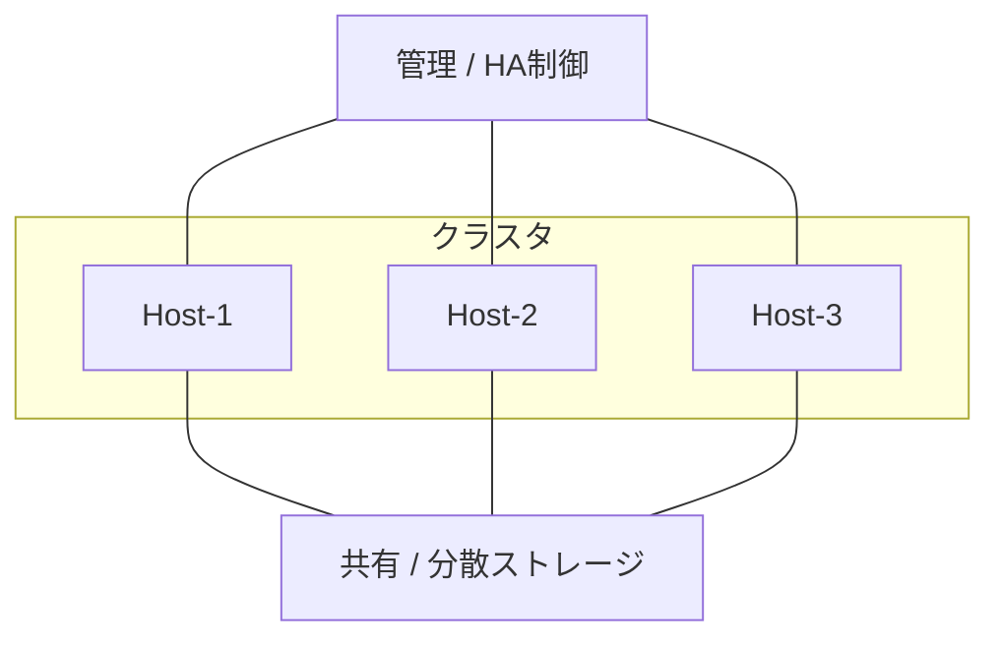
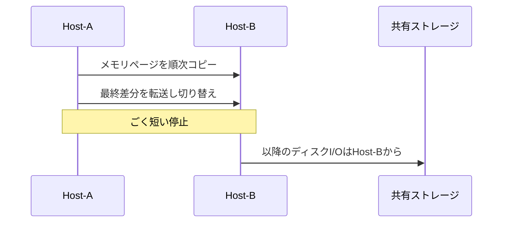
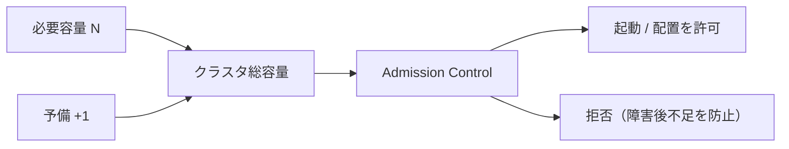

# 第8章 可用性とクラスタ

## 学習目標

1. 単一ホスト障害とクラスタによる緩和を説明できる
2. HA、ライブマイグレーション、ストレージマイグレーションの違いを説明できる
3. ハートビート、クォーラム、スプリットブレインの関係を説明できる
4. Admission Control、N+1、アンチアフィニティを設計に使える
5. 「VMが停止するケース」と「停止しないケース」を区別できる

---

## 8.1 単一ホスト障害がもたらすもの

仮想化は、複数の業務を少数の物理ホストへ載せる。
通貫シナリオでは、ホスト3台以上にVM30台（重要8台を含む）を載せる。
物理サーバー30台の時代より、1台のホスト障害の影響範囲は大きい。

ホストが突然停止すると、その上で動いていたVMは、原則としてそこで止まる。
ゲストOSから見れば、電源コードを抜かれたのと同じである。
共有ストレージ上の仮想ディスクは残っていても、実行するCPUとメモリがそのホストから消える。

ここで設計が分岐する。

1. 止まってもよいVMと、短時間で復帰すべきVMを分ける
2. 止まらずに移したい保守作業と、止まってから別ホストで起こす障害復旧を分ける
3. 「ホストが死んでもディスクは生きている」前提を、ストレージ設計で支える

第5章で共有（または分散）ストレージを置いた理由の中心は、ここにある。
別ホストが同じ仮想ディスクを読めなければ、再配置もフェイルオーバーもできない。

---

## 8.2 クラスタ

**クラスタ**とは、複数のホストを、管理と可用性の一つのまとまりとして扱う構成である。
仮想化基盤におけるクラスタの主な役割は次である。

- ホスト障害時に、別ホストでVMを再起動する（HA）
- 負荷や保守のために、VMの配置をホスト間で動かす
- 資源の空きをまとめて把握し、配置可否を判断する
- 配置ルール（アフィニティなど）を適用する

```text
+------------------- クラスタ --------------------+
|  Host-1     Host-2     Host-3                  |
|  (VM群)     (VM群)     (VM群)                  |
|       \       |       /                        |
|        +------+------+                         |
|        | 共有 / 分散ストレージ |                |
+-----------------------------------------------+
| 管理サーバー（クラスタ制御、監視連携）           |
+-----------------------------------------------+
```



クラスタは「ホストをケーブルでつないだだけ」ではない。
心拍監視、定足数、再起動権限、資源予約のルールが揃って、初めて可用性の単位になる。

通貫シナリオの可用性要件は、「物理ホスト1台障害時も重要システムを継続」である。
継続の意味を、無停止継続なのか、短時間停止後の自動再開なのかで取り違えると、設計が壊れる。
多くのHAは後者である。

---

## 8.3 HA（高可用性）

**HA（High Availability）**とは、ホスト障害などを検知したとき、影響を受けた仮想マシンを別ホストで自動的に再起動し、ダウン時間を短縮する仕組みである。
製品名では vSphere HA、Hyper-V のクラスタ機能、Pacemaker 連携などがある。
一般概念としては、「障害検知と別ホストでの再起動」である。

### HAがやること

1. ホストやVMの生存を監視する
2. 障害と判断したら、影響VMの所有者を別ホストへ移す
3. 別ホストでVMをパワーオンする
4. 優先度や資源制約に従って、起動するVMを選ぶ場合がある

### HAがやらないこと（典型）

- 障害瞬間のメモリ状態を完全に引き継ぐこと（それは後述のライブマイグレーションやFTの領域）
- ゲスト内アプリケーションの論理障害を直すこと
- 共有ストレージ全損からの復旧
- ネットワーク分断時に常に正しい判断をすること（クォーラム設計が必要）

HAによるフェイルオーバーでは、VMは一度停止する。
停止時間は、検知時間、再起動時間、ゲストOSとアプリの起動時間の合計になる。
理論上の「数分」と、実測の業務復帰時間は別物である。
DBのクラッシュリカバリが長いなら、ホスト再配置が速くても業務RTOは伸びる。

通貫シナリオの重要8台はHA対象にする。
開発6台は、資源が足りないときに起動を後回し、または対象外にしてよい。

---

## 8.4 ライブマイグレーション

**ライブマイグレーション**とは、稼働中の仮想マシンを、ほとんど停止させずに別ホストへ移す機能である。
メモリ内容を移行先へコピーし、短時間の切り替え（スイッチオーバー）で実行ホストを変える。
仮想ディスクは共有ストレージ上にある前提が多い。

用途の中心は計画作業である。

- ホストのパッチ適用前にVMを退避する
- 負荷の高いホストからVMを移す
- ハードウェア保守

```text
Host-A                         Host-B
  VM（実行中） ---- メモリ転送 ----> VM（受け側）
       |                              |
       +-------- 共有ディスク ---------+
```



ライブマイグレーション中も、マイグレーション用ネットワークに大きな帯域を使う。
第6章のネットワーク分離でマイグレーション網を分ける理由は、業務通信を押しのけないためである。

ライブマイグレーションは、突然のホスト電源断を救わない。
救うのは計画移動である。
障害時の自動再起動はHAの役割である。

---

## 8.5 ストレージマイグレーション

**ストレージマイグレーション**とは、仮想マシンの仮想ディスクを、あるデータストアから別のデータストアへ移すことである。
ホストはそのままでディスクだけ移す場合と、ホスト移動と同時に行う場合がある。
製品によっては、稼働中に実施できる。

用途：

- データストアの容量逼迫回避
- 性能ティアの変更（高速領域へ移す）
- ストレージ保守、退役
- 配置の再バランス

ストレージマイグレーションは、ストレージ帯域とIOPSを大きく消費する。
本番ピークと重ねると、移していないVMまで遅くなる。
通貫シナリオの実効20 TB起算でも、同時に多数を動かさない。

HA、ライブマイグレーション、ストレージマイグレーションの対比は次である。

| 機能 | 主な目的 | VMの停止 | 典型トリガ |
|------|----------|----------|------------|
| HA | 障害後の自動再起動 | する（再起動） | ホスト障害など |
| ライブマイグレーション | 計画的なホスト移動 | ごく短い、または体感なしを目指す | 保守、負荷分散 |
| ストレージマイグレーション | ディスク配置の変更 | 製品と条件による | 容量、性能、保守 |

---

## 8.6 フェイルオーバー

**フェイルオーバー**とは、障害発生時に、処理や実行主体を待機側へ切り替えることである。
仮想化クラスタでは、主に「障害ホスト上のVMを別ホストで起動し直す」ことを指す。

関連語との整理：

- **フェイルオーバー**：障害起点の切り替え
- **スイッチオーバー**：計画的な切り替え（保守など）
- **フェイルバック**：復旧後に元へ戻すこと（必要な場合）

フェイルオーバー成功の必要条件（例）：

1. 別ホストが生きている
2. 別ホストから仮想ディスクへ到達できる
3. ネットワーク（少なくとも業務と管理の要件）が満たされる
4. 起動に足るCPUとメモリの空きがある
5. クラスタが「どちらが正しいか」を判断できている（次節以降）

条件が欠けていると、HAは「有効」でも業務は戻らない。
第5章の障害例「HAは動くが起動失敗」は、ストレージ到達性の欠落が典型である。

---

## 8.7 ハートビート

**ハートビート**とは、ホストやサービスの生存を定期的に確認する信号である。
クラスタでは、ホスト同士、またはホストと管理要素のあいだで心拍を交換し、「生きている」「応答がない」を判断する。

心拍の経路は一つに依存させない設計が多い。

| 経路例 | 見るもの |
|--------|----------|
| 管理ネットワーク | ホスト間の疎通 |
| ストレージ心拍 | データストアへのアクセス可否 |
| ゲスト心拍（任意） | VM内OSの応答（ゲストツール経由など） |

管理ネットワークだけを信じると、管理NIC障害をホスト全損と誤認しうる。
逆に、ストレージは生きているがホストは死んでいる場合もある。
複数信号を組み合わせ、誤検知を減らす。

通貫シナリオでは、管理網とストレージ網を分離する。
心拍設計も、その分離を前提に文書化する。

---

## 8.8 クォーラム

**クォーラム（定足数）**とは、クラスタが「分割された網のどちらが正規か」を決めるための多数派条件である。
ホストがネットワーク分断で二つのグループに分かれたとき、両方とも「自分が正規だ」とVMを起動すると二重起動になる。
それを防ぐために、定足数を満たす側だけがサービスを継続する。

単純な例：

- ホスト3台のクラスタ
- 過半数（2台以上）を持つ側がクォーラムを維持
- 1台だけ孤立した側は、VM起動権限を手放す

ホスト数が偶数のときは、タイブレーク用の投票装置（ディスクウィットネス、ファイル共有ウィットネスなど）を置く設計が多い。

```text
分断前:  Host-1  Host-2  Host-3   （投票3）

分断後A: Host-1  Host-2           （投票2）→ 継続
分断後B: Host-3                   （投票1）→ 停止側
```

クォーラムは可用性を上げる仕組みであると同時に、「少数側を意図的に止める」仕組みでもある。
止めることを嫌って定足数を無効化すると、より危険な二重書き込みへ進む。

---

## 8.9 スプリットブレイン

**スプリットブレイン**とは、クラスタが複数の正規系に割れ、同じ資源を同時に制御してしまう状態である。
仮想化では、同じ仮想ディスクを二つのホスト上のVMが同時に書き込む事態が最悪である。
データ破壊に直結する。

起きうる経路：

1. ネットワーク分断
2. 心拍の誤判定
3. クォーラム不足または設定ミス
4. ストレージ側の予約（SCSI reservation など）の不整合

防御の層：

- クォーラムによる多数派の確定
- ストレージレベルでの排他
- フェンシング（問題ノードを強制隔離し、必要なら電源を落とす考え方）
- 管理操作の二重実行防止

スプリットブレイン対策は、可用性の見た目を一時的に下げることがある。
孤立ノード上のVMを止める判断は、止めたくなくても必要になる。
設計会議では、「止めないこと」より「二重書き込みを避けること」を上位要件にする。

---

## 8.10 アンチアフィニティと配置ルール

**アフィニティ**とは、特定のVM同士を同じホストへ寄せるルールである。
**アンチアフィニティ**とは、特定のVM同士を同じホストへ載せないルールである。

通貫シナリオでの典型適用：

- 認証サーバーの冗長ペアを別ホストへ置く
- DBのプライマリとセカンダリを別ホストへ置く
- 管理サーバーと、それが管理する重要VMの同時障害を避ける（要件次第）

```text
悪い例: Host-1 に認証Aと認証Bが同居 → Host-1障害で認証全滅
良い例: Host-1 に認証A、Host-2 に認証B
```

アンチアフィニティは可用性を上げるが、詰みも作る。

- ホスト台数が少ないと配置不能になる
- HA時に規則を満たせないと起動が遅延または失敗する
- ルール過多は運用を理解不能にする

重要8台すべてに相互排他を張ると、3ホストでは破綻しやすい。
「同時に落としたくない組」だけに絞る。

---

## 8.11 Admission Control と N+1

### Admission Control

**Admission Control**とは、クラスタに新しい負荷（VM起動や資源予約）を入れる前に、「ホスト1台障害後でも残りで回るか」を検査する仕組みである。
製品ごとに計算方式は異なる。
一般概念としては、「障害を仮定したキャパシティ予約の強制」である。

Admission Control が効いていると、平常時に資源を使い切れない。
それはバグではなく、障害時の席を空けておく行為である。
「空きがあるのに起動できない」は、設計が働いているサインになりうる。

### N+1

**N+1**とは、必要台数 N に対して予備を1台分持つ冗長の考え方である。
通貫シナリオの「ホスト3台以上」「ホスト1台障害耐性」は、実質 N+1（またはそれ以上）を求めている。

例（概念）：

- 平常時に必要な計算資源を2ホスト分とする
- もう1ホスト分を予備として確保する
- 合計3ホスト

実際の計算は、vCPU、メモリ、ストレージIOPS、重要VMの再配置可否を分けて行う。
第13章で数値を確定する。
この章では、「3台あれば足りる」と言い切らず、予備容量の論理を先に固定する。



N+1を満たしていても、次で破綻しうる。

- メモリは足りるが、特定データストアだけ足りない
- アンチアフィニティで再配置先がない
- ネットワーク制約で業務VLANへ出せない
- 全重要VMが同時に再起動し、ストレージが起動ストームで沈む

---

## 8.12 障害時にVMが停止するケースと停止しないケース

ここが本章の実務コアである。
「クラスタがあるから止まらない」は不正確である。

### 停止しない、またはごく短い停止に抑えやすいケース

| ケース | 仕組み | 備考 |
|--------|--------|------|
| 計画的なホスト保守 | ライブマイグレーション | 帯域と互換性が前提 |
| 計画的なデータストア移動 | ストレージマイグレーション | I/O負荷に注意 |
| ホスト間の負荷再配置 | ライブマイグレーション | 自動負荷分散機能を含む場合あり |

厳密には切り替え瞬間の一瞬停止がありうる。
業務がそれに敏感かは、アプリ次第である。
理論上の無停止と、トランザクション無中断は同一ではない。

### 停止するケース（再起動で復帰を目指す）

| ケース | 仕組み | 備考 |
|--------|--------|------|
| ホスト突然死（電源、パニック） | HAフェイルオーバー | 停止後に別ホストで起動 |
| ホスト隔離（フェンシング） | HA / フェンシング | 二重書き込み防止のため停止しうる |
| ゲストOSハングでVM再起動方針 | HAのVM監視 | 製品設定に依存 |

### 止まって戻らない、または長く止まるケース

| ケース | 理由 |
|--------|------|
| 共有ストレージ全損 | どのホストでもディスクが読めない |
| 残ホストの資源不足 | Admission Control不足、または過剰集約 |
| ネットワーク分断でクォーラム喪失 | 正規系がサービス停止を選ぶ |
| 管理プレーン単独障害 | HA自体は動いても、運用者が操作不能な場合がある |
| ゲスト内論理破損 | 基盤が正しくてもアプリが起動しない |

通貫シナリオの要件「ホスト1台障害時も重要システムを継続」は、次のように読み替えるのが実務的である。

1. 重要8台はHA対象
2. N+1の空きをAdmission Controlで守る
3. 共有ストレージとネットワーク分離を前提にする
4. 停止時間（再起動＋アプリ復帰）を受け入れ、RTOはバックアップ章の仮値（8時間）より短い運用目標を別途置く
5. ストレージ全損やサイト障害は、第9章のDRで扱う

ホスト障害のHAと、サイト災害のDRを混同しない。

---

## 8.13 製品に依存しない共通概念と実装例

### 共通概念の整理

| 一般概念 | 意味 |
|----------|------|
| クラスタ | ホスト群の可用性と配置の単位 |
| HA | 障害後の自動再起動 |
| ライブマイグレーション | 稼働中のホスト間移動 |
| ストレージマイグレーション | 仮想ディスクの配置変更 |
| ハートビート | 生存確認信号 |
| クォーラム | 正規系を決める定足数 |
| スプリットブレイン | 正規系の分裂 |
| アンチアフィニティ | 同居禁止ルール |
| Admission Control | 障害後容量を見込んだ入場制限 |
| N+1 | 予備1単位を持つ冗長 |

### 代表製品での実装例

| 一般概念 | VMware | Hyper-V | KVM系 |
|----------|--------|---------|-------|
| クラスタ | vSphere Cluster | Failover Cluster | 製品により異なる（oVirt、Proxmox 等） |
| HA | vSphere HA | クラスタのVM監視 / 再起動 | Pacemaker 等と連携する構成が多い |
| ライブマイグレーション | vMotion | Live Migration | live migration（libvirt） |
| ストレージ移動 | Storage vMotion | Storage Migration | storage migration |
| 定足数 | HA / クラスタの定足数設計 | クォーラムウィットネス | コーラムデバイス等 |
| 入場制御 | Admission Control | クラスタの容量管理 | 製品と運用に依存 |

実装名は製品固有である。
設計書の見出しは一般概念で書き、手順書だけ製品名を使う。

---

## 8.14 設計上の判断ポイント

| 判断 | 採用の方向 | 不採用案 | トレードオフ |
|------|------------|----------|--------------|
| ホスト台数 | 3台以上でN+1 | 2台のみ | 2台はウィットネス設計が要る。保守と障害の同時耐性が弱い |
| 重要8台 | HA対象 | 手動再起動のみ | 自動化で復帰は速い。誤検知時の動きも設計が要る |
| 開発6台 | HA優先度低または対象外 | 重要と同等保護 | 障害時に重要へ資源を譲る |
| 計画保守 | ライブマイグレーション前提 | 毎回停止メンテナンス | 網帯域と互換性管理が増える |
| 配置ルール | 真に同時障害を避けたい組だけアンチアフィニティ | 全VM相互排他 | 配置不能を防ぐ |
| Admission Control | 有効 | 無効にして詰め込み | 平常時の収容は減るが、障害時の破綻を防ぐ |
| 分断時 | クォーラムで少数側停止 | 両系継続 | 可用性の見かけよりデータ整合を優先 |

単一障害点の例：

- 共有ストレージ一系統
- 管理サーバー一系統（製品による）
- コアスイッチ、ストレージ網の単一経路
- 定足数ウィットネスの置き場所

障害時挙動の要約：

- ホスト1台障害：重要VMは停止後、別ホストで再起動（設計通りなら）
- 管理網分断：心拍とクォーラムの設計次第で、停止または継続が分かれる
- ストレージ障害：HAでは救えない。別層の冗長またはDRへ

---

## 8.15 性能上の注意点

- ライブマイグレーションはマイグレーション網の帯域を占有する。理論帯域の満額は実測では出ない
- 同時に多数のVMを移すと、業務VMのレイテンシが上がる
- HA起動ストームは、ストレージIOPSとCPUを一気に奪う。優先度設計が必要
- Admission Control の計算は理論上の予約であり、実測のCPU Ready やストレージ遅延までは見ない
- アンチアフィニティで片ホストに負荷が偏ると、平常時性能が落ちる
- ネスト仮想化ラボのマイグレーション時間は、本番の絶対値比較に使わない

---

## 8.16 セキュリティ上の注意点

- マイグレーション中のメモリ転送は、平文の管理網を流れると機密が露出する。分離と必要なら暗号化を検討する
- クラスタ管理権限は、全ホストと全VMへの実質的な支配権である。最小権限にする
- フェンシング装置（PDU、BMC）の認証情報を保護する
- クォーラムデバイスを弱い共有フォルダだけに置くと、攻撃や誤削除でクラスタ判断が歪む
- コンソールとクラスタ操作の監査ログを残す

可用性機能は、強い管理権限の上に乗る。
権限設計を後回しにすると、可用性の仕組み自体が攻撃面になる。

---

## 8.17 障害例と切り分け

### 障害例1：ホスト障害後、重要VMが起動しない

**症状**：Host-1死亡。Host-2/3は生きている。重要VMが起動しない。

**確認順**：

1. HAが有効か、対象VMか
2. Admission Control や資源不足で拒否されていないか
3. データストアへ Host-2/3 からアクセスできるか
4. アンチアフィニティで配置先がゼロになっていないか
5. 起動優先度で後回しになっていないか

**典型原因**：予備不足、ストレージ到達性、配置ルールの詰み。

### 障害例2：管理網障害でVMが大量再起動した

**症状**：業務網は生きているが、ホストが一斉に隔離または再起動判定された。

**確認順**：

1. 心拍経路（管理網以外があるか）
2. 実際のホスト健全性（IPMI、コンソール）
3. クォーラムの状態
4. 誤検知のログ

**典型原因**：心拍の単一路由依存、閾値設計ミス。

### 障害例3：ライブマイグレーションが途中で失敗する

**症状**：計画保守中に移動失敗。VMは元ホストに残る、または不安定。

**確認順**：

1. マイグレーション網の疎通と帯域
2. CPU世代互換、仮想ハードウェア互換
3. スナップショットや独立デバイスの有無
4. ストレージ遅延

**典型原因**：網輻輳、互換性、デバイス制約。

### 障害例4：分断後に同じVMが二重に動いた疑い

**症状**：二つの拠点または二つの網分区間で、同じディスクを巡る不整合。

**確認順**：

1. 直ちに双方の書き込みを止められないか（最優先）
2. クォーラム設定
3. ストレージ排他のログ
4. フェンシングの成否

**典型原因**：スプリットブレイン。データ整合の確認が必要。安易な両系継続は禁物。

---

## 章末問題

### 問題1

HAとライブマイグレーションの違いを、トリガと停止の有無の観点から説明せよ。

### 問題2

通貫シナリオでホストを3台以上にする理由を、N+1の言葉で説明せよ。

### 問題3

クォーラムが「意図的にVMを止める」ことがある理由を述べよ。

### 問題4

アンチアフィニティを張りすぎると、HA時に何が起きうるか。

### 問題5

次の各事象で、重要VMは「ほぼ継続」「停止後に自動再起動を期待」「基盤だけでは復旧困難」のどれに近いか分類せよ。

1. 計画的ホストパッチ（事前に退避可能）
2. ホストの電源突然断
3. 共有ストレージ全損

### 問題6

Admission Control を無効にして収容台数を増やした。
平常時は問題なく見える。障害時に何が起きやすいか。

---

## 解答と解説

### 問題1

HAは障害検知をトリガに、別ホストでVMを再起動する。停止を伴う。
ライブマイグレーションは計画的なホスト移動を主目的とし、稼働中の移行でごく短い停止に抑えることを目指す。

### 問題2

必要容量に対して予備1ホスト分を持ち、1台障害後も重要システムを残ホストで動かするためである。
単なる台数増加ではなく、障害を仮定した余剰である。

### 問題3

ネットワーク分断時に両系が正規を名乗るとスプリットブレインになり、同一ディスクへの二重書き込みでデータが壊れる。
定足数を満たさない側を止めることで、整合性を守る。

### 問題4

再配置先ホストがなくなり、HAによる起動が遅延または失敗しうる。
規則と空き容量の両方を同時に満たせなくなる。

### 問題5

1. ほぼ継続（ライブマイグレーション前提）
2. 停止後に自動再起動を期待（HA）
3. 基盤のHAだけでは復旧困難（DRやストレージ冗長の領域）

### 問題6

ホスト障害時に残ホストへVMを載せきれず、重要VMの再起動が失敗または大幅遅延しやすい。
平常時の高収容が、障害時の不足を隠す。

---

## ハンズオン演習

### 演習1：停止する／しない表を作る

自分の学習環境または通貫シナリオ想定で、次の表を埋める。

| 事象 | VMの停止 | 使う機能 | 前提条件 |
|------|----------|----------|----------|
| ホスト保守 | | | |
| ホスト突然死 | | | |
| データストア移動 | | | |
| ストレージ全損 | | | |

### 演習2：3ノード相当での移動体験

可能な環境で次を行う。

1. 検証VMをライブマイグレーション（または同等）する
2. 所要時間と網負荷を記録する（絶対値は参考）
3. ホストを強制停止し、HA再起動の有無を観察する（ラボ限定）

### 演習3：配置ルールの詰みを再現（机上でも可）

ホスト3台、重要VMのペアにアンチアフィニティを設定する想定で、1台障害時の配置可否を図に書け。

### 演習4：Admission Control の設計判断メモ

通貫シナリオについて、次を一文ずつ書く。

1. 採用する理由
2. 無効化した場合に得ること
3. 無効化した場合に失うこと

### 成果物

- 停止する／しない表
- マイグレーションまたはHAの観察メモ
- アンチアフィニティ配置図
- Admission Control の判断メモ

---

## 本章のまとめ

クラスタは、ホスト障害の影響をゼロにはしない。
影響の出し方を変える。
計画移動はライブマイグレーション、突然のホスト死はHAによる停止後再起動、ディスク配置の変更はストレージマイグレーションである。
ハートビートとクォーラムは、誤検知とスプリットブレインのあいだで可用性を制御する。
N+1とAdmission Controlは、障害後の席を平常時に予約する仕組みである。

通貫シナリオの「ホスト1台障害耐性」は、重要8台のHA、予備容量、共有ストレージ、配置ルールの同時成立として設計する。
サイトやストレージの全損は、次章のバックアップと災害対策の範囲になる。
