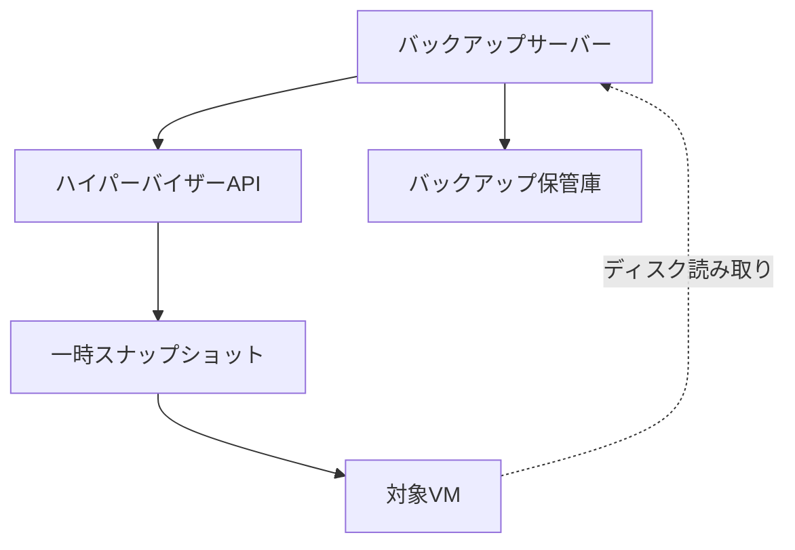
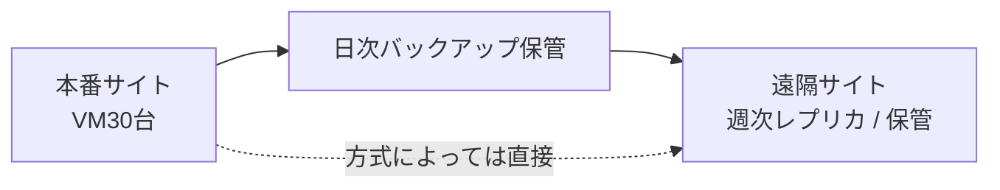

# 第9章 バックアップと災害対策

## 学習目標

1. ゲスト内バックアップとハイパーバイザーレベルバックアップを比較できる
2. クラッシュ整合性とアプリケーション整合性を区別できる
3. スナップショットとバックアップの違いを明確に説明できる
4. RPO / RTO、レプリケーション、DR、復旧テストの関係を説明できる
5. ランサムウェア対策とイミュータブルバックアップの要点を説明できる

---

## 9.1 バックアップが必要になった背景

第8章のHAは、ホスト1台の障害に対する短時間の再配置である。
共有ストレージが生きていれば、別ホストでVMを起こせる。

次の事象には、HAでは足りない。

- 仮想ディスクの論理破損、誤削除
- ランサムウェアによる暗号化
- データストア全損
- サイト災害（火災、広域停電、地域災害）
- 運用者の破壊的操作

通貫シナリオの保護要件は、次で仮置きされている。

| 項目 | 仮の値 |
|------|--------|
| バックアップ | 日次 |
| 遠隔地 | 週次レプリケーション |
| RPO | 24時間（仮） |
| RTO | 8時間（仮） |

これらの数値は出発点である。
重要8台と開発6台で、同じRPOを要求するかは別判断になる。
この章では、数値の意味と実現手段を結びつける。

**バックアップ**とは、本番データとは独立した復旧用の複製を、方針に従い取得し、保管し、復元できるようにする活動と成果物である。
コピーがあるだけでは足りない。
戻せることを、テストで示す必要がある。

---

## 9.2 ゲスト内バックアップ

**ゲスト内バックアップ**とは、仮想マシンのゲストOS上でバックアップエージェントや標準ツールを動かし、ファイルやアプリケーションを保護する方式である。

特徴：

- ファイル単位やアプリ認識の復元に強い
- 物理サーバー時代の運用知見を流用しやすい
- VMごとにエージェント管理が必要
- ゲストOSの負荷が本番に乗る
- 仮想化固有のメタデータ（VM定義）は別途保護が必要な場合がある

適用例：

- データベースのネイティブバックアップ
- ファイルサーバーの増分バックアップ
- アプリベンダーがゲスト内方式を必須とする場合

通貫シナリオでは、重要8台のうちDBやファイルサーバーで、ゲスト内の論理バックアップを併用することがある。
基盤イメージバックアップの代替ではなく、層の追加として扱う。

---

## 9.3 ハイパーバイザーレベルバックアップ

**ハイパーバイザーレベルバックアップ**とは、ハイパーバイザーやそのAPIを通じて、仮想マシンをイメージとして保護する方式である。
ゲストにエージェントを入れない、または補助的にだけ入れる構成が多い。

特徴：

- VM単位でまとめて取得しやすい
- ゲストOSの種類に依存しにくい
- 仮想ディスク全体の復元、別ホストへの復元がしやすい
- アプリ整合性は、ゲスト連携や静止処理に依存する
- バックアップウインドウ中のスナップショット（一時的）がストレージを揺らしうる

多くの製品は、バックアップ時に一時スナップショットを取り、仮想ディスクを読み、終わったら削除する。
ここで使うスナップショットは、第5章の「長期保持する運用スナップショット」とは目的が違う。
一時作業用であり、バックアップ保管そのものではない。

```text
管理サーバー / バックアップサーバー
        |
        | API
        v
  ハイパーバイザー群 ---- 一時スナップショット
        |
        v
  仮想ディスク読み取り ----> バックアップ保管庫
```



---

## 9.4 イメージバックアップと CBT

### イメージバックアップ

**イメージバックアップ**とは、仮想マシンの仮想ディスク（と必要なら設定）を、一括したイメージとしてコピーするバックアップである。
ファイルを一つずつ列挙する方式と対比される。

利点：

- ベアメタルに近い粒度でVMを復元できる
- ゲストのファイルシステム種別に依存しにくい

制約：

- 単一ファイルだけ戻したいときに重い場合がある（製品のアイテムリストアに依存）
- 取得サイズが大きくなりやすい

通貫シナリオの初期方針としては、重要8台をイメージバックアップの優先対象にするのがわかりやすい。
一般16台も日次対象に含め、開発6台は世代数を減らす、または除外を検討する。

### CBT の概要

**CBT（Changed Block Tracking）**とは、仮想ディスク上で変更されたブロックを追跡し、次回以降のバックアップで差分だけを読む仕組みの総称である。
製品固有の実装名は異なる。
一般概念としては「変更ブロック追跡」である。

効果：

- 増分バックアップの読み取り量を減らせる
- バックアップウインドウを短縮しやすい

注意：

- CBTのメタデータ不整合で、増分が失敗または不正確になる場合がある
- そのときはフル再取得や再有効化が必要になることがある
- CBTはバックアップを速くする手段であり、保管の独立性を保証しない

理論上の差分量と、実測の転送量は一致しないことが多い。
ゼロ書き込み、上書きパターン、除外設定で変わる。

---

## 9.5 アプリケーション整合性とクラッシュ整合性

バックアップの「取れている」は、戻したあとにアプリが使えるかと同義ではない。

### クラッシュ整合性

**クラッシュ整合性**とは、突然の電源断直後のディスク状態と同等の一貫性である。
ハイパーバイザーがVMを一時停止またはスナップショットするだけで取得すると、この水準になりやすい。

多くのジャーナリングファイルシステムは、クラッシュから起動できる。
しかし、データベースのトランザクションや、複数ディスクにまたがるアプリ状態は、起動後に修復やロールバックが必要になりうる。

### アプリケーション整合性

**アプリケーション整合性**とは、アプリケーションが認識できる一貫した状態でのバックアップである。
例：

- データベースがバックアップモードに入る
- OSの VSS（Volume Shadow Copy Service）相当で書き込みを静止する
- アプリがキャッシュをディスクへ吐き出す

| 水準 | 意味 | 戻した直後 |
|------|------|------------|
| クラッシュ整合 | 電源断相当 | OSは起きうる。アプリ修復が要ることがある |
| ファイルシステム整合 | FSの一貫性を意識 | ファイル単位は比較的安全 |
| アプリケーション整合 | アプリが定義する一貫性 | 業務復旧がしやすい |

重要8台のDBは、アプリケーション整合を目標にする。
開発VMはクラッシュ整合でも許容しやすい。
要求水準をVM区分で変える。

整合性確保は、静止処理の時間だけI/Oが止まる、または遅くなる。
バックアップウインドウ設計に含める。

---

## 9.6 スナップショットとバックアップの違い

第5章で示した区別を、保護設計の中心に置く。

| 観点 | スナップショット | バックアップ |
|------|------------------|--------------|
| 目的 | 短期間の巻き戻し、変更前の退避 | 障害、災害、誤削除、ランサムウェアからの復旧 |
| 保管場所 | 同一データストア上であることが多い | 別媒体、別サイトが原則 |
| データストア障害 | 本番と同時に失われやすい | 残る設計にする |
| 保持期間 | 短い（時間〜数日） | 方針に従い長期 |
| 通貫シナリオの日次／週次 | 代替不可 | 主役 |

スナップショットは、同一ストレージ上の差分管理である。
データストアが壊れれば、本番ディスクもスナップショットも同時に失われる。
通貫シナリオの「日次バックアップ、遠隔地へ週次レプリケーション」は、スナップショットでは代替できない。

バックアップ処理の内部で一時スナップショットを使うことはある。
それは取得手段であり、保管成果物ではない。
運用スナップショットを「バックアップ済み」とみなす事故が、現場では繰り返し起きる。

追加の区別：

- レプリケーション（後述）も、バックアップの完全な代替ではない場合がある
- 暗号化された本番を同期し続けると、暗号被害も同期する

---

## 9.7 レプリケーション

**レプリケーション**とは、データを別の場所へ継続的または定期的に複製することである。
バックアップが「世代を持つ復旧点の保管」に寄るのに対し、レプリケーションは「別場所での最新寄りの複製」に寄る。

| 観点 | バックアップ | レプリケーション |
|------|--------------|------------------|
| 主目的 | 世代からの復元 | 別サイトでの継続、迅速な再起動 |
| 世代 | 複数世代を持つ設計が基本 | 最新寄りを追うことが多い |
| ランサムウェア | 世代とイミュータブルで耐える設計 | 同期型だと被害が伝播しうる |
| 通貫シナリオ | 日次 | 遠隔地へ週次 |

週次レプリケーションは、RPO 24時間（仮）より粗い。
つまり、遠隔サイトだけを見ると、週次の間に最大約7日分のデータを失う可能性がある。
日次バックアップの保管場所が同一サイトだけだと、サイト災害で日次も週次も足りない組み合わせになりうる。

設計の型（例）：

1. 日次バックアップを取得する
2. バックアップデータを遠隔地へ週次で送る（またはレプリカVMを週次更新する）
3. 可能なら、バックアップ保管庫自体を別サイトへ複製する

「レプリケーションがあるからバックアップ不要」は危険な短絡である。
用途が重なる部分もあるが、世代保持と独立性が違う。



---

## 9.8 DRサイト

**DR（Disaster Recovery）サイト**とは、本番サイトが使えないときに、業務を再開するための遠隔拠点である。
暖機の度合いで呼び方が分かれることがある。

| 種別（概念） | 状態 | 復帰の速さ | コスト |
|--------------|------|------------|--------|
| コールド寄り | 設備とデータがあるが常時稼働は最小 | 遅い | 低い |
| ウォーム寄り | 一部を起動可能な状態で維持 | 中程度 | 中程度 |
| ホット寄り | ほぼ即座に切り替え可能な冗長 | 速い | 高い |

通貫シナリオの仮要件（RPO 24時間、RTO 8時間）は、ホットな同期DRを必須にはしない。
日次バックアップと週次遠隔複製を組み合わせ、8時間以内に重要業務を戻せる手順と資源があるかが焦点になる。

DRサイトに必要なもの：

- 復元先の計算資源（ホスト）
- ストレージ容量
- ネットワークと名前解決、認証の依存
- バックアップまたはレプリカデータ
- 手順書、権限、連絡体制
- 定期テストの記録

VMイメージだけ遠隔にあっても、ADやDNS、回線、ライセンスが欠ければRTOは守られない。

---

## 9.9 RPO と RTO

**RPO（Recovery Point Objective）**とは、障害時点から見て、どれだけ過去までのデータ損失を許容するかの目標である。
RPO 24時間なら、「最大24時間分のデータを失ってもよい」という設計目標になる。

**RTO（Recovery Time Objective）**とは、障害発生から業務再開までに許容する時間の目標である。
RTO 8時間なら、「8時間以内に所定の業務を戻す」が目標である。

```text
過去 ---------------- 障害 ---------------- 将来
      ^                 |
      |-- RPOの範囲 --| |
                        |---- RTOの範囲 ---->
```

関係の実務的な読み方：

- 日次バックアップは、RPO 24時間と整合しやすい（取得が確実に完走する場合）
- 週次レプリケーション単体では、RPO 24時間を満たしにくい
- RTO 8時間は、復元速度、起動順序、人員、DR資源の合計で決まる
- 理論上の転送速度から計算したRTOと、実測の復旧訓練結果は別物である

通貫シナリオでは、重要8台とそれ以外でRPO/RTOを分けてよい。
すべてを同一にする必要はない。
分けるなら、一覧表にして合意する。

| 区分 | RPO（仮） | RTO（仮） | 保護の主手段 |
|------|-----------|-----------|--------------|
| 重要8台 | 24時間 | 8時間 | 日次イメージ＋アプリ整合、遠隔週次 |
| 一般16台 | 24時間 | 24時間など緩和可 | 日次 |
| 開発6台 | 数日でも可 | 長い | 世代少なめ、または対象外 |

仮の値は、第14章の設計確定まで「仮」と明示したまま使う。

---

## 9.10 復旧テスト

バックアップは、戻して初めてバックアップになる。
取得成功ログは、復元成功を意味しない。

復旧テストで確認すること：

1. 指定した世代からVMまたはデータを復元できる
2. ゲストOSが起動する
3. アプリケーションが使える（重要システム）
4. 所要時間がRTOに対して妥当か（実測）
5. 手順書通りに、担当者が実施できるか
6. 遠隔地からの復旧経路が使えるか

テストの頻度例：

- 四半期に1回、重要VMのうち代表を復元
- 年1回、DRサイトでの業務再開訓練
- バックアップ方式変更のたびに回帰テスト

通貫シナリオでは、重要8台すべてを毎回フルテストしなくてよい。
代表（ファイル、認証、AP、DB）をローテーションする。
テストで本番を壊さないため、隔離ネットワークでの復元を基本にする。

---

## 9.11 ランサムウェア対策とイミュータブルバックアップ

### ランサムウェア対策（バックアップ観点）

ランサムウェアは、本番データを暗号化するだけでなく、バックアップへも到達しようとする。
対策の要点：

1. バックアップ保管へ到達できるアカウントを最小にする
2. 本番セグメントとバックアップ管理を分離する
3. 複数世代を持ち、感染前の世代へ戻せるようにする
4. オフラインまたは別系統の保管を持つ
5. 復旧手順を、感染拡大中でも実行できるようにする

レプリケーションだけに頼ると、暗号化済みデータの上書き同期が起きうる。
世代を持つバックアップと、書き込み制限のある保管が必要になる。

### イミュータブルバックアップ

**イミュータブルバックアップ**とは、保持期間中に削除や改ざんができない（または極めて困難な）保管状態を指す。
オブジェクトストレージのオブジェクトロック、WORM相当、バックアップ製品の不変リポジトリなどが実装例である。

効果：

- 管理者アカウントが侵害されても、保持期間中のバックアップを消せない設計にできる
- ランサムウェア対策の中核になりやすい

制約：

- 保持期間の設定ミスが、容量を食い続ける
- 本当に必要な抹消（法的要求）との衝突を、ポリシーで先に決める
- 「イミュータブル」の文言が製品によって指す範囲が違う。検証が必要

通貫シナリオでは、少なくとも遠隔保管側に、削除耐性のある世代を置く判断が有力である。
コストと運用複雑さとのトレードオフを、第14章で確定する。

---

## 9.12 製品に依存しない共通概念と実装例

### 共通概念の整理

| 一般概念 | 意味 |
|----------|------|
| ゲスト内バックアップ | OS/アプリ上で取得 |
| ハイパーバイザーレベルバックアップ | 仮想化API経由でVMイメージ取得 |
| イメージバックアップ | 仮想ディスク単位の保護 |
| CBT | 変更ブロック追跡 |
| クラッシュ整合 | 電源断相当の一貫性 |
| アプリケーション整合 | アプリが定義する一貫性 |
| レプリケーション | 別場所への複製 |
| DRサイト | 災害時の再開拠点 |
| RPO / RTO | 損失量と再開時間の目標 |
| イミュータブル | 保持期間中の改ざん耐性 |

### 代表製品と方式の例

| 一般概念 | 実装例（製品固有） |
|----------|--------------------|
| ハイパーバイザーレベル | VMware vSphere API 連携のバックアップ製品、Hyper-V の VSS 連携、KVM のスナップショット＋コピー運用 |
| CBT相当 | VMware CBT、Hyper-V の差分追跡、製品独自の変更追跡 |
| アプリ整合 | Windows VSS、DBネイティブバックアップ、ゲストエージェント連携 |
| イミュータブル | オブジェクトロック、WORM、不変リポジトリ機能 |

一般概念で要件を書き、製品機能は要件への写像として選ぶ。

---

## 9.13 設計上の判断ポイント

| 判断 | 採用の方向 | 不採用案 | トレードオフ |
|------|------------|----------|--------------|
| 保護の主方式 | ハイパーバイザーレベル日次＋重要アプリは整合性確保 | スナップショット長期保持で代用 | 保管コスト増、真の復旧点を得る |
| 重要8台 | アプリ整合を目指す | すべてクラッシュ整合 | ウインドウは伸びるが復旧品質が上がる |
| 開発6台 | 世代削減または対象外 | 重要と同等 | コスト減、開発データ損失リスク増 |
| 遠隔 | 週次でバックアップまたはレプリカを送る | 同一サイトのみ | 回線と遠隔保管コスト増、サイト災害に耐える |
| RPO 24時間 | 日次バックアップ完走を監視 | 取得失敗を翌日まで放置 | 運用負荷増 |
| RTO 8時間 | 復旧訓練で実測し手順を削る | カタログ速度だけで宣言 | 訓練コスト増、宣言の信頼性が上がる |
| ランサムウェア | イミュータブルまたはオフライン世代 | 上書き可能な単一保管 | 容量とコスト増、消去耐性が上がる |
| レプリケーション | バックアップを補完 | バックアップ全廃 | 世代と独立性を失いやすい |

単一障害点の例：

- バックアップサーバー本体
- 同一サイトの唯一の保管庫
- バックアップ用資格情報の単一管理
- 復旧手順を知る人が一人だけ

障害時挙動：

- ホスト1台障害：第8章のHA。バックアップは使わないことが多い
- VM誤削除：バックアップから復元
- データストア全損：バックアップまたは遠隔から復元。RTO計測の本番
- サイト災害：DRサイト手順。週次遠隔のRPO限界を認識する
- ランサムウェア：感染前世代のイミュータブル／隔離バックアップへ

---

## 9.14 性能上の注意点

- バックアップはストレージとネットワークの大口利用者である。業務ピークと重ねない
- 一時スナップショット中は、対象VMのディスク性能が落ちることがある
- 全VM同時フルバックアップは、データストアを沈める。並列度を制御する
- CBT利用時の増分は理論上小さいが、初回フルや再シードは大きい
- 遠隔週次レプリケーションは回線を長時間占有する。帯域制限と時間帯を決める
- 復元は取得より遅いことが多い。RTOは復元の実測で見る

通貫シナリオの実効20 TB起算に対し、バックアップ保管は世代数倍の容量計画が要る。
圧縮と重複排除の理論値を、実測なしで設計確定に使わない。

---

## 9.15 セキュリティ上の注意点

- バックアップデータは本番の写しである。暗号化とアクセス制御を本番以上に厳しくしてよい
- バックアップ管理者権限は、全VMの読み取りに等しい
- ゲストエージェントの資格情報をテンプレートへ埋め込まない（第7章）
- 復元先を間違えると、古いデータで本番を上書きする。承認とガードレールを置く
- イミュータブルの解除権限を、日常運用アカウントから分離する
- バックアップカタログの改ざんも攻撃対象になる

---

## 9.16 障害例と切り分け

### 障害例1：バックアップ成功と出ているが、復元するとDBが壊れている

**症状**：ジョブは緑。復元VMは起動するがアプリが不整合。

**確認順**：

1. 整合性水準（クラッシュかアプリか）
2. 静止処理（VSS等）のログ
3. マルチディスクの同時性
4. アプリ公式のバックアップ手順との差分

**典型原因**：クラッシュ整合のみでDBを守っていた。

### 障害例2：日次バックアップが毎夜失敗し、気づいたら1週間空いた

**症状**：監視がジョブ失敗を追っていない。RPO 24時間が崩れている。

**確認順**：

1. 失敗通知の有無
2. データストア空き、スナップショット残り
3. CBTエラー
4. 権限期限切れ

**典型原因**：監視欠如、一時スナップショット肥大、認証切れ。

### 障害例3：ランサムウェア後、バックアップも消えていた

**症状**：本番もバックアップも暗号化または削除。

**確認順**：

1. 保管庫へのネットワーク到達経路
2. 使用アカウントの権限範囲
3. イミュータブルまたはオフライン世代の有無
4. 別サイトコピーの有無

**典型原因**：同一資格情報で本番とバックアップを管理、不変保管なし。

### 障害例4：DR訓練でRTO 8時間を超過した

**症状**：データはあったが、復元、網、認証、手順で時間が溶けた。

**確認順**：

1. どこで何時間が消えたかのタイムライン
2. 復旧優先順位（重要8台の順序）
3. DR側の資源不足
4. 手順書の欠落手順

**典型原因**：転送時間だけ見て、依存サービスと人的手順を見ていなかった。

---

## 章末問題

### 問題1

スナップショットをバックアップの代わりにしてはならない理由を、保管場所の観点から説明せよ。

### 問題2

クラッシュ整合性とアプリケーション整合性の違いを、DBを例に説明せよ。

### 問題3

通貫シナリオのRPO 24時間（仮）に対し、日次バックアップと週次レプリケーションはそれぞれどう寄与するか。

### 問題4

CBTの役割を一文で述べよ。バックアップ保管の独立性との関係も一言添えよ。

### 問題5

ゲスト内バックアップとハイパーバイザーレベルバックアップを、運用負荷と復元粒度の観点で比較せよ。

### 問題6

イミュータブルバックアップがランサムウェア対策になる理由を説明せよ。

---

## 解答と解説

### 問題1

スナップショットは同一データストア上の差分であることが多く、データストア障害で本番と同時に失われる。
バックアップは別媒体や別サイトへ独立して保管し、災害や広範囲障害に備える。

### 問題2

クラッシュ整合は電源断相当であり、DBは起動後にクラッシュリカバリや修復が必要になりうる。
アプリケーション整合は、DBがバックアップ可能な一貫状態を作ってから取得するため、復旧が業務に近い形になりやすい。

### 問題3

日次バックアップは、完走すればRPO 24時間の主たる手段になる。
週次レプリケーションはサイト災害向けの遠隔手段だが、週次だけではRPO 24時間を満たさない。
両者は役割が違う。

### 問題4

CBTは変更ブロックを追跡し、増分バックアップの読み取りを減らす仕組みである。
速くするための手段であり、保管場所の独立性や世代保護そのものではない。

### 問題5

ゲスト内はエージェント管理が増えるが、ファイルやアプリ単位の復元に強い場合がある。
ハイパーバイザーレベルはVM横断の運用を揃えやすく、VMイメージ復元に強い。
粒度と運用負荷はトレードオフになる。

### 問題6

保持期間中に削除や改ざんができないため、攻撃者が管理者権限を得ても、過去世代のバックアップを消しきれない設計にできる。
感染前の時点へ戻す選択肢が残る。

---

## ハンズオン演習

### 演習1：スナップショットとバックアップの対比メモ

第5章の表を再掲せず、自分の言葉で次を書け。

1. 同一障害で同時に失われるか
2. 通貫シナリオの日次／週次のどれを担えるか
3. 一時スナップショットをバックアップと呼んではいけない理由

### 演習2：取得と復元（小規模）

1. 検証VMのバックアップ（またはエクスポート相当）を取る
2. 別名で復元する
3. 所要時間を記録する
4. 理論見積もりと実測を並べる

### 演習3：RPO / RTO の区分表

通貫シナリオの重要8台、一般16台、開発6台について、仮のRPO/RTOと手段を表にする。
「すべて同一」にするなら、その理由も書く。

### 演習4：ランサムウェア想定の設計判断

次を判断メモにする。

1. バックアップ保管への到達経路
2. 使うアカウントの権限
3. イミュータブルまたはオフラインの採用可否
4. 不採用する場合の代替緩和策

### 成果物

- 対比メモ
- 復元実測記録
- RPO/RTO区分表
- ランサムウェア対策の判断メモ

---

## 本章のまとめ

バックアップは、HAが扱わない損失（誤削除、論理破損、ランサムウェア、サイト災害）に備える独立した復旧手段である。
ゲスト内とハイパーバイザーレベルは排他ではなく、要件で重ねられる。
整合性の水準を決めないと、「取れたが使えない」が起きる。
スナップショットは短期間の巻き戻しであり、日次バックアップと遠隔週次レプリケーションの代替ではない。

通貫シナリオのRPO 24時間、RTO 8時間は仮の目標である。
日次取得の完走監視、遠隔世代の保持、復旧テストの実測がそろって、初めて目標に意味が生まれる。
次章では、これらの運用を支える権限、ネットワーク分離、監査といったセキュリティを扱う。
