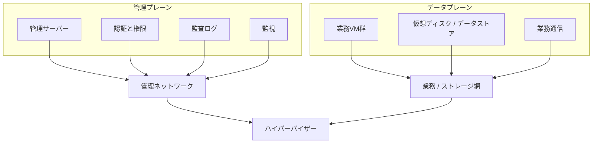
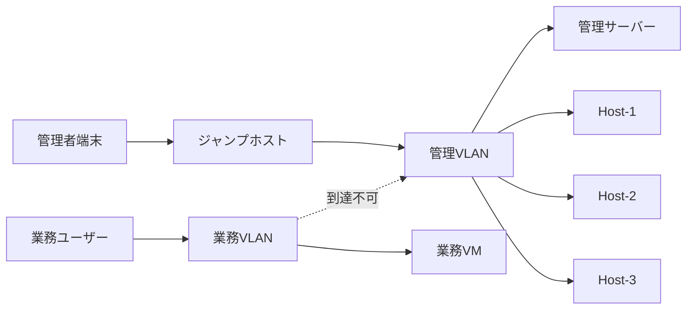

# 第10章 仮想化基盤のセキュリティ

## 学習目標

1. 管理プレーンとデータプレーンの分離を説明できる
2. ハイパーバイザー脆弱性と管理ネットワーク分離の重要性を説明できる
3. 最小権限、多要素認証、ログ監査の運用要件を列挙できる
4. セキュアブート、仮想TPM、テンプレート安全性の要点を説明できる
5. パッチ管理を可用性制約と両立させる考え方を説明できる

---

## 10.1 仮想化基盤のセキュリティが必要になった背景

仮想化は、物理サーバーを減らして運用を揃える。
同時に、攻撃者から見ると「集約された特権点」も増える。

通貫シナリオでは、ホスト3台以上、管理サーバー、共有ストレージ、バックアップ、監視がある。
業務VMが30台あっても、管理画面への侵入が1回成功すれば、その影響は多数のVMへ広がる。
物理1台ずつの時代より、管理面の価値が上がっている。

ここで扱うセキュリティは、ゲストOSのアンチウイルス設定だけではない。
仮想化基盤そのものを守る話である。

守る対象を先に分ける。

| 対象 | 例 | 侵害時の影響 |
|------|----|--------------|
| 管理プレーン | 管理サーバー、ホスト管理API、権限、監査ログ | 全ホスト、全VMの設定変更や破壊 |
| データプレーン | 業務VMの通信、ストレージI/O、マイグレーション転送 | 業務データの漏洩、改ざん、停止 |
| ハイパーバイザー | Type 1 本体、カーネル相当の制御層 | ゲスト間分離の崩壊、ホスト奪取 |
| テンプレートとイメージ | 黄金イメージ、クローン元 | 量産される脆弱性の固定化 |
| 運用経路 | バックアップ、監視、パッチ配布 | 復旧不能、検知遅延、横展開 |

仮想化の分離性（第1章）はゲスト同士では強い。
しかし、ハイパーバイザーと管理面は共有点である。
セキュリティ設計は、この非対称を前提にする。

---

## 10.2 管理プレーンとデータプレーン

### 管理プレーン

**管理プレーン（control plane / management plane）**とは、仮想化基盤を観測し、設定し、操作する面である。
管理サーバー、ホストの管理エージェント、クラスタ制御、権限管理、監視とログの収集経路がここに入る。

管理プレーンで行われる操作の例は次である。

- 仮想マシンの作成、削除、電源操作
- vCPU、メモリ、ディスク、ネットワークの変更
- ライブマイグレーション、HA設定、ホストのメンテナンスモード
- ロールと権限の付与
- テンプレートの登録

### データプレーン

**データプレーン（data plane）**とは、業務データと業務通信が実際に流れる面である。
ゲストのアプリケーション通信、仮想ディスクへの読み書き、ストレージネットワーク上のI/O、場合によってはマイグレーション中のメモリ転送がここに近い。

製品や文脈によっては、「制御面と転送面」の言い方をネットワーク機器と同様に使う。
本書では、仮想化運用の実務に合わせて次のように置く。

- 管理プレーン：誰が何を設定し、操作できるか
- データプレーン：業務の通信とデータがどこを通るか

```text
+---------------------------+     +---------------------------+
| 管理プレーン               |     | データプレーン             |
| 管理サーバー / API / 権限   |     | 業務VM通信 / 仮想ディスク  |
| 監視とログ / パッチ指示     |     | ストレージI/O / 移行転送   |
+-------------+-------------+     +-------------+-------------+
              |                                 |
              v                                 v
        管理ネットワーク                 業務とストレージの網
              |                                 |
              +---------------+-----------------+
                              |
                     ハイパーバイザー / ホスト
```



### なぜ分離するか

管理プレーンとデータプレーンを同一セグメントに置くと、次が起きる。

1. 業務VMや業務ユーザーから管理APIへ到達しやすくなる
2. 業務トラフィックの過負荷が管理到達性を奪う
3. 障害時に「業務が死んだのか、管理が見えないだけか」が分からなくなる

第6章の管理ネットワーク分離は、性能のためだけではない。
セキュリティ境界そのものである。

通貫シナリオでは、管理 / 業務 / ストレージ / マイグレーションの4系統分離を前提にする。
通貫シナリオでは、そのうち管理系統を「特権の入口」として設計する。

---

## 10.3 ハイパーバイザーの脆弱性

ハイパーバイザーは、ゲストより高い特権で動作する。
ここに欠陥があると、理論上は次が可能になる。

- ゲストからホストへの脱出（VM Escape）
- 他ゲストのメモリやディスクへの不正アクセス
- ホスト上の全VMの停止や改ざん

頻度として日常的に起きるわけではない。
しかし、影響半径は大きい。
通貫シナリオのホスト1台に重要VMが複数載るなら、1ホスト侵害は複数業務の同時侵害になりうる。

### 攻撃面の整理

| 攻撃面 | 内容 | 緩和の方向 |
|--------|------|------------|
| 管理API | 認証突破、権限昇格 | MFA、最小権限、管理網分離 |
| 仮想デバイス | エミュレーションや準仮想化の実装欠陥 | パッチ、不要デバイス削減 |
| ゲストツール連携 | ホストとゲストの通信経路 | 版数管理、不要機能の無効化 |
| 共有資源 | サイドチャネル、資源枯渇によるDoS | 同居方針、予約と制限、監視 |
| テンプレート | 埋め込まれたアカウントや古いパッケージ | テンプレート衛生、再生成 |

「ハイパーバイザーは安全だから中は緩くてよい」は成立しない。
ゲスト間分離は防御の一層であり、唯一の層ではない。

### 製品実装の違い（一般概念との区別）

VMware、Hyper-V、KVM のいずれも、パッチとサポート期限の管理が必要である。
製品固有の機能名（例：特定のロックダウンモードや強化ガイド）は、一般概念である「攻撃面の縮小」の実装例として扱う。
機能名を暗記するより、何を閉じ、何を監視するかを先に決める。

---

## 10.4 管理ネットワークの分離

管理ネットワーク分離の要点は、第6章の再掲ではなく、到達制御として再定義することである。

### 到達できる主体を限定する

管理ネットワークへ入れる主体を、次に絞る。

- 管理者の運用端末（またはジャンプホスト）
- 管理サーバー
- 監視とログ収集のサーバー
- バックアップ連携に必要な最小コンポーネント

業務VMのセグメントから、ホスト管理IPや管理APIへ直接到達できないようにする。
開発者が「便利だから業務VLANからESXiやHyper-VホストへSSHしたい」と言う場面がある。
通貫シナリオでは不採用とする。
代わりに、管理用ジャンプホストを置く。

### 分離の段階

| 段階 | 内容 | 小規模での現実性 |
|------|------|------------------|
| 論理分離 | VLAN / ファイアウォールで管理網を分ける | 必須 |
| 物理分離 | 管理用NICを分ける | 推奨 |
| 運用分離 | 管理用端末、踏み台、MFAを別にする | 必須に近い |
| 完全エアギャップ | 管理網をインターネットから完全遮断 | 運用コストと相談 |

完全エアギャップは理想に見える。
しかし、パッチ取得、監視転送、遠隔支援が止まる。
通貫シナリオ規模では、管理網を社内限定にし、インターネット直結を禁止し、更新経路を制御するほうが現実的である。



---

## 10.5 最小権限

**最小権限（least privilege）**とは、業務に必要な権限だけを付与し、それ以上を与えない原則である。
仮想化管理では、「管理者なら全部できる」ロールを人数分配ると失敗する。

### 役割の分解例（通貫シナリオ）

| 役割 | できること | できないこと（例） |
|------|------------|--------------------|
| 基盤管理者 | ホスト、クラスタ、データストア、権限 | 日常のゲスト内アプリ変更は担当外 |
| VM運用担当 | 担当VMの電源、コンソール、限定的な変更 | ホスト設定、他部門VMの削除 |
| バックアップ担当 | バックアップジョブ、リストア試験 | 任意VMの新規作成やネットワーク変更 |
| 監査担当 | ログ参照 | 設定変更 |
| 開発者 | 開発用リソースプール内のみ | 本番クラスタへの直接操作 |

製品では、ロールベースアクセス制御（RBAC）として実装される。
VMware のロール、Hyper-V / SCVMM の役割、oVirt のパーミッションは用語が違う。
共通概念は「操作対象と操作種別の組み合わせで権限を切る」ことである。

### 共有アカウントを避ける

「vcenter-admin」のような共有IDは、事故後に誰が操作したか分からない。
個人アカウントを基本とし、特権操作は追加認証や承認と組み合わせる。

サービスアカウントが必要な自動化では、次を守る。

1. 用途ごとにアカウントを分ける
2. 権限をジョブに必要な最小へ落とす
3. 秘密情報をコードやテンプレートに埋め込まない
4. ローテーションと失効手順を持つ

---

## 10.6 多要素認証

**多要素認証（MFA: Multi-Factor Authentication）**とは、知識（パスワード）、所持（トークンや端末）、生体などのうち、複数要素で認証することである。

管理プレーンは、パスワード漏洩1つで基盤全体が危うくなる。
通貫シナリオでは、少なくとも次に MFA を要求する。

- 管理サーバーへの対話ログイン
- ジャンプホストへのログイン
- 特権ロールでの操作（可能な製品やIdP連携がある場合）

ゲストOSのRDPやSSHへのMFAも有益だが、優先順位は管理プレーンが先である。
ゲスト侵害は1VMの話に閉じやすい。
管理プレーン侵害は閉じにくい。

### 設計上の落とし穴

MFAを入れると緊急時のログインが遅くなる、という反論が出る。
対策は MFA を外すことではない。

- 緊急用ブレイクグラスアカウントを少数用意し、保管と監査を厳格化する
- 障害時手順書に認証経路を書く
- IdP障害時の代替経路を事前に試験する

「便利だから管理サーバーを業務VLANに出し、誰でもパスワードだけで入れる」構成は不採用である。

---

## 10.7 ログと監査

権限設計だけでは足りない。
事後に追える記録が必要である。

**監査ログ**とは、「誰が、いつ、何に対して、何をしたか」を残す記録である。
性能ログ（CPU Ready など）とは目的が違う。
性能ログは遅さの説明に使い、監査ログは不正と誤操作の説明に使う。

### 最低限残すもの

1. 管理プレーンへの認証成功と失敗
2. 権限変更
3. VMの作成、削除、権限のあるユーザーへのコンソール接続
4. ホストのメンテナンス、再起動、設定変更
5. バックアップの成功、失敗、リストア実行
6. ファイアウォールや管理網のポリシー変更

### 運用上の要件

- ログを改ざんされにくい場所へ転送する（管理ホストローカルだけに置かない）
- 時刻同期を必須にする（第2章のゲストツールやNTPの話と接続）
- 保持期間を決める（インシデント調査に足りる長さ）
- アラートと監査を混同しない（全部をチケット化すると形骸化する）

通貫シナリオの監視とログ収集サーバーは、管理プレーンの一部として設計する。
「あとで入れる」は、事故後に証拠が無い状態を選ぶことと同じである。

---

## 10.8 セキュアブートと仮想TPM

### セキュアブート

**セキュアブート（Secure Boot）**とは、署名されたブートローダやカーネルだけを起動許可する仕組みである。
物理サーバーのUEFI Secure Boot と、仮想マシンの仮想UEFI Secure Boot の両方がある。

ホスト側では、不正なブートローダによるハイパーバイザー置換を抑止する方向で使う。
ゲスト側では、ゲストOSの起動連鎖の改ざん耐性を上げる。

制約もある。

- 古いゲストOSや特殊ドライバが署名要件で起動しないことがある
- テンプレートで有効化したあと、例外手続きなしに無効化すると構成ドリフトになる

### 仮想TPM

**仮想TPM（vTPM: virtual Trusted Platform Module）**とは、物理TPMの機能を仮想マシンに提供する仮想デバイスである。
BitLocker や同等のディスク暗号化、計測ブート、鍵の保護などに使われる。

vTPMを使うときの設計注意は次である。

1. vTPMの状態データを、どこに保管し、どうバックアップするか
2. ホスト間移行やDR時に、鍵と状態が追随するか
3. スナップショットやクローンで鍵が複製されるリスクをどう扱うか

製品ごとに保管場所と制約が異なる。
一般概念として押さえるのは、「暗号化を有効化した瞬間から、鍵管理が可用性要件に入る」ことである。
鍵を失うと、データは安全に消えたのと同じになる。

通貫シナリオでは、全VMへ一律vTPM必須にはしない。
認証基盤や機密度の高いファイルサーバーなど、要件があるVMから適用し、バックアップと復旧手順を先に試験する。

---

## 10.9 テンプレートの安全性

第7章のテンプレートは、展開速度の道具である。
同時に、脆弱性の量産装置にもなる。

**テンプレートの安全性**とは、クローン元イメージが、秘密情報、不要アカウント、古いパッケージ、余計なソフトウェアを持ち込まない状態を維持することである。

### テンプレート衛生チェックリスト

| 項目 | 確認内容 |
|------|----------|
| アカウント | 初期パスワードの使い回しがないか。SSH鍵や証明書が埋め込まれていないか |
| 更新 | OSとミドルウェアのパッチ水準が基準を満たすか |
| ゲストツール | 必要な版が入っているか。不要な連携機能が残っていないか |
| エージェント | 監視、バックアップ、EDRなどが正しい設定か |
| ネットワーク | 固定IPや検証用ルートが残っていないか |
| ログと履歴 | 構築時の履歴、一時ファイル、資格情報が残っていないか |
| ハードニング | 不要サービス停止、セキュアブート方針との整合 |

「動くテンプレート」と「安全なテンプレート」は別物である。
通貫シナリオでは、テンプレートオーナーを決め、四半期ごとの再生成またはパッチ適用手順を持つ。

ゴールデンイメージを更新せずに2年クローンし続ける運用は不採用である。

---

## 10.10 仮想マシン間の分離

ハイパーバイザーはゲスト間のメモリ空間とプロセスを分ける。
しかし、次は共有される。

- 同一ホストのCPUキャッシュやスケジューラ
- 同一データストアのパスとコントローラ
- 同一仮想スイッチのアップリンク
- 管理プレーンの権限モデル

したがって、「別VMだから完全に独立」は言い過ぎである。

### 分離を強める設計判断

| 手段 | 効果 | コスト |
|------|------|--------|
| 別VMに分ける | アプリ障害と権限の境界 | 運用対象が増える |
| 別ホスト／アンチアフィニティ | 同居リスクの低減 | 収容効率が下がる |
| 別データストア | ストレージ障害と権限の分割 | ストレージ設計が複雑 |
| 別クラスタ | 管理境界の明確化 | ライセンスと運用が二重化 |
| ネットワークマイクロセグメンテーション | 東西通信の制限 | 設計とトラブルシュートが重い |

通貫シナリオ規模では、まず次を標準にする。

1. 重要システムはVM単位で分離する（1VMに多業務を詰め込まない）
2. 管理網と業務網を分ける
3. 機密度の高いVMの同居方針を文書化する
4. 開発VMと本番VMの権限とネットワークを分ける

多テナントのクラウドほど厳密な分離は不要でも、「社内だから同居は自由」は危険である。
ランサムウェアが1VMからバックアップサーバーや管理サーバーへ横展開する経路を想像するとよい。

---

## 10.11 パッチ管理

仮想化基盤のパッチは、ゲストOSのパッチと別管理にする。

対象の例：

- ハイパーバイザー
- 管理サーバー
- ファームウェア（BIOS/UEFI、NIC、HBA、ストレージ）
- ゲストツール
- バックアップソフト、監視エージェント

### 可用性と両立させる手順の骨格

1. リリースノートで影響範囲を読む（ホスト再起動要否、管理サーバー停止要否）
2. 検証環境または先行1ホストで適用する
3. クラスタに十分な予備容量があることを確認する（Admission Control、N+1）
4. ホストをメンテナンスモードにし、VMを退避する
5. パッチ適用と再起動
6. 監視指標と代表VMの疎通を確認してから次ホストへ進む

通貫シナリオはホスト1台障害耐性を持つ前提である。
その前提は、計画停止（パッチ）にも使える。
逆に、予備容量が無いクラスタへ無理にパッチを当てると、パッチ作業そのものが障害になる。

### よくある失敗

- ゲストOSだけ毎月更新し、ハイパーバイザーを年単位で放置する
- 管理サーバーだけ先に上げ、ホスト群との互換性を壊す
- 全ホストを同日に一斉再起動する
- ファームウェアを忘れ、NICやストレージだけ古い

パッチはセキュリティ対策であると同時に変更管理である。
変更窓口、ロールバック方針、連絡体制がないパッチ適用は、計画停止ではなく事故である。

---

## 10.12 製品に依存しない共通概念と実装例

| 共通概念 | 実装例（製品固有） |
|----------|-------------------|
| 管理プレーンの集中制御 | vCenter、SCVMM、oVirt Engine、Proxmox の管理UI/API |
| RBAC | 各製品のロール／パーミッション |
| 管理網分離 | 管理用 vmkernel / host management / bridge を別VLANへ |
| ホスト強化 | ロックダウン、不要サービス停止、firewall 規則 |
| セキュアブート / vTPM | 各社の仮想UEFI Secure Boot、vTPM デバイス |
| 監査 | タスク／イベント履歴、syslog/SIEM 転送 |
| 認証強化 | Active Directory / LDAP / SAML / OIDC 連携と MFA |

製品のチェックリストをなぞる前に、通貫シナリオの文章として次を埋められるかが先である。

1. 管理APIへ誰が、どの網から、どの認証で到達するか
2. 権限変更と破壊的操作のログはどこへ残るか
3. ホストと管理サーバーのパッチ周期は何か
4. テンプレートのオーナーと更新周期は誰か
5. 重要VMの同居禁止ルールはあるか

---

## 10.13 設計上の判断ポイント

| 判断 | 採用案 | 不採用案 | 理由とトレードオフ |
|------|--------|----------|--------------------|
| 管理網 | VLAN分離＋到達元制限＋ジャンプホスト | 業務網からホスト管理へ直接接続 | 攻撃面と障害切り分けを守る。利便性は下がる |
| 権限 | 役割別RBAC、共有ID禁止 | 全員がフル管理者 | 誤操作と内部不正の影響を縮小。権限設計コストは増える |
| 認証 | 管理プレーンへMFA | パスワードのみの恒久運用 | 資格情報漏洩耐性が上がる。緊急手順の整備が必要 |
| ログ | 外部転送と保持期間の定義 | ホストローカルのみ短期間 | 事後追跡が可能。保管コストが増える |
| セキュアブート/vTPM | 要件のあるVMから適用 | 全VMへ無計画に一斉適用 | 鍵管理と互換性試験が追いつかないのを防ぐ |
| テンプレート | 衛生基準と再生成周期 | 古い黄金イメージの永続利用 | 脆弱性の量産を止める。イメージ管理工数が増える |
| パッチ | ローリング適用＋検証先行 | 長年未適用、または一斉再起動 | 可用性を維持しつつ欠陥を潰す。計画作業が増える |
| 開発と本番 | 権限とネットワークを分離 | 開発者が本番管理画面を共有 | 横展開と誤操作を防ぐ。環境が二重化する |

単一障害点の見方も変える。
共有ストレージや管理サーバーは可用性のSPOFになりうるだけでなく、セキュリティ上の高価値標的でもある。
バックアップサーバーが管理網と業務データの両方に触れるなら、そのホストの強化優先度は高い。

---

## 10.14 性能上の注意点

セキュリティ制御は、性能へ副作用を持つことがある。

- 過度なログやリアルタイムスキャンが、データストアとCPUを圧迫する
- 暗号化（仮想ディスク暗号化やゲスト内暗号化）はCPUとI/Oのコストを増やす
- マイクロセグメンテーションの過多な規則は、東西通信の遅延と切り分け時間を増やす
- ウイルス対策の同時フルスキャンは、第3章から第5章の競合問題を再現する

通貫シナリオでは、セキュリティスキャンスケジュールをバックアップ窓や業務ピークと重ねない。
理論上の防御力を上げても、基盤全体が遅ければ可用性事故になる。

---

## 10.15 セキュリティ上の注意点（再確認）

- 管理プレーン侵害は多VM事故である。優先度をゲスト内対策より下げない
- ゲストツール、バックアップエージェント、監視エージェントは攻撃面でもある
- スナップショットやテンプレートに秘密情報が残ることがある
- コンソールアクセスは、ネットワークACLを迂回する操作経路になりうる
- 「社内ネットワーク内」を信頼境界にしない。横展開を前提にセグメントを切る
- ランサムウェア対策はバックアップのイミュータブル化（第9章）と管理面防御の両輪である

---

## 10.16 障害例と切り分け

### 障害例1：業務は動くが管理画面に入れない

**症状**：ユーザーはアプリを使える。管理者だけがホストや管理サーバーへ到達できない。

**確認順**：

1. 管理ネットワークのリンク、VLAN、ファイアウォール変更の有無
2. 管理サーバー自身の死活とディスク逼迫
3. 認証基盤（ディレクトリサービス）障害の有無
4. 業務網と管理網の混同配線がないか

**典型原因**：管理網のスイッチ変更、MFA/IdP障害、管理サーバーのディスク満杯。
セキュリティ強化の直後なら、到達規則の締めすぎも疑う。

### 障害例2：特定ユーザーが他部門VMを消した

**症状**：削除タスクの実行者が共有アカウント、または広すぎるロールだった。

**確認順**：

1. 監査ログで実行者と時刻を特定する
2. ロール割り当てを見直す
3. バックアップからのリストア可否を確認する
4. 共有アカウントを廃止する

**典型原因**：最小権限の未設計。技術欠陥より運用欠陥が多い。

### 障害例3：パッチ適用中に重要VMが止まった

**症状**：ホストメンテナンス中、退避先容量不足でVMが起動できない、またはHAが競合した。

**確認順**：

1. Admission Control と実空き容量
2. 同時メンテナンス台数
3. アンチアフィニティと配置制約
4. パッチ手順書の事前チェック項目

**典型原因**：セキュリティ作業を可用性設計の外で実行したこと。

### 障害例4：クローンしたVMから平文の秘密鍵が見つかった

**症状**：開発VMのリポジトリやテンプレートに、本番接続情報が残っていた。

**確認順**：

1. テンプレートとクラウド初期化（guest customization）の手順
2. 秘密情報の保管場所（Vault等）へ移す
3. 漏えいした鍵のローテーション
4. テンプレート再生成

**典型原因**：テンプレート衛生の欠如。

---

## 章末問題

### 問題1

管理プレーンとデータプレーンの違いを、通貫シナリオの構成要素を例に説明せよ。

### 問題2

管理ネットワークを業務ネットワークから分離する理由を、セキュリティと運用の両面から述べよ。

### 問題3

最小権限と多要素認証は、それぞれ何を防ぐか。片方だけでは不足な理由は何か。

### 問題4

仮想TPMを有効にする前に確認すべき運用事項を3つ挙げよ。

### 問題5

通貫シナリオで、ハイパーバイザーのパッチを「全ホスト同時再起動」で当ててはいけない理由を述べよ。

---

## 解答と解説

### 問題1

管理プレーンは、管理サーバー、権限、監視、ホスト操作など、基盤を制御する面である。
データプレーンは、業務VMの通信や仮想ディスクI/Oなど、業務データが流れる面である。
例：vCenterや監視は管理プレーン、ファイルサーバーVMのSMB通信はデータプレーンに近い。

### 問題2

セキュリティ面では、業務側からの管理API到達を防ぎ、攻撃面を縮小する。
運用面では、業務障害と管理到達障害を切り分けやすくし、帯域競合も避ける。

### 問題3

最小権限は、正当なアカウントでもできる操作範囲を狭め、誤操作と内部からの被害拡大を抑える。
MFAは、パスワード漏洩だけでは入れない状態にする。
片方だけだと、広権限のまま突破されるか、狭権限でも共有パスワードで入られる。

### 問題4

例：鍵とvTPM状態のバックアップ方法、ホスト移行やDR時の追随、クローンやスナップショット時の鍵複製リスク、復旧不能時の手順。

### 問題5

通貫シナリオはホスト1台障害を耐える設計であり、同時に複数ホストを落とすと耐性が崩れる。
ローリング適用で予備容量を維持する必要がある。

---

## ハンズオン演習

### 演習1：到達経路図を描く

学習環境または通貫シナリオ想定で、次を図示せよ。

1. 管理者が管理サーバーへ到達する経路
2. 業務ユーザーが業務VMへ到達する経路
3. 業務VMからホスト管理IPへ到達できるか（できるなら修正案）

Mermaid またはテキスト図でよい。

### 演習2：RBAC表を作る

次の役割について、許可操作と禁止操作を表にせよ。

- 基盤管理者
- 本番VM運用者
- 開発者
- 監査担当

### 演習3：パッチ適用ランブックの骨子

ホスト3台クラスタを想定し、ハイパーバイザーパッチの手順書骨子を書け。
含める項目：事前確認、メンテ順序、退避、適用、確認、失敗時の戻し方。

### 演習4：テンプレート点検

手元のテンプレートまたはクラウドイメージ相当について、衛生チェックリストのうち5項目以上を実際に確認し、結果を記録せよ。

### 成果物

- 到達経路図
- RBAC表
- パッチランブック骨子
- テンプレート点検結果
- 設計判断メモ（管理網分離の採用理由、不採用案、トレードオフ）

---

## 本章のまとめ

仮想化基盤のセキュリティは、ゲストOS対策の延長ではない。
管理プレーンを守り、管理ネットワークを分離し、最小権限とMFAと監査で運用する。
ハイパーバイザーの脆弱性、テンプレートの汚染、パッチ作業の失敗は、いずれも多VMへ波及する。
通貫シナリオでは、分離された管理網、役割別権限、ローリングパッチ、テンプレート衛生を初期要件として置く。
次章では、混同されやすいコンテナとの違いを整理し、適用領域を分ける。
