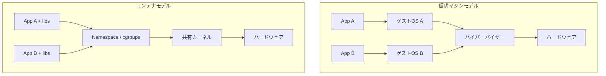
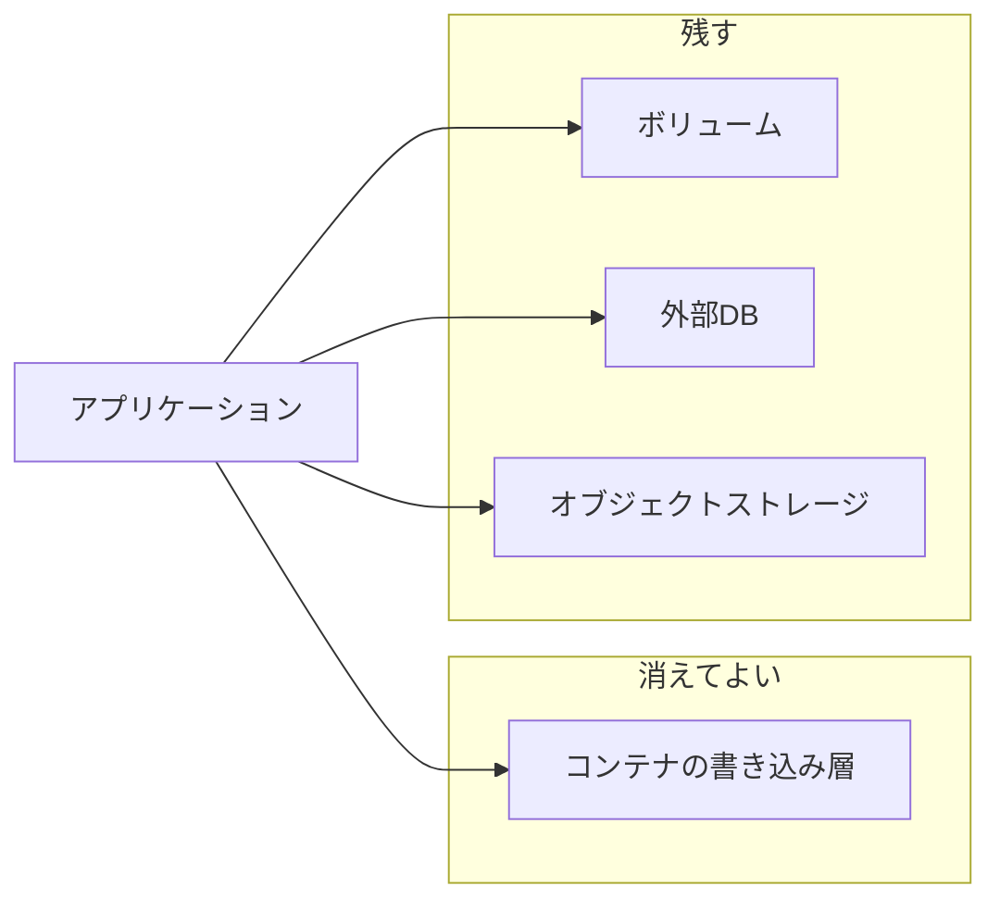
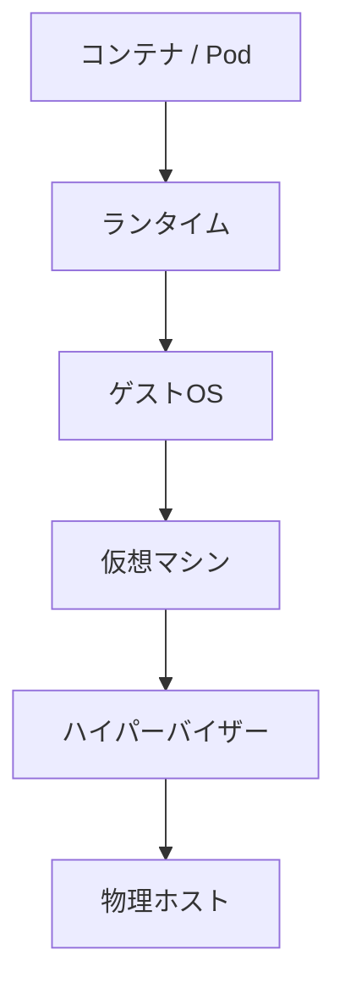

# 第11章 コンテナとの比較

## 学習目標

1. OSレベル仮想化としてのコンテナの仕組みを説明できる
2. Namespace、cgroups、イメージ、ランタイムの役割を説明できる
3. VMとコンテナを、分離性、起動速度、可搬性、永続ストレージで比較できる
4. Kubernetesの位置づけを概要レベルで説明できる
5. 「VM上でコンテナを動かす」構成の適用領域を判断できる

---

## 11.1 コンテナが必要になった背景

仮想マシンは、ゲストOSごと環境を分けられる。
分離は強いが、コストもある。

- ゲストOSのメモリとディスクをVMごとに抱える
- 起動に数十秒から数分かかることがある
- アプリを1つ載せ替えるだけでも、OSイメージの管理が残る

一方、開発と配備の現場では、「同じアプリを、開発者のPCでも、検証でも、本番でも、同じ形で動かしたい」という圧力が強まった。
パッケージの違い、ライブラリの違い、設定のずれが、リリース事故の主因だった。

この要求に応えたのが、コンテナを中心とするOSレベル仮想化の普及である。
ただし、コンテナは仮想マシンの上位互換ではない。
別の抽象である。

本書の通貫シナリオは、オンプレミスの仮想化基盤（VM）を主対象とする。
本章の目的は、コンテナを代替候補として売り込み、VMを捨てさせることではない。
混同を防ぎ、使い分けを判断できるようにすることである。

---

## 11.2 OSレベル仮想化とは何か

**OSレベル仮想化**とは、1つのカーネル上で、複数の隔離されたユーザー空間を動かす方式である。
各実行環境は独自のプロセス木、ネットワーク、ファイルシステム視点を持てる。
しかし、カーネルそのものは共有する。

これに対し、本書前半で扱ってきたサーバー仮想化は、ハイパーバイザーが仮想ハードウェアを渡し、ゲストごとにカーネル（ゲストOS）を持つ。

```text
仮想マシン型                         コンテナ型（OSレベル仮想化）
+--------+  +--------+               +--------+  +--------+
| App    |  | App    |               | App    |  | App    |
| Libs   |  | Libs   |               | Libs   |  | Libs   |
| Guest  |  | Guest  |               +--------+  +--------+
|  OS    |  |  OS    |               | 共有カーネル（ホストOS） |
+--------+  +--------+               +------------------------+
|   ハイパーバイザー  |               |     物理ハードウェア     |
+--------------------+               +------------------------+
|  物理ハードウェア    |
+--------------------+
```



この図の差が、以降のすべての比較の出発点になる。
カーネルを共有するか、ゲストごとに持つか。

---

## 11.3 コンテナ、コンテナイメージ、コンテナランタイム

### コンテナ

**コンテナ（container）**とは、ホストOSのカーネルを共有しつつ、隔離されたユーザー空間でアプリケーションとその依存関係を実行する単位である。
プロセスとしてはホスト上のプロセスに見えるが、見えるファイルツリーやネットワークはコンテナごとに制限される。

### コンテナイメージ

**コンテナイメージ（container image）**とは、コンテナを起動するための読み取り専用のファイルシステム層と設定のまとまりである。
アプリのバイナリ、ライブラリ、設定の既定値、起動コマンドなどが含まれる。

イメージは層（レイヤ）で構成されることが多い。
基底OSユーザーランド、ランタイム、アプリ、と積み上がる。
同じ基底層を共有すると、配布と保管が効率的になる。

イメージは「仮想マシンのテンプレート」に似て見える。
しかし、通常はカーネルを含まない。
ここが決定的な違いである。

### コンテナランタイム

**コンテナランタイム（container runtime）**とは、イメージからコンテナを生成し、Namespaceやcgroupsを設定し、プロセスを起動および停止する実行基盤である。

実務では次の層に分かれて語られることが多い。

| 層 | 役割 | 例（製品や実装） |
|----|------|------------------|
| 高水準ツール | ビルド、実行のUX、イメージ管理 | Docker CLI など |
| イメージ管理 / 上位ランタイム | イメージの取得、コンテナのライフサイクルAPI | containerd など |
| 低水準ランタイム | Linuxの隔離機構を使ってプロセスを起動 | runc など |

製品名と一般概念を混同しない。
「Docker」は歴史的に広く使われたツール群の固有名であり、コンテナという概念そのものではない。
概念はOSレベル仮想化、実体はNamespaceとcgroups、配布単位はイメージ、実行役はランタイムである。

---

## 11.4 Namespace

**Namespace（名前空間）**とは、Linuxカーネルが提供する隔離機構で、プロセスから見える資源の見え方を分ける。
コンテナの「別のマシンにいるように見える」感覚の多くは、Namespaceで作られる。

代表例：

| Namespace | 分けるもの |
|-----------|------------|
| PID | プロセスID空間。コンテナ内のPID 1は、ホスト全体のPID 1ではないことが多い |
| Mount | マウントされたファイルシステムの見え方 |
| UTS | ホスト名とドメイン名 |
| IPC | System V IPC や POSIX メッセージキューなど |
| Network | ネットワークスタック（IF、ルーティング、iptables相当の視点） |
| User | ユーザーIDとグループIDの写像 |

Namespaceは強力だが、カーネルを複製するわけではない。
同一ホスト上のコンテナは、同じカーネルのシステムコール面を共有する。

---

## 11.5 cgroups

**cgroups（control groups）**とは、プロセス集団のCPU、メモリ、I/O、PIDsなどの使用量を制限し、計量するLinuxカーネル機能である。
Namespaceが見え方を分け、cgroupsが取りすぎを抑える、という役割分担になる。

仮想化で言うと、次の対応イメージが近い。

| コンテナ側 | 仮想マシン側の近い概念 |
|------------|------------------------|
| cgroupsのCPU制限 | vCPU制限やCPU shares |
| cgroupsのメモリ制限 | メモリ制限や予約（ただし仕組みは異なる） |
| ネットワークNamespace | 別vNICや別ポートグループ（等価ではない） |

対応は近似である。
ハイパーバイザーのスケジューラと、Linuxのcgroupsは実装も障害モードも違う。
「コンテナにもvCPUがあるから同じ」と読まない。

cgroupsが無い、または緩いと、1コンテナのメモリリークがホスト全体を巻き込む。
通貫シナリオで開発用途にコンテナを載せるなら、制限値を明示する。

---

## 11.6 仮想マシンとの違い

比較表を先に置く。

| 観点 | 仮想マシン | コンテナ |
|------|------------|----------|
| 抽象の単位 | 仮想ハードウェア + ゲストOS | 隔離されたユーザー空間 + 共有カーネル |
| 分離性 | 強い（別カーネル） | 相対的に弱い（カーネル共有） |
| 起動速度 | 相対的に遅い | 相対的に速い（秒以下も多い） |
| 密度 | ホストあたり数十が現実的なことが多い | 同ホストでより高密度にしやすい |
| 可搬性 | 仮想ディスクと定義の移動 | イメージの配布と実行 |
| 永続ストレージ | 仮想ディスクが主 | ボリュームや外部ストレージを明示接続 |
| 得意な変更速度 | OSごと分けたい基盤、既存アプリ | アプリの頻繁な配備と水平スケール |
| 通貫シナリオでの位置 | 主基盤 | 併用候補。置換前提にしない |

### 起動速度

コンテナは、ゲストOSのブート手順を毎回踏まないため、起動が速い。
CIの並列実行、短命なバッチ、オートスケールの粒度を細かくしたいときに効く。

VMの起動が遅いのは欠陥というより、別OSを立ち上げている結果である。
テンプレートと高速プロビジョニングで短縮はできるが、コンテナと同じ土俵ではない。

### 分離性

VMは、ゲストカーネルまで別になる。
カーネル脆弱性の影響範囲をゲスト内に閉じやすい。

コンテナは、カーネル脆弱性がホスト全体の問題になりやすい。
特権コンテナ、ホストパスの安易なマウント、過度なCapability付与は、分離をさらに弱める。

「コンテナは軽いから本番の分離も十分」は、要件次第では誤りである。
規制、マルチテナント、強い障害隔離が要るなら、VMまたはVM＋コンテナの入れ子を検討する。

### 可搬性

コンテナの可搬性は、「イメージを別ホストで同じように起動しやすい」ことにある。
ただし、前提がある。

- 実行側のOSカーネルと機能が要件を満たすこと
- CPUアーキテクチャが合うこと（例：arm64とamd64）
- 設定、秘密情報、永続データをイメージに焼き込まないこと

VMの可搬性は、「仮想ハードウェア定義と仮想ディスクを別ホストへ移す」ことにある。
ライブマイグレーションはVM側の強みである（第8章）。
コンテナにもノード間再配置はあるが、仕組みも前提も異なる。

### 永続ストレージ

コンテナのファイルシステムは、コンテナ削除で消える前提で設計されることが多い。
永続データは、次のように外へ出す。

- ホスト上のボリュームマウント
- NFSなどの共有ストレージ
- クラウドのブロック／オブジェクトストレージ
- データベースなど別サービス

VMでもデータは仮想ディスクに置くが、「VMを消せばディスクも消える」設計にはしにくい業務が多い。
コンテナでは、永続を明示しないとデータが消える。
この差は障害例として繰り返し出る。



---

## 11.7 Kubernetesの概要

単一ホストでコンテナを動かすだけなら、ランタイムと簡単なスクリプトでも足りる。
ホストが増え、更新が頻繁になり、障害時の再配置が必要になると、オーケストレーションが要る。

**Kubernetes**は、コンテナ化されたワークロードの配置、復旧、スケール、サービス発見などを宣言的に管理するオーケストレータである。
製品というより、APIと制御ループの集合に近い。
各クラウドやオンプレ製品が、その実装と支援機能を提供する。

### 最低限の概念

| 概念 | 意味 |
|------|------|
| Pod | 1つ以上のコンテナをまとめた配備の最小単位 |
| Node | Podが載るワーカー（VMまたは物理） |
| Deployment | Podの望ましいレプリカ数と更新方式を宣言 |
| Service | Pod群への安定した到達点 |
| 制御プレーン | APIサーバーやスケジューラなど、クラスタを制御する面 |

ここで再び、管理プレーンとデータプレーンの発想が出る（第10章）。
Kubernetesの制御プレーンは高価値標的であり、ワーカー上のアプリ通信とは分けて守る。

### 本書での扱い方

Kubernetes自体の運用詳細（CNI、Ingress、RBACの深層、アップグレード手順）は本書の主対象外である。
仮想化技術者として必要なのは、次の判断ができることである。

1. Kubernetesはコンテナを並べる仕組みであり、ハイパーバイザーの代替ではない
2. 多くの場合、ノードはVMまたは物理サーバーである
3. 永続データ、ネットワーク、セキュリティの設計は消えない
4. 通貫シナリオの「まず仮想化基盤を安定させる」課題を、Kubernetes導入で迂回できない

---

## 11.8 VM上でコンテナを動かす構成

実務で最も多いのは、排他ではなく併用である。

```text
+--------------------------------------+
| Pod / コンテナ                        |
+--------------------------------------+
| コンテナランタイム                     |
+--------------------------------------+
| ゲストOS（Linux など）                 |
+--------------------------------------+
| 仮想マシン                             |
+--------------------------------------+
| ハイパーバイザー                       |
+--------------------------------------+
| 物理ホスト                             |
+--------------------------------------+
```



### この構成が選ばれる理由

1. VMの分離性と、既存のバックアップ、HA、ネットワーク分離を使える
2. コンテナの配備速度とイメージ可搬性をアプリ層で使える
3. テナントや環境（本番、検証、開発）をVM境界で切りやすい
4. 通貫シナリオのようなオンプレ仮想基盤の上に、段階的に載せられる

### 代償

- 仮想化オーバーヘッドの上に、コンテナ管理の複雑さが乗る
- 障害切り分けの層が増える（アプリ、コンテナ、ゲストOS、ハイパーバイザー、ストレージ）
- ノード（VM）のサイジングと、Podの資源要求の二重管理が必要になる

「VMが古いから全部コンテナに移す」でも、「コンテナは不要だから禁止する」でもない。
層の責任を分けて採用する。

---

## 11.9 適用領域の判断

通貫シナリオ（中小規模オンプレ、VM30台から45台、重要システム8台）を例に、判断軸を置く。

### VM向き

- ゲストOSごとの設定やエージェントが業務要件になっている
- WindowsとLinuxが混在し、管理モデルがOS寄り
- 強い分離、既存のバックアップ／DR、ライブマイグレーションが必要
- ベンダーサポートが「仮想マシン上」を前提にする
- 状態を持つ業務システムで、運用チームがVM運用に習熟している

### コンテナ向き

- ステートレスに近いアプリ、API、バッチ、フロントエンド
- 頻繁な配備とロールバック
- 同一アプリのレプリカを増やして捌く
- 開発から本番までの環境差分をイメージで潰したい

### 併用向き（現実解）

- 仮想化基盤上にコンテナノードVMを置く
- 重要データはVM上のDBや共有ストレージに残す
- アプリの一部だけコンテナ化する
- 通貫シナリオの第14章設計で、「基盤はVM、アプリ配備の一部はコンテナ」と明記する

### 不採用にしやすい判断

| 判断 | なぜ不採用になりやすいか |
|------|--------------------------|
| 全業務を短期間でコンテナへ全面移行 | 永続データ、ネットワーク、権限、監視の再設計が同時に必要 |
| 分離要件の強いマルチテナントを特権コンテナで同居 | カーネル共有のリスクを無視している |
| 仮想化基盤が不安定なままKubernetesを先行導入 | 障害層が増え、切り分け不能になる |
| コンテナがあればバックアップは不要 | 永続データの保護は残る（第9章） |

---

## 11.10 製品に依存しない共通概念と実装例

| 共通概念 | 実装例 |
|----------|--------|
| OSレベル仮想化 | Linux containers（Namespace + cgroups） |
| イメージ形式 | OCI Image など |
| ランタイム | runc、containerd、CRI-O など |
| 開発者UX | Docker など |
| オーケストレーション | Kubernetes、および各社のマネージドサービス |
| VM上のコンテナ基盤 | ゲストOSにランタイムを入れる、または各社のコンテナ基盤アプライアンス |

VMware、Hyper-V、KVM の上でも、コンテナはゲストLinux上で動作させられる。
ハイパーバイザー製品がコンテナを「理解する」必要は、最小構成では必ずしもない。
理解が必要になるのは、統合管理、セキュリティポリシー、ネットワーク仮想化を深く繋ぐときである。

---

## 11.11 設計上の判断ポイント

| 判断 | 採用案 | 不採用案 | 理由とトレードオフ |
|------|--------|----------|--------------------|
| 通貫シナリオの主基盤 | Type 1 仮想化（VM） | コンテナのみで重要システムを再構築 | 既存のHA、バックアップ、分離モデルを維持。密度は犠牲 |
| アプリの高速配備 | 必要なワークロードだけコンテナ化 | 全部を一度に移行 | 学習コストと障害面を局所化 |
| 分離が厳しい系 | VM境界を維持、またはVM単位でノード分離 | 強マルチテナントを単一カーネルへ密集 | 安全性を優先。密度は下がる |
| 永続データ | 明示的ボリュームまたは外部DB | コンテナ書き込み層に重要データを置く | 削除や再作成で消える事故を防ぐ |
| 運用スキル | VM運用を安定させてから段階導入 | 基盤未整備のまま大規模オーケストレーション | 切り分け可能性を残す |
| 開発環境 | コンテナで開発者環境を揃える | 各自が違うライブラリで本番へ直接配備 | 環境差分事故を減らす |

単一障害点の視点では、コンテナクラスタの制御プレーン、コンテナレジストリ、共有ストレージが新たな重要点になる。
VM基盤の管理サーバーと同様、バックアップと権限とネットワーク分離の対象に含める。

---

## 11.12 性能上の注意点

- コンテナは軽いが、無制限に詰めればホストは逼迫する。cgroupsの制限とノードサイジングが必要
- 「コンテナだからI/Oは速い」は保証されない。永続ボリュームの実体が遅いと遅いまま
- VM上のコンテナは、ネストに近い観測になることがある。絶対値比較は慎重に
- イメージの巨大化は配布時間と起動時間を伸ばす。層の設計を見直す
- 同一ノードでのnoisy neighborは、VM同居問題と同型である

通貫シナリオのホスト資源計算（第13章）に、コンテナノードVMを載せるなら、その分のCPUとメモリを別枠で見る。
「余りがあるから無限にPodを載せる」は、CPU Ready問題のコンテナ版を作る。

---

## 11.13 セキュリティ上の注意点

- カーネル共有は、VMより攻撃成功時の影響が広がりやすい
- 特権コンテナ、ホストPathマウント、Dockerソケット共有は実質的にホスト管理権限に近い
- イメージ供給元の信頼性、署名、脆弱性スキャンが必要（第10章のテンプレート衛生と同型）
- レジストリは高価値資産である。認証、権限、監査を入れる
- KubernetesのRBACとネットワークポリシーは、仮想化の最小権限と同じ思想で設計する
- 秘密情報をイメージに焼き込まない

VMとコンテナを併用するなら、管理プレーンが二重になる。
仮想化管理画面とコンテナ制御プレーンの両方を、第10章の水準で守る。

---

## 11.14 障害例と切り分け

### 障害例1：コンテナを再作成したらデータが消えた

**症状**：アプリ更新後、アップロードファイルやDBファイルが無い。

**確認順**：

1. データがコンテナ書き込み層に置かれていなかったか
2. 永続ボリュームのマウント設定
3. 新しいPod/コンテナが別ボリュームを見ていないか

**典型原因**：永続とエフェメラルの混同。

### 障害例2：「VMより速いはず」が遅い

**症状**：コンテナ化した業務が、旧VMより応答劣化。

**確認順**：

1. cgroups制限でCPU/メモリが削られていないか
2. 永続ストレージのレイテンシ
3. ノードVMのCPU Readyやスワップ（下位層）
4. ロギングやサイドカーの過剰なI/O

**典型原因**：下位の仮想化資源競合を見ずに、コンテナ層だけを疑ったこと。

### 障害例3：1コンテナがホストを巻き込んだ

**症状**：特定アプリのメモリ膨張後、同一ノードの他コンテナやホストが不安定。

**確認順**：

1. メモリ制限の有無
2. OOM Killerのログ
3. 特権設定やホスト資源への直接アクセス

**典型原因**：制限なし実行。分離性の過信。

### 障害例4：コンテナへ全面移行中に切り分け不能

**症状**：障害時に、アプリ、CNI、ノードVM、データストアのどこが悪いか分からない。

**確認順**：

1. 層別の正常系観測点を定義し直す
2. まずノードVMとデータストアの健全性を確認（仮想化の三層切り分け）
3. その後にPodとServiceを見る

**典型原因**：移行速度を優先し、観測設計を後回しにしたこと。

---

## 章末問題

### 問題1

コンテナを「軽い仮想マシン」と説明するのは、どこが不正確か。

### 問題2

Namespaceとcgroupsの役割の違いを述べよ。

### 問題3

起動速度、分離性、可搬性、永続ストレージの4点で、VMとコンテナを比較せよ。

### 問題4

Kubernetesはハイパーバイザーの代替か。理由とともに答えよ。

### 問題5

通貫シナリオで、重要系DBを直ちにコンテナへ全面移行しない判断理由を述べよ。

---

## 解答と解説

### 問題1

仮想マシンはゲストOS（カーネル含む）と仮想ハードウェアを持つ実行単位である。
コンテナはホストカーネルを共有するOSレベル仮想化であり、抽象が異なる。
軽いことはあっても、同種の縮小版ではない。

### 問題2

Namespaceは資源の見え方（隔離）を分ける。
cgroupsはCPUやメモリなどの使用量を制限し、計量する。

### 問題3

起動速度はコンテナが有利なことが多い。
分離性はVMが強い。
可搬性はどちらもあるが、イメージ配布と仮想ディスク移動で手段が違う。
永続ストレージは、コンテナでは明示的な外部化が必要で、書き込み層は消えてよい前提になりやすい。

### 問題4

代替ではない。
Kubernetesはコンテナの配置と運用を制御するオーケストレータであり、多くの場合ノードの下にVMまたは物理と、その下にハイパーバイザーやOSが残る。

### 問題5

強い分離、既存のバックアップとDR、サポート前提、状態管理の運用知見がVM側にあるためである。
全面移行は永続データと障害モデルの再設計を伴い、通貫シナリオの初期安定化を遅らせる。

---

## ハンズオン演習

### 演習1：対応表を作る

次の対応表を埋めよ。

| 概念 | VMでの対応 | コンテナでの対応 |
|------|------------|------------------|
| 実行単位 | | |
| カーネル | | |
| 資源制限 | | |
| 配布単位 | | |
| 永続データ | | |
| 集中管理 | | |

### 演習2：層図を描く

「物理ホスト → ハイパーバイザー → VM → ゲストOS → ランタイム → コンテナ」の図を、自分の学習環境に合わせて描き、実際に確認できた層に印を付けよ。

### 演習3：適用判断メモ

通貫シナリオの次の3系について、VMのみ、コンテナのみ、併用のどれを勧めるか書き、理由と不採用案を添えよ。

1. 認証基盤
2. 社内向けWebフロント（ステートレス寄り）
3. ファイルサーバー

### 演習4：永続化の失敗を再現（可能な環境）

コンテナ内にファイルを書いて削除し、再作成して、データが消えることを確認する。
次にボリュームへ書いて、残ることを確認する。
結果を短く記録する。

### 成果物

- VMとコンテナの対応表
- 層図
- 適用判断メモ（採用、不採用、トレードオフ）
- 永続化実験メモ

---

## 本章のまとめ

コンテナは、カーネルを共有するOSレベル仮想化であり、仮想マシンの軽量版ではない。
Namespaceが見え方を分け、cgroupsが使用量を抑え、イメージが配布単位、ランタイムが実行役になる。
起動速度と配備の速さではコンテナが勝ることが多く、分離性と既存の仮想化運用ではVMが勝ることが多い。
Kubernetesはコンテナのオーケストレーションであり、ハイパーバイザーの代替ではない。
通貫シナリオでは、仮想化基盤を主とし、必要なアプリだけをVM上のコンテナとして段階導入する判断が現実的である。
次章では、この仮想マシン抽象がクラウドのIaaSでどう現れるかを整理する。
