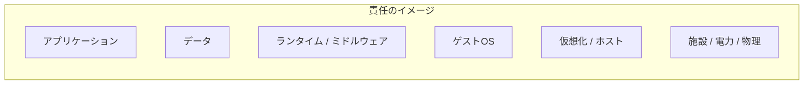
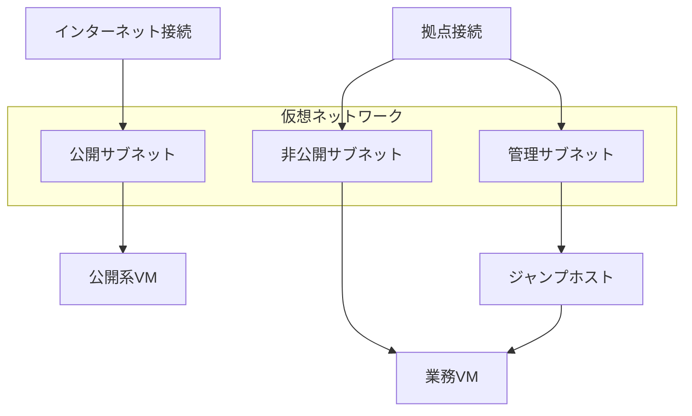
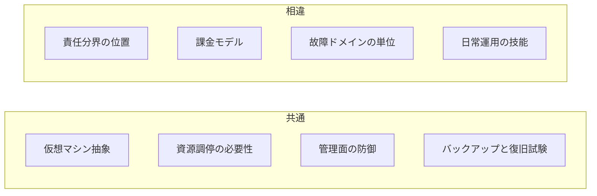

# 第12章 クラウドとの関係

## 学習目標

1. IaaS、PaaS、SaaSの責任範囲を説明できる
2. クラウドVM、インスタンスタイプ、仮想ネットワーク、仮想ストレージの対応関係を説明できる
3. 可用性ゾーンとオンプレミスのクラスタ概念を対応づけられる
4. 責任分界、オートスケール、従量課金の設計への影響を説明できる
5. オンプレミス仮想基盤との共通点と相違点を対比できる

---

## 12.1 クラウドを仮想化の延長として見る理由

通貫シナリオは、自前の物理ホストと共有ストレージで仮想化基盤を組む話である。
一方、多くの組織は同じ頃に、クラウド上の仮想マシンも使う。

見た目は似ている。

- 仮想マシンを作る
- vCPUとメモリを選ぶ
- 仮想ディスクを付ける
- 仮想ネットワークに接続する
- スナップショットやイメージから複製する

似ているからこそ、混同が起きる。
「クラウドに置けば可用性もセキュリティも自動で解決する」でも、「クラウドはオンプレの仮想化と全く別物」でもない。

本章の立場は次である。

1. IaaSの仮想マシンは、オンプレ仮想化と共通の抽象を多く共有する
2. 運用責任、課金、故障ドメインの切り方は大きく違う
3. 通貫シナリオの設計力は、クラウドIaaSの読み解きにも転用できる
4. PaaSやSaaSは、仮想マシン操作を隠す上位サービスであり、IaaSと混同しない

---

## 12.2 IaaS、PaaS、SaaS

クラウドサービスは、責任の境界で三つに大別して理解すると実務的である。

### IaaS

**IaaS（Infrastructure as a Service）**とは、仮想マシン、仮想ネットワーク、仮想ストレージなどのインフラ資源を、APIやコンソール経由で貸し出す形態である。
利用者はゲストOS以上を主に管理する。
ハイパーバイザーや物理ホストの運用は提供者側にある。

例の領域：クラウド上の仮想マシン、仮想VPC、ブロックストレージ。

### PaaS

**PaaS（Platform as a Service）**とは、アプリケーションを載せるための実行基盤（ランタイム、ミドルウェア、配備の仕組み）を提供する形態である。
利用者はアプリとデータに集中し、OSのパッチや多くの基盤運用を提供者へ寄せる。

例の領域：マネージドなアプリケーション実行環境、マネージドKubernetesの制御面、サーバレス実行環境の一部。

### SaaS

**SaaS（Software as a Service）**とは、完成した業務アプリケーションをサービスとして使う形態である。
利用者は機能とデータ、権限、利用設定を管理し、基盤の詳細には触れない。

例の領域：メール、グループウェア、CRMなど。

```text
管理するもの（概念）

SaaS : 利用者は設定とデータが中心
PaaS : 利用者はアプリとデータが中心。実行基盤は提供者
IaaS : 利用者はOS、ミドルウェア、アプリ、データが中心。仮想化基盤は提供者
オンプレ仮想化 : 利用者（自組織）が物理からアプリまで広く持つ
```



正確な境界は提供者ごとに文書（Shared Responsibility）で定義される。
暗記用の一枚絵より、契約とドキュメントの責任表を読むことが先である。

通貫シナリオの自前仮想化は、IaaSより下まで自組織が持つ。
物理ホストの故障、電源、ラック、ハイパーバイザーパッチまで自前である。
その代わり、配置とデータ所在を自組織の方針で固定しやすい。

---

## 12.3 クラウドの仮想マシン

**クラウドの仮想マシン**とは、クラウド提供者が用意した仮想化基盤上で動く、利用者向けのVMである。
利用者から見ると、ゲストOSが入った計算機インスタンスとして見える。

オンプレのVMとの共通点：

- vCPU、メモリ、ディスク、NICという資源モデル
- イメージやテンプレートからの起動
- スナップショットやイメージ化（製品用語は異なる）
- セキュリティグループやファイアウォール相当による通信制御

相違点の入口：

- 物理ホストを利用者が選べないことが多い（専有オプションは例外）
- ライブマイグレーションの操作権が利用者に無いことが多い
- 故障時の再配置は、提供者の制御と利用者の冗長設計の組み合わせになる
- 課金が時間や秒、付随資源ごとに発生する

通貫シナリオで学んだ「VMは物理を増やさない」「共有点の障害は広い」は、クラウドでも有効である。
見えにくいのは、共有点の多くが提供者側に隠れていることである。

---

## 12.4 インスタンスタイプ

**インスタンスタイプ**とは、クラウドVMのCPU、メモリ、ネットワーク、格納オプションなどを組み合わせた商品仕様である。
オンプレで言う「VMにvCPU 4、メモリ16GBを付ける」を、提供者側のメニューから選ぶ形に近い。

典型的な分類：

| 系統 | 向く用途 | オンプレでの感覚 |
|------|----------|------------------|
| 汎用 | Web、業務AP | 標準的なVM |
| CPU寄り | 計算、バッチ | vCPU多め、メモリ控えめ |
| メモリ寄り | DB、キャッシュ | メモリ多め |
| ストレージ／I/O寄り | 高IOPSが必要 | 高速データストア前提のVM |
| GPUなど特殊 | 機械学習、特定HPC | パススルー相当の専用資源 |

### 設計で見落とす点

1. カタログのvCPUは、物理コアそのものではない（第3章の論理CPU議論と同型）
2. 「バースト可能」なタイプは、平均とピークの考え方が違う
3. ネットワーク帯域やディスクIOPSに、タイプ由来の上限があることが多い
4. 予約、Savings Plan、専有ホストなど、課金と配置のオプションが性能より先に制約になることがある

通貫シナリオの重要VM（vCPU 4、メモリ16GB）をクラウドへ移すなら、まず同じ数字のタイプを探すのではない。
実測のCPU、メモリ、IOPS、ネットワークを取り、タイプとディスク種類を選ぶ。
オンプレのサイジング（第13章）と同じく、理論値と実測値を分ける。

---

## 12.5 仮想ネットワーク

クラウドの仮想ネットワークは、オンプレのVLANや仮想スイッチに対応づけて読むと理解が速い。
ただし、実装は提供者のオーバーレイであることが多い。

共通概念と読み替え：

| オンプレ仮想化（本書） | クラウドIaaSでよくある概念 |
|------------------------|----------------------------|
| 業務VLAN / ポートグループ | VPC（またはVNet）内のサブネット |
| ルーティング | ルートテーブル |
| ファイアウォール | セキュリティグループ、NSG、ファイアウォール規則 |
| 管理網分離 | 管理用サブネット、踏み台、Private Link相当 |
| アップリンク / エッジ | インターネットゲートウェイ、VPN、専用線接続 |



第6章と第10章の原則は、そのまま使える。

- 管理面と業務面を分ける
- 不要な到達を閉じる
- 「同じVPC内だから安全」としない

クラウドでは、初期設定で広い疎通が許されている場合がある。
便利さと事故が隣り合う。

---

## 12.6 仮想ストレージ

クラウドの仮想ストレージも、オンプレのデータストアと仮想ディスクの分離に対応づけられる。

| 種類 | 役割 | オンプレでの近いもの |
|------|------|----------------------|
| ブロックストレージ | VMに付ける仮想ディスク | 仮想ディスク + データストア上の領域 |
| ファイルストレージ | 共有ファイル | NFSなどの共有 |
| オブジェクトストレージ | バックアップ、成果物、静的コンテンツ | バックアップ保管やリポジトリに近い用途 |

IOPS、レイテンシ、スループット、スナップショット、暗号化は、オンプレ第5章と同じ論点である。
違うのは、性能階級が商品として選ばれること、容量とIOPSが課金に直結することである。

通貫シナリオの共有ストレージ障害が多VMを巻き込む構図は、クラウドでも「同一の障害ドメインにディスクやインスタンスを寄せすぎる」と再現する。
可用性ゾーンをまたがない置き方をしていないか、を設計チェックに入れる。

---

## 12.7 可用性ゾーン

**可用性ゾーン（AZ: Availability Zone）**とは、同一リージョン内で、電源やネットワークなどの障害ドメインを分けた区画である。
提供者の定義であり、建物が必ず別とは限らないが、「単一障害で同時に落ちにくい単位」として設計に使う。

オンプレとの対応：

| クラウド | オンプレ通貫シナリオでの近い発想 |
|----------|----------------------------------|
| 複数AZにVMを分散 | 複数ホスト／筐体に分散 |
| リージョン | データセンターや広域DRサイト |
| AZ障害 | ラックや電源系統の広範囲障害に近い想像 |
| リージョン障害 | サイト障害。第9章のDR |

```text
リージョン
  +-- AZ-a : Host相当の障害ドメインA
  +-- AZ-b : Host相当の障害ドメインB
  +-- AZ-c : Host相当の障害ドメインC
```

注意点：

1. 単一AZに全重要系を置くと、オンプレでホスト1台に全重要VMを寄せるのと同型のリスクになる
2. AZをまたぐと、ネットワーク遅延とデータ複製の設計が必要になる
3. 「マネージドサービスがマルチAZ対応」と「自前VMがマルチAZ」は別である

通貫シナリオのN+1ホスト設計は、「故障しても残る容量」を持つ発想である。
クラウドでは、AZ分散と、停止したVMを別AZで起動する手順、ロードバランサ、データ複製がそれに相当する。
自動で全部やってくれるわけではない。

---

## 12.8 オンプレミスとの責任分界

**責任分界（shared responsibility）**とは、提供者と利用者が、それぞれ何を守るかを分けた境界である。

IaaSにおける典型：

| 領域 | 提供者 | 利用者 |
|------|--------|--------|
| 物理、施設、ホストハードウェア | 主に担当 | 原則触れない |
| ハイパーバイザー | 主に担当 | 原則触れない |
| 仮想ネットワークの基盤 | 基盤を提供 | サブネット、経路、規則を設計 |
| ゲストOS | 提供イメージは用意 | パッチ、hardening、アカウント |
| アプリケーション | 関与しないことが多い | 設計、脆弱性、可用性 |
| データ | 保管インフラを提供 | 分類、暗号化鍵の扱い、バックアップ方針 |
| IAM | 機能を提供 | 最小権限、MFA、監査 |

オンプレ仮想化では、上表の左側の多くも自組織である。
だから通貫シナリオでは、ホストパッチ、管理網、共有ストレージ、物理保守が設計必須になる。

クラウドIaaSへ移すと、物理とハイパーバイザーの運用負担は減る。
減らないのは、次である。

- ゲストOSとアプリのセキュリティ
- ネットワーク規則の設計ミス
- 鍵と権限の管理
- バックアップとリストア試験
- コスト爆発の監視

「クラウドに移したので第10章は不要」にはならない。
管理プレーンが、クラウドのIAMとAPIに移るだけである。

---

## 12.9 オートスケーリング

**オートスケーリング**とは、負荷や時間などの指標に応じて、インスタンス数や資源量を自動で増減する仕組みである。

オンプレ仮想化でも、スクリプトでVMを増やすことはできる。
しかし、物理容量の壁が近い。
クラウドIaaSでは、提供者の資源プールを前提に、水平方向の増減が商品として用意されやすい。

### 設計への影響

1. アプリがステートレス寄りでないと、増減が難しい
2. 起動時間、初期化、ウォームアップを見ないと、スケールが追いつかない
3. スケールアウトは費用増加と直結する
4. スケールインで、ローカルディスク上のデータを消さない設計が必要（第11章の永続化と同型）

通貫シナリオの重要系（認証、ファイル、DB）は、いきなりオートスケール向きではないことが多い。
向くのは、負荷変動の大きいWebやバッチである。
コンテナ（第11章）と組み合わせると、さらに細かい粒度で増減しやすい。

オートスケールは可用性機能ではなく、容量調整機能である。
AZ障害への耐性は、別途設計する。

---

## 12.10 従量課金

**従量課金**とは、使った時間、容量、リクエスト、転送量などに応じて料金が発生する方式である。

オンプレの感覚との差：

| オンプレ仮想化 | クラウドIaaS |
|----------------|--------------|
| 初期にホストとストレージを調達 | 初期を小さく始めやすい |
| 減価償却と保守契約が中心 | 毎月の変動費が中心 |
| 止めても電力と保守は残る | 止め方次第で課金が止まる／残る |
| 空き容量は「持っている」 | 空きを持つこと自体にも設計と費用がある |

### 設計で効く勘所

- 検証VMを消し忘れると、静かに課金が続く
- スナップショット、バックアップ、公開通信量、NAT、ログ保管が本体VMより高いことがある
- 高性能ディスクを全VMへ一律適用すると、費用が跳ねる
- 予約枠は安いが、使い切れないと別の無駄になる

通貫シナリオをクラウドで再現するなら、費用も非機能要件に入れる。
「ホスト3台分相当」を常時フルで持つのか、重要系だけ常時で開発系は停止するのかで、設計が変わる。
オンプレでは電気代まで意識しにくかった停止が、クラウドでは設計手段になる。

---

## 12.11 オンプレミス仮想基盤との比較

比較の総表を置く。

| 観点 | オンプレ仮想化（通貫シナリオ） | クラウドIaaS |
|------|-------------------------------|--------------|
| 抽象 | VM、仮想ネット、仮想ディスク | ほぼ同型の抽象 |
| 物理とハイパーバイザー | 自組織が運用 | 提供者が運用 |
| サイジング | ホスト購入とN+1が先に来る | インスタンスとサービス上限、費用が先に来る |
| 可用性 | クラスタ、HA、共有ストレージ、DR | AZ、リージョン、マネージド冗長、自前の多重化 |
| ネットワーク | VLAN、物理NIC、自前FW | VPC、SG、提供者のエッジ |
| セキュリティ責任 | 広範囲が自前 | 責任分界に沿って分担 |
| 変更速度 | 調達リードタイムが長い | APIで速い。その分誤作成も速い |
| 課金 | 固定資産寄り | 従量寄り |
| データ所在 | 自サイトに固定しやすい | リージョン選択と法要件の確認が必要 |
| ライブマイグレーション操作 | 設計次第で利用者が実施 | 利用者操作としては限定的なことが多い |

### 共通点（強調）

1. 仮想マシンという実行単位
2. CPU、メモリ、ストレージ、ネットワークの資源競争
3. 管理プレーンを守る必要性
4. バックアップとリストア試験の必要性
5. 理論値と実測値を混ぜないサイジング

### 相違点（強調）

1. 故障ドメインの見え方（自前ホストか、AZか）
2. 責任分界の位置
3. 費用モデル
4. 物理資源の調達と上限の扱い
5. 運用スキルの配分（ラック作業か、IAMとAPIか）



---

## 12.12 通貫シナリオとの関係

通貫シナリオをクラウドへ「そのまま引っ越し」できるか。
結論は、抽象は移植でき、運用前提は移植しきれない、である。

### 移植しやすいもの

- VM台数と役割の整理（重要8、一般16、開発6）
- ネットワーク分離の思想（管理、業務、ストレージ相当）
- 最小権限、MFA、監査
- RPO/RTOの目標設定
- 監視指標の考え方（CPU逼迫、ディスク遅延、到達性）

### 作り直しが必要なもの

- ホスト3台のN+1計算 → AZとインスタンス冗長、または上位マネージドへ
- 共有SAN前提 → クラウドのディスクとレプリケーション方式
- ハイパーバイザーパッチ手順 → ゲストとエージェント中心、提供者側は通知に追従
- ライセンスと保守の見積 → 従量と予約の見積

### 設計判断の例

| 判断 | 採用案 | 不採用案 | トレードオフ |
|------|--------|----------|--------------|
| 重要系の置き場 | 要件（データ主権、遅延、既存投資）でオンプレ継続またはIaaS | 理由なく全廃／全移管 | 移行は責任と費用の再設計を伴う |
| 開発と検証 | クラウドまたはオンプレの停止可能な領域へ | 本番と同じ常時フル資源 | 費用と隔離を最適化 |
| ハイブリッド | 管理と認証の方針を先に統一 | 場当たり接続 | 運用が二重化しにくい |
| DR | 第9章の目標に沿い、遠隔サイトまたは他リージョン | バックアップ未試験のまま「クラウドにあるから大丈夫」 | 復旧不能リスク |

通貫シナリオの第14章では、オンプレ案を主に固める。
そのときクラウドは、比較対象、バースト先、DR先、開発環境として選択肢に残すとよい。
最初から雲の上だけを正解にしない。

---

## 12.13 製品に依存しない共通概念と実装例

| 共通概念 | 実装例（提供者により名称が異なる） |
|----------|-----------------------------------|
| クラウドVM | EC2インスタンス、Azure VM、Compute Engine など |
| インスタンスタイプ | インスタンスファミリー／サイズ |
| 仮想ネットワーク | VPC、VNet など |
| 仮想ディスク | EBS、Managed Disks、永続ディスク など |
| オブジェクトストレージ | S3、Blob、Cloud Storage など |
| 可用性ゾーン | AZ |
| IAM | 各社のIAM / Entra ID 連携など |
| オートスケール | Auto Scaling、VMSS、MIG など |

固有名は変わる。
読むべきなのは、責任分界ドキュメント、サービス上限、障害ドメインの定義、料金の計量単位である。

---

## 12.14 設計上の判断ポイント

| 判断 | 採用案 | 不採用案 | 理由とトレードオフ |
|------|--------|----------|--------------------|
| サービスモデル | 要件に応じIaaS/PaaS/SaaSを分ける | すべてをIaaS VMで自前再現 | 運用負荷と制御のバランスを取る |
| ネットワーク | サブネット分離＋最小到達 | 単一サブネット全開放 | 第6章、第10章と同じ事故を防ぐ |
| 可用性 | 重要系はAZ分散または同等 | 単一AZに全集約 | 費用と複雑さは増えるが広範囲停止を避ける |
| サイジング | 実測ベースでタイプとディスクを選ぶ | カタログ最大を安全側で固定 | 費用と性能の両方を守る |
| 課金管理 | タグ、予算アラート、削除手順 | 作りっぱなし | 検証残骸による費用事故を防ぐ |
| オンプレとの関係 | 共通運用原則を共有し、差分を文書化 | 別世界として二重標準化 | 障害対応の型を再利用する |

単一障害点は、クラウドでも消えない。
単一AZ、単一のIAM管理者、単一リージョンのバックアップ、単一のDNS設定が残る。
見え方が変わっただけである。

---

## 12.15 性能上の注意点

- インスタンスタイプのネットワーク上限とディスク上限を先に読む
- 同一AZ内とAZ間で遅延が違う。DBとアプリを無計画に跨がない
- バーストクレジット切れで急に遅くなるタイプがある
- オブジェクトストレージは高いスループットでも、レイテンシ特性がブロックデバイスと違う
- オンプレのベンチ数値を、そのままクラウドのSLOにしない

ネスト仮想化や検証用の小規模インスタンスで測った値を、本番サイジングに直写しない点は、本書ハンズオン環境と同じ注意である。

---

## 12.16 セキュリティ上の注意点

- クラウドAPIキーとIAMは、オンプレの管理プレーンと同等以上の保護対象である
- 公開サブネットに管理ポートを晒さない
- ストレージの公開設定ミスは、短時間で大規模漏洩になりうる
- 責任分界を理由に、ゲストOSのパッチを省略しない
- 暗号化の鍵管理（提供者管理か顧客管理か）を決める
- 監査ログ（誰がインスタンスを消したか）を有効化し、保管する

第10章の原則は、製品がクラウドでも変わらない。
変わるのは、守るべき入口がホストの管理IPから、クラウドAPIとIAMへ移ることである。

---

## 12.17 障害例と切り分け

### 障害例1：特定AZだけ業務が落ちた

**症状**：一部のVMとマネージド部品だけ到達不能。他AZは生きている。

**確認順**：

1. 提供者の障害情報と自身の配置（どのAZに何があるか）
2. AZをまたぐ依存（単一AZのDBなど）
3. 負荷分散のヘルスチェック

**典型原因**：実質単一AZ依存。オンプレで特定ホストに重要系を寄せた状態と同型。

### 障害例2：昨日まで動いた検証環境の請求が跳ねた

**症状**：大型インスタンス、高IOPSディスク、データ転送、ログ保管が残存。

**確認順**：

1. タグと請求明細の内訳
2. 停止と削除の違い（停止でも残る課金）
3. スナップショットと公開IP、NATの残留

**典型原因**：従量課金の計量単位を設計に入れていなかったこと。

### 障害例3：オンプレと同じサイズなのに遅い

**症状**：vCPUとメモリは同等に見えるが、アプリが遅い。

**確認順**：

1. ディスク種類とIOPS上限
2. ネットワーク上限とAZ跨ぎ
3. バースト型のクレジット
4. ゲスト内の設定差（準仮想化ドライバ相当はクラウドでも重要）

**典型原因**：CPUメモリだけ合わせ、I/Oとネットワーク階級を無視したこと。

### 障害例4：権限のある退職者アカウントで資源が消された

**症状**：本番VMやディスクが削除された。

**確認順**：

1. 監査ログで実行者を特定
2. IAMの最小権限とMFA
3. 削除保護、バックアップからの復旧

**典型原因**：管理プレーン防御の失敗。場所がクラウドでも本質は第10章と同じ。

---

## 章末問題

### 問題1

IaaS、PaaS、SaaSの違いを、利用者が主に管理する範囲で説明せよ。

### 問題2

クラウドのインスタンスタイプを、オンプレのどの設計判断に対応づけられるか述べよ。

### 問題3

可用性ゾーンを、通貫シナリオのどの考えに近いか説明せよ。単一AZ集約のリスクも述べよ。

### 問題4

オンプレ仮想化とクラウドIaaSの共通点を3つ、相違点を3つ挙げよ。

### 問題5

オートスケーリングがあれば、バックアップとAZ分散は不要か。理由とともに答えよ。

---

## 解答と解説

### 問題1

IaaSでは利用者は主にゲストOS以上（と仮想ネット／ストレージの設定）を管理する。
PaaSではアプリとデータが中心で、実行基盤の多くは提供者側である。
SaaSでは完成アプリを使い、利用者は設定とデータ、権限が中心である。

### 問題2

VMへのCPU、メモリ、ネットワーク、ディスク性能の割り当て、すなわちサイジングと資源階級の選択に対応する。
ホスト購入の細部ではなく、ゲストに見せる資源メニューの選択に近い。

### 問題3

複数ホストや障害ドメインへ分散し、一方の障害でも残す発想に近い。
単一AZ集約は、重要系を単一故障ドメインへ寄せることになり、広範囲停止のリスクが残る。

### 問題4

共通点の例：VM抽象、資源競争、管理面防御、バックアップ試験、実測に基づくサイジング。
相違点の例：責任分界、課金、故障ドメインの単位、物理運用の有無、変更速度と誤作成速度。

### 問題5

不要にはならない。
オートスケールは負荷に応く容量調整であり、データ保護やAZ障害への耐性を自動では保証しない。
永続データのバックアップと、故障ドメイン分散は別要件である。

---

## ハンズオン演習

### 演習1：責任分界表を作る

通貫シナリオの構成要素（物理ホスト、ハイパーバイザー、管理サーバー、ゲストOS、業務アプリ、バックアップ、IAM相当）について、オンプレとIaaSのそれぞれで「誰が主担当か」を表にせよ。

### 演習2：用語対応表

次の対応表を埋めよ。

| オンプレ概念 | クラウドIaaS概念 | 完全一致しない点 |
|--------------|------------------|------------------|
| ホストクラスタ | | |
| データストア / 仮想ディスク | | |
| 管理VLAN | | |
| テンプレート | | |
| HA | | |

### 演習3：費用リスクメモ

開発VMを30日放置した場合に増えうる費用項目を、仮想マシン本体以外も含めて5つ挙げよ。
対策（停止、削除、アラート）を添える。

### 演習4：配置判断

重要系8台をクラウドへ置く仮定で、単一AZ案と多AZ案の採用理由、不採用理由、トレードオフを設計判断メモに書け。

### 成果物

- 責任分界表
- 用語対応表
- 費用リスクメモ
- AZ配置の設計判断メモ

---

## 本章のまとめ

クラウドのIaaSは、オンプレ仮想化と共通のVM抽象を持つ。
違うのは、物理とハイパーバイザーの責任が提供者へ移り、故障ドメインがAZやリージョンとして商品化され、費用が従量になる点である。
PaaSとSaaSは、その上で操作範囲をさらに縮める形態であり、IaaSと混同しない。
オートスケールは容量調整であり、バックアップやAZ分散の代替ではない。
通貫シナリオで身につけた分離、サイジング、管理面防御、復旧試験の原則は、クラウドでも同じように効く。
次章では、その原則を数値に落とし、サイジングとキャパシティ管理へ進む。
