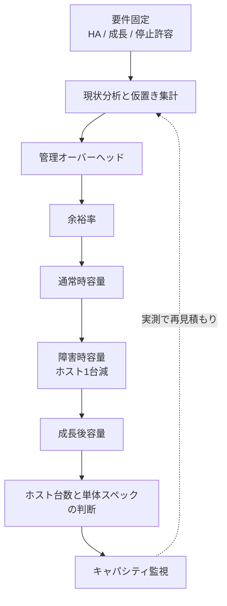
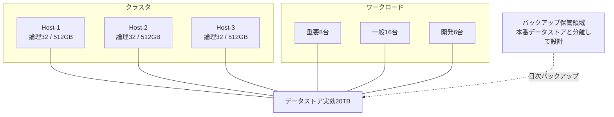
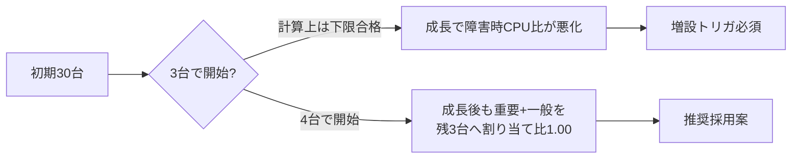
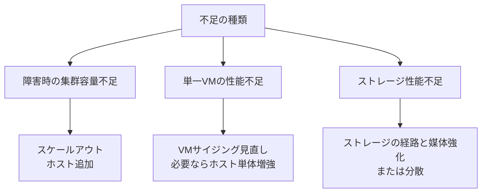

# 第13章 サイジングとキャパシティ管理

## 学習目標

1. 現状分析から CPU、メモリ、ストレージ、ネットワークの必要量を見積もれる
2. オーバーコミット率、成長率、HA予備、管理オーバーヘッドを計算に含められる
3. ピークと平均を混同しないサイジングができる
4. 前提条件、計算式、余裕率、障害時容量を明示した計算例を示せる
5. スケールアップとスケールアウトの選択基準を説明できる

---

## 13.1 サイジングが設計の出発点になる理由

通貫シナリオは、小規模企業の仮想化基盤を次の仮置きで進めている。

| 区分 | 台数 | vCPU | メモリ | ディスク |
|------|------|------|--------|----------|
| 重要システム | 8 | 4 | 16 GB | 200 GB |
| 一般業務 | 16 | 2 | 8 GB | 100 GB |
| 開発と検証 | 6 | 2 | 4 GB | 80 GB |

物理ホストは、各台が 2ソケット × 16コア（論理32スレッド）、メモリ 512 GB である。
データストアは実効 20 TB 起算である。
可用性は、物理ホスト1台障害時も重要システムを継続し、クラスタは N+1 を満たす。
成長は、2年で VM 台数が約1.5倍（45台想定）である。

第3章と第4章では、これらの数値を「出発点」として扱い、確定を本章に委ねた。
第8章では、N+1 と Admission Control の論理を先に固定し、台数の断定を本章に委ねた。

サイジングを後回しにすると、次が起きる。

- 平常時は動くが、ホスト1台障害で重要VMが起動できない
- 割り当て合計だけ見て「余裕あり」と決め、ピークで CPU Ready やメモリスワップが常態化する
- データストアの理論空きは十分でも、バックアップ領域や一時スナップショットで逼迫する
- 2年後の増設が、ホスト追加なのか、1台の大型化なのか判断できない

**サイジング**とは、要件と前提から、必要資源量と余裕と障害時容量を計算し、採用構成の根拠を文書化することである。
**キャパシティ管理**とは、稼働後に実測値を集め、成長と偏りを見て、増強や再配置のタイミングを決める継続活動である。

カタログ値や割り当て合計は理論値である。
監視で得る使用率、Ready、レイテンシ、空き容量は実測値である。
両者を同じセルに入れない。

---

## 13.2 サイジングの動作原理

サイジングは、次の順序で進めると破綻しにくい。

1. 要件を固定する（可用性、成長、停止許容、バックアップ）
2. 現状または仮置きの VM 資源を集計する
3. 管理オーバーヘッドを控除する
4. 余裕率を明示して加算する
5. ホスト1台障害後の残容量で再計算する
6. 成長後の再計算を行う
7. 監視指標としきい値を決める
8. スケールアップとスケールアウトの候補を残す

```text
要件と仮置き
    |
    v
資源集計（CPU / メモリ / 容量 / IOPS / 帯域）
    |
    v
管理オーバーヘッド控除
    |
    v
余裕率の適用
    |
    v
通常時判定 ----> 不足なら台数または単体スペックを増やす
    |
    v
障害時（N+1）判定
    |
    v
成長後判定
    |
    v
監視と見直し周期へ引き継ぐ
```



計算例では、次の四つを必ず書く。

1. **前提条件**：何を固定し、何を仮定したか
2. **計算式**：どの量をどの量で割る（または掛ける）か
3. **余裕率**：何パーセントを、何のために載せたか
4. **障害時容量**：ホスト1台障害後に残る物理資源と、そのときの要求

「だいたい足りる」は設計判断ではない。
数字と仮定をセットで残す。

---

## 13.3 通貫シナリオの資源構成図

```text
+------------------------ クラスタ（N+1） ------------------------+
|  Host-1              Host-2              Host-3（予備を含む）   |
|  論理32 / 512GB      論理32 / 512GB      論理32 / 512GB         |
|      \                 |                 /                      |
|       +----------------+----------------+                       |
|       |     共有データストア（実効20TB起算）      |             |
+----------------------------------------------------------------+
| 重要VM×8   一般業務×16   開発検証×6   管理系VM（別途計上）      |
+----------------------------------------------------------------+
| 監視 / バックアップ保管（データストア外または別領域として扱う）  |
+----------------------------------------------------------------+
```



ホスト3台は「最低候補」であり、結論ではない。
以降の節で、通常時、障害時、成長後を同じ前提で突き合わせる。

---

## 13.4 現状分析

**現状分析**とは、今ある（または仮置きの）負荷を、層別に数値化することである。
新規構築でも、物理移行でも、手順は同じである。

### 集めるもの

| 層 | 理論値として集めるもの | 実測値として集めるもの |
|----|------------------------|------------------------|
| CPU | 割り当て vCPU 合計 | ピーク使用、CPU Ready / steal 相当 |
| メモリ | 構成メモリ合計 | アクティブメモリ、バルーン、スワップ |
| ストレージ容量 | 仮想ディスクサイズ合計 | 実使用、シンの伸長、スナップショット残 |
| ストレージ性能 | 想定 IOPS | 実測 IOPS、レイテンシ、キュー |
| ネットワーク | NIC 公称帯域 | ピーク帯域、再送、ドロップ |
| 可用性 | HA 対象台数、配置ルール | 過去のフェイルオーバー所要 |

通貫シナリオの初期は、実測がない前提で仮置きから入る。
その場合でも、仮置きを「確定スペック」と呼ばない。
仮置きは計算の入力であり、稼働後の実測で置き換える対象である。

### 通貫シナリオの割り当て集計（初期）

前提条件：

- VM 区分と台数、1台あたり割当は通貫シナリオの表どおり
- 管理サーバー、監視、バックアップサーバーの資源は、後節の管理オーバーヘッドで別計上する
- ここでは業務VM 30台だけを集計する

計算式：

- 総 vCPU = Σ（台数 × 1台あたり vCPU）
- 総メモリ = Σ（台数 × 1台あたりメモリ）
- 総ディスク = Σ（台数 × 1台あたりディスク）

計算：

| 区分 | 台数 | vCPU小計 | メモリ小計 | ディスク小計 |
|------|------|----------|------------|--------------|
| 重要 | 8 | 8 × 4 = 32 | 8 × 16 = 128 GB | 8 × 200 = 1600 GB |
| 一般 | 16 | 16 × 2 = 32 | 16 × 8 = 128 GB | 16 × 100 = 1600 GB |
| 開発 | 6 | 6 × 2 = 12 | 6 × 4 = 24 GB | 6 × 80 = 480 GB |
| 合計 | 30 | 76 | 280 GB | 3680 GB（約 3.59 TiB 相当を、設計では 3.68 TB と表記） |

ディスク合計は 1600 + 1600 + 480 = 3680 GB である。
本稿では十進の概算として 3.68 TB と書く。
ストレージ製品の TiB 表示とは単位系が異なる場合があるので、発注時は実効容量の定義を確認する。

現状分析の成果物は、上表に加えて次を残す。

- ピーク時間帯（例：平日 9時から12時、および月末処理）
- 停止許容（開発は停止可、重要は HA 対象）
- 未計上項目のリスト（管理VM、テンプレート、ISO、ログ保管）

---

## 13.5 CPUサイジング

### 共通概念

CPUサイジングでは、次を混同しない。

- **割り当て vCPU**：設定上の仮想CPU数の合計（理論値）
- **物理論理CPU**：ホストのスレッド数合計（カタログ上の上限に近い理論値）
- **実使用CPU**：実測の使用率や実行時間
- **CPU Ready**：実行したいのに物理CPUを得られない待ち（実測）

オーバーコミット率の定義を、次に固定する。

**CPUオーバーコミット率** = 総割り当て vCPU ÷ 対象範囲の物理論理CPU数

1.0 未満は割り当て合計が物理以下、1.0 超は割り当て超過である。
成否は Ready の実測で最終判断する。

### 計算例1：総 vCPU と通常時オーバーコミット率

前提条件：

- 総 vCPU = 76（前節）
- ホスト台数候補 = 3
- 1ホストあたり論理CPU = 32
- 管理系の常駐CPU消費は、後で余裕率側に吸収する（本計算では vCPU 集計に管理VMを含めない）
- SMT（Hyper-Threading 等）有効前提の「論理32」を使う。無効なら再計算する

計算式：

- クラスタ論理CPU（通常時） = ホスト台数 × 32
- CPUオーバーコミット率（通常時） = 総 vCPU ÷ クラスタ論理CPU

計算：

- クラスタ論理CPU（3台） = 3 × 32 = 96
- オーバーコミット率（通常時） = 76 ÷ 96 ≈ 0.79

余裕率：

- CPU の割り当て比に対する余裕率を、初期方針として「通常時 0.85 以下を目標」とする
- 0.79 は目標 0.85 を下回るので、割り当て比だけ見れば通常時は成立候補である
- この 0.85 は理論上の運用上限であり、Ready が低ければ 0.85 超も一時的にあり得る。逆に Ready が高ければ 0.79 でも不合格である

障害時容量：

- ホスト1台障害後の論理CPU = 2 × 32 = 64
- オーバーコミット率（障害時、全VM継続前提） = 76 ÷ 64 ≈ 1.19

解釈：

- 通常時 0.79 は、第3章の「一見余裕」と同じ結果である
- 障害時 1.19 は、全VMを残2ホストへ寄せる前提では割り当て超過になる
- 重要8台だけなら 32 ÷ 64 = 0.50
- 重要 + 一般なら 64 ÷ 64 = 1.00
- 通貫シナリオは「重要システム継続」が必須であり、一般と開発の障害時扱いを設計書に書く必要がある

### 計算例1の補助：重要継続を優先した障害時

前提条件：

- ホスト1台障害時、重要8台は必ず再起動する
- 一般16台は可能な範囲で再起動する
- 開発6台は資源不足時に起動しない（停止許容）

計算：

- 必須 vCPU（重要） = 32
- 望ましい vCPU（重要 + 一般） = 64
- 障害時論理CPU = 64
- 必須だけなら 32 ÷ 64 = 0.50
- 重要 + 一般なら 64 ÷ 64 = 1.00

余裕率：

- 障害時の必須ワークロードに対し、論理CPU比 0.70 以下を「厚い余裕」、1.00 以下を「割り当て上の下限合格」と置く
- 重要のみ 0.50 は厚い余裕
- 重要 + 一般 1.00 は下限合格であり、ピーク重なり時の Ready 監視が条件になる

障害時容量の結論（CPU、初期）：

- 3台構成でも、開発を後回しにすれば重要継続の割り当て条件は満たせる
- 一般まで同時にフル再起動するなら、障害直後は余裕がない
- Admission Control（第8章）で、障害後に足りない起動を平常時から拒否する方針とセットにする

---

## 13.6 メモリサイジング

### 共通概念

メモリサイジングでは、次を分ける。

- **構成メモリ合計**：VM設定のメモリ合計（理論値）
- **ホスト物理メモリ**：搭載RAM（カタログ値）
- **管理オーバーヘッド控除後の利用可能メモリ**：VMへ渡せる目安
- **アクティブメモリ**：実測のワーキングセット
- **回収状態**：バルーン、圧縮、スワップの有無（実測）

**メモリオーバーコミット率** = 構成メモリ合計 ÷ 利用可能メモリ合計

本番の重要VMでは、ホストスワップ常態化を前提にしない（第4章）。

### 管理オーバーヘッドの仮置き

前提条件：

- 1ホストの物理メモリ = 512 GB
- ハイパーバイザー本体、エージェント、ドライバ、ホスト局部サービスをまとめて **管理オーバーヘッド** と呼ぶ
- 初期仮置きとして、1ホストあたり 40 GB を控除する
- この 40 GB は理論上の設計用控除であり、実測のホスト使用量で見直す

計算式：

- 1ホスト利用可能メモリ = 512 − 40 = 472 GB
- クラスタ利用可能メモリ（通常時） = ホスト台数 × 472 GB
- クラスタ利用可能メモリ（障害時） = （ホスト台数 − 1） × 472 GB

### 計算例2：総メモリ要求と通常時、障害時、成長後

前提条件：

- VM構成メモリ合計（初期） = 280 GB
- 管理系VM（管理サーバー、監視、バックアップ制御など）を追加で 64 GB と仮置きする
- 業務VM + 管理系VM の構成合計（初期） = 280 + 64 = 344 GB
- 余裕率 = 20%（急なワーキングセット増、パッチ作業、一時的な二重起動を吸収）
- 成長後は業務VM台数 1.5倍に伴い、業務メモリも比例で 280 × 1.5 = 420 GB とする
- 管理系VMは成長後も 64 GB のまま（必要なら別途増やす）
- ホスト候補はまず3台

計算式：

- 必要メモリ（余裕込み） = （業務構成 + 管理系構成） × （1 + 余裕率）
- メモリオーバーコミット率 = （業務構成 + 管理系構成） ÷ 利用可能メモリ
  （余裕は「必要量判定」側で使い、オーバーコミット率の分子は構成値のままにする）

計算（初期、3台）：

| 項目 | 値 |
|------|-----|
| 業務構成 | 280 GB |
| 管理系構成 | 64 GB |
| 構成合計 | 344 GB |
| 必要量（余裕率20%） | 344 × 1.20 = 412.8 GB |
| 利用可能（通常時、3台） | 3 × 472 = 1416 GB |
| 利用可能（障害時、2台） | 2 × 472 = 944 GB |
| オーバーコミット率（通常時） | 344 ÷ 1416 ≈ 0.24 |
| オーバーコミット率（障害時） | 344 ÷ 944 ≈ 0.36 |
| 必要量と障害時容量の比較 | 412.8 GB ≤ 944 GB → 充足 |

計算（成長後、業務1.5倍、3台）：

| 項目 | 値 |
|------|-----|
| 業務構成 | 420 GB |
| 管理系構成 | 64 GB |
| 構成合計 | 484 GB |
| 必要量（余裕率20%） | 484 × 1.20 = 580.8 GB |
| 利用可能（通常時） | 1416 GB |
| 利用可能（障害時） | 944 GB |
| オーバーコミット率（通常時） | 484 ÷ 1416 ≈ 0.34 |
| オーバーコミット率（障害時） | 484 ÷ 944 ≈ 0.51 |
| 必要量と障害時容量の比較 | 580.8 GB ≤ 944 GB → 充足 |

解釈：

- メモリは、3台の N+1 でも初期も成長後も、計算上は大きく余る
- ボトルネックはメモリではなく、CPU側の障害時オーバーコミットになりやすい
- 「512 GB × 3 あるから十分」とだけ書いて終わるのは不十分である。控除、余裕、障害時、成長を表に残す

```text
悪いメモり判定:
  280 GB < 512 GB × 3 だから足りる

良いメモリ判定:
  (280 + 64) × 1.20 = 412.8 GB
  障害時利用可能 944 GB と比較し、充足を明示する
```

---

## 13.7 ストレージ容量

### 共通概念

ストレージ容量サイジングでは、次を分ける。

- **仮想ディスク合計**：ゲストに見せるサイズの合計（理論値）
- **実使用容量**：シンプロビジョニング後の実消費（実測）
- **データストア実効容量**：RAIDや冗長を引いた利用可能容量（ベンダー定義に依存）
- **バックアップ保管領域**：本番データストアとは別に設計する複製置き場
- **スナップショット**：長期保持しない。残存は容量事故として扱う（第5章、第9章）

通貫シナリオは「スナップショット禁止前提でもバックアップ領域の扱い」を書く必要がある。
運用スナップショットを禁止しても、バックアップ製品が一時スナップショットを使うことはある。
一時領域と、保管庫の容量は別物である。

### 計算例3：VMディスク合計、余裕、バックアップ

前提条件：

- VMディスク合計（初期） = 3680 GB ≈ 3.68 TB
- データストア実効 = 20 TB 起算
- テンプレート、ISO、ログ、一時ファイル用に 0.5 TB を別枠で見る
- 容量の余裕率 = 30%（削除遅延、シンの急伸長、一時スナップショット、保守作業用の二重領域）
- 運用スナップショットの長期保持は禁止
- バックアップは日次、遠隔地へ週次レプリケーション（第9章の前提）
- バックアップ保管は、本番データストア 20 TB の内側に「余っているから置く」方式を採用しない
- バックアップ保持の仮置き：本番相当の論理保護量に対し、初回フル + 増分7日分で、実効として保護対象の 1.5 倍の保管を見込む（製品と圧縮率で実測が変わる）

計算式：

- 本番側必要容量 = （VMディスク合計 + テンプレート等） × （1 + 容量余裕率）
- バックアップ保管の目安 = VMディスク合計 × バックアップ倍率
- 成長後ディスク = 初期ディスク × 1.5（台数比例の仮置き）

計算（初期）：

| 項目 | 計算 | 結果 |
|------|------|------|
| VMディスク | 3.68 TB | 3.68 TB |
| テンプレート等 | +0.50 TB | 4.18 TB |
| 余裕率30%後 | 4.18 × 1.30 | ≈ 5.43 TB |
| データストア実効 | 20 TB | 20 TB |
| 本番側判定 | 5.43 ≤ 20 | 充足（理論値） |
| バックアップ保管目安 | 3.68 × 1.5 | ≈ 5.52 TB（別領域） |

計算（成長後）：

| 項目 | 計算 | 結果 |
|------|------|------|
| VMディスク | 3.68 × 1.5 | ≈ 5.52 TB |
| テンプレート等 | +0.50 TB | 6.02 TB |
| 余裕率30%後 | 6.02 × 1.30 | ≈ 7.83 TB |
| データストア判定 | 7.83 ≤ 20 | 充足 |
| バックアップ保管目安 | 5.52 × 1.5 | ≈ 8.28 TB（別領域） |

障害時容量：

- 共有データストア前提では、ホスト1台障害でもディスク容量そのものは減らない
- 減るのは、そのホスト経由のパスと、再起動ストーム時の IOPS 余裕である
- 容量判定と性能判定を同じ行に書かない

バックアップ領域の扱い（禁止前提との関係）：

1. 運用者による長期スナップショットは禁止し、残存監視をする
2. バックアップウインドウ中の一時スナップショットは、本番データストアの余裕率30%で吸収する設計とする
3. バックアップの保管データは、本番 20 TB とは別のリポジトリ（別LUN、別サーバ、オブジェクト保管など）に置く
4. 遠隔レプリケーション先は、さらに別サイトの容量として第9章で扱う

20 TB 起算は、成長後の本番側 7.83 TB に対して厚い。
だからといって、バックアップを同じ池に詰め込む根拠にはならない。
空けて見える容量は、障害時の一時領域と性能劣化の緩衝にも使う。

---

## 13.8 IOPS

### 共通概念

**IOPS（Input/Output Operations Per Second）**とは、1秒あたりの入出力回数である。
容量が足りても、IOPSとレイテンシが足りなければ業務は遅い。

サイジングでは、次を分ける。

- 理論IOPS：ディスク回転数やSSDのカタログ値、RAID計算からの推定
- 実測IOPS：監視や負荷試験で得た値
- レイテンシ：1回のI/Oが終わるまでの時間（実測が本命）

### 計算例4：粗いIOPS見積もり

前提条件（仮置き。実測で置き換える）：

- 重要VM（特にDBとファイル）：平均 500 IOPS/台、ピーク 1500 IOPS/台
- 一般業務：平均 100 IOPS/台、ピーク 300 IOPS/台
- 開発検証：平均 50 IOPS/台、ピーク 150 IOPS/台
- ピークは完全同時ではないが、設計では「ピーク合計の70%が重なる」と仮定する
- ストレージ実効IOPSのカタログ値は未確定とし、必要IOPSを先に出す

計算式：

- 平均合計 = Σ（台数 × 平均IOPS）
- ピーク合計 = Σ（台数 × ピークIOPS）
- 設計ピーク = ピーク合計 × 同時性係数
- 余裕率 = 30%（再起動ストーム、バックアップウインドウ、スキャンスジョブ）
- 必要IOPS = 設計ピーク × （1 + 余裕率）

計算：

| 区分 | 平均合計 | ピーク合計 |
|------|----------|------------|
| 重要 | 8 × 500 = 4000 | 8 × 1500 = 12000 |
| 一般 | 16 × 100 = 1600 | 16 × 300 = 4800 |
| 開発 | 6 × 50 = 300 | 6 × 150 = 900 |
| 合計 | 5900 | 17700 |

- 設計ピーク = 17700 × 0.70 = 12390 IOPS
- 必要IOPS（余裕率30%） = 12390 × 1.30 ≈ 16107 IOPS

障害時容量：

- ホスト1台障害そのものは、共有ストレージのIOPS上限を直接は減らさない
- ただし HA 再起動で、短い時間に多数VMが同時起動し、設計ピークを超えることがある
- 障害時の起動制御（優先度、起動間隔）を、IOPS余裕率の一部として設計に書く

成長後：

- 台数1.5倍なら、比例仮定で必要IOPS ≈ 16107 × 1.5 ≈ 24161 IOPS

この数値は理論上の必要量である。
ストレージ選定（第14章）では、実測レイテンシ目標（例：重要DBで定常数ミリ秒台）とセットで評価する。
カタログIOPSだけで合格にしない。

---

## 13.9 ネットワーク帯域

### 共通概念

通貫シナリオは、管理、業務、ストレージ、マイグレーションを分離する（第6章）。
帯域サイジングも、用途別に行う。

| 用途 | 見るもの | 混同しやすいもの |
|------|----------|------------------|
| 業務 | 東西トラフィック、外部公開 | ストレージ帯域 |
| ストレージ | iSCSI 等の連続帯域とバースト | 業務VLAN |
| マイグレーション | ライブマイグレーションのピーク | 平常時の空き |
| 管理 | 監視、ログ、バックアップ制御 | データ面の帯域 |

### 計算例5：用途別の粗い帯域

前提条件（仮置き）：

- 業務：ピーク時にVM合計で 4 Gbps 相当を見込む（実測で置換）
- ストレージ：必要IOPSと平均I/Oサイズから推定する。平均I/O 8 KB、必要IOPS 16107 なら、概算スループット = 16107 × 8 KB ≈ 125.8 MB/s ≈ 1.01 Gbps
- ただし大きなI/Oやバックアップ読み取りでは、数Gbps級になり得る
- マイグレーション：メモリ数百GB級のVM移動を、保守ウインドウで連続転送する想定。10 Gbps 専用を初期候補とする
- 余裕率：各用途 30%（再送、バースト、制御フレーム、計測誤差）
- リンクは冗長（チーミングやマルチパス）を別途設計し、帯域計算の分子には「障害後に残る実効経路」を使う

計算式：

- 必要帯域 = 見積ピーク × （1 + 余裕率）
- 障害時帯域 = 必要帯域を、経路1本障害後の残リンクで賄えるか

計算（例）：

| 用途 | 見積ピーク | 余裕率30%後 | 障害時の見方 |
|------|------------|-------------|--------------|
| 業務 | 4 Gbps | 5.2 Gbps | アップリンク1本落ちても 5.2 Gbps を維持できるか |
| ストレージ（平均I/O仮定） | 約1.0 Gbps | 約1.3 Gbps | マルチパス片系障害後の実効 |
| ストレージ（バックアップ時） | 仮に 5 Gbps | 6.5 Gbps | バックアップウインドウ専用に評価 |
| マイグレーション | 10 Gbps級を目標 | 同左を専用網で確保 | 業務網と共有しない |

障害時容量：

- ホスト1台障害では、そのホストのアップリンクは消えるが、残ホストの経路は残る
- スイッチやストレージ側の単一経路障害のほうが、帯域設計では致命的になりやすい
- N+1 をホスト台数だけで語らず、網の経路N+1も点検する

理論帯域（ポート速度の合計）と、実測スループットは一致しない。
TCP、ストレージプロトコル、CPU、遅延が実測を決める。

---

## 13.10 オーバーコミット率の整理

ここまでのCPUとメモリを、同じ表に並べる。

前提条件：

- 初期総 vCPU = 76、成長後 = 114（後節で内訳を示す）
- 初期構成メモリ（業務+管理） = 344 GB、成長後 = 484 GB
- 3台時の論理CPU：通常96、障害時64
- 3台時の利用可能メモリ：通常1416 GB、障害時944 GB

| 状態 | CPUオーバーコミット率 | メモリオーバーコミット率 |
|------|------------------------|--------------------------|
| 初期、通常、3台 | 76 ÷ 96 ≈ 0.79 | 344 ÷ 1416 ≈ 0.24 |
| 初期、障害、3台 | 76 ÷ 64 ≈ 1.19 | 344 ÷ 944 ≈ 0.36 |
| 成長、通常、3台 | 114 ÷ 96 ≈ 1.19 | 484 ÷ 1416 ≈ 0.34 |
| 成長、障害、3台 | 114 ÷ 64 ≈ 1.78 | 484 ÷ 944 ≈ 0.51 |

解釈の規則：

1. メモリは全状態で構成比が低い。メモリだけでホスト台数を決めない
2. CPUは、成長後の障害時 1.78 が突出して厳しい
3. オーバーコミット率は理論値である。合格線は Ready とスワップの実測で補正する
4. 重要VMだけを障害時必須にすると、CPUの見え方は改善するが、一般業務の停止許容を文書化しなければならない

---

## 13.11 成長率

**成長率**とは、計画期間内に増える負荷の比率である。
通貫シナリオは「2年でVM台数約1.5倍（45台想定）」である。

### 成長後の台数内訳（比例仮定）

前提条件：

- 初期比率を保ったまま 1.5 倍する
- 重要 8 × 1.5 = 12
- 一般 16 × 1.5 = 24
- 開発 6 × 1.5 = 9
- 合計 45

計算：

| 区分 | 台数 | vCPU | メモリ | ディスク |
|------|------|------|--------|----------|
| 重要 | 12 | 12 × 4 = 48 | 12 × 16 = 192 GB | 12 × 200 = 2400 GB |
| 一般 | 24 | 24 × 2 = 48 | 24 × 8 = 192 GB | 24 × 100 = 2400 GB |
| 開発 | 9 | 9 × 2 = 18 | 9 × 4 = 36 GB | 9 × 80 = 720 GB |
| 合計 | 45 | 114 | 420 GB | 5520 GB ≈ 5.52 TB |

余裕率：

- 成長率 1.5 自体に、さらに「見込み違い」の余裕を乗せるかは方針次第である
- 成長率は台数側で 1.5、資源側の余裕率はCPU目標比やメモリ20%、容量30%として別管理する
- 成長率と余裕率を二重に曖昧へ溶かさない

障害時容量（成長後、3台）：

- 論理CPU残 = 64、要求 vCPU = 114、比 ≈ 1.78
- 重要 + 一般だけでも 96 ÷ 64 = 1.50
- メモリは 580.8 GB（余裕込み）に対し残 944 GBで充足
- 結論として、成長後も3台のまま同じCPU方針を採るのは危険側である

---

## 13.12 HA用予備容量と必要ホスト台数

### HA用予備容量

**HA用予備容量**とは、ホスト1台（または設計上の障害単位）を失ったあとも、必須ワークロードを載せられるように空けておく資源である。
第8章の N+1 と Admission Control が、この空きを平常時に守る。

```text
クラスタ総容量
  = 必須ワークロードの必要量
  + HA予備（障害1台分）
  + 運用余裕（パッチ、再配置、計測誤差）
```

### 計算例6：3台で足りるか、4台か

前提条件：

- N+1（ホスト1台障害耐性）
- 重要システムは障害後も継続（停止後の自動再起動を含む）
- 初期30台と成長後45台の両方を見る
- 1ホスト：論理32、利用可能メモリ472 GB
- CPUは、障害時に「重要 + 一般」を割り当て比 1.00 以下で載せることを目標にする
- 開発は障害時に停止許容あり
- メモリと容量は、前節どおり3台でも充足しやすい

計算式：

- 残ホスト論理CPU = （総ホスト数 − 1） × 32
- 残ホスト利用可能メモリ = （総ホスト数 − 1） × 472
- 判定CPU = 対象vCPU ÷ 残ホスト論理CPU
- 判定メモリ必要量 = （業務構成 + 管理構成） × 1.20

#### 初期（30台）

対象vCPU（重要 + 一般） = 64

| 総ホスト | 残論理CPU | CPU比（重要+一般） | CPU比（全76） | メモリ必要412.8GB | 判定 |
|----------|-----------|--------------------|---------------|-------------------|------|
| 3 | 64 | 64 ÷ 64 = 1.00 | 1.19 | 944 GBで充足 | CPUは下限合格。全VM継続は超過 |
| 4 | 96 | 64 ÷ 96 ≈ 0.67 | 0.79 | 1416 GBで充足 | 余裕あり |

#### 成長後（45台）

対象vCPU（重要 + 一般） = 96
全vCPU = 114
メモリ必要 = 580.8 GB

| 総ホスト | 残論理CPU | CPU比（重要+一般） | CPU比（全114） | メモリ | 判定 |
|----------|-----------|--------------------|----------------|--------|------|
| 3 | 64 | 96 ÷ 64 = 1.50 | 1.78 | 944 GBで充足 | CPU不合格（目標1.00超過） |
| 4 | 96 | 96 ÷ 96 = 1.00 | 1.19 | 1416 GBで充足 | 重要+一般は下限合格。開発同時は超過 |

余裕率の扱い：

- CPU目標「障害時 1.00 以下（重要+一般）」は、すでに余裕を厚く見ない下限である
- さらに Ready 用の運用余裕を見るなら、障害時 0.85 以下を目指し、成長後は4台でも追加緩和（開発停止、ピークずらし、ホスト追加）が要る
- メモリ余裕率20%は、4台でも3台でも充足判定を変えない

### 結論（ホスト台数）

採用案：

- **初期構築から4台を推奨する**
- 理由：2年の成長後も、ホスト1台障害時に重要 + 一般を割り当て比 1.00 で載せる条件を、同じ方針で維持できる
- 3台は、初期の重要継続だけなら成立し得るが、成長後の障害時CPUが 1.50（重要+一般）へ悪化する

不採用案：

- **3台で開始し、成長期に増設する**
- 得ること：初期コスト低減
- 失うこと：増設までのあいだ、障害時CPUが徐々に厳しくなる。増設作業自体がキャパシティと保守ウインドウを食う
- 採るなら、成長トリガ（例：障害時CPU比が 1.10 を超えたら4台目手配）を監視とセットで文書化する

トレードオフ：

- 4台はライセンス、ラック、スイッチポート、運用対象が増える
- 3台は見かけの統合効率が高いが、N+1 の「1」が成長で食われる

SPOFの注意：

- ホストを4台にしても、共有ストレージ一系統、管理サーバー一系統は残る
- 台数増はホスト障害の緩和であり、ストレージ全損の緩和ではない

障害時挙動：

- 4台構成でHost-1が停止すると、残3台（論理96）上で重要12台（成長後）と一般24台を再起動する
- 開発9台は、資源と優先度に応じて後回しまたは停止のままにする
- Admission Control を有効にし、平常時から障害後不足になる起動を拒否する



---

## 13.13 管理用オーバーヘッド

**管理用オーバーヘッド**とは、業務VM以外に必要な資源である。
忘れやすいが、サイジングを毎回食い潰す。

内訳の例：

| 種別 | 内容 | 本章の仮置き |
|------|------|--------------|
| ホスト局部 | ハイパーバイザー、エージェント | メモリ 40 GB/ホスト |
| 管理VM | 管理サーバー、監視、ログ、バックアップ制御 | メモリ 64 GB、vCPUは監視対象に含めて再計算する |
| 運用作業 | パッチ時の一時的な二重、メンテ用退避 | 余裕率側で吸収 |
| テンプレートとISO | データストア上の非VM領域 | 0.5 TB |

管理VMの vCPU を仮に合計 8 とすると、初期のCPU計算は次のとおり補正できる。

前提条件：

- 業務 vCPU 76 + 管理 vCPU 8 = 84
- ホスト4台推奨案で再評価する

計算：

- 通常時（4台）：84 ÷ 128 = 0.66
- 障害時（3台残）：84 ÷ 96 = 0.875
- 成長後業務114 + 管理8 = 122
- 成長後通常：122 ÷ 128 ≈ 0.95
- 成長後障害：122 ÷ 96 ≈ 1.27

解釈：

- 管理vCPUを入れると、4台でも成長後障害時は 1.00 を超える
- その場合の設計判断は、(1) 管理VMのHA優先度と配置を分散する、(2) 開発停止を徹底する、(3) 5台目またはCPU増強を検討する、のいずれかになる
- 「管理は小さいから無視」は、障害時に効いてくる

---

## 13.14 ピークと平均

**平均**でサイジングすると、静かな時間帯に最適化し、忙しい時間帯で破綻する。
**ピーク**だけで無制限に積むと、統合の意味が薄れる。

実務では次を併用する。

| 指標 | 使い方 |
|------|--------|
| 平均 | 傾向把握、無駄の発見 |
| ピーク | 必須容量の下限 |
| 95パーセンタイル等 | 単発スパイクを除いた高負荷帯 |
| 同時性係数 | 全VMのピークが重ならない仮定を数値化する |

通貫シナリオでは、一般業務が平日日中にピークを持つ。
月末処理で重要VMのピークが重なるなら、同時性係数を上げる。
平均値のままホスト台数を決める行為は、設計判断として不合格である。

```text
平均CPU 20% × 全VM
  → 「まだ4倍いける」は誤りになりやすい

見るべきもの:
  ピーク帯の実測
  Ready
  障害時にピークが重なるか
```

---

## 13.15 キャパシティ監視

サイジング表は、稼働開始で古くなる。
**キャパシティ監視**は、理論値を実測値で更新し、増強判断を定期化する活動である。

### 監視の層

| 層 | 見る実測 | 理論値との関係 |
|----|----------|----------------|
| CPU | 使用率、Ready / steal | オーバーコミット率だけでは不足 |
| メモリ | アクティブ、バルーン、スワップ | 構成合計だけでは不足 |
| ストレージ容量 | 使用率、スナップショット残 | 仮想ディスク合計だけでは不足 |
| ストレージ性能 | IOPS、レイテンシ、キュー | カタログIOPSだけでは不足 |
| ネットワーク | 帯域、エラー、ドロップ | ポート速度だけでは不足 |
| クラスタ | HA起動失敗、Admission拒否 | 空き見かけだけでは不足 |

### しきい値の置き方

しきい値は環境固有である。
初期の仮置き例を示す。

| 項目 | 警告の例 | 対処の例 |
|------|----------|----------|
| CPU Ready | ベースライン比で持続的上昇 | vCPU見直し、再配置、ホスト追加 |
| ホストスワップ | ゼロ以外が継続 | メモリ増、VM移動、起動抑制 |
| データストア使用 | 70%警告、80%重大（仮） | 削除、移動、増設。スナップショット点検 |
| レイテンシ | 重要VMで合意値超過 | パス、キュー、バックアップウインドウ |
| 障害時CPU比（机上再計算） | 1.10超過 | 4台目以降の手配、開発停止訓練 |

机上の障害時比も、月次で再計算する。
実測だけ見て机上のN+1を更新しないと、静かに不合格へ沈む。

---

## 13.16 スケールアップとスケールアウト

**スケールアップ**とは、1台あたりのCPU、メモリ、ディスク性能を上げることである。
**スケールアウト**とは、ホスト台数やノード数を増やすことである。

| 観点 | スケールアップ | スケールアウト |
|------|----------------|----------------|
| 向く場合 | NUMA内に収まる大型VM、単体性能不足 | N+1維持、障害ドメイン分散、成長吸収 |
| 利点 | 配線と台数が増えにくい | 1台障害の影響割合を下げやすい |
| 欠点 | 巨大化でNUMA跨ぎ、買い替え単位が大きい | ライセンス、スイッチ、運用対象が増える |
| 通貫シナリオ | ホストを 2ソケットのままメモリ増強など | 3台から4台へ増やす本筋 |

通貫シナリオへの当てはめ：

- CPUの障害時不足は、スケールアウト（4台化）で解くのが正面である
- 特定DBだけが遅い場合は、そのVMのvCPUとメモリの見直し、またはストレージ性能のスケールアップが先になる
- 「全部を大きく強いホスト2台」は、N+1の見かけは作れるが、保守と障害の同時耐性が弱い（第8章）



---

## 13.17 製品に依存しない共通概念

| 一般概念 | 意味 |
|----------|------|
| 現状分析 | 割り当てと実測を層別に集計すること |
| CPUオーバーコミット率 | 総vCPU ÷ 物理論理CPU |
| メモリオーバーコミット率 | 構成メモリ ÷ 利用可能メモリ |
| 余裕率 | 急増、作業、計測誤差のための加算比率 |
| HA予備 | 障害後も必須負荷を載せる空き |
| 管理オーバーヘッド | 業務以外の固定消費 |
| ピークと平均 | 設計入力としての時間特性 |
| キャパシティ監視 | 実測による再見積もり |
| スケールアップ | 単体強化 |
| スケールアウト | 台数増加 |

---

## 13.18 製品実装例と監視指標名の対応

操作手順ではなく、指標の呼び名を対応づける。

| 一般概念 | VMware（例） | Hyper-V / Windows（例） | KVM / Linux（例） |
|----------|--------------|-------------------------|-------------------|
| CPU使用 | Usage | \Processor\% Processor Time 等 | host/guest CPU、`mpstat` |
| CPU Ready相当 | Ready / %RDY | CPU Wait 系の監視観点 | steal（ゲスト）、runキュー |
| メモリアクティブ | Active / Consumed 等 | メモリカウンタ群 | RSS / Working set 相当の観測 |
| バルーン | Balloon | メモリ圧のゲスト協調（構成による） | balloon（virtio等） |
| ホストスワップ | Swap in/out | ホストのpaging関連 | host swap |
| データストア容量 | Datastore free / used | CSV やボリューム空き | プール、VG、Ceph DF 等 |
| ディスク遅延 | latency / device latency | ディスク秒/回相当 | await、iostat、レイテンシ |
| クラスタ入場制御 | Admission Control | クラスタ容量管理 | 製品依存（手動計算も含む） |
| 性能グラフ | vRealize / Aria、esxtop 等 | PerfMon、SCVMM 等 | Prometheus、libvirt監視等 |

定義と単位は製品で一致しない。
「%RDY が何%なら即増設」を他製品へそのまま移植しない。
自環境のベースライン実測を先に取る。

---

## 13.19 設計上の判断ポイント

| 判断 | 採用の方向 | 不採用案 | トレードオフ |
|------|------------|----------|--------------|
| ホスト台数 | 初期から4台（成長込みN+1） | 3台固定 | コスト増対、障害時CPU余裕 |
| 障害時の開発VM | 停止許容、起動後回し | 全VM同等保護 | 重要継続を守る。開発は一時停止 |
| CPU目標 | 障害時に重要+一般で比1.00以下 | 平常時の割り当て比だけ見る | 平常時の収容は落ちる |
| メモリ | オーバーヘッド控除 + 余裕率20% | 搭載合計との単純比較 | 計算は増えるが障害時が読める |
| スナップショット | 長期保持禁止 | バックアップ代わりに保持 | 運用制約。バックアップ設計が必須 |
| バックアップ容量 | 本番データストア外 | 20TBの空きへ同居 | 経路と障害波及を分離 |
| 増強方式 | まずスケールアウトでN+1維持 | 巨大2台集約 | 可用性設計と整合 |

単一障害点の例：

- 共有ストレージ一系統
- バックアップリポジトリ一系統
- キャパシティ再計算をしない運用（人的SPOF）

障害時挙動の要約：

- ホスト1台停止：重要VMは残ホストで再起動。開発は後回し
- データストア使用80%超過：新規配備停止、スナップショット点検、退避
- Ready持続上昇：オーバーコミット見直し、再配置、台数追加の検討

---

## 13.20 性能上の注意点

- 割り当て比の合格は、Ready 合格を意味しない
- 障害直後の再起動ストームは、IOPSとCPUを同時に押す
- ライブマイグレーションとバックアップをピーク帯に重ねると、帯域とストレージが先に折れる
- ネスト仮想化の絶対値で本番サイジングしない
- シンプロビジョニングの「今の空き」は、急伸長前の一時状態である
- 管理オーバーヘッドを後乗せすると、障害時比が突然不合格になる

---

## 13.21 セキュリティ上の注意点

- 容量逼迫を理由に、バックアップ保管を本番データストアへ戻さない
- 監視基盤の権限は最小にし、キャパシティデータからの構成情報漏洩に注意する
- 開発VMを障害時停止にする方針は、データ退避とアクセス権の整理とセットにする
- スナップショット残は、古いデータ面の残存にもなり得る。禁止と削除確認を監査対象にする
- 増設急務を理由に、検証不足のホストを本番クラスタへ入れない

---

## 13.22 障害例と切り分け

### 障害例1：平常時は快適、ホスト障害で重要VMが起動しない

**症状**：Host-2 停止後、重要VMの再起動が資源不足で失敗または長時間待機する。

**典型原因**：平常時の空きに、HA予備が含まれていなかった。Admission Control 無効のまま詰め込んでいた。

**切り分け**：

1. 障害時の残ホスト論理CPUと利用可能メモリを机上再計算する
2. 重要 + 一般の vCPU、メモリが残容量を超えていないか確認する
3. Admission Control や同等の拒否ログを確認する
4. 開発VMが先に資源を掴んでいないか確認する

### 障害例2：データストアは40%空きなのにバックアップが失敗する

**症状**：本番データストアに空きがあるのに、バックアップジョブが容量またはスナップショット関連で失敗する。

**典型原因**：保管庫側の容量不足、または一時スナップショット領域の急増。空き40%を保管容量と誤認した。

**切り分け**：

1. 本番データストアとバックアップリポジトリを分けて空きを見る
2. 一時スナップショットの残存を確認する
3. バックアップ保持期間と倍率を実測で見直す

### 障害例3：平均CPUは低いが昼だけ業務が止まる

**症状**：日次平均CPUは20%台。11時前後だけ応答が落ちる。

**典型原因**：平均でサイジングし、ピーク同時性を見ていなかった。Ready がピーク帯だけ上昇。

**切り分け**：

1. ピーク帯の Ready とゲスト使用率を同時に見る
2. 同時性の高いVM群を特定する
3. 平均ではなくピークと95パーセンタイルで再サイジングする

---

## 章末問題

### 問題1

通貫シナリオ初期の総 vCPU を求めよ。
ホスト3台の通常時と、ホスト1台障害時のCPUオーバーコミット率を小数第2位まで求めよ。

### 問題2

業務メモリ 280 GB、管理系 64 GB、余裕率20%、ホスト利用可能 472 GB/台とする。
3台構成の障害時利用可能メモリと、余裕込み必要量を比較し、充足可否を述べよ。

### 問題3

VMディスク合計 3.68 TB、テンプレート等 0.5 TB、余裕率30%のとき、本番側必要容量を求めよ。
スナップショット長期保持を禁止しても、バックアップ領域をどう扱うべきか述べよ。

### 問題4

成長後に重要12、一般24、開発9としたときの総 vCPU を求めよ。
3台構成の障害時に、重要 + 一般だけを載せる場合のCPU比を求めよ。
この結果から、ホスト台数の判断を一文で述べよ。

### 問題5

ピークと平均のどちらを必須容量の入力にするべきか。
理由を、同時性と障害時の観点を含めて述べよ。

### 問題6

スケールアップとスケールアウトのうち、通貫シナリオの「成長後もホスト1台障害で重要 + 一般を維持」に直接効くのはどちらか。
理由を述べよ。

---

## 解答と解説

### 問題1

総 vCPU = 8×4 + 16×2 + 6×2 = 76。
通常時（3台）：76 ÷ 96 ≈ 0.79。
障害時（2台）：76 ÷ 64 ≈ 1.19。

### 問題2

障害時利用可能 = 2 × 472 = 944 GB。
必要量 = (280 + 64) × 1.20 = 412.8 GB。
412.8 ≤ 944 なので充足。

### 問題3

(3.68 + 0.5) × 1.30 = 4.18 × 1.30 ≈ 5.43 TB。
バックアップ保管は本番データストア外に別領域として設計する。
一時スナップショットは本番側余裕で吸収し、保管データと混同しない。

### 問題4

総 vCPU = 12×4 + 24×2 + 9×2 = 114。
重要 + 一般 = 96。
3台障害時比 = 96 ÷ 64 = 1.50。
目標（1.00以下）を超えるため、成長込みでは4台構成（障害後残96論理）へ進む判断が妥当である。

### 問題5

必須容量の入力はピーク（および高パーセンタイル）を使う。
平均は静かな時間帯に引きずられ、ピーク同時性と障害時再起動の重なりを覆い隠す。

### 問題6

スケールアウト（ホスト追加）である。
残ホスト側の論理CPU合計を増やし、N+1条件下の割り当て比を下げられる。
単体強化だけでは、台数不足による障害時集約を解消しきれない場合がある。

---

## ハンズオン演習

### 演習1：資源集計表を作る

通貫シナリオの初期と成長後について、次の列を持つ表を作れ。

- 区分、台数、vCPU、メモリ、ディスク、小計

成果物：初期と成長後の2枚（または1ブック）。

### 演習2：計算メモを書く

次の見出しで、計算メモを書け。

1. 前提条件
2. 計算式
3. 余裕率
4. 障害時容量
5. 通常時との差

対象は、CPUオーバーコミット、メモリ必要量、ストレージ必要量の3つとする。

### 演習3：ホスト台数の設計判断メモ

3台案と4台案について、採用理由、不採用案、トレードオフ、SPOF、障害時挙動を一文ずつ書け。

### 演習4：監視指標マップ

学習環境または想定製品について、CPU Ready相当、メモリスワップ、データストア空き、ディスクレイテンシの実指標名を調べ、対応表を作れ。
ネスト環境では絶対値評価をせず、指標の場所を確認する。

### 成果物

- 資源集計表
- 計算メモ（前提、式、余裕、障害時）
- ホスト台数の設計判断メモ
- 監視指標対応表

---

## 本章のまとめ

サイジングは、割り当て合計とカタログ値の比較だけでは終わらない。
管理オーバーヘッドを引き、余裕率を明示し、ホスト1台障害後の残容量で再計算し、成長後をもう一度計算する。

通貫シナリオでは、初期の総 vCPU 76、メモリ 280 GB（管理系加算後はそれ以上）、ディスク約 3.68 TB から出発する。
3台でもメモリと容量は充足しやすい。
一方、成長後の障害時CPUは、重要 + 一般だけで比 1.50 となり、同じ方針を維持するなら4台が妥当である。
バックアップ保管は、スナップショット禁止下でも本番データストアの空きへ安易に同居させない。

キャパシティ管理は、Ready、スワップ、レイテンシ、空き、机上の障害時比を定期的に見直すことで、設計を現実に追従させる。
次章では、本章の数値を入力として、ホスト、ネットワーク、ストレージ、管理、バックアップを一つの構成案へ落とす。
`)