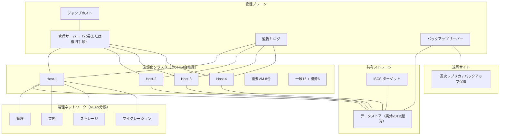
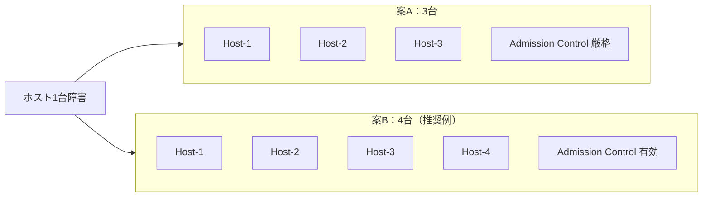
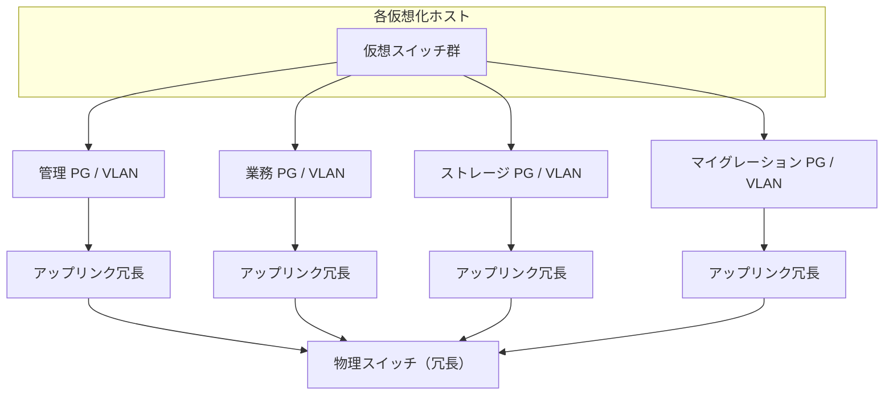
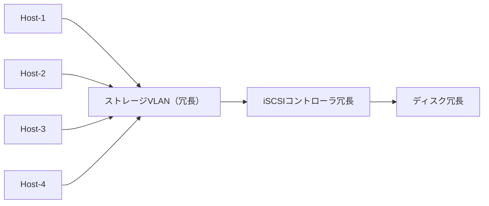
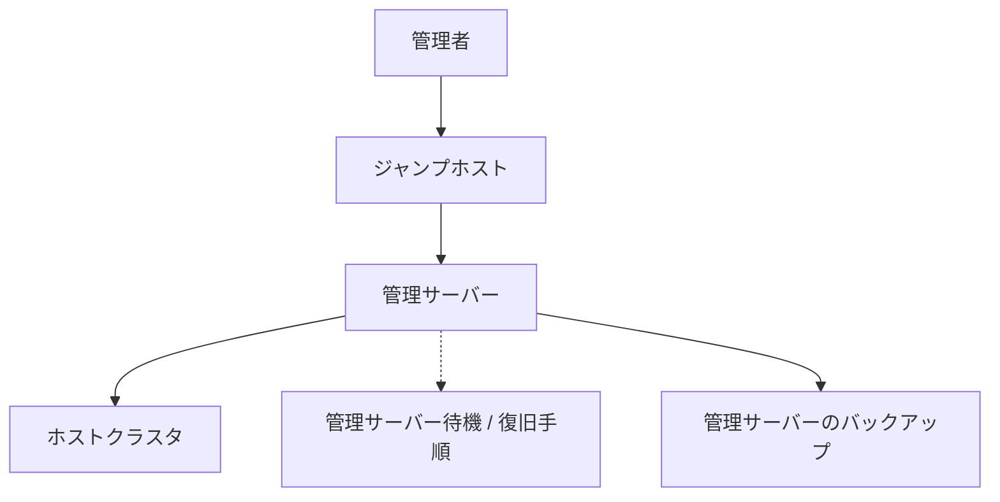
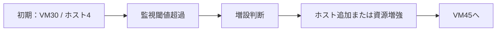
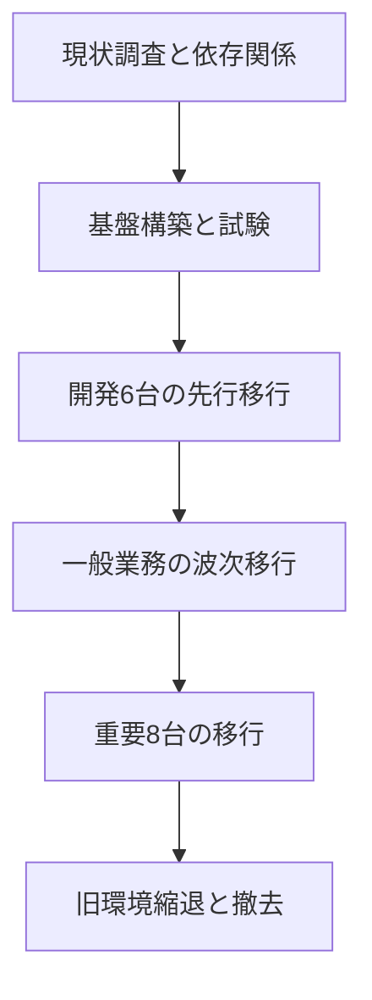

# 第14章 仮想化基盤の設計

## 学習目標

1. 機能要件と非機能要件を分離して整理できる
2. ホスト台数、クラスタ、ネットワーク分離、ストレージ、管理サーバーを一貫設計できる
3. バックアップ、監視、ログ、セキュリティ、ライセンス、保守を設計に含められる
4. 拡張計画と移行計画を段階的に示せる
5. 通貫シナリオについて、採用理由、代替案、トレードオフ、SPOF、障害時挙動を文書化できる

---

## 14.1 設計が必要になった背景

第1章から第13章までで、仮想化の部品は揃った。
CPU、メモリ、ストレージ、ネットワーク、クラスタ、バックアップ、セキュリティ、サイジングである。

部品が揃っても、通貫シナリオは自動では立ち上がらない。
「ホスト3台以上」「共有ストレージ」「4系統の網」「日次バックアップ」は前提値であって、確定構成ではない。
どの値を採用し、どの代替を捨て、どこに単一障害点を残すかを文書化する作業が設計である。

設計でよく起きる失敗は次である。

1. 機能要件だけ書いて、非機能（可用性、性能、運用）を後回しにする
2. 平常時の収容だけ見て、ホスト1台障害後の席を確保しない
3. ネットワークを1系統にまとめ、障害時に層が切り分けられない
4. バックアップを「取る」まで書いて、「戻せる」を書かない
5. 拡張と移行を「将来検討」で終わらせ、初期構成が伸びしろを塞ぐ

通貫シナリオの出発点を再掲する。

| 項目 | 内容 |
|------|------|
| 業務用仮想マシン | 30台（初期）、2年後に約45台 |
| 重要システム | 8台（HA対象、バックアップ優先） |
| 可用性 | 物理ホスト1台障害時も重要システムを継続 |
| ストレージ | 共有または分散、実効20 TB起算 |
| ネットワーク | 管理、業務、ストレージ、マイグレーションの分離 |
| バックアップ | 日次、遠隔地へ週次レプリケーション |
| 運用 | 監視、ログ、権限管理を必須 |

数値は第13章の計算で見直す前提である。
この章では、計算結果を受けて構成案を確定する手順を示す。

**仮想化基盤の設計**とは、要件を満たす構成を選び、代替案との差、トレードオフ、単一障害点、障害時挙動を明示して文書化する活動である。
正しい唯一解を探す作業ではない。
制約下での選択の記録である。

---

## 14.2 要件定義

### 要件定義の役割

**要件定義**とは、基盤が「何をできなければならず」「どの品質で動かなければならないか」を、実装手段より先に固定する作業である。
手段（製品名、プロトコル、ホスト台数）から入ると、要件が手段に合わせて歪む。

要件は大きく二つに分ける。

- **機能要件**：何ができるか
- **非機能要件**：どの水準でできるか

### 機能要件（通貫シナリオ）

| ID | 機能要件 | 受け入れの目安 |
|----|----------|----------------|
| F1 | 業務VMを初期30台稼働できる | 平常時に全VMが起動し、業務通信が可能 |
| F2 | 重要VM 8台を保護対象にできる | HA対象、バックアップ優先、監視対象に登録 |
| F3 | ホスト障害時に重要VMを別ホストで再起動できる | 障害試験で再起動を確認 |
| F4 | 計画保守で稼働中VMをホスト間移動できる | ライブマイグレーション成功 |
| F5 | 日次でイメージバックアップを取得できる | ジョブ完走と復元試験 |
| F6 | 遠隔地へ週次で保護データを送れる | レプリケーション完走と到達確認 |
| F7 | 管理者が管理プレーンへ到達し操作できる | 管理サーバー経由の操作が可能 |
| F8 | 監視とログで状態を追跡できる | 閾値超過と操作履歴が残る |
| F9 | 役割に応じた権限分離ができる | RBACで操作範囲が制限される |

### 非機能要件（通貫シナリオ）

| ID | 非機能要件 | 仮の目標値 | 備考 |
|----|------------|------------|------|
| N1 | 可用性（ホスト1台障害） | 重要8台が停止後に自動再起動 | 無停止ではない（第8章） |
| N2 | RPO | 24時間（仮） | 日次バックアップ完走が前提 |
| N3 | RTO | 8時間（仮） | サイト災害時。訓練で実測 |
| N4 | 成長 | 2年でVM約1.5倍（45台） | CPU、メモリ、容量、ライセンスを含む |
| N5 | ネットワーク分離 | 4系統 | 管理、業務、ストレージ、マイグレーション |
| N6 | 管理プレーン保護 | 業務網から直接到達不可 | 第10章 |
| N7 | 保守窓口 | パッチ適用をローリングで実施可能 | N+1または同等の予備 |

非機能要件は「速い」「安全」だけでは不合格である。
測定可能な形（時間、台数、到達可否）に落とす。

### 要件と制約の分離

要件と制約は混ぜない。

| 種類 | 例 |
|------|----|
| 要件 | ホスト1台障害でも重要継続 |
| 制約 | 予算上限、既存ラック、既存スイッチ、既存ディレクトリサービス、導入期限 |
| 前提 | Type 1ハイパーバイザー、ホストCPUとメモリの初期カタログ値 |

制約が要件を満たせないなら、要件を下げるか、制約を交渉する。
黙って要件を捨てない。

---

## 14.3 通貫シナリオの確定構成（推奨例）

唯一解ではない。
小規模企業の通貫シナリオに対する、理由付きの推奨構成例である。

| 領域 | 推奨構成例 | 一言の理由 |
|------|------------|------------|
| ホスト | 4台クラスタ（N+1に余裕、成長込み） | 3台でも成立するが、成長と保守の同時耐性で4台が楽 |
| ストレージ | iSCSI共有ストレージ（実効20 TB起算、成長余裕） | HAとライブマイグレーションの共有前提を単純に満たす |
| ネットワーク | 4系統VLAN分離、各アップリンク冗長 | 帯域競合と攻撃面を分ける |
| バックアップ | 日次イメージ＋週次遠隔レプリケーション | RPO 24時間とサイト災害の役割分担 |
| 管理 | 管理サーバー冗長、またはバックアップからの復旧手順を文書化 | 管理面の停止を短くする |
| 監視とログ | 外部収集、閾値と保持期間を定義 | 障害後に証拠が残る |
| セキュリティ | 管理網分離、RBAC、MFA、監査 | 第10章の要件を初期から入れる |

以降の各節で、採用、不採用、トレードオフ、SPOF、障害時挙動を個別に書く。

---

## 14.4 ホスト台数とクラスタ構成

### 動作原理

クラスタは、複数ホストを可用性の単位として扱う（第8章）。
**N+1**とは、必要容量Nに対して予備1単位を持ち、1台障害後も残容量で要件を満たす考え方である。
**Admission Control**は、障害後に足りなくなる配置を平常時から拒否し、席を予約する仕組みである。

通貫シナリオの可用性は「ホスト1台障害時も重要継続」である。
継続の中身は、重要8台の停止後自動再起動である。
無停止ではない。

### 比較：ホスト3台＋厳格なAdmission Control と ホスト4台

| 観点 | 案A：ホスト3台＋厳格Admission Control | 案B：ホスト4台（N+1に余裕、成長込み） |
|------|----------------------------------------|----------------------------------------|
| 平常時収容 | きつめ。障害後席を厚く取る | 余裕が出やすい |
| ホスト1台障害 | 残2台で重要＋必要分を載せる | 残3台で載せやすい |
| 成長（45台） | 早期に逼迫しやすい | 2年の増加を吸収しやすい |
| ローリングパッチ | 可能だが余裕が薄い | 退避先が取りやすい |
| コスト | ホスト費用が少ない | ホスト費用が増える |
| 運用難度 | Admission Controlの設計と監視が重い | 台数管理は増えるが余裕で事故りにくい |

#### 採用案（推奨例）

ホスト4台クラスタを推奨例とする。
初期30台と2年後45台、ホスト1台障害、ローリングパッチを同時に見ると、3台は成立するが余裕が薄い。
4台は、N+1に「成長と同時作業」の余裕を足した構成である。

#### 不採用とした代替案

1. ホスト2台のみ：ウィットネス設計が要り、障害と保守の同時耐性が弱い。通貫シナリオの最低要件を下回りやすい
2. ホスト3台でAdmission Control無効：平常時は収容できるが、障害時に重要VMが起動失敗しやすい
3. ホスト6台以上への初期投資：要件超過。予算制約下では過剰になりやすい

3台案を捨てるわけではない。
予算やラック制約で3台しか置けないなら、案Aを正式採用し、次を必須にする。

- Admission Controlを有効にする
- 開発6台を障害時の起動後回しまたはHA対象外にする
- 成長45台に向けた増設トリガを監視に埋め込む
- オーバーコミット率を第13章の上限より厳しく取る

#### トレードオフ

| 得るもの | 失うもの |
|----------|----------|
| 4台：障害後容量、成長余地、保守の安心 | 初期コスト、電力、ライセンス、管理対象の増加 |
| 3台厳格：初期コスト抑制 | 日常の配置拒否が増え、成長で早期増設が必要 |

#### 単一障害点（SPOF）

ホスト台数を増やしても消えないSPOFがある。

- 共有ストレージ一系統（次節）
- 管理サーバー一系統（製品と構成による）
- クラスタ全体を支配する設定ミス（Admission Control無効化、誤った配置ルール）
- 同一ラックの電源系統が単一なら、ホスト複数台が同時に落ちうる

#### 障害時の挙動

| 事象 | 4台構成での期待挙動 |
|------|---------------------|
| Host-1突然死 | 重要VMは停止後、残ホストで再起動。一般と開発は優先度に従う |
| Host-1計画保守 | 事前にライブマイグレーションで退避し、無停止に近い保守 |
| Host-1障害中にさらにHost-2障害 | 設計対象外（N+1）。重要継続は保証しない。早期復旧か縮退運転 |
| 全ホスト同時電源断 | クラスタでは救えない。サイト電源とUPS、DRの領域 |

### クラスタ内の配置方針

- 重要8台：HA対象、起動優先度高。必要ならペア単位でアンチアフィニティ
- 一般16台：HA対象。優先度は中
- 開発6台：HA優先度低、または対象外。障害時に席を譲る
- アンチアフィニティは「真に同時障害を避けたい組」に限定する（第8章）

---

## 14.5 ネットワーク分離

### 動作原理

第6章の4系統分離を、設計として固定する。

| 系統 | 役割 | 主な利用者 |
|------|------|------------|
| 管理 | ホスト管理、管理サーバー、監視、ログ、ジャンプホスト | 管理者、基盤サービス |
| 業務 | アプリケーション通信 | 業務VM、ユーザー、他システム |
| ストレージ | iSCSI等のストレージI/O | ホストとストレージ |
| マイグレーション | ライブマイグレーションのメモリ転送 | ホスト間 |

VLANで論理分離し、物理NICは用途ごとに冗長アップリンクを付ける。
物理ポートが足りない場合でも、論理分離（VLAN）を先に守り、物理共有は帯域設計とQoSで補う。
「ポートが足りないから全部同じVLAN」は不採用とする。

#### 採用案

4系統VLAN分離。
管理系統は到達元をジャンプホストと管理セグメントに限定する（第10章）。

#### 不採用とした代替案

1. 全用途を同一VLAN：帯域競合と切り分け不能、攻撃面の拡大
2. 管理と業務のみ分離し、ストレージとマイグレーションを業務に相乗り：バックアップや移行のたびに業務が沈む
3. オーバーレイ（VXLAN）を初期必須にする：通貫シナリオの規模では複雑さが先行しやすい。将来拡張の候補としては残す

#### トレードオフ

| 得るもの | 失うもの |
|----------|----------|
| 障害の層特定が速い、帯域競合の抑制、攻撃面の縮小 | NIC本数、スイッチポート、VLAN設計とドキュメントのコスト |

#### 単一障害点（SPOF）

- 物理スイッチが単一筐体のみ
- アップリンクが用途ごとに1本だけ
- コアスイッチの電源またはスタックの単一障害
- ストレージVLANのルーティング誤設定（到達不能で全VM停止に近い状態）

#### 障害時の挙動

| 事象 | 挙動 |
|------|------|
| 業務VLAN障害 | 業務不通。管理できれば切り分け可能。ストレージが生きていればVMは稼働しうる |
| ストレージVLAN障害 | 多数VMが同時にI/Oハングまたは停止。HAでも救えないことが多い |
| 管理VLAN障害 | 業務は動き続けうるが、操作不能。心拍経路が管理のみなら誤検知リスク |
| マイグレーションVLAN障害 | 平常業務は継続。計画移動と負荷分散が失敗する |

---

## 14.6 ストレージ構成

### 動作原理

HAとライブマイグレーションは、別ホストが同じ仮想ディスクを読めることを前提にする（第5章、第8章）。
共有ストレージ（SAN/NAS）または分散ストレージが、その前提を満たす。

通貫シナリオの容量起算は実効20 TBである。
スナップショット余裕、バックアップ一時領域、成長1.5倍を別枠で見る。

### 比較：iSCSI、NFS、分散ストレージ

| 方式 | 特徴 | 向く場面 |
|------|------|----------|
| iSCSI共有 | IPベースのブロック、マルチパス設計が明確 | 専用FCがなく、共有ブロックを組みたい場合 |
| NFS共有 | ファイルデータストア、構築が比較的単純 | 運用簡素化を優先し、網品質を確保できる場合 |
| 分散ストレージ | ホストローカルディスクを束ねて共有プール化 | 外部SANを避け、ノード増設で容量を伸ばしたい場合 |

#### 採用案（推奨例）

iSCSI共有ストレージを推奨例とする。
理由は次である。

1. HAとライブマイグレーションの共有前提を、外部配列として明確に置ける
2. ストレージVLANとマルチパスの設計パターンが説明しやすい
3. 通貫シナリオの規模（30〜45VM、実効20 TB起算）で、外部SANの運用負荷が過剰になりにくい

コントローラ冗長、ディスクRAID（または同等の冗長）、ホスト側マルチパスをセットで設計する。

#### 不採用とした代替案（捨てたのではなく、第一候補から外した）

1. NFS：要件を満たしうる。網とマウントオプションの品質管理が鍵。運用チームがNFSに慣れているなら正式採用候補
2. 分散ストレージ：外部SAN費用を抑え、スケールアウトしやすい。代わりに、ノード障害時の再構築負荷、ネットワーク品質、運用習熟が重い
3. ホストローカルDASのみ：共有性がないため、通貫シナリオのホスト障害時継続と整合しない
4. 初期からFC専用SAN：性能と安定の選択肢だが、通貫シナリオの制約下では過剰になりやすい

#### トレードオフ

| 採用 | 得るもの | 失うもの / 残るリスク |
|------|----------|------------------------|
| iSCSI | 共有の明確さ、マルチパスの型 | ストレージ筐体がSPOFになりうる。網品質依存 |
| NFS | 構築と運用の簡素さ | ファイルロックや網遅延の見え方がブロックと違う |
| 分散 | 外部配列費用の抑制、ノード増設 | クラスタ運用の複雑さ、再構築時の性能低下 |

#### 単一障害点（SPOF）

- ストレージコントローラが実質単一
- バックエンドディスクの冗長不足
- ストレージネットワークの単一スイッチ
- データストアが1つだけで、満杯や破損の影響が全VMへ波及
- 分散ストレージでも「クラスタ全体設定」や「十分なノード数未満」はSPOFに近い

#### 障害時の挙動

| 事象 | 挙動 |
|------|------|
| ホスト1台障害（ストレージ健全） | HAで別ホスト再起動が可能 |
| iSCSIパス1本断 | マルチパスがあれば継続。なければI/O停止 |
| ストレージコントローラ障害（冗長あり） | フェイルオーバー後に継続、または短時間のI/O滞留 |
| データストア全損 | HAでは救えない。バックアップと遠隔レプリカへ（第9章） |

### データストア配置の方針

- 重要VMと開発VMでデータストアを分ける候補を検討する（満杯時の影響分離）
- 重要システムはシック、開発はシン、という使い分けを第5章の方針に合わせる
- スナップショットの長期保持を禁止し、容量監視にスナップショット残存を含める

---

## 14.7 管理サーバー

### 動作原理

**管理サーバー**とは、ホスト群、クラスタ、VM配置、権限、監視連携などを集中管理するコンポーネントである。
製品例は vCenter Server、System Center Virtual Machine Manager、oVirt Engine、Proxmox VEの管理機能などである。
一般概念としては「管理プレーンの中核」である。

管理サーバーが止まっても、既存VMの実行自体は続くことが多い。
ただし、構成変更、HAの一部制御、ライブマイグレーション指示、権限変更ができなくなる。
「業務は動くが手が出せない」状態である。

#### 採用案

次のいずれか（または併用）を採用する。

1. 管理サーバーの冗長構成（製品が提供するHAやクラスタ）
2. 冗長が取れない場合、イメージバックアップと復旧手順書を必須成果物にする

通貫シナリオでは、管理サーバーを重要保護対象に含め、日次バックアップ対象にする。

#### 不採用とした代替案

1. 管理サーバーなしのホスト単体運用のみ：30台規模で操作と監査が破綻しやすい
2. 冗長も復旧手順もなく、管理サーバーを一台の開発用VMに置く：SPOFかつ保護不足
3. 業務網直置きの管理サーバー：第10章の分離要件に反する

#### トレードオフ

| 方式 | 得るもの | 失うもの |
|------|----------|----------|
| 冗長構成 | 管理面の停止時間短縮 | ライセンス、構築、障害試験のコスト |
| バックアップ復旧手順 | 初期コスト抑制 | 復旧中は管理不能時間が残る |

#### 単一障害点（SPOF）

- 管理サーバー本体（非冗長時）
- 管理サーバーの認証依存先（ディレクトリサービス）が単一
- 管理サーバーの仮想ディスクが載るデータストア
- 管理用DNSや証明書の期限切れ運用

#### 障害時の挙動

| 事象 | 挙動 |
|------|------|
| 管理サーバー停止 | 既存VMは稼働継続しうる。新規操作、一部自動化が停止 |
| 管理サーバー復旧 | バックアップまたは冗長切替。手順書のRTOを守る |
| ディレクトリサービス障害 | ログイン不能。緊急用ローカルアカウントの要否を事前に決める |

---

## 14.8 バックアップと遠隔地データ保護

### 動作原理

第9章の方針を設計へ落とす。

| 手段 | 役割 | 通貫シナリオでの位置 |
|------|------|----------------------|
| 日次イメージバックアップ | RPO 24時間の主手段 | 重要8台優先、一般も含める |
| 週次遠隔レプリケーション | サイト災害向け | 同一サイト喪失への備え |
| ゲスト内バックアップ | DB等の整合性補強 | 重要のうち必要なものに併用 |
| スナップショット | 短期巻き戻し | バックアップ代替にしない |

#### 採用案

**定期バックアップ**として、日次イメージバックアップ＋週次遠隔レプリケーションを採用する。
重要8台はアプリケーション整合を目指す。
一般業務も日次対象に含め、開発6台は世代削減または対象外を検討する。
バックアップ保管は、可能ならイミュータブルまたはオフライン世代を持つ。

#### 不採用とした代替案

1. スナップショット長期保持のみ：データストア障害で同時喪失
2. 同一サイトのバックアップのみ：サイト災害でRPO/RTOが崩壊
3. レプリケーションだけでバックアップ廃止：世代と独立性を失いやすい
4. 週次バックアップのみ：RPO 24時間を満たさない

#### トレードオフ

| 得るもの | 失うもの |
|----------|----------|
| 誤削除、論理破損、ランサムウェア、サイト災害への備え | 保管容量、バックアップ窓の負荷、運用監視の工数 |

#### 単一障害点（SPOF）

- バックアップサーバー本体
- 同一サイト唯一の保管庫
- バックアップ用特権アカウントの単一管理
- 遠隔回線の単一路由（週次が継続失敗）
- 復旧手順を知る人が一人だけ

#### 障害時の挙動

| 事象 | 使う手段 |
|------|----------|
| ホスト1台障害 | 原則HA。バックアップは使わない |
| VM誤削除、論理破損 | 日次バックアップから復元 |
| データストア全損 | バックアップまたは遠隔から復元 |
| サイト災害 | 遠隔レプリカ。週次なら最大約7日の損失を受容 |
| ランサムウェア | 感染前の不変／隔離世代へ |

バックアップ窓は業務ピークと重ねない。
並列度を制御し、一時スナップショットの取り残しを監視する。

---

## 14.9 監視とログ

### 監視

**監視**とは、ホスト、VM、データストア、ネットワーク、バックアップジョブなどの状態を継続観測し、閾値超過や死活を通知する活動である。

最低限の監視項目（通貫シナリオ）：

| 対象 | 見るもの | 通知の例 |
|------|----------|----------|
| ホスト | CPU、メモリ、死活、ハードウェア障害 | ホストダウン、温度、ディスク |
| VM | CPU Ready、メモリ圧力、ディスク遅延、死活 | 重要VM停止 |
| データストア | 空き容量、レイテンシ、スナップショット残 | 空き20%未満など |
| ネットワーク | リンクダウン、パケット損失の兆候 | アップリンク障害 |
| バックアップ | ジョブ成否、所要時間、保管空き | 日次失敗 |
| クラスタ | HA事象、Admission Control拒否 | フェイルオーバー発生 |

「理論値のカタログ上限」と「実測の逼迫」を混同しない（第13章）。

### ログ

**ログ**とは、操作、認証、障害、構成変更の記録である。
ホストローカルだけに短期間置くと、侵害やディスク満杯で消える。

#### 採用案

- 監視サーバー（または同等サービス）を管理網に置く
- ログは外部へ転送し、保持期間を定義する（例：監査90日以上は組織方針に合わせる）
- バックアップ失敗を、メールやチケットで翌営業日まで放置しない仕組みにする

#### 不採用とした代替案

1. 問題が起きてから管理画面を目視するだけ
2. ホストローカルログのみ、ローテーションで数日消失
3. 閾値なしのメトリクス保管だけ（通知がない）

#### トレードオフ

監視とログは、保管コストとノイズ（誤検知）を増やす。
閾値を緩くすると見逃し、厳しくすると疲弊する。
重要8台と基盤コンポーネントから先に締める。

#### 単一障害点（SPOF）

- 監視サーバー自体の停止（監視の死を誰が見るか）
- 通知経路（メールサーバ）の単一障害
- 時刻同期（NTP）のずれによるログ相関不能

#### 障害時の挙動

監視が死んでも業務VMは動きうる。
しかし、検知が遅れ、RPO破綻やサイレントな容量逼迫が起きる。
監視サーバーもバックアップと死活の対象に含める。

---

## 14.10 セキュリティ

第10章の要件を、初期構成の必須項目として入れる。
後付けにすると、網の作り直しと権限の棚卸しが発生する。

#### 採用案

| 項目 | 内容 |
|------|------|
| 管理網分離 | 業務VMからホスト管理IPへ到達できない |
| 到達経路 | ジャンプホスト経由 |
| 権限 | 役割別RBAC、共有ID禁止 |
| 認証 | 管理プレーンへMFA |
| 監査 | 操作ログの外部保管 |
| テンプレート | 衛生基準と再生成周期 |
| パッチ | ローリング適用、検証先行 |

#### 不採用とした代替案

1. 業務網から管理画面へ直接ログイン
2. 全員フル管理者
3. パスワードのみの恒久運用
4. 長年未パッチのハイパーバイザー

#### トレードオフ

利便性が下がる。
緊急時のブレイクガラス手順（緊急アカウント）を別途用意しないと、セキュリティが可用性事故になる。

#### 単一障害点（SPOF）と高価値標的

可用性のSPOFと、セキュリティ上の高価値標的は重なる。

- 管理サーバー
- バックアップサーバー
- ディレクトリサービス
- ジャンプホスト

#### 障害時の挙動（セキュリティ事象）

| 事象 | 挙動と初動 |
|------|------------|
| 管理アカウント侵害の疑い | 該当アカウント無効化、監査ログ保全、セッション切断 |
| ランサムウェア | 拡散経路の遮断、不変バックアップの確認、感染VMの隔離 |
| パッチ適用失敗 | ローリングの残りホストを止め、戻し手順へ |

---

## 14.11 ライセンスと保守

### ライセンス

**ライセンス**は、ハイパーバイザー、管理サーバー、バックアップ、監視、ゲストOS、セキュリティ製品の権利関係である。
技術的に動いても、契約上動かせない構成は設計不合格である。

設計で固定すること：

1. 課金単位（ソケット、コア、VM、容量）
2. ホスト4台（または3台）と2年後増設時の追加費用
3. 管理サーバー冗長が別ライセンスか
4. バックアップと監視の対象台数上限
5. 評価版や期限付き鍵の本番混入防止

#### 採用案

ライセンスを構成図の付録として台数と連動させる。
増設トリガ（VM45台、ホスト追加）にライセンス確認を埋め込む。

#### 不採用とした代替案

1. 構築後にライセンスを考える
2. オーバーコミット前提でコア数を過小申告する（契約違反リスク）

#### トレードオフ

正しいライセンスはコスト増になる。
過小構成は監査と停止リスクになる。

### 保守

**保守**は、ハードウェア保守契約、ハイパーバイザーのパッチ方針、ベンダー問い合わせ窓口、部品保管の取り決めである。

#### 採用案

- ホストとストレージの保守レベル（到着時間）を可用性要件と揃える
- パッチはローリング、検証環境または先行1ホスト
- 変更窓口（誰がいつ承認するか）を決める

#### 障害時の挙動

保守契約のSLAは、クラスタのHA時間とは別物である。
HAで業務を戻しても、故障ホストの部品交換が遅れればN+1が崩れたままになる。

---

## 14.12 拡張計画（将来2年）

成長前提はVM約1.5倍（45台）である。
拡張は「そのとき考える」ではなく、初期設計の伸びしろとして書く。

### 拡張の段階

| 段階 | トリガ例 | 行動 |
|------|----------|------|
| 警戒 | データストア空き30%未満、CPU Ready恒常化、障害後空き不足 | 原因分析、スナップショット掃除、配置見直し |
| 増設検討 | VMが40台超、または成長予測で45台確定 | ホスト追加、ストレージ拡張、ライセンス見積 |
| 実施 | 承認後 | ローリングでホスト追加、Admission Control再計算 |
| 検証 | 追加後 | ホスト障害試験、バックアップ対象更新 |

#### 採用案

スケールアウト（ホスト追加）を基本とし、個別ホストの極端なスケールアップは互換性と買い替え単位を見て選ぶ。
第13章の余裕率を、拡張判断の数値根拠にする。

#### 不採用とした代替案

1. 初期からホスト8台を購入し、2年遊ばせる（過剰投資）
2. 増設せずオーバーコミットだけ伸ばす（障害時に破綻）
3. ストレージだけ増やすがコンピュートが不足（非対称逼迫）

#### トレードオフ

早期増設はコスト先行、遅すぎる増設は障害時不足と性能劣化を招く。
監視トリガで「遅すぎ」を防ぐ。

#### 単一障害点（SPOF）

拡張作業中に、一時的にN+1が崩れることがある。
増設作業を本番ピークやバックアップ窓と重ねない。

#### 障害時の挙動

拡張途中でホスト障害が起きると、旧来の予備計算が一時的に無効になる。
作業手順に「中断条件」と「戻し方」を書く。

---

## 14.13 移行計画

新規構築ではなく、既存物理サーバーや既存仮想基盤から移す場合の設計である。
通貫シナリオを「移行先」として使う。

### 移行の原則

1. 重要8台の順序と依存関係（認証、DNS、DB、AP、ファイル）を先に書く
2. 一括移行せず、波次（ウェーブ）に分ける
3. 切り戻し条件を、切替前に合意する
4. 移行中もバックアップと監視を止めない

### 移行方式の選択

| 方式 | 内容 | 向くもの |
|------|------|----------|
| 新規構築＋データ移行 | 新VMを作りデータを移す | アプリが許容する停止窓がある場合 |
| ハイパーバイザー間移行ツール | 変換や移行製品を使う | 既存VMを維持したい場合 |
| バックアップ復元で搬入 | イメージを新基盤へ復元 | 互換性確認と復元試験が中心になる場合 |

#### 採用案

開発と検証を先行し、一般、重要の順。
重要8台は、切替リハーサル（停止時間の実測）を必須とする。

#### 不採用とした代替案

1. 金曜夜に30台一斉切替
2. 切り戻し手順なしの本番切替
3. 移行完了までバックアップを停止

#### トレードオフ

慎重な波次は期間が伸びる。
一斉切替は短いが失敗時の影響が大きい。

#### 単一障害点（SPOF）

移行ツールサーバー、移行用ネットワーク、移行担当者の単一性。
属人化を避け、手順書と同行者を置く。

#### 障害時の挙動

切替失敗時は、事前合意した切り戻し（旧環境継続）へ戻す。
中途半端な両系稼働は、データ分岐の原因になる。

---

## 14.14 設計判断の総表

各判断を、必須の五項目で再掲する。

| 領域 | 採用案 | 不採用（第一候補から外した案） | トレードオフ | SPOF | 障害時挙動 |
|------|--------|--------------------------------|--------------|------|------------|
| ホスト台数 | 4台クラスタ（または3台＋厳格AC） | 2台のみ、AC無効の詰め込み | コスト対予備容量 | 電源系統、ストレージ | 1台障害はHAで再起動 |
| ネットワーク | 4系統VLAN | 同一VLAN混在 | 設計コスト対切り分け容易性 | 単一スイッチ | 系統別に影響が分かれる |
| ストレージ | iSCSI共有 | DASのみ、初期FC必須 | 外部配列運用対共有の単純さ | 配列本体 | 全損時はDRへ |
| 管理 | 冗長または復旧手順 | 無保護の単一VM | コスト対管理面RTO | 管理サーバー | 業務継続、操作停止 |
| バックアップ | 日次＋週次遠隔 | スナップショット代用 | 保管コスト対復旧可能性 | 保管庫、バックアップサーバ | 論理障害とサイト災害に対応 |
| 監視ログ | 外部収集＋通知 | 目視のみ | ノイズと保管コスト | 監視自体 | 検知遅延リスク |
| セキュリティ | 分離、RBAC、MFA | 業務網直管、全員管理者 | 利便性対攻撃面 | 管理面全体 | 侵害時は隔離と監査 |
| 拡張 | 監視トリガで増設 | 過早大量購入、過遅放置 | 投資タイミング | 作業中の予備崩れ | 増設中障害に弱い |
| 移行 | 波次＋切り戻し | 一斉無計画 | 期間対リスク | 移行ツールと担当 | 失敗時は旧環境へ |

---

## 14.15 製品に依存しない共通概念と実装例

### 共通概念

| 一般概念 | 意味 |
|----------|------|
| 機能要件 | できること |
| 非機能要件 | 品質と制約の水準 |
| N+1 | 予備1単位を持つ冗長 |
| Admission Control | 障害後容量を見込んだ入場制限 |
| ネットワーク分離 | 用途別の論理（および物理）分離 |
| 共有ストレージ | 複数ホストが同一仮想ディスクに到達できる保管 |
| 管理プレーン | 設定と操作の面 |
| RPO / RTO | 復旧点と復旧時間の目標 |
| スケールアウト | ノード追加による拡張 |
| 波次移行 | 段階的な移行単位 |

### 代表製品での実装例

| 一般概念 | VMware | Hyper-V | KVM系 |
|----------|--------|---------|-------|
| クラスタ | vSphere Cluster | Failover Cluster | oVirt、Proxmox 等 |
| 管理サーバー | vCenter | SCVMM | oVirt Engine 等 |
| 共有ストレージ | VMFS on iSCSI 等 | CSV、iSCSI、SMB | 各種データドメイン |
| ライブマイグレーション | vMotion | Live Migration | live migration |
| HA | vSphere HA | クラスタVM監視 | Pacemaker連携等 |
| バックアップ連携 | API連携製品 | VSS連携等 | スナップショット＋製品 |

設計書の見出しは一般概念で書き、構築手順書だけ製品名を使う。

---

## 14.16 性能上の注意点

- ホスト4台でも、ストレージが遅ければ全体が遅い。コンピュートとストレージをセットで見る
- ライブマイグレーションとバックアップを同時間帯に重ねると、マイグレーション網とストレージが同時に飽和する
- Admission Controlは理論上の席であり、CPU Readyやディスク遅延の実測までは保証しない
- 成長45台の見積もりで、平均負荷だけを使うとピークで破綻する（第13章）
- ネスト仮想化ラボの数値を、本番サイジングの絶対値に使わない
- 監視の過剰取得自体が負荷になる。間隔と保持を設計する

---

## 14.17 セキュリティ上の注意点

- 設計図に書いた管理網分離を、実装で短絡しない（一時的な「とりあえず業務網から」が定着する）
- バックアップサーバーは全VM読取権限に近い。強化優先度を管理サーバー並みにする
- 拡張や移行の臨時穴（広すぎるFW規則）に期限を付ける
- ライセンスサーバや管理用証明書の期限を、運用カレンダーに載せる
- 設計書自体に特権パスワードを書かない

---

## 14.18 障害例と設計へのフィードバック

### 障害例1：3台構成で成長後、ホスト障害時に重要VMが起動しない

**症状**：VMが40台超。Host-1障害後、重要VMの一部が資源不足で起動しない。

**設計上の欠け**：Admission Control無効、または成長トリガ未設定のまま3台を維持。

**フィードバック**：案Aを採るなら成長監視を必須にする。余裕が必要なら案B（4台）へ増設する。

### 障害例2：バックアップは成功しているが、サイト災害訓練でRTO 8時間を超過

**症状**：データはある。復元、網、認証、手順で時間が溶ける。

**設計上の欠け**：取得設計だけで復旧設計がない。

**フィードバック**：重要8台の復旧順序、DR側資源、訓練周期を設計書に追加する。

### 障害例3：ストレージVLAN工事中に全VMがI/O停止

**症状**：業務VLANは生きている。全VMがディスクタイムアウト。

**設計上の欠け**：ストレージ網の単一スイッチ、または工事手順に仮想化影響評価がない。

**フィードバック**：ストレージ網の冗長と、変更管理での影響区分を必須にする。

### 障害例4：管理サーバー故障で操作不能、復旧手順がなく数時間手探り

**症状**：業務は稼働。新規VMも移動もできない。

**設計上の欠け**：管理サーバーの冗長もバックアップ復旧手順もない。

**フィードバック**：管理面のRTOを非機能要件に書き、年1回は復旧訓練する。

---

## 章末問題

### 問題1

機能要件と非機能要件の違いを、通貫シナリオの例を一つずつ挙げて説明せよ。

### 問題2

ホスト3台＋厳格Admission Controlと、ホスト4台構成を、コスト、成長、障害時の観点から比較せよ。

### 問題3

ネットワークを4系統に分ける理由を、帯域、セキュリティ、切り分けの三つの言葉で述べよ。

### 問題4

iSCSI共有を推奨例とする理由と、NFSおよび分散ストレージを第一候補から外しうる条件を述べよ。

### 問題5

日次バックアップと週次遠隔レプリケーションの役割分担を、RPOの観点で説明せよ。

### 問題6

次の設計判断について、採用理由、不採用案、トレードオフ、SPOF、障害時挙動を書け。

「管理サーバーを冗長化せず、バックアップからの復旧手順を採用する」

---

## 解答と解説

### 問題1

機能要件の例：業務VMを30台稼働できる、日次バックアップを取得できる。
非機能要件の例：ホスト1台障害時に重要8台を自動再起動できる、RPO 24時間。
前者は「できること」、後者は「どの水準で」を示す。

### 問題2

3台厳格は初期コストを抑えられるが、成長と保守同時耐性で余裕が薄い。
4台はコスト増と引き換えに、障害後容量と2年成長、ローリングパッチの余地が取りやすい。
どちらもAdmission Control有効が前提である。

### 問題3

帯域：ストレージとマイグレーションが業務を押しのけない。
セキュリティ：管理面を業務から隠す。
切り分け：どの系統の障害かを分離して観測できる。

### 問題4

iSCSIは共有ブロック前提を明確にし、マルチパス設計が説明しやすい。
NFSは運用簡素化と網品質が強みだが、チーム習熟とオプション管理が条件になる。
分散は外部SAN費用を抑えるが、再構築負荷と運用習熟が重い場合に第一候補から外す。

### 問題5

日次は、完走すればRPO 24時間の主手段になる。
週次遠隔はサイト災害向けであり、週次だけではRPO 24時間を満たさない。
役割が異なる。

### 問題6（例）

- 採用理由：初期コストを抑えつつ、管理面の復旧手段を文書化して残す
- 不採用案：無保護の単一管理サーバー、または必須でないのに高コスト冗長を強いること
- トレードオフ：冗長より復旧中の管理不能時間が残る
- SPOF：管理サーバー本体、そのバックアップ保管、復旧手順の属人化
- 障害時挙動：既存VMは稼働継続しうる。操作は復旧完了まで制限される

---

## ハンズオン演習

### 演習1：要件表を自分の言葉で書き直す

通貫シナリオについて、機能要件5行、非機能要件5行の表を作れ。
受け入れの目安列を必ず含める。

### 演習2：ホスト台数の設計判断メモ

案A（3台＋厳格AC）と案B（4台）のどちらを採るか決め、五項目（採用理由、不採用、トレードオフ、SPOF、障害時挙動）を書け。

### 演習3：全体構成図

Mermaidまたはテキストで、ホスト、ストレージ、4系統ネットワーク、管理、バックアップ、遠隔を含む構成図を描け。

### 演習4：拡張と移行のチェックリスト

2年で45台になる前提の拡張トリガ3つと、重要8台移行の波次計画（依存順）を書け。

### 成果物

- 要件表
- ホスト台数の判断メモ
- 全体構成図
- 拡張トリガと移行波次
- （任意）ライセンスと保守の付録表

---

## 本章のまとめ

仮想化基盤の設計は、部品知識の合計ではない。
要件を機能と非機能に分け、ホスト、クラスタ、ネットワーク、ストレージ、管理、バックアップ、監視、セキュリティ、ライセンス、保守、拡張、移行を一貫した選択として残す作業である。

通貫シナリオの推奨例は、ホスト4台（または3台＋厳格Admission Control）、iSCSI共有、4系統VLAN、日次イメージ＋週次遠隔、管理サーバーの冗長または復旧手順である。
いずれも唯一解ではない。
採用理由、代替案、トレードオフ、SPOF、障害時挙動を書けて初めて、設計として完了する。

次章では、この構成を運用し、症状から層を切り分ける手順を扱う。
