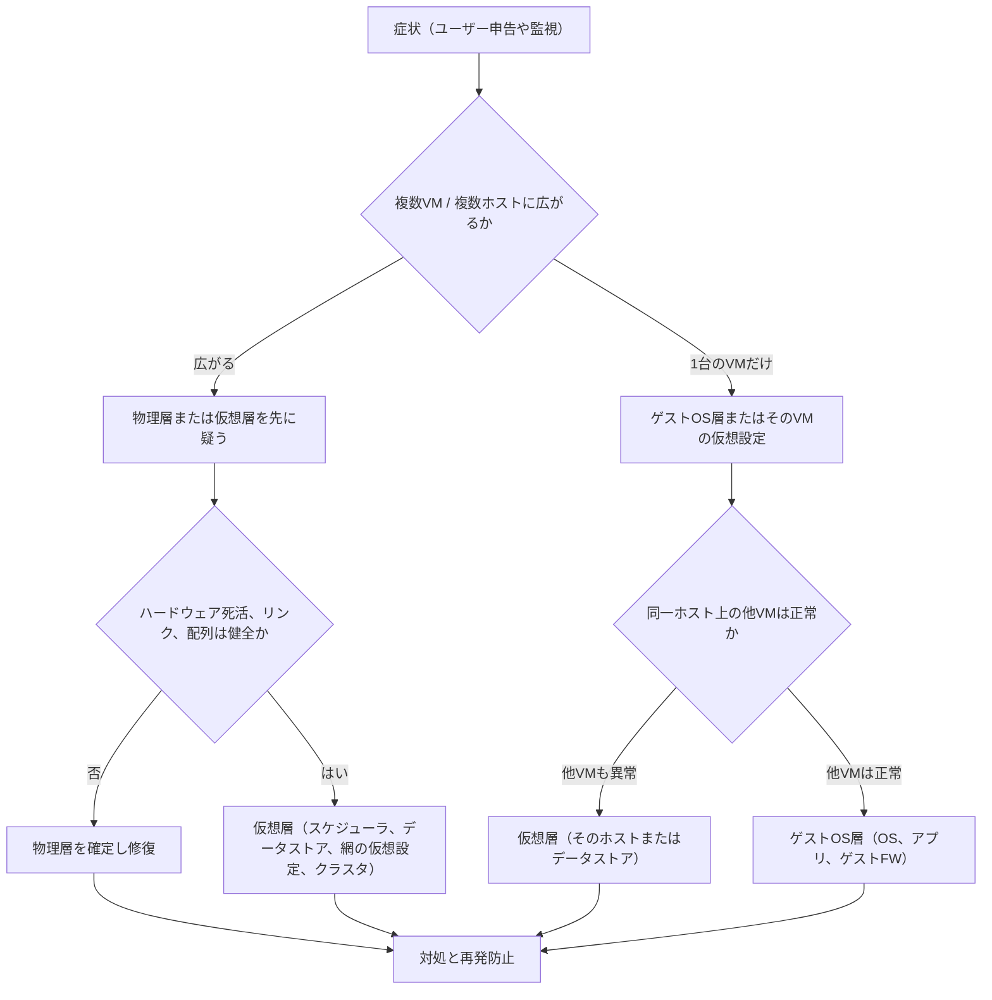
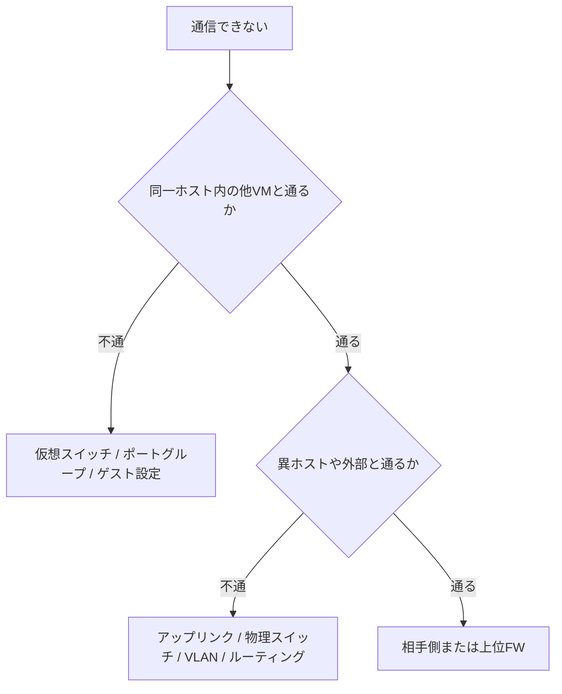
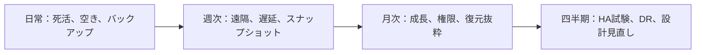

# 第15章 運用とトラブルシューティング

## 学習目標

1. 代表的な障害症状を、物理層、仮想層、ゲストOS層に切り分けられる
2. CPU Ready、メモリスワップ、データストア逼迫、スナップショット肥大の対処方針を説明できる
3. 仮想NIC不通、ホスト管理不能、HA不動作、マイグレーション失敗、バックアップ失敗の確認点を列挙できる
4. 切り分けメモの型（症状→仮説→確認→結果→次アクション）を使える
5. 通貫シナリオの運用チェックリストを作成できる

---

## 15.1 運用が設計を完了させる

第14章で構成案は固まった。
ホスト、共有ストレージ、4系統ネットワーク、バックアップ、監視である。
固まっただけでは、通貫シナリオは要件を満たし続けない。

運用で日常的に崩れるものがある。

- データストアの空きが、スナップショットとログで削られる
- 成長でCPU Readyが慢性化する
- バックアップ失敗が通知されず、RPO 24時間が静かに壊れる
- 管理網の一時例外が恒久化する
- Admission Controlを「起動できない」不満から無効化する

**運用**とは、設計した状態を観測し、逸脱を検知し、変更を制御し、障害時に層を特定して戻す活動である。
**トラブルシューティング**とは、症状から仮説を立て、確認で仮説を捨てまたは採り、次アクションへ進む反復である。

感覚での「たぶんホスト」は、切り分けではない。
記録のない復旧は、再発したときに同じ時間を払う。

---

## 15.2 三層切り分けのフレームワーク

仮想化の障害は、見え方が一つの層に寄って見える。
実体は別の層にあることが多い。

三層を次のように置く。

| 層 | 対象の例 | この層が壊れたときの典型 |
|----|----------|--------------------------|
| **物理層** | サーバ筐体、電源、物理NIC、ケーブル、物理スイッチ、ストレージ配列、ラック電源 | リンクダウン、ハードウェア故障、サイト電源断 |
| **仮想層** | ハイパーバイザー、仮想スイッチ、データストア、クラスタ、HA、管理サーバー | CPU Ready、データストア遅延、HA失敗、管理不能 |
| **ゲストOS層** | ゲストOS、アプリ、ゲスト内エージェント、ゲストのファイアウォール | サービス停止、ゲスト内ディスク満杯、名前解決失敗 |



### 層を跨ぐとき

次は層が混ざる。

| 現象 | 混ざり方 |
|------|----------|
| ストレージ配列の遅延 | 物理の遅延が、仮想層のデータストア遅延として見え、ゲストはアプリ遅延として訴える |
| 管理VLAN障害 | 物理またはL2の問題が、仮想層の「ホスト管理不能」「HA誤検知」として見える |
| ゲストのメモリ逼迫 | ゲスト内スワップと、ハイパーバイザーのバルーンやスワップが同時に起きうる |

申告の言葉（「VMが遅い」）だけで層を決めない。
広がりの範囲（1VMか、1ホストか、クラスタ全体か）で層の優先順位を付ける。

---

## 15.3 切り分けの型

通貫シナリオでも、個人のメモでも、次の型で残す。

1. **症状**：誰が、何を、いつから、どの範囲で観測したか
2. **仮説**：5〜7個を層つきで列挙する（早く当てようと1個に絞らない）
3. **確認**：仮説を捨てるための観測（コマンド、画面、ログ、LED）
4. **結果**：仮説が残ったか消えたか
5. **次アクション**：修復、回避、エスカレーション、経過観察

```text
症状:
仮説:
  1.
  2.
  3.
確認:
結果:
次アクション:
```

仮説は「正しそうな順」より「安く否定できる順」で確認してよい。
物理リンクのLED確認は、ゲスト内の長いトレースより先で済むことが多い。

---

## 15.4 症状別ガイド

以降、通貫シナリオ（ホスト3台以上または4台、VM30台、重要8台、iSCSI、4系統網、日次バックアップ）を具体例の舞台にする。

各症状で、想定原因を5〜7個意識し、確認順序と切り分け型を示す。

---

## 15.5 VMが起動しない

### 想定原因（例）

1. データストア容量不足またはパス喪失（仮想層、物理層）
2. Admission Controlまたは資源不足でパワーオン拒否（仮想層）
3. 仮想ディスクロック、他ホストとの排他（仮想層）
4. ゲストOSブート設定、ブートディスク切断（ゲストOS層、仮想層）
5. ライセンスまたはホストのメンテナンスモード（仮想層）
6. アンチアフィニティ等で配置先がゼロ（仮想層）
7. 物理ホスト障害でHA未発動またはHA対象外（仮想層）

### 確認順序

1. エラーメッセージの原文を残す（資源不足か、ディスクか、許可か）
2. 対象VMだけか、同一データストアの他VMもか
3. データストアのマウント状態と空き容量
4. クラスタのAdmission Control、ホストのメンテナンスモード
5. 配置ルール、HA対象可否
6. コンソールでファームウェアやブートデバイスを確認
7. 最近のバックアップやスナップショット操作の有無

### 切り分けの型（通貫シナリオ例）

**症状**：重要VM「認証サーバ」が起動しない。一般VMは動いている。

**仮説**：

1. Admission Controlで拒否
2. データストア到達不可
3. 配置ルールで配置先なし
4. 仮想ディスク破損
5. ゲストブート設定ミス

**確認**：

1. タスクとイベントに「insufficient resources」系がないか
2. 他ホストから同一データストアが見えるか
3. アンチアフィニティの対象ホスト数

**結果**：イベントが資源不足。Host-1障害後、残ホストの予約が不足。

**次アクション**：開発VMを停止して席を空ける、またはホスト復旧を優先。中期はホスト増設かAdmission Controlと優先度の見直し。

---

## 15.6 VMが遅い

「遅い」は症状の申告であり、診断名ではない。
CPU待ちか、メモリか、ディスクか、ネットワークか、アプリかを分ける。

### 想定原因（例）

1. CPU Readyが高い（仮想層のCPU競合）
2. ハイパーバイザーまたはゲストのメモリスワップ（仮想層、ゲストOS層）
3. データストア遅延、ストレージ飽和（物理層、仮想層）
4. 仮想NICの帯域競合、誤ったポートグループ（仮想層）
5. ゲスト内のCPUキュー、ディスク満杯、アプリロック（ゲストOS層）
6. バックアップやストレージマイグレーションの同時実行（仮想層）
7. 物理NIC、スイッチ、配列の障害予兆（物理層）

### 確認順序

1. 範囲：1VMか、同一ホストの複数VMか、クラスタ全体か
2. 時刻：バックアップ窓、パッチ、大量検索と重なるか
3. ホストとVMのCPU Ready、CPU使用率
4. メモリのバルーン、スワップ、ゲスト内空き
5. データストアのレイテンシ、IOPS、キュー
6. ネットワークのパケット損失、再送、アップリンク障害
7. ゲスト内のプロセス、ディスク、イベントログ

### 切り分けの型（例）

**症状**：平日10時、一般業務VMの応答が遅い。重要DBもやや遅い。

**仮説**：バックアップ残存、ストレージ遅延、CPU過密、業務ピークそのもの。

**確認**：バックアップジョブは07時に完了。データストアレイテンシが平常の数倍。CPU Readyは中程度。

**結果**：ストレージ側の遅延が主。同一LUN上の開発フルスキャンが同時実行。

**次アクション**：開発スキャンを夜間へ。ストレージの負荷分離と、データストア分割の検討。

---

## 15.7 CPU Readyが高い

### 背景と動作原理

**CPU Ready**とは、仮想マシンがCPUを使いたいのに、物理CPUを割り当ててもらえず待っている時間の指標である（第3章）。
ゲスト内のCPU使用率が低く見えても、Readyが高ければアプリは待つ。

### 想定原因（例）

1. vCPUの過剰割り当て（巨大VMのCo-Stop含む）
2. 同一ホストへの高負荷VMの集中
3. オーバーコミット過大
4. ホスト障害後の再配置で残ホストが過密
5. 電力管理やCPU周波数の低下（物理層）
6. 他の世界（ネスト、測定誤り）での誤読
7. CPU制限（limit）の設定ミス

### 確認順序

1. Readyが高いVMの一覧と、載っているホスト
2. そのホストのpCPU使用率とVM数
3. 対象VMのvCPU数（多すぎないか）
4. 最近のHAやメンテナンスによる偏り
5. CPU limit、アフィニティ
6. 物理のBIOS電源設定

### 切り分けの型（例）

**症状**：Host-2上の複数VMでCPU Readyが上昇。Host-3は低い。

**仮説**：Host-2へ偏った配置、Host-2のハードウェア差、巨大vCPU VMの同居。

**確認**：ライブマイグレーションで負荷VMをHost-3へ移すとReadyが下がる。

**結果**：配置偏りが主因。

**次アクション**：DRS相当の分散または手動再配置。サイジングでvCPU削減を検討。

### 性能上の注意

Readyの「何%で異常か」は環境依存である。
理論閾値を絶対視せず、平常時ベースラインとの差で見る。
ネストラボの絶対値は本番比較に使わない。

---

## 15.8 メモリスワップが起きている

### 背景と動作原理

メモリ不足時、ハイパーバイザーはバルーン、圧縮、スワップなどの手段を使う（第4章）。
ゲストOSも独自にスワップする。
二層が同時に動くと、原因の帰属が難しい。

### 想定原因（例）

1. ホストメモリのオーバーコミット過大
2. 巨大メモリVMの集中
3. メモリ予約の偏りで他VMが圧迫
4. バルーンドライバ不調やゲストツール未導入
5. ゲスト内のメモリリーク
6. ホスト障害後の再配置によるメモリ逼迫
7. 透明なページ共有の効き目を過大評価したサイジング

### 確認順序

1. ホストのメモリ使用率、スワップ有無、バルーン量
2. 対象VMのメモリ設定と実使用
3. ゲスト内の空きメモリとゲストスワップ
4. 同一ホストの他VMのメモリ圧力
5. 最近のメモリホットアドや一斉起動
6. スワップファイルの置き場所（データストア遅延と連鎖しないか）

### 切り分けの型（例）

**症状**：ファイルサーバVMが断続的に遅い。ゲスト内はメモリ不足を示す。

**仮説**：ゲストリーク、ホストスワップ、バルーン。

**確認**：ホストにスワップが出ている。バルーンも発動。ゲスト内もスワップ。

**結果**：ホスト過密が一次。ゲストリークは二次の可能性。

**次アクション**：即時はVM移動または非重要VM停止。恒久はメモリ増設かオーバーコミット見直し。ゲストのリーク調査は並行。

---

## 15.9 データストア容量不足

### 想定原因（例）

1. 仮想ディスクの増加、新規VM
2. スナップショット肥大（次節）
3. ログ、ダンプ、バックアップ一時領域
4. シンプロビジョニングの実使用急増
5. 削除失敗や残骸ファイル
6. 容量監視閾値の未設定（検知遅れ）
7. 成長計画（45台）に対する拡張遅延

### 確認順序

1. データストアの総量、使用量、空き
2. 大きい仮想ディスク、スナップショット連鎖
3. 最近作成されたVM、クローン
4. バックアップの一時スナップショット残り
5. ログとダンプの配置
6. どのVMを止めれば空きが戻るか（影響評価）

### 切り分けの型（例）

**症状**：監視が「データストア空き15%」を通知。新規VM作成が失敗し始めた。

**仮説**：スナップショット、シン実使用、バックアップ残骸。

**確認**：開発VMに14日前のスナップショットが残存。差分が大きい。

**結果**：スナップショット肥大が主因。

**次アクション**：業務影響を確認してスナップショット削除。ポリシーで保持期限を強制。容量拡張の要否を再計算。

容量不足は、HAやバックアップ失敗の下流原因にもなる。
空き閾値（例：20%）を通貫シナリオの運用必須にする。

---

## 15.10 スナップショット肥大

### 背景

スナップショットは短期間の巻き戻し用であり、バックアップ代替ではない（第5章、第9章）。
差分が親にマージされないまま伸びると、容量とI/O性能を同時に削る。

### 想定原因（例）

1. 手動スナップショットの取りっぱなし
2. バックアップの一時スナップショット削除失敗
3. 連鎖スナップショットの多用
4. 書き込みの多いDBでの長期保持
5. 運用手順に「削除確認」がない
6. 監視がスナップショット年齢を見ていない
7. テンプレート作業用スナップショットの残留

### 確認順序

1. スナップショットの有無、作成日時、サイズ
2. バックアップジョブとの対応
3. 対象VMのI/O遅延
4. データストア全体への影響
5. 削除（マージ）所要時間の見積もりと実施窓

### 切り分けの型（例）

**症状**：DBの重要VMが遅い。データストア遅延も上昇。

**仮説**：スナップショット、ストレージ配列、CPU。

**確認**：3週間前の「パッチ前」スナップショットが残存。

**結果**：肥大スナップショットが主因。

**次アクション**：メンテナンス窓で削除。以後、スナップショット年齢の監視を追加。

削除自体が重いI/Oになる。
業務ピークで消さない。

---

## 15.11 ストレージ遅延

### 想定原因（例）

1. 配列のディスク飽和、キャッシュ喪失（物理層）
2. iSCSIパス障害で単一パス化（物理層、仮想層）
3. ストレージVLANの輻輳や誤配線（物理層）
4. バックアップ、フルスキャン、ストレージマイグレーションの競合（仮想層）
5. スナップショット肥大（仮想層）
6. キュー深度やマルチパス設定の不備（仮想層）
7. ゲストの過剰なランダムI/O（ゲストOS層）

### 確認順序

1. 遅延の範囲（1VM、1データストア、全データストア）
2. 配列側のコントローラ、ディスク、キャッシュ状態
3. マルチパスのアクティブパス数
4. ストレージスイッチのエラー、帯域
5. 同時実行ジョブ（バックアップ等）
6. スナップショットと大きなクローン作業
7. 特定VMのI/Oプロファイル

### 切り分けの型（例）

**症状**：全ホスト上のVMがディスク待ち。業務VLANは軽い。

**仮説**：配列障害、ストレージ網、クラスタ全体のCPU。

**確認**：CPU Readyは低い。iSCSIの片系パスがダウン。配列は健常に近い。

**結果**：パス冗長の片系断による飽和。

**次アクション**：物理リンクまたはHBA/NIC側を修復。マルチパスポリシーを再確認。

---

## 15.12 仮想NICで通信できない

### 想定原因（例）

1. ポートグループ、VLAN IDの誤り（仮想層）
2. アップリンク障害、チーミング設定ミス（物理層、仮想層）
3. 物理スイッチのVLAN未許可（物理層）
4. ゲストOSのIP、マスク、GW、DNS誤り（ゲストOS層）
5. ゲストファイアウォール、セキュリティグループ（ゲストOS層）
6. 同一ホスト内は通るが外部だけ不通（アップリンク以降）
7. 管理用と業務用vNICの取り違え

### 確認順序

1. リンク状態（仮想NIC接続、ゲスト内リンク）
2. 同一ホスト上の別VMとの通信
3. 異ホストVMとの通信
4. ポートグループのVLANとアップリンク状態
5. 物理スイッチのVLAN、タグ
6. ゲストのIP設定とルーティング
7. ファイアウォールと名前解決



### 切り分けの型（例）

**症状**：新設した一般VMだけ外部不通。同一ホストの既存VMは通信可。

**仮説**：VLAN誤り、IP誤り、FW。

**確認**：同一ポートグループの既存VMは問題なし。新設VMのIPが別サブネット。

**結果**：ゲストIP設定ミス。

**次アクション**：正しいアドレスを設定。テンプレートのカスタマイズ手順を修正。

---

## 15.13 ホストが管理不能

### 想定原因（例）

1. 管理VLAN、物理NIC、スイッチ障害（物理層）
2. ホスト管理エージェントや管理サービスの停止（仮想層）
3. 管理サーバー障害、認証基盤障害（仮想層）
4. IP衝突、DNS、証明書期限（仮想層）
5. ファイアウォールや到達規則の締めすぎ（物理層、仮想層）
6. ホストハング、ハードウェア障害（物理層）
7. ディスク満杯で管理サービスが書けない（仮想層）

### 確認順序

1. 業務VMは動いているか（データプレーンの生死）
2. 管理サーバーへは入れるか、ホストだけか
3. アウトオブバンド（IPMI、iLO、iDRAC等）でコンソールに入れるか
4. 管理用物理リンクとVLAN
5. ホストローカルログイン（コンソール）
6. 認証（IdP、ディレクトリ）の状態
7. 直近のセキュリティ変更、パッチ

### 切り分けの型（例）

**症状**：管理画面からHost-3だけ応答なし。Host-3上のVMは業務利用中。

**仮説**：管理NIC障害、管理エージェント死亡、ホストハング。

**確認**：IPMIコンソールは入る。ホストは稼働。管理用アップリンクの片系がダウンし、残系VLAN設定がずれ。

**結果**：管理網の物理／VLAN問題。

**次アクション**：リンク修復。業務を落としすぎないよう、ライブマイグレーション可否を見てから深い再起動を判断。

管理不能でも、データプレーンが生きているなら、焦ってホストを電源断しない。
まずアウトオブバンドで状態を見る。

---

## 15.14 HAが動作しない

### 想定原因（例）

1. HAが無効、または対象VMが除外（仮想層）
2. Admission Controlや資源不足（仮想層）
3. データストアへ残ホストから到達できない（仮想層、物理層）
4. ハートビート誤検知または未検知（仮想層、物理層）
5. 配置ルールで再配置先なし（仮想層）
6. 隔離応答（isolation response）の設定不備（仮想層）
7. 管理サーバーやエージェント障害で制御不能（仮想層）

### 確認順序

1. 実際にホスト障害だったか（電源、アウトオブバンド）
2. HAの有効状態と対象VM
3. イベント：検知したか、再起動を試みたか、拒否したか
4. 残ホストからデータストアと業務網が見えるか
5. 資源とAdmission Control
6. アンチアフィニティ
7. 心拍経路とクォーラム

### 切り分けの型（例）

**症状**：Host-1を計画的に電源断（試験）。重要VMが再起動しない。

**仮説**：HA対象外、資源不足、ストレージ到達性。

**確認**：HAは有効。イベントがストレージアクセス失敗。残ホストのiSCSIパスが試験前作業で片方切断されたまま。

**結果**：共有ストレージ到達性の欠落。

**次アクション**：パス復旧後に手動起動。試験手順に「ストレージ冗長の事前確認」を追加。

HAは「ホストが死んだら必ず助かる」ではない。
前提条件（ストレージ、網、席、設定）の同時成立が必要である。

---

## 15.15 ライブマイグレーションが失敗する

### 想定原因（例）

1. マイグレーションVLAN不通、帯域不足（物理層、仮想層）
2. CPU世代互換、仮想ハードウェア非互換（仮想層）
3. スナップショットや独立デバイス（USB等）の制約（仮想層）
4. 宛先ホストの資源不足（仮想層）
5. ストレージ遅延で切り替え完了できない（仮想層、物理層）
6. 同時多数移行による輻輳（仮想層）
7. 権限不足、管理サーバー障害（仮想層）

### 確認順序

1. エラーメッセージ（互換か、網か、資源か）
2. マイグレーション網の疎通と帯域
3. CPU互換モード、EVC相当の設定
4. スナップショット、パススルーデバイス
5. 宛先のCPU、メモリ空き
6. データストア遅延
7. 同時移行数

### 切り分けの型（例）

**症状**：Host-2パッチ前の退避で、重要VMの移行がタイムアウト。

**仮説**：マイグレーション網輻輳、スナップショット、互換性。

**確認**：互換は問題なし。同時に一般VMを6台移行中。マイグレーションVLANの使用率が高い。

**結果**：同時移行の輻輳。

**次アクション**：並列度を下げて再実行。パッチ手順に同時移行上限を書く。

---

## 15.16 バックアップが失敗する

### 想定原因（例）

1. データストア空き不足、一時スナップショット失敗（仮想層）
2. CBT不整合（仮想層）
3. 権限、証明書、資格情報期限切れ（仮想層）
4. バックアップサーバまたは保管庫の容量、到達性（仮想層、物理層）
5. バックアップ窓のタイムアウト、並列過多（仮想層）
6. ゲスト静止処理（VSS等）の失敗（ゲストOS層）
7. ネットワーク（バックアップ用経路）障害（物理層）

### 確認順序

1. 失敗ジョブの対象VMとエラー原文
2. 一時スナップショットの残留
3. データストア空き
4. 保管庫の空きと到達
5. 認証、証明書
6. CBT再有効化の要否
7. ゲスト内VSSやDBログ
8. 失敗通知が運用者に届いているか

### 切り分けの型（例）

**症状**：日次バックアップが3夜連続失敗。重要8台のRPOが崩れている。

**仮説**：容量、CBT、認証、通知欠如。

**確認**：保管庫は空きあり。対象データストア空きが逼迫。一時スナップショットが残存。

**結果**：容量とスナップショット残留。通知は初夜だけで、抑止されていた。

**次アクション**：スナップショット掃除、容量確保、フル再取得。通知抑止ルールを修正。RPO破綻をインシデントとして記録。

バックアップ失敗は、業務が動いていても要件違反である。
通貫シナリオでは、日次失敗を翌営業日まで放置しない。

---

## 15.17 通貫シナリオの運用チェックリスト

日常、週次、月次、四半期に分ける。
「誰が実施し、どこに記録するか」を組織で埋める。

### 日常

| チェック | 合格の目安 |
|----------|------------|
| ホスト死活 | 全ホスト応答、メンテナンス予定と一致 |
| 重要8台の死活 | 全て稼働、または計画停止として記録 |
| データストア空き | 閾値以上（例：20%以上） |
| バックアップ昨夜結果 | 成功、または失敗がチケット化済み |
| ハードウェア警報 | 未解消のCriticalがない |
| 管理到達 | 管理サーバーとホスト管理が可能 |

### 週次

| チェック | 合格の目安 |
|----------|------------|
| 遠隔レプリケーション | 完走、遠隔側で世代確認 |
| スナップショット年齢 | 期限超過がない |
| CPU Ready / メモリ圧力 | ベースラインから大きく悪化していない |
| ストレージ遅延 | 閾値内 |
| 失敗ジョブの滞留 | 未処理がない |
| セキュリティ通知 | 緊急パッチの要否を判定 |

### 月次

| チェック | 合格の目安 |
|----------|------------|
| 容量と成長 | 45台計画に対する残り余地を数値で確認 |
| 権限レビュー | 退職者、広すぎるロールの是正 |
| 証明書、ライセンス期限 | 90日以内の期限を把握 |
| パッチ状態 | 検証済みパッチの適用計画がある |
| バックアップ復元試験（抜粋） | 非本番または検証VMで復元成功 |

### 四半期

| チェック | 合格の目安 |
|----------|------------|
| ホスト障害試験（計画） | 重要VMのHA再起動を確認 |
| Admission Control | 設定と実容量の再計算 |
| DR訓練（縮尺可） | RTOの実測を記録 |
| ネットワーク図と実態 | VLAN、アップリンクの差分がない |
| 設計判断の見直し | ホスト台数、ストレージ拡張の要否 |



---

## 15.18 製品に依存しない共通概念と実装例

### 共通概念

| 一般概念 | 意味 |
|----------|------|
| 物理層 | 筐体、ケーブル、スイッチ、配列などの物理実体 |
| 仮想層 | ハイパーバイザー、仮想網、データストア、クラスタ制御 |
| ゲストOS層 | ゲスト内のOSとアプリケーション |
| CPU Ready | vCPUが物理CPUを待つ時間の指標 |
| データストア遅延 | 仮想ディスクI/Oの待ち |
| 一時スナップショット | バックアップ等の作業用差分。長期保持しない |
| アウトオブバンド管理 | 業務網やハイパーバイザー管理とは別経路の遠隔管理 |
| ベースライン | 平常時の実測水準 |

### 確認手段の実装例

| 目的 | VMware例 | Hyper-V例 | KVM系例 |
|------|----------|-----------|---------|
| CPU Ready相当 | Ready時間の性能チャート | CPU待ち関連カウンタ | steal等を含むホスト／ゲスト指標 |
| データストア遅延 | datastore latency | 記憶域の待ち | ディスクレイテンシ監視 |
| スナップショット | スナップショットマネージャ | チェックポイント | qemuスナップショット等 |
| HA事象 | HAイベント | クラスタイベント | Pacemakerログ等 |
| ホストコンソール | DCUI、IPMI | コンソール、BMC | コンソール、BMC |

指標名は製品固有である。
切り分けメモには、一般概念と製品上の画面名の両方を残すと再利用しやすい。

---

## 15.19 設計判断（運用面）

運用にも設計判断がある。

| 判断 | 採用の方向 | 不採用案 | トレードオフ | SPOF | 障害時挙動 |
|------|------------|----------|--------------|------|------------|
| 切り分け記録 | 症状→仮説→確認→結果→次アクションを残す | 口頭のみ復旧 | 記録工数増、再発時の時間短縮 | 担当者の記憶 | 属人化で初動が遅れる |
| バックアップ失敗 | 即チケット、RPO監視 | 翌朝まとめて確認 | 夜間対応増、RPO遵守 | 通知経路 | 静かなRPO破綻 |
| スナップショット | 年齢監視と期限 | 任意保持 | 便利さ低下、容量事故減 | なし（逆にリスク減） | 肥大で遅延と満杯 |
| HA試験 | 四半期に計画実施 | 本番障害だけが試験 | 試験リスク、自信の増加 | 試験手順ミス | 本番で初めて破綻 |
| 管理不能時 | まずOOBで確認 | 即電源断 | 初動が慎重、誤断のリスク減 | OOB自体 | 生きている業務を落とす事故 |

---

## 15.20 性能上の注意点

- 監視間隔を細かくしすぎると、監視自体が負荷になる
- 切り分け中の同時ライブマイグレーションは、症状を悪化させることがある
- スナップショット削除、ストレージ再バランス、フルバックアップは「直す作業」でも負荷源である
- CPU Readyとゲスト内CPU使用率を混同しない
- 理論IOPSと実測レイテンシを混同しない
- ネスト環境の数値で本番の閾値を定めない

---

## 15.21 セキュリティ上の注意点

- 障害対応の臨時特権を、終わったら戻す
- 切り分けのためのパケットキャプチャに業務データが含まれることがある。保管と廃棄を決める
- 管理不能時に業務網からホストへ临时接続しない。必要なら期限付きと記録
- ランサムウェア疑いでは、バックアップ保管へ同じ資格情報でログインして「確認」しない
- 監査ログを障害対応の証拠として先に保全する

---

## 15.22 障害例（通貫シナリオの複合）

### 障害例1：月曜朝、重要APが遅い

**症状**：ユーザー申告。重要APの応答遅延。監視はディスク遅延も上昇。

**仮説**：

1. バックアップ窓の延長
2. スナップショット肥大
3. CPU Ready
4. 配列障害
5. ゲスト内バッチ

**確認順**：バックアップ完了時刻、スナップショット、Ready、配列、ゲスト。

**結果**：日曜のバックアップが失敗し、一時スナップショットが残存。月曜の業務I/Oと重なった。

**次アクション**：スナップショット削除（影響窓を見て）、バックアップ再実行、失敗通知の改善。

### 障害例2：Host-2障害後、開発は動くが重要DBが起動しない

**症状**：HAは一部成功。重要DBだけ失敗。

**仮説**：資源不足、配置ルール、ディスクロック、ゲスト破損。

**確認**：Admission Controlの計算上は足りるが、アンチアフィニティで配置先が実質ゼロ。

**結果**：配置ルールの詰み。

**次アクション**：一時的にルール緩和して起動。ルール設計を第8章、第14章の方針に戻す。

### 障害例3：管理画面に入れないが、ユーザーは業務を継続

**症状**：管理者だけがパニック。ヘルプデスクは「普段どおり」。

**仮説**：管理サーバー障害、管理VLAN、IdP、証明書。

**確認**：業務VM疎通は正常。ジャンプホストから管理サーバーへ到達不可。管理サーバーのディスク満杯。

**結果**：管理プレーンのディスク逼迫。

**次アクション**：OOBまたはコンソールでログ掃除、管理サーバー復旧。監視対象に管理サーバーの空き容量を追加。

### 障害例4：遠隔週次が成功と出るが、DR訓練で世代が古い

**症状**：ジョブ緑。遠隔側の最新が3週間前。

**仮説**：別リポジトリへ書いていた、監視がジョブ名を見誤った、上書き失敗を成功扱いにしていた。

**確認**：遠隔のパスと世代一覧、ジョブ定義のターゲット。

**結果**：ターゲットパスの設定ミス。

**次アクション**：正しいパスへ再同期。チェックリストの「遠隔側で世代を目視」を週次必須にする。

---

## 章末問題

### 問題1

三層（物理、仮想、ゲストOS）の切り分けで、「同一ホスト上の他VMは正常で、対象VMだけ異常」のとき、どの層を優先して疑うか。例外も一言添えよ。

### 問題2

CPU Readyが高いときに、ゲスト内CPU使用率だけを見て「CPUは余っている」と判断してはいけない理由を述べよ。

### 問題3

VMが起動しないときの確認順序を、資源、ストレージ、配置ルールの観点で整理せよ。

### 問題4

ホスト管理不能だが業務VMは動いている。最初にやってはいけない操作と、先に行う確認を述べよ。

### 問題5

バックアップ失敗が3夜続いた。業務は停止していない。それでもインシデントにする理由を、通貫シナリオのRPOで説明せよ。

### 問題6

次のメモを、切り分けの型（症状→仮説→確認→結果→次アクション）に書き直せ。

「ストレージが怪しいのでとりあえずホスト再起動した。まだ遅い。」

---

## 解答と解説

### 問題1

ゲストOS層（またはそのVM固有の仮想設定）を優先する。
例外は、そのVMだけが載るデータストアや専用デバイスなど、仮想層の個別資源障害である。

### 問題2

Readyは「使いたいのに割当たっていない待ち」を示す。
ゲスト内使用率が低く見えても、待ちが長ければ遅い。使用率とReadyは別指標である。

### 問題3

エラー内容を残したうえで、Admission Controlや資源不足、データストア到達と空き、配置ルールやメンテナンスモードを順に確認する。
最後にゲストブート設定へ降りる。

### 問題4

即電源断や強制再起動で生きている業務を落とす操作を先にしない。
アウトオブバンドコンソール、管理経路、管理サーバーの状態を先に確認する。

### 問題5

通貫シナリオのRPO 24時間は、日次バックアップ完走が前提である。
業務継続中でも、復旧点目標はすでに破れている。

### 問題6（例）

- 症状：複数VMが遅い（範囲と開始時刻を補う）
- 仮説：ストレージ遅延、CPU Ready、バックアップ競合、配列障害、ゲスト要因
- 確認：データストアレイテンシ、Ready、バックアップ状況、配列状態（ホスト再起動は確認手段として適切か再評価）
- 結果：（再起動前後の指標差を書く）
- 次アクション：層が特定できてから修復。再起動は仮説検証後の手段にする

---

## ハンズオン演習

### 演習1：三層図を自分の環境に写す

学習環境（ネスト可）で、物理、仮想、ゲストの境界をMermaidまたはテキストで描け。
どこに監視ポイントを置くかも印を付けよ。

### 演習2：切り分けメモを3本作る

次の症状について、型どおりにメモを書け。仮説は各5個以上。

1. VMが起動しない
2. 仮想NIC不通
3. バックアップ失敗

### 演習3：通貫シナリオ向けチェックリストの実装

本章の日常／週次表を、自分の監視ツールまたは表計算に落とし、担当列と記録先列を埋めよ。

### 演習4：ラボでの意図的故障（可能な範囲）

1. 検証用VMにスナップショットを取り、負荷をかけて差分を観察する
2. ポートグループをわざと誤り、同一ホスト内／外部の疎通差を記録する
3. （クラスタがある場合）メンテナンスモードや移行失敗条件を一つ再現し、イベントを保存する

絶対に本番で行わない。
ネストラボの性能絶対値は評価に使わない。

### 成果物

- 三層図
- 切り分けメモ3本
- 運用チェックリスト（担当と記録先入り）
- ラボ観察ログ

---

## 本章のまとめ

運用は、設計した冗長と保護を、時間方向に維持する活動である。
トラブルシューティングは、症状から層を分け、仮説を確認で消し、次アクションへ進む反復である。

物理層、仮想層、ゲストOS層のフレームワークは、申告の言葉に引きずられないための地図である。
CPU Ready、メモリスワップ、データストア逼迫、スナップショット肥大、ストレージ遅延、NIC不通、管理不能、HA、マイグレーション、バックアップは、いずれも「想定原因を複数持ち、安く否定する」対象になる。

通貫シナリオでは、日常の死活と空きとバックアップ成否、週次の遠隔世代確認、四半期のHAとDR試験が、要件を生きた状態に保つ。
切り分けの型を残すことが、次の障害の初動時間を短くする。
