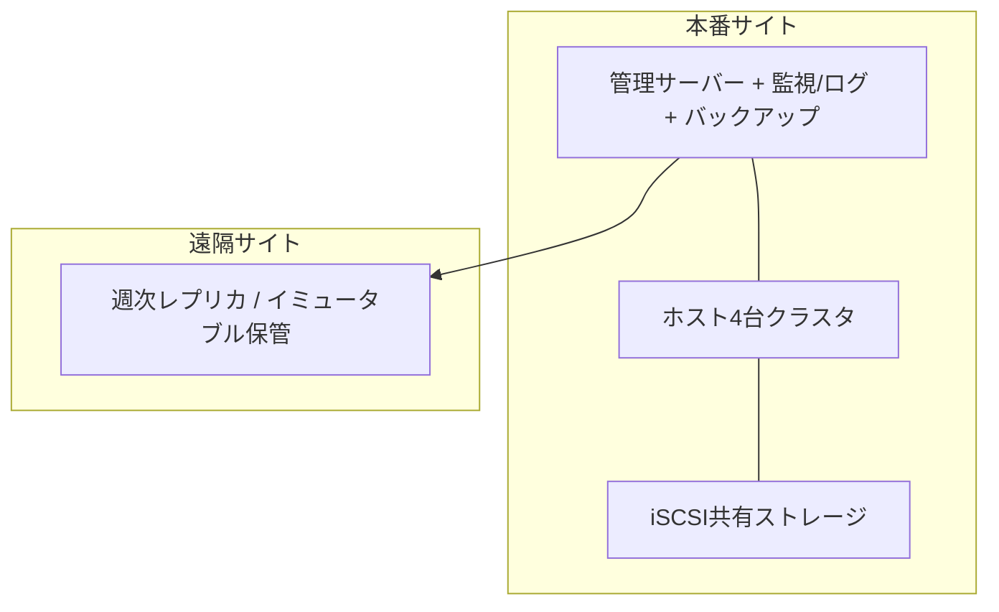

# 付録 用語集と確定設計サマリ

本書の用語の定義を一覧し、通貫シナリオの確定設計を一枚にまとめる。
本文の代替ではなく、検索と設計レビュー用の索引である。

---

## A. 用語集

### 基盤と実行単位

| 用語 | 定義 |
|------|------|
| 仮想化 | 物理資源を抽象化し、複数の実行環境が分割・共有できるようにする技術 |
| ハイパーバイザー | 仮想マシンに仮想ハードウェアを見せ、特権操作と資源を調停する基盤 |
| Type 1 | ハードウェア上で直接動作するハイパーバイザー |
| Type 2 | 一般OS上で動作するハイパーバイザー |
| ホスト | ハイパーバイザーが動作する側（物理サーバーなど） |
| ゲスト | 仮想マシン内のOSとアプリケーション |
| 仮想マシン（VM） | 仮想ハードウェア上の実行単位 |
| コンテナ | ホストOSカーネルを共有するOSレベル仮想化の実行単位 |

### CPUとメモリ

| 用語 | 定義 |
|------|------|
| vCPU | 仮想マシンに割り当てる仮想CPU |
| オーバーコミット | 割当合計が物理資源を超える状態または方針 |
| CPU Ready | vCPUが実行したいのに物理CPUを待てない時間・比率 |
| Co-Stop | 複数vCPUの同時実行制約により生じる待ち |
| NUMA / vNUMA | メモリ近接性を持つCPU区画、およびその仮想提示 |
| バルーニング | ゲスト内ドライバ経由でホストへメモリを返還させる仕組み |
| メモリスワップ（ホスト） | ハイパーバイザーがゲストメモリをディスクへ退避すること |

### ストレージと保護

| 用語 | 定義 |
|------|------|
| 仮想ディスク | VMに見えるディスク。実体はデータストア上のファイルや領域 |
| データストア | ハイパーバイザーが仮想ディスクを置く記憶領域の論理単位 |
| シン / シック | 使用分だけ確保 / 事前に確保するプロビジョニング |
| スナップショット | ある時点の差分記録。短期の戻し用。バックアップではない |
| バックアップ | 独立した復旧点の保管。世代管理と媒体分離を伴う |
| CBT | 変更ブロック追跡。増分バックアップを効率化する仕組み |
| RPO | 許容できるデータ損失時間 |
| RTO | 許容できる復旧時間 |
| イミュータブルバックアップ | 一定期間、改変・削除できないバックアップ |

### ネットワークと可用性

| 用語 | 定義 |
|------|------|
| 仮想スイッチ | ホスト内でvNICを接続する仮想的なスイッチ |
| ポートグループ | 仮想スイッチ上の接続ポリシーのまとまり |
| アップリンク | 仮想スイッチと物理NICを結ぶ経路 |
| HA | ホスト障害時などにVMを他ホストで再起動して復帰を目指す仕組み |
| ライブマイグレーション | 稼働中VMを他ホストへ移すこと |
| クォーラム | クラスタが「過半数」などで正当性を保つ仕組み |
| スプリットブレイン | 分断により複数側が同時に活性だと誤認する状態 |
| Admission Control | HA再起動に必要な予備資源を事前確保する制御 |
| N+1 | 1要素障害を吸収できる予備を持つ冗長の考え方 |

### クラウドとコンテナ

| 用語 | 定義 |
|------|------|
| IaaS | 仮想マシンや仮想ネットなど基盤を提供し、その上は利用者が管理 |
| PaaS | 実行基盤を提供し、アプリに近い層を利用者が管理 |
| SaaS | 完成アプリを提供し、利用者は主に利用と設定を担う |
| 可用性ゾーン（AZ） | クラウド内の独立した障害領域 |
| Namespace | コンテナの見え方（プロセス、ネット、マウントなど）を隔離する仕組み |
| cgroups | コンテナのCPU、メモリなどの資源制限を行う仕組み |

---

## B. 混同しやすい対比

| 対比 | 区別の要点 |
|------|------------|
| スナップショットとバックアップ | スナップショットは同一基盤上の差分。バックアップは独立した復旧点 |
| VMとコンテナ | VMはハード＋OS境界。コンテナはカーネル共有のプロセス境界 |
| HAとライブマイグレーション | HAは障害後の再起動復帰。ライブ移行は計画的な無停止寄りの移動 |
| クラッシュ整合性とアプリ整合性 | 電断相当の整合性か、アプリがフラッシュした整合性か |
| 理論値と実測値 | カタログや割当合計か、監視で観測した待ち・遅延・使用か |
| 平均とピーク | 時間平均が低くても、同時ピークで逼迫し得る |

---

## C. 通貫シナリオ 確定設計サマリ

### C.1 要件（確定）

| 項目 | 内容 |
|------|------|
| 初期VM | 30台（重要8、一般16、開発6） |
| 成長 | 2年で約1.5倍（45台想定） |
| 可用性 | 物理ホスト1台障害時も重要システム継続 |
| 保護 | 日次バックアップ、遠隔へ週次、RPO 24時間、RTO 8時間（仮） |
| 運用 | 監視、ログ、権限管理（RBAC、MFA） |
| ネットワーク | 管理、業務、ストレージ、マイグレーションを分離 |

### C.2 推奨構成（唯一解ではない）

| 領域 | 採用案 | 不採用（第一候補から外した案） | 主な理由 |
|------|--------|--------------------------------|----------|
| ホスト台数 | 4台クラスタ | 初期3台のみで成長まで固定 | 成長後の障害時CPUと保守同時耐性 |
| ストレージ | iSCSI共有 | 全DAS、安易な単一NFS | HAと移行の共有前提、運用の単純さ |
| ネットワーク | 4系統VLAN＋アップリンク冗長 | 1系統共有 | 帯域競合と管理面の露出を避ける |
| バックアップ | 日次イメージ＋週次遠隔 | スナップショット長期保持で代用 | 復旧点の独立性とランサム耐性 |
| デバイス | 準仮想化＋ゲストツール必須 | レガシーエミュレーション標準 | 性能と運用品質 |
| コンテナ | 必要業務のみVM上で併用 | 全面コンテナ置換を初期方針化 | 通貫シナリオはVM基盤が主 |

### C.3 サイジング結論（第13章）

前提の割り当て合計（初期）：

- vCPU合計：8×4 + 16×2 + 6×2 = 72
- メモリ合計：8×16 + 16×8 + 6×4 = 256 GB
- ディスク合計：8×200 + 16×100 + 6×80 = 3,680 GB

ホスト1台：論理32スレッド、メモリ512 GB。
データストア実効20 TB起算。

主要な判断：

1. メモリとストレージ容量は3台でも充足しやすい
2. 成長後、ホスト1台障害時のCPU比が厳しくなりやすい
3. したがって初期から **ホスト4台** を推奨する
4. 3台で始める場合は、Admission Controlを厳格化し、成長前に4台目を計画する

計算の前提、式、余裕率、障害時容量の詳細は第13章を正本とする。

### C.4 単一障害点（SPOF）と障害時挙動

| SPOF候補 | 緩和 | 障害時の挙動（要約） |
|----------|------|----------------------|
| 物理ホスト1台 | 4台＋HA＋予備資源 | 重要VMは他ホストで再起動。停止時間は再起動分発生し得る |
| 共有ストレージ全体 | 配列冗長、マルチパス、監視 | 全VMのI/O停止リスク。最優先の設計・監視対象 |
| 管理サーバー | 冗長または復旧手順 | 業務VMは動き続けても操作不能になり得る |
| バックアップサーバー / リポジトリ | 媒体分離、イミュータブル、遠隔 | 取得失敗が続くとRPO破綻。業務継続中でもインシデント |
| ネットワーク1系統化 | 4系統分離とアップリンク冗長 | 共有すると管理・ストレージ・移行が同時劣化する |

### C.5 運用で維持すべき最低ライン（第15章）

- 日常：死活、データストア空き、バックアップ成否、CPU Readyとストレージ遅延の異常
- 週次：遠隔世代の確認、スナップショット残存点検
- 月次：容量トレンド、権限レビュー、パッチ計画
- 四半期：HA試験、バックアップ復元、DR手順の机上または実地

---

## D. 章と成果物の対応

| 読了後にできること | 主に対応する章 |
|--------------------|----------------|
| 仮想化の利点と共有障害を説明できる | 1 |
| ハイパーバイザーと準仮想化を説明できる | 2 |
| CPU Readyと過剰vCPUの害を説明できる | 3 |
| メモリ逼迫の兆候を説明できる | 4 |
| スナップショットとバックアップを区別できる | 5, 9 |
| ネットワーク4系統分離を設計できる | 6, 14 |
| VMの標準ライフサイクルを定義できる | 7 |
| HAとライブ移行の違いを説明できる | 8 |
| RPO/RTOと復旧テストを設計できる | 9 |
| 管理プレーンを守る要件を書ける | 10 |
| VMとコンテナの適用を判断できる | 11 |
| オンプレとIaaSの責任分界を説明できる | 12 |
| 前提・式・余裕・障害時容量を示せる | 13 |
| 通貫シナリオの設計書を書ける | 14 |
| 三層で障害を切り分けられる | 15 |

---

## E. 改訂メモ

| 項目 | 内容 |
|------|------|
| 本書バージョン | 初版（通貫シナリオ確定構成を第13・14章に反映） |
| 正本の優先順位 | 各章本文 > 本付録の要約 > READMEの一行要約 |
| 数値の扱い | 通貫シナリオの数値は設計演習用。実案件では実測で置き換える |
