# 仮想化技術の基礎から実務設計まで（合本）

本ファイルは章ファイルを結合した通読用である。編集の正本は個別章ファイルとする。

生成時点の収録ファイル数: 19

---


<!-- source: README.md -->

# 仮想化技術の基礎から実務設計まで

製品操作ではなく、仮想化に共通する原理から、小規模基盤の設計、運用、障害対応までを扱う解説書です。

## 状態

**執筆完了**（目次、第1章〜第15章、用語集、合本、完了チェックリスト）。

要件充足の確認は [COMPLETE.md](COMPLETE.md)。

| 区分 | ファイル | おおよその規模 |
|------|----------|----------------|
| 章ファイル一式 | `00`〜`15`、`99` | 約11,200行 |
| 通読用合本 | [BOOK_FULL.md](BOOK_FULL.md) | 約11,300行 |
| 完了確認 | [COMPLETE.md](COMPLETE.md) | チェックリスト |

## 読み始め

1. [完了チェックリスト](COMPLETE.md)（要件充足の確認）
2. [詳細目次・到達目標・ハンズオン・シナリオ前提](00_mokuji.md)
3. [第1章 仮想化の全体像](01_virtualization_overview.md) から順読、または [合本](BOOK_FULL.md)
4. 設計の結論を一気に見る場合は [用語集と確定設計サマリ](99_glossary_and_design_summary.md)

## 章一覧

| 章 | 内容 | ファイル |
|----|------|----------|
| 目次 | 目的、読者、ハンズオン、通貫シナリオ、到達目標 | [00_mokuji.md](00_mokuji.md) |
| 1 | 仮想化の全体像 | [01_virtualization_overview.md](01_virtualization_overview.md) |
| 2 | ハイパーバイザー | [02_hypervisor.md](02_hypervisor.md) |
| 3 | CPU仮想化 | [03_cpu_virtualization.md](03_cpu_virtualization.md) |
| 4 | メモリ仮想化 | [04_memory_virtualization.md](04_memory_virtualization.md) |
| 5 | ストレージ仮想化 | [05_storage_virtualization.md](05_storage_virtualization.md) |
| 6 | ネットワーク仮想化 | [06_network_virtualization.md](06_network_virtualization.md) |
| 7 | 仮想マシンのライフサイクル | [07_vm_lifecycle.md](07_vm_lifecycle.md) |
| 8 | 可用性とクラスタ | [08_availability_cluster.md](08_availability_cluster.md) |
| 9 | バックアップと災害対策 | [09_backup_dr.md](09_backup_dr.md) |
| 10 | 仮想化基盤のセキュリティ | [10_security.md](10_security.md) |
| 11 | コンテナとの比較 | [11_containers.md](11_containers.md) |
| 12 | クラウドとの関係 | [12_cloud.md](12_cloud.md) |
| 13 | サイジングとキャパシティ管理 | [13_sizing_capacity.md](13_sizing_capacity.md) |
| 14 | 仮想化基盤の設計 | [14_design.md](14_design.md) |
| 15 | 運用とトラブルシューティング | [15_operations_troubleshooting.md](15_operations_troubleshooting.md) |
| 付録 | 用語集と確定設計サマリ | [99_glossary_and_design_summary.md](99_glossary_and_design_summary.md) |
| 合本 | 全章結合（通読用） | [BOOK_FULL.md](BOOK_FULL.md) |
| 完了確認 | 要件チェックリスト | [COMPLETE.md](COMPLETE.md) |

## 通貫シナリオ（結論の要約）

- 業務VM 30台（重要8）、2年で約45台
- 推奨：物理ホスト **4台** クラスタ（N+1、成長と保守を考慮）
- 共有ストレージ：iSCSI（代替はNFS、分散ストレージ）
- ネットワーク：管理 / 業務 / ストレージ / マイグレーションをVLAN分離
- バックアップ：日次イメージ、遠隔へ週次、RPO 24時間、RTO 8時間（仮）

詳細な採用理由、不採用案、トレードオフ、SPOF、障害時挙動は第14章と付録を参照してください。

## 各章の共通構成

1. 学習目標
2. 背景と動作原理
3. 構成図（Mermaidまたはテキスト）
4. 製品非依存の共通概念と代表製品の実装例
5. 設計判断、性能、セキュリティ
6. 障害例と切り分け
7. 章末問題、解答、ハンズオン

## 注意

- 理論値（カタログ、計算上の上限）と実測値（監視値）を混同しない
- スナップショットはバックアップではない
- 仮想マシンとコンテナは分離モデルが異なる
- 設計は唯一解ではなく、制約下の選択として記録する


---


<!-- source: COMPLETE.md -->

# 完了チェックリスト

本書（`virtualization_fundamentals/`）は、依頼要件に対して執筆完了している。

## 成果物

| 成果物 | パス | 状態 |
|--------|------|------|
| 入口 README | `README.md` | 完了 |
| 詳細目次・到達目標・ハンズオン・シナリオ前提 | `00_mokuji.md` | 完了 |
| 第1章〜第15章 | `01_*.md` 〜 `15_*.md` | 完了 |
| 用語集と確定設計サマリ | `99_glossary_and_design_summary.md` | 完了 |
| 通読用合本 | `BOOK_FULL.md` | 完了 |
| 本チェックリスト | `COMPLETE.md` | 完了 |

## 必須構成（15章）

- [x] 第1章 仮想化の全体像
- [x] 第2章 ハイパーバイザー
- [x] 第3章 CPU仮想化
- [x] 第4章 メモリ仮想化
- [x] 第5章 ストレージ仮想化（ストレージ障害の影響を含む）
- [x] 第6章 ネットワーク仮想化
- [x] 第7章 仮想マシンのライフサイクル
- [x] 第8章 可用性とクラスタ
- [x] 第9章 バックアップと災害対策
- [x] 第10章 仮想化基盤のセキュリティ
- [x] 第11章 コンテナとの比較
- [x] 第12章 クラウドとの関係
- [x] 第13章 サイジングとキャパシティ管理（前提・計算式・余裕率・障害時容量）
- [x] 第14章 仮想化基盤の設計（採用／不採用／トレードオフ／SPOF／障害時挙動）
- [x] 第15章 運用とトラブルシューティング

## 各章の共通要素

全章（第1〜15）で次を確認済み。

- [x] 学習目標
- [x] 背景（または同等の導入節）
- [x] 動作原理の説明
- [x] 構成図（Mermaid またはテキスト図）
- [x] 製品非依存の共通概念
- [x] 代表製品での実装例
- [x] 設計上の判断ポイント
- [x] 性能上の注意点
- [x] セキュリティ上の注意点
- [x] 障害例と切り分け
- [x] 章末問題
- [x] 解答と解説
- [x] ハンズオン演習
- [x] 本章のまとめ

## 実務シナリオ

- [x] 業務VM 30台、ホスト3台以上（推奨4台）
- [x] ホスト1台障害時も重要システム継続
- [x] 共有ストレージ（iSCSI第一候補）と分散ストレージの比較
- [x] 管理／業務／ストレージ／マイグレーションのネットワーク分離
- [x] 定期バックアップ（日次）と遠隔地保護（週次）
- [x] 監視、ログ、権限管理
- [x] 将来2年の増加を考慮
- [x] 採用理由、代替案、トレードオフ、SPOF、障害時挙動

## 区別の明示

- [x] スナップショット ≠ バックアップ
- [x] 仮想マシン ≠ コンテナ
- [x] 理論値 ≠ 実測値
- [x] 製品固有機能 ≠ 一般概念
- [x] オンプレ仮想化と IaaS の共通点／相違点

## 読み方

1. `README.md` または `00_mokuji.md`
2. 章ファイルを番号順、または `BOOK_FULL.md` で通読
3. 設計結論の再確認は `99_glossary_and_design_summary.md` と第13・14章


---


<!-- source: 00_mokuji.md -->

# 仮想化技術の基礎から実務設計まで

**執筆状態：完了**（第1章〜第15章、[用語集と確定設計サマリ](99_glossary_and_design_summary.md) を含む）

エントリは [README.md](README.md) からも辿れる。

## 本書の目的

読者が仮想化の仕組みを理解し、仮想マシン、ハイパーバイザー、仮想ネットワーク、仮想ストレージ、クラスタ、ライブマイグレーション、バックアップ、コンテナを体系的に説明できる状態になることを目指す。

さらに、小規模な仮想化基盤について、要件整理、サイジング、冗長化、構築、テスト、運用、障害対応を行える実務能力を身につける。

製品の操作手順ではなく、仮想化に共通する原理を軸に説明する。
VMware、Hyper-V、KVM の実装差は、共通概念を補強する比較として扱う。

## 想定読者

- 仮想化を初めて学ぶインフラエンジニア
- 仮想マシンの操作経験はあるが、内部構造を理解していない人
- VMware、Hyper-V、KVM の違いを整理したい人
- オンプレミス仮想化とクラウド（IaaS）の関係を整理したい人

## 解説方針

- 製品操作ではなく、仮想化に共通する原理を中心に説明する
- VMware、Hyper-V、KVM の実装例を必要に応じて比較する
- 利点だけでなく、制約と障害の波及範囲も説明する
- CPU、メモリ、ストレージ、ネットワークをレイヤー別に扱う
- 仮想マシンとコンテナを混同しない
- オンプレミス仮想化と IaaS の共通点と相違点を明示する
- 各章に構成図、実務例、障害例、演習を含める
- 製品固有機能と一般概念を区別する
- 理論値と実測値を区別する
- スナップショットとバックアップなど、混同されやすい概念を明示的に区別する

## 通貫シナリオ（実務設計課題）

本書では、次の小規模企業の仮想化基盤を一貫して用いる。
第13章から第15章で設計案を確定し、それ以前の各章では同じ前提を部分的に参照する。

### 業務要件

| 項目 | 内容 |
|------|------|
| 業務用仮想マシン | 30台（初期） |
| 重要システム | うち8台（ファイル、認証、業務AP、DB など） |
| 可用性 | 物理ホスト1台障害時も重要システムを継続 |
| 成長 | 2年間で VM 台数が約1.5倍（45台想定） |
| バックアップ | 定期バックアップ（日次）、遠隔地へ週次レプリケーション |
| 運用 | 監視、ログ収集、権限管理を必須とする |

### インフラ前提（設計時の初期値）

| 項目 | 前提値 | 備考 |
|------|--------|------|
| ハイパーバイザー | Type 1（ESXi / Hyper-V / KVM のいずれか） | 製品選定は第14章 |
| 物理ホスト | 3台以上（**推奨は4台**） | N+1。台数の確定は第13・14章 |
| ホストCPU | 2ソケット × 16コア（論理32スレッド） | 実測で再評価 |
| ホストメモリ | 512 GB | 管理オーバーヘッド込みでサイジング |
| 共有ストレージ | SAN（iSCSI）を第一候補 | NFS、分散ストレージは代替。第14章 |
| データストア容量 | 実効 20 TB 起算 | 成長余裕を別途。スナップショット長期保持はしない |
| ネットワーク分離 | 管理 / 業務 / ストレージ / マイグレーション | VLAN 分離を基本 |
| DR | 遠隔サイトへレプリケーション | RPO 24時間、RTO 8時間（仮） |

### 仮想マシン構成の仮置き

| 区分 | 台数 | vCPU | メモリ | ディスク | 備考 |
|------|------|------|--------|----------|------|
| 重要システム | 8 | 4 | 16 GB | 200 GB | HA 対象、バックアップ優先 |
| 一般業務 | 16 | 2 | 8 GB | 100 GB | 平日日中ピーク |
| 開発・検証 | 6 | 2 | 4 GB | 80 GB | 停止許容あり |

これらの数値は「設計の出発点」であり、確定値ではない。
第13章で計算式と余裕率を明示し、第14章で構成案を確定する。

### 通貫シナリオの全体構成（概略）

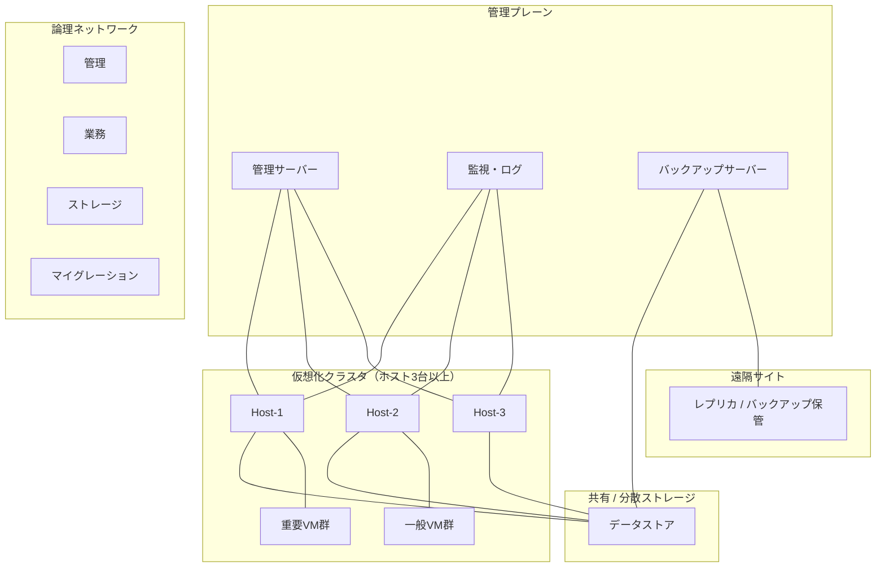
```mermaid
flowchart TB
  subgraph Mgmt["管理プレーン"]
    VC["管理サーバー"]
    MON["監視・ログ"]
    BAK["バックアップサーバー"]
  end

  subgraph Cluster["仮想化クラスタ（ホスト3台以上）"]
    H1["Host-1"]
    H2["Host-2"]
    H3["Host-3"]
    VM_C["重要VM群"]
    VM_G["一般VM群"]
  end

  subgraph Storage["共有 / 分散ストレージ"]
    DS["データストア"]
  end

  subgraph Net["論理ネットワーク"]
    N_MGMT["管理"]
    N_VM["業務"]
    N_ST["ストレージ"]
    N_MIG["マイグレーション"]
  end

  subgraph DR["遠隔サイト"]
    REPL["レプリカ / バックアップ保管"]
  end

  VC --- H1
  VC --- H2
  VC --- H3
  H1 --- DS
  H2 --- DS
  H3 --- DS
  H1 --- VM_C
  H2 --- VM_G
  BAK --- DS
  BAK --- REPL
  MON --- H1
  MON --- H2
  MON --- H3
```

### 設計で明示する判断軸

各設計判断には、次を必ず書く。

1. 採用案とその理由
2. 不採用とした代替案
3. トレードオフ（コスト、複雑さ、性能、可用性）
4. 単一障害点（SPOF）
5. 障害時の挙動（停止する／しない、復旧手順の概要）

---

## ハンズオン環境

製品非依存の原理理解を優先するため、学習環境は次の二系統を用意する。
読者は少なくとも一方を用意すれば、各章の演習を実施できる。

### 推奨構成 A：ネスト仮想化（ノートPC上）

| 項目 | 内容 |
|------|------|
| ホストOS | Windows 11 Pro / macOS / Linux |
| 外側ハイパーバイザー | VirtualBox、VMware Workstation/Fusion、Hyper-V、UTM など |
| 内側ゲスト | Linux（Ubuntu Server など）に KVM、または評価版 ESXi / Hyper-V |
| CPU | 4コア以上、仮想化支援（Intel VT-x / AMD-V）有効 |
| メモリ | 16 GB 以上（32 GB 推奨） |
| ディスク | 100 GB 以上の空き |
| 目的 | ハイパーバイザー、VM 作成、仮想スイッチ、スナップショットの体験 |

ネスト仮想化では性能が実環境と大きく異なる。
CPU Ready やストレージ遅延の「絶対値」は学習指標に使わず、相対比較と切り分け手順の練習に使う。

### 推奨構成 B：3ノード相当の検証クラスタ（ラボ）

| 項目 | 内容 |
|------|------|
| 物理またはネスト | ホスト3台（または3 VM） |
| 共有ストレージ | NFS、iSCSI（TrueNAS 等）、または Ceph / Gluster の簡易構成 |
| ネットワーク | 最低2系統（管理と業務）。可能なら4系統 |
| 管理 | vCenter / SCVMM / oVirt / Proxmox VE など |
| 目的 | HA、ライブマイグレーション、ネットワーク分離、バックアップ連携 |

### 演習で扱う共通成果物

各章のハンズオンは、次のいずれかまたは複数を成果物とする。

- 構成図（Mermaid またはテキスト）
- リソース配分表（vCPU、メモリ、ディスク、ネットワーク）
- 障害切り分けメモ（症状、層、確認コマンド、仮説、結果）
- 設計判断メモ（採用理由、不採用案、トレードオフ）

### 用語と表記の約束

- **ホスト**：ハイパーバイザーが動作する物理サーバー（またはネスト時の外側ゲスト）
- **ゲスト**：仮想マシン上で動作する OS とアプリケーション
- **仮想マシン（VM）**：ハイパーバイザーが提供する仮想ハードウェア上の実行単位
- **コンテナ**：ホスト OS のカーネルを共有する OS レベル仮想化の実行単位
- 製品固有の機能名は初出で製品名を添え、一般概念と区別する

---

## 詳細目次と各章の到達目標

### 第1章 仮想化の全体像

**到達目標**

1. 仮想化を「物理資源の抽象化と多重化」として説明できる
2. サーバー統合、利用率、分離性、可搬性の関係を説明できる
3. ホストとゲスト、物理環境と仮想環境の対応を図示できる
4. 仮想化で増える管理対象を列挙し、運用負荷の変化を説明できる
5. メリットとデメリットを、性能・障害波及・コストの観点で対比できる

**主要トピック**

仮想化とは何か / 背景 / サーバー統合 / ハードウェア利用率 / 分離性 / 可搬性 / 物理と仮想 / ホストとゲスト / 管理対象の増加 / メリットとデメリット

---

### 第2章 ハイパーバイザー

**到達目標**

1. Type 1 と Type 2 の違いを、特権レベルと用途で説明できる
2. ハイパーバイザーの役割（CPU・メモリ・I/O の調停）を説明できる
3. ESXi、Hyper-V、KVM、Xen の位置づけを比較できる
4. ハードウェア支援仮想化、特権命令、VM Exit の関係を説明できる
5. エミュレーションと準仮想化、ゲストツールの役割を区別できる

**主要トピック**

Type 1/2 / 役割 / ESXi / Hyper-V / KVM / Xen / ハードウェア支援 / 特権命令 / VM Exit / 仮想デバイス / エミュレーションと準仮想化 / ゲストツール

---

### 第3章 CPU仮想化

**到達目標**

1. vCPU と物理コア、スレッドの関係を説明できる
2. CPU スケジューリングとオーバーコミットの意味を説明できる
3. CPU Ready と Co-Stop の兆候を説明できる
4. NUMA / vNUMA、アフィニティ、予約・制限・共有を設計判断に使える
5. 過剰な vCPU 割り当てが性能を下げる理由を説明できる

**主要トピック**

vCPU / 物理CPU・コア・スレッド / スケジューリング / オーバーコミット / CPU Ready / Co-Stop / NUMA / vNUMA / アフィニティ / 予約・制限・共有 / サイジング / 過剰割当

---

### 第4章 メモリ仮想化

**到達目標**

1. ゲストメモリとハイパーバイザーのメモリ管理の二層構造を説明できる
2. オーバーコミット、バルーニング、共有、圧縮、スワップの発動順の考え方を説明できる
3. メモリ予約と NUMA の関係を設計に反映できる
4. メモリ不足時の性能劣化の症状を列挙できる
5. 実務シナリオ向けのメモリサイジングの出発点を計算できる

**主要トピック**

仮想メモリ / ゲストOSメモリ / ハイパーバイザー管理 / オーバーコミット / バルーニング / 共有 / 圧縮 / スワップ / 予約 / NUMA / 性能劣化 / サイジング

---

### 第5章 ストレージ仮想化

**到達目標**

1. 仮想ディスクとデータストアの関係を説明できる
2. DAS / SAN / NAS、FC / iSCSI / NFS を用途で選べる
3. シン / シック、スナップショット、クローンの違いを説明できる
4. IOPS、レイテンシ、キュー、マルチパスを性能切り分けに使える
5. スナップショットを長期間保持すべきでない理由を説明できる

**主要トピック**

仮想ディスク / データストア / ブロックとファイル / DAS・SAN・NAS / FC・iSCSI・NFS / シン・シック / スナップショット / クローン / IOPS / レイテンシ / キュー / マルチパス / 障害影響

---

### 第6章 ネットワーク仮想化

**到達目標**

1. 仮想NIC、仮想スイッチ、ポートグループ、VLAN、アップリンクの関係を図示できる
2. ホスト内通信と外部通信の経路差を説明できる
3. 管理・ストレージ・マイグレーション・業務ネットワークの分離理由を説明できる
4. オーバーレイ（VXLAN 概要）と SR-IOV の位置づけを説明できる
5. 仮想ネットワーク障害の切り分け手順を層別に説明できる

**主要トピック**

vNIC / vSwitch / ポートグループ / VLAN / アップリンク / チーミング / ホスト内・外部通信 / 用途別ネットワーク / オーバーレイ / VXLAN / SR-IOV / 切り分け

---

### 第7章 仮想マシンのライフサイクル

**到達目標**

1. 作成、テンプレート、クローンの使い分けを説明できる
2. 仮想ハードウェア変更（ホットアド含む）の制約を説明できる
3. 起動・停止・コンソール・ディスク拡張の運用手順の要点を説明できる
4. 廃棄時のデータ消去と構成ドリフトの問題を説明できる
5. ライフサイクル管理のチェックリストを作れる

**主要トピック**

作成 / テンプレート / クローン / ゲストOS / 仮想ハードウェア / 起動停止 / コンソール / ディスク拡張 / vCPU・メモリ変更 / ホットアド / 削除 / データ消去 / 構成ドリフト

---

### 第8章 可用性とクラスタ

**到達目標**

1. 単一ホスト障害とクラスタによる緩和を説明できる
2. HA、ライブマイグレーション、ストレージマイグレーションの違いを説明できる
3. ハートビート、クォーラム、スプリットブレインの関係を説明できる
4. Admission Control、N+1、アンチアフィニティを設計に使える
5. 「VM が停止するケース」と「停止しないケース」を区別できる

**主要トピック**

単一ホスト障害 / クラスタ / HA / ライブマイグレーション / ストレージマイグレーション / フェイルオーバー / ハートビート / クォーラム / スプリットブレイン / アンチアフィニティ / Admission Control / N+1

---

### 第9章 バックアップと災害対策

**到達目標**

1. ゲスト内バックアップとハイパーバイザーレベルバックアップを比較できる
2. クラッシュ整合性とアプリケーション整合性を区別できる
3. スナップショットとバックアップの違いを明確に説明できる
4. RPO / RTO、レプリケーション、DR、復旧テストの関係を説明できる
5. ランサムウェア対策とイミュータブルバックアップの要点を説明できる

**主要トピック**

ゲスト内 / ハイパーバイザーレベル / イメージ / CBT / 整合性 / スナップショットとの違い / レプリケーション / DR / RPO / RTO / 復旧テスト / ランサムウェア / イミュータブル

---

### 第10章 仮想化基盤のセキュリティ

**到達目標**

1. 管理プレーンとデータプレーンの分離を説明できる
2. ハイパーバイザー脆弱性と管理ネットワーク分離の重要性を説明できる
3. 最小権限、多要素認証、ログ監査の運用要件を列挙できる
4. セキュアブート、仮想TPM、テンプレート安全性の要点を説明できる
5. パッチ管理を可用性制約と両立させる考え方を説明できる

**主要トピック**

管理・データプレーン / 脆弱性 / 管理網分離 / 最小権限 / MFA / ログ監査 / セキュアブート / vTPM / テンプレート / VM間分離 / パッチ

---

### 第11章 コンテナとの比較

**到達目標**

1. OSレベル仮想化としてのコンテナの仕組みを説明できる
2. Namespace、cgroups、イメージ、ランタイムの役割を説明できる
3. VM とコンテナを、分離性・起動速度・可搬性・永続ストレージで比較できる
4. Kubernetes の位置づけを概要レベルで説明できる
5. 「VM 上でコンテナを動かす」構成の適用領域を判断できる

**主要トピック**

OSレベル仮想化 / コンテナ / イメージ / ランタイム / Namespace / cgroups / VMとの違い / 起動速度 / 分離性 / 可搬性 / 永続ストレージ / Kubernetes / 適用判断

---

### 第12章 クラウドとの関係

**到達目標**

1. IaaS / PaaS / SaaS の責任範囲を説明できる
2. クラウドVM、インスタンスタイプ、仮想ネット、仮想ストレージの対応関係を説明できる
3. 可用性ゾーンとオンプレミスのクラスタ概念を対応づけられる
4. 責任分界、オートスケール、従量課金の設計への影響を説明できる
5. オンプレミス仮想基盤との共通点と相違点を対比できる

**主要トピック**

IaaS・PaaS・SaaS / クラウドVM / インスタンスタイプ / 仮想ネット・ストレージ / AZ / 責任分界 / オートスケール / 従量課金 / 比較

---

### 第13章 サイジングとキャパシティ管理

**到達目標**

1. 現状分析から CPU / メモリ / ストレージ / ネットワークの必要量を見積もれる
2. オーバーコミット率、成長率、HA予備、管理オーバーヘッドを計算に含められる
3. ピークと平均を混同しないサイジングができる
4. 前提条件、計算式、余裕率、障害時容量を明示した計算例を示せる
5. スケールアップとスケールアウトの選択基準を説明できる

**主要トピック**

現状分析 / CPU・メモリ・容量・IOPS・帯域 / オーバーコミット / 成長率 / HA予備 / 管理オーバーヘッド / ピークと平均 / 監視 / スケール

---

### 第14章 仮想化基盤の設計

**到達目標**

1. 機能要件と非機能要件を分離して整理できる
2. ホスト台数、クラスタ、ネットワーク分離、ストレージ、管理サーバーを一貫設計できる
3. バックアップ、監視、ログ、セキュリティ、ライセンス、保守を設計に含められる
4. 拡張計画と移行計画を段階的に示せる
5. 通貫シナリオについて、採用理由・代替案・トレードオフ・SPOF・障害時挙動を文書化できる

**主要トピック**

要件定義 / 機能・非機能 / ホスト台数 / クラスタ / ネットワーク / ストレージ / 管理 / バックアップ / 監視・ログ / セキュリティ / ライセンス・保守 / 拡張・移行

---

### 第15章 運用とトラブルシューティング

**到達目標**

1. 代表的な障害症状を、物理層・仮想層・ゲストOS層に切り分けられる
2. CPU Ready、メモリスワップ、データストア逼迫、スナップショット肥大の対処方針を説明できる
3. 仮想NIC不通、ホスト管理不能、HA不動作、マイグレーション失敗、バックアップ失敗の確認点を列挙できる
4. 切り分けメモの型（症状→仮説→確認→結果→次アクション）を使える
5. 通貫シナリオの運用チェックリストを作成できる

**主要トピック**

起動しない / 遅い / CPU Ready / スワップ / 容量不足 / スナップショット肥大 / ストレージ遅延 / NIC不通 / ホスト管理不能 / HA / マイグレーション / バックアップ / 三層切り分け

---

## 章ファイル一覧

| 章 | ファイル | 状態 |
|----|----------|------|
| README | `README.md` | 完了 |
| 目次・前提 | `00_mokuji.md` | 完了 |
| 第1章 | `01_virtualization_overview.md` | 完了 |
| 第2章 | `02_hypervisor.md` | 完了 |
| 第3章 | `03_cpu_virtualization.md` | 完了 |
| 第4章 | `04_memory_virtualization.md` | 完了 |
| 第5章 | `05_storage_virtualization.md` | 完了 |
| 第6章 | `06_network_virtualization.md` | 完了 |
| 第7章 | `07_vm_lifecycle.md` | 完了 |
| 第8章 | `08_availability_cluster.md` | 完了 |
| 第9章 | `09_backup_dr.md` | 完了 |
| 第10章 | `10_security.md` | 完了 |
| 第11章 | `11_containers.md` | 完了 |
| 第12章 | `12_cloud.md` | 完了 |
| 第13章 | `13_sizing_capacity.md` | 完了 |
| 第14章 | `14_design.md` | 完了 |
| 第15章 | `15_operations_troubleshooting.md` | 完了 |
| 付録 | `99_glossary_and_design_summary.md` | 完了 |

## 読み方

1. まず本ファイルで全体像、ハンズオン環境、通貫シナリオを把握する
2. 第1章から順に読み、各章末の問題とハンズオンを実施する
3. 第13章で通貫シナリオの数値を確定し、第14章で構成案を固める
4. 第15章で運用と障害対応の型を身につける
5. 復習や設計レビューでは [付録](99_glossary_and_design_summary.md) の用語集と確定設計サマリを使う

## 通貫シナリオの設計結論（要約）

詳細は第13章、第14章、付録を正本とする。

| 判断 | 結論 |
|------|------|
| ホスト台数 | **4台推奨**（3台は厳格なAdmission Control前提の代替） |
| ストレージ | iSCSI共有を第一候補 |
| ネットワーク | 管理 / 業務 / ストレージ / マイグレーションを分離 |
| バックアップ | 日次イメージ、遠隔週次。スナップショット長期保持で代用しない |
| 各判断の記録 | 採用理由、不採用案、トレードオフ、SPOF、障害時挙動を文書化 |

理論値（カタログ値、計算上の上限）と実測値（モニタリングで得た値）を混同しないこと。
設計判断は「正しい唯一解」ではなく、制約下の選択として記録すること。


---


<!-- source: 01_virtualization_overview.md -->

# 第1章 仮想化の全体像

## 学習目標

1. 仮想化を「物理資源の抽象化と多重化」として説明できる
2. サーバー統合、利用率、分離性、可搬性の関係を説明できる
3. ホストとゲスト、物理環境と仮想環境の対応を図示できる
4. 仮想化で増える管理対象を列挙し、運用負荷の変化を説明できる
5. メリットとデメリットを、性能・障害波及・コストの観点で対比できる

---

## 1.1 仮想化とは何か

1台の物理サーバーに、OSを1つだけ載せる運用はわかりやすい。
わかりやすいが、そのサーバーのCPU使用率が常に5%前後なら、残りの95%は待機していることになる。

ここで問われるのは、「余っている資源を、別の仕事に使えないか」である。
答えの一つが仮想化である。

**仮想化（virtualization）**とは、物理的な計算資源（CPU、メモリ、ディスク、ネットワーク）を抽象化し、複数の実行環境がそれらを共有・分割できるようにする技術である。
本書が主に扱うのは、1台の物理サーバー上に複数の**仮想マシン（VM: Virtual Machine）**を動作させるサーバー仮想化である。

仮想マシンから見ると、あたかも専用の物理サーバーがあるように見える。
実際には、その下で**ハイパーバイザー（hypervisor）**が物理資源を調停している。

```text
+-----------------------------------------------+
| 仮想マシンA        仮想マシンB      仮想マシンC |
| (ゲストOS+アプリ)  (ゲストOS+アプリ) (ゲストOS+アプリ) |
+-----------------------------------------------+
|              ハイパーバイザー                   |
+-----------------------------------------------+
|     物理サーバー（CPU / メモリ / ディスク / NIC） |
+-----------------------------------------------+
```

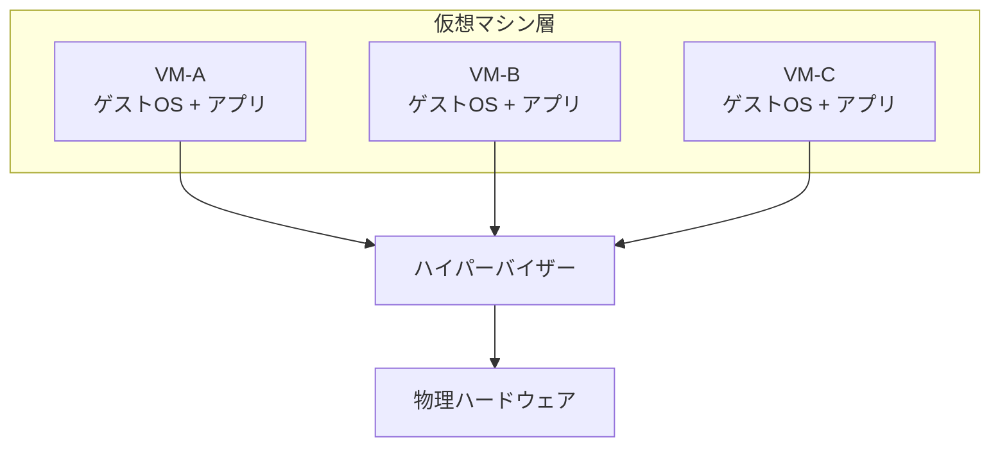
```mermaid
flowchart TB
  subgraph Guests["仮想マシン層"]
    VMA["VM-A<br/>ゲストOS + アプリ"]
    VMB["VM-B<br/>ゲストOS + アプリ"]
    VMC["VM-C<br/>ゲストOS + アプリ"]
  end

  HV["ハイパーバイザー"]
  HW["物理ハードウェア"]

  VMA --> HV
  VMB --> HV
  VMC --> HV
  HV --> HW
```

仮想化は「魔法でサーバーを増やす技術」ではない。
物理資源の上限は変わらない。
変わるのは、その上限の見せ方と割り当て方である。

---

## 1.2 仮想化が必要になった背景

2000年代前後の企業データセンターでは、業務システムごとに物理サーバーを用意する構成が一般的だった。
理由は単純で、アプリケーション同士の干渉を避け、障害範囲を閉じたかったからである。

その結果、次の問題が積み上がった。

- サーバー台数が増え、設置スペース、電力、冷却コストが増える
- 各サーバーの平均CPU使用率、メモリ使用率が低い
- 調達から稼働までのリードタイムが長い
- ハード障害時の切り替えが、物理入れ替えに依存しやすい

サーバー統合の圧力は、コスト削減だけから来たわけではない。
変更速度への要求も同時に上がっていた。
新しい検証環境を「来月の調達」では間に合わない場面が増えた。

仮想化は、この二つの圧力（利用率の低さと変更速度の遅さ）に対する実務的な応答だった。

---

## 1.3 サーバー統合

**サーバー統合（server consolidation）**とは、複数の物理サーバー上で動いていたワークロードを、少数の物理ホスト上の仮想マシンへ集約することである。

統合の単位は「サーバー台数」ではなく、「ワークロード」である。
ファイルサーバー、認証サーバー、業務アプリ、開発用Webサーバーは、それぞれ別の仮想マシンとして残しつつ、物理ホストは共有する。

実務例（通貫シナリオの縮図）を考える。

| 統合前 | 統合後（概念） |
|--------|----------------|
| 物理サーバー30台 | 物理ホスト3〜4台 + VM30台 |
| 各サーバーに電源・保守契約 | ホスト単位の保守 + VM単位の運用 |
| 空きラックが逼迫 | ラック占有が減少 |

統合比（consolidation ratio）は「物理1台あたり何VMか」で語られることが多い。
ただし、これは結果指標であって設計目標ではない。
CPU Ready やメモリ逼迫を無視して統合比だけ上げると、統合は成功に見えて業務は遅くなる。

---

## 1.4 ハードウェア利用率

仮想化の第一の経済合理性は、利用率の改善にある。

物理1台・業務1システムの構成では、ピークに合わせて調達するため、平均利用率が低くなる。
仮想化では、ピーク時間帯がずれるワークロードを同居させ、物理資源の平均利用率を上げられる。

ここで区別すべきは次の二つである。

- **理論上の利用率**：カタログ上のCPUコア数やメモリ容量に対する割当比率
- **実測の利用率**：実際に観測された使用率、待ち時間、スワップ発生など

設計会議で「CPUは40%しか使っていないからまだ載せられる」と言いたくなる。
しかし、その40%が特定の時間帯に集中し、同居VMのピークが重なれば、平均は低くても体感は遅い。

利用率の議論は、必ず時間軸（平均、ピーク、95パーセンタイル）を添える。

---

## 1.5 分離性

仮想化が受け入れられたもう一つの理由は、分離性である。

**分離性（isolation）**とは、ある仮想マシンの障害や負荷、セキュリティ侵害が、他の仮想マシンへ波及しにくい性質を指す。
理想的には、各VMは独自のOS、独自の障害領域、独自の権限境界を持つ。

ただし、分離は完全ではない。

| 分離されるもの | 共有されるもの |
|----------------|----------------|
| ゲストOSのプロセス空間 | 物理CPU、物理メモリ、物理NIC、ストレージパス |
| 多くの設定と障害 | ハイパーバイザー、ホスト障害、共有ストレージ障害 |

「仮想化すれば完全に独立」と考えると設計を誤る。
分離性はゲスト間では強いが、ホストと共有基盤では弱い。
この非対称が、後章のHA設計とストレージ設計の出発点になる。

---

## 1.6 可搬性

**可搬性（portability）**とは、仮想マシンを、ある物理ホストから別の物理ホストへ移しやすい性質である。

仮想マシンは、仮想ハードウェア定義と仮想ディスクというまとまりとして扱える。
そのため、次が可能になる。

- ホスト保守前にVMを別ホストへ移す
- 負荷分散のために配置を変える
- テンプレートから同型環境を複製する

可搬性は「どこへでも無条件に移せる」意味ではない。
CPU互換性、仮想ハードウェアバージョン、ストレージ接続、ネットワーク接続が前提になる。
ライブマイグレーション（第8章）は、この可搬性を稼働中に使う機能である。

---

## 1.7 物理環境と仮想環境

物理環境と仮想環境は、対応関係で理解すると混乱が減る。

| 物理環境 | 仮想環境での対応 |
|----------|------------------|
| 物理サーバー | ホスト（ハイパーバイザーが動作） |
| 物理NIC | アップリンクNIC + 仮想スイッチ |
| 物理ディスク / LUN / 共有フォルダ | データストア |
| サーバー上のOS | ゲストOS |
| サーバーの電源操作 | VMの電源操作（ただしホスト電源とは別） |

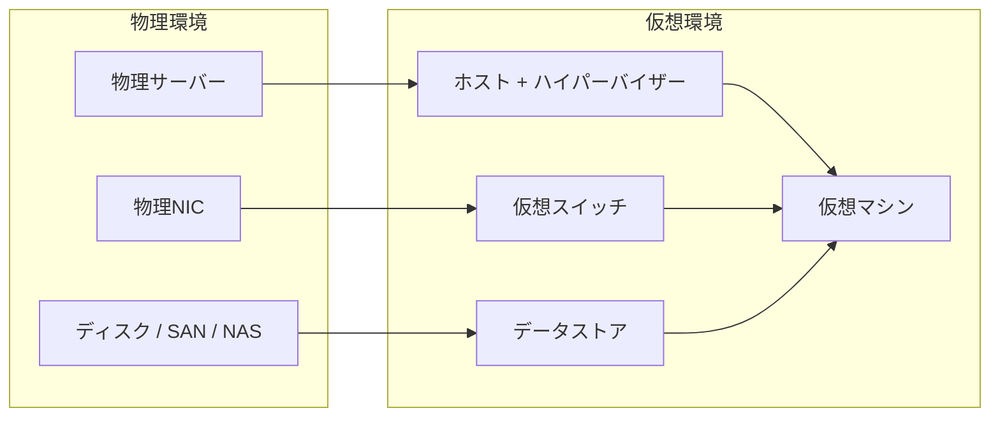
```mermaid
flowchart LR
  subgraph Physical["物理環境"]
    PSRV["物理サーバー"]
    PNIC["物理NIC"]
    PDISK["ディスク / SAN / NAS"]
  end

  subgraph Virtual["仮想環境"]
    HOST["ホスト + ハイパーバイザー"]
    VSW["仮想スイッチ"]
    DS["データストア"]
    VM["仮想マシン"]
  end

  PSRV --> HOST
  PNIC --> VSW
  PDISK --> DS
  HOST --> VM
  VSW --> VM
  DS --> VM
```

混同しやすい点がある。
仮想マシンの「再起動」はゲストOSの再起動であり、ホストの再起動ではない。
ホストの再起動は、その上の全VMに影響する。
操作対象の層を間違えると、影響範囲の見積もりが狂う。

---

## 1.8 ホストとゲスト

**ホスト（host）**は、ハイパーバイザーが動作し、物理資源を持つ側である。
**ゲスト（guest）**は、仮想マシン上で動作するOSと、その上のアプリケーションである。

用語の揺れに注意する。

- 「ホストOS」：Type 2 ハイパーバイザーでは、ハイパーバイザーを載せる一般OSを指すことがある
- Type 1 では、ハイパーバイザー自体が薄い基盤としてハードウェア上で動作する（第2章）

本書では特に断らない限り、次の用法で統一する。

- ホスト：物理サーバー側（ハイパーバイザー動作環境）
- ゲスト：仮想マシン内のOS
- VM：仮想マシン全体（仮想ハードウェア + ゲスト）

通貫シナリオでは、ホスト3台以上の上にゲスト（業務VM）30台が載る。
障害対応では、「遅いのはゲストか、ホストか、共有ストレージか」を最初に切り分ける。

---

## 1.9 仮想化によって増える管理対象

仮想化は管理対象を減らすように見えて、実は増やす。
減るのは主に物理筐体の数であり、増えるのは論理オブジェクトである。

増える管理対象の例は次のとおりである。

- ハイパーバイザーとパッチレベル
- クラスタ設定、HA、DRS/負荷分散相当の方針
- データストア、仮想ディスク、スナップショット
- 仮想スイッチ、ポートグループ、VLAN対応
- テンプレート、クローン、仮想ハードウェアバージョン
- 権限（誰がどのVMを操作できるか）
- バックアップジョブと整合性レベル
- 監視メトリクス（CPU Ready、スワップ、データストア遅延など）

```text
物理だけの世界:
  サーバー / OS / アプリ / スイッチ / ストレージ

仮想化後:
  上記に加えて
  ハイパーバイザー / クラスタ / VM定義 / 仮想ディスク /
  仮想NIC / スナップショット / テンプレート / 配置ルール
```

運用負荷は「台数」ではなく「状態の組み合わせ」で増える。
スナップショットを残したままテンプレートを更新し、古い仮想ハードウェアのままクローンを量産する、といったドリフトが典型である（第7章）。

設計上の判断ポイントは明確である。
仮想化を入れるなら、管理プレーン（監視、構成管理、権限、バックアップ）への投資を同時に見積もる。
ハイパーバイザーだけ導入して管理を後回しにすると、統合の利益より運用事故のコストが先に来る。

---

## 1.10 仮想化のメリットとデメリット

### メリット

- **利用率向上**：ピークがずれるワークロードを同居させ、物理資源を有効利用できる
- **分離性**：OS単位の境界を維持したまま集約できる
- **可搬性**：保守、負荷分散、複製がしやすい
- **迅速なプロビジョニング**：テンプレートから短時間で環境を作れる
- **可用性機能の土台**：HAやライブマイグレーションの前提になる
- **ハードウェア抽象化**：ゲストを特定筐体に固定しにくい

### デメリットと制約

- **障害の影響範囲が広がる**：ホスト障害や共有ストレージ障害が多VMに波及する
- **性能の見え方が複雑になる**：ゲスト内CPU使用率が低くても、CPU Ready で待っていることがある
- **管理対象が増える**：論理構成の複雑さが増す
- **ライセンスとスキル**：ハイパーバイザー、管理ソフト、バックアップ連携のコストと習熟が必要
- **過度な統合のリスク**：オーバーコミットの設計ミスが静かに性能を削る
- **ネストした障害解析**：物理層、仮想層、ゲスト層の切り分けが必要になる

### 製品比較ではなく原理としての対比

| 観点 | 物理1システム1サーバー | 仮想化集約 |
|------|------------------------|------------|
| 平均利用率 | 低くなりやすい | 上げやすい |
| 障害の単位 | 筐体単位で閉じやすい | ホスト/ストレージ単位で広がりやすい |
| 構築速度 | 調達依存 | テンプレート次第で速い |
| 性能解析 | 比較的単純 | 待ち時間指標が必要 |
| 初期コスト | 台数に比例 | 集約基盤への投資が必要 |

### セキュリティ上の注意点（概要）

仮想化は境界を増やすと同時に、突破時の価値も高める。
ハイパーバイザーや管理ネットワークが侵害されると、多数のVMが同時に危険に晒される。
詳細は第10章で扱うが、第1章の段階では次だけ押さえる。

- 管理界面は業務ネットワークから分離する
- 「VM間は分離されている」を過信しない
- テンプレートに秘密情報を埋め込まない

### 性能上の注意点（概要）

仮想化のオーバーヘッド自体は、現代のハードウェア支援仮想化では多くの業務で許容範囲になる。
問題になりやすいのはオーバーヘッドそのものより、資源の奪い合いである。

- CPUオーバーコミット過多
- メモリ逼迫によるスワップ
- データストアのIOPS不足
- バックアップやスキャンがピークと重なる

---

## 1.11 障害例と切り分け

### 障害例1：仮想化したのに「全体が同時に止まった」

**症状**：業務VMの半数以上が同時に応答停止した。

**よくある誤解**：仮想化が不安定だから元の物理構成に戻すべきだ。

**切り分けの視点**：

1. 特定ホスト上のVMだけか、全ホストか
2. 共有データストアの遅延やパス断がないか
3. 管理ネットワーク障害で「止まって見える」だけではないか

**典型原因**：共有ストレージのコントローラ障害、データストア満杯、ホストのカーネルパニック相当。
仮想化が原因というより、共有点に単一障害点が残っていた可能性が高い。

### 障害例2：新しいVMを追加したら既存VMが遅くなった

**症状**：追加直後から既存業務が遅い。ゲスト内CPU使用率は高くない。

**確認点**：

- ホストのCPU Ready（または同等指標）
- メモリのバルーン、スワップ
- データストアレイテンシ

**典型原因**：統合比だけを見て資源余裕を確認しなかった。
第3章から第5章の指標がここで効く。

### 障害例3：開発VMのスナップショットが本番を圧迫した

**症状**：データストア使用率が急増し、本番VMのディスクI/Oが遅延。

**典型原因**：検証目的のスナップショットを長期間保持し、差分が肥大化した。
スナップショットはバックアップではない（第5章、第9章）。

---

## 1.12 設計上の判断ポイント（通貫シナリオへの接続）

通貫シナリオ（VM30台、ホスト3台以上、ホスト1台障害耐性）を前提に、第1章で決めておく判断は次である。

| 判断 | 採用の方向 | 不採用案 | 理由とトレードオフ |
|------|------------|----------|--------------------|
| 集約方針 | 少数ホストへ統合 | 重要システムだけ物理残留 | 統合で運用を揃える。物理残留は障害モデルが二重管理になる |
| 分離の単位 | OS/アプリはVM単位 | 1VMに多業務を詰め込む | 分離性を維持。詰め込みすぎると障害影響と変更影響が拡大 |
| 管理投資 | 監視・権限・バックアップを初期要件へ | まずハイパーバイザーだけ | 管理対象増を前提にしないと運用事故が先行する |

単一障害点の意識も、この章から始める。
物理サーバーを減らすと、残ったホストと共有ストレージの重要度が上がる。
統合はコスト最適化であると同時に、影響範囲の再設計でもある。

---

## 章末問題

### 問題1

仮想化を「物理サーバーをソフトウェアで増やす技術」と説明した同僚がいる。
この説明のどこが不正確か。より正確な定義を述べよ。

### 問題2

サーバー統合によって平均CPU使用率が上がった。
それでもピーク時に業務が遅くなる可能性がある理由を、時間軸の観点から説明せよ。

### 問題3

次の事象が起きたとき、影響が「1VMに閉じやすい」ものと「多VMに波及しやすい」ものに分類せよ。

1. ゲストOS上のアプリケーションクラッシュ
2. 共有データストアのパス断
3. 特定VMのvCPU過剰割当によるCPU Ready上昇（同居VMへの影響を含む）
4. ゲスト内の誤ったファイアウォール設定

### 問題4

仮想化によって減る管理対象と増える管理対象を、それぞれ3つ以上挙げよ。

### 問題5

通貫シナリオでホストを3台にする目的を、「台数が多いほど良い」以外の言葉で説明せよ。

---

## 解答と解説

### 問題1

不正確な点は、物理資源の上限が増えるかのような含意である。
より正確には、仮想化は物理資源を抽象化し、複数の実行環境がそれを分割・共有できるようにする技術である。
見えるサーバー数は増えても、物理CPUや物理メモリの総量は増えない。

### 問題2

平均使用率は時間平均であり、ピークの重なりを表さない。
同居VMのピークが同時刻に重なると、平均が低くてもCPU待ちやI/O待ちが発生する。
利用率改善とピーク耐性は別問題である。

### 問題3

1. 1VMに閉じやすい
2. 多VMに波及しやすい
3. 多VMに波及しやすい（ホストCPUの奪い合い）
4. 1VMに閉じやすい（通信先への影響はあるが、仮想化基盤全体の共有障害ではない）

### 問題4

減る例：物理筐体数、物理電源口、個別サーバーのキッティング台数。
増える例：VM定義、仮想ディスク、スナップショット、仮想スイッチ、クラスタ設定、テンプレート、配置ルール、仮想化固有メトリクス。

### 問題5

ホスト1台障害時に、残るホストで重要システムを継続するためである。
N+1（または同等）の予備容量を持つことが目的であり、単なる台数増加ではない。
詳細な計算は第8章、第13章で扱う。

---

## ハンズオン演習

### 演習1：対応表を作る

自分の学習環境（ネスト仮想化またはラボ）について、次の対応表を埋めよ。

| 物理 / 外側 | 仮想 / 内側 | 備考 |
|-------------|-------------|------|
| 物理CPU | | |
| 物理メモリ | | |
| 物理NIC | | |
| ディスク | | |
| ホスト | | |
| ゲスト | | |

### 演習2：統合前後の差分を書く

架空でもよいので、物理6台を仮想化でホスト2台へ統合する前後を比較し、次を記述せよ。

1. 減るもの
2. 増えるもの
3. 新たに監視すべき指標候補

### 演習3：通貫シナリオの影響範囲メモ

ホスト1台が停止したとき、次がどうなるかを現時点の知識で仮説として書け。

1. そのホスト上のVM
2. 他ホスト上のVM
3. 共有ストレージ上のデータ
4. 管理界面

第8章以降で仮説を検証し、修正する。

### 成果物

- 対応表
- 統合差分メモ
- 影響範囲の仮説メモ

---

## 本章のまとめ

仮想化は、物理資源を増やさずに、抽象化と多重化によって使い方を変える技術である。
サーバー統合は利用率を上げるが、共有点への依存も強める。
分離性と可搬性は仮想化の強みだが、ホストと共有ストレージの障害モデルを同時に設計しない限り、強みは弱点に転ぶ。

次に必要になるのは、この多重化を実際に調停している存在、ハイパーバイザーの理解である。


---


<!-- source: 02_hypervisor.md -->

# 第2章 ハイパーバイザー

## 学習目標

1. Type 1 と Type 2 の違いを、特権レベルと用途で説明できる
2. ハイパーバイザーの役割（CPU・メモリ・I/O の調停）を説明できる
3. ESXi、Hyper-V、KVM、Xen の位置づけを比較できる
4. ハードウェア支援仮想化、特権命令、VM Exit の関係を説明できる
5. エミュレーションと準仮想化、ゲストツールの役割を区別できる

---

## 2.1 なぜハイパーバイザーが必要か

第1章で見た仮想マシンは、勝手には動かない。
複数のゲストが同じ物理CPU、同じ物理メモリ、同じ物理NICを使おうとするため、調停役が必要になる。

その調停役が**ハイパーバイザー**である。
別名を VMM（Virtual Machine Monitor）と呼ぶこともある。

ハイパーバイザーの仕事は、次の三つに要約できる。

1. 仮想マシンに仮想ハードウェアを見せる
2. ゲストの特権的な操作を捕捉し、安全に処理する
3. 物理資源の割り当てとスケジューリングを行う

ゲストOSは、自分が仮想化されていることを必ずしも知らなくてよい。
知らなくても動くように見せるのが、古典的なハイパーバイザーの目標だった。
現代では、知っているほうが速い場面も多い。その差が、エミュレーションと準仮想化の差になる。

---

## 2.2 Type 1 と Type 2

ハイパーバイザーは、動作位置によって大きく二つに分類される。

### Type 1（ベアメタル型）

ハードウェア上で直接動作する。
その上に仮想マシンを載せる。

```text
+--------+  +--------+  +--------+
|  VM-A  |  |  VM-B  |  |  VM-C  |
+--------+  +--------+  +--------+
|         Type 1 ハイパーバイザー  |
+--------------------------------+
|           物理ハードウェア       |
+--------------------------------+
```

用途の中心は、データセンターや企業の本番仮想化基盤である。
通貫シナリオの本番基盤は、原則として Type 1 を選ぶ。

### Type 2（ホスト型）

一般的なOS（ホストOS）の上に、アプリケーションとして載る。

```text
+--------+  +--------+
|  VM-A  |  |  VM-B  |
+--------+  +--------+
|   Type 2 ハイパーバイザー       |
+--------------------------------+
|           ホストOS              |
+--------------------------------+
|           物理ハードウェア       |
+--------------------------------+
```

用途の中心は、開発者のノートPC、検証、ネスト実験である。
VirtualBox や VMware Workstation/Fusion が典型である。

### 比較

| 観点 | Type 1 | Type 2 |
|------|--------|--------|
| 配置 | ハードウェア直上 | ホストOS上 |
| 典型用途 | 本番サーバ仮想化 | PC上の検証・開発 |
| 管理モデル | 集中管理前提が多い | 単機利用が多い |
| オーバーヘッド | 相対的に小さい設計 | ホストOS分が乗る |
| 本書の通貫シナリオ | 採用側 | 学習用に併用 |

境界は教科書ほど綺麗ではない。
Hyper-V は Windows 上に見えるが、実際の制御は特権的なハイパーバイザー層が担う。
分類名より、「誰がハードウェアを最終制御するか」を見るほうが実務的である。

---

## 2.3 ハイパーバイザーの役割

ハイパーバイザーは、次を調停する。

### CPU

どのVMのどのvCPUを、どの物理論理CPUで、いつ実行するかを決める。
詳細は第3章。

### メモリ

ゲストが使う物理メモリの見え方（ゲスト物理アドレス）と、実ホストのマシン物理アドレスを対応づける。
詳細は第4章。

### ストレージI/O

仮想ディスクへの読み書きを、データストア上のファイルやLUN上の領域へ変換する。
詳細は第5章。

### ネットワークI/O

仮想NICの送受信を、仮想スイッチ経由で物理NICや他VMへ転送する。
詳細は第6章。

### ライフサイクルと装置モデル

VMの作成、起動、停止、仮想デバイスの追加・削除、コンソール提供なども担う。
製品によっては管理サーバー（vCenter、SCVMM、oVirt Engine など）が上位で制御し、ハイパーバイザーは実行側に徹する。

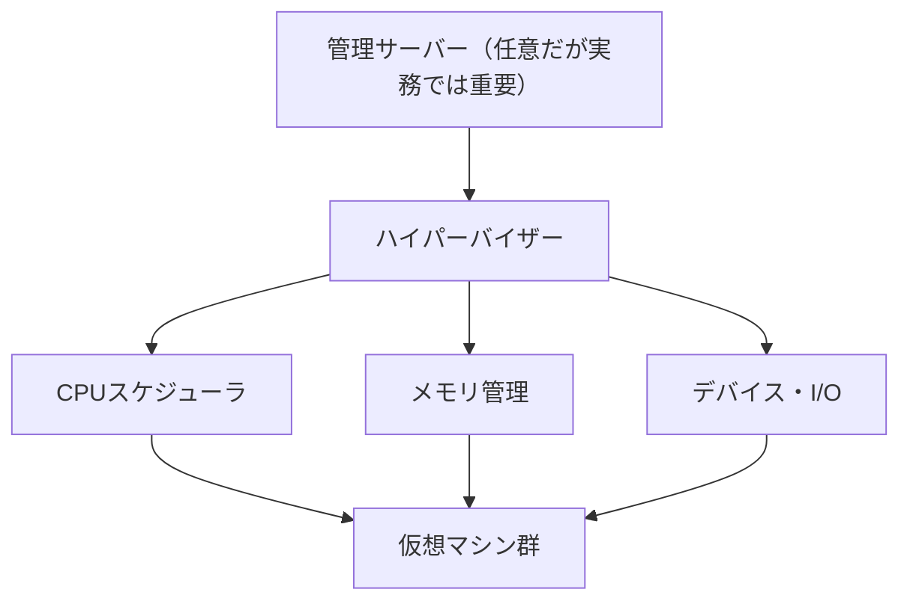
```mermaid
flowchart TB
  MGMT["管理サーバー（任意だが実務では重要）"]
  HV["ハイパーバイザー"]
  CPU["CPUスケジューラ"]
  MEM["メモリ管理"]
  IO["デバイス・I/O"]
  VM["仮想マシン群"]

  MGMT --> HV
  HV --> CPU
  HV --> MEM
  HV --> IO
  CPU --> VM
  MEM --> VM
  IO --> VM
```

---

## 2.4 代表製品の位置づけ

製品固有機能と一般概念を混同しないため、まずは位置づけだけ比較する。

| 製品 | 系統 | 備考 |
|------|------|------|
| VMware ESXi | Type 1 | 専用の薄いハイパーバイザー。管理は vCenter と連携することが多い |
| Microsoft Hyper-V | Type 1（実体） | Windows Server / Hyper-V Server 上で提供。親パーティションがある |
| KVM | Type 1 に近い（Linuxカーネル内） | Linux をハイパーバイザー化する。QEMU と組み合わせて使う |
| Xen | Type 1 | Dom0（特権ドメイン）が管理とデバイスを担う古典的モデル |

### VMware ESXi

ハードウェア上で動作する専用ハイパーバイザーである。
VMFS などのデータストア概念、vSphere クラスタ、HA、vMotion などとセットで語られることが多い。
「ESXi」はホスト側、「vSphere」は製品スイート全体を指す使い分けに注意する。

### Microsoft Hyper-V

Windows の仮想化基盤である。
親パーティション（管理OS）と子パーティション（ゲスト）というモデルを持つ。
Windows 管理ツールや Active Directory との親和性が高い。
Linux ゲストもサポート対象だが、設計文化は Microsoft エコシステム寄りである。

### KVM

Kernel-based Virtual Machine の略である。
Linux カーネルの機能として仮想化を提供し、ユーザー空間の QEMU がデバイスエミュレーションなどを担う。
OpenStack、Proxmox VE、oVirt、クラウド事業者の基盤など、広い生態系の部品になっている。

### Xen の概要

Xen は Dom0 と呼ばれる特権ドメインが、デバイスアクセスや管理を担う。
準仮想化（PV）を早くから重視した歴史がある。
今日の新規オンプレ設計では KVM や ESXi、Hyper-V のほうが登場頻度が高いが、「特権ドメインがI/Oを担う」モデルを理解する教材としては今も有用である。

設計判断では、製品機能の多さより次を見る。

- 自組織の運用スキルと既存契約
- 管理サーバーの運用体制
- バックアップ、監視、セキュリティ製品との接続
- ライセンスモデル

通貫シナリオでは、いずれも Type 1 系で要件を満たし得る。
差は主に運用とエコシステムにある。

---

## 2.5 ハードウェア支援仮想化

昔の仮想化は、ソフトウェアだけで特権命令を捕捉する必要があり、コストが高かった。
現代のサーバーCPUは、仮想化を助ける機構を持つ。

代表例は次である。

- Intel VT-x
- AMD-V

これに加え、メモリ管理の支援（Intel EPT、AMD RVI/NPT）、I/O の支援（VT-d / AMD-Vi）などがある。

**ハードウェア支援仮想化**がある前提では、ゲストの動作をCPUが「非ルートモード」のような形態で実行し、必要なときだけハイパーバイザーへ制御を戻す。
この制御の戻りが、次に見る VM Exit である。

BIOS/UEFI で仮想化支援が無効だと、ネスト実験どころか Type 1 のインストール要件を満たさないことがある。
学習環境では、まずここを確認する。

---

## 2.6 特権命令と VM Exit

ゲストOSは、自分を「本物のOS」だと思っている。
そのため、特権が必要な操作（例：特定のレジスタ操作、敏感なハードウェア制御）を実行しようとする。

ハイパーバイザーは、それを無制限には実行させない。
CPUの支援により、問題になる操作で実行が中断され、ハイパーバイザーが intervening する。

この「ゲスト実行が中断され、ハイパーバイザー側へ制御が移ること」を、Intel 系の用語では **VM Exit** と呼ぶことが多い。
対応する再開が VM Entry である。

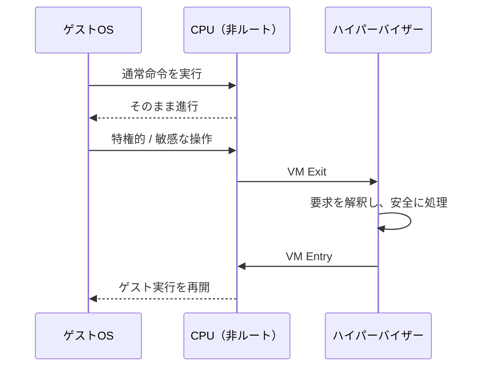
```mermaid
sequenceDiagram
  participant G as ゲストOS
  participant C as CPU（非ルート）
  participant H as ハイパーバイザー

  G->>C: 通常命令を実行
  C-->>G: そのまま進行
  G->>C: 特権的 / 敏感な操作
  C->>H: VM Exit
  H->>H: 要求を解釈し、安全に処理
  H->>C: VM Entry
  C-->>G: ゲスト実行を再開
```

VM Exit 自体は正常動作である。
問題になるのは、Exit が過剰な場合である。
デバイスの扱いが非効率だと Exit が増え、性能が落ちる。
だから、仮想デバイスの実装方式が重要になる。

---

## 2.7 仮想デバイス

仮想マシンに見えるディスクコントローラ、NIC、グラフィック、タイマーなどは、多くが仮想デバイスである。
実物のPCIデバイスをそのまま渡す場合（パススルー）もあるが、通常のサーバ仮想化では仮想デバイスが基本である。

仮想デバイスの実現方式は、大きく次に分かれる。

1. **エミュレーション**：実在デバイスに似せた動きをソフトウェアで再現する
2. **準仮想化**：ゲストが「仮想化されている」前提の効率的なデバイスを使う
3. **パススルー / SR-IOV**：物理機能の一部または全部をゲストへ直接寄せる

通貫シナリオの一般業務VMは、通常は準仮想化デバイスを使う。
特別な低遅延要件やGPU利用などで、パススルーや SR-IOV を検討する。

---

## 2.8 エミュレーションと準仮想化

### エミュレーション

古いNICやディスクコントローラをソフトウェアで真似る。
ゲストに特別なドライバがなくても動きやすい。
その代わり、VM Exit や変換コストが増えやすい。

互換性重視、初期インストール時、レガシーOS entourage で残る。

### 準仮想化（Paravirtualization）

ゲスト側に、仮想化向けドライバを入れる。
「本物の古いNICのふり」をやめて、「ハイパーバイザーと効率よく話すNIC」を使う。

例（製品固有名を含む）：

- VMware：VMXNET3（NIC）、PVSCSI など
- Hyper-V：Synthetic devices、Integration Services
- KVM：virtio-net、virtio-blk / virtio-scsi

準仮想化は性能面で有利なことが多い。
条件は、ゲストツールやドライバが正しく入っていることである。

| 方式 | 利点 | 欠点 |
|------|------|------|
| エミュレーション | ドライバなしで動きやすい | オーバーヘッドが大きい |
| 準仮想化 | 効率が良い | ゲスト側対応が必要 |
| パススルー系 | 低遅延・高スループットを狙いやすい | 可搬性、ライブマイグレーション制約が増える |

---

## 2.9 ゲストツール

**ゲストツール**（ゲストエージェント、Integration Services、VMware Tools、qemu-guest-agent など）は、ゲストOSに入れる補助コンポーネントである。

主な役割は次である。

- 準仮想化ドライバの提供
- ハートビートや稼働状態の通知
- 時刻同期の補助
- クリーンなシャットダウン連携
- 一部の性能情報やIP情報の収集
- ファイルのコピーやカスタマイズ連携（製品による）

ゲストツール未導入のVMでも起動自体はできることが多い。
しかし、次の不具合が出やすい。

- ネットワークやディスクが遅い（エミュレーションデバイスのまま）
- 正常停止ができない
- 時刻がずれる
- 管理画面上の情報が欠ける

設計上の判断として、テンプレート段階でゲストツール導入を必須化する。
後追いインストールは漏れやすい。

セキュリティ上の注意もある。
ゲストツールはホストとゲストの連携面を増やす。
不要な機能を消し、バージョンを管理し、古いツールを放置しない。

---

## 2.10 設計上の判断ポイント

| 判断 | 採用案 | 不採用案 | 理由とトレードオフ |
|------|--------|----------|--------------------|
| 本番ハイパーバイザー種別 | Type 1 | Type 2 を本番利用 | 本番は制御面と性能面で Type 1。Type 2 は学習・検証 |
| 仮想デバイス | 準仮想化を標準 | 全VMをレガシーエミュレーション | 性能のため。レガシーは例外扱い |
| ゲストツール | テンプレートで必須 | 任意導入 | 運用品質のばらつきを減らす |
| パススルー | 原則使わない | 安易な全NICパススルー | 可搬性・HA・移行を優先。低遅延要件のみ例外 |

通貫シナリオでは、まず「標準は準仮想化 + ゲストツール必須」と決める。
特別要件は個別審査にする。

---

## 2.11 性能上の注意点

- VM Exit 過多は、デバイス選択やタイマー割り込み設計の見直し対象になる
- ネスト仮想化では Exit コストが見えやすく、絶対性能評価には不向き
- 同じ「1Gbps NIC」でも、エミュレーションと virtio/VMXNET3 では実効が違う
- 理論値（リンク速度）と実測値（iperf や業務指標）を混同しない

---

## 2.12 セキュリティ上の注意点

- ハイパーバイザーは最高権限に近い。パッチ適用計画が必要
- 管理界面への到達経路を最小化する
- ゲストツール連携面を攻撃面として認識する
- パススルーは分離モデルを変えるため、承認プロセスを別にする

---

## 2.13 障害例と切り分け

### 障害例1：VMは動くが極端に遅い

確認順：

1. ゲストツール / 準仮想化ドライバの有無
2. 仮想NIC・仮想ディスクの種類（レガシーか準仮想化か）
3. ホスト全体の資源逼迫がないか

よくある原因：テンプレートがレガシーNICのまま量産されている。

### 障害例2：クリーンシャットダウンできない

確認順：

1. ゲストツールサービスが動いているか
2. ツール版数とハイパーバイザー版数の組み合わせ
3. ゲストOS側の電源管理設定

### 障害例3：あるホストだけネストVMが起動しない

確認順：

1. BIOS/UEFI の VT-x/AMD-V
2. 外側ハイパーバイザーのネスト設定
3. CPU互換性の露出設定

---

## 章末問題

### 問題1

Type 1 と Type 2 を、配置位置と典型用途で比較せよ。

### 問題2

VM Exit は障害なのか。そうでないなら、性能問題になる条件は何か。

### 問題3

エミュレーションNICと準仮想化NICのどちらを標準採用すべきか。例外は何か。

### 問題4

KVM を「Linux上のアプリ」とだけ説明するのは何が不十分か。

### 問題5

通貫シナリオでゲストツールを必須にする理由を、性能以外の観点も含めて述べよ。

---

## 解答と解説

### 問題1

Type 1 はハードウェア直上で動作し、本番サーバ仮想化の中心である。
Type 2 はホストOS上で動作し、PC上の検証や開発用途が中心である。

### 問題2

VM Exit は正常な制御移譲である。
性能問題になるのは、Exit が過剰で有用な仕事より調停コストが目立つときである。

### 問題3

標準は準仮想化NICである。
例外は、ドライバがないレガシーOSの初期導入や、互換性確認が最優先の場面である。

### 問題4

KVM は Linux カーネルの仮想化機能であり、単なる一般アプリではない。
デバイス周りで QEMU などユーザー空間部品と組み合わさる点まで含めて説明する必要がある。

### 問題5

準仮想化ドライバ提供に加え、正常停止、時刻同期、管理情報の精度、自動化連携が安定するためである。
運用品質の標準化手段でもある。

---

## ハンズオン演習

### 演習1：自分の環境の種別判定

学習環境が Type 1 / Type 2 / ネストのどれかを判定し、根拠を書け。

### 演習2：仮想デバイスの確認

作成したVMについて、NICとディスクコントローラの種類を調べ、エミュレーションか準仮想化かを分類せよ。

### 演習3：ゲストツールの有無比較

同一条件に近いVMを2つ用意し、ゲストツールあり/なしで次を比較せよ。

1. シャットダウン連携
2. ネットワークの種類とリンク情報
3. 管理画面に見える追加情報

ネスト環境では絶対値比較は参考にとどめ、差分の有無を観察する。

### 成果物

- 種別判定メモ
- 仮想デバイス分類表
- ゲストツール比較メモ

---

## 本章のまとめ

ハイパーバイザーは、仮想マシンにハードウェアを見せつつ、特権操作と資源競争を調停する基盤である。
本番は Type 1 を基本とし、デバイスは準仮想化を標準化する。
VM Exit は正常動作だが、過剰になると性能を削る。
ゲストツールはオプション扱いにせず、テンプレート品質の一部として管理する。


---


<!-- source: 03_cpu_virtualization.md -->

# 第3章 CPU仮想化

## 学習目標

1. vCPU と物理コア、スレッドの関係を説明できる
2. CPU スケジューリングとオーバーコミットの意味を説明できる
3. CPU Ready と Co-Stop の兆候を説明できる
4. NUMA / vNUMA、アフィニティ、予約、制限、共有を設計判断に使える
5. 過剰な vCPU 割り当てが性能を下げる理由を説明できる

---

## 3.1 CPU仮想化が必要になった背景

物理サーバー1台に業務システム1つを載せる構成では、CPUの話は比較的単純だった。
OSが物理コアを直接スケジューリングし、待ち時間の多くはプロセス同士の競合か、I/O待ちだった。

仮想化で複数のゲストOSが同居すると、事情が変わる。
各ゲストは「自分専用のCPUがある」前提でスケジューリングする。
その下でハイパーバイザーが、限られた物理CPU時間を複数の仮想マシンへ配分する。

ここで起きる問題は、次のようなものだ。

- 各VMに割り当てた vCPU の合計が、物理論理CPU数を超える
- ゲスト内のCPU使用率が低く見えるのに、業務が遅い
- あるVMのピークが、同居VMの応答時間を押し上げる
- ソケットをまたぐメモリアクセスが、予想外の遅延を生む

通貫シナリオでは、ホスト1台が 2ソケット × 16コア（論理32スレッド）を持つ。
その上に、重要システム、一般業務、開発検証のVMが同居する。
「コアが余っているから vCPU を多めに渡す」判断が、かえって待ち時間を増やすことがある。
その仕組みと設計判断が、以降の節の主題になる。

---

## 3.2 vCPU と物理CPU、コア、スレッド

### 用語の対応

まず、層を分けて用語を固定する。

- **物理CPU（ソケット）**：マザーボード上のCPUパッケージ。通貫シナリオではホストあたり2ソケット
- **物理コア**：ソケット内の実行コア。通貫シナリオではソケットあたり16コア、ホスト合計32コア
- **論理CPU / スレッド**：SMT（Intel Hyper-Threading など）有効時に見える実行単位。通貫シナリオではホストあたり論理32スレッド（2ソケット × 16コア、SMT前提の記載）
- **vCPU（virtual CPU）**：仮想マシンに見せる仮想プロセッサ。ゲストOSはこれを物理CPUとして扱う

カタログ上の「論理32スレッド」は理論上の並行実行の上限に近い指標である。
実測のスループットは、ワークロードの並列性、キャッシュ、メモリ帯域、SMTの効き方で変わる。
理論値と実測値を同じものとして扱わない。

```text
物理ホスト（例: 2ソケット × 16コア = 論理32スレッド）
+--------------------------------------------------+
| Socket 0          | Socket 1                     |
| Core0..Core15     | Core0..Core15                |
| (各コアにスレッド) | (各コアにスレッド)            |
+--------------------------------------------------+
          ^ ハイパーバイザーがスケジューリング
+--------------------------------------------------+
| VM-A: vCPU×4  | VM-B: vCPU×2  | VM-C: vCPU×4 ... |
+--------------------------------------------------+
```

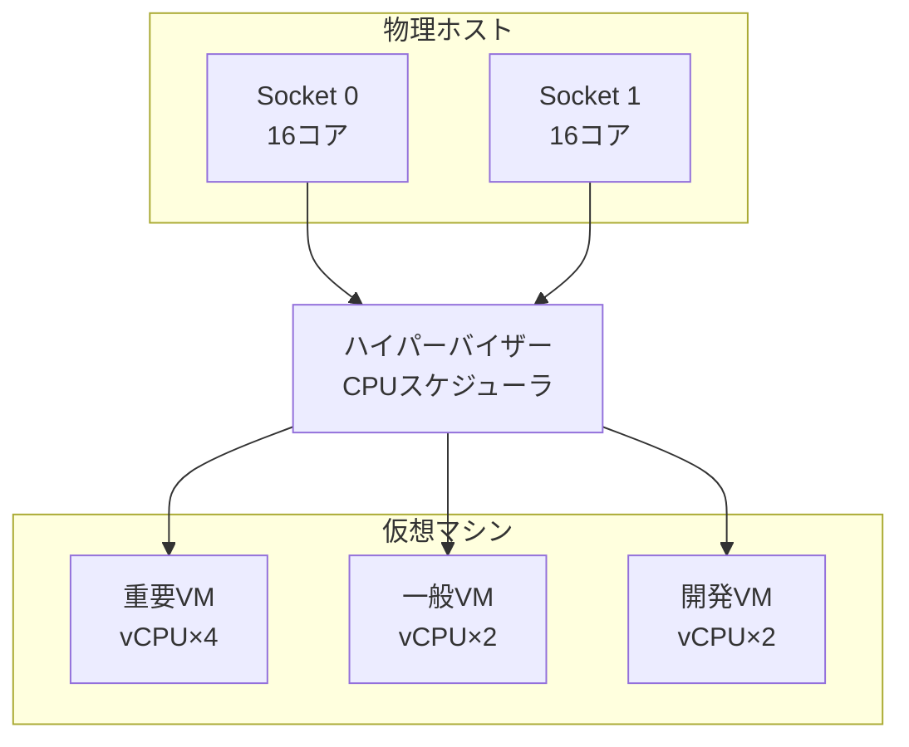
```mermaid
flowchart TB
  subgraph Phys["物理ホスト"]
    S0["Socket 0<br/>16コア"]
    S1["Socket 1<br/>16コア"]
  end

  HV["ハイパーバイザー<br/>CPUスケジューラ"]

  subgraph VMs["仮想マシン"]
    VA["重要VM<br/>vCPU×4"]
    VB["一般VM<br/>vCPU×2"]
    VC["開発VM<br/>vCPU×2"]
  end

  S0 --> HV
  S1 --> HV
  HV --> VA
  HV --> VB
  HV --> VC
```

### vCPU は専用コアではない

vCPU を4つ割り当てたからといって、物理コアが4つ専有されるわけではない。
デフォルトでは、ハイパーバイザーがその時点で空いている論理CPUへ、時間を分けて載せる。

ゲストから見ると、常に4つのCPUがあるように見える。
ホストから見ると、その4つのvCPUは「同時に実行したい4本の実行文脈」であり、物理側に空きがなければ待たされる。

---

## 3.3 CPUスケジューリングの動作原理

ハイパーバイザーの**CPUスケジューラ**は、どのVMのどのvCPUを、どの物理論理CPUで、いつ実行するかを決める。

基本動作は次の流れである。

1. ゲストが実行可能になると、対応する vCPU が実行待ちキューに入る
2. スケジューラが空き論理CPUを選び、vCPU を載せる（ディスパッチ）
3. タイムスライスや割り込み、I/O待ちなどで実行が切り替わる
4. 物理資源が足りなければ、実行可能なのにCPUを得られない時間が溜まる

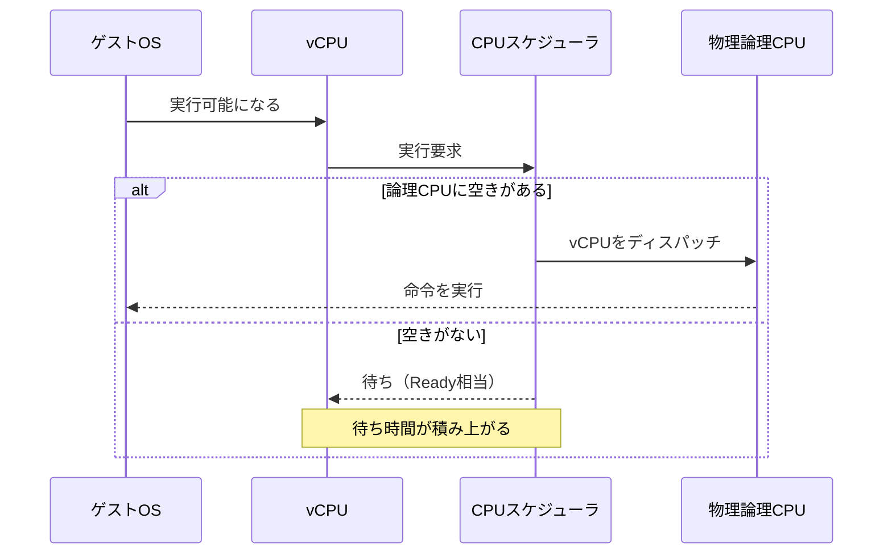
```mermaid
sequenceDiagram
  participant G as ゲストOS
  participant V as vCPU
  participant S as CPUスケジューラ
  participant P as 物理論理CPU

  G->>V: 実行可能になる
  V->>S: 実行要求
  alt 論理CPUに空きがある
    S->>P: vCPUをディスパッチ
    P-->>G: 命令を実行
  else 空きがない
    S-->>V: 待ち（Ready相当）
    Note over V,S: 待ち時間が積み上がる
  end
```

ゲスト内のスケジューラと、ハイパーバイザーのスケジューラは別物である。
ゲストは「自分のvCPUが常に動いている」前提でスレッドを配置する。
実際には、そのvCPU自体がホスト側で待っていることがある。
ここが、ゲスト内CPU使用率だけでは遅さを説明しきれない理由である。

---

## 3.4 CPUオーバーコミット

**CPUオーバーコミット**とは、ホスト上の全VMに割り当てた vCPU の合計が、ホストの物理論理CPU数を超える状態を指す。

例（通貫シナリオの1ホスト）：

- 物理論理CPU：32
- そのホストに載っているVMの vCPU 合計：48
- このとき、割り当て比率は 48 / 32 = 1.5 倍

オーバーコミット自体は、仮想化の常套手段である。
ピークがずれるワークロードでは、割り当て合計が物理を超えても、実使用が同時にピークに達しなければ成立する。

問題になるのは、次の場合である。

- ピークが重なる時間帯がある
- 多数のvCPUを持つVMが多く、同時実行要求が常に高い
- 「余っているから多めに渡す」文化で、未使用vCPUが増える

割り当て比率（理論値）と、CPU Ready（実測の待ち）は別指標である。
設計会議では両方を見る。

---

## 3.5 CPU Ready

**CPU Ready**（製品によっては Ready Time、%RDY、steal time に近い概念で語られる）は、仮想マシンが実行可能なのに、物理CPUを割り当ててもらえず待っている時間の指標である。

ゲスト内のタスクマネージャや `top` でCPU使用率が低くても、CPU Ready が高ければ業務は遅くなる。
ゲストは「自分が使っていない」と錯覚し、ホストは「そのVMはCPUを欲しがっているが渡せない」と見ている。

```text
ゲスト視点:
  CPU使用率 20% → 「余裕がある」

ホスト視点:
  CPU Ready が高い → 「実行したいのに待たされている」
```

観測の注意点は次である。

- ネスト仮想化では絶対値が実環境と大きく異なる。相対比較と切り分け手順の練習に使う
- しきい値は製品、集計間隔、ワークロードで変わる。カタログの目安と、自環境のベースライン実測を分けて扱う
- 1つのVMだけでなく、ホスト全体と同居VMも同時に見る

通貫シナリオで新しい一般業務VMを追加した直後に既存VMが遅くなった場合、まずCPU Ready（または同等指標）を疑う。

---

## 3.6 Co-Stop

**Co-Stop**（製品によって表記や公開度が異なる）は、複数vCPUを持つVMにおいて、必要なvCPU群を同時に走らせられないことで生じる待ちに関係する概念である。

ゲストOSやアプリケーションが、複数のvCPU上の実行を同期的に進める必要がある局面がある。
そのとき、ハイパーバイザー側で一部のvCPUだけが走れて、残りが揃わないと、実質的な前進が止まる。

直感的なイメージは次である。

```text
vCPU×4 のVMが、ある瞬間に4本そろって進みたい

物理側の空きが2本しかない
  → 2本は実行、2本は待ち
  → 同期が必要な処理は、そろわない時間だけ停滞する
```

Co-Stop が問題になりやすい条件は、次である。

- vCPU数が多いVM
- ホストのCPU競合が強い
- オーバーコミットが大きい

CPU Ready が「1本のvCPUがCPUを待つ」側面を表すのに対し、Co-Stop は「複数vCPUの同時実行の難しさ」に焦点がある。
製品によってメトリクス名や見え方は違うが、「多vCPUほどスケジューリング制約が増える」という一般原理は共通する。

---

## 3.7 NUMA と vNUMA

### NUMA

**NUMA（Non-Uniform Memory Access）**は、メモリへのアクセス遅延が、どのCPUからどのメモリ領域へ行くかで一様でないアーキテクチャである。

2ソケット構成では、各ソケットに近いメモリ（ローカル）と、相手ソケット側のメモリ（リモート）がある。
ローカルアクセスのほうが速い。

```text
+------------------+          +------------------+
| Socket 0         |          | Socket 1         |
| Cores            |  相互接続 | Cores            |
| Local Memory     | <------> | Local Memory     |
+------------------+          +------------------+
```

通貫シナリオのホスト（2ソケット × 16コア、メモリ512 GB）は、典型的な NUMA 構成として扱う。
メモリがソケット間でどう分かれているかは機種依存だが、「遠いメモリは遅い」前提で設計する。

### vNUMA

**vNUMA**は、仮想マシンに対して NUMA トポロジを見せる仕組みである。
ゲストOSが、自分のvCPUとメモリの近接関係を意識してスケジューリングできるようにする。

小さなVM（例：vCPU 2、メモリ 8 GB）では、1つのNUMAノード内に収めるほうが単純で速いことが多い。
大きなVM（多数のvCPU、大きなメモリ）では、ゲストにも NUMA を見せたほうが、ゲスト側の最適化が効く場合がある。

製品固有の自動設定や、vNUMA を有効にする条件は実装差がある。
一般概念として押さえるのは次である。

- 可能ならVMを1つの物理NUMAノードに収める
- 収まらない大型VMは、トポロジをゲストへ適切に見せるかを検討する
- 「大きいほど速い」ではなく、「収まり方」を先に見る

---

## 3.8 CPUアフィニティ

**CPUアフィニティ**とは、特定のvCPUやVMを、特定の物理論理CPU（またはその集合）に結びつける設定である。

利点として期待されるのは、キャッシュ局所性の向上や、ノイジーネイバーの回避である。
代償として、スケジューラの自由度が下がる。
空きがあっても、縛られた範囲外のCPUを使えなくなる。

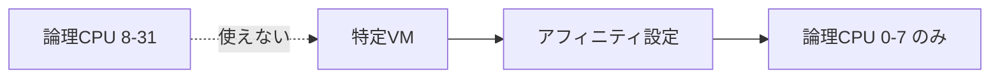
```mermaid
flowchart LR
  VM["特定VM"]
  AFF["アフィニティ設定"]
  SET["論理CPU 0-7 のみ"]
  FREE["論理CPU 8-31"]

  VM --> AFF --> SET
  FREE -.->|"使えない"| VM
```

設計上の原則は、「標準では使わない」である。
例外は、厳密な分離検証、特定のライセンス拘束、低遅延要件の限定用途などである。
通貫シナリオの一般業務VMにアフィニティを量産適用すると、保守時の再配置や負荷分散が難しくなる。

製品によっては、アフィニティに似た配置ルール（ホストアフィニティ、NUMAノード親和など）がある。
物理CPUピンニングと、ホスト選択ルールは別概念として扱う。

---

## 3.9 CPU予約、制限、共有

資源配分の古典的な三要素がある。
製品名は違っても、考え方は近い。

| 一般概念 | 意味 |
|----------|------|
| **予約（Reservation）** | 最低限確保するCPU資源。他VMに奪われにくい |
| **制限（Limit）** | 上限。どれだけ空いていても、これ以上は使わせない |
| **共有 / シェア（Shares）** | 競合時の相対優先度。絶対量ではなく比率 |

```text
競合が弱いとき:
  シェアの差は見えにくい。制限だけが効くことが多い

競合が強いとき:
  予約を持つVMが優先的に守られる
  残りをシェア比率で分ける
```

通貫シナリオでの使い方の例は次である。

- 重要システム8台：必要なら予約を検討する。ただし予約の合計は、ホスト障害時の収容計算（Admission Control 相当）と衝突しやすい
- 一般業務：デフォルトシェアでよいことが多い
- 開発と検証：必要なら制限をかけ、本番を食いすぎないようにする

予約を安易に増やさない。
予約は「守る」代わりに、クラスタ全体の収容可能数を減らすことがある。
詳細な収容計算は第8章、第13章へ続く。

---

## 3.10 製品での実装例と用語対応

一般概念と製品用語を対応づける。
操作手順ではなく、呼び名の地図として使う。

| 一般概念 | VMware（例） | Hyper-V（例） | KVM / libvirt（例） |
|----------|--------------|---------------|---------------------|
| vCPU | 仮想CPU数 | 論理プロセッサ数 | vCPU（`vcpu`） |
| CPU Ready 相当 | Ready / %RDY | CPU Wait Time 等の監視観点 | steal（ゲスト側）、ホストのrunキュー |
| 予約 | CPU Reservation | CPU Reserve | cgroups / quota や予約的制御（構成による） |
| 制限 | CPU Limit | CPU Limit | `cputune`、quota/period |
| 共有 | CPU Shares | Relative Weight | `cpu.shares` 相当 |
| アフィニティ | CPU Affinity | Processor Affinity | `cpuset`、vcpupin |
| NUMA / vNUMA | NUMA / vNUMA 関連設定 | NUMA spanning 等 | numatune、ゲストNUMA |

VMware の %RDY、Linux ゲストの `steal`、Hyper-V のカウンタは、定義と単位が完全一致しない。
「同じ名前の万能指標」ではなく、「実行したいのにCPUを得られない時間」を見る族として扱う。

---

## 3.11 CPUサイジング

サイジングの出発点は、「ピークに必要な実行力」と「同時に載せるVM数」と「ホスト障害時の逃げしろ」である。

通貫シナリオの仮置きを再掲する。

| 区分 | 台数 | vCPU（仮） |
|------|------|------------|
| 重要システム | 8 | 4 |
| 一般業務 | 16 | 2 |
| 開発と検証 | 6 | 2 |

割り当てvCPUの合計は、`8×4 + 16×2 + 6×2 = 32 + 32 + 12 = 76` である。
ホスト3台、各論理32スレッドなら、クラスタ全体の論理CPUは96である。
単純な割り当て比は 76 / 96 ≈ 0.79 で、一見余裕がある。

しかし、これは理論上の割り当て比較にすぎない。

実際の設計では、少なくとも次を見る。

1. 1ホスト障害時に、残2ホスト（論理64）へ重要VMと必要VMが載るか
2. ピーク時の実測CPU使用と、CPU Ready
3. 成長後（約1.5倍）の再見積もり
4. ハイパーバイザーと管理コンポーネント自身の消費

「割り当て合計が物理以下なら安全」ではない。
逆に、「割り当て合計が物理を超えても、実測Readyが低ければ成立し得る」。
判断材料は実測である。

第13章で計算式と余裕率を確定する。
ここでは、vCPU数を決めるときに次の順序を守る、と決める。

1. 実測または負荷試験で必要な並行度を把握する
2. 必要最小のvCPUから始める
3. 監視で足りなければ増やす
4. 「将来用に多め」は原則しない

---

## 3.12 過剰なvCPU割り当てが性能を低下させる理由

直感に反するが、vCPUを増やしすぎると遅くなることがある。

理由は複数ある。

### 理由1：同時実行要求が増える

vCPUが4本あるVMは、忙しいときに最大4本分の物理実行資源を同時に欲しがる。
空きが足りないと、Ready や Co-Stop 相当の待ちが増える。

### 理由2：スケジューリング制約が増える

多vCPUのVMは、「そろえて走らせる」必要が出やすい。
物理側の断片的な空きでは進めず、待ちが長くなる。

### 理由3：ゲスト側のオーバーヘッド

ゲストOSは、管理するプロセッサ数に応じてスケジューラ、割り込み、同期のコストを払う。
仕事量が同じなら、vCPU過多は純粋な得にはならない。

### 理由4：NUMAをまたぎやすい

大きなVMは複数ソケットにまたがり、リモートメモリアクセスが増える。

### 理由5：ノイジーネイバーになる

自分は少ししか使わなくても、ピーク時に大きく食い、同居VMのReadyを押し上げる。

```text
悪い例:
  「DBだからとりあえず vCPU 16」
  → 実ピークは 3 コア相当
  → 競合時に 16 本分の同時実行要求が散発
  → 自分も同居も遅くなる

良い例:
  実測で 3〜4 コア相当
  → vCPU 4 から開始
  → Ready とアプリ応答を監視して調整
```

通貫シナリオの重要システムを「念のため vCPU 8」へ上げる前に、実測ピークとReadyを確認する。
念のための増設が、障害時の再配置余地を削ることもある。

---

## 3.13 設計上の判断ポイント

| 判断 | 採用案 | 不採用案 | 理由とトレードオフ |
|------|--------|----------|--------------------|
| vCPU初期値 | 必要最小から開始 | 将来余裕で多めに配布 | 待ち時間と再配置余地を守る。不足は監視で増やす |
| オーバーコミット | ピークずれを前提に許容し、Readyで制御 | 割り当て合計を常に物理以下に固定 | 固定は安全に見えるが統合効率が落ちる。実測制御のほうが実務的 |
| アフィニティ | 原則使わない | 全VMを固定ピンニング | 可搬性と保守性を優先。例外のみ |
| 予約 | 重要VMに限定して最小限 | 全VMに厚い予約 | 収容計算と衝突しやすい |
| 開発VM | 制限または低優先 | 本番と同等の無制限競合 | 本番応答を守る |
| 大型VM | NUMA収まりを先に設計 | ソケット無視で巨大化 | リモートメモリ遅延を避ける |

単一障害点との関係も見る。
CPUそのものより、「特定ホストにCPUヘビーなVMが偏在する」配置が実質的な弱点になる。
負荷分散方針は第8章で扱う。

---

## 3.14 性能上の注意点

- ゲスト内CPU使用率だけで遅さを判断しない。Ready / steal 相当を見る
- SMTの論理スレッドを「物理コア2倍の実力」とみなさない
- ネスト環境のReady絶対値を本番しきい値に使わない
- バックアップ、ウイルススキャン、パッチ配布がピークと重なると、CPU競合が一気に見える
- 理論上の割り当て比が低くても、少数の巨大VMが同時に走ればReadyは上がる
- ホットアドでvCPUを増やす前に、ゲストOSの対応とライセンス条件を確認する（第7章）

---

## 3.15 セキュリティ上の注意点

- サイドチャネル（キャッシュやSMTを介した情報漏洩の議論）は、多テナントで重要度が上がる。社内基盤でも、機密度の高いVMの同居方針を決める
- CPUアフィニティや専用コア分離は、性能目的だけでなく、テナント分離の一手段として使われることがある。採用するなら運用コストを見積もる
- 管理権限を持つユーザーが、任意VMの予約や制限を変更できると、他VMへのDoS的影響を起こせる。権限設計が必要（第10章）
- パフォーマンスカウンタの採取範囲と、管理ネットワークの露出を見直す

---

## 3.16 障害例と切り分け

### 障害例1：ゲストCPUは低いのに業務が遅い

**症状**：アプリ応答が悪い。ゲストのCPU使用率は10〜20%。

**切り分け**：

1. ホストまたはVMの CPU Ready / steal 相当を確認する
2. 同時刻の同居VMのCPUピークを確認する
3. ストレージ遅延とメモリ逼迫も除外する（偽のCPU症状を避ける）

**典型原因**：CPUオーバーコミット下での競合。ゲスト指標だけ見ていた。

### 障害例2：vCPUを増やしたらさらに遅くなった

**症状**：DB VM の vCPU を4から8にした直後、ピーク時の応答が悪化。

**切り分け**：

1. Ready と Co-Stop 相当の変化を比較する
2. NUMAノードをまたいだ配置になっていないか確認する
3. 実スレッド並列度が8を必要としているか、アプリ側で確認する

**典型原因**：過剰vCPUによるスケジューリング制約の増加。

### 障害例3：特定ホストだけ遅い

**症状**：同じ役割のVMでも、Host-2 上だけ遅い。

**切り分け**：

1. そのホストの vCPU 合計と実使用を他ホストと比較する
2. アフィニティや配置ルールで偏っていないか確認する
3. BIOSの電源管理、ターボ、Cステート差がないか確認する

**典型原因**：配置偏り、ホスト固有の電力設定、一部コアの障害隔離。

### 障害例4：重要VMがピーク時にだけ遅延する

**症状**：日次バッチ開始時刻に認証や業務APが遅延する。

**切り分け**：

1. その時間帯のホストCPU Readyを時系列で見る
2. 開発VMやバックアップの同時走行を確認する
3. 共有と制限の設定差を確認する

**典型原因**：優先度設計なしの同居。制限や時間帯分離で緩和できることが多い。

---

## 章末問題

### 問題1

vCPU を4つ持つVMは、常に物理コアを4つ専有するか。理由とともに答えよ。

### 問題2

ゲスト内CPU使用率が低いのに業務が遅いとき、CPU観点で最初に疑う指標は何か。その指標が示す状態を一言で述べよ。

### 問題3

通貫シナリオで、全VMの割り当てvCPU合計が76、クラスタ論理CPUが96だとする。
このとき「CPUに余裕がある」と言い切れるか。言えない理由を述べよ。

### 問題4

CPU予約を重要VMすべてに厚く設定する案の利点と、不採用にし得る理由を述べよ。

### 問題5

過剰なvCPU割り当てが性能を下げる理由を、スケジューリングの観点から説明せよ。

---

## 解答と解説

### 問題1

専有しない（デフォルト設定の一般論）。
vCPUは実行文脈であり、ハイパーバイザーが空いている論理CPUへ時間分割で載せる。
予約やアフィニティで拘束しない限り、専用コア固定にはならない。

### 問題2

CPU Ready（または steal など同等指標）。
実行可能なのに物理CPUを得られず待っている状態を示す。

### 問題3

言い切れない。
割り当て比は理論値であり、ピークの重なり、巨大VMの同時実行、1ホスト障害時の再配置、実測Readyを見ないと余裕は判定できない。

### 問題4

利点は、競合時に重要VMの最低CPUを守りやすいこと。
不採用にし得る理由は、予約合計がクラスタの収容能力を下げ、HA時の起動可否や配置柔軟性を損なうことである。

### 問題5

多vCPUは同時に必要となる物理実行資源と、そろえて走らせる制約を増やす。
物理側に断片的な空きしかないとき、Ready や Co-Stop 相当の待ちが増え、仕事量が増えていなくても遅延する。

---

## ハンズオン演習

### 演習1：資源対応表を作る

学習環境について、次を埋めよ。

| 項目 | 値 | 備考 |
|------|----|------|
| ソケット数 | | |
| コア数 | | |
| 論理CPU数 | | SMTの有無 |
| 作成したVMのvCPU | | |
| 割り当て合計 / 論理CPU | | 理論比 |

### 演習2：競合を観察する

可能なら次を行う。

1. 小さなVMを複数作り、それぞれでCPU負荷ツールを同時に走らせる
2. ゲスト内CPU使用率と、ホスト側の待ち指標（Ready / steal など）を記録する
3. 片方のVMのvCPUを増やして、再度同じ負荷をかけ、応答や待ちの変化を書く

ネスト環境では絶対値評価をせず、「待ちが増えたかどうか」を観察する。

### 演習3：通貫シナリオのCPU判断メモ

次を設計判断メモとして書け。

1. 重要VMのvCPUを4から8へ増やす案の採用可否
2. 不採用または保留にする条件
3. 監視すべき指標
4. ホスト1台障害時に効くリスク

### 成果物

- 資源対応表
- 競合観察メモ（指標の前後比較）
- CPU設計判断メモ

---

## 本章のまとめ

vCPUは専用コアではなく、ハイパーバイザーが物理CPU時間へ載せる実行単位である。
オーバーコミットはピークのずれを前提に成立し、成否は割り当て比より Ready のような実測待ちで見る。
多vCPUは並列性能を上げる一方、スケジューリング制約とNUMAまたぎを増やし、過剰だと遅くなる。
予約、制限、共有、アフィニティは競合時の配分手段であり、標準設定を増やすほど配置の自由度と収容計算が削られる。
通貫シナリオでは、必要最小のvCPUから始め、実測で調整する方針を起点にする。


---


<!-- source: 04_memory_virtualization.md -->

# 第4章 メモリ仮想化

## 学習目標

1. ゲストメモリとハイパーバイザーのメモリ管理の二層構造を説明できる
2. オーバーコミット、バルーニング、共有、圧縮、スワップの発動順の考え方を説明できる
3. メモリ予約と NUMA の関係を設計に反映できる
4. メモリ不足時の性能劣化の症状を列挙できる
5. 実務シナリオ向けのメモリサイジングの出発点を計算できる

---

## 4.1 メモリ仮想化が必要になった背景

物理1システム1サーバーの時代、メモリ不足の主戦場はゲストOSの中だった。
アプリケーションが物理RAMを使い切り、OSがスワップし、ディスク待ちで遅くなる。
診断は比較的一直線だった。

仮想化で複数ゲストが同居すると、メモリ問題は二層になる。

1. ゲストOSが、自分に見えているメモリをどう使うか
2. ハイパーバイザーが、限られたホスト物理メモリを複数VMへどう割り当てるか

さらに、設計者は「割り当てたメモリ」と「実際に触っているメモリ」を混同しやすい。
通貫シナリオではホスト1台あたり512 GBを前提に、VM30台規模を支える。
重要VMは16 GB、一般業務は8 GB、開発は4 GBという仮置きがある。
ここで「割り当て合計が物理以下なら安全」と思い込むと、次の章でつまずく。

メモリ仮想化の目的は、単なる分割ではない。
ゲストに連続したメモリ空間を見せつつ、ホスト上では効率よく多重利用することである。
その過程で、オーバーコミットや回収技術が登場する。

---

## 4.2 仮想メモリとアドレスの層

まず、アドレスの層を区別する。

- **仮想アドレス（ゲストプロセス視点）**：アプリケーションが使うアドレス。ゲストOSのページテーブルで変換される
- **ゲスト物理アドレス（GPA）**：ゲストOSが「物理メモリ」だと思っているアドレス
- **ホスト物理アドレス（HPA / マシン物理アドレス）**：実ホスト上の本当のメモリ位置

古典的な物理サーバーでは、OSが見る物理アドレスがそのまま機械の物理アドレスだった。
仮想化では、その間にもう一段の対応が入る。

```text
アプリの仮想アドレス
        |
        v  ゲストOSのページテーブル
ゲスト物理アドレス（GPA）
        |
        v  ハイパーバイザーの対応づけ（EPT/NPT など）
ホスト物理アドレス（HPA）
```

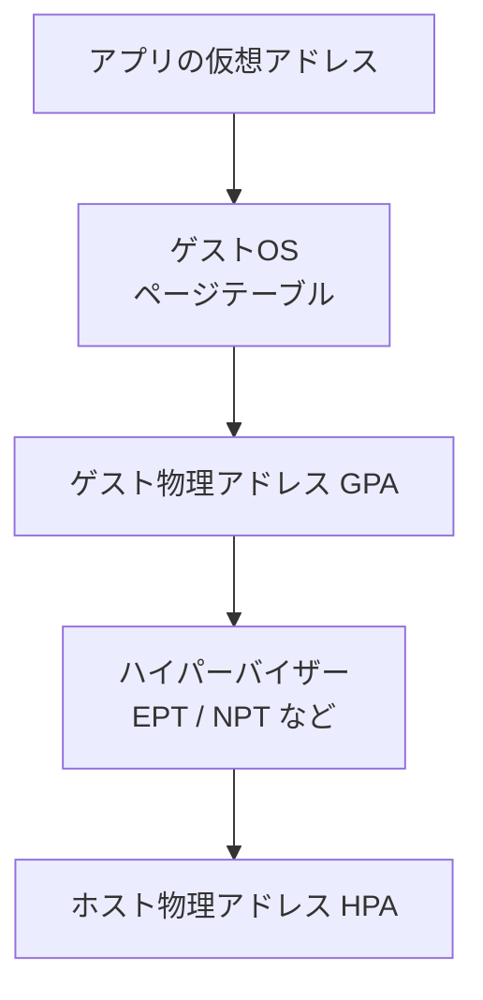
```mermaid
flowchart TB
  APP["アプリの仮想アドレス"]
  GOS["ゲストOS<br/>ページテーブル"]
  GPA["ゲスト物理アドレス GPA"]
  HV["ハイパーバイザー<br/>EPT / NPT など"]
  HPA["ホスト物理アドレス HPA"]

  APP --> GOS --> GPA --> HV --> HPA
```

現代のCPUは、この二段変換をハードウェア支援する。
Intel EPT、AMD RVI/NPT などである（第2章）。
支援がある前提でも、ページフォルトや回収処理のコストは残る。
「ハードウェア支援があるからメモリ逼迫は無害」にはならない。

---

## 4.3 ゲストOSのメモリ

ゲストOSは、割り当てられたメモリを自分の物理RAMだと思っている。
そのため、通常のOSと同じことをする。

- プロセスへ仮想メモリを割り当てる
- ファイルキャッシュに空きメモリを使う
- 逼迫するとゲスト内スワップ（ページファイル）を使う

ここで重要な錯覚がある。
ゲストが「メモリ使用率 90%」と報告しても、その中身の多くが再利用可能なファイルキャッシュであることがある。
逆に、ゲストが「空きが多い」ように見えても、ホスト側がすでに回収動作に入っていることがある。

ゲストツールやバルーンドライバが入っていると、ハイパーバイザーからの回収要求にゲストが協力できる。
未導入だと、回収手段が粗くなり、性能劣化が早く見える。

通貫シナリオでは、テンプレート段階でゲストツールを必須化する方針（第2章）が、メモリ管理の品質にも効く。

---

## 4.4 ハイパーバイザーのメモリ管理

ハイパーバイザーは、各VMに「見えるメモリ量」（構成メモリ）を約束しつつ、実ホスト上では必要に応じて実ページを裏づけする。

管理の要点は次である。

1. **構成メモリ**：VM設定上のメモリサイズ（例：16 GB）
2. **アクティブメモリ / 使用中ページ**：実際に触られている量（実測）
3. **ホスト空きメモリ**：回収技術を使わずに残っている余裕
4. **回収状態**：バルーン、共有、圧縮、スワップなどが動いているか

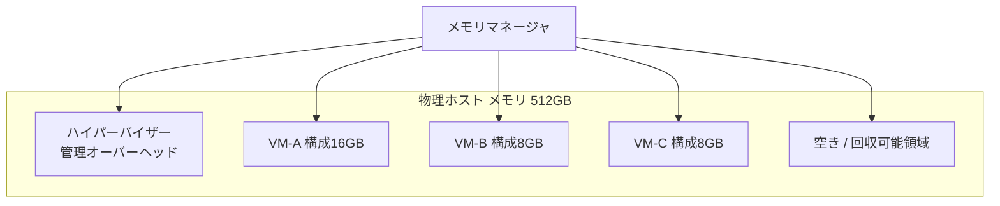
```mermaid
flowchart TB
  subgraph Host["物理ホスト メモリ 512GB"]
    HVOH["ハイパーバイザー<br/>管理オーバーヘッド"]
    VM1["VM-A 構成16GB"]
    VM2["VM-B 構成8GB"]
    VM3["VM-C 構成8GB"]
    FREE["空き / 回収可能領域"]
  end

  MM["メモリマネージャ"]
  MM --> VM1
  MM --> VM2
  MM --> VM3
  MM --> HVOH
  MM --> FREE
```

構成メモリの合計がホスト容量を超えても、全VMが同時に満額を触らなければ一時的には成立する。
これがメモリオーバーコミットの出発点である。

ただし、成立条件はCPUより厳しいことが多い。
メモリ不足の救済は、最終的にディスクへ逃げる経路を含み、遅延が一桁以上悪化し得る。

---

## 4.5 メモリオーバーコミット

**メモリオーバーコミット**とは、ホスト上のVMに構成したメモリ合計が、ホストの物理メモリ（管理オーバーヘッド控除後）を超える状態を指す。

例（単純化）：

- ホスト物理メモリ：512 GB
- 管理オーバーヘッドと系統サービス：仮に 32 GB
- VMへ使える目安：480 GB
- そのホスト上の構成メモリ合計：600 GB
- このとき、割り当て比は 600 / 480 = 1.25 倍

オーバーコミットは「常に悪」ではない。
開発VMのように常時フル使用しないワークロードでは、意図的に使うことがある。

本番の重要システムでは、方針を明示する。
通貫シナリオでは、次のような段階が実務的である。

1. 重要VMは、ピーク実測を賄う構成メモリを確保し、過剰なオーバーコミットを避ける
2. 一般業務は、実測アクティブメモリを見て、控えめなオーバーコミットを許容し得る
3. 開発と検証は、停止許容を前提に、より積極的な多重化を検討し得る

理論上の割り当て比と、バルーンやスワップの実測発生は別物である。
比が1.0未満でも、偏在や急なワーキングセット増加で逼迫は起きる。

---

## 4.6 ホストがメモリを賄う主な技術

ホストメモリが足りなくなると、ハイパーバイザーはいくつかの手段でしのぐ。
製品によって名称、実装、既定の優先順位は異なる。
ここでは製品非依存の共通概念として整理する。

### メモリ共有（ページ共有）

同一内容のメモリページを、ホスト上で1つにまとめて参照する考え方である。
同じOSテンプレートから作ったVMが多いと、ゼロページや共通ページの共有が効くことがある。

効果はワークロード依存が大きい。
大きな固有データを持つDBでは、期待ほど効かないことが多い。
セキュリティ上の懸念（共有面）や、スキャンコストもある。
理論上の最大共有率を、サイジングの前提に据えない。

### バルーニング

**バルーニング**は、ゲスト内のバルーンドライバがメモリを「占有」し、その分をホストへ返す協力型の回収である。

流れのイメージは次である。

1. ホストが逼迫を検知する
2. 対象VMのバルーンを膨らませるよう要求する
3. ゲストOSは、バルーンに取られたメモリを自分の使用量増として扱う
4. ゲストはキャッシュ整理や、必要ならゲスト内スワップで対応する
5. ホストはその裏の物理ページを他VMへ回せる

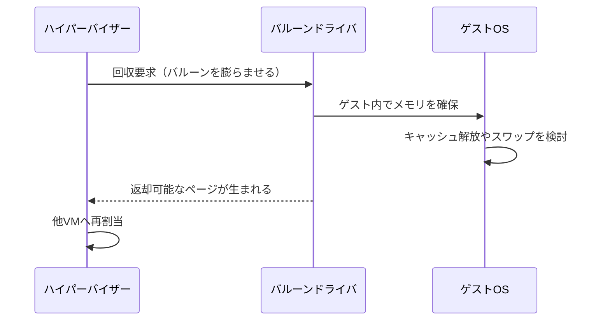
```mermaid
sequenceDiagram
  participant H as ハイパーバイザー
  participant B as バルーンドライバ
  participant G as ゲストOS

  H->>B: 回収要求（バルーンを膨らませる）
  B->>G: ゲスト内でメモリを確保
  G->>G: キャッシュ解放やスワップを検討
  B-->>H: 返却可能なページが生まれる
  H->>H: 他VMへ再割当
```

バルーニングの利点は、ゲストOSの判断を活かせることである。
欠点は、ゲストツールが必要なことと、ゲスト内スワップを誘発し得ることである。

### 圧縮

回収した、または回収対象のページを、ホストメモリ上で圧縮して保持する方式である。
ディスクへ出すよりは速いことが多いが、CPUコストが乗る。
「圧縮があるから逼迫してよい」ではなく、一時しのぎの層として理解する。

### スワップ（ハイパーバイザーレベル）

最終手段に近いのが、VMのメモリページをディスクへ退避することである。
製品によってスワップファイルの置き場や名前は異なる。

ディスク待ちが入るため、性能劣化が明確になる。
ゲスト内スワップとホストスワップは別物である。
両方同時に起きると、原因追跡が難しくなる。

```text
ゲスト内スワップ:
  ゲストOSが、自分のページファイル / スワップ領域へ退避

ホストスワップ:
  ハイパーバイザーが、VMのページをデータストア等へ退避
```

---

## 4.7 発動順の考え方

正確な順序は製品と版、設定で変わる。
学習用の一般モデルとしては、次の階段で捉えるとよい。

```text
1. 透明な効率化（共有など、効く場合）
2. ゲスト協力の回収（バルーニング）
3. ホスト内の高速しのぎ（圧縮など）
4. ディスク退避（スワップ）
```

設計で使うときの要点は、順序の暗記そのものではない。
「どの段まで日常的に許容するか」を決めることである。

通貫シナリオの推奨スタンス例：

- 共有：効果は観察対象。サイジングの前提にしない
- バルーン：短時間のピーク吸収はあり得るが、常時膨張は再設計信号
- 圧縮：過渡状態の指標として監視
- ホストスワップ：本番重要VMでは原則ゼロを目標にする

---

## 4.8 メモリ予約

**メモリ予約**は、そのVMのためにホスト上で最低限確保するメモリ量である。
予約分は、他VMの回収競争で奪われにくい。

利点は、重要VMのワーキングセットを守りやすいことである。
代償は、クラスタの収容能力が下がることである。
予約の合計が大きいと、HA時に「起動できない」「再配置できない」が起きやすくなる。

```text
予約なし:
  構成16GBでも、実際の裏づけは需要に応じて変動し得る

予約16GB:
  少なくとも16GB分のホストメモリを確保対象にする
  （実装差はあるが、思想はこの方向）
```

通貫シナリオでは、重要システム8台に満額予約を機械的に付ける前に、次を計算する。

1. ホスト1台障害時、残ホストのメモリで予約合計を支えられるか
2. 一般業務と開発のバースト余地が残るか
3. 管理オーバーヘッドを控除したか

CPU予約と同じく、「守るほど、詰め込み余地が減る」。
詳細なAdmission Control相当の話は第8章、第13章へ続く。

---

## 4.9 NUMAとの関係

第3章のNUMAは、CPUとメモリの近接性の話でもある。
メモリ仮想化では、次が重要になる。

- VMのメモリが、vCPUと同じNUMAノード近傍にあるか
- 大型VMが複数ノードにまたがるとき、ゲストにトポロジを見せるか
- バルーンや再配置で、局所性が崩れていないか

```text
良い配置のイメージ:
  Socket 0 のコアで走る vCPU
  + 同じ側のローカルメモリ

悪い配置のイメージ:
  Socket 0 のコアで走る
  + 実体ページが Socket 1 側
  = リモートアクセス増
```

通貫シナリオのホスト（2ソケット、512 GB）では、一般業務VM（8 GB）や開発VM（4 GB）は、1ノード内に収まりやすい。
重要VM（16 GB）も多くの場合収まるが、将来の増設で32 GB、64 GBへ伸ばすなら、ノード容量とvNUMAを再評価する。

メモリ予約や巨大な構成メモリは、「載るかどうか」だけでなく、「どこに載るか」を決める。
サイジング表にNUMA列を足すと、後工程が楽になる。

---

## 4.10 製品での実装例と用語対応

| 一般概念 | VMware（例） | Hyper-V（例） | KVM / libvirt（例） |
|----------|--------------|---------------|---------------------|
| 構成メモリ | Configured Memory | Startup / Maximum RAM | `memory` / `currentMemory` |
| バルーニング | Memory Balloon（VMware Tools連携） | Dynamic Memory の考え方（完全同一ではない） | virtio-balloon |
| メモリ共有 | TPS（Transparent Page Sharing）など | 実装と既定は世代で異なる | KSM（Kernel Samepage Merging） |
| 圧縮 | Memory Compression | 製品機能差あり | 環境と拡張に依存 |
| ホストスワップ | Swap to disk | Runtime memoryの逼迫時挙動を監視 | host swap / ディスク退避の運用面 |
| 予約 | Memory Reservation | Memory Reserve | ロックや cgroups、Huge Pages 運用など |
| ゲスト連携 | VMware Tools | Integration Services | qemu-guest-agent、balloonドライバ |

Dynamic Memory（Hyper-V）やメモリホットプラグは、「固定構成メモリ」とは別の運用モデルである。
一般概念のバルーニングと、製品の動的メモリ機能を同一視しすぎない。
共通して見るべきは、「ゲストに見えている量」「ホストが実際に与えている量」「回収や動的変更が起きているか」の三点である。

---

## 4.11 メモリ不足時の性能劣化

メモリ逼迫の症状は、CPU不足と似て「遅い」だが、観測点は異なる。

典型症状：

- アプリ応答が不定期に落ちる（ディスク退避の瞬間）
- ゲスト内でスワップ発生、ページアウト増加
- ホスト側でバルーン常時膨張、圧縮発生、スワップ発生
- 同じ処理でも、ある時間帯だけレイテンシが跳ねる
- ライブマイグレーションやHA再配置が、メモリ不足で失敗する

切り分けの型：

1. ゲスト内メモリとスワップを見る
2. ホストの空き、バルーン、圧縮、スワップを見る
3. データストア遅延を見る（ホストスワップの置き場が遅いと二重苦）
4. 特定VMのワーキングセット急増か、ホスト全体の詰め込み過多かを分ける

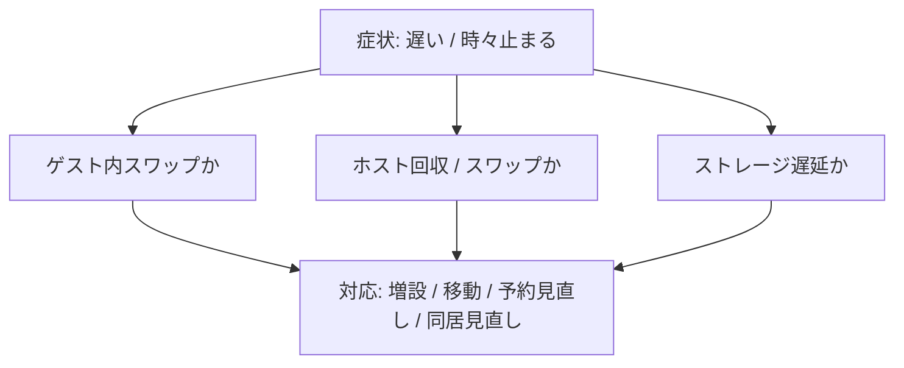
```mermaid
flowchart TD
  SYM["症状: 遅い / 時々止まる"]
  G["ゲスト内スワップか"]
  H["ホスト回収 / スワップか"]
  S["ストレージ遅延か"]
  ACT["対応: 増設 / 移動 / 予約見直し / 同居見直し"]

  SYM --> G
  SYM --> H
  SYM --> S
  G --> ACT
  H --> ACT
  S --> ACT
```

CPU Ready が高く、同時にホストスワップもある場合は、どちらか一方だけを直しても体感が戻らないことがある。
層を分けて記録する。

---

## 4.12 メモリサイジング

通貫シナリオの仮置きを使う。

| 区分 | 台数 | メモリ（仮） | 合計 |
|------|------|--------------|------|
| 重要システム | 8 | 16 GB | 128 GB |
| 一般業務 | 16 | 8 GB | 128 GB |
| 開発と検証 | 6 | 4 GB | 24 GB |
| VM合計 | 30 | | 280 GB |

ホスト3台、各512 GBなら、単純合計だけ見ると余裕に見える。
しかし設計の出発点としては、少なくとも次を控除する。

1. ハイパーバイザーと系統サービスのオーバーヘッド
2. ホスト1台障害時の再配置余地（N+1）
3. 成長（約1.5倍）後の増加分
4. バックアップや管理VMのメモリ
5. ピーク時のワーキングセット（構成値ではなく実測）

粗い思考実験（概念計算）：

- VM構成合計：280 GB
- 成長後1.5倍：420 GB
- 管理とオーバーヘッドの仮置き：ホストあたり数十GB規模を見込む
- 1ホスト障害時、残2台へ寄せる必要がある

この段階で「512 GB × 3 あれば十分」と確定しない。
確定は第13章で、計算式と余裕率を明示して行う。
本章で固定するのは方針である。

サイジング方針の例：

1. 重要VMは、実測ピークのワーキングセット + 余裕で構成する
2. ホストスワップ常態化を前提にしない
3. 開発VMの多重化で稼いだ余裕を、本番の必須容量に流用しない
4. 平均値ではなく、時間帯別のピークと95パーセンタイルを見る

```text
悪いサイジング:
  構成メモリ合計 <= 物理メモリ合計 ならOK

良いサイジングの起点:
  実測アクティブ + HA予備 + 成長 + 管理OH
  を満たし、逼迫時の救済が常態化しないこと
```

---

## 4.13 設計上の判断ポイント

| 判断 | 採用案 | 不採用案 | 理由とトレードオフ |
|------|--------|----------|--------------------|
| 本番のオーバーコミット | 重要VMは控えめ。実測で管理 | 全VMを大きくオーバーコミット | スワップ常態化を避ける。統合効率は開発側で稼ぐ |
| メモリ予約 | 重要VMに必要最小 | 全VM満額予約 | HA収容と両立させる |
| バルーン常時発生 | 再設計トリガ | 正常運用として放置 | 協力回収は過渡なら有用。常時は容量不足のサイン |
| ページ共有を前提にした減設 | しない | 共有率を容量計算に組み込む | 効果は不確実。セキュリティと版差もある |
| Dynamic Memory / 動的拡張 | 用途を分けて採用判断 | 全本番に無検証で適用 | 運用モデルが変わる。監視とアプリ適合が必要 |
| NUMA | 小型VMはノード内収まりを優先 | 巨大化を先に進める | リモートアクセス遅延を避ける |

不採用案が常に間違いなのではない。
検証環境やVDIなど、オーバーコミット前提の領域もある。
通貫シナリオの「重要8台を守る業務基盤」としては、上記の採用側が無難な起点になる。

---

## 4.14 性能上の注意点

- 構成メモリとアクティブメモリを混同しない
- ゲストの「空き少」だけで増設せず、キャッシュとワーキングセットを見分ける
- ホストスワップ発生時は、スワップ置き場のディスク遅延も同時に見る
- ネスト環境のメモリ挙動は実環境より悪化しやすい。絶対値評価に使わない
- メモリ不足は、CPU不足より体感悪化が急であることが多い
- スナップショットやバックアップが、一時的にメモリとI/Oを同時に押すことがある

---

## 4.15 セキュリティ上の注意点

- ページ共有は、理論上サイドチャネル議論の対象になり得る。機密度の高い同居方針と製品既定を確認する
- バルーンやゲストエージェントは、ホストとゲストの連携面である。版管理と不要機能の無効化が必要
- メモリダンプ、スワップファイル、ハイバネーション相当の退避領域には、機密が残る。保管先の権限と消去手順を決める
- 管理者が他VMのメモリ設定を自由に下げられる権限モデルは、実質的なサービス妨害手段になり得る
- 暗号化（機密VMのメモリ保護機能など）は製品固有機能として、一般のメモリ管理とは分けて評価する

---

## 4.16 障害例と切り分け

### 障害例1：特定時間帯だけ全VMが遅い

**症状**：毎朝のバッチ開始後、複数VMの応答が落ちる。CPU Readyは中程度。

**切り分け**：

1. ホストのバルーン、圧縮、スワップカウンタを時系列で見る
2. その時間帯に起動するVMやバックアップの有無を確認する
3. データストア遅延を確認する

**典型原因**：ピーク重なりによるメモリ逼迫と、スワップ置き場へのI/O競合。

### 障害例2：ゲストは空きがあるのにホストが逼迫と出る

**症状**：ゲスト内では空きメモリが多い。ホスト警報だけが上がる。

**切り分け**：

1. 構成合計とホスト実容量を比較する
2. 他VMのワーキングセットを確認する
3. バルーンが自VMに来ていないか確認する

**典型原因**：自分は空いていても、同居VMが実ページを食い、ホスト全体が不足している。

### 障害例3：重要VMだけが断続的に遅延する

**症状**：重要DBが数分おきに遅延。ゲスト内スワップも見える。

**切り分け**：

1. そのVMのバルーンサイズ推移を見る
2. メモリ予約の有無を確認する
3. 同一ホスト上の開発VM負荷を確認する

**典型原因**：予約なしの重要VMが、回収対象になっている。配置分離か予約の検討対象。

### 障害例4：HAや移行がメモリ理由で失敗する

**症状**：ホスト保守のための移行が失敗する。空きCPUはある。

**切り分け**：

1. 移行先ホストの実空きメモリを見る（構成空きではなく）
2. 予約合計とAdmission相当の制約を確認する
3. 巨大VMのNUMA/収まり制約がないか確認する

**典型原因**：表面上の空きと、予約込みの実質空きの不一致。

---

## 章末問題

### 問題1

ゲスト物理アドレス（GPA）とホスト物理アドレス（HPA）の違いを説明せよ。

### 問題2

メモリオーバーコミットが成立し得る条件と、本番重要VMで危険になりやすい理由を述べよ。

### 問題3

バルーニングとホストスワップの違いを、誰がページを手放すかの観点から説明せよ。

### 問題4

通貫シナリオでVMメモリ合計が280 GB、ホストが512 GB × 3台でも、即座に「十分」と言えない理由を3つ挙げよ。

### 問題5

メモリ予約を重要VMに付ける利点と、付けすぎたときの副作用を述べよ。

---

## 解答と解説

### 問題1

GPAはゲストOSが物理メモリだと思っているアドレスである。
HPAは実ホスト上の機械の物理アドレスである。
ハイパーバイザー（とハードウェア支援）が両者を対応づける。

### 問題2

成立し得る条件は、全VMが同時に構成メモリ上限まで触らないこと、すなわちワーキングセットのピークがずれることである。
危険な理由は、ピークが重なると回収やスワップが走り、遅延が急増し、重要業務のSLAを破りやすいからである。

### 問題3

バルーニングはゲスト内ドライバがゲストOSの管理下でメモリを占有し、ホストへ返す協力型回収である。
ホストスワップは、ハイパーバイザーがVMのページをディスクへ退避する側の動作である。
後者はゲストの協力なしにも起こり得て、性能悪化が大きい。

### 問題4

例：管理オーバーヘッド、ホスト1台障害時の再配置余地、成長後の増加、実測ワーキングセットと構成値の差、バックアップや管理VMの未計上。
いずれか3つ以上を挙げられればよい。

### 問題5

利点は、競合時に重要VMのメモリを守りやすいこと。
副作用は、クラスタ収容能力の低下、HAや移行の失敗、他VMの多重化余地の減少である。

---

## ハンズオン演習

### 演習1：二層の観測点を書く

学習環境のVMについて、次を記録せよ。

| 観点 | どこで見るか | 実際の値 / 観察 |
|------|--------------|-----------------|
| 構成メモリ | | |
| ゲスト内使用率 | | |
| ホスト側の割当 / アクティブ | | |
| バルーンの有無 | | |
| スワップの有無 | | |

取れない項目は「未取得」と書き、代わりにどの画面やコマンドが候補かを書く。

### 演習2：逼迫の模擬と切り分け

可能なら次を行う。

1. 複数VMでメモリを消費する処理を同時に走らせる
2. ゲスト内スワップとホスト側回収の兆候を観察する
3. 症状、層（ゲスト / ホスト / ストレージ）、確認結果を切り分けメモに残す

ネスト環境では、発生しやすさや絶対値は参考にとどめる。

### 演習3：通貫シナリオのメモリ計算メモ

次を計算し、前提を明示して書け。

1. VM構成メモリ合計（仮置き）
2. 成長1.5倍後の合計
3. ホスト1台停止を想定したとき、残ホストで支えるために必要な観点
4. 重要8台に満額予約した場合の利点と懸念

数値は出発点であり、確定値にしない。

### 成果物

- 二層観測表
- 切り分けメモ
- メモリ計算と設計判断メモ

---

## 本章のまとめ

メモリ仮想化は、ゲストに物理メモリを見せつつ、ホスト上で実ページを多重利用する二層の仕組みである。
オーバーコミットはピークのずれを前提に成立するが、不足時の救済はバルーン、圧縮、スワップへと進み、ディスクが絡むと性能が急落する。
予約は重要VMを守る一方で収容能力を削る。
NUMAはCPUだけでなくメモリ局所性の制約でもある。
通貫シナリオでは、構成合計の楽観視を避け、実測ワーキングセット、HA予備、成長、管理オーバーヘッドをサイジングの起点に置く。


---


<!-- source: 05_storage_virtualization.md -->

# 第5章 ストレージ仮想化

## 学習目標

1. 仮想ディスクとデータストアの関係を説明できる
2. DAS / SAN / NAS、FC / iSCSI / NFS を用途で選べる
3. シンプロビジョニングとシックプロビジョニング、スナップショット、クローンの違いを説明できる
4. IOPS、レイテンシ、キュー、マルチパスを性能切り分けに使える
5. スナップショットを長期間保持すべきでない理由を説明でき、スナップショットとバックアップを区別できる

---

## 5.1 ストレージ仮想化が必要になった背景

仮想マシンは、起動イメージとデータをどこかに置かなければ動かない。
物理サーバー時代は、その「どこか」がサーバー内蔵ディスクであることが多かった。
仮想化でホスト上に多数のVMを載せると、内蔵ディスクだけでは足りなくなる。

問題は容量だけではない。
通貫シナリオでは、ホスト1台障害時も重要システムを継続する。
そのためには、障害ホスト上のVMを別ホストで起動できる必要がある。
別ホストが同じディスク内容を読めなければ、HAもライブマイグレーションも成立しない。

ここに、仮想化基盤におけるストレージの役割が現れる。

1. 各VMに「自分専用のディスク」を見せる
2. 実際のデータは、複数ホストから参照できる領域に置く
3. 容量、性能、冗長性をホスト横断で管理する

**ストレージ仮想化**とは、物理ディスクやストレージ装置の実体を抽象化し、仮想マシンやハイパーバイザーが論理的なディスク資源として使えるようにする仕組みである。
製品によってはストレージ側の機能を指す場合もある。
本書の主眼は、仮想化ホストから見たストレージの見せ方と使い方である。

通貫シナリオの初期前提は、共有ストレージ（SAN の iSCSI、または分散ストレージ）と、実効 20 TB 起算のデータストアである。
この章では、その前提がなぜ必要か、どこで破綻するかを具体化する。

---

## 5.2 仮想ディスクとデータストア

### 仮想ディスク

**仮想ディスク**とは、仮想マシンに見せるブロックデバイス（またはそれに相当するディスク）である。
ゲストOSからは、物理HDDやSSDと同じように見える。
実体は、多くの場合、データストア上のファイル、またはLUN上の領域である。

仮想ディスクには、少なくとも次の属性がある。

- 容量（ゲストに見えるサイズ）
- フォーマット（製品固有のファイル形式）
- プロビジョニング方式（シンかシックか）
- コントローラ種別（準仮想化 SCSI など）

ゲストが「C: ドライブ 100 GB」と認識していても、ホスト側では 1 個以上の仮想ディスクファイルとして存在する。
この対応を見失うと、容量逼迫やスナップショット肥大の原因追跡ができなくなる。

### データストア

**データストア**とは、ハイパーバイザーが仮想マシンのファイル（仮想ディスク、構成ファイル、スナップショット差分など）を置く論理的な保管領域である。
製品用語では datastore（VMware）、CSV / 共有ボリューム（Hyper-V）、ストレージドメイン（oVirt）などと呼ぶ。
一般概念としては、「ホスト群がマウントして使う VM 用保管庫」と捉える。

```text
+------------------+  +------------------+
| VM-A             |  | VM-B             |
| 仮想ディスクA.vmdk|  | 仮想ディスクB.vhd |
+--------+---------+  +--------+---------+
         |                     |
         v                     v
+----------------------------------------+
|              データストア               |
|  (ファイル群 / LUN上の領域)              |
+------------------+---------------------+
                   |
                   v
+----------------------------------------+
|     物理ストレージ（SAN / NAS / 分散）   |
+----------------------------------------+
```

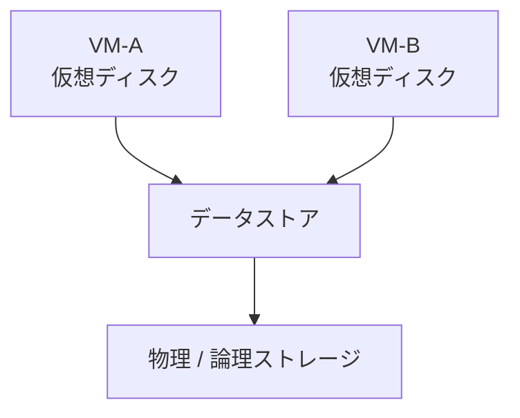
```mermaid
flowchart TB
  VMA["VM-A<br/>仮想ディスク"]
  VMB["VM-B<br/>仮想ディスク"]
  DS["データストア"]
  STOR["物理 / 論理ストレージ"]

  VMA --> DS
  VMB --> DS
  DS --> STOR
```

仮想ディスクは「VMから見たディスク」であり、データストアは「ホストから見た保管場所」である。
設計議事録では、両者を混同しない。

通貫シナリオでは、重要VM 8台 × 200 GB、一般 16台 × 100 GB、開発 6台 × 80 GB が仮置きである。
単純合計は約 3.7 TB だが、これはゲストに見せる容量の合計にすぎない。
スナップショット余裕、ログ、スワップファイル、テンプレート、バックアップ作業領域、成長率を別途積む。
実効 20 TB 起算は、その余裕を見込んだ出発点である。

---

## 5.3 ブロックストレージとファイルストレージ

ストレージの提供形態は、大きく二つに分かれる。

### ブロックストレージ

**ブロックストレージ**は、固定長のブロック列として領域を提供する。
ホストは、その領域をローカルディスクのように扱い、ファイルシステムを載せる。
仮想化では、LUN をデータストア用にフォーマットする構成が典型である。

特徴は次である。

- ホストがファイルシステムを制御する
- 低レイテンシを狙いやすい
- 複数ホストで同時に読む場合、クラスタ対応のファイルシステムや専用ロック機構が必要

### ファイルストレージ

**ファイルストレージ**は、ファイルとディレクトリを提供する。
ホストは NFS などで共有をマウントし、その上に仮想ディスクファイルを置く。

特徴は次である。

- 共有の見せ方が直感的
- ストレージ側のファイルシステムを利用する
- プロトコルとネットワーク品質が性能を左右する

| 観点 | ブロック | ファイル |
|------|----------|----------|
| 提供単位 | LUN / ボリューム | 共有エクスポート |
| 典型プロトコル | FC、iSCSI | NFS、SMB |
| ホスト側の役割 | ファイルシステムを載せる | 共有をマウントする |
| 仮想化での使い方 | データストア用LUN | NFSデータストア |

どちらが常に優れているわけではない。
通貫シナリオでは、共有ストレージ前提で HA を成立させることが先であり、ブロックかファイルかは第14章の選定対象になる。

---

## 5.4 DAS、SAN、NAS

接続トポロジの分類である。

### DAS

**DAS（Direct Attached Storage）**は、ホストに直接接続されたストレージである。
内蔵ディスクや、ホスト専用の外部 JBOD が該当する。

利点は単純さと低遅延である。
欠点は、他ホストから直接共有しにくいことである。
単一ホスト構成や、ローカルディスクを使う分散ストレージの部品としては使える。
ただし、古典的な「ホスト内蔵だけ」の構成では、通貫シナリオのホスト障害時継続が難しくなる。

### SAN

**SAN（Storage Area Network）**は、ブロックストレージをネットワーク経由で複数ホストに提供する構成である。
FC SAN や iSCSI SAN が代表である。

仮想化クラスタでは、複数ホストが同じLUN（または同等の領域）をデータストアとして共有する。
HA とライブマイグレーションの土台になることが多い。

### NAS

**NAS（Network Attached Storage）**は、ファイルストレージをネットワーク経由で提供する構成である。
NFS をデータストアにする構成が、仮想化ではよく使われる。

```text
DAS:
  Host ---- Disk

SAN:
  Host-1 --+
  Host-2 --+-- Storage Network -- Storage Array (LUN)
  Host-3 --+

NAS:
  Host-1 --+
  Host-2 --+-- IP Network -- NAS (NFS export)
  Host-3 --+
```

通貫シナリオの「共有ストレージ」は、SAN または NAS（あるいは分散ストレージ）のいずれかである。
分散ストレージは、複数ホストのローカルディスクを束ねて共有プールを作る方式であり、DAS を部品にしつつ共有性を得る。
分類名より、「複数ホストが同じVMディスクを読めるか」が設計上の分岐点である。

---

## 5.5 FC、iSCSI、NFS

プロトコルの選択は、帯域、遅延、運用スキル、既存設備に依存する。

### FC

**FC（Fibre Channel）**は、ストレージ専用のブロック転送プロトコルとファブリックである。
専用HBAとスイッチを用いることが多い。

特徴：

- 業務IPネットワークと物理的に分離しやすい
- 成熟したSAN運用がある環境で強い
- 導入コストと専用技能が必要

### iSCSI

**iSCSI**は、SCSI コマンドを TCP/IP 上で運ぶブロックプロトコルである。
既存の Ethernet を使える。

特徴：

- IPネットワーク上でSAN相当を組める
- 10GbE 以上とジャンボフレーム、専用VLANがあると安定しやすい
- 業務トラフィックとの混在は避ける

通貫シナリオの初期前提に iSCSI が入っているのは、専用FCがなくても共有ブロックを組み立てやすいからである。
採用確定ではない。

### NFS

**NFS（Network File System）**は、ファイル共有プロトコルである。
仮想化では NFS データストアとして使う。

特徴：

- 構成が比較的わかりやすい
- ストレージ側のスナップショット機能と組み合わせやすい場合がある
- ネットワーク品質と NFS の版、マウントオプションが性能に効く

| プロトコル | 種別 | 向く場面 | 注意点 |
|------------|------|----------|--------|
| FC | ブロック | 専用SANがある本番 | コスト、技能 |
| iSCSI | ブロック | IPベースでSANを組む | ストレージVLAN必須 |
| NFS | ファイル | 簡易共有、運用簡素化 | 網の品質依存 |

製品固有の最適化（VMware の VAAI、Hyper-V の Offloaded Data Transfer など）は、一般概念ではなく実装加速である。
原理理解の後に、対応可否を確認する。

---

## 5.6 シンプロビジョニングとシックプロビジョニング

仮想ディスクの容量の「見せ方」と「実確保」の差である。

### シックプロビジョニング

**シックプロビジョニング**は、作成時に指定容量ぶんの領域を確保する方式である。
ゲストに 200 GB を見せるなら、データストア上でも概ね 200 GB を先に取る。

利点：

- 実行時の領域不足が起きにくい
- 性能が安定しやすい場合がある（ゼロ初期化の有無で差がある）

欠点：

- 未使用領域も占有する
- 初期の空き容量を圧迫する

### シンプロビジョニング

**シンプロビジョニング**は、実際に書き込まれた分だけ領域を使う方式である。
ゲストには 200 GB を見せても、実使用が 40 GB ならデータストア消費はそれに近い。

利点：

- 見かけ上の過割当で、短期の収容効率が上がる
- 開発用と検証用のVMに向く

欠点：

- 実使用が増えると、突然データストアが逼迫する
- 監視とアラートが必須
- 書き込み時の領域確保コストが乗ることがある

```text
ゲストに見える容量: 200 GB

シック:
  データストア消費 ≈ 200 GB（作成直後から）

シン:
  データストア消費 ≈ 実使用分（例: 40 GB）
  実使用が増えると消費も増える
```

通貫シナリオでは、重要システムはシック、開発と検証はシン、という使い分けが候補になる。
「全部シンにして 20 TB に 45台分を無理に載せる」は、逼迫事故の典型である。
理論上の合計割当と、実測の使用量と、データストア空きを別指標で見る。

---

## 5.7 スナップショットとクローン

### スナップショット

**スナップショット**とは、ある時点の仮想マシン状態（通常は仮想ディスクの状態、製品によってはメモリも含む）を記録し、そこへ戻せるようにする機能である。
実装の多くは、元ディスクへの書き込みを止め、以降の差分を別ファイルへ書く。

```text
時刻T0: スナップショット取得
  base.vmdk  (読み取り主体)
  snap1.delta (以降の書き込み)

時刻T1: さらにスナップショット
  base.vmdk
  snap1.delta
  snap2.delta
```

用途の中心は、変更前の短い退避である。

- パッチ適用前
- 設定変更前
- 検証作業の分岐

### スナップショットはバックアップではない

ここを混同すると、基盤障害になる。

| 観点 | スナップショット | バックアップ |
|------|------------------|--------------|
| 目的 | 短期間の巻き戻し | 障害、災害、誤削除からの復旧 |
| 保管場所 | 同一データストア上であることが多い | 別媒体、別サイトが原則 |
| データストア障害時 | 一緒に失われる | 残る設計にする |
| 保持期間 | 短い（時間〜数日） | 方針に従い長期 |
| 本番保護の主役か | 否 | はい |

スナップショットは、同一ストレージ上の差分管理である。
データストアが壊れれば、本番ディスクもスナップショットも同時に失われる。
通貫シナリオの「日次バックアップ、遠隔地へ週次レプリケーション」は、スナップショットでは代替できない。
詳細は第9章だが、第5章の時点で運用ルールに書いておく。

### スナップショットを長期間保持すべきでない理由

1. 差分ファイルが肥大し、データストアを圧迫する
2. 読み書きが base + 差分の連鎖になり、レイテンシが悪化する
3. 削除（統合）時に大きなI/O負荷が発生し、本番を揺らす
4. スナップショット連鎖が長いと、バックアップや移行が失敗しやすくなる
5. 「取ってあるから安全」という誤った安心感が、本当のバックアップ設計を止める

通貫シナリオで、開発VMのスナップショットを数週間放置すると、20 TB 起算でも実効空きが急減しうる。
第1章の障害例（開発スナップショットが本番を圧迫）は、この章の典型事故である。

運用ルールの例：

- 保持は原則 72 時間以内
- 本番重要VMは変更作業以外で取らない
- 取得者と削除期限を記録する
- 監視でスナップショット有無を検知する

### クローン

**クローン**とは、仮想マシンを複製して、別の仮想マシンを作ることである。
フルクローンは独立したディスクを持ち、リンククローン（または類似機能）は親と差分を共有する。

| 方式 | 独立性 | 用途 |
|------|--------|------|
| フルクローン | 高い | 本番近い複製、長期利用 |
| リンククローン系 | 親に依存 | 大量の短期検証 |

クローンは「別VMを作る」操作であり、スナップショットは「同一VMの時点保存」である。
テンプレートからの展開は第7章で扱う。

---

## 5.8 IOPS、レイテンシ、キュー、マルチパス

### IOPS

**IOPS（Input/Output Operations Per Second）**は、1秒あたりのI/O発行数である。
ランダムな小さなI/Oが多いワークロード（DBなど）で重要になる。

注意点：

- カタログIOPSは理論値に近い上限である
- 実測IOPSは、I/Oサイズ、読書き比、キャッシュ、混在負荷で変わる
- 「データストア全体のIOPS」と「1VMのIOPS」を混同しない

### レイテンシ

**レイテンシ**は、I/Oが完了するまでの時間である。
仮想化では、ゲストから見える遅延と、データストア側の遅延を分けて見る。

目安の感覚（絶対値ではなく切り分けの手がかり）：

- 普段より桁が変わる上昇は異常合図
- CPU使用率が低いのに業務が遅いとき、ストレージ遅延を疑う

ネスト環境の絶対値は実環境と異なる。
相対比較と手順練習に使う。

### キュー

**キュー**は、処理待ちのI/Oのたまりである。
デバイスやHBA、ストレージ側に待ち行列ができると、レイテンシが伸びる。

見るべき関係は次である。

```text
発行IOPSが増える
  → 処理能力を超える
    → キューが伸びる
      → レイテンシが悪化する
        → ゲストがI/O待ちで遅くなる
```

CPU Ready が高くないのに遅い場合、ストレージキューを疑う。

### マルチパス

**マルチパス**とは、ホストとストレージの間に複数の物理経路を持ち、冗長化と負荷分散を行う仕組みである。
片方のケーブル、HBA、スイッチが落ちても、残経路でI/Oを継続する。

```text
Host
  |-- Path A --> Switch A --> Controller A --+
  |                                         +--> LUN
  |-- Path B --> Switch B --> Controller B --+
```

通貫シナリオで共有ストレージを使うなら、マルチパスは「あると良い」ではなく、単一障害点を消す必須設計に近い。
パスポリシー（固定、ラウンドロビンなど）は製品とアレイ推奨に従う。

### ストレージ障害の影響

仮想化では、ストレージ障害の影響範囲が物理1台障害より広くなりやすい。
共有データストア上の多数のVMが、同じ障害を同時に受けるからである。

| 障害 | 影響範囲 | 典型症状 | 緩和 |
|------|----------|----------|------|
| パス1本断 | マルチパスなら狭い | 一瞬の遅延、パスフェイルオーバーログ | マルチパス、二重スイッチ |
| コントローラ1台障害 | アレイ冗長に依存 | 遅延上昇、フェイルオーバー中のI/O待ち | 二重コントローラ、推奨パス設定 |
| データストア満杯 | そのデータストア上の全VM | 書き込み失敗、スナップショット肥大、ハング | 容量監視、シン上限、スナップショット禁止運用 |
| ストレージ全体停止 | 該当LUN/シェアを使う全ホスト・全VM | I/Oハング、VM停止、HAでも起動不能 | アレイ冗長、バックアップ、遠隔レプリカ |
| バックアップ窓の過負荷 | ピークと重なったVM群 | レイテンシ上昇、CPU待ちとの複合遅延 | 窓の分離、並列度制限 |

**ストレージ障害の影響**を見積もるときは、「どのVMがどのデータストアに載っているか」を先に表にする。
重要8台を1つのデータストアに詰めすぎると、そのデータストア障害が要件の可用性を一気に壊す。

通貫シナリオでは、次を設計の前提にする。

1. 重要VMと一般VMでデータストアを分ける、または少なくとも復旧優先度を付ける
2. マルチパスを必須にする
3. ストレージ全体停止を「起きない」ではなく「起きたらバックアップと遠隔で戻す」対象にする
4. HAはホスト障害向けであり、共有ストレージ全損の代替にはならない

---

## 5.9 製品に依存しない共通概念と実装例

### 共通概念の整理

| 共通概念 | 意味 |
|----------|------|
| 仮想ディスク | VMに見えるディスク |
| データストア | VMファイルの保管庫 |
| 共有ストレージ | 複数ホストが同じ領域を使えること |
| プロビジョニング | 容量の確保タイミング |
| スナップショット | 短期間の差分時点 |
| マルチパス | 経路冗長 |

### 代表製品での実装例

| 共通概念 | VMware | Hyper-V | KVM系 |
|----------|--------|---------|-------|
| 仮想ディスク | VMDK | VHDX | qcow2 / raw |
| データストア | datastore | CSV、共有ディスク、SMB | ストレージプール、NFS、LVM など |
| シン | Thin | 動的展開 | qcow2 の疎割り当てなど |
| シック | Thick（Lazy/Eager） | 固定サイズ | raw 事前確保など |
| スナップショット | Snapshot | Checkpoint | 外部/内部スナップショット |
| マルチパス | NMP / PSA | MPIO | DM-Multipath |

名前は製品固有である。
設計書には、まず共通概念で書き、括弧で製品用語を添える。

---

## 5.10 設計上の判断ポイント

通貫シナリオへの接続として、ストレージ判断を表にする。

| 判断 | 採用案（候補） | 不採用案 | 理由とトレードオフ |
|------|----------------|----------|--------------------|
| 配置 | 共有ストレージ（iSCSI SAN または分散） | 全VMをホスト内蔵のみ | HAと移行のため共有が必要。共有はSPOFになりうるので冗長化必須 |
| プロトコル | iSCSI または NFS を比較選定 | 技能も予算もないのに FC 前提 | 既存網と技能に合わせる。FCは性能と分離に強いがコスト高 |
| 重要VMのディスク | シック | 重要VMまで全面シン | 逼迫リスクを下げる。効率は落ちる |
| 開発VM | シン + スナップショット期限付き | 無期限スナップショット | 収容効率と事故防止の両立 |
| パス | マルチパス必須 | 単一パス | ケーブル1本障害でクラスタ全域影響を避ける |
| 保護 | バックアップとレプリケーション | スナップショットをバックアップ扱い | 保管場所と目的が異なる |

単一障害点の確認項目：

- ストレージコントローラが単一でないか
- ネットワークスイッチがストレージで単一でないか
- データストアが1つに集中しすぎていないか（性能と障害の両面）

障害時の挙動：

- パス1本断：マルチパスなら継続
- ストレージ全体停止：全ホスト上の該当データストアVMが停止またはI/Oハング
- データストア満杯：新規書き込み失敗、スナップショット肥大時は広範囲遅延

---

## 5.11 性能上の注意点

- 理論IOPS（カタログ）と実測IOPS（監視）を混同しない
- バックアップ、フルスキャン、スナップショット統合は、本番ピークと重ねない
- シンプロビジョニングの「まだ空いている」は、急激に埋まる前提で監視する
- NFS / iSCSI を業務VLANに混ぜると、帯域競合でレイテンシが壊れる
- ネスト環境のストレージ遅延は学習用であり、サイジング根拠にしない
- キューが伸びているのにディスクを増やす前に、混在ワークロードとパス状態を見る

通貫シナリオの成長（30台→45台）では、容量だけでなくIOPSとレイテンシの頭打ちを再測定する。
容量に余裕があっても、IOPSが足りなければ業務は遅い。

---

## 5.12 セキュリティ上の注意点

- ストレージネットワークは業務ネットワークから分離する
- iSCSI の認証（CHAPなど）と、管理インターフェースの到達制限を行う
- NFS エクスポートは必要ホストに限定する（広く export しない）
- データストア削除権限は最小人数に絞る
- スナップショットやクローンに機密データが残ることを前提に、廃棄手順を決める
- バックアップ保管先の権限と暗号化は第9章、第10章で扱うが、ストレージ設計時点で要件に含める

ストレージ網が平文で業務網と同じ放送域にある構成は、盗聴と誤接続の両面で危険である。

---

## 5.13 障害例と切り分け

### 障害例1：全VMが同時に遅い

**症状**：特定ホストに限らず、データストア上の多数VMがI/O待ち。

**確認順**：

1. データストアのレイテンシと空き容量
2. ストレージ側のコントローラ負荷、ディスク障害灯
3. バックアップジョブやスナップショット統合の同時実行
4. マルチパスの片系断による縮退

**典型原因**：共有点の飽和。仮想化固有というより、共有ストレージの容量か性能の問題。

### 障害例2：あるVMだけディスクエラー

**確認順**：

1. そのVMの仮想ディスク肥大、スナップショット有無
2. ゲスト内ファイルシステム
3. 同一データストアの他VMは健全か

**典型原因**：当該VMのスナップショット連鎖、ゲスト内満杯、仮想ディスク破損。

### 障害例3：HAは動くが、フェイルオーバー後に起動失敗

**確認順**：

1. 移行先ホストからデータストアが見えるか
2. パス状態、マウント状態
3. ロックや権限

**典型原因**：共有に見えていたが、実際はホストローカルだった。または片系パスしかなく、別ホストから到達不能。

### 障害例4：スナップショット削除後にさらに遅くなった

**確認順**：

1. 統合（consolidate）処理が走行中か
2. データストアレイテンシ
3. 差分サイズの事前見積もりがあったか

**典型原因**：長期保持した差分の統合負荷。だからこそ長期保持しない。

切り分けメモの型：

```text
症状 → 影響範囲（1VM / 1ホスト / データストア全体）
 → 層（ゲスト / 仮想ディスク / データストア / 物理ストレージ / パス）
 → 仮説 → 確認コマンドまたは画面 → 結果 → 次アクション
```

---

## 章末問題

### 問題1

仮想ディスクとデータストアの違いを、VM視点とホスト視点で説明せよ。

### 問題2

通貫シナリオで、全VMをホスト内蔵DASのみに置いた場合、どの要件が満たせなくなるか。

### 問題3

シンプロビジョニングの利点と、本番重要VMへの全面適用が危険な理由を述べよ。

### 問題4

スナップショットをバックアップの代わりにしてはならない理由を、保管場所の観点を含めて説明せよ。

### 問題5

次の指標の役割を一文ずつ述べよ。IOPS、レイテンシ、キュー、マルチパス。

### 問題6

スナップショットを長期間保持すべきでない理由を3つ挙げよ。

---

## 解答と解説

### 問題1

仮想ディスクは、VM（ゲスト）に見せるディスク装置である。
データストアは、ホストが仮想ディスクファイルなどを置く保管領域である。

### 問題2

ホスト1台障害時に、別ホストで同じディスク内容を読んでVMを継続起動する要件が満たせなくなる。
HAとライブマイグレーションの前提が崩れる。

### 問題3

利点は、実使用分だけ消費し収容効率が上がることである。
危険な理由は、実使用の急増でデータストアが突如満杯になり、多数VMの書き込みが失敗または遅延するからである。

### 問題4

スナップショットは同一データストア上の差分であることが多く、データストア障害で本番データと同時に失われる。
バックアップは別媒体や別サイトへ独立して保管し、災害やランサムウェアに備える役割である。
目的も障害モデルも異なる。

### 問題5

IOPSは単位時間あたりのI/O回数の指標である。
レイテンシはI/O完了までの時間である。
キューは処理待ちI/Oのたまりである。
マルチパスはホストとストレージ間の経路冗長（と負荷分散）である。

### 問題6

例：差分肥大による容量逼迫、I/O経路の複雑化による性能劣化、削除統合時の高負荷。
加えて、バックアップ代替という誤解を生む点も重大である。

---

## ハンズオン演習

### 演習1：対応図を描く

学習環境について、次を図示せよ（Mermaid またはテキスト）。

1. VM
2. 仮想ディスク
3. データストア（または相当）
4. 実体ストレージ（ローカル、NFS、iSCSIなど）

### 演習2：シンとシックの差を観察する

可能なら、同容量の仮想ディスクをシンとシックで作り、作成直後のデータストア消費を比較せよ。
ネスト環境では絶対値より差分の有無を記録する。

### 演習3：スナップショット実験（短時間で削除）

1. 検証用VMのスナップショットを取る
2. ファイルを追加して差分を作る
3. レイテンシまたはディスク関連指標を記録する
4. スナップショットを削除し、統合完了まで見る
5. 「バックアップではない」ことを設計判断メモに明記する

本番相当のVMでは実施しない。

### 演習4：通貫シナリオの容量メモ

仮置きVM構成から、次を計算せよ。

1. ゲスト提示容量の合計
2. スナップショット余裕を 20% と置いた場合の加算
3. 実効 20 TB に対する初期使用率（理論値）

これは出発点であり、実測で置き換える前提を一文添える。

### 成果物

- ストレージ対応図
- シン/シック比較メモ
- スナップショット実験ログ（取得〜削除）
- 通貫シナリオ容量メモ（採用理由と不採用案を短く）

---

## 本章のまとめ

仮想化のストレージは、VMに仮想ディスクを見せつつ、実体をデータストアへ集約する。
クラスタでHAや移行を行うなら、複数ホストが読める共有が前提になる。
シンとシック、FCとiSCSIとNFS、DASとSANとNASは、効率、性能、コスト、技能のトレードオフである。

スナップショットは短期の巻き戻し手段であり、バックアップではない。
長期間の保持は、容量、性能、運用判断をまとめて悪化させる。
IOPS、レイテンシ、キュー、マルチパスを見れば、遅い原因がCPUなのかストレージなのかを切り分けやすい。

続いて必要になるのは、仮想NICと仮想スイッチを軸にしたネットワーク仮想化である。
管理、業務、ストレージ、マイグレーションを分けて運ぶ理由を、そこで具体化する。


---


<!-- source: 06_network_virtualization.md -->

# 第6章 ネットワーク仮想化

## 学習目標

1. 仮想NIC、仮想スイッチ、ポートグループ、VLAN、アップリンクの関係を図示できる
2. ホスト内通信と外部通信の経路差を説明できる
3. 管理、ストレージ、マイグレーション、業務ネットワークの分離理由を説明できる
4. オーバーレイ（VXLAN の概要）と SR-IOV の位置づけを説明できる
5. 仮想ネットワーク障害の切り分け手順を層別に説明できる

---

## 6.1 ネットワーク仮想化が必要になった背景

仮想マシンが増えると、物理NICの本数だけでは足りない。
通貫シナリオの初期だけでも VM は 30 台あり、各VMに1つ以上のネットワーク接続が必要になる。
物理ケーブルを30本挿すわけにはいかない。

同時に、用途の異なる通信が同じ線に混ざると事故る。

- 管理画面への到達
- 業務アプリケーションの通信
- iSCSI や NFS のストレージI/O
- ライブマイグレーションのメモリ転送

これらを無分離のまま同一セグメントに流すと、帯域競合、障害の波及、権限境界の崩壊が起きる。
通貫シナリオが「管理 / 業務 / ストレージ / マイグレーション」の分離を前提にする理由は、ここにある。

**ネットワーク仮想化**とは、物理NICと物理スイッチの上に、仮想NICや仮想スイッチなどの論理ネットワークを構成し、複数VMの通信を分離して同じ物理資源上で多重化する技術である。
本書がここで扱う範囲は、ハイパーバイザー上の仮想ネットワークである。
SDN 全体やクラウドの VPC は、比較に必要な範囲に限定する。

---

## 6.2 仮想NIC、仮想スイッチ、ポートグループ、VLAN、アップリンク

### 仮想NIC

**仮想NIC（vNIC）**とは、仮想マシンに装着される仮想的なネットワークインターフェースである。
ゲストOSからは、普通のNICに見える。
ドライバが準仮想化（VMXNET3、virtio-net など）かエミュレーションかで、性能が大きく変わる（第2章）。

1つのVMに複数のvNICを付け、用途別に接続先を変えることができる。
例：業務用vNICと、バックアップ用vNIC。

### 仮想スイッチ

**仮想スイッチ（vSwitch）**とは、ハイパーバイザー内で動作するソフトウェアスイッチである。
vNIC同士、および vNIC と物理NICのあいだでフレームを転送する。

物理スイッチと似た役割を持つが、配置場所がホスト内である点が異なる。
同一ホスト上のVM同士なら、物理スイッチを経由せずに通信できる場合がある。

### ポートグループ

**ポートグループ**とは、仮想スイッチ上のポートに対する設定の束である。
VLAN ID、セキュリティポリシー、チーミング方針などを、まとめてVMの接続先に適用する。

製品用語は Port Group（VMware）、仮想スイッチのネットワーク（Hyper-V）、論理ネットワーク（oVirt）などと揺れる。
一般概念としては、「同じ通信ポリシーを共有する仮想ポートの集合」である。

### VLAN

**VLAN（Virtual LAN）**とは、L2 ネットワークを論理的に分割する仕組みである。
同一の物理スイッチや仮想スイッチ上でも、VLAN ID が違えば放送域を分けられる。

仮想化では、ポートグループに VLAN ID を割り当て、アップリンク側でタグ付き（trunk）にする構成が基本になる。

### アップリンク

**アップリンク**とは、仮想スイッチを物理NICへつなぐ出口である。
仮想スイッチ上の通信を、外部の物理スイッチやルータへ出すときに使う。

```text
+--------+   +--------+
| VM-A   |   | VM-B   |
| vNIC   |   | vNIC   |
+---+----+   +---+----+
    |            |
    v            v
+------------------------+
| 仮想スイッチ            |
|  port group: App (VLAN10)|
|  port group: Mgmt(VLAN5)|
+-----------+------------+
            | アップリンク
            v
      物理NIC (vmnic0)
            |
            v
      物理スイッチ
```

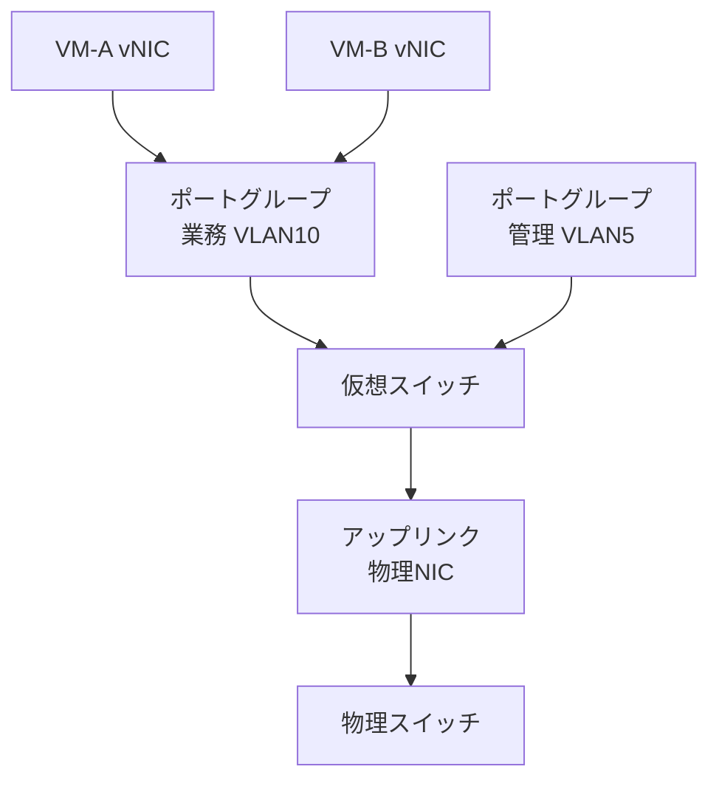
```mermaid
flowchart TB
  VMA["VM-A vNIC"]
  VMB["VM-B vNIC"]
  PG1["ポートグループ<br/>業務 VLAN10"]
  PG2["ポートグループ<br/>管理 VLAN5"]
  VS["仮想スイッチ"]
  UP["アップリンク<br/>物理NIC"]
  PS["物理スイッチ"]

  VMA --> PG1
  VMB --> PG1
  PG1 --> VS
  PG2 --> VS
  VS --> UP
  UP --> PS
```

関係を一文で言うと次になる。
VMのvNICがポートグループに接続し、ポートグループが仮想スイッチに属し、仮想スイッチがアップリンク経由で物理網へ出る。

---

## 6.3 NICチーミング

**NICチーミング**とは、複数の物理NICを束ね、冗長化や帯域集約に使うことである。
仮想スイッチのアップリンクを複数本にし、片方のNICやケーブル障害でも通信を継続する。

主な目的は次の二つである。

1. 可用性：片系断でも残系で継続
2. 負荷分散：フローを複数NICへ分散（方式依存）

注意点：

- 「2本あれば帯域が常に2倍」ではない。負荷分散アルゴリズムと対向設定に依存する
- 理論リンク速度の合計と、実測スループットを混同しない
- 物理スイッチ側の設定（LACP の要否など）とセットで設計する

通貫シナリオでは、少なくとも管理と業務のアップリンクに冗長を付ける。
ストレージとマイグレーションも、可能なら専用NICを冗長化する。

---

## 6.4 仮想マシン間通信、ホスト内通信、外部通信

### 同一ホスト内のVM間通信

同じ仮想スイッチ（および到達可能なポートグループ/VLAN）上のVM同士は、ホスト内で転送されることが多い。
経路は概ね次である。

```text
VM-A vNIC → 仮想スイッチ → VM-B vNIC
```

物理NICを出ないため、物理スイッチの障害影響を受けにくい。
その代わり、ホストのCPUとメモリ帯域を消費する。

### 異なるホスト上のVM間通信

```text
VM-A → 仮想スイッチ → アップリンク → 物理スイッチ → 対向ホスト → 仮想スイッチ → VM-B
```

物理網のVLAN設計、配線、スイッチ冗長がそのまま効く。

### 外部通信（インターネット、他セグメント、ユーザー端末）

ルータやファイアウォール、ロードバランサを経由する。
仮想化固有というより、通常のネットワーク設計の延長である。
ただし、デフォルトゲートウェイやDNSを間違えると、「仮想NICはリンクアップなのに業務不通」になる。

| 通信の種類 | 主な経路 | 障害時の見え方 |
|------------|----------|----------------|
| 同一ホスト内VM間 | 仮想スイッチ内 | そのホスト上だけ不通、または遅い |
| 異ホストVM間 | アップリンク + 物理網 | VLANや物理障害の影響が出やすい |
| 外部 | 物理網 + L3装置 | 仮想化以外の層も疑う |

切り分けでは、まず「同一ホスト内では通るか」を確認する。
内通して外不通なら、アップリンク、VLANタグ、物理スイッチ、ルーティングを疑う。

---

## 6.5 用途別ネットワーク分離

通貫シナリオの4系統を、役割と分離理由で固定する。

### 管理ネットワーク

**管理ネットワーク**は、ハイパーバイザー、管理サーバー、監視、ログ収集などが使う網である。
管理者がSSHや管理GUIで到達する経路でもある。

分離理由：

- 業務ユーザーや一般VMから管理面を隠す
- 管理面の障害と業務障害を切り分けやすくする
- 攻撃面を縮小する（第10章へ接続）

### 業務ネットワーク

**業務ネットワーク**は、アプリケーションがユーザーや他システムと通信する網である。
VMの主vNICが接続する先である。

分離理由：

- 業務トラフィックの品質を、ストレージや移行トラフィックから守る
- ファイアウォールやセグメント設計を業務要件に合わせる

### ストレージネットワーク

**ストレージネットワーク**は、iSCSI や NFS などのストレージI/Oを運ぶ網である。

分離理由：

- ストレージは遅延に敏感である。帯域を奪われると多数VMが同時に遅くなる
- ストレージ障害と業務通信障害を混同しない
- 誤って業務VLANにストレージを流すと、切り分けが困難になる

第5章の共有ストレージ前提は、この網の品質とセットである。

### マイグレーションネットワーク

**マイグレーションネットワーク**は、ライブマイグレーション時のメモリ転送などを運ぶ網である。

分離理由：

- 移行中は大量の連続転送が発生し、他用途を圧迫しやすい
- 移行失敗と業務不通を分離して観測したい
- セキュアな転送経路を別にしやすい

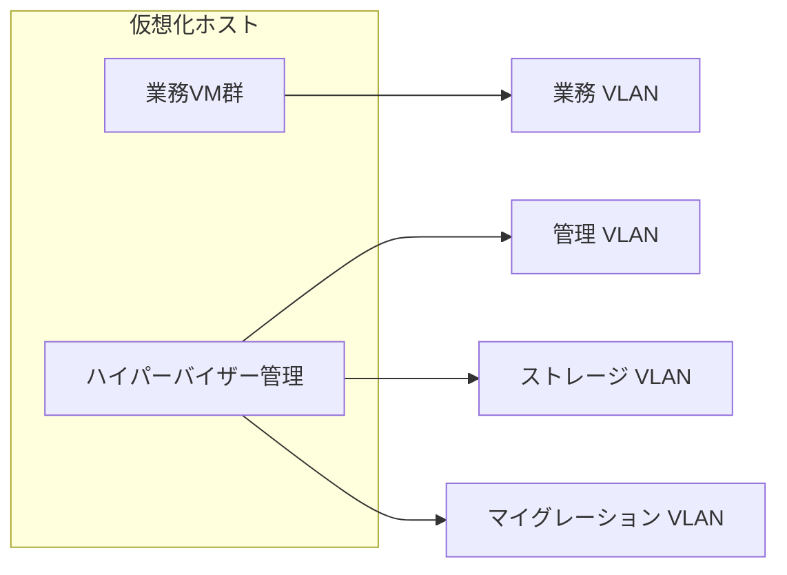
```mermaid
flowchart LR
  subgraph Host["仮想化ホスト"]
    VMs["業務VM群"]
    HV["ハイパーバイザー管理"]
  end

  N1["管理 VLAN"]
  N2["業務 VLAN"]
  N3["ストレージ VLAN"]
  N4["マイグレーション VLAN"]

  HV --> N1
  VMs --> N2
  HV --> N3
  HV --> N4
```

### 分離しない場合に起きること

| 混在 | 典型症状 |
|------|----------|
| 業務 + ストレージ | 業務ピークでデータストア遅延が悪化 |
| 業務 + マイグレーション | 移行中にアプリ遅延、移行時間も伸びる |
| 管理 + 業務 | 管理面がスキャンや攻撃に晒される。権限境界が曖昧 |
| すべて同一 | 障害1つで「全部遅い」「全部届かない」になり、層の特定が遅れる |

物理NICが足りない小規模ラボでは、VLAN分離だけ先に行い、NICの物理分離は段階的でもよい。
本番の通貫シナリオでは、論理分離（VLAN）を必須とし、可能なら物理NICまたはSR-IOV/専用ポートで補強する。

不採用案としての「フラットな1セグメント」は、構築が速い。
その代わり、性能事故とセキュリティ事故の切り分けコストが後で跳ねる。

---

## 6.6 オーバーレイネットワークとVXLANの概要

VLANは4096個程度までという制約や、物理L2の延伸限界がある。
大規模やマルチテナント、データセンター間の柔軟なL2延伸では、オーバーレイが使われる。

**オーバーレイネットワーク**とは、既存のIP（アンダーレイ）の上に、論理的なL2/L3網を重ねる方式である。
VMのフレームをカプセル化して運ぶ。

### VXLANの概要

**VXLAN（Virtual Extensible LAN）**は、代表的なオーバーレイ技術である。
VMのEthernetフレームを UDP で包み、VNI（VXLAN Network Identifier）で論理網を識別する。

```text
元のEthernetフレーム
  → VXLANヘッダ + UDP/IP でカプセル化
    → アンダーレイIP網を転送
      → 対向 VTEP でデカプセル化
```

要点だけ押さえる。

- 目的：大規模な論理L2、拠点間の柔軟な接続、テナント分離
- 必要条件：アンダーレイのIP到達性、MTU余裕（カプセル化オーバーヘッド）
- 通貫シナリオ規模（ホスト数台、VLAN数系統）では、まずVLAN分離で足りることが多い

VXLANを採用する判断は、テナント数、L2延伸要件、運用チームの技能が揃ってからでよい。
小規模にいきなり重ねると、障害点が増える。

製品例としては、VMware NSX、Hyper-V の SDN スタック、Open vSwitch + VXLAN、クラウドの VPC 実装などがある。
これらは製品固有の管理面を伴う。
一般概念としてのオーバーレイと、製品のコントローラ機能を区別する。

---

## 6.7 SR-IOV

**SR-IOV（Single Root I/O Virtualization）**は、物理NICを複数の仮想機能（VF）に分割し、VMへ直接割り当てる仕組みである。
ハイパーバイザーの仮想スイッチをバイパスし、低遅延と高スループットを狙う。

向く場面：

- NFV、高頻度取引、低遅延が必須の特定ワークロード

向かない場面（通貫シナリオの標準にはしない理由）：

- ライブマイグレーションやHAの制約が増えることがある
- 運用がデバイス依存になり、標準化が崩れる
- 可搬性より性能を優先する例外扱いになりやすい

| 方式 | 経路 | 標準採用か |
|------|------|------------|
| 仮想スイッチ経由 | vNIC → vSwitch → 物理NIC | はい（通貫シナリオの標準） |
| SR-IOV | vNIC(VF) → 物理NIC | 例外のみ |

第2章のパススルー判断と同じく、「速いから全部SR-IOV」は不採用である。

---

## 6.8 製品に依存しない共通概念と実装例

### 共通概念

| 共通概念 | 意味 |
|----------|------|
| vNIC | VMの仮想NIC |
| 仮想スイッチ | ホスト内の転送点 |
| ポートグループ相当 | 接続ポリシーの束 |
| アップリンク | 物理NICへの出口 |
| VLAN分離 | 放送域と用途の分離 |
| チーミング | アップリンク冗長 |
| オーバーレイ | IP上の論理網 |
| SR-IOV | NICの直接割当 |

### 代表製品での実装例

| 共通概念 | VMware | Hyper-V | KVM系 |
|----------|--------|---------|-------|
| 仮想スイッチ | vSphere Standard/Distributed Switch | 仮想スイッチ（外部/内部/プライベート） | Linux bridge、OVS |
| ポートグループ相当 | Port Group | 仮想スイッチ上のネットワーク | ブリッジ接続やポート定義 |
| 分散仮想スイッチ | VDS | 論理スイッチ（SDN時） | OVS + コントローラなど |
| オーバーレイ | NSX（VXLAN/Geneve等） | SDN Overlay | OVS VXLAN など |
| SR-IOV | SR-IOV対応NICでVF割当 | SR-IOV対応 | vfio / SR-IOV |

分散仮想スイッチは、複数ホストで同じ仮想スイッチ定義を共有する実装である。
一般概念としては「ホスト横断で一貫した仮想網の定義」であり、製品名そのものではない。

---

## 6.9 設計上の判断ポイント

| 判断 | 採用案 | 不採用案 | 理由とトレードオフ |
|------|--------|----------|--------------------|
| 分離 | 管理/業務/ストレージ/マイグレーションをVLAN分離 | 全用途1セグメント | 性能とセキュリティと切り分けのため。NIC台数と配線コストは増える |
| 標準パス | 仮想スイッチ + 準仮想化NIC | 全面SR-IOV | 可搬性と運用標準を優先 |
| アップリンク | チーミングで冗長 | 単一NIC依存 | ケーブル抜去1回で管理不能や業務断を避ける |
| オーバーレイ | 当面VLAN。要件増で再評価 | 小規模からVXLAN必須化 | 複雑さの先行投資を避ける |
| 管理到達 | 管理VLANのみから管理面へ | 業務網から管理SSH開放 | 攻撃面縮小 |

通貫シナリオでのSPOF確認：

- 物理スイッチが1台しかない
- アップリンクが1本
- 管理サーバーが管理VLAN上の単一障害点（冗長やバックアップ到達経路）

障害時の挙動の例：

- 業務アップリンク片系断：チーミングなら継続、単一なら業務断
- ストレージVLAN障害：VMは起動して見えるがI/Oハング、業務アプリがタイムアウト
- 管理VLAN障害：VMは動いていても「基盤が落ちた」ように見える

「動いている」と「管理できる」は別である。

---

## 6.10 性能上の注意点

- リンク速度（1/10/25GbE）は理論値である。実効はCPU、ドライバ、フロー数、対向で変わる
- ストレージとマイグレーションを業務と同じNICに載せると、平均帯域に余裕があっても瞬間的に遅延が跳ねる
- 同一ホスト内通信は物理帯域を使わないが、ホストCPUを使う
- ジャンボフレームは、経路上の全装置でMTUを揃えないと逆に壊れる
- VXLAN利用時は、アンダーレイMTUにカプセル化分の余裕が必要
- ネスト環境の iperf 結果は、本番サイジングの根拠にしない

監視では、少なくとも次を分ける。

1. 物理NICのエラー、ドロップ、使用率
2. 仮想スイッチやポートのドロップ
3. ゲスト内のリンク状態とエラー

---

## 6.11 セキュリティ上の注意点

- 管理ネットワークへの到達を最小権限と最小経路にする
- ポートグループの無差別モードや偽造MAC許可は、必要な解析時以外オフにする
- VLAN間のルーティング点（ファイアウォール）を明示し、暗黙の全通しにしない
- ストレージVLANに不要なホストやVMを繋がない
- オーバーレイ導入時は、アンダーレイとコントローラの保護も設計に含める
- 「VLANで分けた」だけで暗号化や認証が完了したと思わない

通貫シナリオでは、管理面の分離が第10章の前提になる。
ネットワーク設計の段階で穴を開けると、後からパッチでは塞ぎきれない。

---

## 6.12 障害例と切り分け

仮想ネットワーク障害は、層を分けて疑う。

```text
1. ゲストOS（IP、ルート、FW、ドライバ）
2. vNIC / ポートグループ（接続先、VLAN ID）
3. 仮想スイッチ / アップリンク（チーミング、リンクダウン）
4. 物理NIC / ケーブル / 物理スイッチ
5. L3（ゲートウェイ、ACL、DNS）
```

### 障害例1：特定VMだけ不通

**確認順**：

1. ゲスト内の IP / マスク / GW
2. vNICが正しいポートグループか
3. 同一ポートグループの他VMは通るか
4. ゲストFW

**典型原因**：VLANの付け間違い、旧テンプレートの固定IP衝突、ゲストドライバ未導入。

### 障害例2：同一ホスト内は通るが、外部だけ不通

**確認順**：

1. アップリンク物理NICのリンク
2. トランク許容VLAN
3. 物理スイッチのVLAN設定
4. チーミングの片系異常

**典型原因**：タグ付き設定の不一致。仮想側はVLAN10、物理側は許可していない。

### 障害例3：業務は生きているが、管理画面に入れない

**確認順**：

1. 管理VLANのアップリンク
2. 管理サーバー到達経路
3. ホストの管理エージェント状態

**典型原因**：管理網だけ障害。業務網と共有していない構成なら、症状が分かれるのは正常である。
分離していたおかげで、業務継続と管理復旧を並行できる。

### 障害例4：移行するとネットワークが切れる

**確認順**：

1. 移行先ホストに同じポートグループ/VLANがあるか
2. 分散仮想スイッチ相当の一貫性
3. SR-IOVやパススルーを使っていないか

**典型原因**：ホストごとに仮想スイッチ名やVLANがずれている。またはSR-IOVで可搬性が落ちている。

### 障害例5：業務ピークでストレージまで遅い

**確認順**：

1. ストレージトラフィックが業務NICに乗っていないか
2. 物理NIC使用率とドロップ
3. データストアレイテンシ（第5章）

**典型原因**：ネットワーク未分離。分離設計の不採用が性能障害として顕在化した例である。

切り分けの実践順（短縮版）：

1. 影響範囲（1VM、1ホスト、クラスタ全体）
2. 同一ホスト内 ping
3. 異ホスト ping
4. アップリンクとVLAN
5. 用途別網の混在有無

---

## 章末問題

### 問題1

vNIC、仮想スイッチ、ポートグループ、アップリンクの関係を、通信の流れに沿って説明せよ。

### 問題2

同一ホスト内のVM間通信と、異ホスト間のVM間通信の経路差を述べよ。

### 問題3

通貫シナリオでネットワークを4系統に分ける理由を、性能面とセキュリティ面から説明せよ。

### 問題4

VXLAN（オーバーレイ）を、ホスト数台の小規模基盤で直ちに必須としない理由は何か。

### 問題5

SR-IOVを標準採用しない理由を、可搬性の観点から述べよ。

### 問題6

「業務VMは動いているが管理できない」状態が示す、設計上の含意は何か。

---

## 解答と解説

### 問題1

VMのvNICがポートグループに接続し、ポートグループのポリシー（VLANなど）が仮想スイッチ上で適用され、外部へ出る通信はアップリンク経由で物理NICへ渡る。

### 問題2

同一ホスト内は仮想スイッチ内で転送され、物理NICを出ないことが多い。
異ホスト間はアップリンクと物理ネットワークを経由する。

### 問題3

性能面では、ストレージやマイグレーションのバーストが業務を圧迫しないようにする。
セキュリティ面では、管理面への到達を業務から分離し、攻撃面と権限境界をはっきりさせる。
切り分け容易性も分離の効果である。

### 問題4

小規模ではVLAN分離で要件を満たせることが多く、オーバーレイはMTU、アンダーレイ、コントローラ運用の複雑さを増やす。
必要性が明確になるまで必須化しない。

### 問題5

SR-IOVは仮想スイッチをバイパスするため、ライブマイグレーションや標準的なHA前提が制約されやすい。
通貫シナリオは可搬性と運用標準を優先するため、例外用途に限る。

### 問題6

管理ネットワークと業務ネットワークが分離されている（または分離すべき）ことの表れである。
「基盤全体停止」と「管理到達障害」を同一視すると、誤った復旧判断になる。

---

## ハンズオン演習

### 演習1：論理構成図を描く

学習環境について、次を含めだ図を作れ。

1. VMとvNIC
2. 仮想スイッチ
3. VLANまたはセグメント
4. 物理NIC（アップリンク）

通貫シナリオの4系統のうち、実装できているものと未実装のものを色分けする。

### 演習2：ホスト内と外部の疎通比較

可能なら同一ホスト上に検証VMを2台置き、次を記録せよ。

1. 同一セグメントの疎通
2. 外部ゲートウェイへの疎通
3. 失敗時に疑った層

### 演習3：分離不足の影響メモ（机上可）

業務とストレージを同一NICと同一VLANにした場合に起きる障害シナリオを1つ書き、採用案（分離）とのトレードオフを設計判断メモにまとめよ。

### 演習4：切り分けチェックリスト作成

上記の層別確認順を、自分の環境の画面名やコマンド名に置き換えたチェックリストを作れ。
成果物は第15章でも再利用する。

### 成果物

- 論理ネットワーク図
- 疎通比較メモ
- 分離の設計判断メモ（採用理由、不採用案、トレードオフ）
- 切り分けチェックリスト

---

## 本章のまとめ

仮想ネットワークは、vNICと仮想スイッチとポートグループとアップリンクで、物理NICを多重利用する。
同一ホスト内通信と外部通信では経路が違い、切り分けの出発点になる。

通貫シナリオの4系統分離は、帯域保護、セキュリティ、障害観測の分離のためである。
フラットな1セグメントは構築が速いが、後の性能事故と権限事故のコストが高い。
VXLANなどのオーバーレイは大規模要件向けの選択肢であり、SR-IOVは低遅延の例外である。

ストレージとネットワークの両方が揃うと、ようやくクラスタの可用性機能を現実の経路で支えられる。
次は、仮想マシン自体の作成から廃棄までのライフサイクルを整理する。


---


<!-- source: 07_vm_lifecycle.md -->

# 第7章 仮想マシンのライフサイクル

## 学習目標

1. 作成、テンプレート、クローンの使い分けを説明できる
2. 仮想ハードウェア変更（ホットアドを含む）の制約を説明できる
3. 起動、停止、コンソール、ディスク拡張の運用手順の要点を説明できる
4. 廃棄時のデータ消去と構成ドリフトの問題を説明できる
5. ライフサイクル管理のチェックリストを作れる

---

## 7.1 仮想マシン管理が必要になった背景

通貫シナリオでは、業務用VMが初期30台、うち重要システムが8台ある。
2年後には約45台へ増える想定である。
この台数を「必要なときに手作業で作り、不要になったら忘れる」では破綻する。

物理サーバー時代は、調達と設置そのものがブレーキだった。
仮想化では、ブレーキが消える代わりに、増殖と放置が起きる。

典型的な事故は次である。

- 検証用に作ったVMが本番データストアを食い続ける
- テンプレートが古く、展開直後からパッチ未適用のまま本番に乗る
- クローンしたVMが同じホスト名や同じSIDのまま衝突する
- 削除したつもりで、仮想ディスクだけが残る
- 「誰が作ったか」「いつ止めてよいか」が記録にない

**仮想マシンのライフサイクル**とは、作成から廃棄までの一連の管理対象を指す。
作成、変更、運用、保護、削除、消去は、別々の部門の作業に見えがちだが、基盤の健全性は一連の流れとして決まる。

この章では、ハイパーバイザーと管理サーバーが提供する操作を、通貫シナリオの運用ルールへ落とす。

---

## 7.2 仮想マシン作成の流れ

仮想マシンの作成は、「空の箱を定義する」ことと「中身を入れる」ことに分かれる。

### 定義で決めるもの

作成時に最低限決める項目は次である。

| 項目 | 意味 | 通貫シナリオでの仮置き例 |
|------|------|--------------------------|
| 名前 | 管理上の識別子 | `prod-file-01` など命名規約に従う |
| 配置先ホストまたはクラスタ | 実行場所 | クラスタへ配置し、初期ホストは自動でも可 |
| データストア | 仮想ディスクの置き場 | 共有データストア |
| vCPU | 仮想CPU数 | 重要8台は4、一般は2 |
| メモリ | ゲストに見せるメモリ量 | 重要16 GB、一般8 GB |
| 仮想ディスク容量と形式 | ゲストディスク | 重要200 GB、一般100 GB |
| 仮想NICと接続先 | ネットワーク接続 | 業務VLAN、必要なら管理用を分離 |
| ゲストOS種別 | 仮想ハードウェア互換とドライバ選定 | Windows Server / Linux など |
| ファームウェア | BIOS か UEFI か | OS要件に合わせる |

これらは「ゲストOSのインストール前」に決める。
後から変えられる項目もあるが、変更コストは一様ではない。
ディスク形式やファームウェア種別は、後変更が重い場合がある。

### 中身の入れ方

空のVMを作ったあとの主な経路は次の三つである。

1. ISOからゲストOSを新規インストールする
2. テンプレートから展開する
3. 既存VMをクローンする

新規インストールは、最初のゴールデンイメージを作るときに必要になる。
日常の量産では、テンプレート展開が中心になる。
クローンは、特定の状態を複製したいときに使う。

```text
[要件] 命名、サイズ、配置、ネットワーク
          |
          v
[VM定義の作成] ----+---- ISOインストール ----> 初期設定 ----> テンプレート化
                   |
                   +---- テンプレート展開 ----> 固有設定（ホスト名、IP、エージェント）
                   |
                   +---- クローン ------------> 固有設定 / 衝突回避
```

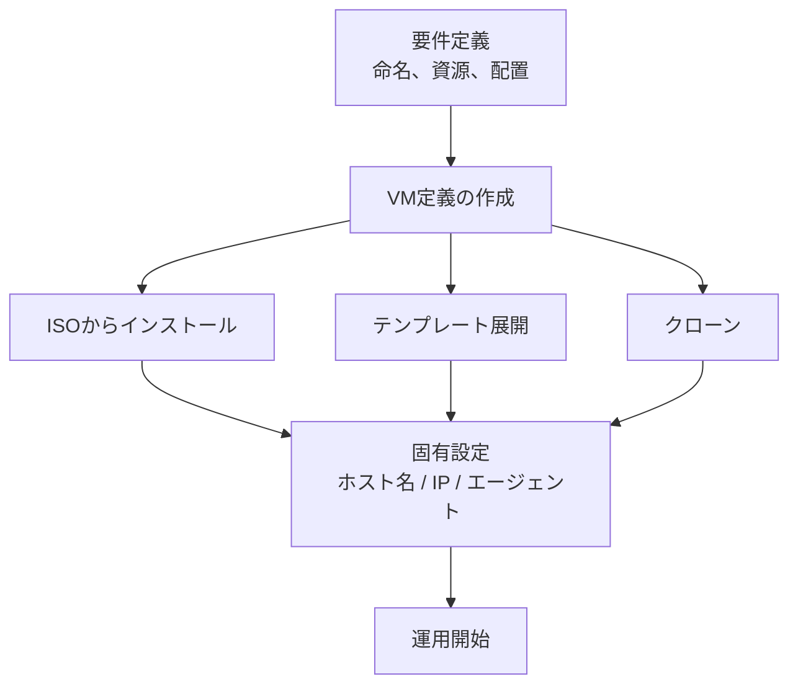
```mermaid
flowchart TB
  REQ["要件定義<br/>命名、資源、配置"]
  DEF["VM定義の作成"]
  ISO["ISOからインストール"]
  TPL["テンプレート展開"]
  CLN["クローン"]
  CUST["固有設定<br/>ホスト名 / IP / エージェント"]
  RUN["運用開始"]

  REQ --> DEF
  DEF --> ISO
  DEF --> TPL
  DEF --> CLN
  ISO --> CUST
  TPL --> CUST
  CLN --> CUST
  CUST --> RUN
```

通貫シナリオでは、重要8台と一般16台、開発6台で構成が異なる。
テンプレートは用途別に分ける。
「全部入り1枚」は便利に見えて、不要サービスと過剰権限を量産する。

---

## 7.3 テンプレート

**テンプレート**とは、仮想マシンを量産するためのひな型である。
製品によっては、通常のVMをテンプレートへ変換し、直接起動できない状態にする。
別製品では、起動可能なゴールデンイメージをテンプレート相当として扱う。

一般概念としては、「標準化された仮想ハードウェア定義とディスク内容の親玉」である。

### テンプレートに入れるもの

入れるべきもの：

- ゲストOSのベースインストール
- 必須のゲストツール（第2章）
- 監視エージェント、バックアップエージェントの土台（設定は展開後でも可）
- セキュリティベースライン（不要サービス無効化、時刻同期、ログ転送の土台）
- 仮想ハードウェアの標準（準仮想化デバイス、推奨コントローラ）

入れてはいけないもの、または入れたあと必ず変えるもの：

- 本番用の秘密情報（証明書秘密鍵、接続パスワードの平文）
- 固有のホスト名、IPアドレス、コンピュータアカウント
- 一時ファイル、個人の作業ディレクトリ
- 期限切れのスナップショット連鎖

### テンプレートの更新サイクル

テンプレートは古くなる。
古いまま展開すると、パッチ未適用のVMが量産される。

運用の型の例：

1. 月次または重大脆弱性のたびに、テンプレート用VMを起動して更新する
2. 検証する
3. 新しいテンプレートとして公開する
4. 旧テンプレートは廃止日を明示して残すか削除する

通貫シナリオでは、重要システムのテンプレートと、開発用テンプレートを分ける。
開発用は更新頻度を上げてもよい。
重要システム用は、変更をレビューしてから公開する。

---

## 7.4 クローン

**クローン**とは、既存の仮想マシンを複製して別の仮想マシンを作ることである。
第5章で見た通り、スナップショット（同一VMの時点保存）とは目的が違う。

| 観点 | テンプレート展開 | クローン |
|------|------------------|----------|
| 目的 | 標準構成の量産 | 特定時点の複製 |
| 親の状態 | 管理されたひな型 | 稼働中または停止中の任意VM |
| 長期運用向き | 向きやすい | 用途次第 |
| 衝突リスク | カスタマイズ手順で吸収 | 稼働中クローンは特に注意 |

### フルクローンとリンククローン

**フルクローン**は、仮想ディスクを独立して複製する。
親との依存が切れ、長期利用に向く。
コストは容量とコピー時間である。

**リンククローン**（製品によっては類似名称）は、親ディスクと差分を共有する。
短時間で多数作れるが、親の削除や移動に弱い。
検証の大量展開向きであり、通貫シナリオの重要8台には通常使わない。

### クローン時に起きやすい衝突

- 同じホスト名
- 同じIPアドレス
- Windows の SID 重複
- 同じマシンIDを持つ監視エージェント
- 同じバックアップクライアントID

クローン後は、ゲスト内の固有情報を必ず再設定する。
製品のカスタマイズ機能（例：VMware の guest customization、cloud-init 相当）を使う場合でも、結果を確認する。

---

## 7.5 ゲストOSと仮想ハードウェア

### ゲストOS

**ゲストOS**は、仮想マシン上で動作するOSである。
ハイパーバイザーはゲストOSの種類を「完全に知らなくても」動かせる場合がある。
しかし実務では、OS種別の宣言が重要になる。

理由：

- 推奨仮想デバイスの選択が変わる
- ゲストツールの配布対象が変わる
- 時刻同期、シャットダウン連携、ハートビートの挙動が変わる
- サポート可否の境界になる

通貫シナリオでは、重要システムのOSパッチ方針をVMライフサイクルに含める。
テンプレート更新と、稼働中VMのパッチは別管理である。
テンプレートを更新しても、既存VMは自動では新しくならない。

### 仮想ハードウェア

**仮想ハードウェア**とは、VMに見せるCPU、メモリ、ディスクコントローラ、NIC、GPU、ファームウェアなどの装置モデルである。
製品には仮想ハードウェアの世代（互換バージョン）があり、上げると新機能が使える一方、古いホストへ戻せなくなる場合がある。

設計上の原則：

1. クラスタ内で互換バージョンを揃える
2. 準仮想化デバイスを標準にする（性能と安定性）
3. 不要なデバイスを付けない（攻撃面と障害点の削減）
4. 変更は変更管理の対象にする

```text
仮想マシン
  +-- 仮想ハードウェア定義（vCPU, メモリ, デバイス, ファームウェア）
  +-- 仮想ディスク（データ）
  +-- ゲストOS + アプリ（中身）
  +-- ゲストツール（連携層）
```

定義と中身は別物である。
ディスクを残したままVM定義だけ消す事故、逆に定義は残ってディスクだけ消える事故の両方がある。

---

## 7.6 起動、停止、再起動

### 起動

起動は、ハイパーバイザーがVMの仮想CPUをスケジュールし、仮想ディスクからブートすることを意味する。
起動できない場合の切り分けは、第15章で層別に扱う。
この章では運用上の要点に絞る。

起動前チェックの例：

- データストアに空きがあるか
- 必要なISOやフロッピーが誤接続されていないか
- 予約リソースが足りるか（特にHA有効時）
- 依存サービス（AD、DNS、共有ストレージ）が生きているか

通貫シナリオの重要8台は、起動順序が意味を持つ場合がある。
認証とDNSが先、業務APとDBが後、という依存があるなら、手動手順かオーケストレーションで順序を定義する。
HAの自動再起動だけに任せると、依存逆転で起動ループすることがある。

### 停止

停止には少なくとも二種類ある。

| 種別 | 意味 | 用途 |
|------|------|------|
| ゲストOSのシャットダウン連携 | ゲストへ停止要求を送り、きれいに止める | 通常運用 |
| パワーオフ | 仮想的な電源断 | 無応答時の最終手段 |

ゲストツールが入っていないと、きれいなシャットダウンができない場合がある（第2章）。
パワーオフはファイルシステム不整合のリスクがある。
DBやファイルサーバーでは特に重い。

### 再起動

再起動は、停止と起動の組み合わせである。
「ハングしたから再起動」は対症療法になりやすい。
再起動前に、可能ならコンソールで症状を記録し、ホスト側メトリクスも残す。

### サスペンド（一時停止）

製品によっては、メモリ状態をディスクへ書いて一時停止できる。
検証には便利だが、本番の長期サスペンドは推奨しない。
メモリ内容がディスク上に残るため、機密データの扱いも変わる。

---

## 7.7 コンソール接続

**コンソール接続**とは、仮想マシンの画面（またはシリアルコンソール）へ、ハイパーバイザー経由でアクセスする手段である。
ネットワーク経由の RDP や SSH が使えないときに、最後の窓口になる。

用途：

- ゲストOS起動前の操作（BIOS/UEFI、ブートメニュー）
- ネットワーク設定ミスで外部から入れないとき
- セーフモードやレスキュー作業
- 起動失敗の画面確認

注意点：

- コンソール権限は強い。誰でも触れると、パスワードリセットや破壊的操作ができる
- コンソール通信は管理ネットワーク側に閉じる
- 録画や監査が製品で可能な場合、重要操作は監査対象にする
- コンソールが遅い原因は、管理網の輻輳やホスト負荷であることが多い

通貫シナリオでは、管理プレーンと業務プレーンを分離する。
コンソールは管理プレーンの操作として扱う。

---

## 7.8 仮想ディスク拡張

ディスク不足は、ゲスト内の容量監視で先に見えることが多い。
拡張手順は、ホスト側とゲスト側の二段になる。

### ホスト側

1. VMの仮想ディスク容量を増やす（例：100 GB を 120 GB へ）
2. スナップショット有無を確認する。あると拡張できない、または制限される製品がある
3. データストア空きを確認する。シックなら即消費、シンでも上限は上がる

### ゲスト側

1. 新しい容量をOSに認識させる（再スキャン）
2. パーティションまたはボリュームを拡張する
3. ファイルシステムを拡張する

ホスト側だけ広げてゲスト側を忘れると、「ディスクは増えたのにOSから見えない」状態になる。
逆に、ゲスト側だけ拡張しようとしても、仮想ディスク上限を超えられない。

通貫シナリオの重要VMは 200 GB 仮置きである。
拡張は可能だが、無計画な拡張はデータストアを逼迫させる。
拡張要求には、増加理由、予測期間、バックアップ影響を添える。

縮小（シュリンク）は拡張より難しい。
ゲスト内の未使用領域解放、ゼロ化、ハイパーバイザー側の回収など、手順が長く失敗しやすい。
設計では「足りなくなったら増やす」前提より、「初期サイジングと監視」を優先する。

---

## 7.9 vCPU とメモリの変更、ホットアド

### 変更の基本

vCPU数やメモリ量の変更は、サイジングの修正作業である。
増やせば必ず速くなるわけではない（第3章、第4章）。
特に vCPU の過剰割当は、CPU Ready を悪化させる。

変更前に確認すること：

- 現在の実測利用率（平均だけでなくピーク）
- NUMA 境界をまたがないか
- ホストとクラスタの空き（Admission Control 含む、第8章）
- ゲストOSとアプリケーションの再起動要否

### ホットアド

**ホットアド**とは、VMを停止せずに仮想CPUやメモリ、一部デバイスを追加する機能である。
製品とゲストOS、仮想ハードウェア世代、設定（ホットアド有効化）に依存する。

| 操作 | ホットでできること（一般傾向） | 注意 |
|------|--------------------------------|------|
| メモリ追加 | 可能な場合がある | ゲストOS対応が必要。NUMAに影響しうる |
| vCPU追加 | 可能な場合がある | ライセンスやOS上限、スケジューリング影響 |
| ディスク追加 | 比較的容易なことが多い | ゲストでの認識手順が必要 |
| NIC追加 | 可能な場合がある | ドライバと設定が必要 |
| 縮小や一部デバイス除去 | 難しい、または不可 | 停止メンテナンスになりやすい |

ホットアドを有効にすると、メモリ管理の挙動が変わり、オーバーヘッドが増える場合がある。
「いつでも無停止で増やせる」を前提に初期サイジングを雑にすると、後でホスト全体が苦しくなる。

通貫シナリオの重要8台は、変更窓を決められるなら停止メンテナンスを優先してよい。
無停止要求が強い場合のみ、ホットアドの対応表をOSごとに作る。

---

## 7.10 削除と廃棄時のデータ消去

### 削除

VMの削除は、管理上のオブジェクトを消す操作である。
製品によっては、次が分かれる。

- VM定義だけ削除し、ディスクを残す
- VM定義とディスクをまとめて削除する
- データストア上の孤立ファイルが残る

削除前チェックリスト例：

1. バックアップ保持期間とリストア要否
2. 依存関係（他システムからの接続、DNS、監視）
3. スナップショットの有無
4. 所有者と削除承認
5. ライセンスの回収

通貫シナリオでは、開発6台の増減が激しい。
削除漏れはデータストア圧迫の主因になる。
「最終起動日から90日」などの棚卸しルールを運用に入れる。

### 廃棄時のデータ消去

削除は、機密データ消去と同義ではない。
ストレージ上のブロックがすぐ物理的に消えるとは限らない。
シンプロビジョニング、スナップショット、バックアップ、レプリカ、テンプレートに、データが残る。

**データ消去**の実務レベルは、要件で決める。

| レベル | 内容 | 用途例 |
|--------|------|--------|
| 論理削除 | VMとディスクを削除 | 一般的な開発VM |
| 上書き消去 | ゲストまたはストレージ機能で上書き | 社内機密を含むVM |
| バックアップ含めた抹消 | バックアップ世代からも方針に従い削除 | 契約終了、個人情報 |
| 媒体廃棄 | 物理ディスク廃棄手順 | ストレージ退役時 |

通貫シナリオの重要8台（ファイル、認証、業務AP、DB）は、廃棄時にバックアップとレプリカの扱いを明示する。
「本番VMを消したから安心」は誤りである。

---

## 7.11 構成ドリフト

**構成ドリフト**とは、標準構成（テンプレートや構成管理の定義）から、実機の状態が静かにずれていく現象である。

仮想化ではドリフトが起きやすい。

- 緊急対応でvCPUを一時的に増やしたまま戻さない
- 検証用NICを付けたまま残す
- ゲストツールの版がVMごとに違う
- セキュリティ設定を個別に緩める
- ISOを接続したままにする
- スナップショットが残る

ドリフトの問題は、個別最適が全体の再現性を壊す点にある。
障害時に「このVMだけ特別」が増えると、手順書が無効になる。

対策の型：

1. 望ましい状態を文書化またはコード化する
2. 定期的に実状態と比較する（棚卸し）
3. 例外は期限付きで記録する
4. テンプレートと構成管理で再収束する

通貫シナリオでは、重要8台の構成を特に厳格に見る。
一般業務と開発は、許容する差分の範囲を別に定義してよい。

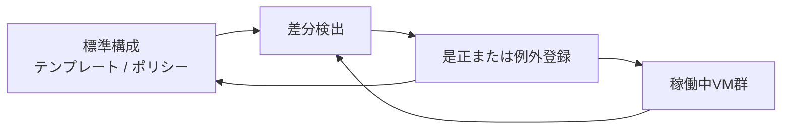
```mermaid
flowchart LR
  STD["標準構成<br/>テンプレート / ポリシー"]
  RUN["稼働中VM群"]
  DET["差分検出"]
  FIX["是正または例外登録"]

  STD --> DET
  RUN --> DET
  DET --> FIX
  FIX --> STD
  FIX --> RUN
```

---

## 7.12 製品に依存しない共通概念と実装例

### 共通概念の整理

| 一般概念 | 意味 |
|----------|------|
| VM定義 | 仮想ハードウェアと配置のメタデータ |
| ゲストイメージ | 仮想ディスク上のOSとデータ |
| テンプレート | 量産用の標準イメージ |
| クローン | 既存VMの複製 |
| カスタマイズ | 展開後の固有情報の書き換え |
| コンソール | ハイパーバイザー経由の操作面 |
| ホットアド | 稼働中の資源追加 |
| 構成ドリフト | 標準からの継続的なずれ |

### 代表製品での実装例

| 一般概念 | VMware | Hyper-V | KVM系 |
|----------|--------|---------|-------|
| テンプレート | Template | テンプレート / ゴールデンイメージ運用 | テンプレートVM、cloud-init 等 |
| クローン | Clone | チェックポイント併用の複製など | virt-clone 等 |
| コンソール | VM Console | VMConnect | VNC / SPICE / serial |
| ゲスト連携 | VMware Tools | Integration Services | qemu-guest-agent |
| カスタマイズ | Guest Customization | 回答ファイル等 | cloud-init、Ansible 等 |
| ハードウェア世代 | HW compatibility | 世代 / バージョン | マシンタイプ |

製品名で手順を暗記するより、上表の一般概念でメモを残す。
手順書は製品別、設計判断は一般概念別にする。

---

## 7.13 設計上の判断ポイント

通貫シナリオ（VM30台、重要8台、ホスト3台以上）に対する、ライフサイクル上の判断例である。

| 判断 | 採用の方向 | 不採用案 | トレードオフ |
|------|------------|----------|--------------|
| 量産方式 | 用途別テンプレート | 毎回ISOインストール | 初期整備コスト増、展開品質と速度が上がる |
| 重要VMの複製 | フルクローンまたはテンプレート | リンククローン | 容量は増えるが独立性を確保 |
| 資源変更 | 実測根拠のある変更窓 | 感覚でのホットアド常用 | 無停止性は下がるが、サイジング品質が上がる |
| 開発VM | 期限付き、定期棚卸し | 無期限放置 | 利便性は下がるがデータストアを守る |
| 廃棄 | 重要VMはバックアップ含めた抹消手順 | 管理画面の削除のみ | 手順は増えるが漏洩リスクが下がる |
| ドリフト | 重要8台は差分検知 | 全部手動感覚運用 | 運用負荷増、再現性が上がる |

単一障害点の話は第8章が中心だが、ライフサイクルにもある。
テンプレートが1つだけで、そこが壊れると展開不能になる。
テンプレートの保管と世代管理も設計対象である。

障害時の挙動（ライフサイクル観点）：

- テンプレート破損：新規展開不可。既存VMは稼働継続しうる
- 誤削除：バックアップがなければ業務停止。削除保護と承認を入れる
- ドリフト放置：障害対応時間が延びる。停止自体はしないが復旧が遅れる

---

## 7.14 性能上の注意点

- フルクローンとテンプレート展開は、ストレージに大きな読み書きを発生させる。業務ピークと重ねない
- リンククローンの大量展開は、親ディスクへの読み取り集中を起こしうる
- ホットアド後に性能が上がらない場合、ボトルネックがCPUやメモリ以外（ディスク、ロック、アプリ）である可能性を疑う
- vCPU増設は理論上の並列度を上げても、実測のCPU Ready が悪化することがある
- ディスク拡張そのものは軽いことが多いが、ゲスト内のファイルシステム拡張や、その後のフルバックアップ初回は重い
- コンソール転送やISOマウントを管理網で乱用すると、管理操作全体が遅くなる

理論値と実測値を混同しない。
「ディスクを200 GBから400 GBにしたからIOPSが倍」にはならない。
容量と性能は別変数である。

---

## 7.15 セキュリティ上の注意点

- テンプレートに秘密情報を焼き込まない
- コンソール権限を業務ユーザーへ広く配らない
- クローン後の認証情報と鍵を必ずローテーションする
- 削除済みVMのディスク、スナップショット、バックアップ残留を廃棄手順に含める
- ISOや古いツールの置きっぱなしを棚卸しする
- 管理者の個人用テストVMを本番クラスタへ置かない。置くなら期限とデータ分類を明示する

ライフサイクルの穴は、技術的な迂回経路になりやすい。
「一時的な検証VM」が、攻撃者から見れば踏み台候補である。

---

## 7.16 障害例と切り分け

### 障害例1：テンプレートから展開したVMがネットワークに出られない

**症状**：展開は成功、コンソールは入れる、業務通信不可。

**確認順**：

1. vNICの接続先ポートグループ / VLAN
2. ゲストのIP、マスク、ゲートウェイ、DNS
3. カスタマイズ失敗の有無（旧設定の残存）
4. 同一IP衝突

**典型原因**：クローンまたはテンプレート展開後のカスタマイズ漏れ。

### 障害例2：ディスクを拡張したがゲストから見えない

**症状**：管理画面上は 200 GB 超、ゲストは旧容量のまま。

**確認順**：

1. ハイパーバイザー上の仮想ディスクサイズ
2. ゲストでの再スキャン実施有無
3. パーティションとファイルシステムのサイズ
4. スナップショット有無（拡張が完了していない可能性）

**典型原因**：ホスト側拡張のみでゲスト側未実施。

### 障害例3：削除したVMのデータストア使用量が減らない

**症状**：VM一覧からは消えたが、データストア使用量がほぼ同じ。

**確認順**：

1. データストア上の残存フォルダ、仮想ディスク
2. 他VMがそのディスクを参照していないか
3. バックアップやレプリカの作業用コピー
4. スナップショット統合の途中状態

**典型原因**：ディスク残存、または別名での参照残。

### 障害例4：ある重要VMだけ設定が標準と違う

**症状**：障害対応手順が通用しない。デバイス構成が他と異なる。

**確認順**：

1. 現行テンプレートとの差分
2. 変更履歴、例外申請の有無
3. ゲストツール版
4. 接続デバイス（ISO、追加NIC）

**典型原因**：構成ドリフト。緊急変更の戻し忘れ。

---

## 章末問題

### 問題1

テンプレートとクローンの違いを、目的の観点から説明せよ。

### 問題2

スナップショット、クローン、バックアップの三つを、一文ずつで区別せよ。

### 問題3

ホットアドを採用する前に確認すべき制約を3つ挙げよ。

### 問題4

通貫シナリオの開発VMが増加し、データストアが逼迫した。
ライフサイクル管理の観点から、防ぐための運用ルールを2つ提案せよ。

### 問題5

VMを管理画面から削除した。
それでも機密データが残る可能性がある場所を3つ挙げよ。

### 問題6

構成ドリフトが障害対応を遅くする理由を説明せよ。

---

## 解答と解説

### 問題1

テンプレートは標準構成を量産するためのひな型である。
クローンは、既存の特定VMの状態を複製する操作である。
前者は「あるべき姿」の展開、後者は「今ある個体」の複製という目的差がある。

### 問題2

スナップショットは同一VMの短期間の時点保存である。
クローンは別VMを作る複製である。
バックアップは別媒体または別サイトへ独立に保管する復旧用コピーである。

### 問題3

例：ゲストOSとアプリケーションの対応、仮想ハードウェアや製品機能の前提、NUMAやCPUスケジューリングへの影響、ホットアド有効化に伴うオーバーヘッド、変更後のクラスタ空きとAdmission Control。
このうち3つを挙げられればよい。

### 問題4

例：所有者と期限の必須化、最終起動日による棚卸しと自動通知、テンプレート以外からの永続VM作成禁止、容量クォータ。
「作ったら消し忘れない仕組み」を含むこと。

### 問題5

例：データストア上の残存仮想ディスク、スナップショット差分、バックアップ保管、レプリカ、テンプレート、ストレージの未上書きブロック。

### 問題6

手順書と標準構成が前提とする状態から実機がずれていると、確認項目が増え、原因仮説が外れる。
結果として、同じ症状でも復旧までの時間が延びる。

---

## ハンズオン演習

### 演習1：作成からテンプレート化

1. 検証用VMを1台作成する
2. ゲストOSを入れ、ゲストツールを入れる
3. 不要アカウントと一時ファイルを整理する
4. テンプレート化（または同等のひな型化）する
5. そこから1台展開し、ホスト名とIPが一意になることを確認する

### 演習2：ディスク拡張の二段作業

1. 検証VMの仮想ディスクを少し拡張する
2. ゲスト側で認識、ボリューム拡張まで行う
3. 手順をホスト側とゲスト側に分けてメモする

### 演習3：削除と残存確認

1. 検証VMを削除する（ディスク削除の選択を意識する）
2. データストア上に残ファイルがないか確認する
3. 「削除」と「消去」の差を設計判断メモに書く

### 演習4：通貫シナリオのライフサイクルチェックリスト

次を1枚にまとめる。

| 区分 | 台数 | テンプレート | 変更窓 | 棚卸し頻度 | 廃棄時の消去レベル |
|------|------|--------------|--------|------------|--------------------|
| 重要 | 8 | | | | |
| 一般 | 16 | | | | |
| 開発 | 6 | | | | |

### 成果物

- テンプレート展開記録
- ディスク拡張手順メモ
- 削除後の残存確認結果
- ライフサイクルチェックリスト

---

## 本章のまとめ

仮想マシンのライフサイクルは、作成の速さだけでなく、標準化、変更、棚卸し、廃棄まで含めて初めて安定する。
テンプレートは量産の品質を決め、クローンは衝突回避が本丸になり、ホットアドは無停止と制約のトレードオフである。
削除は消去ではない。
構成ドリフトは静かに運用を壊す。

通貫シナリオの30台は、手作業の頑張りでは回らない。
用途別テンプレート、期限付き開発VM、重要VMの廃棄手順を、可用性設計（第8章）とバックアップ設計（第9章）の前提として先に固める。


---


<!-- source: 08_availability_cluster.md -->

# 第8章 可用性とクラスタ

## 学習目標

1. 単一ホスト障害とクラスタによる緩和を説明できる
2. HA、ライブマイグレーション、ストレージマイグレーションの違いを説明できる
3. ハートビート、クォーラム、スプリットブレインの関係を説明できる
4. Admission Control、N+1、アンチアフィニティを設計に使える
5. 「VMが停止するケース」と「停止しないケース」を区別できる

---

## 8.1 単一ホスト障害がもたらすもの

仮想化は、複数の業務を少数の物理ホストへ載せる。
通貫シナリオでは、ホスト3台以上にVM30台（重要8台を含む）を載せる。
物理サーバー30台の時代より、1台のホスト障害の影響範囲は大きい。

ホストが突然停止すると、その上で動いていたVMは、原則としてそこで止まる。
ゲストOSから見れば、電源コードを抜かれたのと同じである。
共有ストレージ上の仮想ディスクは残っていても、実行するCPUとメモリがそのホストから消える。

ここで設計が分岐する。

1. 止まってもよいVMと、短時間で復帰すべきVMを分ける
2. 止まらずに移したい保守作業と、止まってから別ホストで起こす障害復旧を分ける
3. 「ホストが死んでもディスクは生きている」前提を、ストレージ設計で支える

第5章で共有（または分散）ストレージを置いた理由の中心は、ここにある。
別ホストが同じ仮想ディスクを読めなければ、再配置もフェイルオーバーもできない。

---

## 8.2 クラスタ

**クラスタ**とは、複数のホストを、管理と可用性の一つのまとまりとして扱う構成である。
仮想化基盤におけるクラスタの主な役割は次である。

- ホスト障害時に、別ホストでVMを再起動する（HA）
- 負荷や保守のために、VMの配置をホスト間で動かす
- 資源の空きをまとめて把握し、配置可否を判断する
- 配置ルール（アフィニティなど）を適用する

```text
+------------------- クラスタ --------------------+
|  Host-1     Host-2     Host-3                  |
|  (VM群)     (VM群)     (VM群)                  |
|       \       |       /                        |
|        +------+------+                         |
|        | 共有 / 分散ストレージ |                |
+-----------------------------------------------+
| 管理サーバー（クラスタ制御、監視連携）           |
+-----------------------------------------------+
```

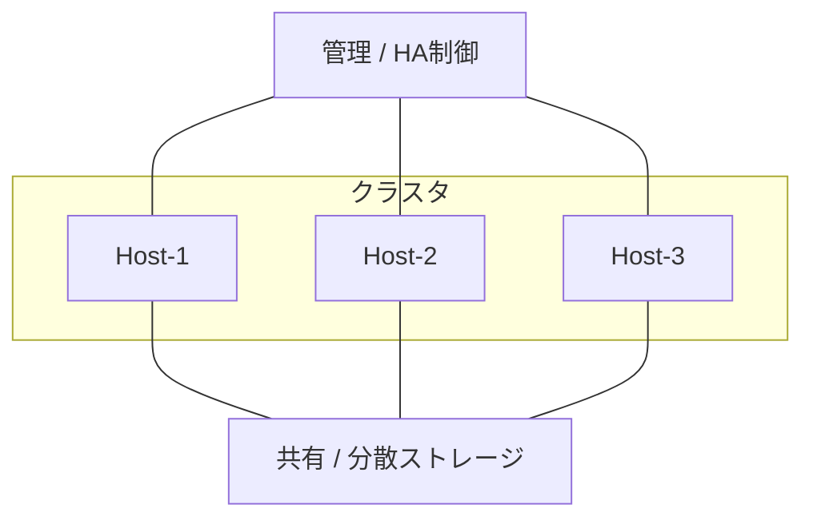
```mermaid
flowchart TB
  subgraph Cluster["クラスタ"]
    H1["Host-1"]
    H2["Host-2"]
    H3["Host-3"]
  end
  DS["共有 / 分散ストレージ"]
  MGMT["管理 / HA制御"]

  H1 --- DS
  H2 --- DS
  H3 --- DS
  MGMT --- H1
  MGMT --- H2
  MGMT --- H3
```

クラスタは「ホストをケーブルでつないだだけ」ではない。
心拍監視、定足数、再起動権限、資源予約のルールが揃って、初めて可用性の単位になる。

通貫シナリオの可用性要件は、「物理ホスト1台障害時も重要システムを継続」である。
継続の意味を、無停止継続なのか、短時間停止後の自動再開なのかで取り違えると、設計が壊れる。
多くのHAは後者である。

---

## 8.3 HA（高可用性）

**HA（High Availability）**とは、ホスト障害などを検知したとき、影響を受けた仮想マシンを別ホストで自動的に再起動し、ダウン時間を短縮する仕組みである。
製品名では vSphere HA、Hyper-V のクラスタ機能、Pacemaker 連携などがある。
一般概念としては、「障害検知と別ホストでの再起動」である。

### HAがやること

1. ホストやVMの生存を監視する
2. 障害と判断したら、影響VMの所有者を別ホストへ移す
3. 別ホストでVMをパワーオンする
4. 優先度や資源制約に従って、起動するVMを選ぶ場合がある

### HAがやらないこと（典型）

- 障害瞬間のメモリ状態を完全に引き継ぐこと（それは後述のライブマイグレーションやFTの領域）
- ゲスト内アプリケーションの論理障害を直すこと
- 共有ストレージ全損からの復旧
- ネットワーク分断時に常に正しい判断をすること（クォーラム設計が必要）

HAによるフェイルオーバーでは、VMは一度停止する。
停止時間は、検知時間、再起動時間、ゲストOSとアプリの起動時間の合計になる。
理論上の「数分」と、実測の業務復帰時間は別物である。
DBのクラッシュリカバリが長いなら、ホスト再配置が速くても業務RTOは伸びる。

通貫シナリオの重要8台はHA対象にする。
開発6台は、資源が足りないときに起動を後回し、または対象外にしてよい。

---

## 8.4 ライブマイグレーション

**ライブマイグレーション**とは、稼働中の仮想マシンを、ほとんど停止させずに別ホストへ移す機能である。
メモリ内容を移行先へコピーし、短時間の切り替え（スイッチオーバー）で実行ホストを変える。
仮想ディスクは共有ストレージ上にある前提が多い。

用途の中心は計画作業である。

- ホストのパッチ適用前にVMを退避する
- 負荷の高いホストからVMを移す
- ハードウェア保守

```text
Host-A                         Host-B
  VM（実行中） ---- メモリ転送 ----> VM（受け側）
       |                              |
       +-------- 共有ディスク ---------+
```

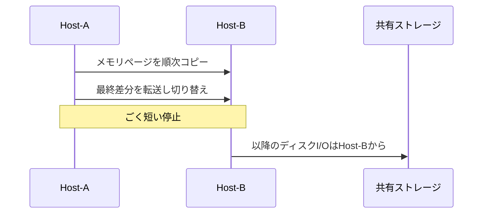
```mermaid
sequenceDiagram
  participant A as Host-A
  participant B as Host-B
  participant S as 共有ストレージ
  A->>B: メモリページを順次コピー
  A->>B: 最終差分を転送し切り替え
  Note over A,B: ごく短い停止
  B->>S: 以降のディスクI/OはHost-Bから
```

ライブマイグレーション中も、マイグレーション用ネットワークに大きな帯域を使う。
第6章のネットワーク分離でマイグレーション網を分ける理由は、業務通信を押しのけないためである。

ライブマイグレーションは、突然のホスト電源断を救わない。
救うのは計画移動である。
障害時の自動再起動はHAの役割である。

---

## 8.5 ストレージマイグレーション

**ストレージマイグレーション**とは、仮想マシンの仮想ディスクを、あるデータストアから別のデータストアへ移すことである。
ホストはそのままでディスクだけ移す場合と、ホスト移動と同時に行う場合がある。
製品によっては、稼働中に実施できる。

用途：

- データストアの容量逼迫回避
- 性能ティアの変更（高速領域へ移す）
- ストレージ保守、退役
- 配置の再バランス

ストレージマイグレーションは、ストレージ帯域とIOPSを大きく消費する。
本番ピークと重ねると、移していないVMまで遅くなる。
通貫シナリオの実効20 TB起算でも、同時に多数を動かさない。

HA、ライブマイグレーション、ストレージマイグレーションの対比は次である。

| 機能 | 主な目的 | VMの停止 | 典型トリガ |
|------|----------|----------|------------|
| HA | 障害後の自動再起動 | する（再起動） | ホスト障害など |
| ライブマイグレーション | 計画的なホスト移動 | ごく短い、または体感なしを目指す | 保守、負荷分散 |
| ストレージマイグレーション | ディスク配置の変更 | 製品と条件による | 容量、性能、保守 |

---

## 8.6 フェイルオーバー

**フェイルオーバー**とは、障害発生時に、処理や実行主体を待機側へ切り替えることである。
仮想化クラスタでは、主に「障害ホスト上のVMを別ホストで起動し直す」ことを指す。

関連語との整理：

- **フェイルオーバー**：障害起点の切り替え
- **スイッチオーバー**：計画的な切り替え（保守など）
- **フェイルバック**：復旧後に元へ戻すこと（必要な場合）

フェイルオーバー成功の必要条件（例）：

1. 別ホストが生きている
2. 別ホストから仮想ディスクへ到達できる
3. ネットワーク（少なくとも業務と管理の要件）が満たされる
4. 起動に足るCPUとメモリの空きがある
5. クラスタが「どちらが正しいか」を判断できている（次節以降）

条件が欠けていると、HAは「有効」でも業務は戻らない。
第5章の障害例「HAは動くが起動失敗」は、ストレージ到達性の欠落が典型である。

---

## 8.7 ハートビート

**ハートビート**とは、ホストやサービスの生存を定期的に確認する信号である。
クラスタでは、ホスト同士、またはホストと管理要素のあいだで心拍を交換し、「生きている」「応答がない」を判断する。

心拍の経路は一つに依存させない設計が多い。

| 経路例 | 見るもの |
|--------|----------|
| 管理ネットワーク | ホスト間の疎通 |
| ストレージ心拍 | データストアへのアクセス可否 |
| ゲスト心拍（任意） | VM内OSの応答（ゲストツール経由など） |

管理ネットワークだけを信じると、管理NIC障害をホスト全損と誤認しうる。
逆に、ストレージは生きているがホストは死んでいる場合もある。
複数信号を組み合わせ、誤検知を減らす。

通貫シナリオでは、管理網とストレージ網を分離する。
心拍設計も、その分離を前提に文書化する。

---

## 8.8 クォーラム

**クォーラム（定足数）**とは、クラスタが「分割された網のどちらが正規か」を決めるための多数派条件である。
ホストがネットワーク分断で二つのグループに分かれたとき、両方とも「自分が正規だ」とVMを起動すると二重起動になる。
それを防ぐために、定足数を満たす側だけがサービスを継続する。

単純な例：

- ホスト3台のクラスタ
- 過半数（2台以上）を持つ側がクォーラムを維持
- 1台だけ孤立した側は、VM起動権限を手放す

ホスト数が偶数のときは、タイブレーク用の投票装置（ディスクウィットネス、ファイル共有ウィットネスなど）を置く設計が多い。

```text
分断前:  Host-1  Host-2  Host-3   （投票3）

分断後A: Host-1  Host-2           （投票2）→ 継続
分断後B: Host-3                   （投票1）→ 停止側
```

クォーラムは可用性を上げる仕組みであると同時に、「少数側を意図的に止める」仕組みでもある。
止めることを嫌って定足数を無効化すると、より危険な二重書き込みへ進む。

---

## 8.9 スプリットブレイン

**スプリットブレイン**とは、クラスタが複数の正規系に割れ、同じ資源を同時に制御してしまう状態である。
仮想化では、同じ仮想ディスクを二つのホスト上のVMが同時に書き込む事態が最悪である。
データ破壊に直結する。

起きうる経路：

1. ネットワーク分断
2. 心拍の誤判定
3. クォーラム不足または設定ミス
4. ストレージ側の予約（SCSI reservation など）の不整合

防御の層：

- クォーラムによる多数派の確定
- ストレージレベルでの排他
- フェンシング（問題ノードを強制隔離し、必要なら電源を落とす考え方）
- 管理操作の二重実行防止

スプリットブレイン対策は、可用性の見た目を一時的に下げることがある。
孤立ノード上のVMを止める判断は、止めたくなくても必要になる。
設計会議では、「止めないこと」より「二重書き込みを避けること」を上位要件にする。

---

## 8.10 アンチアフィニティと配置ルール

**アフィニティ**とは、特定のVM同士を同じホストへ寄せるルールである。
**アンチアフィニティ**とは、特定のVM同士を同じホストへ載せないルールである。

通貫シナリオでの典型適用：

- 認証サーバーの冗長ペアを別ホストへ置く
- DBのプライマリとセカンダリを別ホストへ置く
- 管理サーバーと、それが管理する重要VMの同時障害を避ける（要件次第）

```text
悪い例: Host-1 に認証Aと認証Bが同居 → Host-1障害で認証全滅
良い例: Host-1 に認証A、Host-2 に認証B
```

アンチアフィニティは可用性を上げるが、詰みも作る。

- ホスト台数が少ないと配置不能になる
- HA時に規則を満たせないと起動が遅延または失敗する
- ルール過多は運用を理解不能にする

重要8台すべてに相互排他を張ると、3ホストでは破綻しやすい。
「同時に落としたくない組」だけに絞る。

---

## 8.11 Admission Control と N+1

### Admission Control

**Admission Control**とは、クラスタに新しい負荷（VM起動や資源予約）を入れる前に、「ホスト1台障害後でも残りで回るか」を検査する仕組みである。
製品ごとに計算方式は異なる。
一般概念としては、「障害を仮定したキャパシティ予約の強制」である。

Admission Control が効いていると、平常時に資源を使い切れない。
それはバグではなく、障害時の席を空けておく行為である。
「空きがあるのに起動できない」は、設計が働いているサインになりうる。

### N+1

**N+1**とは、必要台数 N に対して予備を1台分持つ冗長の考え方である。
通貫シナリオの「ホスト3台以上」「ホスト1台障害耐性」は、実質 N+1（またはそれ以上）を求めている。

例（概念）：

- 平常時に必要な計算資源を2ホスト分とする
- もう1ホスト分を予備として確保する
- 合計3ホスト

実際の計算は、vCPU、メモリ、ストレージIOPS、重要VMの再配置可否を分けて行う。
第13章で数値を確定する。
この章では、「3台あれば足りる」と言い切らず、予備容量の論理を先に固定する。

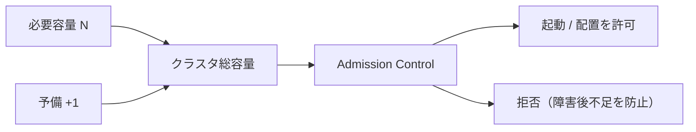
```mermaid
flowchart LR
  N["必要容量 N"]
  R["予備 +1"]
  T["クラスタ総容量"]
  AC["Admission Control"]

  N --> T
  R --> T
  T --> AC
  AC --> OK["起動 / 配置を許可"]
  AC --> NG["拒否（障害後不足を防止）"]
```

N+1を満たしていても、次で破綻しうる。

- メモリは足りるが、特定データストアだけ足りない
- アンチアフィニティで再配置先がない
- ネットワーク制約で業務VLANへ出せない
- 全重要VMが同時に再起動し、ストレージが起動ストームで沈む

---

## 8.12 障害時にVMが停止するケースと停止しないケース

ここが本章の実務コアである。
「クラスタがあるから止まらない」は不正確である。

### 停止しない、またはごく短い停止に抑えやすいケース

| ケース | 仕組み | 備考 |
|--------|--------|------|
| 計画的なホスト保守 | ライブマイグレーション | 帯域と互換性が前提 |
| 計画的なデータストア移動 | ストレージマイグレーション | I/O負荷に注意 |
| ホスト間の負荷再配置 | ライブマイグレーション | 自動負荷分散機能を含む場合あり |

厳密には切り替え瞬間の一瞬停止がありうる。
業務がそれに敏感かは、アプリ次第である。
理論上の無停止と、トランザクション無中断は同一ではない。

### 停止するケース（再起動で復帰を目指す）

| ケース | 仕組み | 備考 |
|--------|--------|------|
| ホスト突然死（電源、パニック） | HAフェイルオーバー | 停止後に別ホストで起動 |
| ホスト隔離（フェンシング） | HA / フェンシング | 二重書き込み防止のため停止しうる |
| ゲストOSハングでVM再起動方針 | HAのVM監視 | 製品設定に依存 |

### 止まって戻らない、または長く止まるケース

| ケース | 理由 |
|--------|------|
| 共有ストレージ全損 | どのホストでもディスクが読めない |
| 残ホストの資源不足 | Admission Control不足、または過剰集約 |
| ネットワーク分断でクォーラム喪失 | 正規系がサービス停止を選ぶ |
| 管理プレーン単独障害 | HA自体は動いても、運用者が操作不能な場合がある |
| ゲスト内論理破損 | 基盤が正しくてもアプリが起動しない |

通貫シナリオの要件「ホスト1台障害時も重要システムを継続」は、次のように読み替えるのが実務的である。

1. 重要8台はHA対象
2. N+1の空きをAdmission Controlで守る
3. 共有ストレージとネットワーク分離を前提にする
4. 停止時間（再起動＋アプリ復帰）を受け入れ、RTOはバックアップ章の仮値（8時間）より短い運用目標を別途置く
5. ストレージ全損やサイト障害は、第9章のDRで扱う

ホスト障害のHAと、サイト災害のDRを混同しない。

---

## 8.13 製品に依存しない共通概念と実装例

### 共通概念の整理

| 一般概念 | 意味 |
|----------|------|
| クラスタ | ホスト群の可用性と配置の単位 |
| HA | 障害後の自動再起動 |
| ライブマイグレーション | 稼働中のホスト間移動 |
| ストレージマイグレーション | 仮想ディスクの配置変更 |
| ハートビート | 生存確認信号 |
| クォーラム | 正規系を決める定足数 |
| スプリットブレイン | 正規系の分裂 |
| アンチアフィニティ | 同居禁止ルール |
| Admission Control | 障害後容量を見込んだ入場制限 |
| N+1 | 予備1単位を持つ冗長 |

### 代表製品での実装例

| 一般概念 | VMware | Hyper-V | KVM系 |
|----------|--------|---------|-------|
| クラスタ | vSphere Cluster | Failover Cluster | 製品により異なる（oVirt、Proxmox 等） |
| HA | vSphere HA | クラスタのVM監視 / 再起動 | Pacemaker 等と連携する構成が多い |
| ライブマイグレーション | vMotion | Live Migration | live migration（libvirt） |
| ストレージ移動 | Storage vMotion | Storage Migration | storage migration |
| 定足数 | HA / クラスタの定足数設計 | クォーラムウィットネス | コーラムデバイス等 |
| 入場制御 | Admission Control | クラスタの容量管理 | 製品と運用に依存 |

実装名は製品固有である。
設計書の見出しは一般概念で書き、手順書だけ製品名を使う。

---

## 8.14 設計上の判断ポイント

| 判断 | 採用の方向 | 不採用案 | トレードオフ |
|------|------------|----------|--------------|
| ホスト台数 | 3台以上でN+1 | 2台のみ | 2台はウィットネス設計が要る。保守と障害の同時耐性が弱い |
| 重要8台 | HA対象 | 手動再起動のみ | 自動化で復帰は速い。誤検知時の動きも設計が要る |
| 開発6台 | HA優先度低または対象外 | 重要と同等保護 | 障害時に重要へ資源を譲る |
| 計画保守 | ライブマイグレーション前提 | 毎回停止メンテナンス | 網帯域と互換性管理が増える |
| 配置ルール | 真に同時障害を避けたい組だけアンチアフィニティ | 全VM相互排他 | 配置不能を防ぐ |
| Admission Control | 有効 | 無効にして詰め込み | 平常時の収容は減るが、障害時の破綻を防ぐ |
| 分断時 | クォーラムで少数側停止 | 両系継続 | 可用性の見かけよりデータ整合を優先 |

単一障害点の例：

- 共有ストレージ一系統
- 管理サーバー一系統（製品による）
- コアスイッチ、ストレージ網の単一経路
- 定足数ウィットネスの置き場所

障害時挙動の要約：

- ホスト1台障害：重要VMは停止後、別ホストで再起動（設計通りなら）
- 管理網分断：心拍とクォーラムの設計次第で、停止または継続が分かれる
- ストレージ障害：HAでは救えない。別層の冗長またはDRへ

---

## 8.15 性能上の注意点

- ライブマイグレーションはマイグレーション網の帯域を占有する。理論帯域の満額は実測では出ない
- 同時に多数のVMを移すと、業務VMのレイテンシが上がる
- HA起動ストームは、ストレージIOPSとCPUを一気に奪う。優先度設計が必要
- Admission Control の計算は理論上の予約であり、実測のCPU Ready やストレージ遅延までは見ない
- アンチアフィニティで片ホストに負荷が偏ると、平常時性能が落ちる
- ネスト仮想化ラボのマイグレーション時間は、本番の絶対値比較に使わない

---

## 8.16 セキュリティ上の注意点

- マイグレーション中のメモリ転送は、平文の管理網を流れると機密が露出する。分離と必要なら暗号化を検討する
- クラスタ管理権限は、全ホストと全VMへの実質的な支配権である。最小権限にする
- フェンシング装置（PDU、BMC）の認証情報を保護する
- クォーラムデバイスを弱い共有フォルダだけに置くと、攻撃や誤削除でクラスタ判断が歪む
- コンソールとクラスタ操作の監査ログを残す

可用性機能は、強い管理権限の上に乗る。
権限設計を後回しにすると、可用性の仕組み自体が攻撃面になる。

---

## 8.17 障害例と切り分け

### 障害例1：ホスト障害後、重要VMが起動しない

**症状**：Host-1死亡。Host-2/3は生きている。重要VMが起動しない。

**確認順**：

1. HAが有効か、対象VMか
2. Admission Control や資源不足で拒否されていないか
3. データストアへ Host-2/3 からアクセスできるか
4. アンチアフィニティで配置先がゼロになっていないか
5. 起動優先度で後回しになっていないか

**典型原因**：予備不足、ストレージ到達性、配置ルールの詰み。

### 障害例2：管理網障害でVMが大量再起動した

**症状**：業務網は生きているが、ホストが一斉に隔離または再起動判定された。

**確認順**：

1. 心拍経路（管理網以外があるか）
2. 実際のホスト健全性（IPMI、コンソール）
3. クォーラムの状態
4. 誤検知のログ

**典型原因**：心拍の単一路由依存、閾値設計ミス。

### 障害例3：ライブマイグレーションが途中で失敗する

**症状**：計画保守中に移動失敗。VMは元ホストに残る、または不安定。

**確認順**：

1. マイグレーション網の疎通と帯域
2. CPU世代互換、仮想ハードウェア互換
3. スナップショットや独立デバイスの有無
4. ストレージ遅延

**典型原因**：網輻輳、互換性、デバイス制約。

### 障害例4：分断後に同じVMが二重に動いた疑い

**症状**：二つの拠点または二つの網分区間で、同じディスクを巡る不整合。

**確認順**：

1. 直ちに双方の書き込みを止められないか（最優先）
2. クォーラム設定
3. ストレージ排他のログ
4. フェンシングの成否

**典型原因**：スプリットブレイン。データ整合の確認が必要。安易な両系継続は禁物。

---

## 章末問題

### 問題1

HAとライブマイグレーションの違いを、トリガと停止の有無の観点から説明せよ。

### 問題2

通貫シナリオでホストを3台以上にする理由を、N+1の言葉で説明せよ。

### 問題3

クォーラムが「意図的にVMを止める」ことがある理由を述べよ。

### 問題4

アンチアフィニティを張りすぎると、HA時に何が起きうるか。

### 問題5

次の各事象で、重要VMは「ほぼ継続」「停止後に自動再起動を期待」「基盤だけでは復旧困難」のどれに近いか分類せよ。

1. 計画的ホストパッチ（事前に退避可能）
2. ホストの電源突然断
3. 共有ストレージ全損

### 問題6

Admission Control を無効にして収容台数を増やした。
平常時は問題なく見える。障害時に何が起きやすいか。

---

## 解答と解説

### 問題1

HAは障害検知をトリガに、別ホストでVMを再起動する。停止を伴う。
ライブマイグレーションは計画的なホスト移動を主目的とし、稼働中の移行でごく短い停止に抑えることを目指す。

### 問題2

必要容量に対して予備1ホスト分を持ち、1台障害後も重要システムを残ホストで動かするためである。
単なる台数増加ではなく、障害を仮定した余剰である。

### 問題3

ネットワーク分断時に両系が正規を名乗るとスプリットブレインになり、同一ディスクへの二重書き込みでデータが壊れる。
定足数を満たさない側を止めることで、整合性を守る。

### 問題4

再配置先ホストがなくなり、HAによる起動が遅延または失敗しうる。
規則と空き容量の両方を同時に満たせなくなる。

### 問題5

1. ほぼ継続（ライブマイグレーション前提）
2. 停止後に自動再起動を期待（HA）
3. 基盤のHAだけでは復旧困難（DRやストレージ冗長の領域）

### 問題6

ホスト障害時に残ホストへVMを載せきれず、重要VMの再起動が失敗または大幅遅延しやすい。
平常時の高収容が、障害時の不足を隠す。

---

## ハンズオン演習

### 演習1：停止する／しない表を作る

自分の学習環境または通貫シナリオ想定で、次の表を埋める。

| 事象 | VMの停止 | 使う機能 | 前提条件 |
|------|----------|----------|----------|
| ホスト保守 | | | |
| ホスト突然死 | | | |
| データストア移動 | | | |
| ストレージ全損 | | | |

### 演習2：3ノード相当での移動体験

可能な環境で次を行う。

1. 検証VMをライブマイグレーション（または同等）する
2. 所要時間と網負荷を記録する（絶対値は参考）
3. ホストを強制停止し、HA再起動の有無を観察する（ラボ限定）

### 演習3：配置ルールの詰みを再現（机上でも可）

ホスト3台、重要VMのペアにアンチアフィニティを設定する想定で、1台障害時の配置可否を図に書け。

### 演習4：Admission Control の設計判断メモ

通貫シナリオについて、次を一文ずつ書く。

1. 採用する理由
2. 無効化した場合に得ること
3. 無効化した場合に失うこと

### 成果物

- 停止する／しない表
- マイグレーションまたはHAの観察メモ
- アンチアフィニティ配置図
- Admission Control の判断メモ

---

## 本章のまとめ

クラスタは、ホスト障害の影響をゼロにはしない。
影響の出し方を変える。
計画移動はライブマイグレーション、突然のホスト死はHAによる停止後再起動、ディスク配置の変更はストレージマイグレーションである。
ハートビートとクォーラムは、誤検知とスプリットブレインのあいだで可用性を制御する。
N+1とAdmission Controlは、障害後の席を平常時に予約する仕組みである。

通貫シナリオの「ホスト1台障害耐性」は、重要8台のHA、予備容量、共有ストレージ、配置ルールの同時成立として設計する。
サイトやストレージの全損は、次章のバックアップと災害対策の範囲になる。


---


<!-- source: 09_backup_dr.md -->

# 第9章 バックアップと災害対策

## 学習目標

1. ゲスト内バックアップとハイパーバイザーレベルバックアップを比較できる
2. クラッシュ整合性とアプリケーション整合性を区別できる
3. スナップショットとバックアップの違いを明確に説明できる
4. RPO / RTO、レプリケーション、DR、復旧テストの関係を説明できる
5. ランサムウェア対策とイミュータブルバックアップの要点を説明できる

---

## 9.1 バックアップが必要になった背景

第8章のHAは、ホスト1台の障害に対する短時間の再配置である。
共有ストレージが生きていれば、別ホストでVMを起こせる。

次の事象には、HAでは足りない。

- 仮想ディスクの論理破損、誤削除
- ランサムウェアによる暗号化
- データストア全損
- サイト災害（火災、広域停電、地域災害）
- 運用者の破壊的操作

通貫シナリオの保護要件は、次で仮置きされている。

| 項目 | 仮の値 |
|------|--------|
| バックアップ | 日次 |
| 遠隔地 | 週次レプリケーション |
| RPO | 24時間（仮） |
| RTO | 8時間（仮） |

これらの数値は出発点である。
重要8台と開発6台で、同じRPOを要求するかは別判断になる。
この章では、数値の意味と実現手段を結びつける。

**バックアップ**とは、本番データとは独立した復旧用の複製を、方針に従い取得し、保管し、復元できるようにする活動と成果物である。
コピーがあるだけでは足りない。
戻せることを、テストで示す必要がある。

---

## 9.2 ゲスト内バックアップ

**ゲスト内バックアップ**とは、仮想マシンのゲストOS上でバックアップエージェントや標準ツールを動かし、ファイルやアプリケーションを保護する方式である。

特徴：

- ファイル単位やアプリ認識の復元に強い
- 物理サーバー時代の運用知見を流用しやすい
- VMごとにエージェント管理が必要
- ゲストOSの負荷が本番に乗る
- 仮想化固有のメタデータ（VM定義）は別途保護が必要な場合がある

適用例：

- データベースのネイティブバックアップ
- ファイルサーバーの増分バックアップ
- アプリベンダーがゲスト内方式を必須とする場合

通貫シナリオでは、重要8台のうちDBやファイルサーバーで、ゲスト内の論理バックアップを併用することがある。
基盤イメージバックアップの代替ではなく、層の追加として扱う。

---

## 9.3 ハイパーバイザーレベルバックアップ

**ハイパーバイザーレベルバックアップ**とは、ハイパーバイザーやそのAPIを通じて、仮想マシンをイメージとして保護する方式である。
ゲストにエージェントを入れない、または補助的にだけ入れる構成が多い。

特徴：

- VM単位でまとめて取得しやすい
- ゲストOSの種類に依存しにくい
- 仮想ディスク全体の復元、別ホストへの復元がしやすい
- アプリ整合性は、ゲスト連携や静止処理に依存する
- バックアップウインドウ中のスナップショット（一時的）がストレージを揺らしうる

多くの製品は、バックアップ時に一時スナップショットを取り、仮想ディスクを読み、終わったら削除する。
ここで使うスナップショットは、第5章の「長期保持する運用スナップショット」とは目的が違う。
一時作業用であり、バックアップ保管そのものではない。

```text
管理サーバー / バックアップサーバー
        |
        | API
        v
  ハイパーバイザー群 ---- 一時スナップショット
        |
        v
  仮想ディスク読み取り ----> バックアップ保管庫
```

```mermaid
flowchart TB
  BAK["バックアップサーバー"]
  API["ハイパーバイザーAPI"]
  VM["対象VM"]
  SNAP["一時スナップショット"]
  REPO["バックアップ保管庫"]

  BAK --> API
  API --> SNAP
  SNAP --> VM
  BAK --> REPO
  VM -.->|"ディスク読み取り"| BAK
```

---

## 9.4 イメージバックアップと CBT

### イメージバックアップ

**イメージバックアップ**とは、仮想マシンの仮想ディスク（と必要なら設定）を、一括したイメージとしてコピーするバックアップである。
ファイルを一つずつ列挙する方式と対比される。

利点：

- ベアメタルに近い粒度でVMを復元できる
- ゲストのファイルシステム種別に依存しにくい

制約：

- 単一ファイルだけ戻したいときに重い場合がある（製品のアイテムリストアに依存）
- 取得サイズが大きくなりやすい

通貫シナリオの初期方針としては、重要8台をイメージバックアップの優先対象にするのがわかりやすい。
一般16台も日次対象に含め、開発6台は世代数を減らす、または除外を検討する。

### CBT の概要

**CBT（Changed Block Tracking）**とは、仮想ディスク上で変更されたブロックを追跡し、次回以降のバックアップで差分だけを読む仕組みの総称である。
製品固有の実装名は異なる。
一般概念としては「変更ブロック追跡」である。

効果：

- 増分バックアップの読み取り量を減らせる
- バックアップウインドウを短縮しやすい

注意：

- CBTのメタデータ不整合で、増分が失敗または不正確になる場合がある
- そのときはフル再取得や再有効化が必要になることがある
- CBTはバックアップを速くする手段であり、保管の独立性を保証しない

理論上の差分量と、実測の転送量は一致しないことが多い。
ゼロ書き込み、上書きパターン、除外設定で変わる。

---

## 9.5 アプリケーション整合性とクラッシュ整合性

バックアップの「取れている」は、戻したあとにアプリが使えるかと同義ではない。

### クラッシュ整合性

**クラッシュ整合性**とは、突然の電源断直後のディスク状態と同等の一貫性である。
ハイパーバイザーがVMを一時停止またはスナップショットするだけで取得すると、この水準になりやすい。

多くのジャーナリングファイルシステムは、クラッシュから起動できる。
しかし、データベースのトランザクションや、複数ディスクにまたがるアプリ状態は、起動後に修復やロールバックが必要になりうる。

### アプリケーション整合性

**アプリケーション整合性**とは、アプリケーションが認識できる一貫した状態でのバックアップである。
例：

- データベースがバックアップモードに入る
- OSの VSS（Volume Shadow Copy Service）相当で書き込みを静止する
- アプリがキャッシュをディスクへ吐き出す

| 水準 | 意味 | 戻した直後 |
|------|------|------------|
| クラッシュ整合 | 電源断相当 | OSは起きうる。アプリ修復が要ることがある |
| ファイルシステム整合 | FSの一貫性を意識 | ファイル単位は比較的安全 |
| アプリケーション整合 | アプリが定義する一貫性 | 業務復旧がしやすい |

重要8台のDBは、アプリケーション整合を目標にする。
開発VMはクラッシュ整合でも許容しやすい。
要求水準をVM区分で変える。

整合性確保は、静止処理の時間だけI/Oが止まる、または遅くなる。
バックアップウインドウ設計に含める。

---

## 9.6 スナップショットとバックアップの違い

第5章で示した区別を、保護設計の中心に置く。

| 観点 | スナップショット | バックアップ |
|------|------------------|--------------|
| 目的 | 短期間の巻き戻し、変更前の退避 | 障害、災害、誤削除、ランサムウェアからの復旧 |
| 保管場所 | 同一データストア上であることが多い | 別媒体、別サイトが原則 |
| データストア障害 | 本番と同時に失われやすい | 残る設計にする |
| 保持期間 | 短い（時間〜数日） | 方針に従い長期 |
| 通貫シナリオの日次／週次 | 代替不可 | 主役 |

スナップショットは、同一ストレージ上の差分管理である。
データストアが壊れれば、本番ディスクもスナップショットも同時に失われる。
通貫シナリオの「日次バックアップ、遠隔地へ週次レプリケーション」は、スナップショットでは代替できない。

バックアップ処理の内部で一時スナップショットを使うことはある。
それは取得手段であり、保管成果物ではない。
運用スナップショットを「バックアップ済み」とみなす事故が、現場では繰り返し起きる。

追加の区別：

- レプリケーション（後述）も、バックアップの完全な代替ではない場合がある
- 暗号化された本番を同期し続けると、暗号被害も同期する

---

## 9.7 レプリケーション

**レプリケーション**とは、データを別の場所へ継続的または定期的に複製することである。
バックアップが「世代を持つ復旧点の保管」に寄るのに対し、レプリケーションは「別場所での最新寄りの複製」に寄る。

| 観点 | バックアップ | レプリケーション |
|------|--------------|------------------|
| 主目的 | 世代からの復元 | 別サイトでの継続、迅速な再起動 |
| 世代 | 複数世代を持つ設計が基本 | 最新寄りを追うことが多い |
| ランサムウェア | 世代とイミュータブルで耐える設計 | 同期型だと被害が伝播しうる |
| 通貫シナリオ | 日次 | 遠隔地へ週次 |

週次レプリケーションは、RPO 24時間（仮）より粗い。
つまり、遠隔サイトだけを見ると、週次の間に最大約7日分のデータを失う可能性がある。
日次バックアップの保管場所が同一サイトだけだと、サイト災害で日次も週次も足りない組み合わせになりうる。

設計の型（例）：

1. 日次バックアップを取得する
2. バックアップデータを遠隔地へ週次で送る（またはレプリカVMを週次更新する）
3. 可能なら、バックアップ保管庫自体を別サイトへ複製する

「レプリケーションがあるからバックアップ不要」は危険な短絡である。
用途が重なる部分もあるが、世代保持と独立性が違う。

```mermaid
flowchart LR
  PROD["本番サイト<br/>VM30台"]
  BAK["日次バックアップ保管"]
  DR["遠隔サイト<br/>週次レプリカ / 保管"]

  PROD --> BAK
  BAK --> DR
  PROD -.->|"方式によっては直接"| DR
```

---

## 9.8 DRサイト

**DR（Disaster Recovery）サイト**とは、本番サイトが使えないときに、業務を再開するための遠隔拠点である。
暖機の度合いで呼び方が分かれることがある。

| 種別（概念） | 状態 | 復帰の速さ | コスト |
|--------------|------|------------|--------|
| コールド寄り | 設備とデータがあるが常時稼働は最小 | 遅い | 低い |
| ウォーム寄り | 一部を起動可能な状態で維持 | 中程度 | 中程度 |
| ホット寄り | ほぼ即座に切り替え可能な冗長 | 速い | 高い |

通貫シナリオの仮要件（RPO 24時間、RTO 8時間）は、ホットな同期DRを必須にはしない。
日次バックアップと週次遠隔複製を組み合わせ、8時間以内に重要業務を戻せる手順と資源があるかが焦点になる。

DRサイトに必要なもの：

- 復元先の計算資源（ホスト）
- ストレージ容量
- ネットワークと名前解決、認証の依存
- バックアップまたはレプリカデータ
- 手順書、権限、連絡体制
- 定期テストの記録

VMイメージだけ遠隔にあっても、ADやDNS、回線、ライセンスが欠ければRTOは守られない。

---

## 9.9 RPO と RTO

**RPO（Recovery Point Objective）**とは、障害時点から見て、どれだけ過去までのデータ損失を許容するかの目標である。
RPO 24時間なら、「最大24時間分のデータを失ってもよい」という設計目標になる。

**RTO（Recovery Time Objective）**とは、障害発生から業務再開までに許容する時間の目標である。
RTO 8時間なら、「8時間以内に所定の業務を戻す」が目標である。

```text
過去 ---------------- 障害 ---------------- 将来
      ^                 |
      |-- RPOの範囲 --| |
                        |---- RTOの範囲 ---->
```

関係の実務的な読み方：

- 日次バックアップは、RPO 24時間と整合しやすい（取得が確実に完走する場合）
- 週次レプリケーション単体では、RPO 24時間を満たしにくい
- RTO 8時間は、復元速度、起動順序、人員、DR資源の合計で決まる
- 理論上の転送速度から計算したRTOと、実測の復旧訓練結果は別物である

通貫シナリオでは、重要8台とそれ以外でRPO/RTOを分けてよい。
すべてを同一にする必要はない。
分けるなら、一覧表にして合意する。

| 区分 | RPO（仮） | RTO（仮） | 保護の主手段 |
|------|-----------|-----------|--------------|
| 重要8台 | 24時間 | 8時間 | 日次イメージ＋アプリ整合、遠隔週次 |
| 一般16台 | 24時間 | 24時間など緩和可 | 日次 |
| 開発6台 | 数日でも可 | 長い | 世代少なめ、または対象外 |

仮の値は、第14章の設計確定まで「仮」と明示したまま使う。

---

## 9.10 復旧テスト

バックアップは、戻して初めてバックアップになる。
取得成功ログは、復元成功を意味しない。

復旧テストで確認すること：

1. 指定した世代からVMまたはデータを復元できる
2. ゲストOSが起動する
3. アプリケーションが使える（重要システム）
4. 所要時間がRTOに対して妥当か（実測）
5. 手順書通りに、担当者が実施できるか
6. 遠隔地からの復旧経路が使えるか

テストの頻度例：

- 四半期に1回、重要VMのうち代表を復元
- 年1回、DRサイトでの業務再開訓練
- バックアップ方式変更のたびに回帰テスト

通貫シナリオでは、重要8台すべてを毎回フルテストしなくてよい。
代表（ファイル、認証、AP、DB）をローテーションする。
テストで本番を壊さないため、隔離ネットワークでの復元を基本にする。

---

## 9.11 ランサムウェア対策とイミュータブルバックアップ

### ランサムウェア対策（バックアップ観点）

ランサムウェアは、本番データを暗号化するだけでなく、バックアップへも到達しようとする。
対策の要点：

1. バックアップ保管へ到達できるアカウントを最小にする
2. 本番セグメントとバックアップ管理を分離する
3. 複数世代を持ち、感染前の世代へ戻せるようにする
4. オフラインまたは別系統の保管を持つ
5. 復旧手順を、感染拡大中でも実行できるようにする

レプリケーションだけに頼ると、暗号化済みデータの上書き同期が起きうる。
世代を持つバックアップと、書き込み制限のある保管が必要になる。

### イミュータブルバックアップ

**イミュータブルバックアップ**とは、保持期間中に削除や改ざんができない（または極めて困難な）保管状態を指す。
オブジェクトストレージのオブジェクトロック、WORM相当、バックアップ製品の不変リポジトリなどが実装例である。

効果：

- 管理者アカウントが侵害されても、保持期間中のバックアップを消せない設計にできる
- ランサムウェア対策の中核になりやすい

制約：

- 保持期間の設定ミスが、容量を食い続ける
- 本当に必要な抹消（法的要求）との衝突を、ポリシーで先に決める
- 「イミュータブル」の文言が製品によって指す範囲が違う。検証が必要

通貫シナリオでは、少なくとも遠隔保管側に、削除耐性のある世代を置く判断が有力である。
コストと運用複雑さとのトレードオフを、第14章で確定する。

---

## 9.12 製品に依存しない共通概念と実装例

### 共通概念の整理

| 一般概念 | 意味 |
|----------|------|
| ゲスト内バックアップ | OS/アプリ上で取得 |
| ハイパーバイザーレベルバックアップ | 仮想化API経由でVMイメージ取得 |
| イメージバックアップ | 仮想ディスク単位の保護 |
| CBT | 変更ブロック追跡 |
| クラッシュ整合 | 電源断相当の一貫性 |
| アプリケーション整合 | アプリが定義する一貫性 |
| レプリケーション | 別場所への複製 |
| DRサイト | 災害時の再開拠点 |
| RPO / RTO | 損失量と再開時間の目標 |
| イミュータブル | 保持期間中の改ざん耐性 |

### 代表製品と方式の例

| 一般概念 | 実装例（製品固有） |
|----------|--------------------|
| ハイパーバイザーレベル | VMware vSphere API 連携のバックアップ製品、Hyper-V の VSS 連携、KVM のスナップショット＋コピー運用 |
| CBT相当 | VMware CBT、Hyper-V の差分追跡、製品独自の変更追跡 |
| アプリ整合 | Windows VSS、DBネイティブバックアップ、ゲストエージェント連携 |
| イミュータブル | オブジェクトロック、WORM、不変リポジトリ機能 |

一般概念で要件を書き、製品機能は要件への写像として選ぶ。

---

## 9.13 設計上の判断ポイント

| 判断 | 採用の方向 | 不採用案 | トレードオフ |
|------|------------|----------|--------------|
| 保護の主方式 | ハイパーバイザーレベル日次＋重要アプリは整合性確保 | スナップショット長期保持で代用 | 保管コスト増、真の復旧点を得る |
| 重要8台 | アプリ整合を目指す | すべてクラッシュ整合 | ウインドウは伸びるが復旧品質が上がる |
| 開発6台 | 世代削減または対象外 | 重要と同等 | コスト減、開発データ損失リスク増 |
| 遠隔 | 週次でバックアップまたはレプリカを送る | 同一サイトのみ | 回線と遠隔保管コスト増、サイト災害に耐える |
| RPO 24時間 | 日次バックアップ完走を監視 | 取得失敗を翌日まで放置 | 運用負荷増 |
| RTO 8時間 | 復旧訓練で実測し手順を削る | カタログ速度だけで宣言 | 訓練コスト増、宣言の信頼性が上がる |
| ランサムウェア | イミュータブルまたはオフライン世代 | 上書き可能な単一保管 | 容量とコスト増、消去耐性が上がる |
| レプリケーション | バックアップを補完 | バックアップ全廃 | 世代と独立性を失いやすい |

単一障害点の例：

- バックアップサーバー本体
- 同一サイトの唯一の保管庫
- バックアップ用資格情報の単一管理
- 復旧手順を知る人が一人だけ

障害時挙動：

- ホスト1台障害：第8章のHA。バックアップは使わないことが多い
- VM誤削除：バックアップから復元
- データストア全損：バックアップまたは遠隔から復元。RTO計測の本番
- サイト災害：DRサイト手順。週次遠隔のRPO限界を認識する
- ランサムウェア：感染前世代のイミュータブル／隔離バックアップへ

---

## 9.14 性能上の注意点

- バックアップはストレージとネットワークの大口利用者である。業務ピークと重ねない
- 一時スナップショット中は、対象VMのディスク性能が落ちることがある
- 全VM同時フルバックアップは、データストアを沈める。並列度を制御する
- CBT利用時の増分は理論上小さいが、初回フルや再シードは大きい
- 遠隔週次レプリケーションは回線を長時間占有する。帯域制限と時間帯を決める
- 復元は取得より遅いことが多い。RTOは復元の実測で見る

通貫シナリオの実効20 TB起算に対し、バックアップ保管は世代数倍の容量計画が要る。
圧縮と重複排除の理論値を、実測なしで設計確定に使わない。

---

## 9.15 セキュリティ上の注意点

- バックアップデータは本番の写しである。暗号化とアクセス制御を本番以上に厳しくしてよい
- バックアップ管理者権限は、全VMの読み取りに等しい
- ゲストエージェントの資格情報をテンプレートへ埋め込まない（第7章）
- 復元先を間違えると、古いデータで本番を上書きする。承認とガードレールを置く
- イミュータブルの解除権限を、日常運用アカウントから分離する
- バックアップカタログの改ざんも攻撃対象になる

---

## 9.16 障害例と切り分け

### 障害例1：バックアップ成功と出ているが、復元するとDBが壊れている

**症状**：ジョブは緑。復元VMは起動するがアプリが不整合。

**確認順**：

1. 整合性水準（クラッシュかアプリか）
2. 静止処理（VSS等）のログ
3. マルチディスクの同時性
4. アプリ公式のバックアップ手順との差分

**典型原因**：クラッシュ整合のみでDBを守っていた。

### 障害例2：日次バックアップが毎夜失敗し、気づいたら1週間空いた

**症状**：監視がジョブ失敗を追っていない。RPO 24時間が崩れている。

**確認順**：

1. 失敗通知の有無
2. データストア空き、スナップショット残り
3. CBTエラー
4. 権限期限切れ

**典型原因**：監視欠如、一時スナップショット肥大、認証切れ。

### 障害例3：ランサムウェア後、バックアップも消えていた

**症状**：本番もバックアップも暗号化または削除。

**確認順**：

1. 保管庫へのネットワーク到達経路
2. 使用アカウントの権限範囲
3. イミュータブルまたはオフライン世代の有無
4. 別サイトコピーの有無

**典型原因**：同一資格情報で本番とバックアップを管理、不変保管なし。

### 障害例4：DR訓練でRTO 8時間を超過した

**症状**：データはあったが、復元、網、認証、手順で時間が溶けた。

**確認順**：

1. どこで何時間が消えたかのタイムライン
2. 復旧優先順位（重要8台の順序）
3. DR側の資源不足
4. 手順書の欠落手順

**典型原因**：転送時間だけ見て、依存サービスと人的手順を見ていなかった。

---

## 章末問題

### 問題1

スナップショットをバックアップの代わりにしてはならない理由を、保管場所の観点から説明せよ。

### 問題2

クラッシュ整合性とアプリケーション整合性の違いを、DBを例に説明せよ。

### 問題3

通貫シナリオのRPO 24時間（仮）に対し、日次バックアップと週次レプリケーションはそれぞれどう寄与するか。

### 問題4

CBTの役割を一文で述べよ。バックアップ保管の独立性との関係も一言添えよ。

### 問題5

ゲスト内バックアップとハイパーバイザーレベルバックアップを、運用負荷と復元粒度の観点で比較せよ。

### 問題6

イミュータブルバックアップがランサムウェア対策になる理由を説明せよ。

---

## 解答と解説

### 問題1

スナップショットは同一データストア上の差分であることが多く、データストア障害で本番と同時に失われる。
バックアップは別媒体や別サイトへ独立して保管し、災害や広範囲障害に備える。

### 問題2

クラッシュ整合は電源断相当であり、DBは起動後にクラッシュリカバリや修復が必要になりうる。
アプリケーション整合は、DBがバックアップ可能な一貫状態を作ってから取得するため、復旧が業務に近い形になりやすい。

### 問題3

日次バックアップは、完走すればRPO 24時間の主たる手段になる。
週次レプリケーションはサイト災害向けの遠隔手段だが、週次だけではRPO 24時間を満たさない。
両者は役割が違う。

### 問題4

CBTは変更ブロックを追跡し、増分バックアップの読み取りを減らす仕組みである。
速くするための手段であり、保管場所の独立性や世代保護そのものではない。

### 問題5

ゲスト内はエージェント管理が増えるが、ファイルやアプリ単位の復元に強い場合がある。
ハイパーバイザーレベルはVM横断の運用を揃えやすく、VMイメージ復元に強い。
粒度と運用負荷はトレードオフになる。

### 問題6

保持期間中に削除や改ざんができないため、攻撃者が管理者権限を得ても、過去世代のバックアップを消しきれない設計にできる。
感染前の時点へ戻す選択肢が残る。

---

## ハンズオン演習

### 演習1：スナップショットとバックアップの対比メモ

第5章の表を再掲せず、自分の言葉で次を書け。

1. 同一障害で同時に失われるか
2. 通貫シナリオの日次／週次のどれを担えるか
3. 一時スナップショットをバックアップと呼んではいけない理由

### 演習2：取得と復元（小規模）

1. 検証VMのバックアップ（またはエクスポート相当）を取る
2. 別名で復元する
3. 所要時間を記録する
4. 理論見積もりと実測を並べる

### 演習3：RPO / RTO の区分表

通貫シナリオの重要8台、一般16台、開発6台について、仮のRPO/RTOと手段を表にする。
「すべて同一」にするなら、その理由も書く。

### 演習4：ランサムウェア想定の設計判断

次を判断メモにする。

1. バックアップ保管への到達経路
2. 使うアカウントの権限
3. イミュータブルまたはオフラインの採用可否
4. 不採用する場合の代替緩和策

### 成果物

- 対比メモ
- 復元実測記録
- RPO/RTO区分表
- ランサムウェア対策の判断メモ

---

## 本章のまとめ

バックアップは、HAが扱わない損失（誤削除、論理破損、ランサムウェア、サイト災害）に備える独立した復旧手段である。
ゲスト内とハイパーバイザーレベルは排他ではなく、要件で重ねられる。
整合性の水準を決めないと、「取れたが使えない」が起きる。
スナップショットは短期間の巻き戻しであり、日次バックアップと遠隔週次レプリケーションの代替ではない。

通貫シナリオのRPO 24時間、RTO 8時間は仮の目標である。
日次取得の完走監視、遠隔世代の保持、復旧テストの実測がそろって、初めて目標に意味が生まれる。
次章では、これらの運用を支える権限、ネットワーク分離、監査といったセキュリティを扱う。


---


<!-- source: 10_security.md -->

# 第10章 仮想化基盤のセキュリティ

## 学習目標

1. 管理プレーンとデータプレーンの分離を説明できる
2. ハイパーバイザー脆弱性と管理ネットワーク分離の重要性を説明できる
3. 最小権限、多要素認証、ログ監査の運用要件を列挙できる
4. セキュアブート、仮想TPM、テンプレート安全性の要点を説明できる
5. パッチ管理を可用性制約と両立させる考え方を説明できる

---

## 10.1 仮想化基盤のセキュリティが必要になった背景

仮想化は、物理サーバーを減らして運用を揃える。
同時に、攻撃者から見ると「集約された特権点」も増える。

通貫シナリオでは、ホスト3台以上、管理サーバー、共有ストレージ、バックアップ、監視がある。
業務VMが30台あっても、管理画面への侵入が1回成功すれば、その影響は多数のVMへ広がる。
物理1台ずつの時代より、管理面の価値が上がっている。

ここで扱うセキュリティは、ゲストOSのアンチウイルス設定だけではない。
仮想化基盤そのものを守る話である。

守る対象を先に分ける。

| 対象 | 例 | 侵害時の影響 |
|------|----|--------------|
| 管理プレーン | 管理サーバー、ホスト管理API、権限、監査ログ | 全ホスト、全VMの設定変更や破壊 |
| データプレーン | 業務VMの通信、ストレージI/O、マイグレーション転送 | 業務データの漏洩、改ざん、停止 |
| ハイパーバイザー | Type 1 本体、カーネル相当の制御層 | ゲスト間分離の崩壊、ホスト奪取 |
| テンプレートとイメージ | 黄金イメージ、クローン元 | 量産される脆弱性の固定化 |
| 運用経路 | バックアップ、監視、パッチ配布 | 復旧不能、検知遅延、横展開 |

仮想化の分離性（第1章）はゲスト同士では強い。
しかし、ハイパーバイザーと管理面は共有点である。
セキュリティ設計は、この非対称を前提にする。

---

## 10.2 管理プレーンとデータプレーン

### 管理プレーン

**管理プレーン（control plane / management plane）**とは、仮想化基盤を観測し、設定し、操作する面である。
管理サーバー、ホストの管理エージェント、クラスタ制御、権限管理、監視とログの収集経路がここに入る。

管理プレーンで行われる操作の例は次である。

- 仮想マシンの作成、削除、電源操作
- vCPU、メモリ、ディスク、ネットワークの変更
- ライブマイグレーション、HA設定、ホストのメンテナンスモード
- ロールと権限の付与
- テンプレートの登録

### データプレーン

**データプレーン（data plane）**とは、業務データと業務通信が実際に流れる面である。
ゲストのアプリケーション通信、仮想ディスクへの読み書き、ストレージネットワーク上のI/O、場合によってはマイグレーション中のメモリ転送がここに近い。

製品や文脈によっては、「制御面と転送面」の言い方をネットワーク機器と同様に使う。
本書では、仮想化運用の実務に合わせて次のように置く。

- 管理プレーン：誰が何を設定し、操作できるか
- データプレーン：業務の通信とデータがどこを通るか

```text
+---------------------------+     +---------------------------+
| 管理プレーン               |     | データプレーン             |
| 管理サーバー / API / 権限   |     | 業務VM通信 / 仮想ディスク  |
| 監視とログ / パッチ指示     |     | ストレージI/O / 移行転送   |
+-------------+-------------+     +-------------+-------------+
              |                                 |
              v                                 v
        管理ネットワーク                 業務とストレージの網
              |                                 |
              +---------------+-----------------+
                              |
                     ハイパーバイザー / ホスト
```

```mermaid
flowchart TB
  subgraph MgmtPlane["管理プレーン"]
    VC["管理サーバー"]
    AUTH["認証と権限"]
    AUDIT["監査ログ"]
    MON["監視"]
  end

  subgraph DataPlane["データプレーン"]
    VM["業務VM群"]
    ST["仮想ディスク / データストア"]
    APPNET["業務通信"]
  end

  HV["ハイパーバイザー"]
  N_MGMT["管理ネットワーク"]
  N_DATA["業務 / ストレージ網"]

  VC --> N_MGMT
  AUTH --> N_MGMT
  AUDIT --> N_MGMT
  MON --> N_MGMT
  N_MGMT --> HV
  VM --> N_DATA
  ST --> N_DATA
  APPNET --> N_DATA
  N_DATA --> HV
```

### なぜ分離するか

管理プレーンとデータプレーンを同一セグメントに置くと、次が起きる。

1. 業務VMや業務ユーザーから管理APIへ到達しやすくなる
2. 業務トラフィックの過負荷が管理到達性を奪う
3. 障害時に「業務が死んだのか、管理が見えないだけか」が分からなくなる

第6章の管理ネットワーク分離は、性能のためだけではない。
セキュリティ境界そのものである。

通貫シナリオでは、管理 / 業務 / ストレージ / マイグレーションの4系統分離を前提にする。
通貫シナリオでは、そのうち管理系統を「特権の入口」として設計する。

---

## 10.3 ハイパーバイザーの脆弱性

ハイパーバイザーは、ゲストより高い特権で動作する。
ここに欠陥があると、理論上は次が可能になる。

- ゲストからホストへの脱出（VM Escape）
- 他ゲストのメモリやディスクへの不正アクセス
- ホスト上の全VMの停止や改ざん

頻度として日常的に起きるわけではない。
しかし、影響半径は大きい。
通貫シナリオのホスト1台に重要VMが複数載るなら、1ホスト侵害は複数業務の同時侵害になりうる。

### 攻撃面の整理

| 攻撃面 | 内容 | 緩和の方向 |
|--------|------|------------|
| 管理API | 認証突破、権限昇格 | MFA、最小権限、管理網分離 |
| 仮想デバイス | エミュレーションや準仮想化の実装欠陥 | パッチ、不要デバイス削減 |
| ゲストツール連携 | ホストとゲストの通信経路 | 版数管理、不要機能の無効化 |
| 共有資源 | サイドチャネル、資源枯渇によるDoS | 同居方針、予約と制限、監視 |
| テンプレート | 埋め込まれたアカウントや古いパッケージ | テンプレート衛生、再生成 |

「ハイパーバイザーは安全だから中は緩くてよい」は成立しない。
ゲスト間分離は防御の一層であり、唯一の層ではない。

### 製品実装の違い（一般概念との区別）

VMware、Hyper-V、KVM のいずれも、パッチとサポート期限の管理が必要である。
製品固有の機能名（例：特定のロックダウンモードや強化ガイド）は、一般概念である「攻撃面の縮小」の実装例として扱う。
機能名を暗記するより、何を閉じ、何を監視するかを先に決める。

---

## 10.4 管理ネットワークの分離

管理ネットワーク分離の要点は、第6章の再掲ではなく、到達制御として再定義することである。

### 到達できる主体を限定する

管理ネットワークへ入れる主体を、次に絞る。

- 管理者の運用端末（またはジャンプホスト）
- 管理サーバー
- 監視とログ収集のサーバー
- バックアップ連携に必要な最小コンポーネント

業務VMのセグメントから、ホスト管理IPや管理APIへ直接到達できないようにする。
開発者が「便利だから業務VLANからESXiやHyper-VホストへSSHしたい」と言う場面がある。
通貫シナリオでは不採用とする。
代わりに、管理用ジャンプホストを置く。

### 分離の段階

| 段階 | 内容 | 小規模での現実性 |
|------|------|------------------|
| 論理分離 | VLAN / ファイアウォールで管理網を分ける | 必須 |
| 物理分離 | 管理用NICを分ける | 推奨 |
| 運用分離 | 管理用端末、踏み台、MFAを別にする | 必須に近い |
| 完全エアギャップ | 管理網をインターネットから完全遮断 | 運用コストと相談 |

完全エアギャップは理想に見える。
しかし、パッチ取得、監視転送、遠隔支援が止まる。
通貫シナリオ規模では、管理網を社内限定にし、インターネット直結を禁止し、更新経路を制御するほうが現実的である。

```mermaid
flowchart LR
  Admin["管理者端末"] --> Jump["ジャンプホスト"]
  Jump --> MgmtNet["管理VLAN"]
  MgmtNet --> VC["管理サーバー"]
  MgmtNet --> H1["Host-1"]
  MgmtNet --> H2["Host-2"]
  MgmtNet --> H3["Host-3"]

  User["業務ユーザー"] --> BizNet["業務VLAN"]
  BizNet --> VMs["業務VM"]
  BizNet -.->|到達不可| MgmtNet
```

---

## 10.5 最小権限

**最小権限（least privilege）**とは、業務に必要な権限だけを付与し、それ以上を与えない原則である。
仮想化管理では、「管理者なら全部できる」ロールを人数分配ると失敗する。

### 役割の分解例（通貫シナリオ）

| 役割 | できること | できないこと（例） |
|------|------------|--------------------|
| 基盤管理者 | ホスト、クラスタ、データストア、権限 | 日常のゲスト内アプリ変更は担当外 |
| VM運用担当 | 担当VMの電源、コンソール、限定的な変更 | ホスト設定、他部門VMの削除 |
| バックアップ担当 | バックアップジョブ、リストア試験 | 任意VMの新規作成やネットワーク変更 |
| 監査担当 | ログ参照 | 設定変更 |
| 開発者 | 開発用リソースプール内のみ | 本番クラスタへの直接操作 |

製品では、ロールベースアクセス制御（RBAC）として実装される。
VMware のロール、Hyper-V / SCVMM の役割、oVirt のパーミッションは用語が違う。
共通概念は「操作対象と操作種別の組み合わせで権限を切る」ことである。

### 共有アカウントを避ける

「vcenter-admin」のような共有IDは、事故後に誰が操作したか分からない。
個人アカウントを基本とし、特権操作は追加認証や承認と組み合わせる。

サービスアカウントが必要な自動化では、次を守る。

1. 用途ごとにアカウントを分ける
2. 権限をジョブに必要な最小へ落とす
3. 秘密情報をコードやテンプレートに埋め込まない
4. ローテーションと失効手順を持つ

---

## 10.6 多要素認証

**多要素認証（MFA: Multi-Factor Authentication）**とは、知識（パスワード）、所持（トークンや端末）、生体などのうち、複数要素で認証することである。

管理プレーンは、パスワード漏洩1つで基盤全体が危うくなる。
通貫シナリオでは、少なくとも次に MFA を要求する。

- 管理サーバーへの対話ログイン
- ジャンプホストへのログイン
- 特権ロールでの操作（可能な製品やIdP連携がある場合）

ゲストOSのRDPやSSHへのMFAも有益だが、優先順位は管理プレーンが先である。
ゲスト侵害は1VMの話に閉じやすい。
管理プレーン侵害は閉じにくい。

### 設計上の落とし穴

MFAを入れると緊急時のログインが遅くなる、という反論が出る。
対策は MFA を外すことではない。

- 緊急用ブレイクグラスアカウントを少数用意し、保管と監査を厳格化する
- 障害時手順書に認証経路を書く
- IdP障害時の代替経路を事前に試験する

「便利だから管理サーバーを業務VLANに出し、誰でもパスワードだけで入れる」構成は不採用である。

---

## 10.7 ログと監査

権限設計だけでは足りない。
事後に追える記録が必要である。

**監査ログ**とは、「誰が、いつ、何に対して、何をしたか」を残す記録である。
性能ログ（CPU Ready など）とは目的が違う。
性能ログは遅さの説明に使い、監査ログは不正と誤操作の説明に使う。

### 最低限残すもの

1. 管理プレーンへの認証成功と失敗
2. 権限変更
3. VMの作成、削除、権限のあるユーザーへのコンソール接続
4. ホストのメンテナンス、再起動、設定変更
5. バックアップの成功、失敗、リストア実行
6. ファイアウォールや管理網のポリシー変更

### 運用上の要件

- ログを改ざんされにくい場所へ転送する（管理ホストローカルだけに置かない）
- 時刻同期を必須にする（第2章のゲストツールやNTPの話と接続）
- 保持期間を決める（インシデント調査に足りる長さ）
- アラートと監査を混同しない（全部をチケット化すると形骸化する）

通貫シナリオの監視とログ収集サーバーは、管理プレーンの一部として設計する。
「あとで入れる」は、事故後に証拠が無い状態を選ぶことと同じである。

---

## 10.8 セキュアブートと仮想TPM

### セキュアブート

**セキュアブート（Secure Boot）**とは、署名されたブートローダやカーネルだけを起動許可する仕組みである。
物理サーバーのUEFI Secure Boot と、仮想マシンの仮想UEFI Secure Boot の両方がある。

ホスト側では、不正なブートローダによるハイパーバイザー置換を抑止する方向で使う。
ゲスト側では、ゲストOSの起動連鎖の改ざん耐性を上げる。

制約もある。

- 古いゲストOSや特殊ドライバが署名要件で起動しないことがある
- テンプレートで有効化したあと、例外手続きなしに無効化すると構成ドリフトになる

### 仮想TPM

**仮想TPM（vTPM: virtual Trusted Platform Module）**とは、物理TPMの機能を仮想マシンに提供する仮想デバイスである。
BitLocker や同等のディスク暗号化、計測ブート、鍵の保護などに使われる。

vTPMを使うときの設計注意は次である。

1. vTPMの状態データを、どこに保管し、どうバックアップするか
2. ホスト間移行やDR時に、鍵と状態が追随するか
3. スナップショットやクローンで鍵が複製されるリスクをどう扱うか

製品ごとに保管場所と制約が異なる。
一般概念として押さえるのは、「暗号化を有効化した瞬間から、鍵管理が可用性要件に入る」ことである。
鍵を失うと、データは安全に消えたのと同じになる。

通貫シナリオでは、全VMへ一律vTPM必須にはしない。
認証基盤や機密度の高いファイルサーバーなど、要件があるVMから適用し、バックアップと復旧手順を先に試験する。

---

## 10.9 テンプレートの安全性

第7章のテンプレートは、展開速度の道具である。
同時に、脆弱性の量産装置にもなる。

**テンプレートの安全性**とは、クローン元イメージが、秘密情報、不要アカウント、古いパッケージ、余計なソフトウェアを持ち込まない状態を維持することである。

### テンプレート衛生チェックリスト

| 項目 | 確認内容 |
|------|----------|
| アカウント | 初期パスワードの使い回しがないか。SSH鍵や証明書が埋め込まれていないか |
| 更新 | OSとミドルウェアのパッチ水準が基準を満たすか |
| ゲストツール | 必要な版が入っているか。不要な連携機能が残っていないか |
| エージェント | 監視、バックアップ、EDRなどが正しい設定か |
| ネットワーク | 固定IPや検証用ルートが残っていないか |
| ログと履歴 | 構築時の履歴、一時ファイル、資格情報が残っていないか |
| ハードニング | 不要サービス停止、セキュアブート方針との整合 |

「動くテンプレート」と「安全なテンプレート」は別物である。
通貫シナリオでは、テンプレートオーナーを決め、四半期ごとの再生成またはパッチ適用手順を持つ。

ゴールデンイメージを更新せずに2年クローンし続ける運用は不採用である。

---

## 10.10 仮想マシン間の分離

ハイパーバイザーはゲスト間のメモリ空間とプロセスを分ける。
しかし、次は共有される。

- 同一ホストのCPUキャッシュやスケジューラ
- 同一データストアのパスとコントローラ
- 同一仮想スイッチのアップリンク
- 管理プレーンの権限モデル

したがって、「別VMだから完全に独立」は言い過ぎである。

### 分離を強める設計判断

| 手段 | 効果 | コスト |
|------|------|--------|
| 別VMに分ける | アプリ障害と権限の境界 | 運用対象が増える |
| 別ホスト／アンチアフィニティ | 同居リスクの低減 | 収容効率が下がる |
| 別データストア | ストレージ障害と権限の分割 | ストレージ設計が複雑 |
| 別クラスタ | 管理境界の明確化 | ライセンスと運用が二重化 |
| ネットワークマイクロセグメンテーション | 東西通信の制限 | 設計とトラブルシュートが重い |

通貫シナリオ規模では、まず次を標準にする。

1. 重要システムはVM単位で分離する（1VMに多業務を詰め込まない）
2. 管理網と業務網を分ける
3. 機密度の高いVMの同居方針を文書化する
4. 開発VMと本番VMの権限とネットワークを分ける

多テナントのクラウドほど厳密な分離は不要でも、「社内だから同居は自由」は危険である。
ランサムウェアが1VMからバックアップサーバーや管理サーバーへ横展開する経路を想像するとよい。

---

## 10.11 パッチ管理

仮想化基盤のパッチは、ゲストOSのパッチと別管理にする。

対象の例：

- ハイパーバイザー
- 管理サーバー
- ファームウェア（BIOS/UEFI、NIC、HBA、ストレージ）
- ゲストツール
- バックアップソフト、監視エージェント

### 可用性と両立させる手順の骨格

1. リリースノートで影響範囲を読む（ホスト再起動要否、管理サーバー停止要否）
2. 検証環境または先行1ホストで適用する
3. クラスタに十分な予備容量があることを確認する（Admission Control、N+1）
4. ホストをメンテナンスモードにし、VMを退避する
5. パッチ適用と再起動
6. 監視指標と代表VMの疎通を確認してから次ホストへ進む

通貫シナリオはホスト1台障害耐性を持つ前提である。
その前提は、計画停止（パッチ）にも使える。
逆に、予備容量が無いクラスタへ無理にパッチを当てると、パッチ作業そのものが障害になる。

### よくある失敗

- ゲストOSだけ毎月更新し、ハイパーバイザーを年単位で放置する
- 管理サーバーだけ先に上げ、ホスト群との互換性を壊す
- 全ホストを同日に一斉再起動する
- ファームウェアを忘れ、NICやストレージだけ古い

パッチはセキュリティ対策であると同時に変更管理である。
変更窓口、ロールバック方針、連絡体制がないパッチ適用は、計画停止ではなく事故である。

---

## 10.12 製品に依存しない共通概念と実装例

| 共通概念 | 実装例（製品固有） |
|----------|-------------------|
| 管理プレーンの集中制御 | vCenter、SCVMM、oVirt Engine、Proxmox の管理UI/API |
| RBAC | 各製品のロール／パーミッション |
| 管理網分離 | 管理用 vmkernel / host management / bridge を別VLANへ |
| ホスト強化 | ロックダウン、不要サービス停止、firewall 規則 |
| セキュアブート / vTPM | 各社の仮想UEFI Secure Boot、vTPM デバイス |
| 監査 | タスク／イベント履歴、syslog/SIEM 転送 |
| 認証強化 | Active Directory / LDAP / SAML / OIDC 連携と MFA |

製品のチェックリストをなぞる前に、通貫シナリオの文章として次を埋められるかが先である。

1. 管理APIへ誰が、どの網から、どの認証で到達するか
2. 権限変更と破壊的操作のログはどこへ残るか
3. ホストと管理サーバーのパッチ周期は何か
4. テンプレートのオーナーと更新周期は誰か
5. 重要VMの同居禁止ルールはあるか

---

## 10.13 設計上の判断ポイント

| 判断 | 採用案 | 不採用案 | 理由とトレードオフ |
|------|--------|----------|--------------------|
| 管理網 | VLAN分離＋到達元制限＋ジャンプホスト | 業務網からホスト管理へ直接接続 | 攻撃面と障害切り分けを守る。利便性は下がる |
| 権限 | 役割別RBAC、共有ID禁止 | 全員がフル管理者 | 誤操作と内部不正の影響を縮小。権限設計コストは増える |
| 認証 | 管理プレーンへMFA | パスワードのみの恒久運用 | 資格情報漏洩耐性が上がる。緊急手順の整備が必要 |
| ログ | 外部転送と保持期間の定義 | ホストローカルのみ短期間 | 事後追跡が可能。保管コストが増える |
| セキュアブート/vTPM | 要件のあるVMから適用 | 全VMへ無計画に一斉適用 | 鍵管理と互換性試験が追いつかないのを防ぐ |
| テンプレート | 衛生基準と再生成周期 | 古い黄金イメージの永続利用 | 脆弱性の量産を止める。イメージ管理工数が増える |
| パッチ | ローリング適用＋検証先行 | 長年未適用、または一斉再起動 | 可用性を維持しつつ欠陥を潰す。計画作業が増える |
| 開発と本番 | 権限とネットワークを分離 | 開発者が本番管理画面を共有 | 横展開と誤操作を防ぐ。環境が二重化する |

単一障害点の見方も変える。
共有ストレージや管理サーバーは可用性のSPOFになりうるだけでなく、セキュリティ上の高価値標的でもある。
バックアップサーバーが管理網と業務データの両方に触れるなら、そのホストの強化優先度は高い。

---

## 10.14 性能上の注意点

セキュリティ制御は、性能へ副作用を持つことがある。

- 過度なログやリアルタイムスキャンが、データストアとCPUを圧迫する
- 暗号化（仮想ディスク暗号化やゲスト内暗号化）はCPUとI/Oのコストを増やす
- マイクロセグメンテーションの過多な規則は、東西通信の遅延と切り分け時間を増やす
- ウイルス対策の同時フルスキャンは、第3章から第5章の競合問題を再現する

通貫シナリオでは、セキュリティスキャンスケジュールをバックアップ窓や業務ピークと重ねない。
理論上の防御力を上げても、基盤全体が遅ければ可用性事故になる。

---

## 10.15 セキュリティ上の注意点（再確認）

- 管理プレーン侵害は多VM事故である。優先度をゲスト内対策より下げない
- ゲストツール、バックアップエージェント、監視エージェントは攻撃面でもある
- スナップショットやテンプレートに秘密情報が残ることがある
- コンソールアクセスは、ネットワークACLを迂回する操作経路になりうる
- 「社内ネットワーク内」を信頼境界にしない。横展開を前提にセグメントを切る
- ランサムウェア対策はバックアップのイミュータブル化（第9章）と管理面防御の両輪である

---

## 10.16 障害例と切り分け

### 障害例1：業務は動くが管理画面に入れない

**症状**：ユーザーはアプリを使える。管理者だけがホストや管理サーバーへ到達できない。

**確認順**：

1. 管理ネットワークのリンク、VLAN、ファイアウォール変更の有無
2. 管理サーバー自身の死活とディスク逼迫
3. 認証基盤（ディレクトリサービス）障害の有無
4. 業務網と管理網の混同配線がないか

**典型原因**：管理網のスイッチ変更、MFA/IdP障害、管理サーバーのディスク満杯。
セキュリティ強化の直後なら、到達規則の締めすぎも疑う。

### 障害例2：特定ユーザーが他部門VMを消した

**症状**：削除タスクの実行者が共有アカウント、または広すぎるロールだった。

**確認順**：

1. 監査ログで実行者と時刻を特定する
2. ロール割り当てを見直す
3. バックアップからのリストア可否を確認する
4. 共有アカウントを廃止する

**典型原因**：最小権限の未設計。技術欠陥より運用欠陥が多い。

### 障害例3：パッチ適用中に重要VMが止まった

**症状**：ホストメンテナンス中、退避先容量不足でVMが起動できない、またはHAが競合した。

**確認順**：

1. Admission Control と実空き容量
2. 同時メンテナンス台数
3. アンチアフィニティと配置制約
4. パッチ手順書の事前チェック項目

**典型原因**：セキュリティ作業を可用性設計の外で実行したこと。

### 障害例4：クローンしたVMから平文の秘密鍵が見つかった

**症状**：開発VMのリポジトリやテンプレートに、本番接続情報が残っていた。

**確認順**：

1. テンプレートとクラウド初期化（guest customization）の手順
2. 秘密情報の保管場所（Vault等）へ移す
3. 漏えいした鍵のローテーション
4. テンプレート再生成

**典型原因**：テンプレート衛生の欠如。

---

## 章末問題

### 問題1

管理プレーンとデータプレーンの違いを、通貫シナリオの構成要素を例に説明せよ。

### 問題2

管理ネットワークを業務ネットワークから分離する理由を、セキュリティと運用の両面から述べよ。

### 問題3

最小権限と多要素認証は、それぞれ何を防ぐか。片方だけでは不足な理由は何か。

### 問題4

仮想TPMを有効にする前に確認すべき運用事項を3つ挙げよ。

### 問題5

通貫シナリオで、ハイパーバイザーのパッチを「全ホスト同時再起動」で当ててはいけない理由を述べよ。

---

## 解答と解説

### 問題1

管理プレーンは、管理サーバー、権限、監視、ホスト操作など、基盤を制御する面である。
データプレーンは、業務VMの通信や仮想ディスクI/Oなど、業務データが流れる面である。
例：vCenterや監視は管理プレーン、ファイルサーバーVMのSMB通信はデータプレーンに近い。

### 問題2

セキュリティ面では、業務側からの管理API到達を防ぎ、攻撃面を縮小する。
運用面では、業務障害と管理到達障害を切り分けやすくし、帯域競合も避ける。

### 問題3

最小権限は、正当なアカウントでもできる操作範囲を狭め、誤操作と内部からの被害拡大を抑える。
MFAは、パスワード漏洩だけでは入れない状態にする。
片方だけだと、広権限のまま突破されるか、狭権限でも共有パスワードで入られる。

### 問題4

例：鍵とvTPM状態のバックアップ方法、ホスト移行やDR時の追随、クローンやスナップショット時の鍵複製リスク、復旧不能時の手順。

### 問題5

通貫シナリオはホスト1台障害を耐える設計であり、同時に複数ホストを落とすと耐性が崩れる。
ローリング適用で予備容量を維持する必要がある。

---

## ハンズオン演習

### 演習1：到達経路図を描く

学習環境または通貫シナリオ想定で、次を図示せよ。

1. 管理者が管理サーバーへ到達する経路
2. 業務ユーザーが業務VMへ到達する経路
3. 業務VMからホスト管理IPへ到達できるか（できるなら修正案）

Mermaid またはテキスト図でよい。

### 演習2：RBAC表を作る

次の役割について、許可操作と禁止操作を表にせよ。

- 基盤管理者
- 本番VM運用者
- 開発者
- 監査担当

### 演習3：パッチ適用ランブックの骨子

ホスト3台クラスタを想定し、ハイパーバイザーパッチの手順書骨子を書け。
含める項目：事前確認、メンテ順序、退避、適用、確認、失敗時の戻し方。

### 演習4：テンプレート点検

手元のテンプレートまたはクラウドイメージ相当について、衛生チェックリストのうち5項目以上を実際に確認し、結果を記録せよ。

### 成果物

- 到達経路図
- RBAC表
- パッチランブック骨子
- テンプレート点検結果
- 設計判断メモ（管理網分離の採用理由、不採用案、トレードオフ）

---

## 本章のまとめ

仮想化基盤のセキュリティは、ゲストOS対策の延長ではない。
管理プレーンを守り、管理ネットワークを分離し、最小権限とMFAと監査で運用する。
ハイパーバイザーの脆弱性、テンプレートの汚染、パッチ作業の失敗は、いずれも多VMへ波及する。
通貫シナリオでは、分離された管理網、役割別権限、ローリングパッチ、テンプレート衛生を初期要件として置く。
次章では、混同されやすいコンテナとの違いを整理し、適用領域を分ける。


---


<!-- source: 11_containers.md -->

# 第11章 コンテナとの比較

## 学習目標

1. OSレベル仮想化としてのコンテナの仕組みを説明できる
2. Namespace、cgroups、イメージ、ランタイムの役割を説明できる
3. VMとコンテナを、分離性、起動速度、可搬性、永続ストレージで比較できる
4. Kubernetesの位置づけを概要レベルで説明できる
5. 「VM上でコンテナを動かす」構成の適用領域を判断できる

---

## 11.1 コンテナが必要になった背景

仮想マシンは、ゲストOSごと環境を分けられる。
分離は強いが、コストもある。

- ゲストOSのメモリとディスクをVMごとに抱える
- 起動に数十秒から数分かかることがある
- アプリを1つ載せ替えるだけでも、OSイメージの管理が残る

一方、開発と配備の現場では、「同じアプリを、開発者のPCでも、検証でも、本番でも、同じ形で動かしたい」という圧力が強まった。
パッケージの違い、ライブラリの違い、設定のずれが、リリース事故の主因だった。

この要求に応えたのが、コンテナを中心とするOSレベル仮想化の普及である。
ただし、コンテナは仮想マシンの上位互換ではない。
別の抽象である。

本書の通貫シナリオは、オンプレミスの仮想化基盤（VM）を主対象とする。
本章の目的は、コンテナを代替候補として売り込み、VMを捨てさせることではない。
混同を防ぎ、使い分けを判断できるようにすることである。

---

## 11.2 OSレベル仮想化とは何か

**OSレベル仮想化**とは、1つのカーネル上で、複数の隔離されたユーザー空間を動かす方式である。
各実行環境は独自のプロセス木、ネットワーク、ファイルシステム視点を持てる。
しかし、カーネルそのものは共有する。

これに対し、本書前半で扱ってきたサーバー仮想化は、ハイパーバイザーが仮想ハードウェアを渡し、ゲストごとにカーネル（ゲストOS）を持つ。

```text
仮想マシン型                         コンテナ型（OSレベル仮想化）
+--------+  +--------+               +--------+  +--------+
| App    |  | App    |               | App    |  | App    |
| Libs   |  | Libs   |               | Libs   |  | Libs   |
| Guest  |  | Guest  |               +--------+  +--------+
|  OS    |  |  OS    |               | 共有カーネル（ホストOS） |
+--------+  +--------+               +------------------------+
|   ハイパーバイザー  |               |     物理ハードウェア     |
+--------------------+               +------------------------+
|  物理ハードウェア    |
+--------------------+
```

```mermaid
flowchart TB
  subgraph VMModel["仮想マシンモデル"]
    A1["App A"] --> G1["ゲストOS A"]
    A2["App B"] --> G2["ゲストOS B"]
    G1 --> HV["ハイパーバイザー"]
    G2 --> HV
    HV --> HW1["ハードウェア"]
  end

  subgraph CtrModel["コンテナモデル"]
    C1["App A + libs"] --> NS["Namespace / cgroups"]
    C2["App B + libs"] --> NS
    NS --> K["共有カーネル"]
    K --> HW2["ハードウェア"]
  end
```

この図の差が、以降のすべての比較の出発点になる。
カーネルを共有するか、ゲストごとに持つか。

---

## 11.3 コンテナ、コンテナイメージ、コンテナランタイム

### コンテナ

**コンテナ（container）**とは、ホストOSのカーネルを共有しつつ、隔離されたユーザー空間でアプリケーションとその依存関係を実行する単位である。
プロセスとしてはホスト上のプロセスに見えるが、見えるファイルツリーやネットワークはコンテナごとに制限される。

### コンテナイメージ

**コンテナイメージ（container image）**とは、コンテナを起動するための読み取り専用のファイルシステム層と設定のまとまりである。
アプリのバイナリ、ライブラリ、設定の既定値、起動コマンドなどが含まれる。

イメージは層（レイヤ）で構成されることが多い。
基底OSユーザーランド、ランタイム、アプリ、と積み上がる。
同じ基底層を共有すると、配布と保管が効率的になる。

イメージは「仮想マシンのテンプレート」に似て見える。
しかし、通常はカーネルを含まない。
ここが決定的な違いである。

### コンテナランタイム

**コンテナランタイム（container runtime）**とは、イメージからコンテナを生成し、Namespaceやcgroupsを設定し、プロセスを起動および停止する実行基盤である。

実務では次の層に分かれて語られることが多い。

| 層 | 役割 | 例（製品や実装） |
|----|------|------------------|
| 高水準ツール | ビルド、実行のUX、イメージ管理 | Docker CLI など |
| イメージ管理 / 上位ランタイム | イメージの取得、コンテナのライフサイクルAPI | containerd など |
| 低水準ランタイム | Linuxの隔離機構を使ってプロセスを起動 | runc など |

製品名と一般概念を混同しない。
「Docker」は歴史的に広く使われたツール群の固有名であり、コンテナという概念そのものではない。
概念はOSレベル仮想化、実体はNamespaceとcgroups、配布単位はイメージ、実行役はランタイムである。

---

## 11.4 Namespace

**Namespace（名前空間）**とは、Linuxカーネルが提供する隔離機構で、プロセスから見える資源の見え方を分ける。
コンテナの「別のマシンにいるように見える」感覚の多くは、Namespaceで作られる。

代表例：

| Namespace | 分けるもの |
|-----------|------------|
| PID | プロセスID空間。コンテナ内のPID 1は、ホスト全体のPID 1ではないことが多い |
| Mount | マウントされたファイルシステムの見え方 |
| UTS | ホスト名とドメイン名 |
| IPC | System V IPC や POSIX メッセージキューなど |
| Network | ネットワークスタック（IF、ルーティング、iptables相当の視点） |
| User | ユーザーIDとグループIDの写像 |

Namespaceは強力だが、カーネルを複製するわけではない。
同一ホスト上のコンテナは、同じカーネルのシステムコール面を共有する。

---

## 11.5 cgroups

**cgroups（control groups）**とは、プロセス集団のCPU、メモリ、I/O、PIDsなどの使用量を制限し、計量するLinuxカーネル機能である。
Namespaceが見え方を分け、cgroupsが取りすぎを抑える、という役割分担になる。

仮想化で言うと、次の対応イメージが近い。

| コンテナ側 | 仮想マシン側の近い概念 |
|------------|------------------------|
| cgroupsのCPU制限 | vCPU制限やCPU shares |
| cgroupsのメモリ制限 | メモリ制限や予約（ただし仕組みは異なる） |
| ネットワークNamespace | 別vNICや別ポートグループ（等価ではない） |

対応は近似である。
ハイパーバイザーのスケジューラと、Linuxのcgroupsは実装も障害モードも違う。
「コンテナにもvCPUがあるから同じ」と読まない。

cgroupsが無い、または緩いと、1コンテナのメモリリークがホスト全体を巻き込む。
通貫シナリオで開発用途にコンテナを載せるなら、制限値を明示する。

---

## 11.6 仮想マシンとの違い

比較表を先に置く。

| 観点 | 仮想マシン | コンテナ |
|------|------------|----------|
| 抽象の単位 | 仮想ハードウェア + ゲストOS | 隔離されたユーザー空間 + 共有カーネル |
| 分離性 | 強い（別カーネル） | 相対的に弱い（カーネル共有） |
| 起動速度 | 相対的に遅い | 相対的に速い（秒以下も多い） |
| 密度 | ホストあたり数十が現実的なことが多い | 同ホストでより高密度にしやすい |
| 可搬性 | 仮想ディスクと定義の移動 | イメージの配布と実行 |
| 永続ストレージ | 仮想ディスクが主 | ボリュームや外部ストレージを明示接続 |
| 得意な変更速度 | OSごと分けたい基盤、既存アプリ | アプリの頻繁な配備と水平スケール |
| 通貫シナリオでの位置 | 主基盤 | 併用候補。置換前提にしない |

### 起動速度

コンテナは、ゲストOSのブート手順を毎回踏まないため、起動が速い。
CIの並列実行、短命なバッチ、オートスケールの粒度を細かくしたいときに効く。

VMの起動が遅いのは欠陥というより、別OSを立ち上げている結果である。
テンプレートと高速プロビジョニングで短縮はできるが、コンテナと同じ土俵ではない。

### 分離性

VMは、ゲストカーネルまで別になる。
カーネル脆弱性の影響範囲をゲスト内に閉じやすい。

コンテナは、カーネル脆弱性がホスト全体の問題になりやすい。
特権コンテナ、ホストパスの安易なマウント、過度なCapability付与は、分離をさらに弱める。

「コンテナは軽いから本番の分離も十分」は、要件次第では誤りである。
規制、マルチテナント、強い障害隔離が要るなら、VMまたはVM＋コンテナの入れ子を検討する。

### 可搬性

コンテナの可搬性は、「イメージを別ホストで同じように起動しやすい」ことにある。
ただし、前提がある。

- 実行側のOSカーネルと機能が要件を満たすこと
- CPUアーキテクチャが合うこと（例：arm64とamd64）
- 設定、秘密情報、永続データをイメージに焼き込まないこと

VMの可搬性は、「仮想ハードウェア定義と仮想ディスクを別ホストへ移す」ことにある。
ライブマイグレーションはVM側の強みである（第8章）。
コンテナにもノード間再配置はあるが、仕組みも前提も異なる。

### 永続ストレージ

コンテナのファイルシステムは、コンテナ削除で消える前提で設計されることが多い。
永続データは、次のように外へ出す。

- ホスト上のボリュームマウント
- NFSなどの共有ストレージ
- クラウドのブロック／オブジェクトストレージ
- データベースなど別サービス

VMでもデータは仮想ディスクに置くが、「VMを消せばディスクも消える」設計にはしにくい業務が多い。
コンテナでは、永続を明示しないとデータが消える。
この差は障害例として繰り返し出る。

```mermaid
flowchart LR
  subgraph Ephemeral["消えてよい"]
    CTR["コンテナの書き込み層"]
  end

  subgraph Persistent["残す"]
    VOL["ボリューム"]
    DB["外部DB"]
    OBJ["オブジェクトストレージ"]
  end

  APP["アプリケーション"] --> CTR
  APP --> VOL
  APP --> DB
  APP --> OBJ
```

---

## 11.7 Kubernetesの概要

単一ホストでコンテナを動かすだけなら、ランタイムと簡単なスクリプトでも足りる。
ホストが増え、更新が頻繁になり、障害時の再配置が必要になると、オーケストレーションが要る。

**Kubernetes**は、コンテナ化されたワークロードの配置、復旧、スケール、サービス発見などを宣言的に管理するオーケストレータである。
製品というより、APIと制御ループの集合に近い。
各クラウドやオンプレ製品が、その実装と支援機能を提供する。

### 最低限の概念

| 概念 | 意味 |
|------|------|
| Pod | 1つ以上のコンテナをまとめた配備の最小単位 |
| Node | Podが載るワーカー（VMまたは物理） |
| Deployment | Podの望ましいレプリカ数と更新方式を宣言 |
| Service | Pod群への安定した到達点 |
| 制御プレーン | APIサーバーやスケジューラなど、クラスタを制御する面 |

ここで再び、管理プレーンとデータプレーンの発想が出る（第10章）。
Kubernetesの制御プレーンは高価値標的であり、ワーカー上のアプリ通信とは分けて守る。

### 本書での扱い方

Kubernetes自体の運用詳細（CNI、Ingress、RBACの深層、アップグレード手順）は本書の主対象外である。
仮想化技術者として必要なのは、次の判断ができることである。

1. Kubernetesはコンテナを並べる仕組みであり、ハイパーバイザーの代替ではない
2. 多くの場合、ノードはVMまたは物理サーバーである
3. 永続データ、ネットワーク、セキュリティの設計は消えない
4. 通貫シナリオの「まず仮想化基盤を安定させる」課題を、Kubernetes導入で迂回できない

---

## 11.8 VM上でコンテナを動かす構成

実務で最も多いのは、排他ではなく併用である。

```text
+--------------------------------------+
| Pod / コンテナ                        |
+--------------------------------------+
| コンテナランタイム                     |
+--------------------------------------+
| ゲストOS（Linux など）                 |
+--------------------------------------+
| 仮想マシン                             |
+--------------------------------------+
| ハイパーバイザー                       |
+--------------------------------------+
| 物理ホスト                             |
+--------------------------------------+
```

```mermaid
flowchart TB
  CTR["コンテナ / Pod"] --> RT["ランタイム"]
  RT --> GOS["ゲストOS"]
  GOS --> VM["仮想マシン"]
  VM --> HV["ハイパーバイザー"]
  HV --> HW["物理ホスト"]
```

### この構成が選ばれる理由

1. VMの分離性と、既存のバックアップ、HA、ネットワーク分離を使える
2. コンテナの配備速度とイメージ可搬性をアプリ層で使える
3. テナントや環境（本番、検証、開発）をVM境界で切りやすい
4. 通貫シナリオのようなオンプレ仮想基盤の上に、段階的に載せられる

### 代償

- 仮想化オーバーヘッドの上に、コンテナ管理の複雑さが乗る
- 障害切り分けの層が増える（アプリ、コンテナ、ゲストOS、ハイパーバイザー、ストレージ）
- ノード（VM）のサイジングと、Podの資源要求の二重管理が必要になる

「VMが古いから全部コンテナに移す」でも、「コンテナは不要だから禁止する」でもない。
層の責任を分けて採用する。

---

## 11.9 適用領域の判断

通貫シナリオ（中小規模オンプレ、VM30台から45台、重要システム8台）を例に、判断軸を置く。

### VM向き

- ゲストOSごとの設定やエージェントが業務要件になっている
- WindowsとLinuxが混在し、管理モデルがOS寄り
- 強い分離、既存のバックアップ／DR、ライブマイグレーションが必要
- ベンダーサポートが「仮想マシン上」を前提にする
- 状態を持つ業務システムで、運用チームがVM運用に習熟している

### コンテナ向き

- ステートレスに近いアプリ、API、バッチ、フロントエンド
- 頻繁な配備とロールバック
- 同一アプリのレプリカを増やして捌く
- 開発から本番までの環境差分をイメージで潰したい

### 併用向き（現実解）

- 仮想化基盤上にコンテナノードVMを置く
- 重要データはVM上のDBや共有ストレージに残す
- アプリの一部だけコンテナ化する
- 通貫シナリオの第14章設計で、「基盤はVM、アプリ配備の一部はコンテナ」と明記する

### 不採用にしやすい判断

| 判断 | なぜ不採用になりやすいか |
|------|--------------------------|
| 全業務を短期間でコンテナへ全面移行 | 永続データ、ネットワーク、権限、監視の再設計が同時に必要 |
| 分離要件の強いマルチテナントを特権コンテナで同居 | カーネル共有のリスクを無視している |
| 仮想化基盤が不安定なままKubernetesを先行導入 | 障害層が増え、切り分け不能になる |
| コンテナがあればバックアップは不要 | 永続データの保護は残る（第9章） |

---

## 11.10 製品に依存しない共通概念と実装例

| 共通概念 | 実装例 |
|----------|--------|
| OSレベル仮想化 | Linux containers（Namespace + cgroups） |
| イメージ形式 | OCI Image など |
| ランタイム | runc、containerd、CRI-O など |
| 開発者UX | Docker など |
| オーケストレーション | Kubernetes、および各社のマネージドサービス |
| VM上のコンテナ基盤 | ゲストOSにランタイムを入れる、または各社のコンテナ基盤アプライアンス |

VMware、Hyper-V、KVM の上でも、コンテナはゲストLinux上で動作させられる。
ハイパーバイザー製品がコンテナを「理解する」必要は、最小構成では必ずしもない。
理解が必要になるのは、統合管理、セキュリティポリシー、ネットワーク仮想化を深く繋ぐときである。

---

## 11.11 設計上の判断ポイント

| 判断 | 採用案 | 不採用案 | 理由とトレードオフ |
|------|--------|----------|--------------------|
| 通貫シナリオの主基盤 | Type 1 仮想化（VM） | コンテナのみで重要システムを再構築 | 既存のHA、バックアップ、分離モデルを維持。密度は犠牲 |
| アプリの高速配備 | 必要なワークロードだけコンテナ化 | 全部を一度に移行 | 学習コストと障害面を局所化 |
| 分離が厳しい系 | VM境界を維持、またはVM単位でノード分離 | 強マルチテナントを単一カーネルへ密集 | 安全性を優先。密度は下がる |
| 永続データ | 明示的ボリュームまたは外部DB | コンテナ書き込み層に重要データを置く | 削除や再作成で消える事故を防ぐ |
| 運用スキル | VM運用を安定させてから段階導入 | 基盤未整備のまま大規模オーケストレーション | 切り分け可能性を残す |
| 開発環境 | コンテナで開発者環境を揃える | 各自が違うライブラリで本番へ直接配備 | 環境差分事故を減らす |

単一障害点の視点では、コンテナクラスタの制御プレーン、コンテナレジストリ、共有ストレージが新たな重要点になる。
VM基盤の管理サーバーと同様、バックアップと権限とネットワーク分離の対象に含める。

---

## 11.12 性能上の注意点

- コンテナは軽いが、無制限に詰めればホストは逼迫する。cgroupsの制限とノードサイジングが必要
- 「コンテナだからI/Oは速い」は保証されない。永続ボリュームの実体が遅いと遅いまま
- VM上のコンテナは、ネストに近い観測になることがある。絶対値比較は慎重に
- イメージの巨大化は配布時間と起動時間を伸ばす。層の設計を見直す
- 同一ノードでのnoisy neighborは、VM同居問題と同型である

通貫シナリオのホスト資源計算（第13章）に、コンテナノードVMを載せるなら、その分のCPUとメモリを別枠で見る。
「余りがあるから無限にPodを載せる」は、CPU Ready問題のコンテナ版を作る。

---

## 11.13 セキュリティ上の注意点

- カーネル共有は、VMより攻撃成功時の影響が広がりやすい
- 特権コンテナ、ホストPathマウント、Dockerソケット共有は実質的にホスト管理権限に近い
- イメージ供給元の信頼性、署名、脆弱性スキャンが必要（第10章のテンプレート衛生と同型）
- レジストリは高価値資産である。認証、権限、監査を入れる
- KubernetesのRBACとネットワークポリシーは、仮想化の最小権限と同じ思想で設計する
- 秘密情報をイメージに焼き込まない

VMとコンテナを併用するなら、管理プレーンが二重になる。
仮想化管理画面とコンテナ制御プレーンの両方を、第10章の水準で守る。

---

## 11.14 障害例と切り分け

### 障害例1：コンテナを再作成したらデータが消えた

**症状**：アプリ更新後、アップロードファイルやDBファイルが無い。

**確認順**：

1. データがコンテナ書き込み層に置かれていなかったか
2. 永続ボリュームのマウント設定
3. 新しいPod/コンテナが別ボリュームを見ていないか

**典型原因**：永続とエフェメラルの混同。

### 障害例2：「VMより速いはず」が遅い

**症状**：コンテナ化した業務が、旧VMより応答劣化。

**確認順**：

1. cgroups制限でCPU/メモリが削られていないか
2. 永続ストレージのレイテンシ
3. ノードVMのCPU Readyやスワップ（下位層）
4. ロギングやサイドカーの過剰なI/O

**典型原因**：下位の仮想化資源競合を見ずに、コンテナ層だけを疑ったこと。

### 障害例3：1コンテナがホストを巻き込んだ

**症状**：特定アプリのメモリ膨張後、同一ノードの他コンテナやホストが不安定。

**確認順**：

1. メモリ制限の有無
2. OOM Killerのログ
3. 特権設定やホスト資源への直接アクセス

**典型原因**：制限なし実行。分離性の過信。

### 障害例4：コンテナへ全面移行中に切り分け不能

**症状**：障害時に、アプリ、CNI、ノードVM、データストアのどこが悪いか分からない。

**確認順**：

1. 層別の正常系観測点を定義し直す
2. まずノードVMとデータストアの健全性を確認（仮想化の三層切り分け）
3. その後にPodとServiceを見る

**典型原因**：移行速度を優先し、観測設計を後回しにしたこと。

---

## 章末問題

### 問題1

コンテナを「軽い仮想マシン」と説明するのは、どこが不正確か。

### 問題2

Namespaceとcgroupsの役割の違いを述べよ。

### 問題3

起動速度、分離性、可搬性、永続ストレージの4点で、VMとコンテナを比較せよ。

### 問題4

Kubernetesはハイパーバイザーの代替か。理由とともに答えよ。

### 問題5

通貫シナリオで、重要系DBを直ちにコンテナへ全面移行しない判断理由を述べよ。

---

## 解答と解説

### 問題1

仮想マシンはゲストOS（カーネル含む）と仮想ハードウェアを持つ実行単位である。
コンテナはホストカーネルを共有するOSレベル仮想化であり、抽象が異なる。
軽いことはあっても、同種の縮小版ではない。

### 問題2

Namespaceは資源の見え方（隔離）を分ける。
cgroupsはCPUやメモリなどの使用量を制限し、計量する。

### 問題3

起動速度はコンテナが有利なことが多い。
分離性はVMが強い。
可搬性はどちらもあるが、イメージ配布と仮想ディスク移動で手段が違う。
永続ストレージは、コンテナでは明示的な外部化が必要で、書き込み層は消えてよい前提になりやすい。

### 問題4

代替ではない。
Kubernetesはコンテナの配置と運用を制御するオーケストレータであり、多くの場合ノードの下にVMまたは物理と、その下にハイパーバイザーやOSが残る。

### 問題5

強い分離、既存のバックアップとDR、サポート前提、状態管理の運用知見がVM側にあるためである。
全面移行は永続データと障害モデルの再設計を伴い、通貫シナリオの初期安定化を遅らせる。

---

## ハンズオン演習

### 演習1：対応表を作る

次の対応表を埋めよ。

| 概念 | VMでの対応 | コンテナでの対応 |
|------|------------|------------------|
| 実行単位 | | |
| カーネル | | |
| 資源制限 | | |
| 配布単位 | | |
| 永続データ | | |
| 集中管理 | | |

### 演習2：層図を描く

「物理ホスト → ハイパーバイザー → VM → ゲストOS → ランタイム → コンテナ」の図を、自分の学習環境に合わせて描き、実際に確認できた層に印を付けよ。

### 演習3：適用判断メモ

通貫シナリオの次の3系について、VMのみ、コンテナのみ、併用のどれを勧めるか書き、理由と不採用案を添えよ。

1. 認証基盤
2. 社内向けWebフロント（ステートレス寄り）
3. ファイルサーバー

### 演習4：永続化の失敗を再現（可能な環境）

コンテナ内にファイルを書いて削除し、再作成して、データが消えることを確認する。
次にボリュームへ書いて、残ることを確認する。
結果を短く記録する。

### 成果物

- VMとコンテナの対応表
- 層図
- 適用判断メモ（採用、不採用、トレードオフ）
- 永続化実験メモ

---

## 本章のまとめ

コンテナは、カーネルを共有するOSレベル仮想化であり、仮想マシンの軽量版ではない。
Namespaceが見え方を分け、cgroupsが使用量を抑え、イメージが配布単位、ランタイムが実行役になる。
起動速度と配備の速さではコンテナが勝ることが多く、分離性と既存の仮想化運用ではVMが勝ることが多い。
Kubernetesはコンテナのオーケストレーションであり、ハイパーバイザーの代替ではない。
通貫シナリオでは、仮想化基盤を主とし、必要なアプリだけをVM上のコンテナとして段階導入する判断が現実的である。
次章では、この仮想マシン抽象がクラウドのIaaSでどう現れるかを整理する。


---


<!-- source: 12_cloud.md -->

# 第12章 クラウドとの関係

## 学習目標

1. IaaS、PaaS、SaaSの責任範囲を説明できる
2. クラウドVM、インスタンスタイプ、仮想ネットワーク、仮想ストレージの対応関係を説明できる
3. 可用性ゾーンとオンプレミスのクラスタ概念を対応づけられる
4. 責任分界、オートスケール、従量課金の設計への影響を説明できる
5. オンプレミス仮想基盤との共通点と相違点を対比できる

---

## 12.1 クラウドを仮想化の延長として見る理由

通貫シナリオは、自前の物理ホストと共有ストレージで仮想化基盤を組む話である。
一方、多くの組織は同じ頃に、クラウド上の仮想マシンも使う。

見た目は似ている。

- 仮想マシンを作る
- vCPUとメモリを選ぶ
- 仮想ディスクを付ける
- 仮想ネットワークに接続する
- スナップショットやイメージから複製する

似ているからこそ、混同が起きる。
「クラウドに置けば可用性もセキュリティも自動で解決する」でも、「クラウドはオンプレの仮想化と全く別物」でもない。

本章の立場は次である。

1. IaaSの仮想マシンは、オンプレ仮想化と共通の抽象を多く共有する
2. 運用責任、課金、故障ドメインの切り方は大きく違う
3. 通貫シナリオの設計力は、クラウドIaaSの読み解きにも転用できる
4. PaaSやSaaSは、仮想マシン操作を隠す上位サービスであり、IaaSと混同しない

---

## 12.2 IaaS、PaaS、SaaS

クラウドサービスは、責任の境界で三つに大別して理解すると実務的である。

### IaaS

**IaaS（Infrastructure as a Service）**とは、仮想マシン、仮想ネットワーク、仮想ストレージなどのインフラ資源を、APIやコンソール経由で貸し出す形態である。
利用者はゲストOS以上を主に管理する。
ハイパーバイザーや物理ホストの運用は提供者側にある。

例の領域：クラウド上の仮想マシン、仮想VPC、ブロックストレージ。

### PaaS

**PaaS（Platform as a Service）**とは、アプリケーションを載せるための実行基盤（ランタイム、ミドルウェア、配備の仕組み）を提供する形態である。
利用者はアプリとデータに集中し、OSのパッチや多くの基盤運用を提供者へ寄せる。

例の領域：マネージドなアプリケーション実行環境、マネージドKubernetesの制御面、サーバレス実行環境の一部。

### SaaS

**SaaS（Software as a Service）**とは、完成した業務アプリケーションをサービスとして使う形態である。
利用者は機能とデータ、権限、利用設定を管理し、基盤の詳細には触れない。

例の領域：メール、グループウェア、CRMなど。

```text
管理するもの（概念）

SaaS : 利用者は設定とデータが中心
PaaS : 利用者はアプリとデータが中心。実行基盤は提供者
IaaS : 利用者はOS、ミドルウェア、アプリ、データが中心。仮想化基盤は提供者
オンプレ仮想化 : 利用者（自組織）が物理からアプリまで広く持つ
```

```mermaid
flowchart TB
  subgraph Shared["責任のイメージ"]
    direction TB
    APP["アプリケーション"]
    DATA["データ"]
    RT["ランタイム / ミドルウェア"]
    OS["ゲストOS"]
    HV["仮想化 / ホスト"]
    FAC["施設 / 電力 / 物理"]
  end
```

正確な境界は提供者ごとに文書（Shared Responsibility）で定義される。
暗記用の一枚絵より、契約とドキュメントの責任表を読むことが先である。

通貫シナリオの自前仮想化は、IaaSより下まで自組織が持つ。
物理ホストの故障、電源、ラック、ハイパーバイザーパッチまで自前である。
その代わり、配置とデータ所在を自組織の方針で固定しやすい。

---

## 12.3 クラウドの仮想マシン

**クラウドの仮想マシン**とは、クラウド提供者が用意した仮想化基盤上で動く、利用者向けのVMである。
利用者から見ると、ゲストOSが入った計算機インスタンスとして見える。

オンプレのVMとの共通点：

- vCPU、メモリ、ディスク、NICという資源モデル
- イメージやテンプレートからの起動
- スナップショットやイメージ化（製品用語は異なる）
- セキュリティグループやファイアウォール相当による通信制御

相違点の入口：

- 物理ホストを利用者が選べないことが多い（専有オプションは例外）
- ライブマイグレーションの操作権が利用者に無いことが多い
- 故障時の再配置は、提供者の制御と利用者の冗長設計の組み合わせになる
- 課金が時間や秒、付随資源ごとに発生する

通貫シナリオで学んだ「VMは物理を増やさない」「共有点の障害は広い」は、クラウドでも有効である。
見えにくいのは、共有点の多くが提供者側に隠れていることである。

---

## 12.4 インスタンスタイプ

**インスタンスタイプ**とは、クラウドVMのCPU、メモリ、ネットワーク、格納オプションなどを組み合わせた商品仕様である。
オンプレで言う「VMにvCPU 4、メモリ16GBを付ける」を、提供者側のメニューから選ぶ形に近い。

典型的な分類：

| 系統 | 向く用途 | オンプレでの感覚 |
|------|----------|------------------|
| 汎用 | Web、業務AP | 標準的なVM |
| CPU寄り | 計算、バッチ | vCPU多め、メモリ控えめ |
| メモリ寄り | DB、キャッシュ | メモリ多め |
| ストレージ／I/O寄り | 高IOPSが必要 | 高速データストア前提のVM |
| GPUなど特殊 | 機械学習、特定HPC | パススルー相当の専用資源 |

### 設計で見落とす点

1. カタログのvCPUは、物理コアそのものではない（第3章の論理CPU議論と同型）
2. 「バースト可能」なタイプは、平均とピークの考え方が違う
3. ネットワーク帯域やディスクIOPSに、タイプ由来の上限があることが多い
4. 予約、Savings Plan、専有ホストなど、課金と配置のオプションが性能より先に制約になることがある

通貫シナリオの重要VM（vCPU 4、メモリ16GB）をクラウドへ移すなら、まず同じ数字のタイプを探すのではない。
実測のCPU、メモリ、IOPS、ネットワークを取り、タイプとディスク種類を選ぶ。
オンプレのサイジング（第13章）と同じく、理論値と実測値を分ける。

---

## 12.5 仮想ネットワーク

クラウドの仮想ネットワークは、オンプレのVLANや仮想スイッチに対応づけて読むと理解が速い。
ただし、実装は提供者のオーバーレイであることが多い。

共通概念と読み替え：

| オンプレ仮想化（本書） | クラウドIaaSでよくある概念 |
|------------------------|----------------------------|
| 業務VLAN / ポートグループ | VPC（またはVNet）内のサブネット |
| ルーティング | ルートテーブル |
| ファイアウォール | セキュリティグループ、NSG、ファイアウォール規則 |
| 管理網分離 | 管理用サブネット、踏み台、Private Link相当 |
| アップリンク / エッジ | インターネットゲートウェイ、VPN、専用線接続 |

```mermaid
flowchart TB
  subgraph VPC["仮想ネットワーク"]
    Pub["公開サブネット"]
    Priv["非公開サブネット"]
    Mgmt["管理サブネット"]
  end

  IGW["インターネット接続"]
  VPN["拠点接続"]
  VM1["公開系VM"]
  VM2["業務VM"]
  Jump["ジャンプホスト"]

  IGW --> Pub
  VPN --> Priv
  VPN --> Mgmt
  Pub --> VM1
  Priv --> VM2
  Mgmt --> Jump
  Jump --> VM2
```

第6章と第10章の原則は、そのまま使える。

- 管理面と業務面を分ける
- 不要な到達を閉じる
- 「同じVPC内だから安全」としない

クラウドでは、初期設定で広い疎通が許されている場合がある。
便利さと事故が隣り合う。

---

## 12.6 仮想ストレージ

クラウドの仮想ストレージも、オンプレのデータストアと仮想ディスクの分離に対応づけられる。

| 種類 | 役割 | オンプレでの近いもの |
|------|------|----------------------|
| ブロックストレージ | VMに付ける仮想ディスク | 仮想ディスク + データストア上の領域 |
| ファイルストレージ | 共有ファイル | NFSなどの共有 |
| オブジェクトストレージ | バックアップ、成果物、静的コンテンツ | バックアップ保管やリポジトリに近い用途 |

IOPS、レイテンシ、スループット、スナップショット、暗号化は、オンプレ第5章と同じ論点である。
違うのは、性能階級が商品として選ばれること、容量とIOPSが課金に直結することである。

通貫シナリオの共有ストレージ障害が多VMを巻き込む構図は、クラウドでも「同一の障害ドメインにディスクやインスタンスを寄せすぎる」と再現する。
可用性ゾーンをまたがない置き方をしていないか、を設計チェックに入れる。

---

## 12.7 可用性ゾーン

**可用性ゾーン（AZ: Availability Zone）**とは、同一リージョン内で、電源やネットワークなどの障害ドメインを分けた区画である。
提供者の定義であり、建物が必ず別とは限らないが、「単一障害で同時に落ちにくい単位」として設計に使う。

オンプレとの対応：

| クラウド | オンプレ通貫シナリオでの近い発想 |
|----------|----------------------------------|
| 複数AZにVMを分散 | 複数ホスト／筐体に分散 |
| リージョン | データセンターや広域DRサイト |
| AZ障害 | ラックや電源系統の広範囲障害に近い想像 |
| リージョン障害 | サイト障害。第9章のDR |

```text
リージョン
  +-- AZ-a : Host相当の障害ドメインA
  +-- AZ-b : Host相当の障害ドメインB
  +-- AZ-c : Host相当の障害ドメインC
```

注意点：

1. 単一AZに全重要系を置くと、オンプレでホスト1台に全重要VMを寄せるのと同型のリスクになる
2. AZをまたぐと、ネットワーク遅延とデータ複製の設計が必要になる
3. 「マネージドサービスがマルチAZ対応」と「自前VMがマルチAZ」は別である

通貫シナリオのN+1ホスト設計は、「故障しても残る容量」を持つ発想である。
クラウドでは、AZ分散と、停止したVMを別AZで起動する手順、ロードバランサ、データ複製がそれに相当する。
自動で全部やってくれるわけではない。

---

## 12.8 オンプレミスとの責任分界

**責任分界（shared responsibility）**とは、提供者と利用者が、それぞれ何を守るかを分けた境界である。

IaaSにおける典型：

| 領域 | 提供者 | 利用者 |
|------|--------|--------|
| 物理、施設、ホストハードウェア | 主に担当 | 原則触れない |
| ハイパーバイザー | 主に担当 | 原則触れない |
| 仮想ネットワークの基盤 | 基盤を提供 | サブネット、経路、規則を設計 |
| ゲストOS | 提供イメージは用意 | パッチ、hardening、アカウント |
| アプリケーション | 関与しないことが多い | 設計、脆弱性、可用性 |
| データ | 保管インフラを提供 | 分類、暗号化鍵の扱い、バックアップ方針 |
| IAM | 機能を提供 | 最小権限、MFA、監査 |

オンプレ仮想化では、上表の左側の多くも自組織である。
だから通貫シナリオでは、ホストパッチ、管理網、共有ストレージ、物理保守が設計必須になる。

クラウドIaaSへ移すと、物理とハイパーバイザーの運用負担は減る。
減らないのは、次である。

- ゲストOSとアプリのセキュリティ
- ネットワーク規則の設計ミス
- 鍵と権限の管理
- バックアップとリストア試験
- コスト爆発の監視

「クラウドに移したので第10章は不要」にはならない。
管理プレーンが、クラウドのIAMとAPIに移るだけである。

---

## 12.9 オートスケーリング

**オートスケーリング**とは、負荷や時間などの指標に応じて、インスタンス数や資源量を自動で増減する仕組みである。

オンプレ仮想化でも、スクリプトでVMを増やすことはできる。
しかし、物理容量の壁が近い。
クラウドIaaSでは、提供者の資源プールを前提に、水平方向の増減が商品として用意されやすい。

### 設計への影響

1. アプリがステートレス寄りでないと、増減が難しい
2. 起動時間、初期化、ウォームアップを見ないと、スケールが追いつかない
3. スケールアウトは費用増加と直結する
4. スケールインで、ローカルディスク上のデータを消さない設計が必要（第11章の永続化と同型）

通貫シナリオの重要系（認証、ファイル、DB）は、いきなりオートスケール向きではないことが多い。
向くのは、負荷変動の大きいWebやバッチである。
コンテナ（第11章）と組み合わせると、さらに細かい粒度で増減しやすい。

オートスケールは可用性機能ではなく、容量調整機能である。
AZ障害への耐性は、別途設計する。

---

## 12.10 従量課金

**従量課金**とは、使った時間、容量、リクエスト、転送量などに応じて料金が発生する方式である。

オンプレの感覚との差：

| オンプレ仮想化 | クラウドIaaS |
|----------------|--------------|
| 初期にホストとストレージを調達 | 初期を小さく始めやすい |
| 減価償却と保守契約が中心 | 毎月の変動費が中心 |
| 止めても電力と保守は残る | 止め方次第で課金が止まる／残る |
| 空き容量は「持っている」 | 空きを持つこと自体にも設計と費用がある |

### 設計で効く勘所

- 検証VMを消し忘れると、静かに課金が続く
- スナップショット、バックアップ、公開通信量、NAT、ログ保管が本体VMより高いことがある
- 高性能ディスクを全VMへ一律適用すると、費用が跳ねる
- 予約枠は安いが、使い切れないと別の無駄になる

通貫シナリオをクラウドで再現するなら、費用も非機能要件に入れる。
「ホスト3台分相当」を常時フルで持つのか、重要系だけ常時で開発系は停止するのかで、設計が変わる。
オンプレでは電気代まで意識しにくかった停止が、クラウドでは設計手段になる。

---

## 12.11 オンプレミス仮想基盤との比較

比較の総表を置く。

| 観点 | オンプレ仮想化（通貫シナリオ） | クラウドIaaS |
|------|-------------------------------|--------------|
| 抽象 | VM、仮想ネット、仮想ディスク | ほぼ同型の抽象 |
| 物理とハイパーバイザー | 自組織が運用 | 提供者が運用 |
| サイジング | ホスト購入とN+1が先に来る | インスタンスとサービス上限、費用が先に来る |
| 可用性 | クラスタ、HA、共有ストレージ、DR | AZ、リージョン、マネージド冗長、自前の多重化 |
| ネットワーク | VLAN、物理NIC、自前FW | VPC、SG、提供者のエッジ |
| セキュリティ責任 | 広範囲が自前 | 責任分界に沿って分担 |
| 変更速度 | 調達リードタイムが長い | APIで速い。その分誤作成も速い |
| 課金 | 固定資産寄り | 従量寄り |
| データ所在 | 自サイトに固定しやすい | リージョン選択と法要件の確認が必要 |
| ライブマイグレーション操作 | 設計次第で利用者が実施 | 利用者操作としては限定的なことが多い |

### 共通点（強調）

1. 仮想マシンという実行単位
2. CPU、メモリ、ストレージ、ネットワークの資源競争
3. 管理プレーンを守る必要性
4. バックアップとリストア試験の必要性
5. 理論値と実測値を混ぜないサイジング

### 相違点（強調）

1. 故障ドメインの見え方（自前ホストか、AZか）
2. 責任分界の位置
3. 費用モデル
4. 物理資源の調達と上限の扱い
5. 運用スキルの配分（ラック作業か、IAMとAPIか）

```mermaid
flowchart LR
  subgraph Common["共通"]
    VM["仮想マシン抽象"]
    RES["資源調停の必要性"]
    SEC["管理面の防御"]
    BAK["バックアップと復旧試験"]
  end

  subgraph Diff["相違"]
    RESP["責任分界の位置"]
    PAY["課金モデル"]
    FD["故障ドメインの単位"]
    OPS["日常運用の技能"]
  end
```

---

## 12.12 通貫シナリオとの関係

通貫シナリオをクラウドへ「そのまま引っ越し」できるか。
結論は、抽象は移植でき、運用前提は移植しきれない、である。

### 移植しやすいもの

- VM台数と役割の整理（重要8、一般16、開発6）
- ネットワーク分離の思想（管理、業務、ストレージ相当）
- 最小権限、MFA、監査
- RPO/RTOの目標設定
- 監視指標の考え方（CPU逼迫、ディスク遅延、到達性）

### 作り直しが必要なもの

- ホスト3台のN+1計算 → AZとインスタンス冗長、または上位マネージドへ
- 共有SAN前提 → クラウドのディスクとレプリケーション方式
- ハイパーバイザーパッチ手順 → ゲストとエージェント中心、提供者側は通知に追従
- ライセンスと保守の見積 → 従量と予約の見積

### 設計判断の例

| 判断 | 採用案 | 不採用案 | トレードオフ |
|------|--------|----------|--------------|
| 重要系の置き場 | 要件（データ主権、遅延、既存投資）でオンプレ継続またはIaaS | 理由なく全廃／全移管 | 移行は責任と費用の再設計を伴う |
| 開発と検証 | クラウドまたはオンプレの停止可能な領域へ | 本番と同じ常時フル資源 | 費用と隔離を最適化 |
| ハイブリッド | 管理と認証の方針を先に統一 | 場当たり接続 | 運用が二重化しにくい |
| DR | 第9章の目標に沿い、遠隔サイトまたは他リージョン | バックアップ未試験のまま「クラウドにあるから大丈夫」 | 復旧不能リスク |

通貫シナリオの第14章では、オンプレ案を主に固める。
そのときクラウドは、比較対象、バースト先、DR先、開発環境として選択肢に残すとよい。
最初から雲の上だけを正解にしない。

---

## 12.13 製品に依存しない共通概念と実装例

| 共通概念 | 実装例（提供者により名称が異なる） |
|----------|-----------------------------------|
| クラウドVM | EC2インスタンス、Azure VM、Compute Engine など |
| インスタンスタイプ | インスタンスファミリー／サイズ |
| 仮想ネットワーク | VPC、VNet など |
| 仮想ディスク | EBS、Managed Disks、永続ディスク など |
| オブジェクトストレージ | S3、Blob、Cloud Storage など |
| 可用性ゾーン | AZ |
| IAM | 各社のIAM / Entra ID 連携など |
| オートスケール | Auto Scaling、VMSS、MIG など |

固有名は変わる。
読むべきなのは、責任分界ドキュメント、サービス上限、障害ドメインの定義、料金の計量単位である。

---

## 12.14 設計上の判断ポイント

| 判断 | 採用案 | 不採用案 | 理由とトレードオフ |
|------|--------|----------|--------------------|
| サービスモデル | 要件に応じIaaS/PaaS/SaaSを分ける | すべてをIaaS VMで自前再現 | 運用負荷と制御のバランスを取る |
| ネットワーク | サブネット分離＋最小到達 | 単一サブネット全開放 | 第6章、第10章と同じ事故を防ぐ |
| 可用性 | 重要系はAZ分散または同等 | 単一AZに全集約 | 費用と複雑さは増えるが広範囲停止を避ける |
| サイジング | 実測ベースでタイプとディスクを選ぶ | カタログ最大を安全側で固定 | 費用と性能の両方を守る |
| 課金管理 | タグ、予算アラート、削除手順 | 作りっぱなし | 検証残骸による費用事故を防ぐ |
| オンプレとの関係 | 共通運用原則を共有し、差分を文書化 | 別世界として二重標準化 | 障害対応の型を再利用する |

単一障害点は、クラウドでも消えない。
単一AZ、単一のIAM管理者、単一リージョンのバックアップ、単一のDNS設定が残る。
見え方が変わっただけである。

---

## 12.15 性能上の注意点

- インスタンスタイプのネットワーク上限とディスク上限を先に読む
- 同一AZ内とAZ間で遅延が違う。DBとアプリを無計画に跨がない
- バーストクレジット切れで急に遅くなるタイプがある
- オブジェクトストレージは高いスループットでも、レイテンシ特性がブロックデバイスと違う
- オンプレのベンチ数値を、そのままクラウドのSLOにしない

ネスト仮想化や検証用の小規模インスタンスで測った値を、本番サイジングに直写しない点は、本書ハンズオン環境と同じ注意である。

---

## 12.16 セキュリティ上の注意点

- クラウドAPIキーとIAMは、オンプレの管理プレーンと同等以上の保護対象である
- 公開サブネットに管理ポートを晒さない
- ストレージの公開設定ミスは、短時間で大規模漏洩になりうる
- 責任分界を理由に、ゲストOSのパッチを省略しない
- 暗号化の鍵管理（提供者管理か顧客管理か）を決める
- 監査ログ（誰がインスタンスを消したか）を有効化し、保管する

第10章の原則は、製品がクラウドでも変わらない。
変わるのは、守るべき入口がホストの管理IPから、クラウドAPIとIAMへ移ることである。

---

## 12.17 障害例と切り分け

### 障害例1：特定AZだけ業務が落ちた

**症状**：一部のVMとマネージド部品だけ到達不能。他AZは生きている。

**確認順**：

1. 提供者の障害情報と自身の配置（どのAZに何があるか）
2. AZをまたぐ依存（単一AZのDBなど）
3. 負荷分散のヘルスチェック

**典型原因**：実質単一AZ依存。オンプレで特定ホストに重要系を寄せた状態と同型。

### 障害例2：昨日まで動いた検証環境の請求が跳ねた

**症状**：大型インスタンス、高IOPSディスク、データ転送、ログ保管が残存。

**確認順**：

1. タグと請求明細の内訳
2. 停止と削除の違い（停止でも残る課金）
3. スナップショットと公開IP、NATの残留

**典型原因**：従量課金の計量単位を設計に入れていなかったこと。

### 障害例3：オンプレと同じサイズなのに遅い

**症状**：vCPUとメモリは同等に見えるが、アプリが遅い。

**確認順**：

1. ディスク種類とIOPS上限
2. ネットワーク上限とAZ跨ぎ
3. バースト型のクレジット
4. ゲスト内の設定差（準仮想化ドライバ相当はクラウドでも重要）

**典型原因**：CPUメモリだけ合わせ、I/Oとネットワーク階級を無視したこと。

### 障害例4：権限のある退職者アカウントで資源が消された

**症状**：本番VMやディスクが削除された。

**確認順**：

1. 監査ログで実行者を特定
2. IAMの最小権限とMFA
3. 削除保護、バックアップからの復旧

**典型原因**：管理プレーン防御の失敗。場所がクラウドでも本質は第10章と同じ。

---

## 章末問題

### 問題1

IaaS、PaaS、SaaSの違いを、利用者が主に管理する範囲で説明せよ。

### 問題2

クラウドのインスタンスタイプを、オンプレのどの設計判断に対応づけられるか述べよ。

### 問題3

可用性ゾーンを、通貫シナリオのどの考えに近いか説明せよ。単一AZ集約のリスクも述べよ。

### 問題4

オンプレ仮想化とクラウドIaaSの共通点を3つ、相違点を3つ挙げよ。

### 問題5

オートスケーリングがあれば、バックアップとAZ分散は不要か。理由とともに答えよ。

---

## 解答と解説

### 問題1

IaaSでは利用者は主にゲストOS以上（と仮想ネット／ストレージの設定）を管理する。
PaaSではアプリとデータが中心で、実行基盤の多くは提供者側である。
SaaSでは完成アプリを使い、利用者は設定とデータ、権限が中心である。

### 問題2

VMへのCPU、メモリ、ネットワーク、ディスク性能の割り当て、すなわちサイジングと資源階級の選択に対応する。
ホスト購入の細部ではなく、ゲストに見せる資源メニューの選択に近い。

### 問題3

複数ホストや障害ドメインへ分散し、一方の障害でも残す発想に近い。
単一AZ集約は、重要系を単一故障ドメインへ寄せることになり、広範囲停止のリスクが残る。

### 問題4

共通点の例：VM抽象、資源競争、管理面防御、バックアップ試験、実測に基づくサイジング。
相違点の例：責任分界、課金、故障ドメインの単位、物理運用の有無、変更速度と誤作成速度。

### 問題5

不要にはならない。
オートスケールは負荷に応く容量調整であり、データ保護やAZ障害への耐性を自動では保証しない。
永続データのバックアップと、故障ドメイン分散は別要件である。

---

## ハンズオン演習

### 演習1：責任分界表を作る

通貫シナリオの構成要素（物理ホスト、ハイパーバイザー、管理サーバー、ゲストOS、業務アプリ、バックアップ、IAM相当）について、オンプレとIaaSのそれぞれで「誰が主担当か」を表にせよ。

### 演習2：用語対応表

次の対応表を埋めよ。

| オンプレ概念 | クラウドIaaS概念 | 完全一致しない点 |
|--------------|------------------|------------------|
| ホストクラスタ | | |
| データストア / 仮想ディスク | | |
| 管理VLAN | | |
| テンプレート | | |
| HA | | |

### 演習3：費用リスクメモ

開発VMを30日放置した場合に増えうる費用項目を、仮想マシン本体以外も含めて5つ挙げよ。
対策（停止、削除、アラート）を添える。

### 演習4：配置判断

重要系8台をクラウドへ置く仮定で、単一AZ案と多AZ案の採用理由、不採用理由、トレードオフを設計判断メモに書け。

### 成果物

- 責任分界表
- 用語対応表
- 費用リスクメモ
- AZ配置の設計判断メモ

---

## 本章のまとめ

クラウドのIaaSは、オンプレ仮想化と共通のVM抽象を持つ。
違うのは、物理とハイパーバイザーの責任が提供者へ移り、故障ドメインがAZやリージョンとして商品化され、費用が従量になる点である。
PaaSとSaaSは、その上で操作範囲をさらに縮める形態であり、IaaSと混同しない。
オートスケールは容量調整であり、バックアップやAZ分散の代替ではない。
通貫シナリオで身につけた分離、サイジング、管理面防御、復旧試験の原則は、クラウドでも同じように効く。
次章では、その原則を数値に落とし、サイジングとキャパシティ管理へ進む。


---


<!-- source: 13_sizing_capacity.md -->

# 第13章 サイジングとキャパシティ管理

## 学習目標

1. 現状分析から CPU、メモリ、ストレージ、ネットワークの必要量を見積もれる
2. オーバーコミット率、成長率、HA予備、管理オーバーヘッドを計算に含められる
3. ピークと平均を混同しないサイジングができる
4. 前提条件、計算式、余裕率、障害時容量を明示した計算例を示せる
5. スケールアップとスケールアウトの選択基準を説明できる

---

## 13.1 サイジングが設計の出発点になる理由

通貫シナリオは、小規模企業の仮想化基盤を次の仮置きで進めている。

| 区分 | 台数 | vCPU | メモリ | ディスク |
|------|------|------|--------|----------|
| 重要システム | 8 | 4 | 16 GB | 200 GB |
| 一般業務 | 16 | 2 | 8 GB | 100 GB |
| 開発と検証 | 6 | 2 | 4 GB | 80 GB |

物理ホストは、各台が 2ソケット × 16コア（論理32スレッド）、メモリ 512 GB である。
データストアは実効 20 TB 起算である。
可用性は、物理ホスト1台障害時も重要システムを継続し、クラスタは N+1 を満たす。
成長は、2年で VM 台数が約1.5倍（45台想定）である。

第3章と第4章では、これらの数値を「出発点」として扱い、確定を本章に委ねた。
第8章では、N+1 と Admission Control の論理を先に固定し、台数の断定を本章に委ねた。

サイジングを後回しにすると、次が起きる。

- 平常時は動くが、ホスト1台障害で重要VMが起動できない
- 割り当て合計だけ見て「余裕あり」と決め、ピークで CPU Ready やメモリスワップが常態化する
- データストアの理論空きは十分でも、バックアップ領域や一時スナップショットで逼迫する
- 2年後の増設が、ホスト追加なのか、1台の大型化なのか判断できない

**サイジング**とは、要件と前提から、必要資源量と余裕と障害時容量を計算し、採用構成の根拠を文書化することである。
**キャパシティ管理**とは、稼働後に実測値を集め、成長と偏りを見て、増強や再配置のタイミングを決める継続活動である。

カタログ値や割り当て合計は理論値である。
監視で得る使用率、Ready、レイテンシ、空き容量は実測値である。
両者を同じセルに入れない。

---

## 13.2 サイジングの動作原理

サイジングは、次の順序で進めると破綻しにくい。

1. 要件を固定する（可用性、成長、停止許容、バックアップ）
2. 現状または仮置きの VM 資源を集計する
3. 管理オーバーヘッドを控除する
4. 余裕率を明示して加算する
5. ホスト1台障害後の残容量で再計算する
6. 成長後の再計算を行う
7. 監視指標としきい値を決める
8. スケールアップとスケールアウトの候補を残す

```text
要件と仮置き
    |
    v
資源集計（CPU / メモリ / 容量 / IOPS / 帯域）
    |
    v
管理オーバーヘッド控除
    |
    v
余裕率の適用
    |
    v
通常時判定 ----> 不足なら台数または単体スペックを増やす
    |
    v
障害時（N+1）判定
    |
    v
成長後判定
    |
    v
監視と見直し周期へ引き継ぐ
```

```mermaid
flowchart TB
  REQ["要件固定<br/>HA / 成長 / 停止許容"]
  CUR["現状分析と仮置き集計"]
  OH["管理オーバーヘッド"]
  MRG["余裕率"]
  NOR["通常時容量"]
  FAIL["障害時容量<br/>ホスト1台減"]
  GRW["成長後容量"]
  DEC["ホスト台数と単体スペックの判断"]
  MON["キャパシティ監視"]

  REQ --> CUR --> OH --> MRG --> NOR --> FAIL --> GRW --> DEC --> MON
  MON -.->|"実測で再見積もり"| CUR
```

計算例では、次の四つを必ず書く。

1. **前提条件**：何を固定し、何を仮定したか
2. **計算式**：どの量をどの量で割る（または掛ける）か
3. **余裕率**：何パーセントを、何のために載せたか
4. **障害時容量**：ホスト1台障害後に残る物理資源と、そのときの要求

「だいたい足りる」は設計判断ではない。
数字と仮定をセットで残す。

---

## 13.3 通貫シナリオの資源構成図

```text
+------------------------ クラスタ（N+1） ------------------------+
|  Host-1              Host-2              Host-3（予備を含む）   |
|  論理32 / 512GB      論理32 / 512GB      論理32 / 512GB         |
|      \                 |                 /                      |
|       +----------------+----------------+                       |
|       |     共有データストア（実効20TB起算）      |             |
+----------------------------------------------------------------+
| 重要VM×8   一般業務×16   開発検証×6   管理系VM（別途計上）      |
+----------------------------------------------------------------+
| 監視 / バックアップ保管（データストア外または別領域として扱う）  |
+----------------------------------------------------------------+
```

```mermaid
flowchart TB
  subgraph Cluster["クラスタ"]
    H1["Host-1<br/>論理32 / 512GB"]
    H2["Host-2<br/>論理32 / 512GB"]
    H3["Host-3<br/>論理32 / 512GB"]
  end

  DS["データストア実効20TB"]
  BAK["バックアップ保管領域<br/>本番データストアと分離して設計"]

  subgraph Workloads["ワークロード"]
    C["重要8台"]
    G["一般16台"]
    D["開発6台"]
  end

  H1 --- DS
  H2 --- DS
  H3 --- DS
  C --- DS
  G --- DS
  D --- DS
  BAK -.->|"日次バックアップ"| DS
```

ホスト3台は「最低候補」であり、結論ではない。
以降の節で、通常時、障害時、成長後を同じ前提で突き合わせる。

---

## 13.4 現状分析

**現状分析**とは、今ある（または仮置きの）負荷を、層別に数値化することである。
新規構築でも、物理移行でも、手順は同じである。

### 集めるもの

| 層 | 理論値として集めるもの | 実測値として集めるもの |
|----|------------------------|------------------------|
| CPU | 割り当て vCPU 合計 | ピーク使用、CPU Ready / steal 相当 |
| メモリ | 構成メモリ合計 | アクティブメモリ、バルーン、スワップ |
| ストレージ容量 | 仮想ディスクサイズ合計 | 実使用、シンの伸長、スナップショット残 |
| ストレージ性能 | 想定 IOPS | 実測 IOPS、レイテンシ、キュー |
| ネットワーク | NIC 公称帯域 | ピーク帯域、再送、ドロップ |
| 可用性 | HA 対象台数、配置ルール | 過去のフェイルオーバー所要 |

通貫シナリオの初期は、実測がない前提で仮置きから入る。
その場合でも、仮置きを「確定スペック」と呼ばない。
仮置きは計算の入力であり、稼働後の実測で置き換える対象である。

### 通貫シナリオの割り当て集計（初期）

前提条件：

- VM 区分と台数、1台あたり割当は通貫シナリオの表どおり
- 管理サーバー、監視、バックアップサーバーの資源は、後節の管理オーバーヘッドで別計上する
- ここでは業務VM 30台だけを集計する

計算式：

- 総 vCPU = Σ（台数 × 1台あたり vCPU）
- 総メモリ = Σ（台数 × 1台あたりメモリ）
- 総ディスク = Σ（台数 × 1台あたりディスク）

計算：

| 区分 | 台数 | vCPU小計 | メモリ小計 | ディスク小計 |
|------|------|----------|------------|--------------|
| 重要 | 8 | 8 × 4 = 32 | 8 × 16 = 128 GB | 8 × 200 = 1600 GB |
| 一般 | 16 | 16 × 2 = 32 | 16 × 8 = 128 GB | 16 × 100 = 1600 GB |
| 開発 | 6 | 6 × 2 = 12 | 6 × 4 = 24 GB | 6 × 80 = 480 GB |
| 合計 | 30 | 76 | 280 GB | 3680 GB（約 3.59 TiB 相当を、設計では 3.68 TB と表記） |

ディスク合計は 1600 + 1600 + 480 = 3680 GB である。
本稿では十進の概算として 3.68 TB と書く。
ストレージ製品の TiB 表示とは単位系が異なる場合があるので、発注時は実効容量の定義を確認する。

現状分析の成果物は、上表に加えて次を残す。

- ピーク時間帯（例：平日 9時から12時、および月末処理）
- 停止許容（開発は停止可、重要は HA 対象）
- 未計上項目のリスト（管理VM、テンプレート、ISO、ログ保管）

---

## 13.5 CPUサイジング

### 共通概念

CPUサイジングでは、次を混同しない。

- **割り当て vCPU**：設定上の仮想CPU数の合計（理論値）
- **物理論理CPU**：ホストのスレッド数合計（カタログ上の上限に近い理論値）
- **実使用CPU**：実測の使用率や実行時間
- **CPU Ready**：実行したいのに物理CPUを得られない待ち（実測）

オーバーコミット率の定義を、次に固定する。

**CPUオーバーコミット率** = 総割り当て vCPU ÷ 対象範囲の物理論理CPU数

1.0 未満は割り当て合計が物理以下、1.0 超は割り当て超過である。
成否は Ready の実測で最終判断する。

### 計算例1：総 vCPU と通常時オーバーコミット率

前提条件：

- 総 vCPU = 76（前節）
- ホスト台数候補 = 3
- 1ホストあたり論理CPU = 32
- 管理系の常駐CPU消費は、後で余裕率側に吸収する（本計算では vCPU 集計に管理VMを含めない）
- SMT（Hyper-Threading 等）有効前提の「論理32」を使う。無効なら再計算する

計算式：

- クラスタ論理CPU（通常時） = ホスト台数 × 32
- CPUオーバーコミット率（通常時） = 総 vCPU ÷ クラスタ論理CPU

計算：

- クラスタ論理CPU（3台） = 3 × 32 = 96
- オーバーコミット率（通常時） = 76 ÷ 96 ≈ 0.79

余裕率：

- CPU の割り当て比に対する余裕率を、初期方針として「通常時 0.85 以下を目標」とする
- 0.79 は目標 0.85 を下回るので、割り当て比だけ見れば通常時は成立候補である
- この 0.85 は理論上の運用上限であり、Ready が低ければ 0.85 超も一時的にあり得る。逆に Ready が高ければ 0.79 でも不合格である

障害時容量：

- ホスト1台障害後の論理CPU = 2 × 32 = 64
- オーバーコミット率（障害時、全VM継続前提） = 76 ÷ 64 ≈ 1.19

解釈：

- 通常時 0.79 は、第3章の「一見余裕」と同じ結果である
- 障害時 1.19 は、全VMを残2ホストへ寄せる前提では割り当て超過になる
- 重要8台だけなら 32 ÷ 64 = 0.50
- 重要 + 一般なら 64 ÷ 64 = 1.00
- 通貫シナリオは「重要システム継続」が必須であり、一般と開発の障害時扱いを設計書に書く必要がある

### 計算例1の補助：重要継続を優先した障害時

前提条件：

- ホスト1台障害時、重要8台は必ず再起動する
- 一般16台は可能な範囲で再起動する
- 開発6台は資源不足時に起動しない（停止許容）

計算：

- 必須 vCPU（重要） = 32
- 望ましい vCPU（重要 + 一般） = 64
- 障害時論理CPU = 64
- 必須だけなら 32 ÷ 64 = 0.50
- 重要 + 一般なら 64 ÷ 64 = 1.00

余裕率：

- 障害時の必須ワークロードに対し、論理CPU比 0.70 以下を「厚い余裕」、1.00 以下を「割り当て上の下限合格」と置く
- 重要のみ 0.50 は厚い余裕
- 重要 + 一般 1.00 は下限合格であり、ピーク重なり時の Ready 監視が条件になる

障害時容量の結論（CPU、初期）：

- 3台構成でも、開発を後回しにすれば重要継続の割り当て条件は満たせる
- 一般まで同時にフル再起動するなら、障害直後は余裕がない
- Admission Control（第8章）で、障害後に足りない起動を平常時から拒否する方針とセットにする

---

## 13.6 メモリサイジング

### 共通概念

メモリサイジングでは、次を分ける。

- **構成メモリ合計**：VM設定のメモリ合計（理論値）
- **ホスト物理メモリ**：搭載RAM（カタログ値）
- **管理オーバーヘッド控除後の利用可能メモリ**：VMへ渡せる目安
- **アクティブメモリ**：実測のワーキングセット
- **回収状態**：バルーン、圧縮、スワップの有無（実測）

**メモリオーバーコミット率** = 構成メモリ合計 ÷ 利用可能メモリ合計

本番の重要VMでは、ホストスワップ常態化を前提にしない（第4章）。

### 管理オーバーヘッドの仮置き

前提条件：

- 1ホストの物理メモリ = 512 GB
- ハイパーバイザー本体、エージェント、ドライバ、ホスト局部サービスをまとめて **管理オーバーヘッド** と呼ぶ
- 初期仮置きとして、1ホストあたり 40 GB を控除する
- この 40 GB は理論上の設計用控除であり、実測のホスト使用量で見直す

計算式：

- 1ホスト利用可能メモリ = 512 − 40 = 472 GB
- クラスタ利用可能メモリ（通常時） = ホスト台数 × 472 GB
- クラスタ利用可能メモリ（障害時） = （ホスト台数 − 1） × 472 GB

### 計算例2：総メモリ要求と通常時、障害時、成長後

前提条件：

- VM構成メモリ合計（初期） = 280 GB
- 管理系VM（管理サーバー、監視、バックアップ制御など）を追加で 64 GB と仮置きする
- 業務VM + 管理系VM の構成合計（初期） = 280 + 64 = 344 GB
- 余裕率 = 20%（急なワーキングセット増、パッチ作業、一時的な二重起動を吸収）
- 成長後は業務VM台数 1.5倍に伴い、業務メモリも比例で 280 × 1.5 = 420 GB とする
- 管理系VMは成長後も 64 GB のまま（必要なら別途増やす）
- ホスト候補はまず3台

計算式：

- 必要メモリ（余裕込み） = （業務構成 + 管理系構成） × （1 + 余裕率）
- メモリオーバーコミット率 = （業務構成 + 管理系構成） ÷ 利用可能メモリ
  （余裕は「必要量判定」側で使い、オーバーコミット率の分子は構成値のままにする）

計算（初期、3台）：

| 項目 | 値 |
|------|-----|
| 業務構成 | 280 GB |
| 管理系構成 | 64 GB |
| 構成合計 | 344 GB |
| 必要量（余裕率20%） | 344 × 1.20 = 412.8 GB |
| 利用可能（通常時、3台） | 3 × 472 = 1416 GB |
| 利用可能（障害時、2台） | 2 × 472 = 944 GB |
| オーバーコミット率（通常時） | 344 ÷ 1416 ≈ 0.24 |
| オーバーコミット率（障害時） | 344 ÷ 944 ≈ 0.36 |
| 必要量と障害時容量の比較 | 412.8 GB ≤ 944 GB → 充足 |

計算（成長後、業務1.5倍、3台）：

| 項目 | 値 |
|------|-----|
| 業務構成 | 420 GB |
| 管理系構成 | 64 GB |
| 構成合計 | 484 GB |
| 必要量（余裕率20%） | 484 × 1.20 = 580.8 GB |
| 利用可能（通常時） | 1416 GB |
| 利用可能（障害時） | 944 GB |
| オーバーコミット率（通常時） | 484 ÷ 1416 ≈ 0.34 |
| オーバーコミット率（障害時） | 484 ÷ 944 ≈ 0.51 |
| 必要量と障害時容量の比較 | 580.8 GB ≤ 944 GB → 充足 |

解釈：

- メモリは、3台の N+1 でも初期も成長後も、計算上は大きく余る
- ボトルネックはメモリではなく、CPU側の障害時オーバーコミットになりやすい
- 「512 GB × 3 あるから十分」とだけ書いて終わるのは不十分である。控除、余裕、障害時、成長を表に残す

```text
悪いメモり判定:
  280 GB < 512 GB × 3 だから足りる

良いメモリ判定:
  (280 + 64) × 1.20 = 412.8 GB
  障害時利用可能 944 GB と比較し、充足を明示する
```

---

## 13.7 ストレージ容量

### 共通概念

ストレージ容量サイジングでは、次を分ける。

- **仮想ディスク合計**：ゲストに見せるサイズの合計（理論値）
- **実使用容量**：シンプロビジョニング後の実消費（実測）
- **データストア実効容量**：RAIDや冗長を引いた利用可能容量（ベンダー定義に依存）
- **バックアップ保管領域**：本番データストアとは別に設計する複製置き場
- **スナップショット**：長期保持しない。残存は容量事故として扱う（第5章、第9章）

通貫シナリオは「スナップショット禁止前提でもバックアップ領域の扱い」を書く必要がある。
運用スナップショットを禁止しても、バックアップ製品が一時スナップショットを使うことはある。
一時領域と、保管庫の容量は別物である。

### 計算例3：VMディスク合計、余裕、バックアップ

前提条件：

- VMディスク合計（初期） = 3680 GB ≈ 3.68 TB
- データストア実効 = 20 TB 起算
- テンプレート、ISO、ログ、一時ファイル用に 0.5 TB を別枠で見る
- 容量の余裕率 = 30%（削除遅延、シンの急伸長、一時スナップショット、保守作業用の二重領域）
- 運用スナップショットの長期保持は禁止
- バックアップは日次、遠隔地へ週次レプリケーション（第9章の前提）
- バックアップ保管は、本番データストア 20 TB の内側に「余っているから置く」方式を採用しない
- バックアップ保持の仮置き：本番相当の論理保護量に対し、初回フル + 増分7日分で、実効として保護対象の 1.5 倍の保管を見込む（製品と圧縮率で実測が変わる）

計算式：

- 本番側必要容量 = （VMディスク合計 + テンプレート等） × （1 + 容量余裕率）
- バックアップ保管の目安 = VMディスク合計 × バックアップ倍率
- 成長後ディスク = 初期ディスク × 1.5（台数比例の仮置き）

計算（初期）：

| 項目 | 計算 | 結果 |
|------|------|------|
| VMディスク | 3.68 TB | 3.68 TB |
| テンプレート等 | +0.50 TB | 4.18 TB |
| 余裕率30%後 | 4.18 × 1.30 | ≈ 5.43 TB |
| データストア実効 | 20 TB | 20 TB |
| 本番側判定 | 5.43 ≤ 20 | 充足（理論値） |
| バックアップ保管目安 | 3.68 × 1.5 | ≈ 5.52 TB（別領域） |

計算（成長後）：

| 項目 | 計算 | 結果 |
|------|------|------|
| VMディスク | 3.68 × 1.5 | ≈ 5.52 TB |
| テンプレート等 | +0.50 TB | 6.02 TB |
| 余裕率30%後 | 6.02 × 1.30 | ≈ 7.83 TB |
| データストア判定 | 7.83 ≤ 20 | 充足 |
| バックアップ保管目安 | 5.52 × 1.5 | ≈ 8.28 TB（別領域） |

障害時容量：

- 共有データストア前提では、ホスト1台障害でもディスク容量そのものは減らない
- 減るのは、そのホスト経由のパスと、再起動ストーム時の IOPS 余裕である
- 容量判定と性能判定を同じ行に書かない

バックアップ領域の扱い（禁止前提との関係）：

1. 運用者による長期スナップショットは禁止し、残存監視をする
2. バックアップウインドウ中の一時スナップショットは、本番データストアの余裕率30%で吸収する設計とする
3. バックアップの保管データは、本番 20 TB とは別のリポジトリ（別LUN、別サーバ、オブジェクト保管など）に置く
4. 遠隔レプリケーション先は、さらに別サイトの容量として第9章で扱う

20 TB 起算は、成長後の本番側 7.83 TB に対して厚い。
だからといって、バックアップを同じ池に詰め込む根拠にはならない。
空けて見える容量は、障害時の一時領域と性能劣化の緩衝にも使う。

---

## 13.8 IOPS

### 共通概念

**IOPS（Input/Output Operations Per Second）**とは、1秒あたりの入出力回数である。
容量が足りても、IOPSとレイテンシが足りなければ業務は遅い。

サイジングでは、次を分ける。

- 理論IOPS：ディスク回転数やSSDのカタログ値、RAID計算からの推定
- 実測IOPS：監視や負荷試験で得た値
- レイテンシ：1回のI/Oが終わるまでの時間（実測が本命）

### 計算例4：粗いIOPS見積もり

前提条件（仮置き。実測で置き換える）：

- 重要VM（特にDBとファイル）：平均 500 IOPS/台、ピーク 1500 IOPS/台
- 一般業務：平均 100 IOPS/台、ピーク 300 IOPS/台
- 開発検証：平均 50 IOPS/台、ピーク 150 IOPS/台
- ピークは完全同時ではないが、設計では「ピーク合計の70%が重なる」と仮定する
- ストレージ実効IOPSのカタログ値は未確定とし、必要IOPSを先に出す

計算式：

- 平均合計 = Σ（台数 × 平均IOPS）
- ピーク合計 = Σ（台数 × ピークIOPS）
- 設計ピーク = ピーク合計 × 同時性係数
- 余裕率 = 30%（再起動ストーム、バックアップウインドウ、スキャンスジョブ）
- 必要IOPS = 設計ピーク × （1 + 余裕率）

計算：

| 区分 | 平均合計 | ピーク合計 |
|------|----------|------------|
| 重要 | 8 × 500 = 4000 | 8 × 1500 = 12000 |
| 一般 | 16 × 100 = 1600 | 16 × 300 = 4800 |
| 開発 | 6 × 50 = 300 | 6 × 150 = 900 |
| 合計 | 5900 | 17700 |

- 設計ピーク = 17700 × 0.70 = 12390 IOPS
- 必要IOPS（余裕率30%） = 12390 × 1.30 ≈ 16107 IOPS

障害時容量：

- ホスト1台障害そのものは、共有ストレージのIOPS上限を直接は減らさない
- ただし HA 再起動で、短い時間に多数VMが同時起動し、設計ピークを超えることがある
- 障害時の起動制御（優先度、起動間隔）を、IOPS余裕率の一部として設計に書く

成長後：

- 台数1.5倍なら、比例仮定で必要IOPS ≈ 16107 × 1.5 ≈ 24161 IOPS

この数値は理論上の必要量である。
ストレージ選定（第14章）では、実測レイテンシ目標（例：重要DBで定常数ミリ秒台）とセットで評価する。
カタログIOPSだけで合格にしない。

---

## 13.9 ネットワーク帯域

### 共通概念

通貫シナリオは、管理、業務、ストレージ、マイグレーションを分離する（第6章）。
帯域サイジングも、用途別に行う。

| 用途 | 見るもの | 混同しやすいもの |
|------|----------|------------------|
| 業務 | 東西トラフィック、外部公開 | ストレージ帯域 |
| ストレージ | iSCSI 等の連続帯域とバースト | 業務VLAN |
| マイグレーション | ライブマイグレーションのピーク | 平常時の空き |
| 管理 | 監視、ログ、バックアップ制御 | データ面の帯域 |

### 計算例5：用途別の粗い帯域

前提条件（仮置き）：

- 業務：ピーク時にVM合計で 4 Gbps 相当を見込む（実測で置換）
- ストレージ：必要IOPSと平均I/Oサイズから推定する。平均I/O 8 KB、必要IOPS 16107 なら、概算スループット = 16107 × 8 KB ≈ 125.8 MB/s ≈ 1.01 Gbps
- ただし大きなI/Oやバックアップ読み取りでは、数Gbps級になり得る
- マイグレーション：メモリ数百GB級のVM移動を、保守ウインドウで連続転送する想定。10 Gbps 専用を初期候補とする
- 余裕率：各用途 30%（再送、バースト、制御フレーム、計測誤差）
- リンクは冗長（チーミングやマルチパス）を別途設計し、帯域計算の分子には「障害後に残る実効経路」を使う

計算式：

- 必要帯域 = 見積ピーク × （1 + 余裕率）
- 障害時帯域 = 必要帯域を、経路1本障害後の残リンクで賄えるか

計算（例）：

| 用途 | 見積ピーク | 余裕率30%後 | 障害時の見方 |
|------|------------|-------------|--------------|
| 業務 | 4 Gbps | 5.2 Gbps | アップリンク1本落ちても 5.2 Gbps を維持できるか |
| ストレージ（平均I/O仮定） | 約1.0 Gbps | 約1.3 Gbps | マルチパス片系障害後の実効 |
| ストレージ（バックアップ時） | 仮に 5 Gbps | 6.5 Gbps | バックアップウインドウ専用に評価 |
| マイグレーション | 10 Gbps級を目標 | 同左を専用網で確保 | 業務網と共有しない |

障害時容量：

- ホスト1台障害では、そのホストのアップリンクは消えるが、残ホストの経路は残る
- スイッチやストレージ側の単一経路障害のほうが、帯域設計では致命的になりやすい
- N+1 をホスト台数だけで語らず、網の経路N+1も点検する

理論帯域（ポート速度の合計）と、実測スループットは一致しない。
TCP、ストレージプロトコル、CPU、遅延が実測を決める。

---

## 13.10 オーバーコミット率の整理

ここまでのCPUとメモリを、同じ表に並べる。

前提条件：

- 初期総 vCPU = 76、成長後 = 114（後節で内訳を示す）
- 初期構成メモリ（業務+管理） = 344 GB、成長後 = 484 GB
- 3台時の論理CPU：通常96、障害時64
- 3台時の利用可能メモリ：通常1416 GB、障害時944 GB

| 状態 | CPUオーバーコミット率 | メモリオーバーコミット率 |
|------|------------------------|--------------------------|
| 初期、通常、3台 | 76 ÷ 96 ≈ 0.79 | 344 ÷ 1416 ≈ 0.24 |
| 初期、障害、3台 | 76 ÷ 64 ≈ 1.19 | 344 ÷ 944 ≈ 0.36 |
| 成長、通常、3台 | 114 ÷ 96 ≈ 1.19 | 484 ÷ 1416 ≈ 0.34 |
| 成長、障害、3台 | 114 ÷ 64 ≈ 1.78 | 484 ÷ 944 ≈ 0.51 |

解釈の規則：

1. メモリは全状態で構成比が低い。メモリだけでホスト台数を決めない
2. CPUは、成長後の障害時 1.78 が突出して厳しい
3. オーバーコミット率は理論値である。合格線は Ready とスワップの実測で補正する
4. 重要VMだけを障害時必須にすると、CPUの見え方は改善するが、一般業務の停止許容を文書化しなければならない

---

## 13.11 成長率

**成長率**とは、計画期間内に増える負荷の比率である。
通貫シナリオは「2年でVM台数約1.5倍（45台想定）」である。

### 成長後の台数内訳（比例仮定）

前提条件：

- 初期比率を保ったまま 1.5 倍する
- 重要 8 × 1.5 = 12
- 一般 16 × 1.5 = 24
- 開発 6 × 1.5 = 9
- 合計 45

計算：

| 区分 | 台数 | vCPU | メモリ | ディスク |
|------|------|------|--------|----------|
| 重要 | 12 | 12 × 4 = 48 | 12 × 16 = 192 GB | 12 × 200 = 2400 GB |
| 一般 | 24 | 24 × 2 = 48 | 24 × 8 = 192 GB | 24 × 100 = 2400 GB |
| 開発 | 9 | 9 × 2 = 18 | 9 × 4 = 36 GB | 9 × 80 = 720 GB |
| 合計 | 45 | 114 | 420 GB | 5520 GB ≈ 5.52 TB |

余裕率：

- 成長率 1.5 自体に、さらに「見込み違い」の余裕を乗せるかは方針次第である
- 成長率は台数側で 1.5、資源側の余裕率はCPU目標比やメモリ20%、容量30%として別管理する
- 成長率と余裕率を二重に曖昧へ溶かさない

障害時容量（成長後、3台）：

- 論理CPU残 = 64、要求 vCPU = 114、比 ≈ 1.78
- 重要 + 一般だけでも 96 ÷ 64 = 1.50
- メモリは 580.8 GB（余裕込み）に対し残 944 GBで充足
- 結論として、成長後も3台のまま同じCPU方針を採るのは危険側である

---

## 13.12 HA用予備容量と必要ホスト台数

### HA用予備容量

**HA用予備容量**とは、ホスト1台（または設計上の障害単位）を失ったあとも、必須ワークロードを載せられるように空けておく資源である。
第8章の N+1 と Admission Control が、この空きを平常時に守る。

```text
クラスタ総容量
  = 必須ワークロードの必要量
  + HA予備（障害1台分）
  + 運用余裕（パッチ、再配置、計測誤差）
```

### 計算例6：3台で足りるか、4台か

前提条件：

- N+1（ホスト1台障害耐性）
- 重要システムは障害後も継続（停止後の自動再起動を含む）
- 初期30台と成長後45台の両方を見る
- 1ホスト：論理32、利用可能メモリ472 GB
- CPUは、障害時に「重要 + 一般」を割り当て比 1.00 以下で載せることを目標にする
- 開発は障害時に停止許容あり
- メモリと容量は、前節どおり3台でも充足しやすい

計算式：

- 残ホスト論理CPU = （総ホスト数 − 1） × 32
- 残ホスト利用可能メモリ = （総ホスト数 − 1） × 472
- 判定CPU = 対象vCPU ÷ 残ホスト論理CPU
- 判定メモリ必要量 = （業務構成 + 管理構成） × 1.20

#### 初期（30台）

対象vCPU（重要 + 一般） = 64

| 総ホスト | 残論理CPU | CPU比（重要+一般） | CPU比（全76） | メモリ必要412.8GB | 判定 |
|----------|-----------|--------------------|---------------|-------------------|------|
| 3 | 64 | 64 ÷ 64 = 1.00 | 1.19 | 944 GBで充足 | CPUは下限合格。全VM継続は超過 |
| 4 | 96 | 64 ÷ 96 ≈ 0.67 | 0.79 | 1416 GBで充足 | 余裕あり |

#### 成長後（45台）

対象vCPU（重要 + 一般） = 96
全vCPU = 114
メモリ必要 = 580.8 GB

| 総ホスト | 残論理CPU | CPU比（重要+一般） | CPU比（全114） | メモリ | 判定 |
|----------|-----------|--------------------|----------------|--------|------|
| 3 | 64 | 96 ÷ 64 = 1.50 | 1.78 | 944 GBで充足 | CPU不合格（目標1.00超過） |
| 4 | 96 | 96 ÷ 96 = 1.00 | 1.19 | 1416 GBで充足 | 重要+一般は下限合格。開発同時は超過 |

余裕率の扱い：

- CPU目標「障害時 1.00 以下（重要+一般）」は、すでに余裕を厚く見ない下限である
- さらに Ready 用の運用余裕を見るなら、障害時 0.85 以下を目指し、成長後は4台でも追加緩和（開発停止、ピークずらし、ホスト追加）が要る
- メモリ余裕率20%は、4台でも3台でも充足判定を変えない

### 結論（ホスト台数）

採用案：

- **初期構築から4台を推奨する**
- 理由：2年の成長後も、ホスト1台障害時に重要 + 一般を割り当て比 1.00 で載せる条件を、同じ方針で維持できる
- 3台は、初期の重要継続だけなら成立し得るが、成長後の障害時CPUが 1.50（重要+一般）へ悪化する

不採用案：

- **3台で開始し、成長期に増設する**
- 得ること：初期コスト低減
- 失うこと：増設までのあいだ、障害時CPUが徐々に厳しくなる。増設作業自体がキャパシティと保守ウインドウを食う
- 採るなら、成長トリガ（例：障害時CPU比が 1.10 を超えたら4台目手配）を監視とセットで文書化する

トレードオフ：

- 4台はライセンス、ラック、スイッチポート、運用対象が増える
- 3台は見かけの統合効率が高いが、N+1 の「1」が成長で食われる

SPOFの注意：

- ホストを4台にしても、共有ストレージ一系統、管理サーバー一系統は残る
- 台数増はホスト障害の緩和であり、ストレージ全損の緩和ではない

障害時挙動：

- 4台構成でHost-1が停止すると、残3台（論理96）上で重要12台（成長後）と一般24台を再起動する
- 開発9台は、資源と優先度に応じて後回しまたは停止のままにする
- Admission Control を有効にし、平常時から障害後不足になる起動を拒否する

```mermaid
flowchart LR
  A["初期30台"] --> B{"3台で開始?"}
  B -->|"計算上は下限合格"| C["成長で障害時CPU比が悪化"]
  B -->|"4台で開始"| D["成長後も重要+一般を<br/>残3台へ割り当て比1.00"]
  C --> E["増設トリガ必須"]
  D --> F["推奨採用案"]
```

---

## 13.13 管理用オーバーヘッド

**管理用オーバーヘッド**とは、業務VM以外に必要な資源である。
忘れやすいが、サイジングを毎回食い潰す。

内訳の例：

| 種別 | 内容 | 本章の仮置き |
|------|------|--------------|
| ホスト局部 | ハイパーバイザー、エージェント | メモリ 40 GB/ホスト |
| 管理VM | 管理サーバー、監視、ログ、バックアップ制御 | メモリ 64 GB、vCPUは監視対象に含めて再計算する |
| 運用作業 | パッチ時の一時的な二重、メンテ用退避 | 余裕率側で吸収 |
| テンプレートとISO | データストア上の非VM領域 | 0.5 TB |

管理VMの vCPU を仮に合計 8 とすると、初期のCPU計算は次のとおり補正できる。

前提条件：

- 業務 vCPU 76 + 管理 vCPU 8 = 84
- ホスト4台推奨案で再評価する

計算：

- 通常時（4台）：84 ÷ 128 = 0.66
- 障害時（3台残）：84 ÷ 96 = 0.875
- 成長後業務114 + 管理8 = 122
- 成長後通常：122 ÷ 128 ≈ 0.95
- 成長後障害：122 ÷ 96 ≈ 1.27

解釈：

- 管理vCPUを入れると、4台でも成長後障害時は 1.00 を超える
- その場合の設計判断は、(1) 管理VMのHA優先度と配置を分散する、(2) 開発停止を徹底する、(3) 5台目またはCPU増強を検討する、のいずれかになる
- 「管理は小さいから無視」は、障害時に効いてくる

---

## 13.14 ピークと平均

**平均**でサイジングすると、静かな時間帯に最適化し、忙しい時間帯で破綻する。
**ピーク**だけで無制限に積むと、統合の意味が薄れる。

実務では次を併用する。

| 指標 | 使い方 |
|------|--------|
| 平均 | 傾向把握、無駄の発見 |
| ピーク | 必須容量の下限 |
| 95パーセンタイル等 | 単発スパイクを除いた高負荷帯 |
| 同時性係数 | 全VMのピークが重ならない仮定を数値化する |

通貫シナリオでは、一般業務が平日日中にピークを持つ。
月末処理で重要VMのピークが重なるなら、同時性係数を上げる。
平均値のままホスト台数を決める行為は、設計判断として不合格である。

```text
平均CPU 20% × 全VM
  → 「まだ4倍いける」は誤りになりやすい

見るべきもの:
  ピーク帯の実測
  Ready
  障害時にピークが重なるか
```

---

## 13.15 キャパシティ監視

サイジング表は、稼働開始で古くなる。
**キャパシティ監視**は、理論値を実測値で更新し、増強判断を定期化する活動である。

### 監視の層

| 層 | 見る実測 | 理論値との関係 |
|----|----------|----------------|
| CPU | 使用率、Ready / steal | オーバーコミット率だけでは不足 |
| メモリ | アクティブ、バルーン、スワップ | 構成合計だけでは不足 |
| ストレージ容量 | 使用率、スナップショット残 | 仮想ディスク合計だけでは不足 |
| ストレージ性能 | IOPS、レイテンシ、キュー | カタログIOPSだけでは不足 |
| ネットワーク | 帯域、エラー、ドロップ | ポート速度だけでは不足 |
| クラスタ | HA起動失敗、Admission拒否 | 空き見かけだけでは不足 |

### しきい値の置き方

しきい値は環境固有である。
初期の仮置き例を示す。

| 項目 | 警告の例 | 対処の例 |
|------|----------|----------|
| CPU Ready | ベースライン比で持続的上昇 | vCPU見直し、再配置、ホスト追加 |
| ホストスワップ | ゼロ以外が継続 | メモリ増、VM移動、起動抑制 |
| データストア使用 | 70%警告、80%重大（仮） | 削除、移動、増設。スナップショット点検 |
| レイテンシ | 重要VMで合意値超過 | パス、キュー、バックアップウインドウ |
| 障害時CPU比（机上再計算） | 1.10超過 | 4台目以降の手配、開発停止訓練 |

机上の障害時比も、月次で再計算する。
実測だけ見て机上のN+1を更新しないと、静かに不合格へ沈む。

---

## 13.16 スケールアップとスケールアウト

**スケールアップ**とは、1台あたりのCPU、メモリ、ディスク性能を上げることである。
**スケールアウト**とは、ホスト台数やノード数を増やすことである。

| 観点 | スケールアップ | スケールアウト |
|------|----------------|----------------|
| 向く場合 | NUMA内に収まる大型VM、単体性能不足 | N+1維持、障害ドメイン分散、成長吸収 |
| 利点 | 配線と台数が増えにくい | 1台障害の影響割合を下げやすい |
| 欠点 | 巨大化でNUMA跨ぎ、買い替え単位が大きい | ライセンス、スイッチ、運用対象が増える |
| 通貫シナリオ | ホストを 2ソケットのままメモリ増強など | 3台から4台へ増やす本筋 |

通貫シナリオへの当てはめ：

- CPUの障害時不足は、スケールアウト（4台化）で解くのが正面である
- 特定DBだけが遅い場合は、そのVMのvCPUとメモリの見直し、またはストレージ性能のスケールアップが先になる
- 「全部を大きく強いホスト2台」は、N+1の見かけは作れるが、保守と障害の同時耐性が弱い（第8章）

```mermaid
flowchart TB
  P["不足の種類"]
  P --> C["障害時の集群容量不足"]
  P --> S["単一VMの性能不足"]
  P --> ST["ストレージ性能不足"]
  C --> O["スケールアウト<br/>ホスト追加"]
  S --> U1["VMサイジング見直し<br/>必要ならホスト単体増強"]
  ST --> U2["ストレージの経路と媒体強化<br/>または分散"]
```

---

## 13.17 製品に依存しない共通概念

| 一般概念 | 意味 |
|----------|------|
| 現状分析 | 割り当てと実測を層別に集計すること |
| CPUオーバーコミット率 | 総vCPU ÷ 物理論理CPU |
| メモリオーバーコミット率 | 構成メモリ ÷ 利用可能メモリ |
| 余裕率 | 急増、作業、計測誤差のための加算比率 |
| HA予備 | 障害後も必須負荷を載せる空き |
| 管理オーバーヘッド | 業務以外の固定消費 |
| ピークと平均 | 設計入力としての時間特性 |
| キャパシティ監視 | 実測による再見積もり |
| スケールアップ | 単体強化 |
| スケールアウト | 台数増加 |

---

## 13.18 製品実装例と監視指標名の対応

操作手順ではなく、指標の呼び名を対応づける。

| 一般概念 | VMware（例） | Hyper-V / Windows（例） | KVM / Linux（例） |
|----------|--------------|-------------------------|-------------------|
| CPU使用 | Usage | \Processor\% Processor Time 等 | host/guest CPU、`mpstat` |
| CPU Ready相当 | Ready / %RDY | CPU Wait 系の監視観点 | steal（ゲスト）、runキュー |
| メモリアクティブ | Active / Consumed 等 | メモリカウンタ群 | RSS / Working set 相当の観測 |
| バルーン | Balloon | メモリ圧のゲスト協調（構成による） | balloon（virtio等） |
| ホストスワップ | Swap in/out | ホストのpaging関連 | host swap |
| データストア容量 | Datastore free / used | CSV やボリューム空き | プール、VG、Ceph DF 等 |
| ディスク遅延 | latency / device latency | ディスク秒/回相当 | await、iostat、レイテンシ |
| クラスタ入場制御 | Admission Control | クラスタ容量管理 | 製品依存（手動計算も含む） |
| 性能グラフ | vRealize / Aria、esxtop 等 | PerfMon、SCVMM 等 | Prometheus、libvirt監視等 |

定義と単位は製品で一致しない。
「%RDY が何%なら即増設」を他製品へそのまま移植しない。
自環境のベースライン実測を先に取る。

---

## 13.19 設計上の判断ポイント

| 判断 | 採用の方向 | 不採用案 | トレードオフ |
|------|------------|----------|--------------|
| ホスト台数 | 初期から4台（成長込みN+1） | 3台固定 | コスト増対、障害時CPU余裕 |
| 障害時の開発VM | 停止許容、起動後回し | 全VM同等保護 | 重要継続を守る。開発は一時停止 |
| CPU目標 | 障害時に重要+一般で比1.00以下 | 平常時の割り当て比だけ見る | 平常時の収容は落ちる |
| メモリ | オーバーヘッド控除 + 余裕率20% | 搭載合計との単純比較 | 計算は増えるが障害時が読める |
| スナップショット | 長期保持禁止 | バックアップ代わりに保持 | 運用制約。バックアップ設計が必須 |
| バックアップ容量 | 本番データストア外 | 20TBの空きへ同居 | 経路と障害波及を分離 |
| 増強方式 | まずスケールアウトでN+1維持 | 巨大2台集約 | 可用性設計と整合 |

単一障害点の例：

- 共有ストレージ一系統
- バックアップリポジトリ一系統
- キャパシティ再計算をしない運用（人的SPOF）

障害時挙動の要約：

- ホスト1台停止：重要VMは残ホストで再起動。開発は後回し
- データストア使用80%超過：新規配備停止、スナップショット点検、退避
- Ready持続上昇：オーバーコミット見直し、再配置、台数追加の検討

---

## 13.20 性能上の注意点

- 割り当て比の合格は、Ready 合格を意味しない
- 障害直後の再起動ストームは、IOPSとCPUを同時に押す
- ライブマイグレーションとバックアップをピーク帯に重ねると、帯域とストレージが先に折れる
- ネスト仮想化の絶対値で本番サイジングしない
- シンプロビジョニングの「今の空き」は、急伸長前の一時状態である
- 管理オーバーヘッドを後乗せすると、障害時比が突然不合格になる

---

## 13.21 セキュリティ上の注意点

- 容量逼迫を理由に、バックアップ保管を本番データストアへ戻さない
- 監視基盤の権限は最小にし、キャパシティデータからの構成情報漏洩に注意する
- 開発VMを障害時停止にする方針は、データ退避とアクセス権の整理とセットにする
- スナップショット残は、古いデータ面の残存にもなり得る。禁止と削除確認を監査対象にする
- 増設急務を理由に、検証不足のホストを本番クラスタへ入れない

---

## 13.22 障害例と切り分け

### 障害例1：平常時は快適、ホスト障害で重要VMが起動しない

**症状**：Host-2 停止後、重要VMの再起動が資源不足で失敗または長時間待機する。

**典型原因**：平常時の空きに、HA予備が含まれていなかった。Admission Control 無効のまま詰め込んでいた。

**切り分け**：

1. 障害時の残ホスト論理CPUと利用可能メモリを机上再計算する
2. 重要 + 一般の vCPU、メモリが残容量を超えていないか確認する
3. Admission Control や同等の拒否ログを確認する
4. 開発VMが先に資源を掴んでいないか確認する

### 障害例2：データストアは40%空きなのにバックアップが失敗する

**症状**：本番データストアに空きがあるのに、バックアップジョブが容量またはスナップショット関連で失敗する。

**典型原因**：保管庫側の容量不足、または一時スナップショット領域の急増。空き40%を保管容量と誤認した。

**切り分け**：

1. 本番データストアとバックアップリポジトリを分けて空きを見る
2. 一時スナップショットの残存を確認する
3. バックアップ保持期間と倍率を実測で見直す

### 障害例3：平均CPUは低いが昼だけ業務が止まる

**症状**：日次平均CPUは20%台。11時前後だけ応答が落ちる。

**典型原因**：平均でサイジングし、ピーク同時性を見ていなかった。Ready がピーク帯だけ上昇。

**切り分け**：

1. ピーク帯の Ready とゲスト使用率を同時に見る
2. 同時性の高いVM群を特定する
3. 平均ではなくピークと95パーセンタイルで再サイジングする

---

## 章末問題

### 問題1

通貫シナリオ初期の総 vCPU を求めよ。
ホスト3台の通常時と、ホスト1台障害時のCPUオーバーコミット率を小数第2位まで求めよ。

### 問題2

業務メモリ 280 GB、管理系 64 GB、余裕率20%、ホスト利用可能 472 GB/台とする。
3台構成の障害時利用可能メモリと、余裕込み必要量を比較し、充足可否を述べよ。

### 問題3

VMディスク合計 3.68 TB、テンプレート等 0.5 TB、余裕率30%のとき、本番側必要容量を求めよ。
スナップショット長期保持を禁止しても、バックアップ領域をどう扱うべきか述べよ。

### 問題4

成長後に重要12、一般24、開発9としたときの総 vCPU を求めよ。
3台構成の障害時に、重要 + 一般だけを載せる場合のCPU比を求めよ。
この結果から、ホスト台数の判断を一文で述べよ。

### 問題5

ピークと平均のどちらを必須容量の入力にするべきか。
理由を、同時性と障害時の観点を含めて述べよ。

### 問題6

スケールアップとスケールアウトのうち、通貫シナリオの「成長後もホスト1台障害で重要 + 一般を維持」に直接効くのはどちらか。
理由を述べよ。

---

## 解答と解説

### 問題1

総 vCPU = 8×4 + 16×2 + 6×2 = 76。
通常時（3台）：76 ÷ 96 ≈ 0.79。
障害時（2台）：76 ÷ 64 ≈ 1.19。

### 問題2

障害時利用可能 = 2 × 472 = 944 GB。
必要量 = (280 + 64) × 1.20 = 412.8 GB。
412.8 ≤ 944 なので充足。

### 問題3

(3.68 + 0.5) × 1.30 = 4.18 × 1.30 ≈ 5.43 TB。
バックアップ保管は本番データストア外に別領域として設計する。
一時スナップショットは本番側余裕で吸収し、保管データと混同しない。

### 問題4

総 vCPU = 12×4 + 24×2 + 9×2 = 114。
重要 + 一般 = 96。
3台障害時比 = 96 ÷ 64 = 1.50。
目標（1.00以下）を超えるため、成長込みでは4台構成（障害後残96論理）へ進む判断が妥当である。

### 問題5

必須容量の入力はピーク（および高パーセンタイル）を使う。
平均は静かな時間帯に引きずられ、ピーク同時性と障害時再起動の重なりを覆い隠す。

### 問題6

スケールアウト（ホスト追加）である。
残ホスト側の論理CPU合計を増やし、N+1条件下の割り当て比を下げられる。
単体強化だけでは、台数不足による障害時集約を解消しきれない場合がある。

---

## ハンズオン演習

### 演習1：資源集計表を作る

通貫シナリオの初期と成長後について、次の列を持つ表を作れ。

- 区分、台数、vCPU、メモリ、ディスク、小計

成果物：初期と成長後の2枚（または1ブック）。

### 演習2：計算メモを書く

次の見出しで、計算メモを書け。

1. 前提条件
2. 計算式
3. 余裕率
4. 障害時容量
5. 通常時との差

対象は、CPUオーバーコミット、メモリ必要量、ストレージ必要量の3つとする。

### 演習3：ホスト台数の設計判断メモ

3台案と4台案について、採用理由、不採用案、トレードオフ、SPOF、障害時挙動を一文ずつ書け。

### 演習4：監視指標マップ

学習環境または想定製品について、CPU Ready相当、メモリスワップ、データストア空き、ディスクレイテンシの実指標名を調べ、対応表を作れ。
ネスト環境では絶対値評価をせず、指標の場所を確認する。

### 成果物

- 資源集計表
- 計算メモ（前提、式、余裕、障害時）
- ホスト台数の設計判断メモ
- 監視指標対応表

---

## 本章のまとめ

サイジングは、割り当て合計とカタログ値の比較だけでは終わらない。
管理オーバーヘッドを引き、余裕率を明示し、ホスト1台障害後の残容量で再計算し、成長後をもう一度計算する。

通貫シナリオでは、初期の総 vCPU 76、メモリ 280 GB（管理系加算後はそれ以上）、ディスク約 3.68 TB から出発する。
3台でもメモリと容量は充足しやすい。
一方、成長後の障害時CPUは、重要 + 一般だけで比 1.50 となり、同じ方針を維持するなら4台が妥当である。
バックアップ保管は、スナップショット禁止下でも本番データストアの空きへ安易に同居させない。

キャパシティ管理は、Ready、スワップ、レイテンシ、空き、机上の障害時比を定期的に見直すことで、設計を現実に追従させる。
次章では、本章の数値を入力として、ホスト、ネットワーク、ストレージ、管理、バックアップを一つの構成案へ落とす。
`)


---


<!-- source: 14_design.md -->

# 第14章 仮想化基盤の設計

## 学習目標

1. 機能要件と非機能要件を分離して整理できる
2. ホスト台数、クラスタ、ネットワーク分離、ストレージ、管理サーバーを一貫設計できる
3. バックアップ、監視、ログ、セキュリティ、ライセンス、保守を設計に含められる
4. 拡張計画と移行計画を段階的に示せる
5. 通貫シナリオについて、採用理由、代替案、トレードオフ、SPOF、障害時挙動を文書化できる

---

## 14.1 設計が必要になった背景

第1章から第13章までで、仮想化の部品は揃った。
CPU、メモリ、ストレージ、ネットワーク、クラスタ、バックアップ、セキュリティ、サイジングである。

部品が揃っても、通貫シナリオは自動では立ち上がらない。
「ホスト3台以上」「共有ストレージ」「4系統の網」「日次バックアップ」は前提値であって、確定構成ではない。
どの値を採用し、どの代替を捨て、どこに単一障害点を残すかを文書化する作業が設計である。

設計でよく起きる失敗は次である。

1. 機能要件だけ書いて、非機能（可用性、性能、運用）を後回しにする
2. 平常時の収容だけ見て、ホスト1台障害後の席を確保しない
3. ネットワークを1系統にまとめ、障害時に層が切り分けられない
4. バックアップを「取る」まで書いて、「戻せる」を書かない
5. 拡張と移行を「将来検討」で終わらせ、初期構成が伸びしろを塞ぐ

通貫シナリオの出発点を再掲する。

| 項目 | 内容 |
|------|------|
| 業務用仮想マシン | 30台（初期）、2年後に約45台 |
| 重要システム | 8台（HA対象、バックアップ優先） |
| 可用性 | 物理ホスト1台障害時も重要システムを継続 |
| ストレージ | 共有または分散、実効20 TB起算 |
| ネットワーク | 管理、業務、ストレージ、マイグレーションの分離 |
| バックアップ | 日次、遠隔地へ週次レプリケーション |
| 運用 | 監視、ログ、権限管理を必須 |

数値は第13章の計算で見直す前提である。
この章では、計算結果を受けて構成案を確定する手順を示す。

**仮想化基盤の設計**とは、要件を満たす構成を選び、代替案との差、トレードオフ、単一障害点、障害時挙動を明示して文書化する活動である。
正しい唯一解を探す作業ではない。
制約下での選択の記録である。

---

## 14.2 要件定義

### 要件定義の役割

**要件定義**とは、基盤が「何をできなければならず」「どの品質で動かなければならないか」を、実装手段より先に固定する作業である。
手段（製品名、プロトコル、ホスト台数）から入ると、要件が手段に合わせて歪む。

要件は大きく二つに分ける。

- **機能要件**：何ができるか
- **非機能要件**：どの水準でできるか

### 機能要件（通貫シナリオ）

| ID | 機能要件 | 受け入れの目安 |
|----|----------|----------------|
| F1 | 業務VMを初期30台稼働できる | 平常時に全VMが起動し、業務通信が可能 |
| F2 | 重要VM 8台を保護対象にできる | HA対象、バックアップ優先、監視対象に登録 |
| F3 | ホスト障害時に重要VMを別ホストで再起動できる | 障害試験で再起動を確認 |
| F4 | 計画保守で稼働中VMをホスト間移動できる | ライブマイグレーション成功 |
| F5 | 日次でイメージバックアップを取得できる | ジョブ完走と復元試験 |
| F6 | 遠隔地へ週次で保護データを送れる | レプリケーション完走と到達確認 |
| F7 | 管理者が管理プレーンへ到達し操作できる | 管理サーバー経由の操作が可能 |
| F8 | 監視とログで状態を追跡できる | 閾値超過と操作履歴が残る |
| F9 | 役割に応じた権限分離ができる | RBACで操作範囲が制限される |

### 非機能要件（通貫シナリオ）

| ID | 非機能要件 | 仮の目標値 | 備考 |
|----|------------|------------|------|
| N1 | 可用性（ホスト1台障害） | 重要8台が停止後に自動再起動 | 無停止ではない（第8章） |
| N2 | RPO | 24時間（仮） | 日次バックアップ完走が前提 |
| N3 | RTO | 8時間（仮） | サイト災害時。訓練で実測 |
| N4 | 成長 | 2年でVM約1.5倍（45台） | CPU、メモリ、容量、ライセンスを含む |
| N5 | ネットワーク分離 | 4系統 | 管理、業務、ストレージ、マイグレーション |
| N6 | 管理プレーン保護 | 業務網から直接到達不可 | 第10章 |
| N7 | 保守窓口 | パッチ適用をローリングで実施可能 | N+1または同等の予備 |

非機能要件は「速い」「安全」だけでは不合格である。
測定可能な形（時間、台数、到達可否）に落とす。

### 要件と制約の分離

要件と制約は混ぜない。

| 種類 | 例 |
|------|----|
| 要件 | ホスト1台障害でも重要継続 |
| 制約 | 予算上限、既存ラック、既存スイッチ、既存ディレクトリサービス、導入期限 |
| 前提 | Type 1ハイパーバイザー、ホストCPUとメモリの初期カタログ値 |

制約が要件を満たせないなら、要件を下げるか、制約を交渉する。
黙って要件を捨てない。

---

## 14.3 通貫シナリオの確定構成（推奨例）

唯一解ではない。
小規模企業の通貫シナリオに対する、理由付きの推奨構成例である。

| 領域 | 推奨構成例 | 一言の理由 |
|------|------------|------------|
| ホスト | 4台クラスタ（N+1に余裕、成長込み） | 3台でも成立するが、成長と保守の同時耐性で4台が楽 |
| ストレージ | iSCSI共有ストレージ（実効20 TB起算、成長余裕） | HAとライブマイグレーションの共有前提を単純に満たす |
| ネットワーク | 4系統VLAN分離、各アップリンク冗長 | 帯域競合と攻撃面を分ける |
| バックアップ | 日次イメージ＋週次遠隔レプリケーション | RPO 24時間とサイト災害の役割分担 |
| 管理 | 管理サーバー冗長、またはバックアップからの復旧手順を文書化 | 管理面の停止を短くする |
| 監視とログ | 外部収集、閾値と保持期間を定義 | 障害後に証拠が残る |
| セキュリティ | 管理網分離、RBAC、MFA、監査 | 第10章の要件を初期から入れる |

```mermaid
flowchart TB
  subgraph Mgmt["管理プレーン"]
    VC["管理サーバー（冗長または復旧手順）"]
    MON["監視とログ"]
    BAK["バックアップサーバー"]
    JUMP["ジャンプホスト"]
  end

  subgraph Cluster["仮想化クラスタ（ホスト4台推奨）"]
    H1["Host-1"]
    H2["Host-2"]
    H3["Host-3"]
    H4["Host-4"]
    VMc["重要VM 8台"]
    VMg["一般16 + 開発6"]
  end

  subgraph Storage["共有ストレージ"]
    SAN["iSCSIターゲット"]
    DS["データストア（実効20TB起算）"]
  end

  subgraph Net["論理ネットワーク（VLAN分離）"]
    N1["管理"]
    N2["業務"]
    N3["ストレージ"]
    N4["マイグレーション"]
  end

  subgraph DR["遠隔サイト"]
    REPL["週次レプリカ / バックアップ保管"]
  end

  JUMP --- VC
  VC --- H1
  VC --- H2
  VC --- H3
  VC --- H4
  H1 --- DS
  H2 --- DS
  H3 --- DS
  H4 --- DS
  SAN --- DS
  BAK --- DS
  BAK --- REPL
  MON --- H1
  MON --- H2
  MON --- H3
  MON --- H4
  H1 --- N1
  H1 --- N2
  H1 --- N3
  H1 --- N4
```

以降の各節で、採用、不採用、トレードオフ、SPOF、障害時挙動を個別に書く。

---

## 14.4 ホスト台数とクラスタ構成

### 動作原理

クラスタは、複数ホストを可用性の単位として扱う（第8章）。
**N+1**とは、必要容量Nに対して予備1単位を持ち、1台障害後も残容量で要件を満たす考え方である。
**Admission Control**は、障害後に足りなくなる配置を平常時から拒否し、席を予約する仕組みである。

通貫シナリオの可用性は「ホスト1台障害時も重要継続」である。
継続の中身は、重要8台の停止後自動再起動である。
無停止ではない。

### 比較：ホスト3台＋厳格なAdmission Control と ホスト4台

| 観点 | 案A：ホスト3台＋厳格Admission Control | 案B：ホスト4台（N+1に余裕、成長込み） |
|------|----------------------------------------|----------------------------------------|
| 平常時収容 | きつめ。障害後席を厚く取る | 余裕が出やすい |
| ホスト1台障害 | 残2台で重要＋必要分を載せる | 残3台で載せやすい |
| 成長（45台） | 早期に逼迫しやすい | 2年の増加を吸収しやすい |
| ローリングパッチ | 可能だが余裕が薄い | 退避先が取りやすい |
| コスト | ホスト費用が少ない | ホスト費用が増える |
| 運用難度 | Admission Controlの設計と監視が重い | 台数管理は増えるが余裕で事故りにくい |

#### 採用案（推奨例）

ホスト4台クラスタを推奨例とする。
初期30台と2年後45台、ホスト1台障害、ローリングパッチを同時に見ると、3台は成立するが余裕が薄い。
4台は、N+1に「成長と同時作業」の余裕を足した構成である。

#### 不採用とした代替案

1. ホスト2台のみ：ウィットネス設計が要り、障害と保守の同時耐性が弱い。通貫シナリオの最低要件を下回りやすい
2. ホスト3台でAdmission Control無効：平常時は収容できるが、障害時に重要VMが起動失敗しやすい
3. ホスト6台以上への初期投資：要件超過。予算制約下では過剰になりやすい

3台案を捨てるわけではない。
予算やラック制約で3台しか置けないなら、案Aを正式採用し、次を必須にする。

- Admission Controlを有効にする
- 開発6台を障害時の起動後回しまたはHA対象外にする
- 成長45台に向けた増設トリガを監視に埋め込む
- オーバーコミット率を第13章の上限より厳しく取る

#### トレードオフ

| 得るもの | 失うもの |
|----------|----------|
| 4台：障害後容量、成長余地、保守の安心 | 初期コスト、電力、ライセンス、管理対象の増加 |
| 3台厳格：初期コスト抑制 | 日常の配置拒否が増え、成長で早期増設が必要 |

#### 単一障害点（SPOF）

ホスト台数を増やしても消えないSPOFがある。

- 共有ストレージ一系統（次節）
- 管理サーバー一系統（製品と構成による）
- クラスタ全体を支配する設定ミス（Admission Control無効化、誤った配置ルール）
- 同一ラックの電源系統が単一なら、ホスト複数台が同時に落ちうる

#### 障害時の挙動

| 事象 | 4台構成での期待挙動 |
|------|---------------------|
| Host-1突然死 | 重要VMは停止後、残ホストで再起動。一般と開発は優先度に従う |
| Host-1計画保守 | 事前にライブマイグレーションで退避し、無停止に近い保守 |
| Host-1障害中にさらにHost-2障害 | 設計対象外（N+1）。重要継続は保証しない。早期復旧か縮退運転 |
| 全ホスト同時電源断 | クラスタでは救えない。サイト電源とUPS、DRの領域 |

```mermaid
flowchart LR
  subgraph A["案A：3台"]
    A1["Host-1"]
    A2["Host-2"]
    A3["Host-3"]
    AC["Admission Control 厳格"]
  end
  subgraph B["案B：4台（推奨例）"]
    B1["Host-1"]
    B2["Host-2"]
    B3["Host-3"]
    B4["Host-4"]
    AC2["Admission Control 有効"]
  end
  Fail["ホスト1台障害"]
  Fail --> A
  Fail --> B
```

### クラスタ内の配置方針

- 重要8台：HA対象、起動優先度高。必要ならペア単位でアンチアフィニティ
- 一般16台：HA対象。優先度は中
- 開発6台：HA優先度低、または対象外。障害時に席を譲る
- アンチアフィニティは「真に同時障害を避けたい組」に限定する（第8章）

---

## 14.5 ネットワーク分離

### 動作原理

第6章の4系統分離を、設計として固定する。

| 系統 | 役割 | 主な利用者 |
|------|------|------------|
| 管理 | ホスト管理、管理サーバー、監視、ログ、ジャンプホスト | 管理者、基盤サービス |
| 業務 | アプリケーション通信 | 業務VM、ユーザー、他システム |
| ストレージ | iSCSI等のストレージI/O | ホストとストレージ |
| マイグレーション | ライブマイグレーションのメモリ転送 | ホスト間 |

VLANで論理分離し、物理NICは用途ごとに冗長アップリンクを付ける。
物理ポートが足りない場合でも、論理分離（VLAN）を先に守り、物理共有は帯域設計とQoSで補う。
「ポートが足りないから全部同じVLAN」は不採用とする。

```mermaid
flowchart TB
  subgraph Host["各仮想化ホスト"]
    vSW["仮想スイッチ群"]
  end

  PG1["管理 PG / VLAN"]
  PG2["業務 PG / VLAN"]
  PG3["ストレージ PG / VLAN"]
  PG4["マイグレーション PG / VLAN"]

  U1["アップリンク冗長"]
  U2["アップリンク冗長"]
  U3["アップリンク冗長"]
  U4["アップリンク冗長"]

  SW["物理スイッチ（冗長）"]

  vSW --> PG1 --> U1 --> SW
  vSW --> PG2 --> U2 --> SW
  vSW --> PG3 --> U3 --> SW
  vSW --> PG4 --> U4 --> SW
```

#### 採用案

4系統VLAN分離。
管理系統は到達元をジャンプホストと管理セグメントに限定する（第10章）。

#### 不採用とした代替案

1. 全用途を同一VLAN：帯域競合と切り分け不能、攻撃面の拡大
2. 管理と業務のみ分離し、ストレージとマイグレーションを業務に相乗り：バックアップや移行のたびに業務が沈む
3. オーバーレイ（VXLAN）を初期必須にする：通貫シナリオの規模では複雑さが先行しやすい。将来拡張の候補としては残す

#### トレードオフ

| 得るもの | 失うもの |
|----------|----------|
| 障害の層特定が速い、帯域競合の抑制、攻撃面の縮小 | NIC本数、スイッチポート、VLAN設計とドキュメントのコスト |

#### 単一障害点（SPOF）

- 物理スイッチが単一筐体のみ
- アップリンクが用途ごとに1本だけ
- コアスイッチの電源またはスタックの単一障害
- ストレージVLANのルーティング誤設定（到達不能で全VM停止に近い状態）

#### 障害時の挙動

| 事象 | 挙動 |
|------|------|
| 業務VLAN障害 | 業務不通。管理できれば切り分け可能。ストレージが生きていればVMは稼働しうる |
| ストレージVLAN障害 | 多数VMが同時にI/Oハングまたは停止。HAでも救えないことが多い |
| 管理VLAN障害 | 業務は動き続けうるが、操作不能。心拍経路が管理のみなら誤検知リスク |
| マイグレーションVLAN障害 | 平常業務は継続。計画移動と負荷分散が失敗する |

---

## 14.6 ストレージ構成

### 動作原理

HAとライブマイグレーションは、別ホストが同じ仮想ディスクを読めることを前提にする（第5章、第8章）。
共有ストレージ（SAN/NAS）または分散ストレージが、その前提を満たす。

通貫シナリオの容量起算は実効20 TBである。
スナップショット余裕、バックアップ一時領域、成長1.5倍を別枠で見る。

### 比較：iSCSI、NFS、分散ストレージ

| 方式 | 特徴 | 向く場面 |
|------|------|----------|
| iSCSI共有 | IPベースのブロック、マルチパス設計が明確 | 専用FCがなく、共有ブロックを組みたい場合 |
| NFS共有 | ファイルデータストア、構築が比較的単純 | 運用簡素化を優先し、網品質を確保できる場合 |
| 分散ストレージ | ホストローカルディスクを束ねて共有プール化 | 外部SANを避け、ノード増設で容量を伸ばしたい場合 |

#### 採用案（推奨例）

iSCSI共有ストレージを推奨例とする。
理由は次である。

1. HAとライブマイグレーションの共有前提を、外部配列として明確に置ける
2. ストレージVLANとマルチパスの設計パターンが説明しやすい
3. 通貫シナリオの規模（30〜45VM、実効20 TB起算）で、外部SANの運用負荷が過剰になりにくい

コントローラ冗長、ディスクRAID（または同等の冗長）、ホスト側マルチパスをセットで設計する。

#### 不採用とした代替案（捨てたのではなく、第一候補から外した）

1. NFS：要件を満たしうる。網とマウントオプションの品質管理が鍵。運用チームがNFSに慣れているなら正式採用候補
2. 分散ストレージ：外部SAN費用を抑え、スケールアウトしやすい。代わりに、ノード障害時の再構築負荷、ネットワーク品質、運用習熟が重い
3. ホストローカルDASのみ：共有性がないため、通貫シナリオのホスト障害時継続と整合しない
4. 初期からFC専用SAN：性能と安定の選択肢だが、通貫シナリオの制約下では過剰になりやすい

#### トレードオフ

| 採用 | 得るもの | 失うもの / 残るリスク |
|------|----------|------------------------|
| iSCSI | 共有の明確さ、マルチパスの型 | ストレージ筐体がSPOFになりうる。網品質依存 |
| NFS | 構築と運用の簡素さ | ファイルロックや網遅延の見え方がブロックと違う |
| 分散 | 外部配列費用の抑制、ノード増設 | クラスタ運用の複雑さ、再構築時の性能低下 |

#### 単一障害点（SPOF）

- ストレージコントローラが実質単一
- バックエンドディスクの冗長不足
- ストレージネットワークの単一スイッチ
- データストアが1つだけで、満杯や破損の影響が全VMへ波及
- 分散ストレージでも「クラスタ全体設定」や「十分なノード数未満」はSPOFに近い

#### 障害時の挙動

| 事象 | 挙動 |
|------|------|
| ホスト1台障害（ストレージ健全） | HAで別ホスト再起動が可能 |
| iSCSIパス1本断 | マルチパスがあれば継続。なければI/O停止 |
| ストレージコントローラ障害（冗長あり） | フェイルオーバー後に継続、または短時間のI/O滞留 |
| データストア全損 | HAでは救えない。バックアップと遠隔レプリカへ（第9章） |

```mermaid
flowchart LR
  H1["Host-1"]
  H2["Host-2"]
  H3["Host-3"]
  H4["Host-4"]
  SW["ストレージVLAN（冗長）"]
  CTL["iSCSIコントローラ冗長"]
  DISK["ディスク冗長"]

  H1 --> SW
  H2 --> SW
  H3 --> SW
  H4 --> SW
  SW --> CTL --> DISK
```

### データストア配置の方針

- 重要VMと開発VMでデータストアを分ける候補を検討する（満杯時の影響分離）
- 重要システムはシック、開発はシン、という使い分けを第5章の方針に合わせる
- スナップショットの長期保持を禁止し、容量監視にスナップショット残存を含める

---

## 14.7 管理サーバー

### 動作原理

**管理サーバー**とは、ホスト群、クラスタ、VM配置、権限、監視連携などを集中管理するコンポーネントである。
製品例は vCenter Server、System Center Virtual Machine Manager、oVirt Engine、Proxmox VEの管理機能などである。
一般概念としては「管理プレーンの中核」である。

管理サーバーが止まっても、既存VMの実行自体は続くことが多い。
ただし、構成変更、HAの一部制御、ライブマイグレーション指示、権限変更ができなくなる。
「業務は動くが手が出せない」状態である。

#### 採用案

次のいずれか（または併用）を採用する。

1. 管理サーバーの冗長構成（製品が提供するHAやクラスタ）
2. 冗長が取れない場合、イメージバックアップと復旧手順書を必須成果物にする

通貫シナリオでは、管理サーバーを重要保護対象に含め、日次バックアップ対象にする。

#### 不採用とした代替案

1. 管理サーバーなしのホスト単体運用のみ：30台規模で操作と監査が破綻しやすい
2. 冗長も復旧手順もなく、管理サーバーを一台の開発用VMに置く：SPOFかつ保護不足
3. 業務網直置きの管理サーバー：第10章の分離要件に反する

#### トレードオフ

| 方式 | 得るもの | 失うもの |
|------|----------|----------|
| 冗長構成 | 管理面の停止時間短縮 | ライセンス、構築、障害試験のコスト |
| バックアップ復旧手順 | 初期コスト抑制 | 復旧中は管理不能時間が残る |

#### 単一障害点（SPOF）

- 管理サーバー本体（非冗長時）
- 管理サーバーの認証依存先（ディレクトリサービス）が単一
- 管理サーバーの仮想ディスクが載るデータストア
- 管理用DNSや証明書の期限切れ運用

#### 障害時の挙動

| 事象 | 挙動 |
|------|------|
| 管理サーバー停止 | 既存VMは稼働継続しうる。新規操作、一部自動化が停止 |
| 管理サーバー復旧 | バックアップまたは冗長切替。手順書のRTOを守る |
| ディレクトリサービス障害 | ログイン不能。緊急用ローカルアカウントの要否を事前に決める |

```mermaid
flowchart TB
  Admin["管理者"]
  Jump["ジャンプホスト"]
  VC["管理サーバー"]
  VC2["管理サーバー待機 / 復旧手順"]
  Hosts["ホストクラスタ"]
  Bak["管理サーバーのバックアップ"]

  Admin --> Jump --> VC
  VC --> Hosts
  VC -.-> VC2
  VC --> Bak
```

---

## 14.8 バックアップと遠隔地データ保護

### 動作原理

第9章の方針を設計へ落とす。

| 手段 | 役割 | 通貫シナリオでの位置 |
|------|------|----------------------|
| 日次イメージバックアップ | RPO 24時間の主手段 | 重要8台優先、一般も含める |
| 週次遠隔レプリケーション | サイト災害向け | 同一サイト喪失への備え |
| ゲスト内バックアップ | DB等の整合性補強 | 重要のうち必要なものに併用 |
| スナップショット | 短期巻き戻し | バックアップ代替にしない |

#### 採用案

**定期バックアップ**として、日次イメージバックアップ＋週次遠隔レプリケーションを採用する。
重要8台はアプリケーション整合を目指す。
一般業務も日次対象に含め、開発6台は世代削減または対象外を検討する。
バックアップ保管は、可能ならイミュータブルまたはオフライン世代を持つ。

#### 不採用とした代替案

1. スナップショット長期保持のみ：データストア障害で同時喪失
2. 同一サイトのバックアップのみ：サイト災害でRPO/RTOが崩壊
3. レプリケーションだけでバックアップ廃止：世代と独立性を失いやすい
4. 週次バックアップのみ：RPO 24時間を満たさない

#### トレードオフ

| 得るもの | 失うもの |
|----------|----------|
| 誤削除、論理破損、ランサムウェア、サイト災害への備え | 保管容量、バックアップ窓の負荷、運用監視の工数 |

#### 単一障害点（SPOF）

- バックアップサーバー本体
- 同一サイト唯一の保管庫
- バックアップ用特権アカウントの単一管理
- 遠隔回線の単一路由（週次が継続失敗）
- 復旧手順を知る人が一人だけ

#### 障害時の挙動

| 事象 | 使う手段 |
|------|----------|
| ホスト1台障害 | 原則HA。バックアップは使わない |
| VM誤削除、論理破損 | 日次バックアップから復元 |
| データストア全損 | バックアップまたは遠隔から復元 |
| サイト災害 | 遠隔レプリカ。週次なら最大約7日の損失を受容 |
| ランサムウェア | 感染前の不変／隔離世代へ |

バックアップ窓は業務ピークと重ねない。
並列度を制御し、一時スナップショットの取り残しを監視する。

---

## 14.9 監視とログ

### 監視

**監視**とは、ホスト、VM、データストア、ネットワーク、バックアップジョブなどの状態を継続観測し、閾値超過や死活を通知する活動である。

最低限の監視項目（通貫シナリオ）：

| 対象 | 見るもの | 通知の例 |
|------|----------|----------|
| ホスト | CPU、メモリ、死活、ハードウェア障害 | ホストダウン、温度、ディスク |
| VM | CPU Ready、メモリ圧力、ディスク遅延、死活 | 重要VM停止 |
| データストア | 空き容量、レイテンシ、スナップショット残 | 空き20%未満など |
| ネットワーク | リンクダウン、パケット損失の兆候 | アップリンク障害 |
| バックアップ | ジョブ成否、所要時間、保管空き | 日次失敗 |
| クラスタ | HA事象、Admission Control拒否 | フェイルオーバー発生 |

「理論値のカタログ上限」と「実測の逼迫」を混同しない（第13章）。

### ログ

**ログ**とは、操作、認証、障害、構成変更の記録である。
ホストローカルだけに短期間置くと、侵害やディスク満杯で消える。

#### 採用案

- 監視サーバー（または同等サービス）を管理網に置く
- ログは外部へ転送し、保持期間を定義する（例：監査90日以上は組織方針に合わせる）
- バックアップ失敗を、メールやチケットで翌営業日まで放置しない仕組みにする

#### 不採用とした代替案

1. 問題が起きてから管理画面を目視するだけ
2. ホストローカルログのみ、ローテーションで数日消失
3. 閾値なしのメトリクス保管だけ（通知がない）

#### トレードオフ

監視とログは、保管コストとノイズ（誤検知）を増やす。
閾値を緩くすると見逃し、厳しくすると疲弊する。
重要8台と基盤コンポーネントから先に締める。

#### 単一障害点（SPOF）

- 監視サーバー自体の停止（監視の死を誰が見るか）
- 通知経路（メールサーバ）の単一障害
- 時刻同期（NTP）のずれによるログ相関不能

#### 障害時の挙動

監視が死んでも業務VMは動きうる。
しかし、検知が遅れ、RPO破綻やサイレントな容量逼迫が起きる。
監視サーバーもバックアップと死活の対象に含める。

---

## 14.10 セキュリティ

第10章の要件を、初期構成の必須項目として入れる。
後付けにすると、網の作り直しと権限の棚卸しが発生する。

#### 採用案

| 項目 | 内容 |
|------|------|
| 管理網分離 | 業務VMからホスト管理IPへ到達できない |
| 到達経路 | ジャンプホスト経由 |
| 権限 | 役割別RBAC、共有ID禁止 |
| 認証 | 管理プレーンへMFA |
| 監査 | 操作ログの外部保管 |
| テンプレート | 衛生基準と再生成周期 |
| パッチ | ローリング適用、検証先行 |

#### 不採用とした代替案

1. 業務網から管理画面へ直接ログイン
2. 全員フル管理者
3. パスワードのみの恒久運用
4. 長年未パッチのハイパーバイザー

#### トレードオフ

利便性が下がる。
緊急時のブレイクガラス手順（緊急アカウント）を別途用意しないと、セキュリティが可用性事故になる。

#### 単一障害点（SPOF）と高価値標的

可用性のSPOFと、セキュリティ上の高価値標的は重なる。

- 管理サーバー
- バックアップサーバー
- ディレクトリサービス
- ジャンプホスト

#### 障害時の挙動（セキュリティ事象）

| 事象 | 挙動と初動 |
|------|------------|
| 管理アカウント侵害の疑い | 該当アカウント無効化、監査ログ保全、セッション切断 |
| ランサムウェア | 拡散経路の遮断、不変バックアップの確認、感染VMの隔離 |
| パッチ適用失敗 | ローリングの残りホストを止め、戻し手順へ |

---

## 14.11 ライセンスと保守

### ライセンス

**ライセンス**は、ハイパーバイザー、管理サーバー、バックアップ、監視、ゲストOS、セキュリティ製品の権利関係である。
技術的に動いても、契約上動かせない構成は設計不合格である。

設計で固定すること：

1. 課金単位（ソケット、コア、VM、容量）
2. ホスト4台（または3台）と2年後増設時の追加費用
3. 管理サーバー冗長が別ライセンスか
4. バックアップと監視の対象台数上限
5. 評価版や期限付き鍵の本番混入防止

#### 採用案

ライセンスを構成図の付録として台数と連動させる。
増設トリガ（VM45台、ホスト追加）にライセンス確認を埋め込む。

#### 不採用とした代替案

1. 構築後にライセンスを考える
2. オーバーコミット前提でコア数を過小申告する（契約違反リスク）

#### トレードオフ

正しいライセンスはコスト増になる。
過小構成は監査と停止リスクになる。

### 保守

**保守**は、ハードウェア保守契約、ハイパーバイザーのパッチ方針、ベンダー問い合わせ窓口、部品保管の取り決めである。

#### 採用案

- ホストとストレージの保守レベル（到着時間）を可用性要件と揃える
- パッチはローリング、検証環境または先行1ホスト
- 変更窓口（誰がいつ承認するか）を決める

#### 障害時の挙動

保守契約のSLAは、クラスタのHA時間とは別物である。
HAで業務を戻しても、故障ホストの部品交換が遅れればN+1が崩れたままになる。

---

## 14.12 拡張計画（将来2年）

成長前提はVM約1.5倍（45台）である。
拡張は「そのとき考える」ではなく、初期設計の伸びしろとして書く。

### 拡張の段階

```mermaid
flowchart LR
  P0["初期：VM30 / ホスト4"]
  P1["監視閾値超過"]
  P2["増設判断"]
  P3["ホスト追加または資源増強"]
  P4["VM45へ"]

  P0 --> P1 --> P2 --> P3 --> P4
```

| 段階 | トリガ例 | 行動 |
|------|----------|------|
| 警戒 | データストア空き30%未満、CPU Ready恒常化、障害後空き不足 | 原因分析、スナップショット掃除、配置見直し |
| 増設検討 | VMが40台超、または成長予測で45台確定 | ホスト追加、ストレージ拡張、ライセンス見積 |
| 実施 | 承認後 | ローリングでホスト追加、Admission Control再計算 |
| 検証 | 追加後 | ホスト障害試験、バックアップ対象更新 |

#### 採用案

スケールアウト（ホスト追加）を基本とし、個別ホストの極端なスケールアップは互換性と買い替え単位を見て選ぶ。
第13章の余裕率を、拡張判断の数値根拠にする。

#### 不採用とした代替案

1. 初期からホスト8台を購入し、2年遊ばせる（過剰投資）
2. 増設せずオーバーコミットだけ伸ばす（障害時に破綻）
3. ストレージだけ増やすがコンピュートが不足（非対称逼迫）

#### トレードオフ

早期増設はコスト先行、遅すぎる増設は障害時不足と性能劣化を招く。
監視トリガで「遅すぎ」を防ぐ。

#### 単一障害点（SPOF）

拡張作業中に、一時的にN+1が崩れることがある。
増設作業を本番ピークやバックアップ窓と重ねない。

#### 障害時の挙動

拡張途中でホスト障害が起きると、旧来の予備計算が一時的に無効になる。
作業手順に「中断条件」と「戻し方」を書く。

---

## 14.13 移行計画

新規構築ではなく、既存物理サーバーや既存仮想基盤から移す場合の設計である。
通貫シナリオを「移行先」として使う。

### 移行の原則

1. 重要8台の順序と依存関係（認証、DNS、DB、AP、ファイル）を先に書く
2. 一括移行せず、波次（ウェーブ）に分ける
3. 切り戻し条件を、切替前に合意する
4. 移行中もバックアップと監視を止めない

```mermaid
flowchart TB
  W0["現状調査と依存関係"]
  W1["基盤構築と試験"]
  W2["開発6台の先行移行"]
  W3["一般業務の波次移行"]
  W4["重要8台の移行"]
  W5["旧環境縮退と撤去"]

  W0 --> W1 --> W2 --> W3 --> W4 --> W5
```

### 移行方式の選択

| 方式 | 内容 | 向くもの |
|------|------|----------|
| 新規構築＋データ移行 | 新VMを作りデータを移す | アプリが許容する停止窓がある場合 |
| ハイパーバイザー間移行ツール | 変換や移行製品を使う | 既存VMを維持したい場合 |
| バックアップ復元で搬入 | イメージを新基盤へ復元 | 互換性確認と復元試験が中心になる場合 |

#### 採用案

開発と検証を先行し、一般、重要の順。
重要8台は、切替リハーサル（停止時間の実測）を必須とする。

#### 不採用とした代替案

1. 金曜夜に30台一斉切替
2. 切り戻し手順なしの本番切替
3. 移行完了までバックアップを停止

#### トレードオフ

慎重な波次は期間が伸びる。
一斉切替は短いが失敗時の影響が大きい。

#### 単一障害点（SPOF）

移行ツールサーバー、移行用ネットワーク、移行担当者の単一性。
属人化を避け、手順書と同行者を置く。

#### 障害時の挙動

切替失敗時は、事前合意した切り戻し（旧環境継続）へ戻す。
中途半端な両系稼働は、データ分岐の原因になる。

---

## 14.14 設計判断の総表

各判断を、必須の五項目で再掲する。

| 領域 | 採用案 | 不採用（第一候補から外した案） | トレードオフ | SPOF | 障害時挙動 |
|------|--------|--------------------------------|--------------|------|------------|
| ホスト台数 | 4台クラスタ（または3台＋厳格AC） | 2台のみ、AC無効の詰め込み | コスト対予備容量 | 電源系統、ストレージ | 1台障害はHAで再起動 |
| ネットワーク | 4系統VLAN | 同一VLAN混在 | 設計コスト対切り分け容易性 | 単一スイッチ | 系統別に影響が分かれる |
| ストレージ | iSCSI共有 | DASのみ、初期FC必須 | 外部配列運用対共有の単純さ | 配列本体 | 全損時はDRへ |
| 管理 | 冗長または復旧手順 | 無保護の単一VM | コスト対管理面RTO | 管理サーバー | 業務継続、操作停止 |
| バックアップ | 日次＋週次遠隔 | スナップショット代用 | 保管コスト対復旧可能性 | 保管庫、バックアップサーバ | 論理障害とサイト災害に対応 |
| 監視ログ | 外部収集＋通知 | 目視のみ | ノイズと保管コスト | 監視自体 | 検知遅延リスク |
| セキュリティ | 分離、RBAC、MFA | 業務網直管、全員管理者 | 利便性対攻撃面 | 管理面全体 | 侵害時は隔離と監査 |
| 拡張 | 監視トリガで増設 | 過早大量購入、過遅放置 | 投資タイミング | 作業中の予備崩れ | 増設中障害に弱い |
| 移行 | 波次＋切り戻し | 一斉無計画 | 期間対リスク | 移行ツールと担当 | 失敗時は旧環境へ |

---

## 14.15 製品に依存しない共通概念と実装例

### 共通概念

| 一般概念 | 意味 |
|----------|------|
| 機能要件 | できること |
| 非機能要件 | 品質と制約の水準 |
| N+1 | 予備1単位を持つ冗長 |
| Admission Control | 障害後容量を見込んだ入場制限 |
| ネットワーク分離 | 用途別の論理（および物理）分離 |
| 共有ストレージ | 複数ホストが同一仮想ディスクに到達できる保管 |
| 管理プレーン | 設定と操作の面 |
| RPO / RTO | 復旧点と復旧時間の目標 |
| スケールアウト | ノード追加による拡張 |
| 波次移行 | 段階的な移行単位 |

### 代表製品での実装例

| 一般概念 | VMware | Hyper-V | KVM系 |
|----------|--------|---------|-------|
| クラスタ | vSphere Cluster | Failover Cluster | oVirt、Proxmox 等 |
| 管理サーバー | vCenter | SCVMM | oVirt Engine 等 |
| 共有ストレージ | VMFS on iSCSI 等 | CSV、iSCSI、SMB | 各種データドメイン |
| ライブマイグレーション | vMotion | Live Migration | live migration |
| HA | vSphere HA | クラスタVM監視 | Pacemaker連携等 |
| バックアップ連携 | API連携製品 | VSS連携等 | スナップショット＋製品 |

設計書の見出しは一般概念で書き、構築手順書だけ製品名を使う。

---

## 14.16 性能上の注意点

- ホスト4台でも、ストレージが遅ければ全体が遅い。コンピュートとストレージをセットで見る
- ライブマイグレーションとバックアップを同時間帯に重ねると、マイグレーション網とストレージが同時に飽和する
- Admission Controlは理論上の席であり、CPU Readyやディスク遅延の実測までは保証しない
- 成長45台の見積もりで、平均負荷だけを使うとピークで破綻する（第13章）
- ネスト仮想化ラボの数値を、本番サイジングの絶対値に使わない
- 監視の過剰取得自体が負荷になる。間隔と保持を設計する

---

## 14.17 セキュリティ上の注意点

- 設計図に書いた管理網分離を、実装で短絡しない（一時的な「とりあえず業務網から」が定着する）
- バックアップサーバーは全VM読取権限に近い。強化優先度を管理サーバー並みにする
- 拡張や移行の臨時穴（広すぎるFW規則）に期限を付ける
- ライセンスサーバや管理用証明書の期限を、運用カレンダーに載せる
- 設計書自体に特権パスワードを書かない

---

## 14.18 障害例と設計へのフィードバック

### 障害例1：3台構成で成長後、ホスト障害時に重要VMが起動しない

**症状**：VMが40台超。Host-1障害後、重要VMの一部が資源不足で起動しない。

**設計上の欠け**：Admission Control無効、または成長トリガ未設定のまま3台を維持。

**フィードバック**：案Aを採るなら成長監視を必須にする。余裕が必要なら案B（4台）へ増設する。

### 障害例2：バックアップは成功しているが、サイト災害訓練でRTO 8時間を超過

**症状**：データはある。復元、網、認証、手順で時間が溶ける。

**設計上の欠け**：取得設計だけで復旧設計がない。

**フィードバック**：重要8台の復旧順序、DR側資源、訓練周期を設計書に追加する。

### 障害例3：ストレージVLAN工事中に全VMがI/O停止

**症状**：業務VLANは生きている。全VMがディスクタイムアウト。

**設計上の欠け**：ストレージ網の単一スイッチ、または工事手順に仮想化影響評価がない。

**フィードバック**：ストレージ網の冗長と、変更管理での影響区分を必須にする。

### 障害例4：管理サーバー故障で操作不能、復旧手順がなく数時間手探り

**症状**：業務は稼働。新規VMも移動もできない。

**設計上の欠け**：管理サーバーの冗長もバックアップ復旧手順もない。

**フィードバック**：管理面のRTOを非機能要件に書き、年1回は復旧訓練する。

---

## 章末問題

### 問題1

機能要件と非機能要件の違いを、通貫シナリオの例を一つずつ挙げて説明せよ。

### 問題2

ホスト3台＋厳格Admission Controlと、ホスト4台構成を、コスト、成長、障害時の観点から比較せよ。

### 問題3

ネットワークを4系統に分ける理由を、帯域、セキュリティ、切り分けの三つの言葉で述べよ。

### 問題4

iSCSI共有を推奨例とする理由と、NFSおよび分散ストレージを第一候補から外しうる条件を述べよ。

### 問題5

日次バックアップと週次遠隔レプリケーションの役割分担を、RPOの観点で説明せよ。

### 問題6

次の設計判断について、採用理由、不採用案、トレードオフ、SPOF、障害時挙動を書け。

「管理サーバーを冗長化せず、バックアップからの復旧手順を採用する」

---

## 解答と解説

### 問題1

機能要件の例：業務VMを30台稼働できる、日次バックアップを取得できる。
非機能要件の例：ホスト1台障害時に重要8台を自動再起動できる、RPO 24時間。
前者は「できること」、後者は「どの水準で」を示す。

### 問題2

3台厳格は初期コストを抑えられるが、成長と保守同時耐性で余裕が薄い。
4台はコスト増と引き換えに、障害後容量と2年成長、ローリングパッチの余地が取りやすい。
どちらもAdmission Control有効が前提である。

### 問題3

帯域：ストレージとマイグレーションが業務を押しのけない。
セキュリティ：管理面を業務から隠す。
切り分け：どの系統の障害かを分離して観測できる。

### 問題4

iSCSIは共有ブロック前提を明確にし、マルチパス設計が説明しやすい。
NFSは運用簡素化と網品質が強みだが、チーム習熟とオプション管理が条件になる。
分散は外部SAN費用を抑えるが、再構築負荷と運用習熟が重い場合に第一候補から外す。

### 問題5

日次は、完走すればRPO 24時間の主手段になる。
週次遠隔はサイト災害向けであり、週次だけではRPO 24時間を満たさない。
役割が異なる。

### 問題6（例）

- 採用理由：初期コストを抑えつつ、管理面の復旧手段を文書化して残す
- 不採用案：無保護の単一管理サーバー、または必須でないのに高コスト冗長を強いること
- トレードオフ：冗長より復旧中の管理不能時間が残る
- SPOF：管理サーバー本体、そのバックアップ保管、復旧手順の属人化
- 障害時挙動：既存VMは稼働継続しうる。操作は復旧完了まで制限される

---

## ハンズオン演習

### 演習1：要件表を自分の言葉で書き直す

通貫シナリオについて、機能要件5行、非機能要件5行の表を作れ。
受け入れの目安列を必ず含める。

### 演習2：ホスト台数の設計判断メモ

案A（3台＋厳格AC）と案B（4台）のどちらを採るか決め、五項目（採用理由、不採用、トレードオフ、SPOF、障害時挙動）を書け。

### 演習3：全体構成図

Mermaidまたはテキストで、ホスト、ストレージ、4系統ネットワーク、管理、バックアップ、遠隔を含む構成図を描け。

### 演習4：拡張と移行のチェックリスト

2年で45台になる前提の拡張トリガ3つと、重要8台移行の波次計画（依存順）を書け。

### 成果物

- 要件表
- ホスト台数の判断メモ
- 全体構成図
- 拡張トリガと移行波次
- （任意）ライセンスと保守の付録表

---

## 本章のまとめ

仮想化基盤の設計は、部品知識の合計ではない。
要件を機能と非機能に分け、ホスト、クラスタ、ネットワーク、ストレージ、管理、バックアップ、監視、セキュリティ、ライセンス、保守、拡張、移行を一貫した選択として残す作業である。

通貫シナリオの推奨例は、ホスト4台（または3台＋厳格Admission Control）、iSCSI共有、4系統VLAN、日次イメージ＋週次遠隔、管理サーバーの冗長または復旧手順である。
いずれも唯一解ではない。
採用理由、代替案、トレードオフ、SPOF、障害時挙動を書けて初めて、設計として完了する。

次章では、この構成を運用し、症状から層を切り分ける手順を扱う。


---


<!-- source: 15_operations_troubleshooting.md -->

# 第15章 運用とトラブルシューティング

## 学習目標

1. 代表的な障害症状を、物理層、仮想層、ゲストOS層に切り分けられる
2. CPU Ready、メモリスワップ、データストア逼迫、スナップショット肥大の対処方針を説明できる
3. 仮想NIC不通、ホスト管理不能、HA不動作、マイグレーション失敗、バックアップ失敗の確認点を列挙できる
4. 切り分けメモの型（症状→仮説→確認→結果→次アクション）を使える
5. 通貫シナリオの運用チェックリストを作成できる

---

## 15.1 運用が設計を完了させる

第14章で構成案は固まった。
ホスト、共有ストレージ、4系統ネットワーク、バックアップ、監視である。
固まっただけでは、通貫シナリオは要件を満たし続けない。

運用で日常的に崩れるものがある。

- データストアの空きが、スナップショットとログで削られる
- 成長でCPU Readyが慢性化する
- バックアップ失敗が通知されず、RPO 24時間が静かに壊れる
- 管理網の一時例外が恒久化する
- Admission Controlを「起動できない」不満から無効化する

**運用**とは、設計した状態を観測し、逸脱を検知し、変更を制御し、障害時に層を特定して戻す活動である。
**トラブルシューティング**とは、症状から仮説を立て、確認で仮説を捨てまたは採り、次アクションへ進む反復である。

感覚での「たぶんホスト」は、切り分けではない。
記録のない復旧は、再発したときに同じ時間を払う。

---

## 15.2 三層切り分けのフレームワーク

仮想化の障害は、見え方が一つの層に寄って見える。
実体は別の層にあることが多い。

三層を次のように置く。

| 層 | 対象の例 | この層が壊れたときの典型 |
|----|----------|--------------------------|
| **物理層** | サーバ筐体、電源、物理NIC、ケーブル、物理スイッチ、ストレージ配列、ラック電源 | リンクダウン、ハードウェア故障、サイト電源断 |
| **仮想層** | ハイパーバイザー、仮想スイッチ、データストア、クラスタ、HA、管理サーバー | CPU Ready、データストア遅延、HA失敗、管理不能 |
| **ゲストOS層** | ゲストOS、アプリ、ゲスト内エージェント、ゲストのファイアウォール | サービス停止、ゲスト内ディスク満杯、名前解決失敗 |

```mermaid
flowchart TB
  SYM["症状（ユーザー申告や監視）"]

  SYM --> Q1{"複数VM / 複数ホストに広がるか"}
  Q1 -->|"広がる"| PHYS_OR_VIRT["物理層または仮想層を先に疑う"]
  Q1 -->|"1台のVMだけ"| GUEST_OR_VIRT["ゲストOS層またはそのVMの仮想設定"]

  PHYS_OR_VIRT --> Q2{"ハードウェア死活、リンク、配列は健全か"}
  Q2 -->|"否"| PHYS["物理層を確定し修復"]
  Q2 -->|"はい"| VIRT["仮想層（スケジューラ、データストア、網の仮想設定、クラスタ）"]

  GUEST_OR_VIRT --> Q3{"同一ホスト上の他VMは正常か"}
  Q3 -->|"他VMも異常"| VIRT2["仮想層（そのホストまたはデータストア）"]
  Q3 -->|"他VMは正常"| GUEST["ゲストOS層（OS、アプリ、ゲストFW）"]

  PHYS --> ACT["対処と再発防止"]
  VIRT --> ACT
  VIRT2 --> ACT
  GUEST --> ACT
```

### 層を跨ぐとき

次は層が混ざる。

| 現象 | 混ざり方 |
|------|----------|
| ストレージ配列の遅延 | 物理の遅延が、仮想層のデータストア遅延として見え、ゲストはアプリ遅延として訴える |
| 管理VLAN障害 | 物理またはL2の問題が、仮想層の「ホスト管理不能」「HA誤検知」として見える |
| ゲストのメモリ逼迫 | ゲスト内スワップと、ハイパーバイザーのバルーンやスワップが同時に起きうる |

申告の言葉（「VMが遅い」）だけで層を決めない。
広がりの範囲（1VMか、1ホストか、クラスタ全体か）で層の優先順位を付ける。

---

## 15.3 切り分けの型

通貫シナリオでも、個人のメモでも、次の型で残す。

1. **症状**：誰が、何を、いつから、どの範囲で観測したか
2. **仮説**：5〜7個を層つきで列挙する（早く当てようと1個に絞らない）
3. **確認**：仮説を捨てるための観測（コマンド、画面、ログ、LED）
4. **結果**：仮説が残ったか消えたか
5. **次アクション**：修復、回避、エスカレーション、経過観察

```text
症状:
仮説:
  1.
  2.
  3.
確認:
結果:
次アクション:
```

仮説は「正しそうな順」より「安く否定できる順」で確認してよい。
物理リンクのLED確認は、ゲスト内の長いトレースより先で済むことが多い。

---

## 15.4 症状別ガイド

以降、通貫シナリオ（ホスト3台以上または4台、VM30台、重要8台、iSCSI、4系統網、日次バックアップ）を具体例の舞台にする。

各症状で、想定原因を5〜7個意識し、確認順序と切り分け型を示す。

---

## 15.5 VMが起動しない

### 想定原因（例）

1. データストア容量不足またはパス喪失（仮想層、物理層）
2. Admission Controlまたは資源不足でパワーオン拒否（仮想層）
3. 仮想ディスクロック、他ホストとの排他（仮想層）
4. ゲストOSブート設定、ブートディスク切断（ゲストOS層、仮想層）
5. ライセンスまたはホストのメンテナンスモード（仮想層）
6. アンチアフィニティ等で配置先がゼロ（仮想層）
7. 物理ホスト障害でHA未発動またはHA対象外（仮想層）

### 確認順序

1. エラーメッセージの原文を残す（資源不足か、ディスクか、許可か）
2. 対象VMだけか、同一データストアの他VMもか
3. データストアのマウント状態と空き容量
4. クラスタのAdmission Control、ホストのメンテナンスモード
5. 配置ルール、HA対象可否
6. コンソールでファームウェアやブートデバイスを確認
7. 最近のバックアップやスナップショット操作の有無

### 切り分けの型（通貫シナリオ例）

**症状**：重要VM「認証サーバ」が起動しない。一般VMは動いている。

**仮説**：

1. Admission Controlで拒否
2. データストア到達不可
3. 配置ルールで配置先なし
4. 仮想ディスク破損
5. ゲストブート設定ミス

**確認**：

1. タスクとイベントに「insufficient resources」系がないか
2. 他ホストから同一データストアが見えるか
3. アンチアフィニティの対象ホスト数

**結果**：イベントが資源不足。Host-1障害後、残ホストの予約が不足。

**次アクション**：開発VMを停止して席を空ける、またはホスト復旧を優先。中期はホスト増設かAdmission Controlと優先度の見直し。

---

## 15.6 VMが遅い

「遅い」は症状の申告であり、診断名ではない。
CPU待ちか、メモリか、ディスクか、ネットワークか、アプリかを分ける。

### 想定原因（例）

1. CPU Readyが高い（仮想層のCPU競合）
2. ハイパーバイザーまたはゲストのメモリスワップ（仮想層、ゲストOS層）
3. データストア遅延、ストレージ飽和（物理層、仮想層）
4. 仮想NICの帯域競合、誤ったポートグループ（仮想層）
5. ゲスト内のCPUキュー、ディスク満杯、アプリロック（ゲストOS層）
6. バックアップやストレージマイグレーションの同時実行（仮想層）
7. 物理NIC、スイッチ、配列の障害予兆（物理層）

### 確認順序

1. 範囲：1VMか、同一ホストの複数VMか、クラスタ全体か
2. 時刻：バックアップ窓、パッチ、大量検索と重なるか
3. ホストとVMのCPU Ready、CPU使用率
4. メモリのバルーン、スワップ、ゲスト内空き
5. データストアのレイテンシ、IOPS、キュー
6. ネットワークのパケット損失、再送、アップリンク障害
7. ゲスト内のプロセス、ディスク、イベントログ

### 切り分けの型（例）

**症状**：平日10時、一般業務VMの応答が遅い。重要DBもやや遅い。

**仮説**：バックアップ残存、ストレージ遅延、CPU過密、業務ピークそのもの。

**確認**：バックアップジョブは07時に完了。データストアレイテンシが平常の数倍。CPU Readyは中程度。

**結果**：ストレージ側の遅延が主。同一LUN上の開発フルスキャンが同時実行。

**次アクション**：開発スキャンを夜間へ。ストレージの負荷分離と、データストア分割の検討。

---

## 15.7 CPU Readyが高い

### 背景と動作原理

**CPU Ready**とは、仮想マシンがCPUを使いたいのに、物理CPUを割り当ててもらえず待っている時間の指標である（第3章）。
ゲスト内のCPU使用率が低く見えても、Readyが高ければアプリは待つ。

### 想定原因（例）

1. vCPUの過剰割り当て（巨大VMのCo-Stop含む）
2. 同一ホストへの高負荷VMの集中
3. オーバーコミット過大
4. ホスト障害後の再配置で残ホストが過密
5. 電力管理やCPU周波数の低下（物理層）
6. 他の世界（ネスト、測定誤り）での誤読
7. CPU制限（limit）の設定ミス

### 確認順序

1. Readyが高いVMの一覧と、載っているホスト
2. そのホストのpCPU使用率とVM数
3. 対象VMのvCPU数（多すぎないか）
4. 最近のHAやメンテナンスによる偏り
5. CPU limit、アフィニティ
6. 物理のBIOS電源設定

### 切り分けの型（例）

**症状**：Host-2上の複数VMでCPU Readyが上昇。Host-3は低い。

**仮説**：Host-2へ偏った配置、Host-2のハードウェア差、巨大vCPU VMの同居。

**確認**：ライブマイグレーションで負荷VMをHost-3へ移すとReadyが下がる。

**結果**：配置偏りが主因。

**次アクション**：DRS相当の分散または手動再配置。サイジングでvCPU削減を検討。

### 性能上の注意

Readyの「何%で異常か」は環境依存である。
理論閾値を絶対視せず、平常時ベースラインとの差で見る。
ネストラボの絶対値は本番比較に使わない。

---

## 15.8 メモリスワップが起きている

### 背景と動作原理

メモリ不足時、ハイパーバイザーはバルーン、圧縮、スワップなどの手段を使う（第4章）。
ゲストOSも独自にスワップする。
二層が同時に動くと、原因の帰属が難しい。

### 想定原因（例）

1. ホストメモリのオーバーコミット過大
2. 巨大メモリVMの集中
3. メモリ予約の偏りで他VMが圧迫
4. バルーンドライバ不調やゲストツール未導入
5. ゲスト内のメモリリーク
6. ホスト障害後の再配置によるメモリ逼迫
7. 透明なページ共有の効き目を過大評価したサイジング

### 確認順序

1. ホストのメモリ使用率、スワップ有無、バルーン量
2. 対象VMのメモリ設定と実使用
3. ゲスト内の空きメモリとゲストスワップ
4. 同一ホストの他VMのメモリ圧力
5. 最近のメモリホットアドや一斉起動
6. スワップファイルの置き場所（データストア遅延と連鎖しないか）

### 切り分けの型（例）

**症状**：ファイルサーバVMが断続的に遅い。ゲスト内はメモリ不足を示す。

**仮説**：ゲストリーク、ホストスワップ、バルーン。

**確認**：ホストにスワップが出ている。バルーンも発動。ゲスト内もスワップ。

**結果**：ホスト過密が一次。ゲストリークは二次の可能性。

**次アクション**：即時はVM移動または非重要VM停止。恒久はメモリ増設かオーバーコミット見直し。ゲストのリーク調査は並行。

---

## 15.9 データストア容量不足

### 想定原因（例）

1. 仮想ディスクの増加、新規VM
2. スナップショット肥大（次節）
3. ログ、ダンプ、バックアップ一時領域
4. シンプロビジョニングの実使用急増
5. 削除失敗や残骸ファイル
6. 容量監視閾値の未設定（検知遅れ）
7. 成長計画（45台）に対する拡張遅延

### 確認順序

1. データストアの総量、使用量、空き
2. 大きい仮想ディスク、スナップショット連鎖
3. 最近作成されたVM、クローン
4. バックアップの一時スナップショット残り
5. ログとダンプの配置
6. どのVMを止めれば空きが戻るか（影響評価）

### 切り分けの型（例）

**症状**：監視が「データストア空き15%」を通知。新規VM作成が失敗し始めた。

**仮説**：スナップショット、シン実使用、バックアップ残骸。

**確認**：開発VMに14日前のスナップショットが残存。差分が大きい。

**結果**：スナップショット肥大が主因。

**次アクション**：業務影響を確認してスナップショット削除。ポリシーで保持期限を強制。容量拡張の要否を再計算。

容量不足は、HAやバックアップ失敗の下流原因にもなる。
空き閾値（例：20%）を通貫シナリオの運用必須にする。

---

## 15.10 スナップショット肥大

### 背景

スナップショットは短期間の巻き戻し用であり、バックアップ代替ではない（第5章、第9章）。
差分が親にマージされないまま伸びると、容量とI/O性能を同時に削る。

### 想定原因（例）

1. 手動スナップショットの取りっぱなし
2. バックアップの一時スナップショット削除失敗
3. 連鎖スナップショットの多用
4. 書き込みの多いDBでの長期保持
5. 運用手順に「削除確認」がない
6. 監視がスナップショット年齢を見ていない
7. テンプレート作業用スナップショットの残留

### 確認順序

1. スナップショットの有無、作成日時、サイズ
2. バックアップジョブとの対応
3. 対象VMのI/O遅延
4. データストア全体への影響
5. 削除（マージ）所要時間の見積もりと実施窓

### 切り分けの型（例）

**症状**：DBの重要VMが遅い。データストア遅延も上昇。

**仮説**：スナップショット、ストレージ配列、CPU。

**確認**：3週間前の「パッチ前」スナップショットが残存。

**結果**：肥大スナップショットが主因。

**次アクション**：メンテナンス窓で削除。以後、スナップショット年齢の監視を追加。

削除自体が重いI/Oになる。
業務ピークで消さない。

---

## 15.11 ストレージ遅延

### 想定原因（例）

1. 配列のディスク飽和、キャッシュ喪失（物理層）
2. iSCSIパス障害で単一パス化（物理層、仮想層）
3. ストレージVLANの輻輳や誤配線（物理層）
4. バックアップ、フルスキャン、ストレージマイグレーションの競合（仮想層）
5. スナップショット肥大（仮想層）
6. キュー深度やマルチパス設定の不備（仮想層）
7. ゲストの過剰なランダムI/O（ゲストOS層）

### 確認順序

1. 遅延の範囲（1VM、1データストア、全データストア）
2. 配列側のコントローラ、ディスク、キャッシュ状態
3. マルチパスのアクティブパス数
4. ストレージスイッチのエラー、帯域
5. 同時実行ジョブ（バックアップ等）
6. スナップショットと大きなクローン作業
7. 特定VMのI/Oプロファイル

### 切り分けの型（例）

**症状**：全ホスト上のVMがディスク待ち。業務VLANは軽い。

**仮説**：配列障害、ストレージ網、クラスタ全体のCPU。

**確認**：CPU Readyは低い。iSCSIの片系パスがダウン。配列は健常に近い。

**結果**：パス冗長の片系断による飽和。

**次アクション**：物理リンクまたはHBA/NIC側を修復。マルチパスポリシーを再確認。

---

## 15.12 仮想NICで通信できない

### 想定原因（例）

1. ポートグループ、VLAN IDの誤り（仮想層）
2. アップリンク障害、チーミング設定ミス（物理層、仮想層）
3. 物理スイッチのVLAN未許可（物理層）
4. ゲストOSのIP、マスク、GW、DNS誤り（ゲストOS層）
5. ゲストファイアウォール、セキュリティグループ（ゲストOS層）
6. 同一ホスト内は通るが外部だけ不通（アップリンク以降）
7. 管理用と業務用vNICの取り違え

### 確認順序

1. リンク状態（仮想NIC接続、ゲスト内リンク）
2. 同一ホスト上の別VMとの通信
3. 異ホストVMとの通信
4. ポートグループのVLANとアップリンク状態
5. 物理スイッチのVLAN、タグ
6. ゲストのIP設定とルーティング
7. ファイアウォールと名前解決

```mermaid
flowchart TB
  S["通信できない"]
  S --> A{"同一ホスト内の他VMと通るか"}
  A -->|"不通"| V["仮想スイッチ / ポートグループ / ゲスト設定"]
  A -->|"通る"| B{"異ホストや外部と通るか"}
  B -->|"不通"| P["アップリンク / 物理スイッチ / VLAN / ルーティング"]
  B -->|"通る"| G["相手側または上位FW"]
```

### 切り分けの型（例）

**症状**：新設した一般VMだけ外部不通。同一ホストの既存VMは通信可。

**仮説**：VLAN誤り、IP誤り、FW。

**確認**：同一ポートグループの既存VMは問題なし。新設VMのIPが別サブネット。

**結果**：ゲストIP設定ミス。

**次アクション**：正しいアドレスを設定。テンプレートのカスタマイズ手順を修正。

---

## 15.13 ホストが管理不能

### 想定原因（例）

1. 管理VLAN、物理NIC、スイッチ障害（物理層）
2. ホスト管理エージェントや管理サービスの停止（仮想層）
3. 管理サーバー障害、認証基盤障害（仮想層）
4. IP衝突、DNS、証明書期限（仮想層）
5. ファイアウォールや到達規則の締めすぎ（物理層、仮想層）
6. ホストハング、ハードウェア障害（物理層）
7. ディスク満杯で管理サービスが書けない（仮想層）

### 確認順序

1. 業務VMは動いているか（データプレーンの生死）
2. 管理サーバーへは入れるか、ホストだけか
3. アウトオブバンド（IPMI、iLO、iDRAC等）でコンソールに入れるか
4. 管理用物理リンクとVLAN
5. ホストローカルログイン（コンソール）
6. 認証（IdP、ディレクトリ）の状態
7. 直近のセキュリティ変更、パッチ

### 切り分けの型（例）

**症状**：管理画面からHost-3だけ応答なし。Host-3上のVMは業務利用中。

**仮説**：管理NIC障害、管理エージェント死亡、ホストハング。

**確認**：IPMIコンソールは入る。ホストは稼働。管理用アップリンクの片系がダウンし、残系VLAN設定がずれ。

**結果**：管理網の物理／VLAN問題。

**次アクション**：リンク修復。業務を落としすぎないよう、ライブマイグレーション可否を見てから深い再起動を判断。

管理不能でも、データプレーンが生きているなら、焦ってホストを電源断しない。
まずアウトオブバンドで状態を見る。

---

## 15.14 HAが動作しない

### 想定原因（例）

1. HAが無効、または対象VMが除外（仮想層）
2. Admission Controlや資源不足（仮想層）
3. データストアへ残ホストから到達できない（仮想層、物理層）
4. ハートビート誤検知または未検知（仮想層、物理層）
5. 配置ルールで再配置先なし（仮想層）
6. 隔離応答（isolation response）の設定不備（仮想層）
7. 管理サーバーやエージェント障害で制御不能（仮想層）

### 確認順序

1. 実際にホスト障害だったか（電源、アウトオブバンド）
2. HAの有効状態と対象VM
3. イベント：検知したか、再起動を試みたか、拒否したか
4. 残ホストからデータストアと業務網が見えるか
5. 資源とAdmission Control
6. アンチアフィニティ
7. 心拍経路とクォーラム

### 切り分けの型（例）

**症状**：Host-1を計画的に電源断（試験）。重要VMが再起動しない。

**仮説**：HA対象外、資源不足、ストレージ到達性。

**確認**：HAは有効。イベントがストレージアクセス失敗。残ホストのiSCSIパスが試験前作業で片方切断されたまま。

**結果**：共有ストレージ到達性の欠落。

**次アクション**：パス復旧後に手動起動。試験手順に「ストレージ冗長の事前確認」を追加。

HAは「ホストが死んだら必ず助かる」ではない。
前提条件（ストレージ、網、席、設定）の同時成立が必要である。

---

## 15.15 ライブマイグレーションが失敗する

### 想定原因（例）

1. マイグレーションVLAN不通、帯域不足（物理層、仮想層）
2. CPU世代互換、仮想ハードウェア非互換（仮想層）
3. スナップショットや独立デバイス（USB等）の制約（仮想層）
4. 宛先ホストの資源不足（仮想層）
5. ストレージ遅延で切り替え完了できない（仮想層、物理層）
6. 同時多数移行による輻輳（仮想層）
7. 権限不足、管理サーバー障害（仮想層）

### 確認順序

1. エラーメッセージ（互換か、網か、資源か）
2. マイグレーション網の疎通と帯域
3. CPU互換モード、EVC相当の設定
4. スナップショット、パススルーデバイス
5. 宛先のCPU、メモリ空き
6. データストア遅延
7. 同時移行数

### 切り分けの型（例）

**症状**：Host-2パッチ前の退避で、重要VMの移行がタイムアウト。

**仮説**：マイグレーション網輻輳、スナップショット、互換性。

**確認**：互換は問題なし。同時に一般VMを6台移行中。マイグレーションVLANの使用率が高い。

**結果**：同時移行の輻輳。

**次アクション**：並列度を下げて再実行。パッチ手順に同時移行上限を書く。

---

## 15.16 バックアップが失敗する

### 想定原因（例）

1. データストア空き不足、一時スナップショット失敗（仮想層）
2. CBT不整合（仮想層）
3. 権限、証明書、資格情報期限切れ（仮想層）
4. バックアップサーバまたは保管庫の容量、到達性（仮想層、物理層）
5. バックアップ窓のタイムアウト、並列過多（仮想層）
6. ゲスト静止処理（VSS等）の失敗（ゲストOS層）
7. ネットワーク（バックアップ用経路）障害（物理層）

### 確認順序

1. 失敗ジョブの対象VMとエラー原文
2. 一時スナップショットの残留
3. データストア空き
4. 保管庫の空きと到達
5. 認証、証明書
6. CBT再有効化の要否
7. ゲスト内VSSやDBログ
8. 失敗通知が運用者に届いているか

### 切り分けの型（例）

**症状**：日次バックアップが3夜連続失敗。重要8台のRPOが崩れている。

**仮説**：容量、CBT、認証、通知欠如。

**確認**：保管庫は空きあり。対象データストア空きが逼迫。一時スナップショットが残存。

**結果**：容量とスナップショット残留。通知は初夜だけで、抑止されていた。

**次アクション**：スナップショット掃除、容量確保、フル再取得。通知抑止ルールを修正。RPO破綻をインシデントとして記録。

バックアップ失敗は、業務が動いていても要件違反である。
通貫シナリオでは、日次失敗を翌営業日まで放置しない。

---

## 15.17 通貫シナリオの運用チェックリスト

日常、週次、月次、四半期に分ける。
「誰が実施し、どこに記録するか」を組織で埋める。

### 日常

| チェック | 合格の目安 |
|----------|------------|
| ホスト死活 | 全ホスト応答、メンテナンス予定と一致 |
| 重要8台の死活 | 全て稼働、または計画停止として記録 |
| データストア空き | 閾値以上（例：20%以上） |
| バックアップ昨夜結果 | 成功、または失敗がチケット化済み |
| ハードウェア警報 | 未解消のCriticalがない |
| 管理到達 | 管理サーバーとホスト管理が可能 |

### 週次

| チェック | 合格の目安 |
|----------|------------|
| 遠隔レプリケーション | 完走、遠隔側で世代確認 |
| スナップショット年齢 | 期限超過がない |
| CPU Ready / メモリ圧力 | ベースラインから大きく悪化していない |
| ストレージ遅延 | 閾値内 |
| 失敗ジョブの滞留 | 未処理がない |
| セキュリティ通知 | 緊急パッチの要否を判定 |

### 月次

| チェック | 合格の目安 |
|----------|------------|
| 容量と成長 | 45台計画に対する残り余地を数値で確認 |
| 権限レビュー | 退職者、広すぎるロールの是正 |
| 証明書、ライセンス期限 | 90日以内の期限を把握 |
| パッチ状態 | 検証済みパッチの適用計画がある |
| バックアップ復元試験（抜粋） | 非本番または検証VMで復元成功 |

### 四半期

| チェック | 合格の目安 |
|----------|------------|
| ホスト障害試験（計画） | 重要VMのHA再起動を確認 |
| Admission Control | 設定と実容量の再計算 |
| DR訓練（縮尺可） | RTOの実測を記録 |
| ネットワーク図と実態 | VLAN、アップリンクの差分がない |
| 設計判断の見直し | ホスト台数、ストレージ拡張の要否 |

```mermaid
flowchart LR
  D["日常：死活、空き、バックアップ"]
  W["週次：遠隔、遅延、スナップショット"]
  M["月次：成長、権限、復元抜粋"]
  Q["四半期：HA試験、DR、設計見直し"]
  D --> W --> M --> Q
```

---

## 15.18 製品に依存しない共通概念と実装例

### 共通概念

| 一般概念 | 意味 |
|----------|------|
| 物理層 | 筐体、ケーブル、スイッチ、配列などの物理実体 |
| 仮想層 | ハイパーバイザー、仮想網、データストア、クラスタ制御 |
| ゲストOS層 | ゲスト内のOSとアプリケーション |
| CPU Ready | vCPUが物理CPUを待つ時間の指標 |
| データストア遅延 | 仮想ディスクI/Oの待ち |
| 一時スナップショット | バックアップ等の作業用差分。長期保持しない |
| アウトオブバンド管理 | 業務網やハイパーバイザー管理とは別経路の遠隔管理 |
| ベースライン | 平常時の実測水準 |

### 確認手段の実装例

| 目的 | VMware例 | Hyper-V例 | KVM系例 |
|------|----------|-----------|---------|
| CPU Ready相当 | Ready時間の性能チャート | CPU待ち関連カウンタ | steal等を含むホスト／ゲスト指標 |
| データストア遅延 | datastore latency | 記憶域の待ち | ディスクレイテンシ監視 |
| スナップショット | スナップショットマネージャ | チェックポイント | qemuスナップショット等 |
| HA事象 | HAイベント | クラスタイベント | Pacemakerログ等 |
| ホストコンソール | DCUI、IPMI | コンソール、BMC | コンソール、BMC |

指標名は製品固有である。
切り分けメモには、一般概念と製品上の画面名の両方を残すと再利用しやすい。

---

## 15.19 設計判断（運用面）

運用にも設計判断がある。

| 判断 | 採用の方向 | 不採用案 | トレードオフ | SPOF | 障害時挙動 |
|------|------------|----------|--------------|------|------------|
| 切り分け記録 | 症状→仮説→確認→結果→次アクションを残す | 口頭のみ復旧 | 記録工数増、再発時の時間短縮 | 担当者の記憶 | 属人化で初動が遅れる |
| バックアップ失敗 | 即チケット、RPO監視 | 翌朝まとめて確認 | 夜間対応増、RPO遵守 | 通知経路 | 静かなRPO破綻 |
| スナップショット | 年齢監視と期限 | 任意保持 | 便利さ低下、容量事故減 | なし（逆にリスク減） | 肥大で遅延と満杯 |
| HA試験 | 四半期に計画実施 | 本番障害だけが試験 | 試験リスク、自信の増加 | 試験手順ミス | 本番で初めて破綻 |
| 管理不能時 | まずOOBで確認 | 即電源断 | 初動が慎重、誤断のリスク減 | OOB自体 | 生きている業務を落とす事故 |

---

## 15.20 性能上の注意点

- 監視間隔を細かくしすぎると、監視自体が負荷になる
- 切り分け中の同時ライブマイグレーションは、症状を悪化させることがある
- スナップショット削除、ストレージ再バランス、フルバックアップは「直す作業」でも負荷源である
- CPU Readyとゲスト内CPU使用率を混同しない
- 理論IOPSと実測レイテンシを混同しない
- ネスト環境の数値で本番の閾値を定めない

---

## 15.21 セキュリティ上の注意点

- 障害対応の臨時特権を、終わったら戻す
- 切り分けのためのパケットキャプチャに業務データが含まれることがある。保管と廃棄を決める
- 管理不能時に業務網からホストへ临时接続しない。必要なら期限付きと記録
- ランサムウェア疑いでは、バックアップ保管へ同じ資格情報でログインして「確認」しない
- 監査ログを障害対応の証拠として先に保全する

---

## 15.22 障害例（通貫シナリオの複合）

### 障害例1：月曜朝、重要APが遅い

**症状**：ユーザー申告。重要APの応答遅延。監視はディスク遅延も上昇。

**仮説**：

1. バックアップ窓の延長
2. スナップショット肥大
3. CPU Ready
4. 配列障害
5. ゲスト内バッチ

**確認順**：バックアップ完了時刻、スナップショット、Ready、配列、ゲスト。

**結果**：日曜のバックアップが失敗し、一時スナップショットが残存。月曜の業務I/Oと重なった。

**次アクション**：スナップショット削除（影響窓を見て）、バックアップ再実行、失敗通知の改善。

### 障害例2：Host-2障害後、開発は動くが重要DBが起動しない

**症状**：HAは一部成功。重要DBだけ失敗。

**仮説**：資源不足、配置ルール、ディスクロック、ゲスト破損。

**確認**：Admission Controlの計算上は足りるが、アンチアフィニティで配置先が実質ゼロ。

**結果**：配置ルールの詰み。

**次アクション**：一時的にルール緩和して起動。ルール設計を第8章、第14章の方針に戻す。

### 障害例3：管理画面に入れないが、ユーザーは業務を継続

**症状**：管理者だけがパニック。ヘルプデスクは「普段どおり」。

**仮説**：管理サーバー障害、管理VLAN、IdP、証明書。

**確認**：業務VM疎通は正常。ジャンプホストから管理サーバーへ到達不可。管理サーバーのディスク満杯。

**結果**：管理プレーンのディスク逼迫。

**次アクション**：OOBまたはコンソールでログ掃除、管理サーバー復旧。監視対象に管理サーバーの空き容量を追加。

### 障害例4：遠隔週次が成功と出るが、DR訓練で世代が古い

**症状**：ジョブ緑。遠隔側の最新が3週間前。

**仮説**：別リポジトリへ書いていた、監視がジョブ名を見誤った、上書き失敗を成功扱いにしていた。

**確認**：遠隔のパスと世代一覧、ジョブ定義のターゲット。

**結果**：ターゲットパスの設定ミス。

**次アクション**：正しいパスへ再同期。チェックリストの「遠隔側で世代を目視」を週次必須にする。

---

## 章末問題

### 問題1

三層（物理、仮想、ゲストOS）の切り分けで、「同一ホスト上の他VMは正常で、対象VMだけ異常」のとき、どの層を優先して疑うか。例外も一言添えよ。

### 問題2

CPU Readyが高いときに、ゲスト内CPU使用率だけを見て「CPUは余っている」と判断してはいけない理由を述べよ。

### 問題3

VMが起動しないときの確認順序を、資源、ストレージ、配置ルールの観点で整理せよ。

### 問題4

ホスト管理不能だが業務VMは動いている。最初にやってはいけない操作と、先に行う確認を述べよ。

### 問題5

バックアップ失敗が3夜続いた。業務は停止していない。それでもインシデントにする理由を、通貫シナリオのRPOで説明せよ。

### 問題6

次のメモを、切り分けの型（症状→仮説→確認→結果→次アクション）に書き直せ。

「ストレージが怪しいのでとりあえずホスト再起動した。まだ遅い。」

---

## 解答と解説

### 問題1

ゲストOS層（またはそのVM固有の仮想設定）を優先する。
例外は、そのVMだけが載るデータストアや専用デバイスなど、仮想層の個別資源障害である。

### 問題2

Readyは「使いたいのに割当たっていない待ち」を示す。
ゲスト内使用率が低く見えても、待ちが長ければ遅い。使用率とReadyは別指標である。

### 問題3

エラー内容を残したうえで、Admission Controlや資源不足、データストア到達と空き、配置ルールやメンテナンスモードを順に確認する。
最後にゲストブート設定へ降りる。

### 問題4

即電源断や強制再起動で生きている業務を落とす操作を先にしない。
アウトオブバンドコンソール、管理経路、管理サーバーの状態を先に確認する。

### 問題5

通貫シナリオのRPO 24時間は、日次バックアップ完走が前提である。
業務継続中でも、復旧点目標はすでに破れている。

### 問題6（例）

- 症状：複数VMが遅い（範囲と開始時刻を補う）
- 仮説：ストレージ遅延、CPU Ready、バックアップ競合、配列障害、ゲスト要因
- 確認：データストアレイテンシ、Ready、バックアップ状況、配列状態（ホスト再起動は確認手段として適切か再評価）
- 結果：（再起動前後の指標差を書く）
- 次アクション：層が特定できてから修復。再起動は仮説検証後の手段にする

---

## ハンズオン演習

### 演習1：三層図を自分の環境に写す

学習環境（ネスト可）で、物理、仮想、ゲストの境界をMermaidまたはテキストで描け。
どこに監視ポイントを置くかも印を付けよ。

### 演習2：切り分けメモを3本作る

次の症状について、型どおりにメモを書け。仮説は各5個以上。

1. VMが起動しない
2. 仮想NIC不通
3. バックアップ失敗

### 演習3：通貫シナリオ向けチェックリストの実装

本章の日常／週次表を、自分の監視ツールまたは表計算に落とし、担当列と記録先列を埋めよ。

### 演習4：ラボでの意図的故障（可能な範囲）

1. 検証用VMにスナップショットを取り、負荷をかけて差分を観察する
2. ポートグループをわざと誤り、同一ホスト内／外部の疎通差を記録する
3. （クラスタがある場合）メンテナンスモードや移行失敗条件を一つ再現し、イベントを保存する

絶対に本番で行わない。
ネストラボの性能絶対値は評価に使わない。

### 成果物

- 三層図
- 切り分けメモ3本
- 運用チェックリスト（担当と記録先入り）
- ラボ観察ログ

---

## 本章のまとめ

運用は、設計した冗長と保護を、時間方向に維持する活動である。
トラブルシューティングは、症状から層を分け、仮説を確認で消し、次アクションへ進む反復である。

物理層、仮想層、ゲストOS層のフレームワークは、申告の言葉に引きずられないための地図である。
CPU Ready、メモリスワップ、データストア逼迫、スナップショット肥大、ストレージ遅延、NIC不通、管理不能、HA、マイグレーション、バックアップは、いずれも「想定原因を複数持ち、安く否定する」対象になる。

通貫シナリオでは、日常の死活と空きとバックアップ成否、週次の遠隔世代確認、四半期のHAとDR試験が、要件を生きた状態に保つ。
切り分けの型を残すことが、次の障害の初動時間を短くする。


---


<!-- source: 99_glossary_and_design_summary.md -->

# 付録 用語集と確定設計サマリ

本書の用語の定義を一覧し、通貫シナリオの確定設計を一枚にまとめる。
本文の代替ではなく、検索と設計レビュー用の索引である。

---

## A. 用語集

### 基盤と実行単位

| 用語 | 定義 |
|------|------|
| 仮想化 | 物理資源を抽象化し、複数の実行環境が分割・共有できるようにする技術 |
| ハイパーバイザー | 仮想マシンに仮想ハードウェアを見せ、特権操作と資源を調停する基盤 |
| Type 1 | ハードウェア上で直接動作するハイパーバイザー |
| Type 2 | 一般OS上で動作するハイパーバイザー |
| ホスト | ハイパーバイザーが動作する側（物理サーバーなど） |
| ゲスト | 仮想マシン内のOSとアプリケーション |
| 仮想マシン（VM） | 仮想ハードウェア上の実行単位 |
| コンテナ | ホストOSカーネルを共有するOSレベル仮想化の実行単位 |

### CPUとメモリ

| 用語 | 定義 |
|------|------|
| vCPU | 仮想マシンに割り当てる仮想CPU |
| オーバーコミット | 割当合計が物理資源を超える状態または方針 |
| CPU Ready | vCPUが実行したいのに物理CPUを待てない時間・比率 |
| Co-Stop | 複数vCPUの同時実行制約により生じる待ち |
| NUMA / vNUMA | メモリ近接性を持つCPU区画、およびその仮想提示 |
| バルーニング | ゲスト内ドライバ経由でホストへメモリを返還させる仕組み |
| メモリスワップ（ホスト） | ハイパーバイザーがゲストメモリをディスクへ退避すること |

### ストレージと保護

| 用語 | 定義 |
|------|------|
| 仮想ディスク | VMに見えるディスク。実体はデータストア上のファイルや領域 |
| データストア | ハイパーバイザーが仮想ディスクを置く記憶領域の論理単位 |
| シン / シック | 使用分だけ確保 / 事前に確保するプロビジョニング |
| スナップショット | ある時点の差分記録。短期の戻し用。バックアップではない |
| バックアップ | 独立した復旧点の保管。世代管理と媒体分離を伴う |
| CBT | 変更ブロック追跡。増分バックアップを効率化する仕組み |
| RPO | 許容できるデータ損失時間 |
| RTO | 許容できる復旧時間 |
| イミュータブルバックアップ | 一定期間、改変・削除できないバックアップ |

### ネットワークと可用性

| 用語 | 定義 |
|------|------|
| 仮想スイッチ | ホスト内でvNICを接続する仮想的なスイッチ |
| ポートグループ | 仮想スイッチ上の接続ポリシーのまとまり |
| アップリンク | 仮想スイッチと物理NICを結ぶ経路 |
| HA | ホスト障害時などにVMを他ホストで再起動して復帰を目指す仕組み |
| ライブマイグレーション | 稼働中VMを他ホストへ移すこと |
| クォーラム | クラスタが「過半数」などで正当性を保つ仕組み |
| スプリットブレイン | 分断により複数側が同時に活性だと誤認する状態 |
| Admission Control | HA再起動に必要な予備資源を事前確保する制御 |
| N+1 | 1要素障害を吸収できる予備を持つ冗長の考え方 |

### クラウドとコンテナ

| 用語 | 定義 |
|------|------|
| IaaS | 仮想マシンや仮想ネットなど基盤を提供し、その上は利用者が管理 |
| PaaS | 実行基盤を提供し、アプリに近い層を利用者が管理 |
| SaaS | 完成アプリを提供し、利用者は主に利用と設定を担う |
| 可用性ゾーン（AZ） | クラウド内の独立した障害領域 |
| Namespace | コンテナの見え方（プロセス、ネット、マウントなど）を隔離する仕組み |
| cgroups | コンテナのCPU、メモリなどの資源制限を行う仕組み |

---

## B. 混同しやすい対比

| 対比 | 区別の要点 |
|------|------------|
| スナップショットとバックアップ | スナップショットは同一基盤上の差分。バックアップは独立した復旧点 |
| VMとコンテナ | VMはハード＋OS境界。コンテナはカーネル共有のプロセス境界 |
| HAとライブマイグレーション | HAは障害後の再起動復帰。ライブ移行は計画的な無停止寄りの移動 |
| クラッシュ整合性とアプリ整合性 | 電断相当の整合性か、アプリがフラッシュした整合性か |
| 理論値と実測値 | カタログや割当合計か、監視で観測した待ち・遅延・使用か |
| 平均とピーク | 時間平均が低くても、同時ピークで逼迫し得る |

---

## C. 通貫シナリオ 確定設計サマリ

### C.1 要件（確定）

| 項目 | 内容 |
|------|------|
| 初期VM | 30台（重要8、一般16、開発6） |
| 成長 | 2年で約1.5倍（45台想定） |
| 可用性 | 物理ホスト1台障害時も重要システム継続 |
| 保護 | 日次バックアップ、遠隔へ週次、RPO 24時間、RTO 8時間（仮） |
| 運用 | 監視、ログ、権限管理（RBAC、MFA） |
| ネットワーク | 管理、業務、ストレージ、マイグレーションを分離 |

### C.2 推奨構成（唯一解ではない）

```mermaid
flowchart TB
  subgraph SiteA["本番サイト"]
    MGMT["管理サーバー + 監視/ログ + バックアップ"]
    C["ホスト4台クラスタ"]
    ST["iSCSI共有ストレージ"]
    MGMT --- C
    C --- ST
  end

  subgraph SiteB["遠隔サイト"]
    DR["週次レプリカ / イミュータブル保管"]
  end

  MGMT --> DR
```

| 領域 | 採用案 | 不採用（第一候補から外した案） | 主な理由 |
|------|--------|--------------------------------|----------|
| ホスト台数 | 4台クラスタ | 初期3台のみで成長まで固定 | 成長後の障害時CPUと保守同時耐性 |
| ストレージ | iSCSI共有 | 全DAS、安易な単一NFS | HAと移行の共有前提、運用の単純さ |
| ネットワーク | 4系統VLAN＋アップリンク冗長 | 1系統共有 | 帯域競合と管理面の露出を避ける |
| バックアップ | 日次イメージ＋週次遠隔 | スナップショット長期保持で代用 | 復旧点の独立性とランサム耐性 |
| デバイス | 準仮想化＋ゲストツール必須 | レガシーエミュレーション標準 | 性能と運用品質 |
| コンテナ | 必要業務のみVM上で併用 | 全面コンテナ置換を初期方針化 | 通貫シナリオはVM基盤が主 |

### C.3 サイジング結論（第13章）

前提の割り当て合計（初期）：

- vCPU合計：8×4 + 16×2 + 6×2 = 72
- メモリ合計：8×16 + 16×8 + 6×4 = 256 GB
- ディスク合計：8×200 + 16×100 + 6×80 = 3,680 GB

ホスト1台：論理32スレッド、メモリ512 GB。
データストア実効20 TB起算。

主要な判断：

1. メモリとストレージ容量は3台でも充足しやすい
2. 成長後、ホスト1台障害時のCPU比が厳しくなりやすい
3. したがって初期から **ホスト4台** を推奨する
4. 3台で始める場合は、Admission Controlを厳格化し、成長前に4台目を計画する

計算の前提、式、余裕率、障害時容量の詳細は第13章を正本とする。

### C.4 単一障害点（SPOF）と障害時挙動

| SPOF候補 | 緩和 | 障害時の挙動（要約） |
|----------|------|----------------------|
| 物理ホスト1台 | 4台＋HA＋予備資源 | 重要VMは他ホストで再起動。停止時間は再起動分発生し得る |
| 共有ストレージ全体 | 配列冗長、マルチパス、監視 | 全VMのI/O停止リスク。最優先の設計・監視対象 |
| 管理サーバー | 冗長または復旧手順 | 業務VMは動き続けても操作不能になり得る |
| バックアップサーバー / リポジトリ | 媒体分離、イミュータブル、遠隔 | 取得失敗が続くとRPO破綻。業務継続中でもインシデント |
| ネットワーク1系統化 | 4系統分離とアップリンク冗長 | 共有すると管理・ストレージ・移行が同時劣化する |

### C.5 運用で維持すべき最低ライン（第15章）

- 日常：死活、データストア空き、バックアップ成否、CPU Readyとストレージ遅延の異常
- 週次：遠隔世代の確認、スナップショット残存点検
- 月次：容量トレンド、権限レビュー、パッチ計画
- 四半期：HA試験、バックアップ復元、DR手順の机上または実地

---

## D. 章と成果物の対応

| 読了後にできること | 主に対応する章 |
|--------------------|----------------|
| 仮想化の利点と共有障害を説明できる | 1 |
| ハイパーバイザーと準仮想化を説明できる | 2 |
| CPU Readyと過剰vCPUの害を説明できる | 3 |
| メモリ逼迫の兆候を説明できる | 4 |
| スナップショットとバックアップを区別できる | 5, 9 |
| ネットワーク4系統分離を設計できる | 6, 14 |
| VMの標準ライフサイクルを定義できる | 7 |
| HAとライブ移行の違いを説明できる | 8 |
| RPO/RTOと復旧テストを設計できる | 9 |
| 管理プレーンを守る要件を書ける | 10 |
| VMとコンテナの適用を判断できる | 11 |
| オンプレとIaaSの責任分界を説明できる | 12 |
| 前提・式・余裕・障害時容量を示せる | 13 |
| 通貫シナリオの設計書を書ける | 14 |
| 三層で障害を切り分けられる | 15 |

---

## E. 改訂メモ

| 項目 | 内容 |
|------|------|
| 本書バージョン | 初版（通貫シナリオ確定構成を第13・14章に反映） |
| 正本の優先順位 | 各章本文 > 本付録の要約 > READMEの一行要約 |
| 数値の扱い | 通貫シナリオの数値は設計演習用。実案件では実測で置き換える |


---

